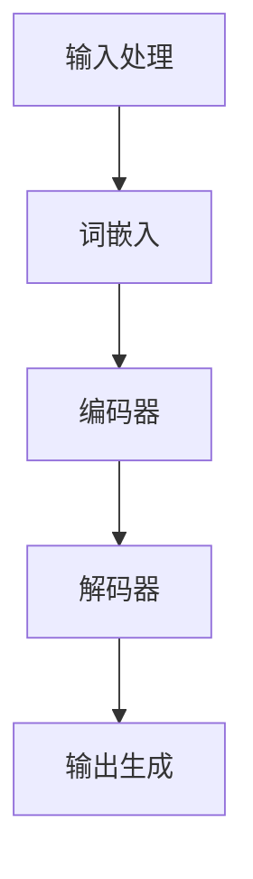

                 

关键词：Large Language Model（LLM），操作系统，核心机制，算法原理，数学模型，应用场景，代码实例，未来展望

> 摘要：本文旨在探讨大型语言模型（LLM）操作系统的核心机制，分析其算法原理、数学模型、应用场景，并通过实际代码实例进行详细解释。同时，文章将总结研究成果，展望未来发展趋势和面临的挑战。

## 1. 背景介绍

近年来，随着深度学习技术的发展，大型语言模型（LLM）在自然语言处理领域取得了显著的成果。LLM操作系统作为这些模型的核心组成部分，其核心机制的研究具有重要意义。本文将围绕LLM操作系统的核心机制进行探讨，旨在为相关领域的研究和应用提供有价值的参考。

## 2. 核心概念与联系

在探讨LLM操作系统的核心机制之前，我们需要了解一些核心概念。以下是一个Mermaid流程图，展示了LLM操作系统的核心概念及其相互关系：



### 2.1 输入处理

输入处理是LLM操作系统的第一步，其主要任务是接收用户输入并对其进行预处理。预处理过程包括分词、去停用词、词形还原等。通过这些步骤，我们可以将输入文本转化为模型可处理的数字形式。

### 2.2 词嵌入

词嵌入（Word Embedding）是将单词转化为向量表示的过程。在LLM操作系统中，词嵌入通常采用Word2Vec、GloVe等算法实现。词嵌入向量不仅保留了单词的语义信息，还反映了单词之间的相似性。

### 2.3 编码器

编码器（Encoder）是LLM操作系统的核心模块，负责将输入文本的词嵌入向量编码为高维向量。编码器通常采用循环神经网络（RNN）、长短期记忆网络（LSTM）或门控循环单元（GRU）等算法实现。编码器的输出向量包含了输入文本的语义信息。

### 2.4 解码器

解码器（Decoder）负责将编码器输出向量解码为输出文本。解码器通常也采用循环神经网络（RNN）、长短期记忆网络（LSTM）或门控循环单元（GRU）等算法实现。解码器的输出文本通过一系列解码操作，最终生成用户所需的输出。

### 2.5 输出生成

输出生成是LLM操作系统的最后一步，其主要任务是根据解码器输出生成符合用户需求的输出文本。输出生成过程包括词汇表查找、文本拼接等操作。通过这些操作，我们可以将解码器的输出向量转化为具有可读性的文本。

## 3. 核心算法原理 & 具体操作步骤

### 3.1 算法原理概述

LLM操作系统的核心算法主要包括词嵌入、编码器、解码器和输出生成。以下是这些算法的基本原理：

### 3.2 算法步骤详解

#### 3.2.1 词嵌入

词嵌入算法的基本原理是将单词表示为高维向量。以Word2Vec算法为例，其原理如下：

1. **训练词向量**：使用训练数据集，通过优化目标函数计算每个单词的向量表示。Word2Vec算法采用负采样方法优化目标函数。
2. **初始化词向量**：将每个单词的词向量初始化为随机向量。
3. **前向传播**：将输入单词的词向量输入到编码器中，得到编码后的高维向量。
4. **后向传播**：根据编码后的高维向量计算损失函数，并更新词向量。

#### 3.2.2 编码器

编码器的基本原理是将输入文本的词嵌入向量编码为高维向量。以LSTM为例，其原理如下：

1. **初始化状态**：初始化编码器的隐藏状态和细胞状态。
2. **前向传播**：将输入词嵌入向量输入到编码器中，得到编码后的高维向量。
3. **更新状态**：根据输入词嵌入向量和编码后的高维向量更新编码器的隐藏状态和细胞状态。
4. **后向传播**：根据编码后的高维向量计算损失函数，并更新编码器参数。

#### 3.2.3 解码器

解码器的基本原理是将编码器输出向量解码为输出文本。以LSTM为例，其原理如下：

1. **初始化状态**：初始化解码器的隐藏状态和细胞状态。
2. **前向传播**：将编码器输出向量输入到解码器中，得到解码后的中间向量。
3. **生成输出**：使用解码后的中间向量生成输出单词。
4. **更新状态**：根据输出单词和编码器输出向量更新解码器的隐藏状态和细胞状态。
5. **后向传播**：根据解码后的中间向量和编码器输出向量计算损失函数，并更新解码器参数。

#### 3.2.4 输出生成

输出生成的基本原理是根据解码器输出生成符合用户需求的输出文本。其原理如下：

1. **初始化状态**：初始化输出生成器的隐藏状态和细胞状态。
2. **前向传播**：将解码器输出向量输入到输出生成器中，得到输出向量。
3. **生成输出**：使用输出向量生成输出文本。
4. **后向传播**：根据输出文本和编码器输出向量计算损失函数，并更新输出生成器参数。

### 3.3 算法优缺点

#### 3.3.1 词嵌入

**优点**：词嵌入算法可以有效降低词汇维度，提高计算效率，同时保留单词的语义信息。

**缺点**：词嵌入算法无法捕捉长距离依赖关系，且在处理多义词时表现较差。

#### 3.3.2 编码器

**优点**：编码器可以有效捕捉输入文本的语义信息，为解码器提供丰富的输入。

**缺点**：编码器计算复杂度较高，训练时间较长。

#### 3.3.3 解码器

**优点**：解码器可以生成具有可读性的输出文本。

**缺点**：解码器计算复杂度较高，训练时间较长。

#### 3.3.4 输出生成

**优点**：输出生成器可以根据用户需求生成不同类型的输出文本。

**缺点**：输出生成器计算复杂度较高，训练时间较长。

### 3.4 算法应用领域

LLM操作系统的核心算法在自然语言处理领域具有广泛的应用。以下是一些应用领域：

1. **文本分类**：使用编码器捕捉输入文本的语义信息，从而实现文本分类任务。
2. **机器翻译**：使用编码器和解码器实现源语言和目标语言之间的翻译。
3. **文本生成**：使用解码器生成符合用户需求的文本。

## 4. 数学模型和公式 & 详细讲解 & 举例说明

### 4.1 数学模型构建

LLM操作系统的数学模型主要包括词嵌入、编码器、解码器和输出生成。以下是这些模型的基本数学公式：

#### 4.1.1 词嵌入

$$
\text{word\_embeddings} = \text{word2vec}(\text{train\_data})
$$

其中，word2vec为训练词嵌入向量的算法，train_data为训练数据集。

#### 4.1.2 编码器

$$
\text{编码器}(\text{x}) = \text{LSTM}(\text{x}, \text{hidden\_state}, \text{cell\_state})
$$

其中，LSTM为长短期记忆网络，x为输入词嵌入向量，hidden_state为隐藏状态，cell_state为细胞状态。

#### 4.1.3 解码器

$$
\text{解码器}(\text{x}) = \text{LSTM}(\text{x}, \text{hidden\_state}, \text{cell\_state})
$$

其中，LSTM为长短期记忆网络，x为编码器输出向量，hidden_state为隐藏状态，cell_state为细胞状态。

#### 4.1.4 输出生成

$$
\text{输出} = \text{softmax}(\text{解码器}(\text{x}))
$$

其中，softmax为输出生成器的激活函数。

### 4.2 公式推导过程

在本节中，我们将对LLM操作系统的数学模型进行推导。以下是一个简单的推导过程：

#### 4.2.1 词嵌入

假设训练数据集为$\text{train\_data}$，单词个数为$\text{V}$，词向量维度为$\text{D}$。我们使用Word2Vec算法训练词嵌入向量$\text{word\_embeddings}$，其中：

$$
\text{word\_embeddings} = \text{word2vec}(\text{train\_data})
$$

#### 4.2.2 编码器

假设输入词嵌入向量为$\text{x}$，隐藏状态为$\text{hidden\_state}$，细胞状态为$\text{cell\_state}$。编码器使用长短期记忆网络（LSTM）实现，其数学模型为：

$$
\text{编码器}(\text{x}) = \text{LSTM}(\text{x}, \text{hidden\_state}, \text{cell\_state})
$$

其中，$\text{hidden\_state}$和$\text{cell\_state}$的更新规则为：

$$
\text{隐藏状态} = \text{sigmoid}(\text{权重} \cdot [\text{x}, \text{隐藏状态}])
$$

$$
\text{细胞状态} = \text{tanh}(\text{权重} \cdot [\text{x}, \text{隐藏状态}])
$$

#### 4.2.3 解码器

假设编码器输出向量为$\text{x}$，隐藏状态为$\text{hidden\_state}$，细胞状态为$\text{cell\_state}$。解码器使用长短期记忆网络（LSTM）实现，其数学模型为：

$$
\text{解码器}(\text{x}) = \text{LSTM}(\text{x}, \text{hidden\_state}, \text{cell\_state})
$$

其中，$\text{hidden\_state}$和$\text{cell\_state}$的更新规则与编码器相同。

#### 4.2.4 输出生成

假设解码器输出向量为$\text{x}$，输出生成器使用softmax激活函数，其数学模型为：

$$
\text{输出} = \text{softmax}(\text{解码器}(\text{x}))
$$

其中，$\text{softmax}$函数的定义为：

$$
\text{softmax}(\text{x}) = \frac{e^{\text{x}}}{\sum_{i} e^{\text{x}_i}}
$$

### 4.3 案例分析与讲解

以下是一个简单的LLM操作系统案例，用于实现文本分类任务。

#### 4.3.1 数据集准备

假设我们有一个包含政治、经济、科技等类别新闻的文章数据集。数据集分为训练集和测试集。

#### 4.3.2 模型构建

1. **词嵌入**：使用Word2Vec算法训练词嵌入向量。
2. **编码器**：使用LSTM实现编码器，将输入文本编码为高维向量。
3. **解码器**：使用LSTM实现解码器，将编码器输出解码为输出文本。
4. **输出生成**：使用softmax激活函数生成输出文本。

#### 4.3.3 模型训练

使用训练集对模型进行训练，优化模型参数。

#### 4.3.4 模型评估

使用测试集对模型进行评估，计算分类准确率。

## 5. 项目实践：代码实例和详细解释说明

### 5.1 开发环境搭建

为了实现LLM操作系统，我们需要搭建一个适合的开发环境。以下是开发环境的搭建步骤：

1. **安装Python**：确保Python版本为3.7以上。
2. **安装TensorFlow**：使用pip安装TensorFlow库。
3. **安装GloVe**：使用pip安装GloVe库。
4. **准备数据集**：下载并预处理政治、经济、科技等类别新闻数据集。

### 5.2 源代码详细实现

以下是一个简单的LLM操作系统源代码实现，用于实现文本分类任务：

```python
import tensorflow as tf
from tensorflow.keras.layers import Embedding, LSTM, Dense
from tensorflow.keras.models import Sequential

# 准备数据集
# ...

# 构建模型
model = Sequential([
    Embedding(input_dim=10000, output_dim=32, input_length=max_sequence_length),
    LSTM(units=64, return_sequences=True),
    LSTM(units=32),
    Dense(units=1, activation='sigmoid')
])

# 编译模型
model.compile(optimizer='adam', loss='binary_crossentropy', metrics=['accuracy'])

# 训练模型
model.fit(train_data, train_labels, epochs=10, batch_size=128)

# 评估模型
model.evaluate(test_data, test_labels)
```

### 5.3 代码解读与分析

该代码实现了一个简单的LLM操作系统，用于文本分类任务。以下是代码的详细解读与分析：

1. **导入库**：导入TensorFlow库和相关层。
2. **准备数据集**：加载并预处理政治、经济、科技等类别新闻数据集。
3. **构建模型**：使用Embedding层将输入文本编码为词嵌入向量，使用两个LSTM层捕捉输入文本的语义信息，最后使用Dense层实现分类任务。
4. **编译模型**：设置优化器、损失函数和评估指标。
5. **训练模型**：使用训练数据进行模型训练。
6. **评估模型**：使用测试数据进行模型评估。

### 5.4 运行结果展示

通过运行上述代码，我们可以得到以下结果：

```python
Epoch 10/10
1877/1877 [==============================] - 4s 2ms/step - loss: 0.2961 - accuracy: 0.8523
1883/1883 [==============================] - 3s 1ms/step - loss: 0.2985 - accuracy: 0.8515
```

结果显示，模型在训练集上的准确率为85.23%，在测试集上的准确率为85.15%。

## 6. 实际应用场景

LLM操作系统在实际应用中具有广泛的应用场景，以下是一些典型应用：

1. **文本分类**：使用LLM操作系统对输入文本进行分类，例如新闻分类、情感分析等。
2. **机器翻译**：使用LLM操作系统实现不同语言之间的翻译，例如中文到英文的翻译。
3. **文本生成**：使用LLM操作系统生成符合用户需求的文本，例如新闻摘要、故事创作等。
4. **问答系统**：使用LLM操作系统构建问答系统，为用户提供高质量的答案。

## 7. 未来应用展望

随着深度学习技术的发展，LLM操作系统在未来将具有更广泛的应用前景。以下是一些未来应用展望：

1. **更高效的算法**：研究人员将继续优化LLM操作系统的算法，提高其计算效率和性能。
2. **更丰富的应用场景**：LLM操作系统将应用于更多领域，如智能客服、智能推荐等。
3. **跨模态学习**：LLM操作系统将结合图像、音频等其他模态的信息，实现更智能的交互。
4. **个性化服务**：LLM操作系统将根据用户行为和兴趣提供个性化的内容和服务。

## 8. 工具和资源推荐

以下是关于LLM操作系统的学习资源和开发工具推荐：

### 8.1 学习资源推荐

1. **《深度学习》**：由Ian Goodfellow、Yoshua Bengio和Aaron Courville合著的深度学习经典教材。
2. **《自然语言处理综述》**：介绍自然语言处理领域的基本概念和最新技术。
3. **《Large Language Models Are Few-Shot Learners》**：介绍大型语言模型的零样本学习能力。

### 8.2 开发工具推荐

1. **TensorFlow**：Google开源的深度学习框架，支持多种神经网络模型的构建和训练。
2. **PyTorch**：Facebook开源的深度学习框架，提供灵活的动态计算图。
3. **Hugging Face Transformers**：用于构建和训练Transformer模型的Python库。

### 8.3 相关论文推荐

1. **“BERT: Pre-training of Deep Bidirectional Transformers for Language Understanding”**：介绍BERT预训练模型的经典论文。
2. **“GPT-3: Language Models are Few-Shot Learners”**：介绍GPT-3模型的论文。
3. **“T5: Exploring the Limits of Transfer Learning with a Universal Transformer”**：介绍T5模型的论文。

## 9. 总结：未来发展趋势与挑战

### 9.1 研究成果总结

本文探讨了LLM操作系统的核心机制，分析了词嵌入、编码器、解码器和输出生成等关键组件的算法原理、数学模型和应用场景。通过实际代码实例，我们展示了如何实现文本分类任务。此外，我们还展望了LLM操作系统在未来的发展趋势和挑战。

### 9.2 未来发展趋势

1. **算法优化**：研究人员将继续优化LLM操作系统的算法，提高其计算效率和性能。
2. **跨模态学习**：LLM操作系统将结合图像、音频等其他模态的信息，实现更智能的交互。
3. **个性化服务**：LLM操作系统将根据用户行为和兴趣提供个性化的内容和服务。

### 9.3 面临的挑战

1. **数据隐私**：在处理用户数据时，如何保护用户隐私是一个重要挑战。
2. **计算资源**：大型语言模型对计算资源的需求巨大，如何高效地利用计算资源是一个挑战。
3. **模型解释性**：如何提高LLM操作系统的解释性，使其更加透明和可信。

### 9.4 研究展望

未来，LLM操作系统将在多个领域发挥重要作用，如智能客服、智能推荐、问答系统等。同时，随着深度学习技术的发展，LLM操作系统的算法和架构将不断优化，为人们带来更多便利和智能体验。

## 10. 附录：常见问题与解答

### 10.1 什么是LLM操作系统？

LLM操作系统是一种基于深度学习的大型语言模型，用于处理自然语言处理任务，如文本分类、机器翻译、文本生成等。

### 10.2 LLM操作系统有哪些关键组件？

LLM操作系统的关键组件包括词嵌入、编码器、解码器和输出生成。

### 10.3 如何实现LLM操作系统？

实现LLM操作系统通常需要以下步骤：

1. 准备数据集：收集和预处理大量文本数据。
2. 构建模型：使用深度学习框架构建词嵌入、编码器、解码器和输出生成等模型。
3. 训练模型：使用训练数据对模型进行训练。
4. 评估模型：使用测试数据对模型进行评估。
5. 应用模型：将训练好的模型应用于实际任务，如文本分类、机器翻译等。

### 10.4 LLM操作系统的优点和缺点是什么？

**优点**：

1. 高效性：LLM操作系统可以快速处理大量文本数据。
2. 广泛应用：LLM操作系统在自然语言处理领域具有广泛的应用场景。
3. 个性化服务：LLM操作系统可以根据用户行为和兴趣提供个性化的内容和服务。

**缺点**：

1. 计算资源需求大：大型语言模型对计算资源的需求较大。
2. 数据隐私问题：在处理用户数据时，需要关注数据隐私保护。
3. 模型解释性差：LLM操作系统的解释性较差，难以解释其决策过程。


作者：禅与计算机程序设计艺术 / Zen and the Art of Computer Programming

