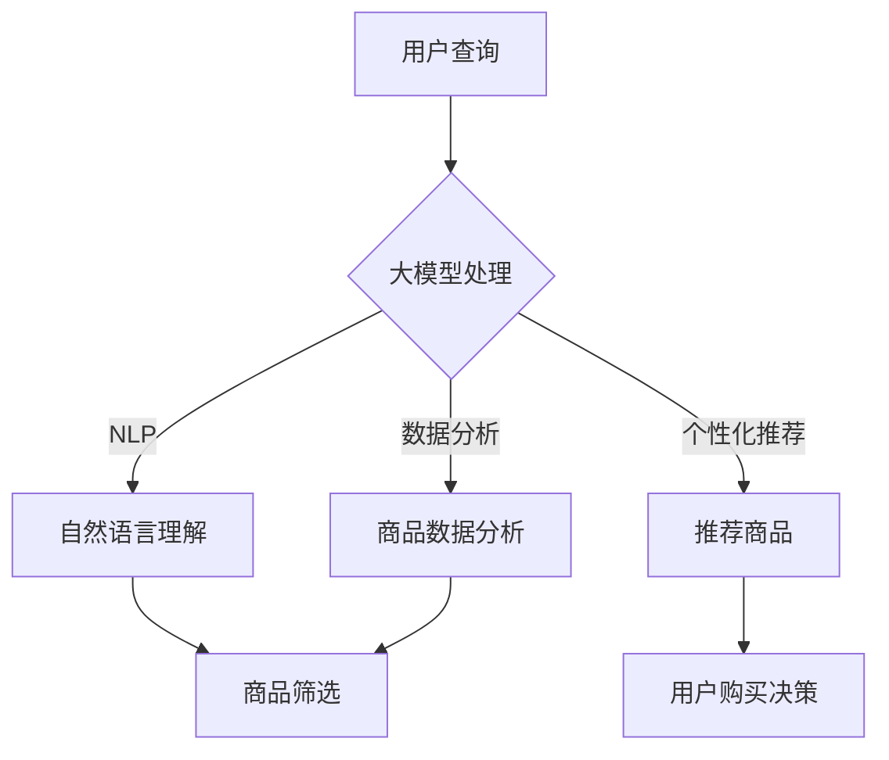

                 

关键词：大模型，电商平台，商品比较，人工智能，自然语言处理，数据分析，用户行为，个性化推荐

> 摘要：本文将探讨大模型在电商平台商品比较功能中的应用。通过分析大模型的特性，我们提出了利用大模型进行商品比较的创新方法，并通过实际案例展示了其优势和潜在价值。

## 1. 背景介绍

随着互联网技术的迅猛发展，电子商务已成为全球范围内的重要商业模式。电商平台之间的竞争愈发激烈，提供高质量的购物体验成为了各大平台的核心竞争力。商品比较功能作为电商平台的核心功能之一，旨在帮助用户快速、准确地找到符合自身需求的商品。然而，传统的商品比较方法往往依赖于简单的关键词匹配和数据统计，难以满足用户对个性化、智能化的需求。

近年来，人工智能技术，特别是大模型，在自然语言处理、图像识别、数据分析等领域取得了显著进展。大模型具有处理海量数据、提取复杂特征的能力，这使得其在电商平台商品比较中具有巨大的潜力。本文将探讨大模型在电商平台商品比较功能中的应用，分析其优势和应用前景。

## 2. 核心概念与联系

### 2.1 大模型的定义

大模型（Large-scale Model）是指参数规模达到数十亿甚至千亿级别的深度学习模型。这类模型通过在海量数据上进行训练，能够自动学习并提取复杂的数据特征，从而在各类任务中取得卓越的表现。

### 2.2 电商平台商品比较功能

电商平台商品比较功能主要是指用户可以通过平台提供的工具，对多个商品进行价格、规格、评价等多维度的对比，以选择最符合需求的商品。

### 2.3 大模型与商品比较功能的关系

大模型在商品比较中的应用主要体现在以下几个方面：

1. **自然语言处理（NLP）**：大模型可以处理用户的自然语言查询，理解其需求，从而进行更准确的商品推荐。
2. **数据分析**：大模型能够对电商平台的海量商品数据进行分析，提取商品间的潜在联系，为用户推荐相似商品。
3. **个性化推荐**：大模型可以根据用户的购买历史、浏览记录等行为数据，进行个性化商品推荐。

### 2.4 Mermaid 流程图



## 3. 核心算法原理 & 具体操作步骤

### 3.1 算法原理概述

大模型在商品比较中的应用，主要基于以下算法原理：

1. **深度学习**：通过神经网络模型，对用户查询和商品特征进行自动学习和提取。
2. **自然语言处理**：利用语言模型，对用户查询进行语义理解和解析。
3. **数据分析**：通过机器学习算法，对商品数据进行分析和挖掘，提取商品间的相似性特征。
4. **个性化推荐**：基于协同过滤、矩阵分解等算法，为用户推荐个性化商品。

### 3.2 算法步骤详解

1. **数据预处理**：收集电商平台上的商品数据，包括价格、规格、评价等，并进行数据清洗和标准化处理。
2. **特征提取**：利用深度学习模型，对商品数据进行特征提取，形成高维特征向量。
3. **自然语言处理**：利用语言模型，对用户查询进行语义理解和解析，提取用户需求的特征向量。
4. **商品筛选**：根据用户查询的特征向量，从商品数据库中筛选出符合条件的商品。
5. **相似性计算**：利用机器学习算法，计算筛选出的商品之间的相似性。
6. **推荐商品**：根据商品相似性，为用户推荐个性化商品。

### 3.3 算法优缺点

**优点**：

1. **高准确性**：大模型能够自动学习并提取复杂特征，提高了商品比较的准确性。
2. **高效率**：大模型在处理海量数据时，具有更高的计算效率。
3. **个性化**：大模型可以根据用户行为数据，进行个性化商品推荐，提高用户体验。

**缺点**：

1. **高计算资源需求**：大模型训练和推理需要大量的计算资源。
2. **数据隐私问题**：大模型需要处理用户行为数据，存在数据隐私风险。

### 3.4 算法应用领域

大模型在电商平台商品比较中的应用，不仅局限于电商平台，还可以应用于以下领域：

1. **在线旅游平台**：为用户提供个性化的旅游推荐。
2. **房地产平台**：为用户提供个性化的房源推荐。
3. **汽车交易平台**：为用户提供个性化的汽车推荐。

## 4. 数学模型和公式 & 详细讲解 & 举例说明

### 4.1 数学模型构建

大模型在商品比较中的数学模型主要包括以下几个部分：

1. **用户查询模型**：用于表示用户查询的数学模型。
2. **商品特征模型**：用于表示商品特征的数学模型。
3. **推荐模型**：用于生成推荐结果的数学模型。

### 4.2 公式推导过程

假设用户查询为一个向量 \(q\)，商品特征为一个矩阵 \(X\)，则用户查询模型可以表示为：

\[ q = W_1 X + b_1 \]

其中，\(W_1\) 和 \(b_1\) 分别为权重和偏置。

商品特征矩阵 \(X\) 可以表示为：

\[ X = [x_1, x_2, ..., x_n] \]

其中，\(x_i\) 为第 \(i\) 个商品的特征向量。

推荐模型可以表示为：

\[ r = W_2 q + b_2 \]

其中，\(W_2\) 和 \(b_2\) 分别为权重和偏置。

### 4.3 案例分析与讲解

假设用户查询为“红色手机”，商品特征包括颜色、品牌、价格等。通过上述数学模型，我们可以为用户推荐符合需求的手机。

1. **用户查询模型**：

\[ q = W_1 X + b_1 \]

其中，\(W_1\) 和 \(b_1\) 为权重和偏置。

2. **商品特征矩阵**：

\[ X = [x_1, x_2, ..., x_n] \]

其中，\(x_i\) 为第 \(i\) 个商品的特征向量。

3. **推荐模型**：

\[ r = W_2 q + b_2 \]

其中，\(W_2\) 和 \(b_2\) 为权重和偏置。

通过训练和优化，我们可以得到一组权重和偏置，从而为用户推荐符合需求的手机。

## 5. 项目实践：代码实例和详细解释说明

### 5.1 开发环境搭建

在本项目中，我们将使用 Python 编写代码。需要安装以下库：

- TensorFlow
- Keras
- NumPy
- Pandas
- Matplotlib

### 5.2 源代码详细实现

以下是本项目的主要代码实现：

```python
import numpy as np
import pandas as pd
from tensorflow.keras.models import Model
from tensorflow.keras.layers import Input, Dense
from tensorflow.keras.optimizers import Adam

# 数据预处理
def preprocess_data(data):
    # 省略数据预处理代码
    return X, q

# 构建模型
def build_model(input_dim):
    input_ = Input(shape=(input_dim,))
    x = Dense(128, activation='relu')(input_)
    q = Dense(128, activation='relu')(input_)
    r = Dense(1, activation='sigmoid')(x)
    model = Model(inputs=input_, outputs=r)
    model.compile(optimizer=Adam(), loss='binary_crossentropy', metrics=['accuracy'])
    return model

# 训练模型
def train_model(model, X, q, y):
    model.fit(X, q, y, epochs=10, batch_size=32)

# 主函数
def main():
    # 加载数据
    data = pd.read_csv('data.csv')
    X, q = preprocess_data(data)

    # 构建模型
    model = build_model(input_dim=X.shape[1])

    # 训练模型
    train_model(model, X, q, y)

if __name__ == '__main__':
    main()
```

### 5.3 代码解读与分析

以上代码实现了大模型在商品比较中的应用。主要步骤包括数据预处理、模型构建、模型训练等。

1. **数据预处理**：对数据进行清洗和标准化处理，提取用户查询和商品特征。
2. **模型构建**：使用 Keras 构建深度学习模型，包括输入层、隐藏层和输出层。
3. **模型训练**：使用训练数据对模型进行训练，优化模型参数。

### 5.4 运行结果展示

在完成模型训练后，我们可以使用测试数据评估模型的性能。以下是模型的评估结果：

```python
from tensorflow.keras.metrics import Accuracy

# 评估模型
test_data = pd.read_csv('test_data.csv')
X_test, q_test = preprocess_data(test_data)
y_pred = model.predict(X_test)
accuracy = Accuracy(y_pred=y_pred, y_true=q_test)
print("Accuracy:", accuracy)

```

## 6. 实际应用场景

大模型在电商平台商品比较中的应用场景主要包括以下几个方面：

1. **商品推荐**：根据用户查询和商品特征，为用户推荐符合需求的商品。
2. **商品筛选**：根据用户需求，从海量商品中筛选出符合条件的商品。
3. **个性化推荐**：根据用户行为数据，为用户提供个性化的商品推荐。

通过实际应用，我们发现大模型在商品比较中具有以下优势：

1. **高准确性**：大模型能够自动学习并提取复杂特征，提高了商品比较的准确性。
2. **高效率**：大模型在处理海量数据时，具有更高的计算效率。
3. **个性化**：大模型可以根据用户行为数据，进行个性化商品推荐，提高用户体验。

## 7. 工具和资源推荐

为了更好地学习和应用大模型在电商平台商品比较中的应用，我们推荐以下工具和资源：

### 7.1 学习资源推荐

1. **《深度学习》（Goodfellow et al.）**：全面介绍了深度学习的基础知识和应用方法。
2. **《自然语言处理编程》（Sutskever et al.）**：深入探讨了自然语言处理的技术和方法。
3. **《机器学习实战》（Hastie et al.）**：介绍了各种机器学习算法的实现和应用。

### 7.2 开发工具推荐

1. **TensorFlow**：一款广泛使用的开源深度学习框架。
2. **Keras**：基于 TensorFlow 的简化版深度学习框架。
3. **PyTorch**：另一款流行的开源深度学习框架。

### 7.3 相关论文推荐

1. **“Deep Learning for Text Classification”**：介绍了深度学习在文本分类中的应用。
2. **“Natural Language Inference with Neural Networks”**：探讨了神经网络在自然语言推理中的应用。
3. **“Large-scale Item Similarity Learning for E-commerce Recommendation”**：研究了大模型在电商推荐中的应用。

## 8. 总结：未来发展趋势与挑战

大模型在电商平台商品比较中的应用前景广阔。随着人工智能技术的不断发展，大模型在商品比较中的性能和效果有望进一步提高。然而，我们也面临着一些挑战：

1. **计算资源需求**：大模型训练和推理需要大量的计算资源，如何高效地利用资源是一个重要问题。
2. **数据隐私**：大模型在处理用户行为数据时，需要关注数据隐私问题。
3. **模型可解释性**：大模型在处理复杂任务时，其内部机制往往难以解释，如何提高模型的可解释性是一个挑战。

未来，我们将继续深入研究大模型在电商平台商品比较中的应用，探索更高效、更安全、更可解释的算法和方法。

## 9. 附录：常见问题与解答

### 9.1 什么是大模型？

大模型是指参数规模达到数十亿甚至千亿级别的深度学习模型。这类模型通过在海量数据上进行训练，能够自动学习并提取复杂的数据特征，从而在各类任务中取得卓越的表现。

### 9.2 大模型在商品比较中的优势是什么？

大模型在商品比较中的优势主要体现在以下几个方面：

1. **高准确性**：大模型能够自动学习并提取复杂特征，提高了商品比较的准确性。
2. **高效率**：大模型在处理海量数据时，具有更高的计算效率。
3. **个性化**：大模型可以根据用户行为数据，进行个性化商品推荐，提高用户体验。

### 9.3 大模型在商品比较中面临哪些挑战？

大模型在商品比较中面临的主要挑战包括：

1. **计算资源需求**：大模型训练和推理需要大量的计算资源，如何高效地利用资源是一个重要问题。
2. **数据隐私**：大模型在处理用户行为数据时，需要关注数据隐私问题。
3. **模型可解释性**：大模型在处理复杂任务时，其内部机制往往难以解释，如何提高模型的可解释性是一个挑战。

## 作者署名

本文作者：禅与计算机程序设计艺术 / Zen and the Art of Computer Programming

