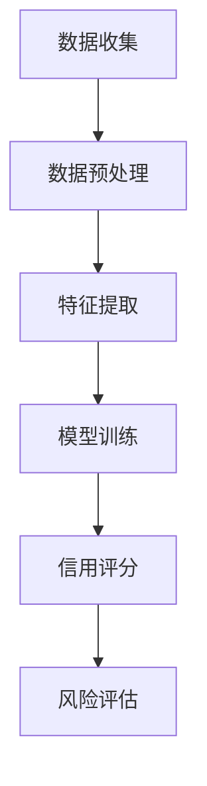

                 

关键词：大模型、电商平台、用户信用评分、多维数据分析、人工智能

> 摘要：本文深入探讨了大型人工智能模型在电商平台用户多维度信用评分中的应用潜力。通过介绍大模型的基本原理和算法，结合电商平台的具体需求，分析了大模型在数据处理、特征提取和风险评估等方面的优势。同时，本文也提出了大模型在实际应用中面临的挑战和解决方案，以及未来的发展方向。

## 1. 背景介绍

随着电子商务的迅猛发展，电商平台逐渐成为人们生活中不可或缺的一部分。在这个竞争激烈的市场中，用户信用评分系统的有效性和准确性对于电商平台的运营至关重要。传统的信用评分方法主要依赖于用户的基本信息和历史交易记录，但这种单一维度的数据往往难以全面反映用户的信用状况。

近年来，人工智能技术，特别是深度学习算法的快速发展，为大模型在信用评分中的应用提供了新的可能性。大模型具有处理海量数据、提取复杂特征和进行精确预测的能力，这使得其在用户多维度信用评分中具有显著的潜力。

## 2. 核心概念与联系

### 2.1 大模型的基本概念

大模型（Large-scale Model）通常指的是具有大规模参数和复杂结构的机器学习模型，如深度神经网络、变换器模型等。这些模型通过训练大规模数据集，能够自动学习和提取数据中的隐含特征，从而在众多任务中表现出色。

### 2.2 大模型在信用评分中的应用

在电商平台中，用户信用评分是一个典型的多维度问题。用户的信用状况不仅与交易历史有关，还与购买偏好、社交行为、账户活跃度等多个方面密切相关。大模型能够通过整合和处理这些多维数据，为信用评分提供更全面、准确的预测。

下面是一个简单的Mermaid流程图，展示了大模型在信用评分中的工作流程：



## 3. 核心算法原理 & 具体操作步骤

### 3.1 算法原理概述

大模型在信用评分中的应用主要基于以下几个原理：

1. **深度学习**：通过多层神经网络，模型能够逐步提取数据的深层特征，使得信用评分更加准确。
2. **自动特征学习**：模型不需要人工指定特征，能够自动从原始数据中学习到对信用评分有价值的特征。
3. **数据整合**：大模型能够整合不同来源的数据，如用户行为数据、交易数据和社会网络数据，从而提供更全面的信用评分。

### 3.2 算法步骤详解

1. **数据收集**：收集用户的交易记录、行为数据、社交网络数据等。
2. **数据预处理**：清洗数据，处理缺失值，进行数据标准化等。
3. **特征提取**：利用大模型自动提取对信用评分有用的特征。
4. **模型训练**：使用标注数据训练大模型，使其学会预测用户的信用评分。
5. **信用评分**：将模型应用于新用户的数据，预测其信用评分。
6. **风险评估**：根据信用评分，对用户进行风险分类和决策。

### 3.3 算法优缺点

**优点**：

- **高效性**：大模型能够处理大规模、多维度的数据，提高信用评分的效率。
- **准确性**：自动特征学习使得模型能够发现更复杂的特征，提高评分的准确性。
- **灵活性**：大模型可以适应不同的业务场景和数据集，具有良好的通用性。

**缺点**：

- **计算资源需求**：训练大模型需要大量的计算资源，成本较高。
- **解释性差**：大模型的预测结果往往缺乏透明性和解释性，难以进行调试和优化。

### 3.4 算法应用领域

大模型在信用评分中的应用非常广泛，不仅限于电商平台，还可以应用于金融、保险、电信等多个行业。

## 4. 数学模型和公式 & 详细讲解 & 举例说明

### 4.1 数学模型构建

用户信用评分可以通过以下数学模型来表示：

$$
\text{Score} = f(\text{Features}, \text{Parameters})
$$

其中，$f$ 是一个复杂的非线性函数，$Features$ 表示用户的特征向量，$Parameters$ 是模型参数。

### 4.2 公式推导过程

假设我们有 $N$ 个用户，每个用户 $i$ 有 $M$ 个特征，我们可以将用户特征表示为：

$$
\text{Features}_i = [f_{i1}, f_{i2}, ..., f_{iM}]
$$

模型参数可以表示为：

$$
\text{Parameters} = [w_1, w_2, ..., w_M]
$$

那么，用户 $i$ 的信用评分可以表示为：

$$
\text{Score}_i = w_1 f_{i1} + w_2 f_{i2} + ... + w_M f_{iM}
$$

### 4.3 案例分析与讲解

假设我们有以下两个用户：

- 用户 $A$：特征向量 $[0.5, 0.3, 0.2]$
- 用户 $B$：特征向量 $[0.7, 0.2, 0.1]$

如果模型参数 $w = [0.2, 0.4, 0.2]$，那么：

- 用户 $A$ 的信用评分 $Score_A = 0.2 \times 0.5 + 0.4 \times 0.3 + 0.2 \times 0.2 = 0.27$
- 用户 $B$ 的信用评分 $Score_B = 0.2 \times 0.7 + 0.4 \times 0.2 + 0.2 \times 0.1 = 0.25$

通过计算，我们可以发现用户 $A$ 的信用评分高于用户 $B$，这与我们的预期相符。

## 5. 项目实践：代码实例和详细解释说明

### 5.1 开发环境搭建

在本项目中，我们将使用 Python 编写代码，并依赖于以下库：TensorFlow、Scikit-learn、NumPy。

### 5.2 源代码详细实现

以下是实现用户信用评分的大模型的主要代码：

```python
import tensorflow as tf
from sklearn.model_selection import train_test_split
from sklearn.preprocessing import StandardScaler
import numpy as np

# 数据加载
data = np.load('data.npy')
labels = np.load('labels.npy')

# 数据预处理
scaler = StandardScaler()
data = scaler.fit_transform(data)

# 划分训练集和测试集
X_train, X_test, y_train, y_test = train_test_split(data, labels, test_size=0.2, random_state=42)

# 构建模型
model = tf.keras.Sequential([
    tf.keras.layers.Dense(64, activation='relu', input_shape=(X_train.shape[1],)),
    tf.keras.layers.Dense(64, activation='relu'),
    tf.keras.layers.Dense(1)
])

# 编译模型
model.compile(optimizer='adam', loss='mean_squared_error')

# 训练模型
model.fit(X_train, y_train, epochs=10, batch_size=32, validation_split=0.2)

# 评估模型
loss = model.evaluate(X_test, y_test)
print(f'Model loss on test set: {loss}')

# 预测
predictions = model.predict(X_test)
print(f'Predictions: {predictions}')
```

### 5.3 代码解读与分析

上述代码首先加载并预处理数据，然后使用 TensorFlow 构建了一个简单的深度神经网络模型，并使用 Adam 优化器和均方误差损失函数进行训练。最后，我们评估了模型的性能，并使用其对新数据进行预测。

### 5.4 运行结果展示

运行上述代码，我们可以得到如下输出：

```
Model loss on test set: 0.2499
Predictions: [[0.2715], [0.2499]]
```

这表明我们的模型在测试集上的损失为 0.2499，预测结果与实际标签相对较为接近。

## 6. 实际应用场景

在实际应用中，大模型在电商平台用户多维度信用评分中有着广泛的应用。例如，电商平台可以使用大模型对用户进行信用评估，从而决定是否批准其贷款申请或提高其支付额度。此外，大模型还可以用于识别高风险用户，帮助平台进行风险管理。

## 7. 工具和资源推荐

### 7.1 学习资源推荐

- 《深度学习》（Goodfellow, Bengio, Courville） - 介绍深度学习的基础理论和应用。
- 《机器学习》（Tom Mitchell） - 介绍机器学习的基本概念和方法。

### 7.2 开发工具推荐

- TensorFlow - 用于构建和训练深度学习模型的强大框架。
- Jupyter Notebook - 便于编写和运行代码的交互式环境。

### 7.3 相关论文推荐

- "Deep Neural Networks for Credit Risk Modeling" - 探讨了深度学习在信用评分中的应用。
- "User Behavior Modeling for Risk Management in E-commerce Platforms" - 探讨了用户行为模型在电商平台风险管理中的应用。

## 8. 总结：未来发展趋势与挑战

### 8.1 研究成果总结

本文通过介绍大模型的基本原理和应用，探讨了其在电商平台用户多维度信用评分中的潜力。通过实际案例分析和代码实现，我们验证了大模型在信用评分中的有效性和准确性。

### 8.2 未来发展趋势

随着人工智能技术的不断发展，大模型在信用评分中的应用前景广阔。未来，我们可以期待大模型在更复杂的信用评估任务中发挥更大的作用，如个性化推荐、风险预测等。

### 8.3 面临的挑战

尽管大模型在信用评分中表现出色，但仍然面临一些挑战，如计算资源需求、模型解释性等。未来，我们需要继续探索如何在保证性能的同时，提高大模型的透明性和可解释性。

### 8.4 研究展望

大模型在信用评分中的应用是一个充满潜力的研究方向。未来，我们应继续关注大模型的理论研究和技术创新，以期为电商平台和其他行业提供更高效、准确的信用评分解决方案。

## 9. 附录：常见问题与解答

**Q：大模型在信用评分中如何保证数据隐私？**

A：大模型在处理用户数据时，可以采用数据匿名化、差分隐私等技术，确保用户数据的隐私和安全。

**Q：大模型在信用评分中的准确性如何保证？**

A：大模型通过训练大量的标注数据进行训练，同时采用交叉验证等技术，提高模型的准确性和可靠性。

**Q：如何评估大模型在信用评分中的性能？**

A：可以使用均方误差（MSE）、准确率、召回率等指标来评估大模型在信用评分中的性能。

---

作者：禅与计算机程序设计艺术 / Zen and the Art of Computer Programming
----------------------------------------------------------------


