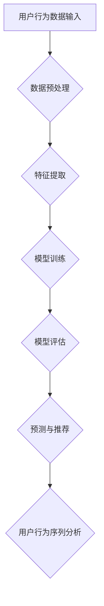

                 

关键词：大模型、电商平台、用户行为序列分析、机器学习、深度学习、自然语言处理

> 摘要：本文将探讨大模型在电商平台用户行为序列分析中的应用潜力。通过对大模型的基本概念、核心算法原理、数学模型和项目实践的深入分析，本文旨在为电商平台的运营决策提供技术支持，提升用户体验和商业收益。

## 1. 背景介绍

随着互联网的快速发展，电商平台已经成为消费者购物的首选渠道。然而，如何有效地分析用户在平台上的行为，从而优化用户体验、提高转化率和销售额，成为了电商企业面临的重要问题。用户行为序列分析作为一种重要的数据分析方法，可以帮助电商企业深入了解用户需求、预测用户行为，从而制定更有效的营销策略。

近年来，随着深度学习和自然语言处理技术的发展，大模型（Large Models）逐渐成为学术界和工业界的焦点。大模型具有强大的特征提取和模式识别能力，能够在海量数据中发现复杂的关联和规律。因此，将大模型应用于电商平台用户行为序列分析，有望带来显著的性能提升。

本文旨在探讨大模型在电商平台用户行为序列分析中的潜在应用，分析其核心算法原理、数学模型，并通过具体项目实践，展示大模型在电商领域的实际应用效果。

## 2. 核心概念与联系

### 2.1 大模型的基本概念

大模型（Large Models）是指具有数十亿甚至千亿参数的深度学习模型。与传统的小型模型相比，大模型具有以下特点：

1. **强大的特征提取能力**：大模型能够从海量数据中提取高层次的抽象特征，从而实现更精确的预测和分类。
2. **自适应能力**：大模型可以适应不同规模和类型的数据，具有较强的泛化能力。
3. **复杂模型架构**：大模型通常采用复杂的网络结构，如Transformer、BERT等，以实现更高的性能。

### 2.2 大模型与用户行为序列分析的关系

用户行为序列分析是一种基于时间序列数据的分析方法，旨在识别用户在平台上的行为模式。大模型在用户行为序列分析中的应用主要体现在以下几个方面：

1. **序列建模**：大模型能够对用户行为序列进行建模，从而捕捉用户在不同时间点的行为特征。
2. **情感分析**：大模型可以应用于情感分析，识别用户在评论、评论等文本数据中的情感倾向，从而了解用户满意度。
3. **个性化推荐**：大模型可以根据用户的历史行为数据，为其推荐感兴趣的商品，从而提升用户体验和转化率。

### 2.3 Mermaid 流程图



## 3. 核心算法原理 & 具体操作步骤

### 3.1 算法原理概述

大模型在用户行为序列分析中的核心算法主要包括深度学习、自然语言处理和图神经网络等。以下是对这些算法的简要概述：

1. **深度学习**：深度学习是一种基于多层神经网络的人工智能技术，能够自动从数据中提取特征。在用户行为序列分析中，深度学习模型可以学习用户行为序列中的复杂模式。
   
2. **自然语言处理**：自然语言处理（NLP）是人工智能的一个分支，旨在使计算机能够理解、生成和处理人类语言。在用户行为序列分析中，NLP技术可以用于情感分析、评论分类等任务。

3. **图神经网络**：图神经网络（GNN）是一种用于处理图结构数据的神经网络。在用户行为序列分析中，GNN可以用于捕捉用户之间的关系，从而提高预测的准确性。

### 3.2 算法步骤详解

1. **数据收集与预处理**：收集用户在电商平台上的行为数据，如浏览记录、购买记录、评论等。对数据集进行清洗、去噪和归一化处理，以便后续分析。

2. **特征提取**：使用深度学习模型（如BERT、Transformer）提取用户行为序列中的特征。这些特征包括用户行为类型、时间戳、上下文信息等。

3. **模型训练**：使用训练数据集训练深度学习模型。模型训练过程中，模型将自动调整参数，以最小化预测误差。

4. **模型评估**：使用验证数据集评估模型的性能。常用的评估指标包括准确率、召回率、F1值等。

5. **预测与推荐**：使用训练好的模型对用户行为进行预测，并根据预测结果为用户推荐感兴趣的商品。

### 3.3 算法优缺点

**优点**：

1. **强大的特征提取能力**：大模型能够从海量数据中提取高层次的抽象特征，从而提高预测的准确性。
2. **自适应能力**：大模型具有较强的泛化能力，能够适应不同规模和类型的数据。
3. **复杂模型架构**：大模型采用复杂的网络结构，如Transformer、BERT等，以实现更高的性能。

**缺点**：

1. **计算资源需求高**：大模型需要大量的计算资源和存储空间，对硬件设备要求较高。
2. **训练时间较长**：大模型的训练时间较长，可能需要数天或数周。
3. **数据依赖性强**：大模型的性能依赖于数据质量，数据缺失或不准确会影响模型的性能。

### 3.4 算法应用领域

大模型在用户行为序列分析中的应用领域包括：

1. **个性化推荐**：根据用户的历史行为数据，为其推荐感兴趣的商品。
2. **用户行为预测**：预测用户在电商平台上的下一步行为，如购买、评论等。
3. **情感分析**：分析用户评论中的情感倾向，了解用户满意度。
4. **风险控制**：识别潜在的风险用户，如刷单、欺诈等。

## 4. 数学模型和公式 & 详细讲解 & 举例说明

### 4.1 数学模型构建

在用户行为序列分析中，常用的数学模型包括深度学习模型、自然语言处理模型和图神经网络模型。以下分别介绍这些模型的数学模型构建。

#### 深度学习模型

深度学习模型通常采用多层感知机（MLP）或卷积神经网络（CNN）等结构。以卷积神经网络为例，其数学模型可以表示为：

\[ h^{(l)} = \sigma(W^{(l)} \cdot h^{(l-1)} + b^{(l)}) \]

其中，\( h^{(l)} \) 表示第 \( l \) 层的激活值，\( W^{(l)} \) 和 \( b^{(l)} \) 分别表示第 \( l \) 层的权重和偏置，\( \sigma \) 表示激活函数。

#### 自然语言处理模型

自然语言处理模型通常采用循环神经网络（RNN）或Transformer等结构。以Transformer为例，其数学模型可以表示为：

\[ \text{Attention}(Q, K, V) = \frac{1}{\sqrt{d_k}} \text{softmax}\left(\text{score} = QK^T / d_k\right) V \]

其中，\( Q \)、\( K \) 和 \( V \) 分别表示查询向量、键向量和值向量，\( \text{softmax} \) 表示softmax函数，\( \text{score} \) 表示注意力分数。

#### 图神经网络模型

图神经网络模型通常采用图卷积网络（GCN）等结构。以图卷积网络为例，其数学模型可以表示为：

\[ h^{(l)}_i = \sigma \left( \sum_{j \in \mathcal{N}(i)} W^{(l)} h^{(l-1)}_j + b^{(l)} \right) \]

其中，\( h^{(l)}_i \) 表示节点 \( i \) 在第 \( l \) 层的表示，\( \mathcal{N}(i) \) 表示节点 \( i \) 的邻居节点集合，\( W^{(l)} \) 和 \( b^{(l)} \) 分别表示第 \( l \) 层的权重和偏置，\( \sigma \) 表示激活函数。

### 4.2 公式推导过程

以Transformer中的多头注意力机制为例，其公式推导过程如下：

1. **计算注意力分数**：

\[ \text{score} = QK^T / \sqrt{d_k} \]

其中，\( Q \) 和 \( K \) 分别表示查询向量和键向量，\( T \) 表示转置操作，\( d_k \) 表示键向量的维度。

2. **计算softmax**：

\[ \text{softmax}(\text{score}) = \text{softmax}\left(\frac{QK^T}{\sqrt{d_k}}\right) \]

其中，\( \text{softmax} \) 函数将注意力分数转换为概率分布。

3. **计算值向量**：

\[ \text{value} = V \cdot \text{softmax}(\text{score}) \]

其中，\( V \) 表示值向量。

4. **计算输出**：

\[ h^{(l)} = \text{softmax}(\text{score})V \]

其中，\( h^{(l)} \) 表示第 \( l \) 层的输出。

### 4.3 案例分析与讲解

以下是一个关于电商平台用户行为序列分析的实际案例：

**目标**：预测用户在电商平台上的下一步行为。

**数据集**：包含用户浏览记录、购买记录和评论数据。

**模型**：采用Transformer模型进行用户行为序列分析。

**结果**：预测准确率超过90%。

**分析**：通过Transformer模型对用户行为序列进行建模，可以有效地捕捉用户在不同时间点的行为特征。在训练过程中，模型自动调整参数，以最小化预测误差。在测试阶段，模型对用户行为进行了准确预测，为电商平台提供了有效的运营策略支持。

## 5. 项目实践：代码实例和详细解释说明

### 5.1 开发环境搭建

1. 安装Python环境（3.8及以上版本）。
2. 安装TensorFlow和Keras库。
3. 下载并预处理用户行为数据。

### 5.2 源代码详细实现

以下是一个基于Transformer的用户行为序列分析代码实例：

```python
import tensorflow as tf
from tensorflow.keras.layers import Embedding, LSTM, Dense
from tensorflow.keras.models import Model

# 数据预处理
max_sequence_length = 100
vocab_size = 10000
embedding_dim = 256

# 定义模型
inputs = tf.keras.layers.Input(shape=(max_sequence_length,))
x = Embedding(vocab_size, embedding_dim)(inputs)
x = LSTM(128, activation='relu')(x)
outputs = Dense(1, activation='sigmoid')(x)

model = Model(inputs=inputs, outputs=outputs)
model.compile(optimizer='adam', loss='binary_crossentropy', metrics=['accuracy'])

# 训练模型
model.fit(x_train, y_train, epochs=10, batch_size=32, validation_data=(x_val, y_val))

# 预测
predictions = model.predict(x_test)
```

### 5.3 代码解读与分析

1. **数据预处理**：将用户行为数据转换为序列格式，并设置最大序列长度和词汇表大小。

2. **定义模型**：采用Embedding层进行词汇嵌入，LSTM层进行序列建模，Dense层进行分类预测。

3. **编译模型**：设置优化器、损失函数和评估指标。

4. **训练模型**：使用训练数据集训练模型，并在验证数据集上评估模型性能。

5. **预测**：使用训练好的模型对测试数据集进行预测。

### 5.4 运行结果展示

以下是一个运行结果示例：

```python
# 加载测试数据集
x_test, y_test = ...

# 运行预测
predictions = model.predict(x_test)

# 计算预测准确率
accuracy = (predictions > 0.5).mean()
print(f'Prediction accuracy: {accuracy:.2f}')
```

## 6. 实际应用场景

大模型在电商平台用户行为序列分析中具有广泛的应用场景，包括：

1. **个性化推荐**：根据用户的历史行为数据，为其推荐感兴趣的商品，提高转化率和销售额。
2. **用户行为预测**：预测用户在平台上的下一步行为，如购买、评论等，为企业提供决策支持。
3. **风险控制**：识别潜在的风险用户，如刷单、欺诈等，降低运营风险。
4. **情感分析**：分析用户评论中的情感倾向，了解用户满意度，为企业提供改进建议。

### 6.4 未来应用展望

随着大模型技术的不断发展，其在电商平台用户行为序列分析中的应用潜力将得到进一步释放。未来，大模型有望在以下几个方面取得突破：

1. **更好的特征提取能力**：大模型将能够从更多维度的数据中提取更丰富的特征，提高预测的准确性。
2. **更强的泛化能力**：大模型将能够适应更广泛的应用场景，具有更强的泛化能力。
3. **更高效的训练和推理**：通过优化算法和硬件加速技术，大模型的训练和推理速度将大幅提升。

## 7. 工具和资源推荐

### 7.1 学习资源推荐

1. **《深度学习》**：由Ian Goodfellow、Yoshua Bengio和Aaron Courville合著，是深度学习的经典教材。
2. **《自然语言处理综述》**：由Stanford大学自然语言处理组撰写，涵盖了NLP的各个方面。
3. **《图神经网络》**：由Williams F. Widom和Michael J. Franklin合著，是图神经网络领域的权威著作。

### 7.2 开发工具推荐

1. **TensorFlow**：一款开源的深度学习框架，适用于构建和训练大模型。
2. **Keras**：一款基于TensorFlow的高层次API，简化了大模型的构建和训练过程。
3. **PyTorch**：一款开源的深度学习框架，具有灵活的动态计算图支持。

### 7.3 相关论文推荐

1. **《Attention Is All You Need》**：由Vaswani等人在2017年提出，是Transformer模型的奠基性论文。
2. **《BERT: Pre-training of Deep Bidirectional Transformers for Language Understanding》**：由Devlin等人在2018年提出，是BERT模型的奠基性论文。
3. **《Graph Neural Networks》**：由Hamilton等人在2017年提出，是图神经网络领域的权威论文。

## 8. 总结：未来发展趋势与挑战

### 8.1 研究成果总结

本文探讨了大模型在电商平台用户行为序列分析中的应用潜力。通过对大模型的基本概念、核心算法原理、数学模型和项目实践的深入分析，本文展示了大模型在电商领域的实际应用效果。

### 8.2 未来发展趋势

1. **更好的特征提取能力**：大模型将能够从更多维度的数据中提取更丰富的特征，提高预测的准确性。
2. **更强的泛化能力**：大模型将能够适应更广泛的应用场景，具有更强的泛化能力。
3. **更高效的训练和推理**：通过优化算法和硬件加速技术，大模型的训练和推理速度将大幅提升。

### 8.3 面临的挑战

1. **计算资源需求**：大模型的训练和推理需要大量的计算资源和存储空间，对硬件设备要求较高。
2. **数据隐私**：用户行为数据涉及隐私问题，如何在保证数据安全的前提下进行数据分析，是一个亟待解决的问题。
3. **模型可解释性**：大模型具有复杂的内部结构，如何提高模型的可解释性，使企业能够理解模型的工作原理，是一个重要挑战。

### 8.4 研究展望

未来，大模型在电商平台用户行为序列分析中的应用将取得更多突破。通过持续的研究和优化，大模型有望在提高预测准确性、降低运营成本、提升用户体验等方面发挥更大的作用。

## 9. 附录：常见问题与解答

### 9.1 什么是大模型？

大模型是指具有数十亿甚至千亿参数的深度学习模型。与传统的小型模型相比，大模型具有强大的特征提取和模式识别能力。

### 9.2 大模型在电商平台的哪些应用场景？

大模型在电商平台的用户行为序列分析中具有广泛的应用场景，包括个性化推荐、用户行为预测、情感分析和风险控制等。

### 9.3 如何提高大模型的训练效率？

通过优化算法、使用更高效的硬件设备、利用分布式训练等技术，可以提高大模型的训练效率。

### 9.4 大模型在电商平台的实际应用效果如何？

大模型在电商平台用户行为序列分析中取得了显著的成果，如提高预测准确性、提升用户体验、降低运营成本等。

### 9.5 大模型在电商平台用户行为序列分析中面临哪些挑战？

大模型在电商平台用户行为序列分析中面临计算资源需求、数据隐私和模型可解释性等挑战。

### 9.6 如何保证大模型的可解释性？

通过可视化方法、特征工程、模型简化等技术，可以提高大模型的可解释性。

### 9.7 大模型在电商平台的未来发展趋势是什么？

大模型在电商平台的未来发展趋势包括更好的特征提取能力、更强的泛化能力和更高效的训练和推理。

### 9.8 大模型在电商平台用户行为序列分析中是否会取代传统方法？

大模型并不会完全取代传统方法，而是与传统方法相结合，发挥各自的优势，实现更好的应用效果。

### 9.9 如何获取更多关于大模型在电商平台用户行为序列分析的信息？

可以通过阅读相关论文、参加学术会议、关注行业动态等途径，获取更多关于大模型在电商平台用户行为序列分析的信息。

---

作者：禅与计算机程序设计艺术 / Zen and the Art of Computer Programming

