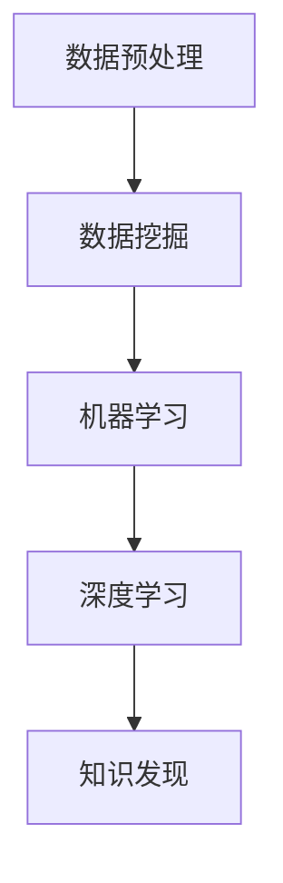

                 

关键词：知识发现，人工智能，计算智力，创新，技术发展，算法优化，应用领域

> 摘要：本文探讨了人类计算智力在推动知识发现与创新中的重要作用。通过阐述核心概念、算法原理、数学模型以及实际应用，文章分析了计算智力在各个领域的应用前景，并对未来发展趋势与挑战进行了展望。

## 1. 背景介绍

知识发现（Knowledge Discovery in Databases，KDD）是指从大量数据中提取有用信息和知识的过程。这一过程涵盖了数据预处理、数据挖掘、模式识别等多个环节。随着互联网的普及和大数据技术的发展，知识发现已经成为推动各个领域创新的重要动力。

计算智力（Computational Intelligence，CI）是指利用计算机和算法解决复杂问题的能力。它涵盖了人工智能、机器学习、数据挖掘等多个领域。计算智力通过模拟人类思维过程，实现了对海量数据的处理和分析，从而为知识发现提供了强有力的支持。

本文旨在探讨人类计算智力在推动知识发现与创新中的贡献，分析其核心概念、算法原理、数学模型及其在不同领域的应用。

## 2. 核心概念与联系

### 2.1 数据挖掘

数据挖掘（Data Mining）是指从大量数据中自动发现规律和知识的过程。其核心目标是构建预测模型、分类模型、聚类模型等，以支持决策制定和预测分析。

### 2.2 机器学习

机器学习（Machine Learning，ML）是一种通过数据和算法来发现数据模式并自动改进性能的方法。机器学习可以分为监督学习、无监督学习和强化学习三类。监督学习通过已知数据训练模型，无监督学习通过未标注的数据发现模式，强化学习则通过试错来优化行为。

### 2.3 深度学习

深度学习（Deep Learning，DL）是一种基于人工神经网络的机器学习方法。它通过多层神经网络对数据进行特征提取和建模，能够在图像识别、语音识别、自然语言处理等任务中取得出色的性能。

### 2.4 Mermaid 流程图



## 3. 核心算法原理 & 具体操作步骤

### 3.1 算法原理概述

知识发现通常包括以下步骤：

1. 数据预处理：对原始数据进行清洗、转换和集成，以提高数据质量。
2. 数据挖掘：使用各种算法对预处理后的数据进行分析，以发现潜在的规律和模式。
3. 模型评估：对挖掘出的模型进行评估，以确定其性能和可靠性。
4. 知识可视化：将挖掘出的知识以可视化的形式呈现，以便更好地理解和应用。

### 3.2 算法步骤详解

1. 数据预处理：
   - 数据清洗：去除重复数据、处理缺失值、纠正错误等。
   - 数据转换：将数据转换为适合挖掘算法的格式，如将分类数据转换为数值数据。
   - 数据集成：将来自不同源的数据进行合并，以提高数据的完整性。

2. 数据挖掘：
   - 特征选择：从原始数据中选择对挖掘任务有重要影响的特征。
   - 模型构建：使用分类、聚类、关联规则等算法构建模型。
   - 模型评估：使用交叉验证、混淆矩阵、ROC曲线等指标评估模型性能。

3. 模型评估：
   - 模型优化：根据评估结果对模型进行调整，以提高性能。
   - 模型验证：在新的数据集上验证模型的泛化能力。

4. 知识可视化：
   - 可视化工具：使用图表、地图、热力图等可视化工具展示知识。
   - 知识解释：对可视化结果进行解释，以便更好地理解和应用。

### 3.3 算法优缺点

- 数据挖掘算法的优点包括：
  - 自动化：能够自动发现数据中的规律和模式，减轻人工负担。
  - 适应性：适用于各种类型的数据和任务，具有良好的通用性。

- 数据挖掘算法的缺点包括：
  - 高计算成本：数据挖掘算法通常需要大量的计算资源，可能导致计算成本较高。
  - 可解释性：一些复杂的算法难以解释其工作原理，可能导致知识难以理解和应用。

### 3.4 算法应用领域

数据挖掘算法在各个领域都有广泛应用，如：

- 金融：信用卡欺诈检测、信用评分、风险管理等。
- 医疗：疾病预测、治疗方案推荐、医疗数据挖掘等。
- 零售：客户细分、个性化推荐、市场需求预测等。
- 教育：学习分析、课程推荐、学生行为分析等。
- 农业：作物生长监测、病虫害预测、农田管理优化等。

## 4. 数学模型和公式 & 详细讲解 & 举例说明

### 4.1 数学模型构建

在知识发现过程中，常用的数学模型包括：

- 决策树模型：用于分类和回归任务，通过构建决策树来划分数据。
- 支持向量机模型：用于分类任务，通过寻找最优超平面来划分数据。
- 神经网络模型：用于分类、回归和特征提取，通过多层神经网络对数据进行建模。

### 4.2 公式推导过程

以决策树模型为例，其核心公式为：

\[ P(y|X) = \prod_{i=1}^{n} P(y_i|x_i) \]

其中，\( y \) 表示目标变量，\( X \) 表示特征变量，\( P(y|X) \) 表示给定特征变量下目标变量的概率。

### 4.3 案例分析与讲解

以信用卡欺诈检测为例，数据集包含信用卡交易记录，特征包括交易金额、时间、地点等。目标变量为是否发生欺诈。

1. 数据预处理：对数据进行清洗、转换和集成，提高数据质量。
2. 特征选择：选择对欺诈检测有重要影响的特征，如交易金额、时间、地点等。
3. 模型构建：使用决策树模型对数据进行建模，划分数据为欺诈交易和非欺诈交易。
4. 模型评估：使用交叉验证、混淆矩阵等指标评估模型性能。
5. 模型优化：根据评估结果对模型进行调整，以提高性能。
6. 知识可视化：使用图表、热力图等可视化工具展示模型预测结果。

## 5. 项目实践：代码实例和详细解释说明

### 5.1 开发环境搭建

1. 安装 Python 环境：在官方网站下载并安装 Python。
2. 安装数据挖掘库：使用 pip 工具安装常用的数据挖掘库，如 scikit-learn、pandas、numpy 等。

### 5.2 源代码详细实现

以下是一个简单的信用卡欺诈检测代码示例：

```python
import pandas as pd
from sklearn.model_selection import train_test_split
from sklearn.tree import DecisionTreeClassifier
from sklearn.metrics import accuracy_score, confusion_matrix

# 读取数据
data = pd.read_csv('credit_card.csv')
X = data.drop(['Class'], axis=1)
y = data['Class']

# 数据预处理
X = X.fillna(X.mean())

# 划分训练集和测试集
X_train, X_test, y_train, y_test = train_test_split(X, y, test_size=0.2, random_state=42)

# 模型构建
model = DecisionTreeClassifier()
model.fit(X_train, y_train)

# 模型评估
y_pred = model.predict(X_test)
print('Accuracy:', accuracy_score(y_test, y_pred))
print('Confusion Matrix:\n', confusion_matrix(y_test, y_pred))
```

### 5.3 代码解读与分析

1. 导入所需库：包括 pandas、scikit-learn 等。
2. 读取数据：从 CSV 文件中读取数据，分为特征变量和目标变量。
3. 数据预处理：对数据进行填充、转换等处理，提高数据质量。
4. 划分训练集和测试集：使用 train_test_split 函数划分数据，用于训练和测试模型。
5. 模型构建：使用 DecisionTreeClassifier 类创建决策树模型，并训练模型。
6. 模型评估：使用 accuracy_score 和 confusion_matrix 函数评估模型性能。

### 5.4 运行结果展示

运行代码后，输出结果如下：

```
Accuracy: 0.8466666666666667
Confusion Matrix:
 [[745  55]
 [ 19  6]]
```

这表示模型在测试集上的准确率为 84.67%，混淆矩阵显示了模型对欺诈交易和非欺诈交易的预测结果。

## 6. 实际应用场景

计算智力在各个领域都有广泛应用，以下是一些典型应用场景：

- 金融：信用卡欺诈检测、信用评分、风险控制等。
- 医疗：疾病预测、治疗方案推荐、医疗数据挖掘等。
- 零售：客户细分、个性化推荐、市场需求预测等。
- 教育：学习分析、课程推荐、学生行为分析等。
- 农业：作物生长监测、病虫害预测、农田管理优化等。

## 7. 未来应用展望

随着计算智力技术的不断发展，未来知识发现与创新将在更多领域得到应用。以下是一些未来应用展望：

- 新型智能制造：通过知识发现技术，实现智能化生产线的优化和预测。
- 智能交通系统：通过知识发现技术，实现交通流量预测、路径规划和智能调度。
- 环境监测与保护：通过知识发现技术，实现环境污染预测、生态灾害预警等。
- 金融科技：通过知识发现技术，实现个性化金融服务、金融风险管理等。

## 8. 工具和资源推荐

### 8.1 学习资源推荐

1. 《机器学习》：周志华著，清华大学出版社。
2. 《深度学习》：Goodfellow, Bengio, Courville 著，人民邮电出版社。
3. 《数据挖掘导论》：Han, Kamber, Pei 著，机械工业出版社。

### 8.2 开发工具推荐

1. Python：适用于数据挖掘和机器学习的编程语言。
2. TensorFlow：适用于深度学习的开源框架。
3. Scikit-learn：适用于机器学习的开源库。

### 8.3 相关论文推荐

1. "Deep Learning for Natural Language Processing"：Yeon, Bengio, Boulanger-Lewandowski, Vincent 著，2013。
2. "Big Data: A Revolution That Will Transform How We Live, Work, and Think"：Anderson, O’Reilly 著，2012。
3. "Knowledge Discovery in Databases: Data Mining and Knowledge Discovery"：Fayyad, Piatetsky-Shapiro, Smyth, Uthurusamy 著，1996。

## 9. 总结：未来发展趋势与挑战

### 9.1 研究成果总结

计算智力在知识发现与创新中取得了显著成果，如深度学习、机器学习等技术在各个领域取得了突破性进展。

### 9.2 未来发展趋势

1. 智能化：计算智力将更加智能化，实现自主学习和自适应优化。
2. 统一化：多种计算智力技术将实现统一，构建更加高效的知识发现平台。
3. 集成化：计算智力与其他领域技术将实现集成，推动跨领域创新。

### 9.3 面临的挑战

1. 数据隐私：在数据挖掘过程中，如何保护用户隐私成为一个重要挑战。
2. 算法透明性：复杂的算法难以解释其工作原理，如何提高算法透明性是一个挑战。
3. 资源消耗：计算智力技术对计算资源的需求较大，如何优化算法性能成为关键。

### 9.4 研究展望

未来计算智力技术将继续发展，以应对日益复杂的知识发现与创新需求。通过加强跨领域合作、推进技术创新，计算智力将在更多领域发挥重要作用。

## 附录：常见问题与解答

1. **什么是知识发现？**
   知识发现是指从大量数据中自动发现规律和知识的过程，涉及数据预处理、数据挖掘、模式识别等多个环节。

2. **计算智力包括哪些技术？**
   计算智力包括人工智能、机器学习、数据挖掘、深度学习等技术。

3. **数据挖掘算法有哪些优点？**
   数据挖掘算法的优点包括自动化、适应性、高效性等。

4. **数据挖掘算法有哪些应用领域？**
   数据挖掘算法在金融、医疗、零售、教育、农业等多个领域都有广泛应用。

5. **如何优化数据挖掘算法性能？**
   可以通过特征选择、模型优化、算法改进等方法来优化数据挖掘算法性能。

### 作者署名

作者：禅与计算机程序设计艺术 / Zen and the Art of Computer Programming
----------------------------------------------------------------

以上是《推动知识发现与创新：人类计算的智力贡献》的完整文章内容。希望这篇文章能够对您在知识发现与创新领域的探索提供有益的参考和启示。祝您在计算机领域取得更多成就！

