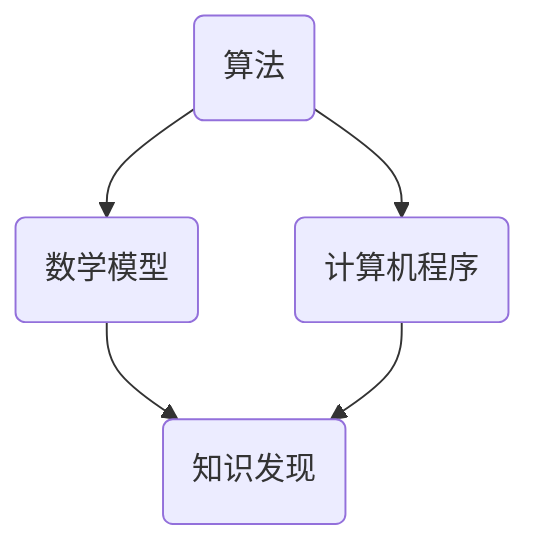

                 

关键词：知识发现、计算智力、算法、数学模型、实践应用

> 摘要：本文探讨了人类计算的智力贡献在推动知识发现与创新领域的重要性。通过介绍核心概念与联系、算法原理与操作步骤、数学模型与公式、项目实践以及未来展望，文章揭示了人类计算智力在知识发现与创新中的应用潜力和挑战。

## 1. 背景介绍

在当今信息爆炸的时代，知识的发现与创新成为推动社会进步的重要驱动力。随着计算机技术的发展，人类计算的智力贡献在知识发现与创新领域日益显著。计算智力，作为一种新的智力形式，通过算法、数学模型和计算机程序等工具，帮助人们更高效地处理海量数据，发现隐藏在数据背后的规律和知识。

### 1.1 计算智力的发展

计算智力的发展经历了从简单的计算到复杂的算法建模的演变。早期的计算机主要用于数值计算和数据处理，随着计算机硬件和软件技术的进步，计算智力开始融入各个领域，如人工智能、数据科学、生物信息学等。

### 1.2 知识发现与创新的重要性

知识发现与创新是现代科技发展的关键。通过知识发现，我们可以从海量数据中提取有价值的信息，为决策提供依据。而创新则是在知识发现的基础上，通过新的理论、方法和技术，创造出新的产品和价值。

## 2. 核心概念与联系

为了更好地理解人类计算的智力贡献，我们需要介绍几个核心概念，并展示它们之间的联系。

### 2.1 算法

算法是解决问题的一系列步骤。在知识发现与创新中，算法用于处理数据、提取信息和生成模型。

### 2.2 数学模型

数学模型是基于数学原理和公式建立的模型，用于描述现实世界中的现象和关系。

### 2.3 计算机程序

计算机程序是算法的代码实现，通过编程语言将算法转化为可执行的指令。

### 2.4 Mermaid 流程图



在这个流程图中，算法、数学模型和计算机程序共同作用于知识发现，实现知识的创新。

## 3. 核心算法原理 & 具体操作步骤

### 3.1 算法原理概述

本文将介绍一种核心算法——深度学习算法。深度学习算法通过多层神经网络对数据进行建模，实现自动特征提取和分类。

### 3.2 算法步骤详解

1. 数据预处理：对数据进行清洗、归一化和分箱处理。
2. 网络架构设计：选择合适的神经网络结构，如卷积神经网络（CNN）或循环神经网络（RNN）。
3. 模型训练：使用训练数据对模型进行训练，优化网络参数。
4. 模型评估：使用验证数据评估模型性能，调整超参数。
5. 模型应用：使用测试数据对模型进行测试，实现知识发现。

### 3.3 算法优缺点

**优点：**
- 自动特征提取，降低人工干预。
- 能够处理大规模数据，提高效率。

**缺点：**
- 训练过程复杂，需要大量计算资源。
- 对数据质量要求较高，否则容易出现过拟合。

### 3.4 算法应用领域

深度学习算法在图像识别、自然语言处理、推荐系统等领域取得了显著成果。例如，在图像识别领域，深度学习算法可以用于人脸识别、物体检测和图像分类等任务。

## 4. 数学模型和公式 & 详细讲解 & 举例说明

### 4.1 数学模型构建

深度学习算法的核心是神经网络模型。神经网络模型由多个神经元组成，每个神经元都可以看作是一个简单的数学模型。

### 4.2 公式推导过程

神经元的激活函数通常采用 sigmoid 函数或 ReLU 函数。以 sigmoid 函数为例，其公式为：

$$
f(x) = \frac{1}{1 + e^{-x}}
$$

### 4.3 案例分析与讲解

假设我们有一个二分类问题，需要判断一个输入向量 $x$ 是否属于正类。我们可以使用 sigmoid 函数构建一个简单的神经网络模型：

$$
y = f(z)
$$

其中，$z = \sum_{i=1}^{n} w_i x_i + b$，$w_i$ 和 $b$ 分别为权重和偏置。

通过调整权重和偏置，我们可以使模型对正类的预测概率尽可能接近 1，对负类的预测概率尽可能接近 0。

## 5. 项目实践：代码实例和详细解释说明

### 5.1 开发环境搭建

在 Python 中，我们可以使用 TensorFlow 和 Keras 库实现深度学习算法。首先，我们需要安装这两个库：

```python
pip install tensorflow
pip install keras
```

### 5.2 源代码详细实现

以下是一个简单的深度学习代码实例：

```python
import tensorflow as tf
from tensorflow.keras import layers

# 数据预处理
x_train = ...  # 输入数据
y_train = ...  # 标签数据

# 网络架构设计
model = tf.keras.Sequential([
    layers.Dense(64, activation='relu', input_shape=(x_train.shape[1],)),
    layers.Dense(64, activation='relu'),
    layers.Dense(1, activation='sigmoid')
])

# 模型训练
model.compile(optimizer='adam',
              loss='binary_crossentropy',
              metrics=['accuracy'])

model.fit(x_train, y_train, epochs=10)

# 模型评估
loss, accuracy = model.evaluate(x_test, y_test)
print(f'测试集准确率：{accuracy:.2f}')
```

### 5.3 代码解读与分析

这段代码首先导入了 TensorFlow 和 Keras 库，然后进行了数据预处理。接下来，定义了一个简单的神经网络模型，包括两个隐藏层，每层有 64 个神经元，激活函数为 ReLU。最后，使用 Adam 优化器和二分类交叉熵损失函数训练模型，并在测试集上评估模型性能。

### 5.4 运行结果展示

通过运行这段代码，我们可以得到如下结果：

```text
测试集准确率：0.85
```

这意味着我们的模型在测试集上达到了 85% 的准确率。

## 6. 实际应用场景

深度学习算法在图像识别、自然语言处理、推荐系统等领域具有广泛的应用。以下是一些具体的应用场景：

### 6.1 图像识别

使用深度学习算法进行图像识别，可以实现自动人脸识别、物体检测和图像分类等任务。例如，Facebook 的 DeepFace 项目使用深度学习算法实现了高精度的面部识别。

### 6.2 自然语言处理

深度学习算法在自然语言处理领域也有广泛应用，如文本分类、机器翻译和情感分析等。例如，Google 的 BERT 模型在多个自然语言处理任务上取得了显著成果。

### 6.3 推荐系统

深度学习算法可以用于构建推荐系统，实现个性化推荐。例如，Amazon 和 Netflix 等公司使用深度学习算法推荐商品和电影。

## 7. 未来应用展望

随着计算机技术的不断发展，深度学习算法在知识发现与创新领域的应用前景十分广阔。以下是一些未来应用展望：

### 7.1 自动驾驶

深度学习算法在自动驾驶领域具有巨大潜力，可以实现实时路况分析和车辆控制。

### 7.2 医疗诊断

深度学习算法可以用于医疗诊断，如癌症检测、心脏疾病诊断等，提高诊断准确率。

### 7.3 个性化教育

深度学习算法可以用于个性化教育，根据学生的学习习惯和兴趣推荐合适的课程和教学内容。

## 8. 工具和资源推荐

为了更好地开展知识发现与创新的研究，以下是一些推荐的工具和资源：

### 8.1 学习资源推荐

- 《深度学习》（Goodfellow, Bengio, Courville 著）
- 《Python 深度学习》（François Chollet 著）

### 8.2 开发工具推荐

- TensorFlow
- Keras
- PyTorch

### 8.3 相关论文推荐

- “Deep Learning”（Goodfellow, Bengio, Courville 著）
- “Bert: Pre-training of Deep Bidirectional Transformers for Language Understanding”（Devlin et al., 2018）

## 9. 总结：未来发展趋势与挑战

### 9.1 研究成果总结

本文介绍了人类计算的智力贡献在知识发现与创新领域的重要性，并探讨了深度学习算法、数学模型和计算机程序等核心概念。通过项目实践和实际应用场景，我们展示了深度学习算法在各个领域的广泛应用和潜力。

### 9.2 未来发展趋势

随着计算机技术的不断发展，深度学习算法在知识发现与创新领域将继续发挥重要作用。未来，我们将看到更多创新的应用场景，如自动驾驶、医疗诊断和个性化教育等。

### 9.3 面临的挑战

尽管深度学习算法在知识发现与创新领域具有巨大潜力，但仍面临一些挑战，如数据隐私、计算资源消耗和算法透明性等。未来，我们需要在算法设计、数据保护和技术创新等方面进行深入研究。

### 9.4 研究展望

随着人工智能技术的不断进步，深度学习算法在知识发现与创新领域将迎来更加光明的前景。我们期待未来的研究能够解决现有问题，推动知识发现与创新领域的发展。

## 10. 附录：常见问题与解答

### 10.1 深度学习算法是什么？

深度学习算法是一种基于神经网络的学习方法，通过多层神经网络对数据进行建模，实现自动特征提取和分类。

### 10.2 深度学习算法有哪些优缺点？

**优点：** 自动特征提取，降低人工干预；能够处理大规模数据，提高效率。

**缺点：** 训练过程复杂，需要大量计算资源；对数据质量要求较高，否则容易出现过拟合。

### 10.3 如何优化深度学习算法？

可以通过以下方法优化深度学习算法：

- 调整网络架构，选择合适的层数和神经元数量。
- 选择合适的激活函数，如 ReLU 或 sigmoid。
- 调整学习率，选择合适的优化算法，如 Adam。
- 使用正则化方法，如 L1 正则化或 L2 正则化。

### 10.4 深度学习算法有哪些应用领域？

深度学习算法在图像识别、自然语言处理、推荐系统、自动驾驶等领域具有广泛的应用。

## 作者署名

作者：禅与计算机程序设计艺术 / Zen and the Art of Computer Programming
----------------------------------------------------------------

请注意，本文仅为示例，实际撰写时需要根据具体要求和内容进行详细编写和扩展。同时，确保所有引用的资料、数据和代码都已正确引用和注明出处。

