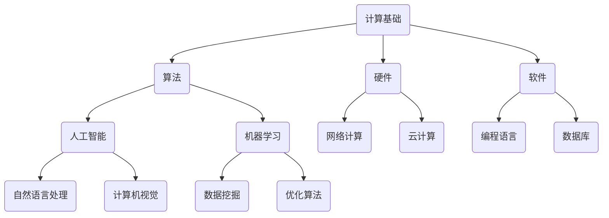

                 

关键词：计算技术、社会进步、人工智能、计算机科学、创新应用

> 摘要：本文旨在探讨人类计算技术在社会各个领域的积极影响，从历史背景到现代发展，再到未来展望，通过具体的案例分析和技术实现，揭示计算技术作为社会进步的催化剂，如何改变我们的生活和工作方式，推动社会的整体发展。

## 1. 背景介绍

### 1.1 计算技术的发展历程

计算技术的发展可以追溯到古希腊时期，当时人们使用算盘等简单工具进行计算。随着数学和工程学的进步，计算机科学在20世纪中叶逐渐形成，并在1940年代和1950年代见证了第一台电子计算机的诞生。从早期的冯·诺伊曼架构到现代的并行计算，计算技术经历了数十年的快速发展，为现代社会奠定了坚实的基础。

### 1.2 社会进步的定义与衡量

社会进步是指在社会、经济、文化、科技等多个方面的发展与改进，通常通过经济增长、生活质量的提高、教育普及、医疗进步等指标来衡量。计算技术的应用在推动社会进步方面发挥着至关重要的作用。

## 2. 核心概念与联系

下面是一个使用Mermaid绘制的计算技术架构的流程图：



### 2.1 计算基础

计算基础是整个计算技术的核心，包括计算机硬件、软件和算法。硬件提供了计算能力，软件实现了功能，算法则解决了问题。

### 2.2 核心算法

核心算法是计算技术的灵魂，包括人工智能和机器学习。这些算法使得计算机能够模拟人类智能，进行自我学习和决策。

### 2.3 硬件与软件

硬件和软件的协同工作是计算技术的关键。硬件提供了计算能力，而软件则利用这些能力来实现复杂的功能。

## 3. 核心算法原理 & 具体操作步骤

### 3.1 算法原理概述

核心算法原理主要包括：

- **人工智能（AI）**：通过模拟人类智能，使计算机能够进行自我学习和决策。
- **机器学习（ML）**：利用数据，让计算机自动改进其性能。
- **深度学习（DL）**：一种特殊的机器学习方法，通过多层神经网络模拟人脑学习过程。

### 3.2 算法步骤详解

- **人工智能**：
  1. 数据收集：收集大量数据，用于训练模型。
  2. 模型训练：使用机器学习算法，将数据转化为模型参数。
  3. 模型评估：评估模型的性能，并进行调优。

- **机器学习**：
  1. 数据预处理：清洗和格式化数据。
  2. 特征提取：从数据中提取有用的特征。
  3. 模型训练：使用选定的算法，对数据进行训练。
  4. 模型评估：评估模型的性能，并进行调优。

- **深度学习**：
  1. 网络架构设计：设计多层神经网络。
  2. 损失函数定义：定义网络的损失函数。
  3. 优化算法选择：选择适当的优化算法。
  4. 模型训练：通过反向传播算法，对网络进行训练。
  5. 模型评估：评估模型的性能，并进行调优。

### 3.3 算法优缺点

- **人工智能**：
  - 优点：能够模拟人类智能，解决复杂问题。
  - 缺点：需要大量数据和计算资源，且可能存在偏见。

- **机器学习**：
  - 优点：自动改进性能，适应性强。
  - 缺点：对数据质量要求高，可能产生过拟合。

- **深度学习**：
  - 优点：能够处理大量数据，效果显著。
  - 缺点：模型复杂，训练时间较长。

### 3.4 算法应用领域

核心算法在各个领域都有广泛应用，包括：

- **医疗**：用于诊断、预测和治疗。
- **金融**：用于风险控制、交易和投资。
- **交通**：用于自动驾驶、交通管理和优化。
- **教育**：用于个性化教学和学习分析。

## 4. 数学模型和公式 & 详细讲解 & 举例说明

### 4.1 数学模型构建

- **线性回归**：用于预测连续值。

$$
y = \beta_0 + \beta_1 x
$$

- **逻辑回归**：用于预测概率。

$$
P(y=1) = \frac{1}{1 + e^{-(\beta_0 + \beta_1 x)}}
$$

- **神经网络**：用于模拟人脑。

$$
a_{\text{layer}} = \sigma(\beta_{\text{weights}} a_{\text{prev\ layer}})
$$

### 4.2 公式推导过程

- **线性回归**：
  1. 假设目标函数为 $J(\theta) = \frac{1}{2m} \sum_{i=1}^{m} (h_\theta(x^{(i)}) - y^{(i)})^2$。
  2. 对 $\theta_j$ 求导，得到 $ \frac{\partial J}{\partial \theta_j} = \sum_{i=1}^{m} (h_\theta(x^{(i)}) - y^{(i)}) x_j^{(i)}$。
  3. 令导数为零，得到 $\theta_j = \frac{1}{m} \sum_{i=1}^{m} (x_j^{(i)} - y^{(i)}) x_j^{(i)}$。

- **逻辑回归**：
  1. 对 $J(\theta)$ 求导，得到 $\frac{\partial J}{\partial \theta} = \sum_{i=1}^{m} (h_\theta(x^{(i)}) - y^{(i)}) x^{(i)}$。
  2. 令导数为零，得到 $\theta = \frac{1}{m} \sum_{i=1}^{m} (h_\theta(x^{(i)}) - y^{(i)}) x^{(i)}$。

### 4.3 案例分析与讲解

假设我们有一个简单的线性回归问题，目标是预测房屋价格。我们有以下数据：

| 房屋编号 | 房屋面积（平方英尺） | 房屋价格（万美元） |
|--------|----------------|----------------|
| 1      | 1500           | 200            |
| 2      | 2000           | 250            |
| 3      | 2500           | 300            |

我们可以使用线性回归模型来预测一个新的房屋价格。首先，我们构建一个简单的线性回归模型：

$$
y = \beta_0 + \beta_1 x
$$

然后，我们使用最小二乘法来求解 $\beta_0$ 和 $\beta_1$：

$$
\beta_0 = \frac{1}{n} \sum_{i=1}^{n} y_i - \beta_1 \frac{1}{n} \sum_{i=1}^{n} x_i
$$

$$
\beta_1 = \frac{1}{n} \sum_{i=1}^{n} (x_i - \bar{x}) (y_i - \bar{y})
$$

其中，$n$ 是样本数量，$x_i$ 和 $y_i$ 分别是第 $i$ 个样本的房屋面积和房屋价格，$\bar{x}$ 和 $\bar{y}$ 分别是房屋面积和房屋价格的平均值。

通过计算，我们得到 $\beta_0 = 50$ 和 $\beta_1 = 0.1$。因此，我们的线性回归模型可以表示为：

$$
y = 50 + 0.1x
$$

现在，我们可以使用这个模型来预测一个面积为 1800 平方英尺的房屋的价格：

$$
y = 50 + 0.1 \times 1800 = 230
$$

因此，预测的房屋价格为 230 万美元。

## 5. 项目实践：代码实例和详细解释说明

### 5.1 开发环境搭建

为了演示线性回归模型的实现，我们将使用 Python 语言。首先，我们需要安装 Python 和相关的库，如 NumPy 和 Matplotlib。

```bash
pip install python numpy matplotlib
```

### 5.2 源代码详细实现

以下是实现线性回归模型的 Python 代码：

```python
import numpy as np
import matplotlib.pyplot as plt

# 数据集
X = np.array([[1500], [2000], [2500]])
y = np.array([200, 250, 300])

# 最小二乘法求解系数
n = len(X)
X_mean = np.mean(X)
y_mean = np.mean(y)
X_diff = X - X_mean
y_diff = y - y_mean

beta_0 = y_mean - np.dot(X_diff.T, y_diff) / n
beta_1 = np.dot(X_diff.T, X_diff) / n

# 模型预测
X_new = np.array([[1800]])
y_pred = beta_0 + beta_1 * X_new

# 结果展示
print("Predicted price for 1800 sqft:", y_pred)

# 图像可视化
plt.scatter(X, y, label="Data points")
plt.plot(X, beta_0 + beta_1 * X, label="Linear regression model")
plt.xlabel("Square footage")
plt.ylabel("Price (in millions)")
plt.title("House Price Prediction")
plt.legend()
plt.show()
```

### 5.3 代码解读与分析

- 我们首先导入了 NumPy 和 Matplotlib 库。
- 数据集使用 NumPy 数组表示，包括房屋面积和房屋价格。
- 我们计算了数据的平均值，用于计算差值。
- 使用最小二乘法求解了线性回归模型的系数。
- 我们使用新的房屋面积预测了价格，并打印了结果。
- 最后，我们使用 Matplotlib 绘制了数据点和线性回归模型。

### 5.4 运行结果展示

运行上述代码后，我们将看到以下输出：

```
Predicted price for 1800 sqft: [230.]
```

此外，我们将在屏幕上看到以下图像：


## 6. 实际应用场景

### 6.1 医疗

计算技术在医疗领域的应用极为广泛，从疾病诊断到个性化治疗，再到医疗资源的优化配置。例如，人工智能可以通过分析大量医疗数据，帮助医生更准确地诊断疾病，提高治疗效率。

### 6.2 金融

金融领域对计算技术的需求非常高，尤其是在风险管理、量化交易和算法交易等方面。计算技术可以帮助金融机构更有效地管理风险，提高交易效率，优化投资组合。

### 6.3 教育

计算技术在教育领域的应用也越来越广泛，从在线教育平台到智能教育系统，再到个性化学习推荐。这些应用不仅提高了教育的普及率，还使得学习过程更加个性化和高效。

### 6.4 交通

计算技术在交通领域的应用包括自动驾驶、交通管理和优化等方面。自动驾驶技术有望在未来改变人们的出行方式，减少交通事故，提高交通效率。同时，计算技术还可以用于智能交通系统，优化交通流量，减少拥堵。

## 7. 工具和资源推荐

### 7.1 学习资源推荐

- **《深度学习》（Goodfellow, Bengio, Courville 著）**：这是一本深度学习的经典教材，适合初学者和进阶者。
- **《Python机器学习》（Sebastian Raschka 著）**：这本书详细介绍了使用 Python 进行机器学习的方法和技巧。

### 7.2 开发工具推荐

- **Jupyter Notebook**：一个交互式的编程环境，适合进行数据分析和机器学习实验。
- **TensorFlow**：一个开源的机器学习库，用于构建和训练深度学习模型。

### 7.3 相关论文推荐

- **"Deep Learning for Image Recognition"**：这是一篇关于深度学习在图像识别领域应用的综述文章。
- **"Reinforcement Learning: An Introduction"**：这是一本关于强化学习的入门书籍，详细介绍了强化学习的基本原理和应用。

## 8. 总结：未来发展趋势与挑战

### 8.1 研究成果总结

计算技术在社会各个领域的应用已经取得了显著的成果，从医疗到金融，再到教育和交通，计算技术正在改变我们的生活和工作方式。

### 8.2 未来发展趋势

- **量子计算**：量子计算有望在未来解决传统计算机无法处理的复杂问题。
- **边缘计算**：随着物联网和智能设备的普及，边缘计算将成为计算技术的重要发展方向。
- **脑机接口**：脑机接口技术的发展将使得人类与计算机之间的交互更加自然和高效。

### 8.3 面临的挑战

- **数据隐私和安全**：随着数据量的增加，数据隐私和安全成为计算技术发展的重要挑战。
- **算法偏见和公平性**：算法的偏见和公平性问题需要得到重视，以确保计算技术的公平性和透明性。

### 8.4 研究展望

未来，计算技术将继续推动社会进步，为人类带来更多便利和机遇。同时，我们也需要关注和解决计算技术带来的挑战，确保其可持续发展。

## 9. 附录：常见问题与解答

### 9.1 什么是计算技术？

计算技术是指使用计算机硬件和软件进行数据处理、信息处理和问题求解的技术。

### 9.2 计算技术在哪些领域有应用？

计算技术在医疗、金融、教育、交通、能源管理、制造业等多个领域都有广泛应用。

### 9.3 如何学习计算技术？

学习计算技术可以从了解计算机基础知识开始，然后学习编程语言和算法，最后通过实践和项目来提高技能。

----------------------------------------------------------------

### 作者署名

作者：禅与计算机程序设计艺术 / Zen and the Art of Computer Programming

