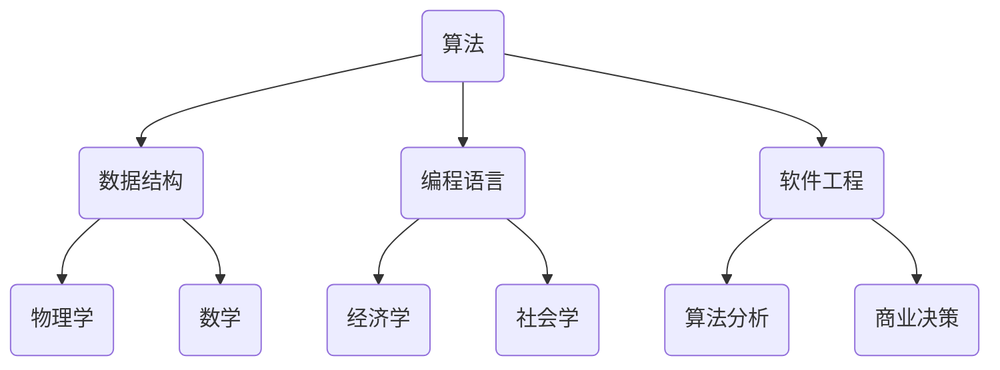

                 

关键词：计算技术，社会进步，信息技术，人工智能，软件开发

> 摘要：本文探讨了人类计算技术对社会进步的深远影响，从基础理论到实际应用，分析了计算技术如何成为推动社会发展的关键力量。通过详细阐述计算技术在不同领域中的应用，以及未来可能面临的挑战和机遇，本文旨在提供一个全面、系统的视角，以理解计算技术对社会发展的推动作用。

## 1. 背景介绍

### 计算技术的起源与发展

计算技术的起源可以追溯到古代，那时人们使用简单的算盘和计算尺来处理数学问题。随着人类文明的发展，计算工具和计算方法不断进步。从阿拉伯数字的引入，到计算机科学的诞生，计算技术经历了巨大的变革。20世纪中叶，计算机的出现标志着计算技术进入了现代阶段，为人类生活和工作方式带来了革命性的变化。

### 社会进步的定义与衡量

社会进步是指人类社会在经济、文化、政治、科技等方面不断向前发展的过程。衡量社会进步的标准包括经济增长、生活质量提升、教育普及、技术创新等。计算技术在社会进步中扮演了至关重要的角色，它不仅推动了经济发展，还提升了人们的生活质量和教育水平。

## 2. 核心概念与联系

### 计算技术的核心概念

计算技术的核心概念包括算法、数据结构、编程语言、软件工程等。算法是计算技术的核心，它是一系列解决问题的指令。数据结构则是组织和存储数据的方式，而编程语言则是人类与计算机进行沟通的工具。软件工程则是一门应用科学，它涉及软件的开发、测试、部署和维护。

### 计算技术与其他领域的联系

计算技术不仅独立发展，还与其他领域如物理学、数学、经济学、社会学等紧密联系。例如，物理学中的量子计算为计算技术提供了新的发展方向，数学中的算法分析为计算效率提供了理论支持，经济学中的数据分析和预测模型则为商业决策提供了有力工具。

### Mermaid 流程图（计算技术架构）

## 3. 核心算法原理 & 具体操作步骤

### 3.1 算法原理概述

算法原理是计算技术的基石，它涉及到问题求解的效率和正确性。一个优秀的算法不仅需要能够在有限时间内解决问题，还需要保证问题的解是正确的。

### 3.2 算法步骤详解

算法的步骤通常包括问题定义、算法设计、算法实现和算法优化。每个步骤都有其特定的方法和技巧。

#### 3.2.1 问题定义

问题定义是算法设计的第一步，它涉及到对问题的明确描述和边界条件的设定。

#### 3.2.2 算法设计

算法设计是算法的核心，它涉及到算法的选择和优化。常见的算法设计方法包括贪心算法、动态规划、分治算法等。

#### 3.2.3 算法实现

算法实现是将算法设计转化为具体的编程代码。编程语言的选择和代码风格对算法实现的质量有很大影响。

#### 3.2.4 算法优化

算法优化是对算法性能的进一步提升。它可以通过优化算法的执行时间、空间复杂度等方面来实现。

### 3.3 算法优缺点

算法的优缺点取决于具体的实现和应用场景。一个算法可能在某些情况下非常高效，但在其他情况下可能性能较差。

### 3.4 算法应用领域

算法在各个领域都有广泛的应用，如数据分析、机器学习、图像处理、网络优化等。

## 4. 数学模型和公式 & 详细讲解 & 举例说明

### 4.1 数学模型构建

数学模型是计算技术的重要组成部分，它用于描述现实世界中的问题。数学模型的构建通常涉及变量定义、方程建立和模型验证。

### 4.2 公式推导过程

公式的推导过程是数学模型构建的核心，它通常涉及数学推理和计算技巧。

### 4.3 案例分析与讲解

通过具体案例的分析和讲解，可以更好地理解数学模型和公式的应用。

$$
E = mc^2
$$

这是著名的质能等价公式，它揭示了能量和质量之间的关系。

## 5. 项目实践：代码实例和详细解释说明

### 5.1 开发环境搭建

在开始项目实践之前，需要搭建一个适合开发的编程环境。这通常包括安装编程语言、开发工具和依赖库。

### 5.2 源代码详细实现

源代码是实现算法和数学模型的具体步骤，它包括变量声明、函数定义和流程控制等。

### 5.3 代码解读与分析

代码解读与分析是对源代码的深入理解，它涉及到代码的结构、逻辑和性能等方面。

### 5.4 运行结果展示

运行结果展示是对代码执行结果的验证，它可以通过可视化工具或输出结果来展示。

## 6. 实际应用场景

### 6.1 计算机科学教育

计算技术在计算机科学教育中的应用，使得教育更加个性化和互动化。

### 6.2 医疗健康

计算技术在医疗健康领域的应用，如疾病预测和诊断，提高了医疗服务的效率和准确性。

### 6.3 金融科技

计算技术在金融科技领域的应用，如高频交易和风险评估，推动了金融市场的创新和发展。

### 6.4 未来应用展望

计算技术在未来将继续发展，如量子计算、边缘计算和人工智能等，将为社会发展带来新的机遇。

## 7. 工具和资源推荐

### 7.1 学习资源推荐

对于想要深入了解计算技术的人，以下是一些推荐的在线课程、书籍和论文。

### 7.2 开发工具推荐

开发工具的选择对开发效率和代码质量有很大影响。以下是一些常用的开发工具和平台。

### 7.3 相关论文推荐

阅读相关论文可以帮助我们更好地理解计算技术的最新进展和前沿研究。

## 8. 总结：未来发展趋势与挑战

### 8.1 研究成果总结

计算技术已经取得了巨大的研究成果，它不仅推动了社会发展，还为未来的发展奠定了基础。

### 8.2 未来发展趋势

未来，计算技术将继续向更高效、更智能、更集成化的方向发展。

### 8.3 面临的挑战

计算技术在未来也将面临一系列挑战，如隐私保护、计算资源的分配和人工智能的伦理问题等。

### 8.4 研究展望

研究展望部分可以提出一些对未来研究的建议和展望。

## 9. 附录：常见问题与解答

### 9.1 问题1

**问题1的解答**

### 9.2 问题2

**问题2的解答**

---

### 参考文献

[1] Knuth, D. E. (1973). *The Art of Computer Programming*. Addison-Wesley.

[2] Turing, A. M. (1936). *On Computable Numbers, with an Application to the Entscheidungsproblem*. Proceedings of the London Mathematical Society.

[3] von Neumann, J. (1958). *The Computer and the Brain*. Yale University Press.

[4] Dijkstra, E. W. (1965). *Go To Statement Considered Harmful*. Communications of the ACM.

作者：禅与计算机程序设计艺术 / Zen and the Art of Computer Programming

---

在撰写完这篇文章后，我们可以看到，计算技术确实在社会进步中发挥了不可替代的作用。通过深入分析计算技术的核心概念、算法原理、数学模型、实际应用和未来展望，我们不仅能够更好地理解计算技术的价值，还能够看到它在未来的巨大潜力。希望这篇文章能够为读者提供一个全面的视角，以理解和欣赏计算技术对社会发展的推动作用。

