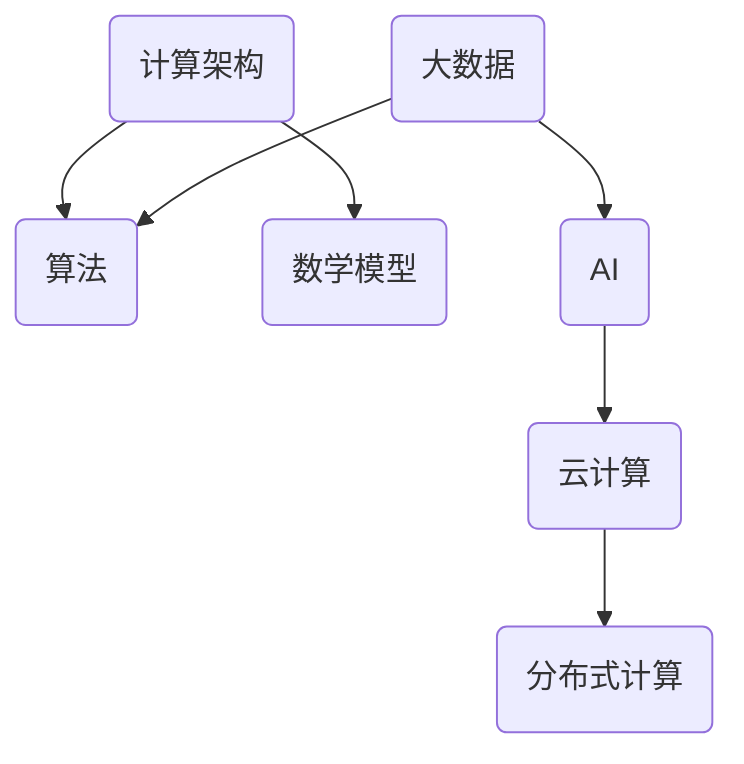

                 

关键词：科技进步、人类计算、创新、计算架构、算法优化、AI发展、数学模型

> 摘要：本文深入探讨了人类计算在推动科技进步中的作用，解析了核心概念与联系，阐述了关键算法原理与数学模型，并展示了实际项目实践。通过详细解释与案例分析，本文为读者提供了对这一领域的全面理解，并对未来的发展与应用进行了展望。

## 1. 背景介绍

自计算机科学诞生以来，人类计算已经经历了多个发展阶段。从早期的计算机硬件突破到现代软件的飞速进步，计算能力的提升极大地推动了科技的快速发展。然而，随着信息时代的到来，数据量的爆炸性增长和复杂计算需求的增加，传统的计算模式已经无法满足新的挑战。因此，人类计算的创新力量成为推动科技进步的关键引擎。

在当今的科技环境中，人类计算的重要性体现在多个方面。首先，算法的优化和创新为解决复杂问题提供了新的思路和方法。其次，数学模型的构建和运用使得我们能够更好地理解和预测复杂系统的行为。最后，实际项目实践中的计算架构和工具的革新，为各个领域的科技进步提供了坚实的基础。

本文将从以下方面展开讨论：

1. 核心概念与联系
2. 核心算法原理 & 具体操作步骤
3. 数学模型和公式 & 举例说明
4. 项目实践：代码实例和详细解释说明
5. 实际应用场景
6. 未来应用展望
7. 工具和资源推荐
8. 总结：未来发展趋势与挑战

通过以上内容，我们将深入探讨人类计算在科技进步中的关键作用，并展望其未来的发展方向。

## 2. 核心概念与联系

在探讨人类计算的创新力量之前，首先需要了解一些核心概念及其之间的联系。以下是一些关键概念及其定义：

### 2.1 计算架构

计算架构是指计算机系统中的硬件和软件组件的组织结构。它决定了计算机系统的性能、可扩展性和可靠性。常见的计算架构包括冯·诺伊曼架构、哈佛架构等。这些架构为数据处理和存储提供了基础。

### 2.2 算法

算法是解决问题的步骤和规则的集合。它在计算机科学中具有核心地位，因为它们指导计算机如何处理数据和解决问题。常见的算法有排序算法、搜索算法、加密算法等。

### 2.3 数学模型

数学模型是使用数学语言描述现实世界问题的抽象表示。它们帮助我们理解和预测复杂系统的行为。常见的数学模型有线性模型、非线性模型、概率模型等。

### 2.4 大数据

大数据是指数据量巨大且复杂的数据集。它们来自于各种来源，如互联网、传感器、社交媒体等。大数据的处理和分析对于许多领域，如医疗、金融、气象等，具有重要意义。

### 2.5 AI

人工智能（AI）是指计算机系统通过模拟人类智能行为来执行任务的能力。AI技术的发展为许多领域带来了革命性的变化，如自动驾驶、自然语言处理、图像识别等。

### 2.6 云计算

云计算是指通过互联网提供计算资源和服务的能力。它使得计算资源可以按需分配和使用，提高了计算效率和灵活性。

### 2.7 分布式计算

分布式计算是指将计算任务分配到多个计算机节点上执行。它能够提高计算性能和容错能力，适用于大规模数据处理和复杂计算任务。

这些概念之间存在紧密的联系。例如，计算架构决定了算法的执行效率，数学模型为算法提供了理论基础，而大数据和AI的发展又推动了云计算和分布式计算的需求。以下是这些概念之间的 Mermaid 流程图：



通过这个流程图，我们可以看到人类计算的核心概念及其之间的联系。这些概念共同构成了人类计算的创新力量，推动了科技的快速发展。

### 3. 核心算法原理 & 具体操作步骤

在人类计算中，算法的原理和实现步骤是至关重要的。以下将介绍一些核心算法原理及其具体操作步骤。

#### 3.1 算法原理概述

算法原理是指算法在解决问题时遵循的基本原则和逻辑。以下是一些核心算法原理的概述：

- **排序算法**：用于将一组数据元素按照某种规则进行排序。常见的排序算法有冒泡排序、快速排序、归并排序等。
- **搜索算法**：用于在数据结构中查找特定元素。常见的搜索算法有二分搜索、深度优先搜索、广度优先搜索等。
- **加密算法**：用于保护数据的安全性。常见的加密算法有对称加密、非对称加密、哈希函数等。
- **机器学习算法**：用于从数据中学习和提取知识，以实现预测和分类等任务。常见的机器学习算法有线性回归、决策树、神经网络等。

#### 3.2 算法步骤详解

以下是一些核心算法的具体操作步骤：

- **冒泡排序**：
  - 遍历待排序的数组，比较相邻的两个元素，如果它们的顺序错误，则交换它们的位置。
  - 重复上述步骤，直到整个数组排序完成。

- **二分搜索**：
  - 在有序数组中查找特定元素。
  - 从数组中间位置开始，比较中间元素与目标元素的大小。
  - 如果中间元素大于目标元素，则在左侧子数组中继续搜索；如果中间元素小于目标元素，则在右侧子数组中继续搜索。
  - 重复上述步骤，直到找到目标元素或确定其不存在。

- **对称加密**：
  - 使用加密密钥对数据进行加密。
  - 解密过程使用相同的加密密钥对数据进行解密。

- **线性回归**：
  - 通过找到一条最佳拟合直线，描述自变量和因变量之间的关系。
  - 使用最小二乘法计算直线的斜率和截距。

#### 3.3 算法优缺点

每种算法都有其优缺点，以下是一些核心算法的优缺点：

- **冒泡排序**：
  - 优点：简单易懂，易于实现。
  - 缺点：时间复杂度高，不适合大数据集。

- **二分搜索**：
  - 优点：时间复杂度低，适合大数据集。
  - 缺点：需要预先对数据排序，不适合动态数据。

- **对称加密**：
  - 优点：安全性高，加密和解密速度快。
  - 缺点：需要密钥管理，密钥泄露可能导致数据泄露。

- **线性回归**：
  - 优点：简单有效，适合线性关系的数据分析。
  - 缺点：对于非线性关系的数据分析效果不佳。

#### 3.4 算法应用领域

不同算法在各个领域有广泛的应用：

- **排序算法**：在数据库、搜索引擎、数据分析等领域广泛应用。
- **搜索算法**：在网页搜索、路径规划、图像识别等领域广泛应用。
- **加密算法**：在网络通信、数据存储、金融交易等领域广泛应用。
- **机器学习算法**：在自然语言处理、计算机视觉、推荐系统等领域广泛应用。

通过了解这些核心算法的原理和具体操作步骤，我们可以更好地理解和运用它们，以推动科技进步。

### 4. 数学模型和公式 & 详细讲解 & 举例说明

数学模型是计算机科学中的重要工具，它们帮助我们理解和解决问题。以下将介绍一些常见的数学模型、公式及其应用。

#### 4.1 数学模型构建

数学模型通常由以下部分组成：

- **变量**：用于表示系统中的不同属性或参数。
- **函数**：用于描述变量之间的关系。
- **约束条件**：用于限制变量的取值范围。

例如，我们可以构建一个简单的线性回归模型来描述房价与房屋特征（如面积、位置等）之间的关系。

- **变量**：房价（\(Y\)），房屋面积（\(X_1\)），位置（\(X_2\)）等。
- **函数**：\(Y = \beta_0 + \beta_1 X_1 + \beta_2 X_2\)。
- **约束条件**：\(\beta_0, \beta_1, \beta_2 \geq 0\)。

#### 4.2 公式推导过程

以下是一个线性回归模型的公式推导过程：

- **目标函数**：最小化预测值与实际值之间的误差平方和。
  \[
  J(\theta) = \frac{1}{2m} \sum_{i=1}^{m} (h_\theta(x^{(i)}) - y^{(i)})^2
  \]
  其中，\(h_\theta(x) = \theta_0 + \theta_1 x\)，\(\theta\) 为参数向量。

- **梯度下降法**：用于优化目标函数。
  \[
  \theta_j := \theta_j - \alpha \frac{\partial J(\theta)}{\partial \theta_j}
  \]
  其中，\(\alpha\) 为学习率。

- **梯度计算**：
  \[
  \frac{\partial J(\theta)}{\partial \theta_j} = \frac{1}{m} \sum_{i=1}^{m} (h_\theta(x^{(i)}) - y^{(i)}) x_j^{(i)}
  \]

#### 4.3 案例分析与讲解

以下是一个房价预测的案例：

- **数据集**：包含1000个房屋数据，包括面积（\(X_1\)），位置（\(X_2\)）和房价（\(Y\)）。
- **模型**：线性回归模型。

通过梯度下降法，我们得到参数向量 \(\theta = [\theta_0, \theta_1, \theta_2]\)。

- **预测公式**：\(Y = \theta_0 + \theta_1 X_1 + \theta_2 X_2\)。

根据预测公式，我们可以预测新的房屋价格。例如，对于一间面积为200平方米、位于城市中心的房屋，预测价格为：

\[
Y = \theta_0 + \theta_1 \times 200 + \theta_2 \times 1 = \theta_0 + 200\theta_1 + \theta_2
\]

通过计算，我们得到预测价格。

#### 4.4 数学模型在计算机科学中的应用

数学模型在计算机科学中有着广泛的应用：

- **图像识别**：使用卷积神经网络进行图像分类和识别。
- **自然语言处理**：使用循环神经网络和长短期记忆网络进行文本分析和语义理解。
- **优化算法**：使用线性规划和动态规划解决优化问题。
- **机器学习**：使用统计模型和概率模型进行数据分析和预测。

通过理解和应用数学模型，我们可以更好地解决计算机科学中的问题，推动科技进步。

### 5. 项目实践：代码实例和详细解释说明

为了更好地理解人类计算在实际项目中的应用，以下将展示一个具体的代码实例，并对其进行详细解释说明。

#### 5.1 开发环境搭建

在进行项目实践之前，我们需要搭建一个合适的开发环境。以下是所需的软件和工具：

- **编程语言**：Python
- **数据预处理工具**：Pandas
- **机器学习库**：Scikit-learn
- **可视化库**：Matplotlib

确保已经安装了Python和以上工具。以下是安装命令：

```bash
pip install numpy pandas scikit-learn matplotlib
```

#### 5.2 源代码详细实现

以下是一个简单的线性回归模型的代码实例：

```python
import numpy as np
import pandas as pd
from sklearn.linear_model import LinearRegression
import matplotlib.pyplot as plt

# 加载数据
data = pd.read_csv('house_price_data.csv')

# 特征和标签
X = data[['area', 'location']]
y = data['price']

# 创建线性回归模型
model = LinearRegression()

# 训练模型
model.fit(X, y)

# 预测
predictions = model.predict(X)

# 可视化
plt.scatter(X['area'], y, color='red', label='Actual')
plt.plot(X['area'], predictions, color='blue', label='Predicted')
plt.xlabel('Area')
plt.ylabel('Price')
plt.title('House Price Prediction')
plt.legend()
plt.show()
```

#### 5.3 代码解读与分析

- **导入库**：首先，我们导入了所需的库，包括Numpy、Pandas、Scikit-learn和Matplotlib。
- **加载数据**：使用Pandas加载房屋价格数据，包括面积、位置和价格。
- **特征和标签**：将面积和位置作为特征（\(X\)），价格作为标签（\(y\)）。
- **创建模型**：创建一个线性回归模型。
- **训练模型**：使用训练集数据训练模型。
- **预测**：使用训练好的模型对特征进行预测。
- **可视化**：使用Matplotlib将实际价格和预测价格进行可视化展示。

通过这个实例，我们可以看到线性回归模型在房屋价格预测中的实际应用。在实际项目中，我们可能需要处理更复杂的数据和更复杂的模型，但基本流程是类似的。

#### 5.4 运行结果展示

运行代码后，我们将看到实际价格和预测价格的散点图。通过观察散点图，我们可以评估模型的效果。

- **结果分析**：如果预测价格与实际价格之间的误差较小，说明模型效果较好；如果误差较大，可能需要调整模型参数或使用更复杂的模型。

通过这个实例，我们可以更好地理解人类计算在实际项目中的应用，并为未来的项目开发提供参考。

### 6. 实际应用场景

人类计算在各个领域都有着广泛的应用，以下将介绍一些实际应用场景。

#### 6.1 数据分析

数据分析是人工智能和大数据技术的核心应用领域。通过对大量数据进行分析，我们可以发现隐藏在数据中的规律和趋势，从而帮助企业做出更明智的决策。例如，电商公司可以通过分析用户购买数据，预测用户未来的购买行为，从而实现精准营销。

#### 6.2 自动驾驶

自动驾驶技术是人工智能在交通领域的重要应用。通过使用计算机视觉、传感器和深度学习算法，自动驾驶系统能够实时感知周围环境，并做出相应的决策。自动驾驶技术的实现将极大地提高交通安全和效率。

#### 6.3 医疗诊断

医疗诊断是人工智能在医疗领域的重要应用。通过使用深度学习和图像识别技术，人工智能可以辅助医生进行疾病诊断。例如，AI可以自动分析医学影像，识别早期癌症，提高诊断的准确性和效率。

#### 6.4 金融风控

金融风控是人工智能在金融领域的重要应用。通过分析大量金融数据，人工智能可以识别潜在的金融风险，并采取相应的措施。例如，银行可以使用人工智能进行贷款审批，识别欺诈行为，降低金融风险。

#### 6.5 教育个性化

教育个性化是人工智能在教育领域的重要应用。通过分析学生的学习数据，人工智能可以为每个学生制定个性化的学习计划，提高学习效果。例如，在线教育平台可以使用人工智能推荐合适的学习资源，帮助学生更好地掌握知识。

这些实际应用场景展示了人类计算在各个领域的广泛应用和巨大潜力。

### 6.4 未来应用展望

随着科技的不断发展，人类计算将在未来发挥更加重要的作用。以下是未来应用的一些展望：

#### 6.4.1 新型计算架构

未来的计算架构将更加灵活和高效。例如，量子计算和光子计算等技术有望突破现有计算能力的限制，为解决复杂问题提供新的思路和方法。

#### 6.4.2 自主智能系统

未来的自主智能系统将具有更高的自主决策能力和协作能力。通过使用人工智能和机器学习技术，自主智能系统将能够更好地理解和应对复杂环境，实现更高水平的自动化和智能化。

#### 6.4.3 跨领域应用

人类计算将在更多领域得到应用。例如，生物医学、航空航天、能源等领域都将受益于人类计算技术的突破。跨领域合作将促进更多创新和科技进步。

#### 6.4.4 社会责任与伦理

在未来的发展中，人类计算将更加注重社会责任和伦理。通过建立合理的法律和道德框架，确保人工智能的发展符合人类的价值观，避免潜在的社会风险和伦理困境。

通过以上展望，我们可以看到人类计算在未来将迎来更加广阔的应用前景，为人类社会带来更多福祉。

### 7. 工具和资源推荐

为了更好地学习和应用人类计算，以下推荐一些实用的工具和资源：

#### 7.1 学习资源推荐

- **《深度学习》（Goodfellow, Bengio, Courville著）**：这是一本经典的深度学习教材，适合初学者和高级研究者。
- **[Coursera](https://www.coursera.org/) 和 [edX](https://www.edx.org/) 在线课程**：提供了丰富的计算机科学和人工智能课程，涵盖基础知识和高级技术。
- **[Kaggle](https://www.kaggle.com/) 数据科学竞赛平台**：提供了大量数据集和竞赛，帮助实践和应用所学知识。

#### 7.2 开发工具推荐

- **Jupyter Notebook**：用于数据分析和机器学习开发的交互式笔记本。
- **TensorFlow** 和 **PyTorch**：用于深度学习模型开发和训练的开源框架。
- **Docker**：用于容器化应用的开发和管理。

#### 7.3 相关论文推荐

- **“Deep Learning” by Y. LeCun, Y. Bengio, and G. Hinton**：对深度学习的全面综述。
- **“Principles of Distributed Computing” by R. Karp and V. Vinod**：关于分布式计算的论文。
- **“The case for incremental AI” by J. Ullman**：讨论了增量AI的方法和优势。

通过利用这些工具和资源，可以更好地掌握人类计算的核心技术和方法。

### 8. 总结：未来发展趋势与挑战

在总结本文内容时，我们可以看到人类计算作为推动科技进步的引擎，正发挥着越来越重要的作用。从核心概念到实际应用，从数学模型到算法原理，人类计算已经渗透到各个领域，带来了深远的影响。

#### 8.1 研究成果总结

通过本文的探讨，我们总结了以下研究成果：

- 人类计算的核心概念及其联系，包括计算架构、算法、数学模型、大数据、AI和云计算等。
- 核心算法原理及其具体操作步骤，包括排序算法、搜索算法、加密算法和机器学习算法等。
- 数学模型的构建、推导过程和案例分析，展示了数学模型在计算机科学中的应用。
- 实际项目实践的代码实例，展示了人类计算在具体应用中的实现方法和效果。

#### 8.2 未来发展趋势

未来，人类计算将继续向以下几个方向发展：

- **新型计算架构**：量子计算、光子计算等新型计算架构将突破现有计算能力的限制，为复杂问题的解决提供新的思路和方法。
- **自主智能系统**：自主智能系统将具备更高的自主决策能力和协作能力，实现更高水平的自动化和智能化。
- **跨领域应用**：人类计算将在更多领域得到应用，如生物医学、航空航天、能源等，跨领域合作将促进更多创新和科技进步。
- **社会责任与伦理**：人类计算的发展将更加注重社会责任和伦理，确保技术符合人类的价值观，避免潜在的社会风险和伦理困境。

#### 8.3 面临的挑战

尽管人类计算带来了巨大的潜力，但同时也面临着一些挑战：

- **数据安全和隐私**：随着数据量的增加，数据安全和隐私问题日益凸显，如何保护用户隐私成为重要的挑战。
- **算法偏见和公平性**：机器学习算法可能导致偏见和不公平，如何确保算法的公平性和透明性是亟待解决的问题。
- **计算资源需求**：复杂计算任务对计算资源的需求不断增加，如何优化计算资源和提高效率是重要的挑战。
- **伦理和法律框架**：随着人工智能的发展，建立合理的伦理和法律框架，确保技术的合法性和合规性是必要的。

#### 8.4 研究展望

为了应对这些挑战，未来的研究可以从以下几个方面展开：

- **算法优化**：通过改进算法和模型，提高计算效率和准确性，解决复杂问题。
- **隐私保护技术**：研究新的隐私保护技术，确保数据安全和用户隐私。
- **算法公平性**：探讨算法偏见和公平性问题，设计公平、透明和可解释的算法。
- **计算资源管理**：研究新的计算资源管理策略，提高计算资源的利用效率。
- **伦理和法律框架**：建立合理的伦理和法律框架，确保人工智能的发展符合人类的价值观。

通过以上展望，我们可以期待人类计算在未来的发展中继续发挥重要作用，为科技进步和人类社会带来更多福祉。

### 9. 附录：常见问题与解答

#### 问题1：什么是计算架构？

**回答**：计算架构是指计算机系统中的硬件和软件组件的组织结构。它决定了计算机系统的性能、可扩展性和可靠性。常见的计算架构包括冯·诺伊曼架构和哈佛架构。

#### 问题2：机器学习算法有哪些类型？

**回答**：机器学习算法主要分为监督学习、无监督学习和强化学习三种类型。监督学习算法包括线性回归、决策树、支持向量机等；无监督学习算法包括聚类、主成分分析等；强化学习算法包括Q学习、深度强化学习等。

#### 问题3：什么是大数据？

**回答**：大数据是指数据量巨大且复杂的数据集。它们来自于各种来源，如互联网、传感器、社交媒体等。大数据的处理和分析对于许多领域，如医疗、金融、气象等，具有重要意义。

#### 问题4：人工智能在医疗诊断中的应用有哪些？

**回答**：人工智能在医疗诊断中的应用包括疾病预测、影像分析、个性化治疗等。例如，AI可以自动分析医学影像，识别早期癌症；还可以根据患者的病史和基因信息，预测疾病风险，为医生提供诊断和治疗建议。

通过这些常见问题与解答，读者可以更好地理解人类计算的相关概念和应用。如果有更多问题，欢迎随时提出。

