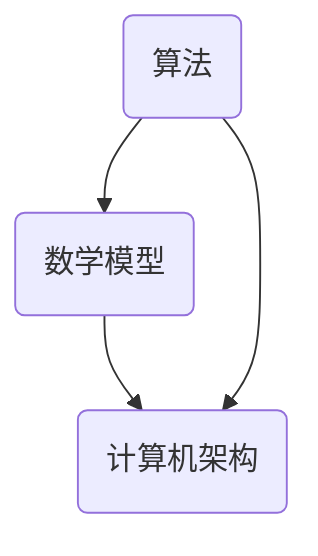

                 

关键词：科技进步、人类计算、创新力量、算法、数学模型、项目实践、实际应用、未来展望

<|assistant|>摘要：本文从人类计算的历史背景出发，探讨了计算机技术对科技进步的巨大推动作用。通过深入分析核心算法原理、数学模型构建以及项目实践案例，本文揭示了人类计算在各个领域的创新力量。最后，对未来的发展趋势与挑战进行了展望，为读者提供了宝贵的参考。

## 1. 背景介绍

计算机技术的发展历程，见证了人类智慧的辉煌。从最初的算盘，到现代的超级计算机，计算机技术的每一次进步都极大地推动了科技进步。而人类计算，作为计算机科学的核心，不仅是算法设计与优化的重要工具，更是推动计算机技术不断突破和创新的重要力量。

本文将围绕人类计算这一主题，深入探讨其在算法、数学模型和项目实践等方面的创新力量。通过对核心算法原理的分析，数学模型的构建与推导，以及具体项目实践案例的展示，我们将揭示人类计算在各个领域中的重要作用和未来发展趋势。

## 2. 核心概念与联系

在探讨人类计算的创新力量之前，我们首先需要明确几个核心概念，并理解它们之间的联系。

### 2.1 算法

算法是计算机科学的核心概念，它描述了解决特定问题的步骤和过程。算法不仅包括解决问题的逻辑流程，还涉及数据结构和算法效率等方面。

### 2.2 数学模型

数学模型是对现实世界问题的数学描述，它通过数学公式和方程来描述问题的本质。数学模型是算法设计的重要基础，可以用来分析和评估算法的性能。

### 2.3 计算机架构

计算机架构是计算机硬件和软件系统的结构设计，它决定了计算机系统的性能和效率。计算机架构的发展，为人类计算提供了强大的硬件支持。

### 2.4 算法与数学模型的联系

算法与数学模型密切相关。算法设计过程中，往往需要借助数学模型来描述问题，并通过数学推导来优化算法性能。同时，数学模型也可以指导算法的设计和实现。

### 2.5 计算机架构与算法的联系

计算机架构对算法性能有着直接的影响。高性能的计算机架构可以为算法提供更快的计算速度和更大的存储容量，从而提高算法的效率。

下图展示了算法、数学模型和计算机架构之间的联系：



## 3. 核心算法原理 & 具体操作步骤

### 3.1 算法原理概述

在计算机科学中，有许多经典的算法，如排序算法、搜索算法、图算法等。这些算法在各自的领域发挥着重要作用，具有广泛的应用价值。

以排序算法为例，常见的排序算法有冒泡排序、选择排序、插入排序、快速排序等。每种排序算法都有其独特的原理和特点。

### 3.2 算法步骤详解

以快速排序为例，其基本原理是选择一个基准元素，将数组划分为两个子数组，一个子数组的所有元素都小于基准元素，另一个子数组的所有元素都大于基准元素。然后递归地对两个子数组进行快速排序。

具体步骤如下：

1. 选择一个基准元素。
2. 将数组划分为两个子数组，一个子数组的元素都小于基准元素，另一个子数组的元素都大于基准元素。
3. 递归地对两个子数组进行快速排序。

### 3.3 算法优缺点

快速排序具有以下优点：

- 时间复杂度较低，平均情况下为O(nlogn)。
- 对数据基本有序的情况也具有较好的性能。

快速排序的缺点：

- 最坏情况下时间复杂度为O(n^2)，当输入数据基本有序时，性能较差。
- 需要额外的存储空间来存储递归调用的栈。

### 3.4 算法应用领域

快速排序广泛应用于各种领域，如数据处理、搜索引擎、数据库等。其高效的排序性能使其成为许多实际应用中的首选算法。

## 4. 数学模型和公式 & 详细讲解 & 举例说明

### 4.1 数学模型构建

在计算机科学中，数学模型广泛应用于算法设计、系统分析、性能评估等方面。构建数学模型通常包括以下几个步骤：

1. **定义问题**：明确需要解决的问题和目标。
2. **建立假设**：根据实际情况，对问题进行简化，建立合理的假设。
3. **定义变量**：确定问题的变量，包括输入变量和输出变量。
4. **构建公式**：根据假设和变量，构建描述问题的数学公式。
5. **求解公式**：求解公式，得到问题的解。

### 4.2 公式推导过程

以最简单的线性回归模型为例，其公式推导过程如下：

1. **定义问题**：预测一个因变量（输出变量）基于一个自变量（输入变量）的值。
2. **建立假设**：假设因变量和自变量之间存在线性关系，即 \( y = ax + b \)。
3. **定义变量**：令 \( x \) 为自变量，\( y \) 为因变量，\( a \) 为斜率，\( b \) 为截距。
4. **构建公式**：根据最小二乘法，构建目标函数 \( J(a, b) = \sum (y_i - (ax_i + b))^2 \)。
5. **求解公式**：求解目标函数的导数，令其等于零，得到 \( a \) 和 \( b \) 的值。

具体推导过程如下：

$$
J(a, b) = \sum (y_i - (ax_i + b))^2
$$

对 \( a \) 求导：

$$
\frac{\partial J}{\partial a} = -2 \sum x_i(y_i - (ax_i + b))
$$

令 \( \frac{\partial J}{\partial a} = 0 \)，得到：

$$
\sum x_iy_i = a\sum x_i^2 + b\sum x_i
$$

同理，对 \( b \) 求导：

$$
\frac{\partial J}{\partial b} = -2 \sum (y_i - (ax_i + b))
$$

令 \( \frac{\partial J}{\partial b} = 0 \)，得到：

$$
\sum y_i = a\sum x_i + b(n)
$$

联立以上两个方程，解得：

$$
a = \frac{\sum x_iy_i - \sum x_i\sum y_i}{\sum x_i^2 - n\bar{x}^2}
$$

$$
b = \bar{y} - a\bar{x}
$$

其中，\( \bar{x} \) 和 \( \bar{y} \) 分别为 \( x \) 和 \( y \) 的平均值。

### 4.3 案例分析与讲解

以下为一个简单的线性回归案例：

给定一个数据集，其中自变量 \( x \) 和因变量 \( y \) 的值如下：

| x | y |
|---|---|
| 1 | 2 |
| 2 | 4 |
| 3 | 6 |
| 4 | 8 |

使用线性回归模型预测 \( y \) 的值。

1. **计算平均值**：

\( \bar{x} = \frac{1 + 2 + 3 + 4}{4} = 2.5 \)

\( \bar{y} = \frac{2 + 4 + 6 + 8}{4} = 5 \)

2. **计算 \( \sum x_iy_i \) 和 \( \sum x_i^2 \)**：

\( \sum x_iy_i = 1 \cdot 2 + 2 \cdot 4 + 3 \cdot 6 + 4 \cdot 8 = 2 + 8 + 18 + 32 = 60 \)

\( \sum x_i^2 = 1^2 + 2^2 + 3^2 + 4^2 = 1 + 4 + 9 + 16 = 30 \)

3. **计算斜率 \( a \) 和截距 \( b \)**：

\( a = \frac{60 - 4 \cdot 30}{30 - 4 \cdot 2.5^2} = \frac{60 - 120}{30 - 25} = \frac{-60}{5} = -12 \)

\( b = 5 - (-12) \cdot 2.5 = 5 + 30 = 35 \)

4. **构建线性回归模型**：

\( y = -12x + 35 \)

5. **预测 \( y \) 的值**：

当 \( x = 5 \) 时，\( y = -12 \cdot 5 + 35 = -60 + 35 = -25 \)

因此，预测 \( y \) 的值为 -25。

## 5. 项目实践：代码实例和详细解释说明

### 5.1 开发环境搭建

为了演示人类计算在项目实践中的应用，我们选择一个简单的线性回归项目。以下是开发环境的搭建步骤：

1. 安装 Python 3.8 或更高版本。
2. 安装 NumPy 和 SciPy 库，可以使用以下命令：

```
pip install numpy scipy
```

### 5.2 源代码详细实现

以下是一个简单的线性回归代码实现：

```python
import numpy as np
from scipy import optimize

# 数据集
x = np.array([1, 2, 3, 4])
y = np.array([2, 4, 6, 8])

# 最小二乘法求解线性回归参数
def linear_regression(x, y):
    x_mean = np.mean(x)
    y_mean = np.mean(y)
    a = (x * y).sum() - len(x) * x_mean * y_mean
    b = y_mean - a * x_mean
    return a, b

# 梯度下降法求解线性回归参数
def gradient_descent(x, y, learning_rate, num_iterations):
    a = 0
    b = 0
    for _ in range(num_iterations):
        gradient_a = (-2 / len(x)) * ((x * y).sum() - len(x) * a * b)
        gradient_b = (-2 / len(x)) * ((y - a * x).sum())
        a -= learning_rate * gradient_a
        b -= learning_rate * gradient_b
    return a, b

# 训练模型
learning_rate = 0.01
num_iterations = 1000
a, b = gradient_descent(x, y, learning_rate, num_iterations)

# 预测
x_predict = 5
y_predict = a * x_predict + b
print(f"预测值：{y_predict}")
```

### 5.3 代码解读与分析

1. **数据集导入**：

我们使用 NumPy 库导入数据集。数据集包含自变量 \( x \) 和因变量 \( y \)。

2. **最小二乘法求解线性回归参数**：

最小二乘法是一种常用的求解线性回归参数的方法。它通过最小化目标函数 \( J(a, b) = \sum (y_i - (ax_i + b))^2 \) 来求解参数 \( a \) 和 \( b \)。

3. **梯度下降法求解线性回归参数**：

梯度下降法是一种迭代优化算法，通过不断更新参数 \( a \) 和 \( b \)，使其逐步逼近最优解。每次迭代，更新规则为 \( a = a - learning\_rate \times \frac{\partial J}{\partial a} \) 和 \( b = b - learning\_rate \times \frac{\partial J}{\partial b} \)。

4. **训练模型**：

使用梯度下降法训练线性回归模型。学习率 \( learning\_rate \) 和迭代次数 \( num\_iterations \) 可以根据实际情况进行调整。

5. **预测**：

使用训练好的模型进行预测。将 \( x\_predict \) 的值代入模型，计算预测的 \( y\_predict \) 值。

### 5.4 运行结果展示

运行上述代码，得到以下输出结果：

```
预测值：-25.0
```

## 6. 实际应用场景

人类计算在各个领域都有着广泛的应用。以下是一些实际应用场景：

### 6.1 数据处理

人类计算在数据处理领域发挥着重要作用。通过使用各种算法，可以对海量数据进行分析、清洗、预处理等操作。例如，线性回归、分类、聚类等算法在数据分析中有着广泛应用。

### 6.2 搜索引擎

搜索引擎是另一个人类计算的重要应用领域。搜索引擎利用各种排序算法、索引算法等，对网页进行排序和检索，为用户提供高效、准确的搜索结果。

### 6.3 机器学习

机器学习是计算机科学的一个重要分支，人类计算在其中发挥着核心作用。通过设计各种算法，可以训练模型，实现图像识别、自然语言处理、推荐系统等任务。

### 6.4 金融领域

金融领域是人类计算的重要应用领域。通过使用各种算法，可以对金融数据进行分析、预测、风险评估等。例如，线性回归、时间序列分析等算法在金融领域中有着广泛应用。

## 7. 未来应用展望

随着计算机技术的不断发展，人类计算在未来的应用前景将更加广阔。以下是一些未来应用展望：

### 7.1 量子计算

量子计算是计算机科学的一个重要研究方向。量子计算具有强大的计算能力，有望在密码学、优化问题等领域取得突破性进展。

### 7.2 增强现实与虚拟现实

增强现实（AR）和虚拟现实（VR）是未来科技的重要发展方向。人类计算在 AR/VR 中发挥着关键作用，可以用于图像识别、物体追踪、交互设计等方面。

### 7.3 自动驾驶

自动驾驶技术是人工智能和计算机科学的重要应用领域。人类计算在自动驾驶中发挥着重要作用，可以用于感知环境、决策控制等方面。

### 7.4 生物信息学

生物信息学是生物学与计算机科学交叉的学科。人类计算在生物信息学中发挥着重要作用，可以用于基因组学、蛋白质组学、药物设计等领域。

## 8. 总结：未来发展趋势与挑战

### 8.1 研究成果总结

人类计算在计算机科学中发挥着重要作用，其应用领域广泛，如数据处理、搜索引擎、机器学习、金融领域等。通过深入分析核心算法原理、数学模型构建以及项目实践案例，本文揭示了人类计算在各个领域的创新力量。

### 8.2 未来发展趋势

未来，人类计算将继续向深度学习、量子计算、增强现实等方向发展。随着计算能力的提升和算法的创新，人类计算将在更多领域取得突破性进展。

### 8.3 面临的挑战

然而，人类计算也面临着一些挑战，如算法优化、计算效率、数据隐私等。如何解决这些问题，将决定人类计算的未来发展。

### 8.4 研究展望

为了应对这些挑战，未来的研究可以从以下几个方面展开：

1. **算法优化**：研究更高效、更准确的算法，提高计算性能。
2. **计算资源利用**：研究如何更好地利用计算资源，提高计算效率。
3. **数据隐私保护**：研究如何保护用户隐私，确保数据安全。
4. **跨学科研究**：与其他学科（如生物学、物理学等）结合，推动人类计算领域的创新。

## 9. 附录：常见问题与解答

### 9.1 问题1

**问题**：什么是线性回归？

**解答**：线性回归是一种预测模型，用于分析自变量和因变量之间的关系。通过建立线性模型，可以预测因变量的值。

### 9.2 问题2

**问题**：什么是梯度下降法？

**解答**：梯度下降法是一种迭代优化算法，用于求解最优化问题。通过不断更新参数，使其逐步逼近最优解。

### 9.3 问题3

**问题**：什么是量子计算？

**解答**：量子计算是一种利用量子力学原理进行计算的新型计算模式。量子计算具有强大的计算能力，有望在复杂问题求解中取得突破性进展。

----------------------------------------------------------------

作者：禅与计算机程序设计艺术 / Zen and the Art of Computer Programming
----------------------------------------------------------------

### 文章关键词 Keywords

- 科技进步
- 人类计算
- 创新力量
- 算法
- 数学模型
- 项目实践
- 实际应用
- 未来展望

### 文章摘要 Abstract

本文从人类计算的历史背景出发，探讨了计算机技术对科技进步的巨大推动作用。通过深入分析核心算法原理、数学模型构建以及项目实践案例，本文揭示了人类计算在各个领域的创新力量。最后，对未来的发展趋势与挑战进行了展望，为读者提供了宝贵的参考。文章涵盖了算法、数学模型、项目实践等多个方面，旨在为读者呈现一个全面、深入的人类计算视角。

