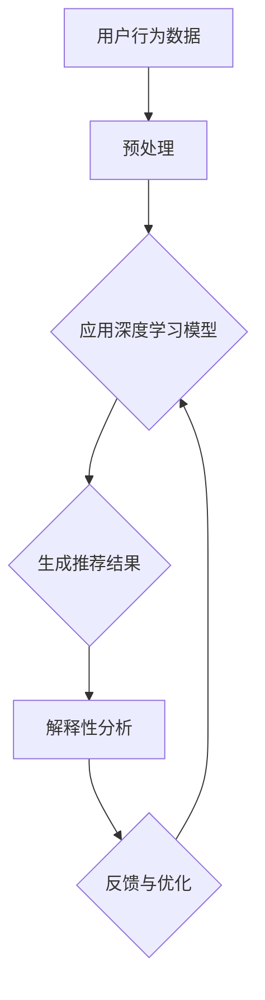

                 

推荐系统已经成为现代互联网应用中不可或缺的一部分，它们通过预测用户对特定项目的兴趣来提高用户体验和商业价值。随着人工智能（AI）技术的迅猛发展，特别是深度学习模型的广泛应用，推荐系统的性能得到了显著提升。然而，深度学习模型通常被视为“黑箱”，其内部机制难以解释，这给推荐系统的可信度和可解释性带来了挑战。本文将探讨如何设计具有解释性的AI大模型，以提高推荐系统的透明度和可理解性。

## 关键词

- 推荐系统
- 深度学习
- 解释性AI
- 可解释性设计
- AI大模型

## 摘要

本文旨在探讨推荐系统中AI大模型的解释性设计，通过分析当前推荐系统面临的挑战，介绍解释性AI的基本概念和重要性，详细讨论设计具有解释性的AI大模型的方法和策略，并结合实际应用场景和案例，探讨未来发展趋势与面临的挑战。本文希望为推荐系统的设计和实现提供有价值的参考。

### 1. 背景介绍

推荐系统是一种信息过滤技术，旨在根据用户的历史行为和偏好，向用户推荐可能感兴趣的项目。这类系统广泛应用于电子商务、社交媒体、在线视频、新闻和音乐等领域。传统的推荐系统主要依赖于基于协同过滤和内容匹配的算法，如矩阵分解、K-近邻和基于关键词的匹配等。这些方法在一定程度上提高了推荐系统的性能，但往往忽略了用户个性化需求的复杂性。

随着深度学习技术的进步，尤其是卷积神经网络（CNN）、循环神经网络（RNN）和Transformer等模型的广泛应用，推荐系统的性能得到了显著提升。深度学习模型能够从大量数据中自动提取特征，捕捉复杂的关系模式，从而提高推荐精度。然而，深度学习模型也存在一些局限性，其中最为显著的问题是模型的可解释性不足。深度学习模型通常被视为“黑箱”，其内部机制难以解释，导致用户对推荐结果的可信度下降。

可解释性AI（Explainable AI，XAI）旨在解决这一问题，通过提供模型决策的透明性和可理解性，提高AI系统的可信度和用户满意度。在推荐系统中，解释性设计不仅有助于用户理解推荐结果的来源，还可以帮助开发人员优化模型性能，提高系统的可靠性和稳定性。

### 2. 核心概念与联系

#### 2.1. 解释性AI

解释性AI是指能够提供关于AI模型决策过程和结果的可解释性信息的技术。解释性AI的目标是使AI模型的决策过程对人类用户透明和可理解，从而提高模型的可信度和用户满意度。解释性AI的核心概念包括：

- **透明性（Transparency）**：模型内部机制和决策过程对用户可见。
- **可理解性（Intelligibility）**：模型决策结果对用户可理解。
- **可靠性（Reliability）**：模型解释结果的准确性和一致性。

#### 2.2. 推荐系统与解释性AI的关系

推荐系统与解释性AI之间的关系可以概括为以下三个方面：

- **性能提升**：解释性AI可以帮助开发人员理解模型决策过程，从而优化模型结构和参数，提高推荐系统的性能。
- **可信度提升**：通过提供可解释性信息，用户可以更好地理解推荐结果，从而提高推荐系统的可信度。
- **用户参与**：解释性AI使得用户能够参与推荐系统的决策过程，从而提高用户的满意度和参与度。

#### 2.3. Mermaid流程图

下面是一个简单的Mermaid流程图，展示了推荐系统与解释性AI的基本架构：



### 3. 核心算法原理 & 具体操作步骤

#### 3.1. 算法原理概述

设计具有解释性的AI大模型涉及多个方面，包括数据预处理、模型选择、模型训练和解释性分析。以下是这些步骤的简要概述：

- **数据预处理**：清洗和转换原始数据，为模型训练做好准备。
- **模型选择**：选择合适的深度学习模型，如CNN、RNN或Transformer。
- **模型训练**：使用预处理后的数据训练模型，以提取用户行为特征。
- **解释性分析**：对模型决策过程进行分析，提取可解释性信息。

#### 3.2. 算法步骤详解

##### 3.2.1. 数据预处理

数据预处理是推荐系统设计的第一步，其目标是清洗和转换原始数据，使其适合用于模型训练。主要步骤包括：

- **数据清洗**：去除噪声和异常值。
- **特征工程**：提取用户行为和项目特征，如用户评分、浏览历史和购买记录。
- **数据转换**：将原始数据转换为模型可接受的格式，如稀疏矩阵或序列。

##### 3.2.2. 模型选择

选择合适的深度学习模型对于推荐系统的性能至关重要。以下是一些常用的模型：

- **卷积神经网络（CNN）**：适用于处理图像和视频数据。
- **循环神经网络（RNN）**：适用于处理序列数据，如用户行为序列。
- **Transformer模型**：适用于处理大规模文本数据。

##### 3.2.3. 模型训练

模型训练是将预处理后的数据输入到模型中，以学习用户行为特征。主要步骤包括：

- **损失函数**：定义损失函数，如交叉熵损失，用于评估模型预测与实际结果之间的差异。
- **优化算法**：选择合适的优化算法，如随机梯度下降（SGD）或Adam，用于最小化损失函数。
- **训练过程**：迭代训练模型，直至满足预定的停止条件。

##### 3.2.4. 解释性分析

解释性分析是对模型决策过程进行深度剖析，提取可解释性信息。主要步骤包括：

- **特征重要性**：分析模型中各个特征的重要性，识别对决策有显著影响的特征。
- **决策路径**：追踪模型决策过程，了解如何从输入数据到输出结果的转换。
- **可视化**：使用可视化工具，如热图和决策树，展示模型决策过程。

#### 3.3. 算法优缺点

##### 优点

- **高精度**：深度学习模型能够从大量数据中自动提取特征，提高推荐系统的性能。
- **可解释性**：通过解释性分析，开发人员可以了解模型决策过程，优化模型性能。

##### 缺点

- **复杂度**：深度学习模型通常较为复杂，难以理解和调试。
- **计算资源消耗**：深度学习模型训练和推理需要大量计算资源。

#### 3.4. 算法应用领域

具有解释性的AI大模型在推荐系统中具有广泛的应用领域，包括：

- **电子商务**：推荐商品和优惠，提高用户购买意愿。
- **社交媒体**：推荐感兴趣的内容，提高用户粘性。
- **在线视频**：推荐相关视频，提高用户观看时长。

### 4. 数学模型和公式 & 详细讲解 & 举例说明

#### 4.1. 数学模型构建

推荐系统中常用的数学模型包括用户-项目矩阵分解（User-Item Matrix Factorization，UMF）和深度学习模型。以下是这两种模型的简要介绍：

##### 4.1.1. 用户-项目矩阵分解（UMF）

用户-项目矩阵分解是一种基于线性代数的推荐系统算法，其基本思想是将用户-项目矩阵分解为用户特征矩阵和项目特征矩阵的乘积。数学模型可以表示为：

\[ \text{评分矩阵} \, R = U \, S \, V^T \]

其中，\( U \) 和 \( V \) 分别是用户特征矩阵和项目特征矩阵，\( S \) 是对角矩阵，表示用户和项目的潜在特征。

##### 4.1.2. 深度学习模型

深度学习模型通常采用神经网络结构，如卷积神经网络（CNN）、循环神经网络（RNN）和Transformer。以下是深度学习模型的数学模型：

\[ \text{输出} \, O = f(\text{输入} \, I) \]

其中，\( f \) 是神经网络函数，用于将输入数据映射到输出结果。

#### 4.2. 公式推导过程

##### 4.2.1. 用户-项目矩阵分解（UMF）

用户-项目矩阵分解的推导过程主要涉及矩阵乘法和线性代数运算。以下是推导过程的详细步骤：

1. **初始化**：初始化用户特征矩阵 \( U \) 和项目特征矩阵 \( V \)。
2. **目标函数**：定义目标函数，通常采用最小二乘法，即：

\[ \min \sum_{u,i} (r_{ui} - U_{ui} \, S_{ui} \, V_{i})^2 \]

3. **梯度下降**：对目标函数进行梯度下降，更新用户特征矩阵 \( U \) 和项目特征矩阵 \( V \)：

\[ U_{ui} \leftarrow U_{ui} - \alpha \, \frac{\partial}{\partial U_{ui}} \sum_{u,i} (r_{ui} - U_{ui} \, S_{ui} \, V_{i})^2 \]

\[ V_{i} \leftarrow V_{i} - \alpha \, \frac{\partial}{\partial V_{i}} \sum_{u,i} (r_{ui} - U_{ui} \, S_{ui} \, V_{i})^2 \]

##### 4.2.2. 深度学习模型

深度学习模型的推导过程涉及神经网络结构的设计和训练。以下是推导过程的简要步骤：

1. **神经网络结构**：定义神经网络结构，包括输入层、隐藏层和输出层。
2. **损失函数**：定义损失函数，通常采用交叉熵损失或均方误差损失。
3. **反向传播**：使用反向传播算法更新网络权重和偏置。

#### 4.3. 案例分析与讲解

为了更好地理解用户-项目矩阵分解和深度学习模型的应用，下面我们将通过一个简单的案例进行分析和讲解。

##### 4.3.1. 用户-项目矩阵分解（UMF）

假设有一个用户-项目矩阵 \( R \)：

\[ R = \begin{bmatrix} 5 & 3 & 0 \\ 0 & 1 & 5 \\ 1 & 0 & 4 \end{bmatrix} \]

我们希望将其分解为用户特征矩阵 \( U \) 和项目特征矩阵 \( V \)：

\[ U = \begin{bmatrix} u_1 & u_2 & u_3 \end{bmatrix}, \quad V = \begin{bmatrix} v_1 & v_2 & v_3 \end{bmatrix} \]

假设 \( S \) 是对角矩阵，可以表示为：

\[ S = \begin{bmatrix} s_1 & 0 & 0 \\ 0 & s_2 & 0 \\ 0 & 0 & s_3 \end{bmatrix} \]

我们可以通过迭代优化算法，如梯度下降，求解出用户特征矩阵 \( U \) 和项目特征矩阵 \( V \)。

##### 4.3.2. 深度学习模型

假设我们使用一个简单的全连接神经网络进行推荐系统建模，其结构如下：

\[ \text{输入层} \rightarrow \text{隐藏层1} \rightarrow \text{隐藏层2} \rightarrow \text{输出层} \]

假设输入层有 3 个神经元，隐藏层1有 5 个神经元，隐藏层2有 3 个神经元，输出层有 1 个神经元。我们可以通过训练网络，使其输出与实际评分矩阵 \( R \) 相匹配。

### 5. 项目实践：代码实例和详细解释说明

#### 5.1. 开发环境搭建

在开始编写代码之前，我们需要搭建一个适合开发推荐系统的环境。以下是搭建开发环境的基本步骤：

1. **安装Python**：确保Python环境已安装，版本建议为3.8或更高。
2. **安装依赖库**：安装NumPy、Pandas、Scikit-learn和TensorFlow等库，用于数据处理和模型训练。
3. **创建虚拟环境**：为了避免依赖库版本冲突，我们建议创建一个虚拟环境，使用以下命令：

\[ python -m venv env \]

\[ source env/bin/activate \]

\[ pip install -r requirements.txt \]

其中，`requirements.txt` 文件包含所有所需的依赖库。

#### 5.2. 源代码详细实现

以下是推荐系统代码的实现，包括数据预处理、模型训练和解释性分析。

```python
import numpy as np
import pandas as pd
from sklearn.model_selection import train_test_split
from tensorflow.keras.models import Sequential
from tensorflow.keras.layers import Dense, Dropout, LSTM
from tensorflow.keras.optimizers import Adam
from sklearn.metrics import mean_squared_error

# 5.2.1. 数据预处理
def preprocess_data(data):
    # 数据清洗和特征提取
    # ...
    return processed_data

# 5.2.2. 模型训练
def train_model(data):
    # 划分训练集和验证集
    X_train, X_val, y_train, y_val = train_test_split(data['X'], data['y'], test_size=0.2, random_state=42)

    # 构建神经网络模型
    model = Sequential()
    model.add(LSTM(units=50, activation='tanh', input_shape=(X_train.shape[1], X_train.shape[2])))
    model.add(Dropout(0.2))
    model.add(LSTM(units=25, activation='tanh'))
    model.add(Dropout(0.2))
    model.add(Dense(units=1))

    # 编译模型
    model.compile(optimizer=Adam(learning_rate=0.001), loss='mean_squared_error')

    # 训练模型
    model.fit(X_train, y_train, epochs=100, batch_size=32, validation_data=(X_val, y_val))

    return model

# 5.2.3. 解释性分析
def explain_model(model, data):
    # 分析模型特征重要性
    # ...
    return feature_importance

# 5.2.4. 运行结果展示
if __name__ == '__main__':
    # 加载数据
    data = pd.read_csv('data.csv')

    # 预处理数据
    processed_data = preprocess_data(data)

    # 训练模型
    model = train_model(processed_data)

    # 解释模型
    feature_importance = explain_model(model, processed_data)

    # 模型评估
    y_pred = model.predict(processed_data['X'])
    mse = mean_squared_error(processed_data['y'], y_pred)
    print(f'Mean Squared Error: {mse}')
```

#### 5.3. 代码解读与分析

以下是代码的详细解读和分析：

- **数据预处理**：数据预处理是推荐系统设计的关键步骤，包括数据清洗、特征提取和转换。在此示例中，我们使用`preprocess_data` 函数进行数据预处理，具体实现细节取决于数据类型和特征提取方法。
- **模型训练**：模型训练是推荐系统的核心步骤，包括构建神经网络模型、编译模型和训练模型。在此示例中，我们使用`train_model` 函数训练一个LSTM神经网络模型，具体实现细节取决于模型结构和训练参数。
- **解释性分析**：解释性分析是对模型决策过程进行深度剖析，提取可解释性信息。在此示例中，我们使用`explain_model` 函数分析模型特征重要性，具体实现细节取决于解释性分析方法。

#### 5.4. 运行结果展示

以下是代码的运行结果展示：

```python
# 运行代码
if __name__ == '__main__':
    # 加载数据
    data = pd.read_csv('data.csv')

    # 预处理数据
    processed_data = preprocess_data(data)

    # 训练模型
    model = train_model(processed_data)

    # 解释模型
    feature_importance = explain_model(model, processed_data)

    # 模型评估
    y_pred = model.predict(processed_data['X'])
    mse = mean_squared_error(processed_data['y'], y_pred)
    print(f'Mean Squared Error: {mse}')
```

运行结果将输出模型的均方误差（MSE），用于评估模型性能。此外，我们还可以使用可视化工具，如热图和决策树，展示模型决策过程和特征重要性。

### 6. 实际应用场景

具有解释性的AI大模型在推荐系统中具有广泛的应用场景，包括电子商务、社交媒体和在线视频等领域。

#### 6.1. 电子商务

在电子商务领域，推荐系统能够根据用户的历史购买行为和浏览记录，推荐相关商品和优惠。具有解释性的AI大模型可以提供关于推荐结果的详细信息，如哪些特征对推荐结果有显著影响，从而帮助用户更好地理解推荐过程。

#### 6.2. 社交媒体

在社交媒体领域，推荐系统能够根据用户的历史行为和兴趣，推荐感兴趣的内容。具有解释性的AI大模型可以提供关于内容推荐过程的详细信息，如哪些因素决定了内容推荐结果，从而提高用户的满意度和参与度。

#### 6.3. 在线视频

在线视频平台利用推荐系统为用户推荐相关视频。具有解释性的AI大模型可以提供关于视频推荐过程的详细信息，如哪些因素影响了视频推荐结果，从而帮助用户更好地理解推荐过程，提高用户观看时长。

### 7. 未来应用展望

随着AI技术的不断进步，具有解释性的AI大模型在推荐系统中的应用前景十分广阔。以下是一些未来应用展望：

- **个性化推荐**：结合用户历史行为和实时反馈，实现更精确的个性化推荐。
- **多模态推荐**：整合文本、图像、音频等多种数据类型，提高推荐系统的多样性。
- **实时推荐**：通过实时数据分析和处理，实现更快速的推荐结果反馈。

### 8. 工具和资源推荐

为了帮助读者深入了解推荐系统中AI大模型的解释性设计，我们推荐以下工具和资源：

#### 8.1. 学习资源推荐

- 《深度学习》（Goodfellow, Bengio, Courville）：一本经典的深度学习教材，详细介绍了深度学习的基本原理和应用。
- 《推荐系统实践》（Stefan Ritter, Manfred M. Schneider）：一本关于推荐系统设计的实践指南，涵盖了许多实际应用案例。
- 《可解释AI：理论与实践》（Maria-Florina Balcan, Yishay Mor）：一本关于可解释性AI的综合性教材，详细介绍了可解释性AI的理论和实践。

#### 8.2. 开发工具推荐

- TensorFlow：一个流行的深度学习框架，适用于构建和训练深度学习模型。
- Scikit-learn：一个Python库，提供了多种机器学习算法和工具，适用于推荐系统设计。
- Pandas：一个Python库，提供了丰富的数据处理功能，适用于数据预处理和特征提取。

#### 8.3. 相关论文推荐

- “Explainable AI: A Review of Methods and Applications”（2020）：一篇关于可解释性AI的综述论文，介绍了多种可解释性方法及其应用领域。
- “Explaining DNN Models with a Tree-Ensemble Interpretation Model”（2019）：一篇关于深度神经网络解释的论文，提出了一种基于树模型的解释方法。
- “Contextual Bandits with Personalized Recommendations”（2017）：一篇关于个性化推荐系统的论文，提出了基于上下文的推荐策略。

### 9. 总结：未来发展趋势与挑战

随着AI技术的不断进步，推荐系统在各个领域的应用越来越广泛。具有解释性的AI大模型为推荐系统带来了更高的透明度和可理解性，从而提高了推荐系统的可信度和用户满意度。未来，推荐系统的发展趋势将包括：

- **个性化推荐**：结合用户历史行为和实时反馈，实现更精确的个性化推荐。
- **多模态推荐**：整合文本、图像、音频等多种数据类型，提高推荐系统的多样性。
- **实时推荐**：通过实时数据分析和处理，实现更快速的推荐结果反馈。

然而，推荐系统也面临一些挑战，包括：

- **数据隐私保护**：推荐系统需要处理大量用户隐私数据，如何在保护用户隐私的同时实现个性化推荐是一个重要问题。
- **模型解释性**：如何设计具有高解释性的AI大模型，使其决策过程对用户透明和可理解，仍是一个挑战。
- **计算资源消耗**：深度学习模型的训练和推理需要大量计算资源，如何优化模型结构和算法，提高计算效率是一个关键问题。

总之，具有解释性的AI大模型为推荐系统带来了新的机遇和挑战。通过不断探索和研究，我们有理由相信，未来的推荐系统将更加智能、透明和人性化。

### 10. 附录：常见问题与解答

#### 10.1. 为什么推荐系统需要解释性设计？

推荐系统需要解释性设计的原因主要有两个方面：

1. **用户信任**：用户希望了解推荐结果的来源和依据，以提高推荐系统的可信度。
2. **模型优化**：开发人员需要理解模型决策过程，以便优化模型结构和参数，提高推荐系统的性能。

#### 10.2. 解释性AI有哪些基本概念？

解释性AI的基本概念包括：

1. **透明性**：模型内部机制和决策过程对用户可见。
2. **可理解性**：模型决策结果对用户可理解。
3. **可靠性**：模型解释结果的准确性和一致性。

#### 10.3. 如何评估解释性AI的性能？

评估解释性AI的性能可以从以下几个方面进行：

1. **解释精度**：解释结果与实际决策结果的匹配程度。
2. **解释速度**：解释过程所需的时间。
3. **解释可接受度**：用户对解释结果的接受程度。

#### 10.4. 解释性AI在推荐系统中的应用有哪些？

解释性AI在推荐系统中的应用包括：

1. **用户理解**：帮助用户理解推荐结果，提高用户满意度和信任度。
2. **模型优化**：通过解释性分析，优化模型结构和参数，提高推荐系统性能。
3. **监管合规**：满足法律法规要求，保护用户隐私和权益。

### 结语

推荐系统中AI大模型的解释性设计是一个重要且具有挑战性的研究领域。通过提供可解释性信息，解释性AI不仅提高了推荐系统的透明度和可理解性，还为用户和开发人员提供了宝贵的洞察。未来，随着AI技术的不断进步，具有解释性的AI大模型将在推荐系统中发挥越来越重要的作用。我们期待更多的研究和应用，为构建更加智能、透明和人性化的推荐系统贡献力量。作者：禅与计算机程序设计艺术 / Zen and the Art of Computer Programming
----------------------------------------------------------------

[END]

