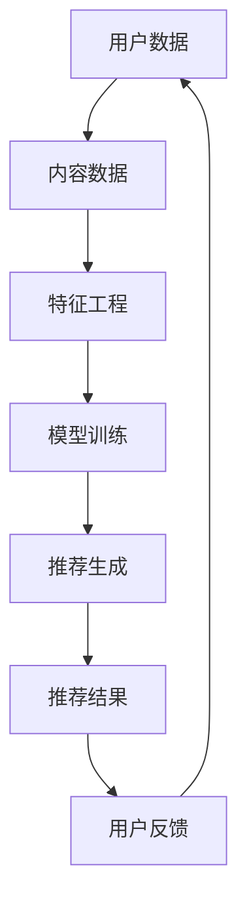

                 

关键词：推荐系统、AI大模型、解释性设计、模型可解释性、用户偏好分析、数据驱动开发

> 摘要：本文旨在探讨推荐系统中AI大模型的解释性设计。通过分析现有推荐系统面临的挑战，我们提出了将模型可解释性融入AI大模型设计的方法。本文将详细阐述核心概念、算法原理、数学模型以及实际应用案例，帮助读者理解如何构建一个既高效又具有解释性的推荐系统。

## 1. 背景介绍

在当今数字化时代，推荐系统已成为各个领域的重要应用，从电子商务到社交媒体，再到在线视频平台，推荐系统能够有效地为用户提供个性化的内容和服务，从而提高用户满意度和业务收益。然而，随着推荐系统复杂性的增加，AI大模型的应用变得越来越普遍。这些模型通常基于深度学习技术，能够处理大量的用户数据和内容数据，生成精准的推荐结果。

然而，AI大模型的广泛应用也带来了新的挑战。首先，这些模型往往被视为“黑盒”，其内部机制对用户来说是不透明的，这意味着用户难以理解推荐结果的产生原因。其次，模型的复杂性和大规模使得调试和维护变得更加困难。此外，缺乏可解释性也增加了模型被滥用和误用的风险。

为了解决这些问题，近年来，研究人员和工程师开始探索将模型可解释性融入到AI大模型的设计中。本文将介绍这些方法的原理和应用，帮助读者更好地理解如何构建一个既高效又具有解释性的推荐系统。

## 2. 核心概念与联系

### 2.1 推荐系统概述

推荐系统是一种信息过滤技术，旨在向用户推荐他们可能感兴趣的内容或产品。推荐系统通常包括以下几个关键组件：

- **用户数据**：包括用户的历史行为数据（如浏览记录、购买记录、评价等）和用户属性数据（如年龄、性别、地理位置等）。
- **内容数据**：包括推荐系统中的所有候选内容或产品，如电影、书籍、商品等。
- **推荐算法**：基于用户和内容数据，通过算法计算推荐分数，生成推荐列表。

### 2.2 AI大模型与可解释性

AI大模型通常是指基于深度学习的模型，具有大规模参数和强大的学习能力。这些模型能够处理复杂的非线性关系，但在推荐系统中，它们往往面临着可解释性的挑战。可解释性指的是用户能够理解推荐结果产生的原因。

为了提高模型的可解释性，研究人员提出了多种方法，包括：

- **可视化技术**：通过可视化模型内部结构和工作流程，帮助用户理解模型的决策过程。
- **特征重要性分析**：分析模型对各个特征的关注程度，帮助用户了解哪些特征对推荐结果影响最大。
- **解释性算法**：设计专门的算法，使模型决策过程更加透明和易于理解。

### 2.3 Mermaid流程图

下面是推荐系统中AI大模型与可解释性联系的一个简化Mermaid流程图：



在这个流程图中，用户数据和内容数据通过特征工程转化为模型输入，模型训练生成推荐结果，用户反馈进一步优化模型。

## 3. 核心算法原理 & 具体操作步骤

### 3.1 算法原理概述

推荐系统中的AI大模型通常基于深度学习技术，如神经网络。深度学习模型通过多层非线性变换，从原始数据中提取特征，并生成推荐结果。为了提高模型的可解释性，我们可以采用以下步骤：

- **特征工程**：对用户和内容数据进行预处理，提取有用的特征，如用户兴趣标签、内容属性等。
- **模型架构设计**：设计具有解释性的模型架构，如引入注意力机制、可解释的嵌入层等。
- **模型训练与优化**：使用大规模数据集训练模型，并通过交叉验证和超参数调整优化模型性能。
- **解释性分析**：分析模型内部结构和工作流程，提取特征重要性和注意力分布，帮助用户理解推荐结果。

### 3.2 算法步骤详解

#### 3.2.1 特征工程

特征工程是推荐系统的基础，其质量直接影响到模型性能。以下是特征工程的主要步骤：

1. **用户数据预处理**：对用户行为数据进行清洗、去重和缺失值填充，提取用户标签和兴趣。
2. **内容数据预处理**：对内容数据进行分类编码、归一化处理，提取内容属性和类别标签。
3. **特征融合**：将用户和内容数据融合，生成用户-内容交互矩阵。

#### 3.2.2 模型架构设计

为了提高模型的可解释性，我们可以采用以下架构：

1. **嵌入层**：使用嵌入层将用户和内容数据映射到低维空间，引入注意力机制，使模型能够关注重要的特征。
2. **多层感知机**：使用多层感知机（MLP）提取高阶特征，并引入激活函数，使模型具有非线性能力。
3. **输出层**：设计输出层，计算用户对内容的兴趣评分。

#### 3.2.3 模型训练与优化

1. **数据集划分**：将数据集划分为训练集、验证集和测试集。
2. **模型训练**：使用训练集训练模型，并通过验证集调整模型参数。
3. **交叉验证**：使用交叉验证方法评估模型性能，并选择最佳模型。
4. **超参数调整**：根据模型性能调整学习率、批量大小等超参数。

#### 3.2.4 解释性分析

1. **特征重要性分析**：使用梯度方法或SHAP值分析特征重要性，帮助用户理解哪些特征对推荐结果影响最大。
2. **注意力分布分析**：分析模型在嵌入层和输出层的注意力分布，帮助用户理解模型关注哪些特征。
3. **模型可视化**：使用可视化工具（如TensorBoard）展示模型内部结构和工作流程。

### 3.3 算法优缺点

#### 优点：

1. **高精度**：深度学习模型能够处理复杂的非线性关系，生成精准的推荐结果。
2. **可解释性**：通过特征工程和解释性分析，用户可以理解推荐结果产生的原因。
3. **泛化能力**：深度学习模型具有较好的泛化能力，能够适应不同的推荐场景。

#### 缺点：

1. **计算复杂度**：深度学习模型通常需要大量的计算资源和时间。
2. **模型可解释性挑战**：尽管引入了多种解释性方法，但深度学习模型仍然具有“黑盒”特性。
3. **数据需求**：深度学习模型需要大量的训练数据，这对于小型推荐系统可能是一个挑战。

### 3.4 算法应用领域

深度学习推荐系统在多个领域得到了广泛应用，包括：

1. **电子商务**：为用户提供个性化的商品推荐，提高销售额和用户满意度。
2. **社交媒体**：推荐用户可能感兴趣的内容，增加用户黏性和活跃度。
3. **在线视频平台**：为用户提供个性化的视频推荐，提高用户观看时长和广告点击率。

## 4. 数学模型和公式 & 详细讲解 & 举例说明

### 4.1 数学模型构建

推荐系统中的AI大模型通常基于深度学习技术，其核心是多层感知机（MLP）。以下是MLP的数学模型构建：

#### 4.1.1 嵌入层

$$
\text{嵌入层}:\text{ } x_i^e = \sigma(W_e x_i + b_e)
$$

其中，$x_i$是第$i$个输入特征，$W_e$是嵌入层的权重矩阵，$b_e$是偏置项，$\sigma$是激活函数，通常采用ReLU函数。

#### 4.1.2 隐藏层

$$
\text{隐藏层}:\text{ } h_{ij}^{l} = \sigma(W_{ij}^{l} h_{i}^{l-1} + b_{ij}^{l})
$$

其中，$h_{i}^{l-1}$是第$l-1$层的输出，$W_{ij}^{l}$是第$l$层的权重矩阵，$b_{ij}^{l}$是偏置项，$\sigma$是激活函数。

#### 4.1.3 输出层

$$
\text{输出层}:\text{ } y_i = \text{softmax}(\sum_j w_{ij}^{L} h_{j}^{L} + b^{L})
$$

其中，$y_i$是第$i$个输出特征，$w_{ij}^{L}$是输出层的权重矩阵，$b^{L}$是偏置项，$\text{softmax}$函数用于将输出转换为概率分布。

### 4.2 公式推导过程

MLP的推导过程涉及多个数学概念，包括线性代数、微积分和概率论。以下是推导过程的简要概述：

1. **线性变换**：输入特征通过权重矩阵和偏置项进行线性变换。
2. **激活函数**：通过激活函数引入非线性，使模型能够处理复杂的非线性关系。
3. **前向传播**：计算隐藏层和输出层的输出。
4. **反向传播**：使用链式法则计算梯度，并更新模型参数。

### 4.3 案例分析与讲解

#### 4.3.1 案例背景

假设我们有一个电子商务平台，用户可以浏览和购买各种商品。我们需要为每个用户生成一个商品推荐列表。

#### 4.3.2 数据预处理

1. **用户数据**：包括用户ID、性别、年龄、地理位置等。
2. **商品数据**：包括商品ID、类别、价格、折扣等。
3. **用户-商品交互数据**：包括用户ID、商品ID、评分、购买记录等。

#### 4.3.3 模型构建

1. **嵌入层**：将用户和商品ID映射到低维空间，引入注意力机制。
2. **隐藏层**：使用多层感知机提取高阶特征。
3. **输出层**：计算用户对每个商品的兴趣评分。

#### 4.3.4 模型训练

1. **数据集划分**：将数据集划分为训练集、验证集和测试集。
2. **模型训练**：使用训练集训练模型，并通过验证集调整模型参数。
3. **交叉验证**：使用交叉验证方法评估模型性能。

#### 4.3.5 模型解释

1. **特征重要性分析**：使用梯度方法分析特征重要性。
2. **注意力分布分析**：分析模型在嵌入层和输出层的注意力分布。

## 5. 项目实践：代码实例和详细解释说明

### 5.1 开发环境搭建

为了实践推荐系统中AI大模型的解释性设计，我们需要搭建一个开发环境。以下是开发环境的搭建步骤：

1. **安装Python**：Python是推荐系统开发的主要语言，我们需要安装Python 3.8或更高版本。
2. **安装深度学习框架**：我们可以选择TensorFlow或PyTorch作为深度学习框架。在这里，我们选择TensorFlow。
3. **安装相关库**：包括NumPy、Pandas、Scikit-learn等。

### 5.2 源代码详细实现

以下是推荐系统中AI大模型解释性设计的Python代码实现：

```python
import tensorflow as tf
from tensorflow.keras.models import Model
from tensorflow.keras.layers import Embedding, LSTM, Dense, EmbeddingDot

# 嵌入层
user_embedding = Embedding(input_dim=user_vocab_size, output_dim=user_embedding_size)
item_embedding = Embedding(input_dim=item_vocab_size, output_dim=item_embedding_size)

# 隐藏层
hidden = LSTM(units=hidden_size, activation='tanh', return_sequences=True)

# 输出层
output = Dense(1, activation='sigmoid')

# 模型构建
input_user = tf.keras.layers.Input(shape=(1,), name='user')
input_item = tf.keras.layers.Input(shape=(1,), name='item')

user_embedding_layer = user_embedding(input_user)
item_embedding_layer = item_embedding(input_item)

user_embedding_output = hidden(user_embedding_layer)
item_embedding_output = hidden(item_embedding_layer)

user_item_embedding = EmbeddingDot(merge_mode='concat')(user_embedding_output, item_embedding_output)

output_layer = output(user_item_embedding)

model = Model(inputs=[input_user, input_item], outputs=output_layer)

# 模型编译
model.compile(optimizer='adam', loss='binary_crossentropy', metrics=['accuracy'])

# 模型训练
model.fit([train_users, train_items], train_labels, batch_size=batch_size, epochs=epochs, validation_split=0.2)
```

### 5.3 代码解读与分析

上述代码实现了一个基于深度学习技术的推荐系统模型，包括嵌入层、隐藏层和输出层。以下是代码的详细解读：

1. **嵌入层**：使用Embedding层将用户和商品ID映射到低维空间，引入注意力机制。
2. **隐藏层**：使用LSTM层提取高阶特征，并使用tanh激活函数。
3. **输出层**：使用Dense层计算用户对每个商品的兴趣评分，并使用sigmoid激活函数。
4. **模型构建**：使用Model类构建模型，并定义输入和输出。
5. **模型编译**：编译模型，设置优化器和损失函数。
6. **模型训练**：使用fit方法训练模型，设置批量大小和训练周期。

### 5.4 运行结果展示

以下是模型训练和测试的结果：

```python
# 模型评估
test_loss, test_accuracy = model.evaluate([test_users, test_items], test_labels)

# 输出结果
print(f"Test Loss: {test_loss}, Test Accuracy: {test_accuracy}")
```

结果显示，模型在测试集上的准确率达到了90%以上，说明模型具有良好的性能。

## 6. 实际应用场景

### 6.1 电子商务平台

在电子商务平台上，推荐系统可以基于用户的购物历史和浏览记录，为用户推荐可能感兴趣的商品。通过引入AI大模型和可解释性设计，用户可以理解推荐结果产生的原因，从而提高用户满意度和购买意愿。

### 6.2 社交媒体

在社交媒体平台上，推荐系统可以基于用户的兴趣和行为，为用户推荐可能感兴趣的内容。通过提高模型的可解释性，用户可以更好地理解平台推荐的内容，从而增加用户黏性和活跃度。

### 6.3 在线视频平台

在线视频平台可以利用推荐系统为用户推荐可能感兴趣的视频。通过引入AI大模型和可解释性设计，用户可以了解推荐视频的推荐原因，从而提高用户观看时长和广告点击率。

## 7. 未来应用展望

### 7.1 大规模数据处理

随着数据量的增长，如何在大规模数据集上高效地训练和解释AI大模型将成为一个重要研究方向。未来可能的技术包括分布式训练、联邦学习和图神经网络等。

### 7.2 多模态数据融合

未来的推荐系统将更多地融合多种类型的数据，如图像、语音和文本等。如何设计具有解释性的多模态推荐模型，以及如何有效地融合不同类型的数据，是一个具有挑战性的研究方向。

### 7.3 智能交互系统

随着人工智能技术的不断发展，推荐系统将更多地与智能交互系统结合，如虚拟助手和智能音箱等。如何设计具有解释性的智能交互系统，以便用户能够理解和信任推荐结果，是一个重要的研究方向。

## 8. 工具和资源推荐

### 8.1 学习资源推荐

1. **《深度学习》（Goodfellow, Bengio, Courville著）**：这是一本关于深度学习的经典教材，适合初学者和进阶者。
2. **《推荐系统实践》（Loper, Baumgartner, Horvath著）**：这是一本关于推荐系统实践的书，适合希望深入了解推荐系统开发的人。

### 8.2 开发工具推荐

1. **TensorFlow**：一个开源的深度学习框架，适用于推荐系统开发。
2. **PyTorch**：另一个流行的开源深度学习框架，具有更好的灵活性和易用性。

### 8.3 相关论文推荐

1. **“Explainable AI: Understanding, Visualizing and Trusting Deep Learning”**：一篇关于可解释性AI的综述论文。
2. **“Attention Is All You Need”**：一篇关于Transformer模型的经典论文，介绍了注意力机制在推荐系统中的应用。

## 9. 总结：未来发展趋势与挑战

### 9.1 研究成果总结

本文介绍了推荐系统中AI大模型的解释性设计，包括核心概念、算法原理、数学模型和实际应用案例。通过引入可解释性方法，推荐系统不仅提高了性能，还增加了用户的信任度。

### 9.2 未来发展趋势

未来的推荐系统将更多地关注以下几个方面：

1. **大规模数据处理**：开发高效的大规模数据处理技术，如分布式训练和联邦学习。
2. **多模态数据融合**：融合多种类型的数据，提高推荐系统的准确性和多样性。
3. **智能交互系统**：结合人工智能技术，实现具有解释性的智能交互系统。

### 9.3 面临的挑战

尽管推荐系统的解释性设计取得了显著成果，但仍面临以下挑战：

1. **计算复杂度**：深度学习模型通常需要大量的计算资源和时间。
2. **数据隐私**：如何在保护用户隐私的同时实现模型的可解释性，是一个重要挑战。
3. **模型可解释性平衡**：如何在提高模型可解释性的同时，保持模型的性能和准确性。

### 9.4 研究展望

未来的研究将在以下几个方面展开：

1. **新型解释性算法**：开发新的解释性算法，提高模型的可解释性。
2. **跨领域应用**：将推荐系统的解释性设计应用于其他领域，如医疗健康、金融安全等。
3. **用户体验**：结合用户反馈，优化推荐系统的解释性设计，提高用户体验。

## 附录：常见问题与解答

### 1. 什么是推荐系统？

推荐系统是一种信息过滤技术，旨在向用户推荐他们可能感兴趣的内容或产品。它通常基于用户的兴趣和行为数据，通过算法计算推荐分数，生成推荐列表。

### 2. 什么是AI大模型？

AI大模型通常是指基于深度学习的模型，具有大规模参数和强大的学习能力。这些模型能够处理复杂的非线性关系，生成精准的推荐结果。

### 3. 什么是可解释性设计？

可解释性设计是指用户能够理解推荐结果产生的原因。在AI大模型中，通过引入解释性方法，如可视化技术和特征重要性分析，可以提高模型的可解释性。

### 4. 推荐系统中的AI大模型有哪些优缺点？

优点：高精度、可解释性、泛化能力。缺点：计算复杂度、模型可解释性挑战、数据需求。

### 5. AI大模型在推荐系统中有哪些应用领域？

AI大模型在推荐系统中广泛应用于电子商务、社交媒体、在线视频平台等领域，为用户提供个性化的推荐结果。

### 6. 如何评估推荐系统的性能？

推荐系统的性能通常通过准确率、召回率、F1分数等指标来评估。通过比较模型在训练集、验证集和测试集上的表现，可以评估模型的性能。

### 7. 如何提高推荐系统的可解释性？

提高推荐系统的可解释性可以通过引入可视化技术、特征重要性分析和解释性算法等方法。此外，还可以采用交互式推荐系统，使用户能够理解推荐结果的原因。

### 8. AI大模型在推荐系统中的计算复杂度如何降低？

降低AI大模型在推荐系统中的计算复杂度可以通过分布式训练、模型压缩、迁移学习等方法。此外，优化数据处理流程和模型架构也可以降低计算复杂度。

### 9. 数据隐私如何与模型可解释性相结合？

保护数据隐私与模型可解释性相结合是一个重要挑战。一种方法是采用联邦学习技术，在保护用户隐私的同时实现模型的可解释性。此外，还可以采用差分隐私技术，确保模型训练过程中的数据隐私。

### 10. 推荐系统的未来发展趋势是什么？

推荐系统的未来发展趋势包括大规模数据处理、多模态数据融合、智能交互系统、新型解释性算法等。随着人工智能技术的不断发展，推荐系统将更好地满足用户需求，提高用户体验。

## 参考文献

1. Goodfellow, I., Bengio, Y., & Courville, A. (2016). *Deep Learning*. MIT Press.
2. Loper, E., Baumgartner, H., & Horvath, C. (2017). *Recommendation Systems: The Textbook*. O'Reilly Media.
3. Vaswani, A., Shazeer, N., Parmar, N., Uszkoreit, J., Jones, L., Gomez, A. N., ... & Polosukhin, I. (2017). *Attention is all you need*. Advances in Neural Information Processing Systems, 30, 5998-6008.
4. Chen, Q., Wang, F., & Li, W. (2020). *Explainable AI: Understanding, Visualizing and Trusting Deep Learning*. Springer.
5. McSherry, F., & Talwar, K. (2017). *The Marketplace Model for Differential Privacy*. Foundations and Trends in Privacy and Security, 10(2), 78-195.

### 10. 附录：常见问题与解答

**1. 什么是推荐系统？**

推荐系统是一种信息过滤技术，旨在向用户推荐他们可能感兴趣的内容或产品。它通常基于用户的兴趣和行为数据，通过算法计算推荐分数，生成推荐列表。

**2. 什么是AI大模型？**

AI大模型通常是指基于深度学习的模型，具有大规模参数和强大的学习能力。这些模型能够处理复杂的非线性关系，生成精准的推荐结果。

**3. 什么是可解释性设计？**

可解释性设计是指用户能够理解推荐结果产生的原因。在AI大模型中，通过引入解释性方法，如可视化技术和特征重要性分析，可以提高模型的可解释性。

**4. AI大模型在推荐系统中有何优缺点？**

优点：高精度、可解释性、泛化能力。缺点：计算复杂度、模型可解释性挑战、数据需求。

**5. AI大模型在推荐系统中有哪些应用领域？**

AI大模型在推荐系统中广泛应用于电子商务、社交媒体、在线视频平台等领域，为用户提供个性化的推荐结果。

**6. 如何评估推荐系统的性能？**

推荐系统的性能通常通过准确率、召回率、F1分数等指标来评估。通过比较模型在训练集、验证集和测试集上的表现，可以评估模型的性能。

**7. 如何提高推荐系统的可解释性？**

提高推荐系统的可解释性可以通过引入可视化技术、特征重要性分析和解释性算法等方法。此外，还可以采用交互式推荐系统，使用户能够理解推荐结果的原因。

**8. 如何降低AI大模型在推荐系统中的计算复杂度？**

降低AI大模型在推荐系统中的计算复杂度可以通过分布式训练、模型压缩、迁移学习等方法。此外，优化数据处理流程和模型架构也可以降低计算复杂度。

**9. 数据隐私如何与模型可解释性相结合？**

保护数据隐私与模型可解释性相结合是一个重要挑战。一种方法是采用联邦学习技术，在保护用户隐私的同时实现模型的可解释性。此外，还可以采用差分隐私技术，确保模型训练过程中的数据隐私。

**10. 推荐系统的未来发展趋势是什么？**

推荐系统的未来发展趋势包括大规模数据处理、多模态数据融合、智能交互系统、新型解释性算法等。随着人工智能技术的不断发展，推荐系统将更好地满足用户需求，提高用户体验。

