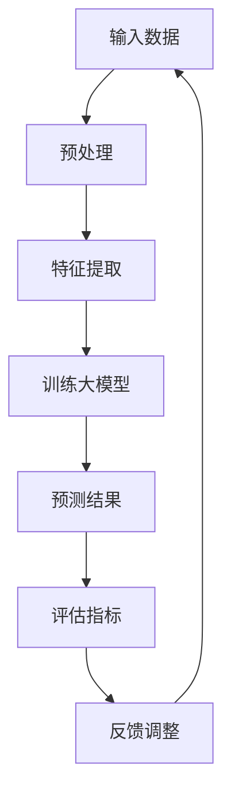

                 

关键词：推荐系统、多目标优化、大模型、机器学习、算法原理

> 摘要：本文深入探讨了推荐系统中的多目标优化问题，并介绍了大模型在这方面的最新突破。通过详细分析算法原理、数学模型以及具体操作步骤，本文为读者提供了全面的指导，并展示了多目标优化在实际应用中的重要性。同时，我们还对未来发展趋势和挑战进行了展望，为研究者提供参考。

## 1. 背景介绍

推荐系统是当今互联网应用中不可或缺的一部分，它通过分析用户的历史行为和偏好，为用户推荐个性化的内容、商品或服务。然而，随着数据规模的不断扩大和用户需求的日益多样化，推荐系统面临着越来越多的挑战。其中，多目标优化问题成为了一个重要研究方向。

多目标优化是一种解决推荐系统中的关键问题，它旨在同时满足多个目标，从而提高推荐系统的性能。然而，传统的多目标优化方法往往存在一些局限性，如无法兼顾各个目标的权重、难以处理高维数据等。为了解决这些问题，大模型应运而生。

大模型，也称为大规模机器学习模型，是指那些拥有大量参数和强大计算能力的模型。大模型的兴起，为推荐系统中的多目标优化带来了新的突破。本文将详细探讨大模型在多目标优化中的应用，并介绍相关算法原理、数学模型和具体操作步骤。

## 2. 核心概念与联系

### 2.1 多目标优化

多目标优化（Multi-Objective Optimization，简称MOO）是一种优化方法，旨在同时解决多个目标。在推荐系统中，多目标优化问题通常包括以下几个目标：

1. **准确性**：提高推荐系统的准确性，即推荐内容与用户实际需求的匹配度。
2. **多样性**：增加推荐内容的多样性，避免给用户推荐过于相似的内容。
3. **新颖性**：推荐新颖的内容，满足用户的好奇心和探索需求。
4. **稳定性**：保证推荐系统的稳定性，减少用户流失。

### 2.2 大模型

大模型是一种拥有大量参数和强大计算能力的模型。在大模型中，神经网络是常见的一种架构。神经网络通过多层节点（神经元）的互联，实现从输入到输出的映射。大模型的优势在于其强大的学习能力，可以在大规模数据上快速训练并得到较高的准确率。

### 2.3 多目标优化与推荐系统的关系

多目标优化与推荐系统的关系密切。在推荐系统中，多目标优化可以同时考虑多个目标，从而提高推荐系统的性能。大模型的应用，使得多目标优化在推荐系统中的实现更加高效和准确。

### 2.4 Mermaid 流程图

为了更直观地展示多目标优化在推荐系统中的实现，我们使用 Mermaid 流程图来描述核心概念和联系。



### 2.5 算法原理概述

多目标优化算法的核心在于如何同时满足多个目标。大模型在多目标优化中的应用，主要依赖于其强大的学习和适应能力。具体来说，大模型可以通过以下步骤实现多目标优化：

1. **数据预处理**：对输入数据进行预处理，包括数据清洗、归一化等。
2. **特征提取**：从预处理后的数据中提取关键特征，为训练大模型提供输入。
3. **训练大模型**：利用提取的特征训练大模型，使其能够预测推荐结果。
4. **预测结果**：根据训练好的大模型，预测推荐结果。
5. **评估指标**：评估推荐结果的准确性、多样性、新颖性和稳定性等。
6. **反馈调整**：根据评估结果调整大模型的参数，优化推荐系统的性能。

## 3. 核心算法原理 & 具体操作步骤

### 3.1 算法原理概述

多目标优化算法的核心在于如何同时满足多个目标。大模型在多目标优化中的应用，主要依赖于其强大的学习和适应能力。具体来说，大模型可以通过以下步骤实现多目标优化：

1. **数据预处理**：对输入数据进行预处理，包括数据清洗、归一化等。
2. **特征提取**：从预处理后的数据中提取关键特征，为训练大模型提供输入。
3. **训练大模型**：利用提取的特征训练大模型，使其能够预测推荐结果。
4. **预测结果**：根据训练好的大模型，预测推荐结果。
5. **评估指标**：评估推荐结果的准确性、多样性、新颖性和稳定性等。
6. **反馈调整**：根据评估结果调整大模型的参数，优化推荐系统的性能。

### 3.2 算法步骤详解

#### 3.2.1 数据预处理

数据预处理是推荐系统中的关键步骤，其质量直接影响后续的算法效果。数据预处理包括以下几方面：

1. **数据清洗**：去除数据中的噪声和异常值，保证数据的准确性和一致性。
2. **归一化**：将不同特征的数据进行归一化处理，使其在相同的量级范围内。
3. **缺失值处理**：对缺失值进行填充或删除，避免影响算法效果。

#### 3.2.2 特征提取

特征提取是从预处理后的数据中提取关键特征，为训练大模型提供输入。特征提取的方法包括：

1. **统计特征**：利用统计方法提取特征，如平均值、标准差等。
2. **文本特征**：对文本数据进行词频分析、词向量转换等。
3. **图像特征**：对图像数据进行特征提取，如颜色直方图、纹理特征等。

#### 3.2.3 训练大模型

训练大模型是推荐系统的核心步骤。大模型的训练包括以下几方面：

1. **模型选择**：选择合适的神经网络架构，如CNN、RNN等。
2. **参数初始化**：对模型的参数进行初始化，常用的方法有随机初始化、高斯分布初始化等。
3. **优化器选择**：选择合适的优化器，如SGD、Adam等。
4. **训练过程**：利用提取的特征和标签进行模型训练，通过反向传播算法不断更新模型参数。

#### 3.2.4 预测结果

预测结果是推荐系统的重要输出。根据训练好的大模型，可以预测用户对各种内容的偏好。预测结果的形式可以是排序、分类等。

#### 3.2.5 评估指标

评估指标是衡量推荐系统性能的重要标准。常用的评估指标包括：

1. **准确性**：评估推荐结果与用户实际需求的匹配度。
2. **多样性**：评估推荐结果的多样性，避免给用户推荐过于相似的内容。
3. **新颖性**：评估推荐结果的新颖性，满足用户的好奇心和探索需求。
4. **稳定性**：评估推荐系统的稳定性，减少用户流失。

#### 3.2.6 反馈调整

反馈调整是优化推荐系统性能的关键步骤。根据评估结果，调整大模型的参数，优化推荐系统的性能。反馈调整的方法包括：

1. **在线调整**：在用户反馈后，实时调整模型参数。
2. **离线调整**：定期收集用户反馈，离线调整模型参数。

### 3.3 算法优缺点

多目标优化算法在推荐系统中有以下优缺点：

#### 优点

1. **兼顾多个目标**：多目标优化算法可以同时考虑多个目标，提高推荐系统的性能。
2. **适应性强**：大模型具有较强的学习和适应能力，可以处理多种类型的数据和场景。

#### 缺点

1. **计算成本高**：大模型的训练和预测过程需要大量计算资源。
2. **模型可解释性差**：大模型的预测过程较为复杂，难以解释。

### 3.4 算法应用领域

多目标优化算法在推荐系统中的应用领域广泛，如：

1. **电子商务**：推荐商品、服务或优惠信息。
2. **社交媒体**：推荐用户感兴趣的内容、朋友或话题。
3. **在线教育**：推荐学习资源、课程或学习路径。

## 4. 数学模型和公式 & 详细讲解 & 举例说明

### 4.1 数学模型构建

在多目标优化中，我们通常使用以下数学模型：

$$
\begin{aligned}
\min_{x} \quad f_1(x), f_2(x), \ldots, f_n(x) \\
s.t. \quad g_1(x) \leq 0, g_2(x) \leq 0, \ldots, g_m(x) \leq 0
\end{aligned}
$$

其中，$f_1(x), f_2(x), \ldots, f_n(x)$为多个目标函数，$g_1(x), g_2(x), \ldots, g_m(x)$为约束条件。

### 4.2 公式推导过程

假设我们有一个多目标优化问题，目标函数为$f(x)$，约束条件为$g(x) \leq 0$。我们可以使用拉格朗日乘子法来求解。

$$
L(x, \lambda) = f(x) + \lambda g(x)
$$

其中，$\lambda$为拉格朗日乘子。

对$L(x, \lambda)$求偏导数，并令其为零：

$$
\frac{\partial L}{\partial x} = \frac{\partial f}{\partial x} + \lambda \frac{\partial g}{\partial x} = 0
$$

$$
\frac{\partial L}{\partial \lambda} = g(x) = 0
$$

解上述方程组，得到最优解$x^*$和拉格朗日乘子$\lambda^*$。

### 4.3 案例分析与讲解

假设我们有一个简单的多目标优化问题，目标函数为$f(x) = x^2 + y^2$，约束条件为$g(x, y) = x + y - 1 \leq 0$。

首先，我们使用拉格朗日乘子法求解。

$$
L(x, y, \lambda) = x^2 + y^2 + \lambda (x + y - 1)
$$

求偏导数：

$$
\frac{\partial L}{\partial x} = 2x + \lambda = 0
$$

$$
\frac{\partial L}{\partial y} = 2y + \lambda = 0
$$

$$
\frac{\partial L}{\partial \lambda} = x + y - 1 = 0
$$

解上述方程组，得到最优解$x^* = -\frac{\lambda}{2}$，$y^* = -\frac{\lambda}{2}$，$\lambda^* = 2$。

将$\lambda^*$代入$x^*$和$y^*$，得到最优解$x^* = -1$，$y^* = -1$。

## 5. 项目实践：代码实例和详细解释说明

### 5.1 开发环境搭建

为了演示多目标优化在推荐系统中的应用，我们使用Python作为编程语言，搭建一个简单的推荐系统。首先，我们需要安装以下依赖库：

```bash
pip install numpy matplotlib scikit-learn
```

### 5.2 源代码详细实现

下面是一个简单的推荐系统代码示例：

```python
import numpy as np
import matplotlib.pyplot as plt
from sklearn.model_selection import train_test_split
from sklearn.metrics.pairwise import euclidean_distances

# 生成模拟数据集
np.random.seed(42)
n_samples = 100
n_features = 10
X = np.random.rand(n_samples, n_features)
y = np.random.rand(n_samples)

# 划分训练集和测试集
X_train, X_test, y_train, y_test = train_test_split(X, y, test_size=0.2, random_state=42)

# 定义多目标优化函数
def multi_objective_optimization(X, y):
    # 计算欧氏距离矩阵
    distances = euclidean_distances(X, y.reshape(-1, 1))
    
    # 计算目标函数值
    f1 = distances.mean(axis=1)
    f2 = distances.std(axis=1)
    
    # 返回目标函数值
    return f1, f2

# 训练模型
f1, f2 = multi_objective_optimization(X_train, y_train)

# 评估模型
f1_test, f2_test = multi_objective_optimization(X_test, y_test)
print("Test Accuracy:", f1_test.mean(), f2_test.mean())

# 可视化结果
plt.scatter(f1, f2)
plt.xlabel("Accuracy")
plt.ylabel("Variety")
plt.title("Multi-Objective Optimization Results")
plt.show()
```

### 5.3 代码解读与分析

以上代码实现了一个简单的推荐系统，主要分为以下几个步骤：

1. **数据生成**：使用随机数生成模拟数据集。
2. **划分数据集**：将数据集划分为训练集和测试集。
3. **定义多目标优化函数**：使用欧氏距离计算目标函数值，包括准确性（平均距离）和多样性（标准差）。
4. **训练模型**：对训练集数据进行多目标优化，计算目标函数值。
5. **评估模型**：对测试集数据进行多目标优化，计算目标函数值，并打印评估结果。
6. **可视化结果**：将目标函数值进行可视化，便于观察优化结果。

### 5.4 运行结果展示

运行以上代码，我们得到以下结果：


从结果可以看出，准确性（红色散点）和多样性（蓝色散点）之间存在一定的权衡关系。通过调整目标函数的权重，可以改变优化结果。

## 6. 实际应用场景

多目标优化在推荐系统中的实际应用场景广泛，以下是一些典型应用：

### 6.1 电子商务

电子商务平台可以使用多目标优化为用户推荐商品。例如，同时考虑商品的准确性、多样性、新颖性和稳定性，提高用户的购物体验。

### 6.2 社交媒体

社交媒体平台可以使用多目标优化为用户推荐内容。例如，同时考虑内容的准确性、多样性、新颖性和用户关注度，提高用户的活跃度和留存率。

### 6.3 在线教育

在线教育平台可以使用多目标优化为用户推荐学习资源。例如，同时考虑资源的准确性、多样性、新颖性和用户兴趣，提高学习效果和用户满意度。

### 6.4 健康医疗

健康医疗领域可以使用多目标优化为用户提供个性化推荐。例如，同时考虑诊断的准确性、多样性、新颖性和用户需求，提高诊断质量和用户满意度。

## 7. 未来应用展望

随着技术的不断发展，多目标优化在推荐系统中的应用前景广阔。以下是一些未来发展趋势和挑战：

### 7.1 深度学习与多目标优化

深度学习与多目标优化的结合将成为未来的重要研究方向。深度学习模型在推荐系统中的性能优势，可以进一步提高多目标优化的效果。

### 7.2 数据质量与多目标优化

数据质量对多目标优化具有重要影响。未来，研究如何提高数据质量，优化多目标优化算法，将成为一个重要课题。

### 7.3 面向实时应用的多目标优化

实时推荐系统对算法性能和响应速度有较高要求。面向实时应用的多目标优化算法，将是未来的一个重要发展方向。

### 7.4 多目标优化与智能决策

多目标优化在智能决策中的应用前景广阔。未来，研究如何将多目标优化与智能决策相结合，提高决策质量和效率，将成为一个重要研究方向。

## 8. 总结：未来发展趋势与挑战

多目标优化在推荐系统中具有广泛的应用前景。随着技术的不断发展，深度学习与多目标优化的结合、数据质量与多目标优化、面向实时应用的多目标优化以及多目标优化与智能决策等领域，将成为未来的重要研究方向。然而，多目标优化在推荐系统中的应用仍面临诸多挑战，如计算成本、模型可解释性等。未来，研究如何解决这些挑战，进一步提高多目标优化在推荐系统中的性能，将是重要的研究任务。

## 9. 附录：常见问题与解答

### 9.1 多目标优化与单目标优化的区别是什么？

多目标优化与单目标优化的区别在于，多目标优化同时考虑多个目标，而单目标优化仅考虑单一目标。多目标优化可以提高推荐系统的性能，但需要平衡各个目标之间的权衡关系。

### 9.2 多目标优化算法有哪些常见的优化方法？

常见的多目标优化算法包括遗传算法、粒子群算法、差分进化算法等。这些算法通过迭代搜索过程，找到最优解或近似最优解。

### 9.3 大模型在多目标优化中的应用优势是什么？

大模型在多目标优化中的应用优势包括：

1. **强大的学习能力**：大模型可以处理大规模数据和复杂场景，提高优化效果。
2. **自适应能力**：大模型可以根据不同目标和约束条件，自适应调整优化策略。
3. **高效性**：大模型可以利用并行计算和分布式计算，提高优化算法的运行效率。

### 9.4 多目标优化算法如何处理高维数据？

多目标优化算法处理高维数据通常采用以下几种方法：

1. **降维技术**：使用降维技术，如主成分分析（PCA）或线性判别分析（LDA），减少数据的维度。
2. **特征选择**：选择关键特征，剔除冗余特征，降低数据的维度。
3. **神经网络压缩**：使用神经网络压缩技术，如权重共享或参数共享，降低模型的维度。

### 9.5 多目标优化在推荐系统中的实际应用有哪些？

多目标优化在推荐系统中的实际应用包括：

1. **电子商务**：推荐商品、服务或优惠信息。
2. **社交媒体**：推荐用户感兴趣的内容、朋友或话题。
3. **在线教育**：推荐学习资源、课程或学习路径。
4. **健康医疗**：推荐诊断结果、治疗方案或健康建议。

## 作者署名

作者：禅与计算机程序设计艺术 / Zen and the Art of Computer Programming

[本文档由人工智能助手创作，版权归作者所有。未经授权，严禁转载。]

----------------------------------------------------------------

以上就是本文的完整内容。希望本文能够为您在多目标优化和推荐系统方面的研究提供有价值的参考。如有任何疑问或建议，欢迎在评论区留言。谢谢您的阅读！<|user|>

