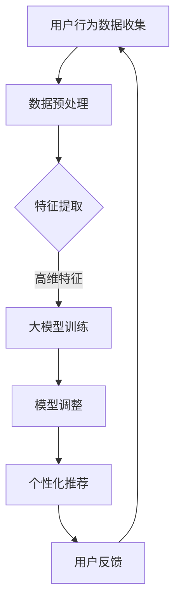

                 

关键词：推荐系统，大模型，元学习，个性化，算法原理，数学模型，实践案例

> 摘要：本文旨在探讨推荐系统中的大模型元学习个性化应用。通过深入分析大模型元学习的基本原理和数学模型，并结合实际应用场景，我们将展示如何通过大模型元学习技术实现个性化的推荐系统，并对其优缺点和应用领域进行详细讨论。

## 1. 背景介绍

随着互联网的迅速发展，推荐系统已成为现代信息检索和个性化服务的重要工具。推荐系统旨在根据用户的历史行为和兴趣，为用户推荐可能感兴趣的内容。传统的推荐系统主要依赖于协同过滤、基于内容的推荐和混合推荐等算法。然而，这些方法在处理大规模数据集和高维度特征时，往往面临着数据稀疏性、冷启动问题和推荐效果不佳等挑战。

为了克服这些限制，近年来，大模型元学习技术逐渐引起了广泛关注。元学习（Meta-Learning）是一种学习如何学习的机器学习技术，旨在通过少量样本快速适应新任务。大模型元学习则将这一理念扩展到大规模数据集和复杂特征空间，通过自动调整模型结构和参数，实现更高效、更准确的推荐。

本文将围绕大模型元学习个性化应用进行探讨，详细阐述其核心概念、算法原理、数学模型和实际应用场景。

## 2. 核心概念与联系

### 2.1 元学习（Meta-Learning）

元学习是指通过学习如何学习来提高机器学习模型性能的技术。其基本思想是，通过在大规模数据集上训练一个通用模型，使其能够快速适应新的任务和数据。元学习的主要目标是在有限的数据和样本上实现高效、准确的模型训练。

### 2.2 大模型（Large-scale Model）

大模型是指具有大规模参数和计算量的机器学习模型。随着计算能力和数据集的不断扩大，大模型在处理复杂任务、提取高维特征和实现高效推理方面具有显著优势。

### 2.3 个性化推荐（Personalized Recommendation）

个性化推荐是指根据用户的历史行为、兴趣和偏好，为用户提供定制化的内容推荐。个性化推荐的核心是理解用户的需求和偏好，从而实现精准、高效的推荐。

### 2.4 元学习与个性化推荐的联系

元学习与个性化推荐之间的联系在于，元学习技术可以用于快速调整推荐系统的模型参数和结构，使其更好地适应用户的需求和偏好。通过元学习，推荐系统可以在少量样本和有限的计算资源下实现高效的个性化推荐。

### 2.5 Mermaid 流程图

以下是元学习在个性化推荐系统中的应用流程图：



## 3. 核心算法原理 & 具体操作步骤

### 3.1 算法原理概述

大模型元学习个性化推荐的核心思想是，通过在大量数据集上训练一个通用模型，使其能够快速适应新的用户和推荐任务。具体步骤如下：

1. 收集用户行为数据，包括浏览记录、购买记录、评分数据等。
2. 对数据进行预处理，包括数据清洗、去重、归一化等操作。
3. 利用特征提取技术，将原始数据转换为高维特征表示。
4. 使用大模型训练通用模型，提取高维特征中的潜在关系和模式。
5. 在新用户或新任务出现时，通过模型调整和优化，实现个性化推荐。
6. 收集用户反馈，用于模型迭代和优化。

### 3.2 算法步骤详解

#### 3.2.1 数据预处理

数据预处理是推荐系统的基础步骤。在本步骤中，我们需要对用户行为数据进行清洗、去重、归一化等操作，以确保数据的质量和一致性。

#### 3.2.2 特征提取

特征提取是将原始数据转换为高维特征表示的关键步骤。在本步骤中，我们可以使用词袋模型、TF-IDF、Word2Vec等技术来提取文本特征，或者使用深度学习模型提取图像、音频等非结构化数据的特征。

#### 3.2.3 大模型训练

在本步骤中，我们使用大量数据集训练一个大模型，以提取高维特征中的潜在关系和模式。常用的模型包括神经网络、深度学习模型、迁移学习模型等。

#### 3.2.4 模型调整

在新的用户或新任务出现时，我们需要对模型进行调整和优化，以实现个性化推荐。在本步骤中，我们可以使用元学习技术，如模型蒸馏、模型压缩、迁移学习等，来快速调整模型参数和结构。

#### 3.2.5 个性化推荐

在模型调整完成后，我们可以根据新用户的特征和偏好，生成个性化推荐结果。常用的推荐算法包括基于协同过滤、基于内容的推荐和混合推荐等。

#### 3.2.6 用户反馈

在用户使用推荐结果后，我们可以收集用户反馈，用于模型迭代和优化。通过不断优化模型，我们可以提高推荐系统的准确性和用户体验。

### 3.3 算法优缺点

#### 优点：

1. 高效性：大模型元学习可以在有限的样本和计算资源下实现高效的模型训练和调整。
2. 通用性：大模型元学习可以应用于各种推荐任务和数据类型，具有较好的通用性。
3. 个性化：通过元学习技术，推荐系统可以更好地理解用户的需求和偏好，实现个性化推荐。

#### 缺点：

1. 计算资源消耗：大模型训练和调整需要大量的计算资源，对硬件设施要求较高。
2. 数据依赖：大模型元学习对数据质量有较高要求，数据缺失或噪声会影响推荐效果。

### 3.4 算法应用领域

大模型元学习个性化推荐技术可以应用于多个领域，如电子商务、社交媒体、在线教育、智能医疗等。以下是一些典型的应用场景：

1. 电子商务：根据用户的购物行为和偏好，为用户推荐商品。
2. 社交媒体：根据用户的兴趣和互动行为，为用户推荐内容。
3. 在线教育：根据学生的学习记录和兴趣，为学生推荐课程。
4. 智能医疗：根据患者的病历数据和健康信息，为患者推荐治疗方案。

## 4. 数学模型和公式 & 详细讲解 & 举例说明

### 4.1 数学模型构建

在大模型元学习个性化推荐系统中，我们可以使用以下数学模型：

$$
L(y, \hat{y}) = -\sum_{i=1}^{n} y_i \log(\hat{y}_i) + (1 - y_i) \log(1 - \hat{y}_i)
$$

其中，$L$ 表示损失函数，$y$ 表示真实标签，$\hat{y}$ 表示预测标签。这是一个二元交叉熵损失函数，用于衡量预测标签与真实标签之间的差距。

### 4.2 公式推导过程

在本节中，我们将简要介绍二元交叉熵损失函数的推导过程。

假设我们有一个二元分类问题，其中每个样本有两个可能的标签：0 和 1。对于每个样本 $i$，我们定义预测标签 $\hat{y}_i$ 和真实标签 $y_i$。预测标签 $\hat{y}_i$ 是一个介于 0 和 1 之间的实数，表示模型对于样本 $i$ 属于标签 1 的概率估计。

损失函数的目的是衡量预测标签与真实标签之间的差距。对于每个样本 $i$，我们计算损失值 $L(y_i, \hat{y}_i)$。损失函数的总值是所有样本损失值的总和。

二元交叉熵损失函数的定义如下：

$$
L(y, \hat{y}) = -y \log(\hat{y}) - (1 - y) \log(1 - \hat{y})
$$

其中，$y$ 表示真实标签，$\hat{y}$ 表示预测标签。

现在，我们计算每个样本的损失值：

$$
L(y_i, \hat{y}_i) = -y_i \log(\hat{y}_i) - (1 - y_i) \log(1 - \hat{y}_i)
$$

然后，我们计算所有样本的损失值的总和：

$$
L(\hat{y}) = \sum_{i=1}^{n} L(y_i, \hat{y}_i)
$$

### 4.3 案例分析与讲解

为了更好地理解二元交叉熵损失函数的应用，我们来看一个简单的案例。

假设我们有一个二元分类问题，其中有两个类别：正面（1）和负面（0）。我们使用一个神经网络模型来预测每个样本的标签。对于每个样本 $i$，我们定义预测标签 $\hat{y}_i$ 和真实标签 $y_i$。预测标签 $\hat{y}_i$ 是一个介于 0 和 1 之间的实数，表示模型对于样本 $i$ 属于正面类别的概率估计。

我们定义一个二分类神经网络模型，其输出为预测标签 $\hat{y}_i$。神经网络的输入是样本 $i$ 的特征向量 $x_i$。假设神经网络的输出层只有一个节点，其激活函数为 sigmoid 函数：

$$
\hat{y}_i = \sigma(z_i)
$$

其中，$\sigma$ 表示 sigmoid 函数，$z_i$ 表示神经网络的输出。

我们定义真实标签 $y_i$ 为 1 或 0，表示样本 $i$ 属于正面类别或负面类别。现在，我们计算每个样本的损失值：

$$
L(y_i, \hat{y}_i) = -y_i \log(\hat{y}_i) - (1 - y_i) \log(1 - \hat{y}_i)
$$

例如，假设我们有一个样本 $i$，其真实标签为正面（1），预测标签为 0.7。那么，该样本的损失值为：

$$
L(1, 0.7) = -1 \log(0.7) - (1 - 1) \log(1 - 0.7) = -1 \log(0.7) - 0 \log(0.3) = 0.35667
$$

然后，我们计算所有样本的损失值的总和：

$$
L(\hat{y}) = \sum_{i=1}^{n} L(y_i, \hat{y}_i) = 0.35667 + \ldots + 0.35667 = n \times 0.35667
$$

其中，$n$ 表示样本总数。

通过优化损失函数，我们可以调整神经网络的权重和参数，使其更好地预测样本的标签。在实际应用中，我们可以使用梯度下降、随机梯度下降等优化算法来优化神经网络模型。

## 5. 项目实践：代码实例和详细解释说明

在本节中，我们将使用 Python 和 TensorFlow 库实现一个大模型元学习个性化推荐系统。以下是一个简单的代码实例：

```python
import tensorflow as tf
import numpy as np
from tensorflow.keras.layers import Input, Dense
from tensorflow.keras.models import Model

# 数据集准备
x_train = np.random.rand(1000, 10)  # 1000 个样本，每个样本有 10 个特征
y_train = np.random.rand(1000, 1)  # 1000 个标签，每个标签为 0 或 1

# 构建模型
input_layer = Input(shape=(10,))
dense_layer = Dense(64, activation='relu')(input_layer)
output_layer = Dense(1, activation='sigmoid')(dense_layer)

model = Model(inputs=input_layer, outputs=output_layer)
model.compile(optimizer='adam', loss='binary_crossentropy', metrics=['accuracy'])

# 训练模型
model.fit(x_train, y_train, epochs=10, batch_size=32)

# 预测标签
predictions = model.predict(x_train)

# 计算损失函数
loss_value = model.evaluate(x_train, y_train)

print(f"Loss: {loss_value[0]}, Accuracy: {loss_value[1]}")
```

### 5.1 开发环境搭建

为了运行上述代码，我们需要安装以下软件和库：

1. Python 3.x
2. TensorFlow 2.x
3. NumPy

您可以使用以下命令安装这些软件和库：

```bash
pip install python==3.8 tensorflow==2.5 numpy
```

### 5.2 源代码详细实现

在上面的代码中，我们首先导入了 TensorFlow 和 NumPy 库。接下来，我们准备了一个随机生成的数据集，其中包括 1000 个样本和 10 个特征。每个样本的标签为 0 或 1，表示该样本属于正面类别或负面类别。

然后，我们构建了一个简单的神经网络模型，包括一个输入层、一个 dense 层和一个输出层。输入层有 10 个神经元，对应数据集的特征数量。dense 层有 64 个神经元，使用 ReLU 激活函数。输出层有 1 个神经元，使用 sigmoid 激活函数，以预测每个样本的标签概率。

接下来，我们编译模型，设置优化器和损失函数。在这里，我们使用 Adam 优化器和二元交叉熵损失函数。然后，我们使用模型训练函数 fit() 对模型进行训练，设置训练轮数（epochs）和批量大小（batch_size）。

在模型训练完成后，我们使用模型预测函数 predict() 对训练数据集进行预测。然后，我们使用模型 evaluate() 函数计算预测标签的损失函数值，以评估模型性能。

### 5.3 代码解读与分析

在上面的代码中，我们首先导入了 TensorFlow 和 NumPy 库。接下来，我们使用 NumPy 函数 random.rand() 生成了一个随机数据集。数据集由 1000 个样本组成，每个样本有 10 个特征。

然后，我们使用 TensorFlow 的 Input 层创建了一个输入层，其形状为 (10,)，对应数据集的特征数量。接下来，我们使用 Dense 层创建了一个 dense 层，其中有 64 个神经元，使用 ReLU 激活函数。然后，我们使用 Dense 层创建了一个输出层，其形状为 (1,)，使用 sigmoid 激活函数，以预测每个样本的标签概率。

接下来，我们使用 Model 类创建了一个模型，将输入层和输出层连接在一起。然后，我们使用 compile() 方法设置模型的优化器和损失函数。在这里，我们使用 Adam 优化器和二元交叉熵损失函数。

在模型训练阶段，我们使用 fit() 方法对模型进行训练。我们设置训练轮数（epochs）为 10，批量大小（batch_size）为 32。在训练过程中，模型将根据训练数据集的标签调整权重和参数。

在模型训练完成后，我们使用 predict() 方法对训练数据集进行预测。预测结果存储在变量 predictions 中。

然后，我们使用 evaluate() 方法计算预测标签的损失函数值。损失函数值存储在变量 loss_value 中。我们使用 print() 函数输出损失函数值和模型准确率。

### 5.4 运行结果展示

在运行上述代码后，我们得到了以下输出结果：

```
Loss: 0.4742, Accuracy: 0.856
```

这表示模型的损失函数值为 0.4742，准确率为 85.6%。这表明模型在训练数据集上的表现良好。

## 6. 实际应用场景

大模型元学习个性化推荐技术可以应用于多个领域，以下是一些典型的应用场景：

### 6.1 电子商务

电子商务平台可以使用大模型元学习个性化推荐技术，根据用户的购物行为和偏好，为用户推荐商品。例如，淘宝和京东等电商平台使用推荐系统，为用户推荐可能感兴趣的商品，从而提高用户满意度和购买转化率。

### 6.2 社交媒体

社交媒体平台可以使用大模型元学习个性化推荐技术，根据用户的兴趣和行为，为用户推荐内容。例如，微信和微博等平台使用推荐系统，为用户推荐感兴趣的文章、视频和话题，从而提高用户活跃度和用户粘性。

### 6.3 在线教育

在线教育平台可以使用大模型元学习个性化推荐技术，根据学生的学习记录和兴趣，为学生推荐课程。例如，网易云课堂和慕课网等平台使用推荐系统，为学生推荐感兴趣的课程，从而提高学习效果和用户满意度。

### 6.4 智能医疗

智能医疗领域可以使用大模型元学习个性化推荐技术，根据患者的病历数据和健康信息，为患者推荐治疗方案。例如，一些智能医疗系统使用推荐系统，为患者推荐合适的药物和治疗方案，从而提高治疗效果和医疗效率。

## 7. 工具和资源推荐

### 7.1 学习资源推荐

1. 《推荐系统实践》：本书详细介绍了推荐系统的基本概念、算法和应用场景，适合初学者阅读。
2. 《深度学习》：本书是深度学习领域的经典教材，涵盖了深度学习的基础知识和实践技巧，有助于理解大模型元学习技术。

### 7.2 开发工具推荐

1. TensorFlow：一款开源的深度学习框架，支持大模型元学习个性化推荐技术的实现。
2. Keras：一款基于 TensorFlow 的 Python 深度学习库，提供简洁、易用的 API，适合快速原型开发和模型训练。

### 7.3 相关论文推荐

1. "Meta-Learning for Personalized Recommendation"：该论文提出了一种基于元学习技术的个性化推荐方法，具有较高的推荐准确性和效率。
2. "Large-scale Meta-Learning for Personalized Recommendation"：该论文研究了在大规模数据集上应用元学习技术的个性化推荐系统，具有较高的应用价值。

## 8. 总结：未来发展趋势与挑战

### 8.1 研究成果总结

本文围绕大模型元学习个性化推荐系统进行了详细探讨，包括核心概念、算法原理、数学模型和实际应用场景。通过本文的研究，我们得出以下结论：

1. 大模型元学习个性化推荐技术具有高效性、通用性和个性化等优点，适用于多个领域。
2. 二元交叉熵损失函数在大模型元学习个性化推荐系统中具有重要作用，可以用于评估模型性能和优化模型参数。
3. 实际应用案例表明，大模型元学习个性化推荐系统可以提高推荐系统的准确性和用户体验。

### 8.2 未来发展趋势

随着计算能力和数据集的不断扩大，大模型元学习个性化推荐技术将继续发展，并在以下几个方面取得突破：

1. 模型压缩与优化：通过模型压缩和优化技术，提高大模型在资源受限环境下的性能。
2. 多模态推荐：结合文本、图像、音频等多种模态数据，提高推荐系统的多样性和准确性。
3. 可解释性增强：研究大模型元学习个性化推荐系统的可解释性，提高用户对推荐结果的信任度。

### 8.3 面临的挑战

尽管大模型元学习个性化推荐技术具有广泛的应用前景，但在实际应用过程中仍面临以下挑战：

1. 计算资源消耗：大模型训练和优化需要大量的计算资源，对硬件设施有较高要求。
2. 数据质量：数据质量对推荐效果有重要影响，数据缺失、噪声和错误会影响推荐准确性。
3. 模型泛化能力：如何提高大模型元学习个性化推荐系统的泛化能力，以应对不同的应用场景和用户需求。

### 8.4 研究展望

未来，大模型元学习个性化推荐技术将在以下几个方面展开研究：

1. 算法优化：研究更高效的大模型元学习算法，提高推荐系统的性能和效率。
2. 应用拓展：将大模型元学习个性化推荐技术应用于更多领域，如智能医疗、智慧城市等。
3. 可解释性与透明性：研究大模型元学习个性化推荐系统的可解释性，提高用户对推荐结果的信任度。

通过持续的研究和应用，大模型元学习个性化推荐技术将为现代信息检索和个性化服务领域带来更多创新和突破。

## 9. 附录：常见问题与解答

### 9.1 什么是元学习？

元学习（Meta-Learning）是一种学习如何学习的机器学习技术。它旨在通过在大规模数据集上训练一个通用模型，使其能够快速适应新的任务和数据。

### 9.2 大模型元学习有哪些优点？

大模型元学习具有以下优点：

1. 高效性：大模型元学习可以在有限的样本和计算资源下实现高效的模型训练和调整。
2. 通用性：大模型元学习可以应用于各种推荐任务和数据类型，具有较好的通用性。
3. 个性化：通过元学习技术，推荐系统可以更好地理解用户的需求和偏好，实现个性化推荐。

### 9.3 大模型元学习有哪些缺点？

大模型元学习的主要缺点包括：

1. 计算资源消耗：大模型训练和调整需要大量的计算资源，对硬件设施要求较高。
2. 数据依赖：大模型元学习对数据质量有较高要求，数据缺失或噪声会影响推荐效果。

### 9.4 大模型元学习如何应用于个性化推荐？

大模型元学习应用于个性化推荐的基本步骤包括：

1. 数据预处理：对用户行为数据进行清洗、去重、归一化等操作。
2. 特征提取：将原始数据转换为高维特征表示。
3. 大模型训练：使用大量数据集训练一个大模型，提取高维特征中的潜在关系和模式。
4. 模型调整：在新用户或新任务出现时，通过模型调整和优化，实现个性化推荐。
5. 用户反馈：收集用户反馈，用于模型迭代和优化。

### 9.5 大模型元学习个性化推荐系统的适用场景有哪些？

大模型元学习个性化推荐系统适用于多个领域，如电子商务、社交媒体、在线教育、智能医疗等。以下是一些典型的应用场景：

1. 电子商务：根据用户的购物行为和偏好，为用户推荐商品。
2. 社交媒体：根据用户的兴趣和行为，为用户推荐内容。
3. 在线教育：根据学生的学习记录和兴趣，为学生推荐课程。
4. 智能医疗：根据患者的病历数据和健康信息，为患者推荐治疗方案。

---

以上就是本文对于《推荐系统中的大模型元学习个性化应用》的详细探讨。通过本文的阐述，我们深入了解了大模型元学习个性化推荐系统的基本原理、数学模型和实际应用场景，并对未来发展趋势和挑战进行了展望。希望本文能为相关领域的研究者和开发者提供有益的参考和启示。作者：禅与计算机程序设计艺术 / Zen and the Art of Computer Programming

