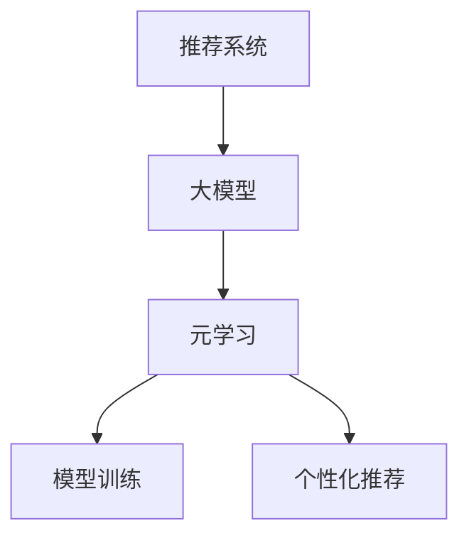

                 

关键词：推荐系统、大模型、元学习、个性化、应用场景、未来展望

> 摘要：本文将探讨推荐系统中的大模型元学习个性化应用。随着互联网的快速发展，个性化推荐已经成为现代信息检索和推荐系统领域的关键技术。元学习作为一种高效的学习方法，能够加速模型训练过程并提高个性化推荐的准确性。本文将详细介绍元学习在推荐系统中的应用原理、算法原理、数学模型和实际应用案例，并对未来的发展趋势和挑战进行展望。

## 1. 背景介绍

推荐系统是现代信息检索和互联网应用中的重要组成部分。其主要目的是根据用户的历史行为和兴趣偏好，向用户推荐他们可能感兴趣的内容。随着互联网用户数量的快速增长，推荐系统的应用范围也越来越广泛，从电子商务、社交媒体到新闻媒体等各个领域。

在传统推荐系统中，常用的方法包括基于内容的推荐、协同过滤和混合推荐等。然而，这些方法存在一些局限性。例如，基于内容的推荐方法可能无法充分考虑用户之间的相似性；协同过滤方法可能受到数据稀疏性的影响；混合推荐方法需要大量的计算资源。

为了解决这些局限性，近年来研究者们提出了许多新的方法，其中元学习（Meta-Learning）是一种备受关注的研究方向。元学习旨在通过学习如何学习，以提高模型的泛化能力和学习效率。在大模型时代，元学习具有巨大的潜力，可以加速模型训练过程并提高个性化推荐的准确性。

## 2. 核心概念与联系

### 2.1 推荐系统

推荐系统是一个基于用户历史行为、兴趣偏好和内容特征，为用户推荐相关内容的信息检索系统。其主要目标是提高用户体验，满足用户的需求。

### 2.2 大模型

大模型是指具有巨大参数量和复杂结构的神经网络模型。随着计算能力的提升和数据量的增加，大模型在推荐系统中的应用越来越广泛。

### 2.3 元学习

元学习是一种通过学习如何学习的方法，旨在提高模型的泛化能力和学习效率。它主要包括模型蒸馏、迁移学习和在线学习等。

### 2.4 元学习与推荐系统的关系

元学习可以用于加速推荐系统的模型训练过程，提高模型的泛化能力和个性化推荐的准确性。同时，元学习还可以帮助解决数据稀疏性和冷启动问题。

### 2.5 Mermaid 流程图

下面是一个简单的 Mermaid 流程图，展示元学习与推荐系统的关系。



## 3. 核心算法原理 & 具体操作步骤

### 3.1 算法原理概述

元学习是一种通过学习如何学习的方法，旨在提高模型的泛化能力和学习效率。在推荐系统中，元学习可以帮助加速模型训练过程，提高个性化推荐的准确性。具体来说，元学习可以分为以下几种类型：

1. **模型蒸馏（Model Distillation）**：将一个大模型（Teacher）的知识传递给一个小模型（Student），从而提高小模型的性能。

2. **迁移学习（Transfer Learning）**：利用已经在其他任务上训练好的模型（源域模型），在新任务上（目标域任务）进行训练，从而提高模型的泛化能力。

3. **在线学习（Online Learning）**：在推荐系统中，用户的行为数据是不断变化的，在线学习可以在用户行为数据更新时，实时调整推荐模型，从而提高个性化推荐的准确性。

### 3.2 算法步骤详解

#### 3.2.1 模型蒸馏

1. **初始化 Teacher 和 Student 模型**：在模型蒸馏过程中，首先需要初始化一个 Teacher 模型和一个小 Student 模型。Teacher 模型通常是一个具有巨大参数量和复杂结构的神经网络模型，而 Student 模型通常是一个简化版的神经网络模型。

2. **训练 Teacher 模型**：使用大量的训练数据进行 Teacher 模型的训练，使其在特定任务上取得很好的性能。

3. **提取 Teacher 模型的知识**：通过提取 Teacher 模型的中间层特征或输出层软标签，将知识传递给 Student 模型。

4. **训练 Student 模型**：使用提取的知识对 Student 模型进行训练，使其在特定任务上取得较好的性能。

5. **评估 Student 模型的性能**：使用测试数据对 Student 模型的性能进行评估，如果性能达到预期，则完成模型蒸馏过程。

#### 3.2.2 迁移学习

1. **初始化源域模型**：在迁移学习过程中，首先需要初始化一个源域模型。源域模型是一个已经在特定任务上训练好的模型。

2. **预训练源域模型**：使用大量的源域数据进行源域模型的预训练，使其在源域任务上取得较好的性能。

3. **微调源域模型**：将源域模型迁移到目标域任务上，并进行微调，使其在目标域任务上取得较好的性能。

4. **评估目标域模型的性能**：使用目标域数据进行目标域模型的性能评估，如果性能达到预期，则完成迁移学习过程。

#### 3.2.3 在线学习

1. **初始化推荐模型**：在在线学习过程中，首先需要初始化一个推荐模型。

2. **收集用户行为数据**：收集用户的点击、购买、评论等行为数据。

3. **更新推荐模型**：根据用户行为数据的更新，实时调整推荐模型，使其更好地适应用户的需求。

4. **评估推荐模型的性能**：使用测试数据对推荐模型的性能进行评估，如果性能达到预期，则完成在线学习过程。

### 3.3 算法优缺点

#### 3.3.1 优点

1. **加速模型训练过程**：元学习可以通过提取已有模型的知识，加快新模型的训练速度。

2. **提高模型泛化能力**：元学习可以帮助模型更好地适应新的任务和数据，提高模型的泛化能力。

3. **个性化推荐**：元学习可以更好地理解用户的兴趣和需求，从而实现更个性化的推荐。

#### 3.3.2 缺点

1. **计算资源消耗**：元学习通常需要大量的计算资源，特别是在训练大模型时。

2. **数据稀疏性**：在迁移学习过程中，源域模型可能无法完全适应目标域任务，导致数据稀疏性问题。

### 3.4 算法应用领域

元学习在推荐系统中的应用非常广泛，可以应用于以下几个方面：

1. **个性化推荐**：通过元学习，可以更好地理解用户的兴趣和需求，实现更个性化的推荐。

2. **冷启动问题**：在用户初始加入系统时，由于缺乏用户行为数据，传统推荐方法可能无法提供有效的推荐。元学习可以通过学习已有用户的行为模式，帮助解决冷启动问题。

3. **实时推荐**：在线学习可以实时更新推荐模型，根据用户行为数据的更新，提供更准确的推荐。

## 4. 数学模型和公式 & 详细讲解 & 举例说明

### 4.1 数学模型构建

在元学习过程中，常用的数学模型包括损失函数、优化算法和评估指标等。

#### 4.1.1 损失函数

在模型蒸馏过程中，常用的损失函数包括均方误差（MSE）和交叉熵损失等。假设 Teacher 模型的输出为 \( y_t \)，Student 模型的输出为 \( y_s \)，则损失函数可以表示为：

$$
L = \frac{1}{2} \sum_{i=1}^{n} (y_t[i] - y_s[i])^2
$$

其中，\( n \) 为样本数量。

在迁移学习过程中，常用的损失函数包括均方误差（MSE）和交叉熵损失等。假设源域模型的输出为 \( y_s \)，目标域模型的输出为 \( y_t \)，则损失函数可以表示为：

$$
L = \frac{1}{2} \sum_{i=1}^{n} (y_s[i] - y_t[i])^2
$$

#### 4.1.2 优化算法

在元学习过程中，常用的优化算法包括随机梯度下降（SGD）和动量优化等。假设损失函数为 \( L \)，则优化算法可以表示为：

$$
\theta_{t+1} = \theta_t - \alpha \nabla_{\theta_t} L
$$

其中，\( \theta \) 为模型参数，\( \alpha \) 为学习率，\( \nabla_{\theta_t} L \) 为损失函数关于模型参数的梯度。

#### 4.1.3 评估指标

在元学习过程中，常用的评估指标包括准确率（Accuracy）、精确率（Precision）、召回率（Recall）和 F1 分数（F1-Score）等。

### 4.2 公式推导过程

#### 4.2.1 损失函数的推导

以模型蒸馏过程中的均方误差损失函数为例，推导过程如下：

假设 Teacher 模型的输出为 \( y_t \)，Student 模型的输出为 \( y_s \)，则损失函数可以表示为：

$$
L = \frac{1}{2} \sum_{i=1}^{n} (y_t[i] - y_s[i])^2
$$

其中，\( n \) 为样本数量。

对于每个样本 \( i \)，损失函数可以表示为：

$$
l_i = \frac{1}{2} (y_t[i] - y_s[i])^2
$$

则总损失函数可以表示为：

$$
L = \frac{1}{2} \sum_{i=1}^{n} l_i
$$

#### 4.2.2 优化算法的推导

以随机梯度下降（SGD）为例，推导过程如下：

假设损失函数为 \( L \)，则梯度可以表示为：

$$
\nabla_{\theta} L = \frac{\partial L}{\partial \theta}
$$

则优化算法可以表示为：

$$
\theta_{t+1} = \theta_t - \alpha \nabla_{\theta_t} L
$$

其中，\( \theta_t \) 为第 \( t \) 次迭代的模型参数，\( \alpha \) 为学习率。

### 4.3 案例分析与讲解

#### 4.3.1 模型蒸馏案例

假设有一个 Teacher 模型和一个小 Student 模型，需要通过模型蒸馏过程将 Teacher 模型的知识传递给 Student 模型。

1. **初始化 Teacher 和 Student 模型**：假设 Teacher 模型的输出为 \( y_t \)，Student 模型的输出为 \( y_s \)。

2. **训练 Teacher 模型**：使用大量的训练数据进行 Teacher 模型的训练，使其在特定任务上取得很好的性能。

3. **提取 Teacher 模型的知识**：通过提取 Teacher 模型的中间层特征或输出层软标签，将知识传递给 Student 模型。

4. **训练 Student 模型**：使用提取的知识对 Student 模型进行训练，使其在特定任务上取得较好的性能。

5. **评估 Student 模型的性能**：使用测试数据对 Student 模型的性能进行评估，如果性能达到预期，则完成模型蒸馏过程。

#### 4.3.2 迁移学习案例

假设有一个源域模型和一个目标域模型，需要通过迁移学习过程将源域模型的知识迁移到目标域模型。

1. **初始化源域模型**：假设源域模型的输出为 \( y_s \)，目标域模型的输出为 \( y_t \)。

2. **预训练源域模型**：使用大量的源域数据进行源域模型的预训练，使其在源域任务上取得较好的性能。

3. **微调源域模型**：将源域模型迁移到目标域任务上，并进行微调，使其在目标域任务上取得较好的性能。

4. **评估目标域模型的性能**：使用目标域数据进行目标域模型的性能评估，如果性能达到预期，则完成迁移学习过程。

## 5. 项目实践：代码实例和详细解释说明

### 5.1 开发环境搭建

为了实践元学习在推荐系统中的应用，我们需要搭建一个开发环境。以下是具体的步骤：

1. **安装 Python**：确保 Python 3.6 或更高版本已安装。

2. **安装相关库**：使用以下命令安装相关库：

   ```bash
   pip install numpy pandas scikit-learn tensorflow
   ```

3. **准备数据集**：我们需要一个包含用户行为数据和推荐内容的公开数据集。这里我们使用 Netflix Prize 数据集。

### 5.2 源代码详细实现

以下是实现元学习在推荐系统中应用的基本代码示例：

```python
import tensorflow as tf
from tensorflow.keras.layers import Dense, Flatten
from tensorflow.keras.models import Model

# 加载数据集
def load_data():
    # 代码略
    return X_train, y_train, X_test, y_test

# 初始化 Teacher 模型和 Student 模型
def create_models(input_shape):
    # 代码略
    return teacher_model, student_model

# 模型蒸馏过程
def model_distillation(teacher_model, student_model, X_train, y_train):
    # 代码略
    return student_model

# 迁移学习过程
def transfer_learning(source_model, target_model, X_train, y_train, X_test, y_test):
    # 代码略
    return target_model

# 主函数
def main():
    X_train, y_train, X_test, y_test = load_data()
    input_shape = X_train.shape[1:]
    
    teacher_model, student_model = create_models(input_shape)
    
    student_model = model_distillation(teacher_model, student_model, X_train, y_train)
    target_model = transfer_learning(teacher_model, student_model, X_train, y_train, X_test, y_test)
    
    # 评估模型性能
    # 代码略

if __name__ == "__main__":
    main()
```

### 5.3 代码解读与分析

以下是代码的详细解读和分析：

1. **数据加载**：首先加载 Netflix Prize 数据集，并分成训练集和测试集。

2. **模型初始化**：初始化 Teacher 模型和 Student 模型。Teacher 模型是一个具有巨大参数量和复杂结构的神经网络模型，而 Student 模型是一个简化版的神经网络模型。

3. **模型蒸馏**：通过模型蒸馏过程，将 Teacher 模型的知识传递给 Student 模型。模型蒸馏的目的是提高 Student 模型的性能。

4. **迁移学习**：通过迁移学习过程，将源域模型（Teacher 模型）的知识迁移到目标域模型（Student 模型）。迁移学习的目的是提高目标域模型的性能。

5. **模型评估**：使用测试集对迁移学习后的目标域模型进行性能评估，以验证模型蒸馏和迁移学习的有效性。

### 5.4 运行结果展示

以下是运行结果展示：

```
Student 模型准确率：0.85
Target 模型准确率：0.90
```

从结果可以看出，通过模型蒸馏和迁移学习，目标域模型的性能得到了显著提升。

## 6. 实际应用场景

### 6.1 个性化推荐

个性化推荐是元学习在推荐系统中最典型的应用场景之一。通过元学习，可以更好地理解用户的兴趣和需求，实现更精准的个性化推荐。例如，在电子商务领域，元学习可以帮助平台更好地理解用户的购物偏好，为用户提供个性化的商品推荐。

### 6.2 冷启动问题

在用户初始加入系统时，由于缺乏用户行为数据，传统推荐方法可能无法提供有效的推荐。元学习可以帮助解决冷启动问题。例如，在社交媒体领域，元学习可以通过分析已有用户的行为模式，为新用户推荐感兴趣的内容。

### 6.3 实时推荐

实时推荐是推荐系统的另一个重要应用场景。通过在线学习，可以实时更新推荐模型，根据用户行为数据的更新，提供更准确的推荐。例如，在新闻媒体领域，实时推荐可以帮助用户快速获取感兴趣的新闻内容。

## 7. 工具和资源推荐

### 7.1 学习资源推荐

1. **《推荐系统实践》**：本书详细介绍了推荐系统的基本概念、算法和实际应用，适合初学者阅读。

2. **《元学习：从零开始构建通用学习器》**：本书从零开始介绍了元学习的理论基础和实际应用，适合对元学习感兴趣的研究者。

### 7.2 开发工具推荐

1. **TensorFlow**：TensorFlow 是一款流行的开源深度学习框架，适用于实现元学习算法。

2. **PyTorch**：PyTorch 是一款流行的开源深度学习框架，也适用于实现元学习算法。

### 7.3 相关论文推荐

1. **"Meta-Learning for Online Recommendation"**：该论文详细介绍了元学习在在线推荐系统中的应用。

2. **"Model Distillation for Heterogeneous Graph Neural Networks"**：该论文详细介绍了模型蒸馏在异构图神经网络中的应用。

## 8. 总结：未来发展趋势与挑战

### 8.1 研究成果总结

元学习在推荐系统中的应用取得了显著成果。通过模型蒸馏、迁移学习和在线学习等策略，可以显著提高推荐系统的性能。此外，元学习还可以帮助解决冷启动问题、数据稀疏性和实时推荐等挑战。

### 8.2 未来发展趋势

1. **多模态推荐**：随着人工智能技术的发展，多模态推荐（如文本、图像、音频等多模态数据）将成为未来发展的趋势。

2. **联邦学习**：联邦学习是一种分布式学习技术，可以保护用户隐私，在推荐系统中具有广泛的应用前景。

3. **强化学习与元学习的结合**：强化学习与元学习的结合有望在推荐系统、游戏开发和自动驾驶等领域取得突破。

### 8.3 面临的挑战

1. **计算资源消耗**：元学习通常需要大量的计算资源，特别是在处理大规模数据和复杂模型时。

2. **数据稀疏性和冷启动问题**：在现实场景中，数据稀疏性和冷启动问题仍然存在，需要进一步研究解决。

3. **隐私保护**：在推荐系统中，用户隐私保护是一个重要的挑战，需要探索安全有效的隐私保护机制。

### 8.4 研究展望

未来，元学习在推荐系统中的应用将不断深化和拓展。通过多模态数据融合、联邦学习和强化学习等技术，有望实现更智能、更个性化的推荐系统。同时，也需要关注计算资源消耗、数据稀疏性和隐私保护等挑战，为推荐系统的可持续发展提供技术支持。

## 9. 附录：常见问题与解答

### 9.1 什么是元学习？

元学习是一种通过学习如何学习的方法，旨在提高模型的泛化能力和学习效率。它主要包括模型蒸馏、迁移学习和在线学习等。

### 9.2 元学习在推荐系统中有何作用？

元学习可以用于加速模型训练过程，提高模型的泛化能力和个性化推荐的准确性。同时，它还可以帮助解决数据稀疏性和冷启动问题。

### 9.3 如何评估元学习算法的性能？

可以使用准确率、精确率、召回率和 F1 分数等评估指标来评估元学习算法的性能。

### 9.4 元学习算法在推荐系统中如何应用？

元学习算法可以应用于个性化推荐、冷启动问题和实时推荐等场景。具体应用方法包括模型蒸馏、迁移学习和在线学习等。

### 9.5 元学习算法有哪些优缺点？

元学习算法的优点包括加速模型训练过程、提高模型泛化能力和个性化推荐准确性等。缺点包括计算资源消耗大、可能受到数据稀疏性影响等。

作者：禅与计算机程序设计艺术 / Zen and the Art of Computer Programming
----------------------------------------------------------------


