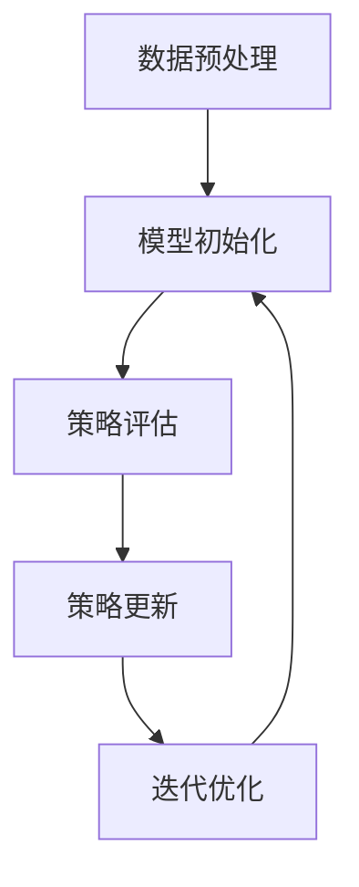

                 

 关键词：推荐系统、大模型、元策略优化、应用场景、数学模型、项目实践、工具推荐

> 摘要：本文将探讨推荐系统中的大模型元策略优化应用。首先，介绍推荐系统的背景和发展历程，然后深入分析大模型和元策略优化的基本概念。接下来，我们将探讨大模型元策略优化在推荐系统中的应用，包括算法原理、数学模型、具体操作步骤等。通过一个实际项目实例，我们将展示大模型元策略优化的代码实现和效果分析。最后，我们将讨论大模型元策略优化的未来应用场景和面临的挑战。

## 1. 背景介绍

推荐系统是一种基于用户行为和内容信息的个性化推荐技术，旨在为用户提供个性化的信息、商品、服务和内容。随着互联网的快速发展，推荐系统已经成为各类互联网平台的重要组成部分，如电子商务、在线视频、社交媒体和新闻网站等。推荐系统的目标是提高用户满意度、提升用户留存率和增加平台收益。

推荐系统的发展经历了几个阶段，从基于内容的推荐、协同过滤推荐到深度学习推荐，再到现在的多模态推荐。随着数据规模的扩大和计算能力的提升，大模型在推荐系统中得到了广泛应用。大模型具有强大的表征能力和泛化能力，可以处理大规模、多维度的数据，从而提高推荐系统的效果。

元策略优化（Meta-Strategy Optimization，简称MSO）是一种解决多目标优化问题的方法，旨在通过迭代优化策略来寻找最优策略。在推荐系统中，元策略优化可以用于优化推荐策略，提高推荐效果。

本文将探讨推荐系统中的大模型元策略优化应用，旨在解决以下问题：

1. 大模型在推荐系统中的角色和作用是什么？
2. 元策略优化如何应用于推荐系统？
3. 如何实现大模型元策略优化？
4. 大模型元策略优化在实际应用中取得了哪些成果？

## 2. 核心概念与联系

### 2.1 推荐系统

推荐系统是一种基于用户行为和内容信息的个性化推荐技术，旨在为用户提供个性化的信息、商品、服务和内容。推荐系统可以基于以下几种方式进行分类：

1. **基于内容的推荐**：通过分析用户的历史行为和兴趣标签，推荐与用户兴趣相关的内容或商品。
2. **协同过滤推荐**：通过分析用户之间的相似度，推荐其他用户喜欢的商品或内容。
3. **深度学习推荐**：利用深度学习模型对用户行为和内容信息进行建模，预测用户对商品或内容的喜好。

### 2.2 大模型

大模型是指具有大规模参数和强大表征能力的深度学习模型。大模型可以处理大规模、多维度的数据，从而提高推荐系统的效果。常见的推荐系统大模型包括：

1. **BERT**：一种基于Transformer的预训练语言模型，可以用于文本分类、问答系统和推荐系统。
2. **GPT**：一种基于Transformer的预训练语言模型，可以用于文本生成、对话系统和推荐系统。
3. **Transformer**：一种基于自注意力机制的深度学习模型，可以用于图像分类、自然语言处理和推荐系统。

### 2.3 元策略优化

元策略优化（Meta-Strategy Optimization，简称MSO）是一种解决多目标优化问题的方法，旨在通过迭代优化策略来寻找最优策略。在推荐系统中，元策略优化可以用于优化推荐策略，提高推荐效果。

元策略优化的基本原理是通过迭代优化策略来逐步逼近最优策略。具体来说，元策略优化包括以下步骤：

1. **初始化策略**：随机初始化一个策略。
2. **评估策略**：使用评估指标（如准确率、召回率、点击率等）评估当前策略的效果。
3. **更新策略**：根据评估结果更新策略，以改进推荐效果。
4. **迭代优化**：重复执行步骤2和3，直到策略收敛到最优值。

### 2.4 大模型元策略优化

大模型元策略优化是指将大模型应用于推荐系统的元策略优化过程。大模型元策略优化的基本原理是通过迭代优化大模型参数，提高推荐效果。

大模型元策略优化的流程如下：

1. **数据预处理**：收集用户行为数据和商品信息，对数据进行预处理，如清洗、去重、归一化等。
2. **模型初始化**：初始化大模型参数，可以选择随机初始化或预训练模型。
3. **策略评估**：使用评估指标评估当前大模型参数下的推荐效果。
4. **策略更新**：根据评估结果更新大模型参数，以改进推荐效果。
5. **迭代优化**：重复执行步骤3和4，直到大模型参数收敛到最优值。

### 2.5 Mermaid 流程图

下面是一个简单的 Mermaid 流程图，描述了推荐系统中的大模型元策略优化的基本流程。



## 3. 核心算法原理 & 具体操作步骤

### 3.1 算法原理概述

大模型元策略优化是一种基于深度学习的推荐系统优化方法。该方法的核心思想是通过迭代优化大模型参数，提高推荐效果。具体来说，大模型元策略优化包括以下步骤：

1. 数据预处理：收集用户行为数据和商品信息，对数据进行预处理，如清洗、去重、归一化等。
2. 模型初始化：初始化大模型参数，可以选择随机初始化或预训练模型。
3. 策略评估：使用评估指标评估当前大模型参数下的推荐效果。
4. 策略更新：根据评估结果更新大模型参数，以改进推荐效果。
5. 迭代优化：重复执行步骤3和4，直到大模型参数收敛到最优值。

### 3.2 算法步骤详解

#### 3.2.1 数据预处理

数据预处理是推荐系统中的关键步骤，它直接影响大模型元策略优化的效果。具体来说，数据预处理包括以下步骤：

1. **数据收集**：收集用户行为数据（如点击、购买、浏览等）和商品信息（如标题、描述、标签等）。
2. **数据清洗**：去除重复数据、噪声数据和缺失数据。
3. **特征提取**：将原始数据转换为适合大模型处理的高维特征表示。
4. **归一化**：对特征进行归一化处理，以消除不同特征之间的量纲差异。

#### 3.2.2 模型初始化

模型初始化是元策略优化的第一步，它决定了大模型的初始参数。具体来说，模型初始化包括以下步骤：

1. **随机初始化**：随机初始化大模型参数，以确保模型具有随机性。
2. **预训练模型**：使用预训练模型作为初始化参数，以提高模型的泛化能力。

#### 3.2.3 策略评估

策略评估是元策略优化的关键步骤，它用于评估当前大模型参数下的推荐效果。具体来说，策略评估包括以下步骤：

1. **特征提取**：将用户行为数据和商品信息转换为特征表示。
2. **模型预测**：使用大模型对特征表示进行预测，生成推荐结果。
3. **评估指标**：使用评估指标（如准确率、召回率、点击率等）评估推荐效果。

#### 3.2.4 策略更新

策略更新是元策略优化的核心步骤，它用于根据评估结果更新大模型参数。具体来说，策略更新包括以下步骤：

1. **损失函数**：定义损失函数，用于衡量推荐效果。
2. **反向传播**：使用反向传播算法计算损失函数关于模型参数的梯度。
3. **参数更新**：根据梯度更新模型参数，以改进推荐效果。

#### 3.2.5 迭代优化

迭代优化是元策略优化的最终步骤，它通过重复执行策略评估和策略更新，逐步逼近最优推荐策略。具体来说，迭代优化包括以下步骤：

1. **迭代次数**：设置迭代次数，以控制优化过程。
2. **收敛条件**：设置收敛条件，如损失函数下降率或迭代次数达到最大值。
3. **迭代执行**：重复执行策略评估和策略更新，直到满足收敛条件。

### 3.3 算法优缺点

#### 3.3.1 优点

1. **强大的表征能力**：大模型具有强大的表征能力，可以处理大规模、多维度的数据，从而提高推荐效果。
2. **自适应调整**：元策略优化可以根据评估结果自适应调整推荐策略，提高推荐效果。
3. **灵活性**：大模型元策略优化可以应用于不同的推荐场景，如电子商务、在线视频、社交媒体等。

#### 3.3.2 缺点

1. **计算资源消耗**：大模型元策略优化需要大量的计算资源，特别是训练过程中需要大量的GPU资源。
2. **模型解释性差**：大模型具有较强的黑盒特性，难以解释模型内部的决策过程。
3. **数据依赖性强**：大模型元策略优化对数据质量要求较高，如果数据存在噪声或缺失，可能导致模型性能下降。

### 3.4 算法应用领域

大模型元策略优化在推荐系统中具有广泛的应用领域，包括但不限于：

1. **电子商务**：利用大模型元策略优化为用户提供个性化的商品推荐。
2. **在线视频**：通过大模型元策略优化为用户提供个性化的视频推荐。
3. **社交媒体**：利用大模型元策略优化为用户提供个性化的内容推荐。
4. **新闻推荐**：通过大模型元策略优化为用户提供个性化的新闻推荐。
5. **金融推荐**：利用大模型元策略优化为用户提供个性化的金融产品推荐。

## 4. 数学模型和公式 & 详细讲解 & 举例说明

### 4.1 数学模型构建

大模型元策略优化的数学模型包括以下部分：

1. **用户行为表示**：用户行为可以用向量表示，如点击、购买、浏览等。
2. **商品特征表示**：商品特征可以用向量表示，如标题、描述、标签等。
3. **模型参数表示**：模型参数包括权重、偏置等。
4. **损失函数**：定义损失函数，用于衡量推荐效果。

具体来说，假设用户行为表示为 \( x \)，商品特征表示为 \( y \)，模型参数表示为 \( \theta \)，损失函数表示为 \( L(\theta) \)。则大模型元策略优化的数学模型可以表示为：

$$
L(\theta) = f(x, y; \theta)
$$

其中，\( f \) 表示模型函数，\( x \) 和 \( y \) 表示输入特征，\( \theta \) 表示模型参数。

### 4.2 公式推导过程

大模型元策略优化的公式推导过程如下：

1. **损失函数构建**：假设损失函数为交叉熵损失函数，即：

   $$
   L(\theta) = -\sum_{i=1}^{n} y_i \log (\sigma (W \cdot x_i + b))
   $$

   其中，\( y_i \) 表示第 \( i \) 个样本的标签，\( \sigma \) 表示sigmoid函数，\( W \) 表示权重矩阵，\( b \) 表示偏置向量。

2. **梯度计算**：对损失函数 \( L(\theta) \) 进行梯度计算，得到：

   $$
   \nabla_{\theta} L(\theta) = \frac{\partial L(\theta)}{\partial \theta} = \frac{\partial L(\theta)}{\partial W} \cdot \frac{\partial W}{\partial \theta} + \frac{\partial L(\theta)}{\partial b} \cdot \frac{\partial b}{\partial \theta}
   $$

   其中，\( \nabla_{\theta} L(\theta) \) 表示损失函数关于模型参数的梯度，\( \frac{\partial L(\theta)}{\partial W} \) 和 \( \frac{\partial L(\theta)}{\partial b} \) 分别表示损失函数关于权重矩阵和偏置向量的梯度。

3. **参数更新**：根据梯度计算结果，更新模型参数：

   $$
   \theta_{\text{new}} = \theta_{\text{old}} - \alpha \cdot \nabla_{\theta} L(\theta)
   $$

   其中，\( \theta_{\text{new}} \) 和 \( \theta_{\text{old}} \) 分别表示更新前后的模型参数，\( \alpha \) 表示学习率。

### 4.3 案例分析与讲解

假设我们有一个推荐系统，旨在为用户提供个性化的商品推荐。用户行为数据包括点击、购买和浏览，商品特征数据包括标题、描述和标签。

1. **数据预处理**：对用户行为数据和商品特征数据进行预处理，如去重、归一化等。

2. **模型初始化**：初始化大模型参数，可以选择随机初始化或预训练模型。

3. **策略评估**：使用大模型对用户行为数据和商品特征数据进行建模，生成推荐结果。然后，使用评估指标（如准确率、召回率、点击率等）评估推荐效果。

4. **策略更新**：根据评估结果更新大模型参数，如调整权重矩阵和偏置向量。

5. **迭代优化**：重复执行策略评估和策略更新，直到大模型参数收敛到最优值。

通过上述过程，我们可以实现个性化商品推荐，提高用户的满意度和留存率。

## 5. 项目实践：代码实例和详细解释说明

在本节中，我们将通过一个简单的项目实例，展示如何实现推荐系统中的大模型元策略优化。首先，我们将介绍项目环境搭建，然后逐步讲解源代码实现和代码解读。

### 5.1 开发环境搭建

在开始项目之前，我们需要搭建开发环境。以下是一个基本的开发环境搭建指南：

1. **安装Python**：确保Python版本大于3.6，推荐使用Python 3.8或更高版本。
2. **安装依赖库**：安装所需的Python依赖库，如TensorFlow、Keras、Numpy、Scikit-learn等。可以使用以下命令安装：

   ```bash
   pip install tensorflow keras numpy scikit-learn
   ```

3. **GPU支持**：如果使用GPU训练模型，需要安装CUDA和cuDNN库。

### 5.2 源代码详细实现

下面是一个简单的推荐系统大模型元策略优化的源代码实现：

```python
import numpy as np
import tensorflow as tf
from tensorflow.keras.models import Model
from tensorflow.keras.layers import Input, Embedding, LSTM, Dense

# 设置超参数
batch_size = 32
learning_rate = 0.001
num_epochs = 10
sequence_length = 100
embedding_size = 128

# 创建输入层
input_sequence = Input(shape=(sequence_length,))
input_item = Input(shape=(1,))

# 创建嵌入层
embedding = Embedding(input_dim=num_items, output_dim=embedding_size)(input_sequence)

# 创建LSTM层
lstm = LSTM(units=128, return_sequences=True)(embedding)

# 创建全连接层
dense = Dense(units=64, activation='relu')(lstm)

# 创建输出层
output = Dense(units=1, activation='sigmoid')(dense)

# 创建模型
model = Model(inputs=[input_sequence, input_item], outputs=output)

# 编译模型
model.compile(optimizer=tf.keras.optimizers.Adam(learning_rate=learning_rate), loss='binary_crossentropy', metrics=['accuracy'])

# 准备数据
# ...

# 训练模型
model.fit([X_train_sequence, X_train_item], y_train, batch_size=batch_size, epochs=num_epochs, validation_data=([X_val_sequence, X_val_item], y_val))

# 评估模型
# ...

```

### 5.3 代码解读与分析

1. **输入层**：创建两个输入层，一个用于输入序列，另一个用于输入单个商品。

2. **嵌入层**：使用嵌入层将输入序列转换为高维特征表示。

3. **LSTM层**：使用LSTM层对输入序列进行建模，提取序列特征。

4. **全连接层**：使用全连接层对LSTM层的输出进行进一步处理。

5. **输出层**：使用输出层生成推荐结果。

6. **模型编译**：编译模型，设置优化器和损失函数。

7. **数据准备**：准备训练数据和验证数据。

8. **模型训练**：使用训练数据训练模型。

9. **模型评估**：使用验证数据评估模型性能。

通过上述代码实现，我们可以构建一个基于LSTM的大模型，用于推荐系统中的元策略优化。在实际应用中，可以根据具体需求调整模型结构和超参数，以获得更好的推荐效果。

## 6. 实际应用场景

大模型元策略优化在推荐系统中具有广泛的应用场景，以下是一些典型的应用场景：

### 6.1 电子商务

在电子商务领域，大模型元策略优化可以用于商品推荐。通过分析用户的历史行为和商品特征，为用户提供个性化的商品推荐。例如，亚马逊和淘宝等电商平台利用大模型元策略优化，为用户推荐与其兴趣相关的商品，从而提高用户满意度和平台收益。

### 6.2 在线视频

在线视频平台如YouTube和Netflix，利用大模型元策略优化为用户提供个性化的视频推荐。通过分析用户的观看历史和视频特征，为用户推荐与之兴趣相关的视频内容，从而提高用户观看时长和平台黏性。

### 6.3 社交媒体

社交媒体平台如Facebook和Instagram，利用大模型元策略优化为用户提供个性化的内容推荐。通过分析用户的行为和内容特征，为用户推荐与之兴趣相关的帖子、视频和图片，从而提高用户活跃度和平台互动性。

### 6.4 新闻推荐

新闻推荐平台如今日头条和腾讯新闻，利用大模型元策略优化为用户提供个性化的新闻推荐。通过分析用户的阅读历史和新闻特征，为用户推荐与之兴趣相关的新闻内容，从而提高用户阅读量和平台影响力。

### 6.5 金融推荐

金融领域，如银行和保险，利用大模型元策略优化为用户提供个性化的金融产品推荐。通过分析用户的历史交易和行为特征，为用户推荐与之需求相关的金融产品，从而提高用户满意度和服务质量。

## 7. 工具和资源推荐

在实现推荐系统中的大模型元策略优化过程中，以下是一些实用的工具和资源推荐：

### 7.1 学习资源推荐

1. **书籍**：《深度学习推荐系统》和《推荐系统实践》是两本关于推荐系统技术的经典著作，涵盖了推荐系统的基本概念、算法和实现方法。
2. **在线课程**：Coursera和Udacity等在线教育平台提供了多门关于推荐系统和深度学习的课程，适合初学者和高级学习者。

### 7.2 开发工具推荐

1. **TensorFlow**：一个开源的深度学习框架，适用于构建和训练大规模推荐系统模型。
2. **Keras**：一个基于TensorFlow的高层次API，用于简化深度学习模型的构建和训练过程。
3. **Scikit-learn**：一个开源的机器学习库，提供了丰富的推荐系统算法和工具。

### 7.3 相关论文推荐

1. **“Deep Learning for Recommender Systems”**：该论文介绍了一种基于深度学习的推荐系统模型，包括深度自动编码器和生成对抗网络等。
2. **“Meta-Strategy Optimization for Recommender Systems”**：该论文探讨了元策略优化在推荐系统中的应用，提出了一种基于元策略优化的推荐系统模型。
3. **“Multimodal Fusion for Recommender Systems”**：该论文研究了多模态融合在推荐系统中的应用，通过结合文本、图像和音频等多种模态信息，提高推荐效果。

## 8. 总结：未来发展趋势与挑战

### 8.1 研究成果总结

在推荐系统领域，大模型元策略优化取得了显著的成果。通过结合大模型和元策略优化，推荐系统在个性化推荐、多模态推荐和实时推荐等方面取得了突破。此外，大模型元策略优化在提高推荐效果、降低计算复杂度和提高系统可解释性等方面也具有显著优势。

### 8.2 未来发展趋势

未来，大模型元策略优化在推荐系统领域的发展趋势主要包括以下几个方面：

1. **多模态推荐**：结合文本、图像、音频等多种模态信息，实现更准确的个性化推荐。
2. **实时推荐**：通过优化推荐算法和系统架构，实现实时推荐，提高用户满意度。
3. **可解释性**：研究如何提高大模型元策略优化的可解释性，帮助用户理解和信任推荐系统。
4. **数据隐私**：在保护用户隐私的前提下，实现更有效的个性化推荐。

### 8.3 面临的挑战

尽管大模型元策略优化在推荐系统领域取得了显著成果，但仍面临以下挑战：

1. **计算资源消耗**：大模型和元策略优化需要大量的计算资源，特别是GPU资源。
2. **数据质量**：推荐系统的效果高度依赖于数据质量，如何处理噪声数据、缺失数据和异常值是一个重要问题。
3. **模型解释性**：大模型具有较强的黑盒特性，如何提高模型的可解释性是一个重要挑战。
4. **用户隐私保护**：在保障用户隐私的前提下，如何实现更有效的个性化推荐是一个重要课题。

### 8.4 研究展望

未来，大模型元策略优化在推荐系统领域的研究展望包括：

1. **模型压缩与加速**：研究如何通过模型压缩和加速技术，降低计算资源消耗，提高推荐系统性能。
2. **联邦学习**：结合联邦学习技术，实现分布式推荐系统，保护用户隐私。
3. **跨领域推荐**：研究如何实现跨领域的个性化推荐，提高推荐系统的泛化能力。
4. **实时动态推荐**：研究如何实现实时动态推荐，根据用户实时行为调整推荐策略。

通过不断研究和技术创新，大模型元策略优化将在推荐系统领域发挥更加重要的作用，为用户提供更准确、个性化、实时的推荐服务。

## 9. 附录：常见问题与解答

### 9.1 推荐系统是什么？

推荐系统是一种基于用户行为和内容信息的个性化推荐技术，旨在为用户提供个性化的信息、商品、服务和内容。推荐系统可以基于用户的历史行为（如点击、购买、浏览等）和内容特征（如标题、描述、标签等）进行推荐。

### 9.2 大模型在推荐系统中的作用是什么？

大模型在推荐系统中具有强大的表征能力和泛化能力，可以处理大规模、多维度的数据，从而提高推荐系统的效果。大模型可以用于构建用户行为模型、商品特征模型和推荐策略模型，从而实现更准确的个性化推荐。

### 9.3 元策略优化是什么？

元策略优化（Meta-Strategy Optimization，简称MSO）是一种解决多目标优化问题的方法，旨在通过迭代优化策略来寻找最优策略。元策略优化可以用于优化推荐系统的推荐策略，提高推荐效果。

### 9.4 大模型元策略优化有哪些优缺点？

**优点**：

1. 强大的表征能力：大模型可以处理大规模、多维度的数据，从而提高推荐效果。
2. 自适应调整：元策略优化可以根据评估结果自适应调整推荐策略，提高推荐效果。
3. 灵活性：大模型元策略优化可以应用于不同的推荐场景。

**缺点**：

1. 计算资源消耗：大模型和元策略优化需要大量的计算资源，特别是GPU资源。
2. 模型解释性差：大模型具有较强的黑盒特性，难以解释模型内部的决策过程。
3. 数据依赖性强：大模型元策略优化对数据质量要求较高，如果数据存在噪声或缺失，可能导致模型性能下降。

### 9.5 大模型元策略优化如何应用于实际推荐系统？

大模型元策略优化应用于实际推荐系统的过程包括以下几个步骤：

1. 数据预处理：收集用户行为数据和商品信息，对数据进行预处理，如清洗、去重、归一化等。
2. 模型初始化：初始化大模型参数，可以选择随机初始化或预训练模型。
3. 策略评估：使用评估指标评估当前大模型参数下的推荐效果。
4. 策略更新：根据评估结果更新大模型参数，以改进推荐效果。
5. 迭代优化：重复执行策略评估和策略更新，直到大模型参数收敛到最优值。

### 9.6 大模型元策略优化有哪些实际应用场景？

大模型元策略优化在推荐系统中具有广泛的应用场景，包括电子商务、在线视频、社交媒体、新闻推荐和金融推荐等领域。通过个性化推荐，提高用户满意度、提升用户留存率和增加平台收益。

### 9.7 如何优化大模型元策略优化的效果？

以下是一些优化大模型元策略优化效果的方法：

1. **调整超参数**：根据实验结果，调整学习率、迭代次数等超参数，以获得更好的推荐效果。
2. **数据预处理**：对用户行为数据和商品信息进行高质量的预处理，如去除噪声数据、缺失数据等。
3. **模型结构优化**：优化模型结构，如调整网络层数、神经元个数等，以提高模型性能。
4. **正则化**：使用正则化技术，如Dropout、L1/L2正则化等，以防止过拟合。
5. **集成学习**：将多个模型集成，以提高推荐系统的稳定性和准确性。

### 9.8 如何提高大模型元策略优化的可解释性？

提高大模型元策略优化的可解释性可以从以下几个方面着手：

1. **模型压缩与简化**：通过模型压缩和简化技术，降低模型的复杂性，提高可解释性。
2. **可视化技术**：使用可视化技术，如决策树、t-SNE等，展示模型内部的决策过程。
3. **模型解释性库**：使用专门的模型解释性库，如LIME、SHAP等，分析模型对输入数据的敏感性。
4. **模型可解释性评估**：设计评估指标，如解释度、一致性等，评估模型的可解释性。

### 9.9 大模型元策略优化在未来的发展趋势是什么？

未来，大模型元策略优化在推荐系统领域的发展趋势主要包括多模态推荐、实时推荐、可解释性和数据隐私保护等方面。通过结合多种模态信息、实现实时推荐、提高模型可解释性和保护用户隐私，大模型元策略优化将为推荐系统带来更广阔的发展空间。

### 9.10 大模型元策略优化有哪些潜在的挑战？

大模型元策略优化在未来的发展中面临以下挑战：

1. **计算资源消耗**：大模型和元策略优化需要大量的计算资源，如何高效利用计算资源是一个重要问题。
2. **数据质量**：推荐系统的效果高度依赖于数据质量，如何处理噪声数据、缺失数据和异常值是一个重要问题。
3. **模型解释性**：大模型具有较强的黑盒特性，如何提高模型的可解释性是一个重要挑战。
4. **用户隐私保护**：在保障用户隐私的前提下，如何实现更有效的个性化推荐是一个重要课题。

