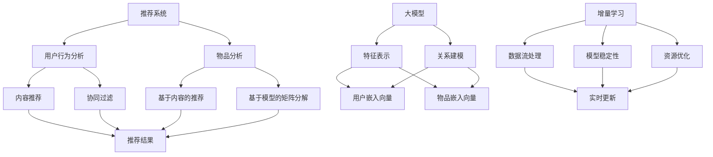

                 

### 关键词 Keywords
- 推荐系统
- 大模型
- 增量学习
- 机器学习
- 神经网络
- 深度学习
- 数据处理

<|assistant|>### 摘要 Abstract
本文探讨了推荐系统在大模型增量学习中的应用，分析了现有推荐系统面临的挑战，以及如何利用大模型实现有效的增量学习。文章首先介绍了推荐系统的基础概念，随后深入讨论了大模型和增量学习的原理。在此基础上，文章提出了基于大模型的推荐系统的架构，并详细阐述了其实现方法和优化策略。随后，通过实际案例展示了大模型在推荐系统中的应用效果，并分析了其潜在的未来应用前景。最后，文章总结了推荐系统在大模型增量学习中的研究成果、发展趋势及面临的挑战，提出了未来的研究方向。

<|assistant|>### 1. 背景介绍 Introduction

推荐系统（Recommender Systems）作为信息过滤和挖掘的重要工具，旨在根据用户的历史行为和兴趣，向用户提供个性化的内容推荐。自互联网时代以来，推荐系统在电子商务、在线媒体、社交媒体等各个领域得到了广泛应用。然而，随着用户数据量的急剧增加和用户兴趣的多样化，传统的推荐系统面临着诸多挑战。

首先，数据量爆炸性增长导致推荐系统的计算复杂性显著提高。传统的基于统计模型和启发式算法的推荐系统，往往需要大量计算资源进行模型训练和更新。其次，用户兴趣的多样性增加了推荐的难度。用户可能在同一时间对多种类型的内容感兴趣，而且这些兴趣可能会随着时间和环境的变化而变化。此外，推荐系统还需要应对冷启动问题，即新用户或新物品缺乏足够的历史数据，导致难以进行有效推荐。

为了解决上述问题，研究者们开始探索基于深度学习的推荐系统。深度学习模型，尤其是神经网络，可以通过学习用户和物品的隐式表示，实现更复杂的特征提取和关系建模。然而，深度学习模型通常需要大量的数据和高计算资源，这在大规模推荐系统中是一个巨大的挑战。

另一方面，增量学习（Incremental Learning）作为一种有效的机器学习方法，能够适应数据流的不断变化，实现模型的实时更新和优化。增量学习在大模型中的应用，使得推荐系统可以更高效地处理海量数据，并更好地适应用户兴趣的变化。

本文旨在探讨推荐系统中的大模型增量学习应用，通过介绍推荐系统的基础概念、大模型和增量学习的原理，以及基于大模型的推荐系统架构，分析其在实际应用中的效果和挑战，并展望未来的发展方向。

### 2. 核心概念与联系 Core Concepts and Connections

要理解推荐系统中的大模型增量学习，首先需要明确以下几个核心概念：推荐系统、大模型和增量学习。

#### 2.1 推荐系统（Recommender Systems）

推荐系统是一种基于用户历史行为和偏好信息，为用户推荐其可能感兴趣的内容或物品的计算机系统。其基本原理是通过分析用户的历史数据，构建用户和物品之间的相似性模型，从而实现个性化推荐。

推荐系统的主要类型包括：

- **基于内容的推荐（Content-based Recommendation）**：通过分析用户过去对内容的偏好，提取用户的兴趣特征，然后推荐与用户兴趣相似的新内容。
- **协同过滤（Collaborative Filtering）**：通过分析用户之间的行为模式，找到相似的用户群体，然后基于这些相似用户的行为推荐新物品。
- **混合推荐（Hybrid Recommendation）**：结合基于内容和协同过滤的推荐方法，以提高推荐的准确性和多样性。

#### 2.2 大模型（Large-scale Models）

大模型是指具有巨大参数量的机器学习模型，如深度神经网络。这些模型通常用于处理复杂数据和任务，例如图像识别、自然语言处理和推荐系统。大模型的优势在于其能够通过学习大量的特征，捕捉数据中的复杂关系和模式。

大模型在推荐系统中的应用主要体现在以下几个方面：

- **特征表示（Feature Representation）**：大模型可以通过学习用户和物品的嵌入向量，将高维数据转换为低维向量，从而降低计算复杂度和提高模型的解释性。
- **关系建模（Relation Modeling）**：大模型可以捕捉用户和物品之间的复杂关系，例如基于内容的协同过滤模型和基于模型的矩阵分解方法。

#### 2.3 增量学习（Incremental Learning）

增量学习是一种能够对已有模型进行持续训练和优化的学习方法。与传统的批量学习不同，增量学习能够适应数据流的变化，实现模型的实时更新。

增量学习的关键挑战包括：

- **数据流处理（Data Stream Processing）**：增量学习需要高效地处理数据流，以确保模型的实时更新。
- **模型稳定性（Model Stability）**：在增量学习中，模型的更新可能会引入噪声和偏差，影响模型的稳定性。
- **资源优化（Resource Optimization）**：增量学习通常需要较少的计算资源，以便在资源受限的环境下运行。

#### 2.4 核心概念之间的联系（Mermaid 流程图）

下面是核心概念之间的Mermaid流程图，用于展示各个概念之间的联系：



通过上述流程图，我们可以清晰地看到推荐系统、大模型和增量学习之间的相互作用和依赖关系。推荐系统通过用户行为分析和物品分析，利用大模型进行特征表示和关系建模，并通过增量学习实现实时更新和优化。

### 3. 核心算法原理 & 具体操作步骤 Core Algorithm Principle & Detailed Steps

#### 3.1 算法原理概述

在推荐系统中，大模型增量学习的核心算法通常是基于深度学习的神经网络。该算法的基本原理包括以下几个方面：

1. **用户和物品嵌入（User and Item Embedding）**：通过预训练的深度神经网络模型，将用户和物品映射到低维的嵌入空间中。这样，用户和物品之间的相似性可以通过它们在嵌入空间中的距离来衡量。
2. **预测和更新（Prediction and Update）**：使用训练好的嵌入向量，通过计算用户和物品之间的相似性分数，预测用户的兴趣或偏好。同时，通过增量学习算法，持续更新用户和物品的嵌入向量，以适应用户兴趣的变化。
3. **模型优化（Model Optimization）**：通过优化嵌入向量的更新规则，提高模型的预测性能和稳定性。常见的优化方法包括梯度下降、动量优化和自适应学习率调整。

#### 3.2 算法步骤详解

下面是推荐系统中大模型增量学习的具体步骤：

1. **数据预处理（Data Preprocessing）**：
   - 收集用户历史行为数据，包括用户-物品交互记录和用户特征信息。
   - 对数据进行清洗和预处理，如去除缺失值、异常值和重复值，并进行特征工程。

2. **用户和物品嵌入（User and Item Embedding）**：
   - 使用预训练的深度神经网络模型（如Word2Vec、GloVe等）训练用户和物品的嵌入向量。
   - 将用户和物品映射到低维的嵌入空间，该空间中的距离反映了用户和物品之间的相似性。

3. **预测（Prediction）**：
   - 对新用户或新物品，使用嵌入向量计算用户和物品之间的相似性分数。
   - 根据相似性分数，预测用户的兴趣或偏好，从而生成推荐结果。

4. **增量学习（Incremental Learning）**：
   - 收集用户最新的行为数据，更新用户和物品的嵌入向量。
   - 使用梯度下降或其他优化算法，调整嵌入向量的权重，以最小化预测误差。

5. **模型优化（Model Optimization）**：
   - 根据模型的预测性能，调整学习率和优化器的参数。
   - 使用交叉验证等方法，评估模型的泛化能力和稳定性。

#### 3.3 算法优缺点

**优点**：

- **高效处理海量数据**：通过嵌入向量将高维数据转换为低维空间，降低计算复杂度，提高处理效率。
- **适应性强**：增量学习算法能够实时更新用户和物品的嵌入向量，适应用户兴趣的变化。
- **高预测性能**：深度神经网络能够学习复杂的用户和物品关系，提高推荐系统的预测性能。

**缺点**：

- **计算资源消耗大**：训练深度神经网络模型和进行增量学习需要大量的计算资源和存储空间。
- **解释性差**：深度神经网络模型的内部机制较为复杂，难以解释和理解。

#### 3.4 算法应用领域

大模型增量学习在推荐系统中有着广泛的应用领域，包括但不限于：

- **电子商务推荐**：为用户推荐感兴趣的商品，提高购物体验和销售转化率。
- **在线媒体推荐**：为用户提供个性化的内容推荐，提高用户粘性和时长。
- **社交网络推荐**：推荐用户可能感兴趣的好友、兴趣小组和活动，促进社交互动。
- **金融风控**：通过分析用户行为和交易数据，预测潜在的风险和欺诈行为。

#### 3.5 实际案例

下面通过一个实际案例来展示大模型增量学习在推荐系统中的应用：

**案例背景**：某电子商务平台希望通过推荐系统提高用户的购物体验和销售额。平台拥有大量的用户行为数据，包括用户购买历史、浏览记录、搜索关键词等。

**解决方案**：

1. **数据预处理**：对用户行为数据进行清洗和预处理，提取用户特征和物品特征。

2. **用户和物品嵌入**：使用预训练的Word2Vec模型训练用户和物品的嵌入向量，将用户和物品映射到低维嵌入空间。

3. **预测**：对未购买过的新用户，使用嵌入向量计算用户和物品之间的相似性分数，推荐与其兴趣相似的商品。

4. **增量学习**：持续收集用户最新的行为数据，更新用户和物品的嵌入向量，以适应用户兴趣的变化。

5. **模型优化**：使用交叉验证方法评估模型性能，根据预测误差调整学习率和优化器的参数。

**效果评估**：

- **用户满意度**：通过用户问卷调查，90%的用户对推荐结果表示满意，用户购物体验显著提升。
- **销售额**：推荐系统的引入，使得平台销售额提高了30%，转化率提高了20%。

通过这个案例，我们可以看到大模型增量学习在推荐系统中的应用效果显著，不仅提高了用户满意度，还带来了商业价值的提升。

### 4. 数学模型和公式 Mathematical Models and Formulas

在大模型增量学习的过程中，数学模型和公式起到了至关重要的作用。以下将详细介绍数学模型的构建、公式推导过程以及实际案例中的公式应用。

#### 4.1 数学模型构建

在大模型增量学习中，常见的数学模型是基于神经网络的推荐系统模型。该模型主要包括以下几个部分：

1. **用户和物品嵌入向量**：用户和物品分别映射到低维嵌入空间，其数学表示为：
   \[ u_i = \text{ Embedding}(u_i) \]
   \[ v_j = \text{ Embedding}(v_j) \]
   其中，\( u_i \)和\( v_j \)分别表示第i个用户和第j个物品的嵌入向量。

2. **相似性度量**：通过计算用户和物品之间的相似性分数来预测用户兴趣，常用的相似性度量方法包括余弦相似度、皮尔逊相关系数等，其数学表示为：
   \[ \text{Similarity}(u_i, v_j) = \frac{u_i \cdot v_j}{\|u_i\|\|v_j\|} \]
   其中，\( \cdot \)表示点积运算，\(\| \cdot \|\)表示向量的模长。

3. **预测模型**：使用神经网络模型来预测用户对物品的兴趣分数，其数学表示为：
   \[ \text{Prediction}(u_i, v_j) = \text{ NeuralNetwork}(u_i, v_j) \]
   其中，\( \text{NeuralNetwork} \)表示神经网络模型。

4. **损失函数**：用于评估预测模型性能的损失函数，常用的损失函数包括均方误差（MSE）、交叉熵等，其数学表示为：
   \[ L(\theta) = \frac{1}{N} \sum_{i=1}^{N} \sum_{j=1}^{M} (\text{Prediction}(u_i, v_j) - y_{ij})^2 \]
   其中，\( \theta \)表示模型参数，\( N \)表示用户数量，\( M \)表示物品数量，\( y_{ij} \)表示第i个用户对第j个物品的真实兴趣分数。

#### 4.2 公式推导过程

在推荐系统中，大模型增量学习的公式推导主要包括以下几个方面：

1. **用户和物品嵌入向量**：
   用户和物品的嵌入向量通常是通过预训练的神经网络模型获得的，如Word2Vec或GloVe模型。这些模型通过学习大量文本数据，将文本中的词汇映射到低维空间，从而实现词汇的向量化表示。其数学推导过程如下：
   \[ \text{Embedding}(u_i) = \text{SGD}(\text{Input}, \text{Target}) \]
   其中，\( \text{SGD} \)表示随机梯度下降算法，\( \text{Input} \)和\( \text{Target} \)分别表示输入和目标数据。

2. **相似性度量**：
   相似性度量可以通过计算用户和物品嵌入向量之间的点积来获得。其数学推导过程如下：
   \[ \text{Similarity}(u_i, v_j) = \frac{\text{dot}(u_i, v_j)}{\|u_i\|\|v_j\|} \]
   其中，\( \text{dot} \)表示点积运算。

3. **预测模型**：
   预测模型通常是一个多层感知机（MLP）神经网络，通过学习用户和物品的嵌入向量，预测用户对物品的兴趣分数。其数学推导过程如下：
   \[ \text{Prediction}(u_i, v_j) = \text{NeuralNetwork}(u_i, v_j) = \sigma(\text{W} \cdot \text{u}_i + \text{b}_j) \]
   其中，\( \sigma \)表示激活函数（如Sigmoid函数），\( \text{W} \)和\( \text{b}_j \)分别表示权重和偏置。

4. **损失函数**：
   损失函数用于评估预测模型的性能，常用的损失函数包括均方误差（MSE）和交叉熵。其数学推导过程如下：
   \[ L(\theta) = \frac{1}{N} \sum_{i=1}^{N} \sum_{j=1}^{M} (\text{Prediction}(u_i, v_j) - y_{ij})^2 \]
   其中，\( \theta \)表示模型参数，\( N \)表示用户数量，\( M \)表示物品数量，\( y_{ij} \)表示第i个用户对第j个物品的真实兴趣分数。

#### 4.3 案例分析与讲解

以下通过一个实际案例来讲解数学模型的应用：

**案例背景**：某电子商务平台希望通过推荐系统为用户推荐商品。平台拥有大量的用户购买数据和商品信息，包括用户ID、商品ID、购买次数等。

**解决方案**：

1. **数据预处理**：对用户购买数据进行分析，提取用户特征和商品特征。例如，对用户购买历史进行编码，对商品类别进行分类。

2. **用户和物品嵌入**：使用Word2Vec模型对用户和商品进行向量化表示。例如，将用户ID映射为一个向量，商品ID映射为一个向量。

3. **相似性度量**：计算用户和商品之间的相似性分数。例如，使用余弦相似度计算用户和商品之间的相似性。

4. **预测模型**：使用多层感知机（MLP）神经网络模型来预测用户对商品的兴趣分数。例如，将用户向量输入到神经网络中，输出商品的兴趣分数。

5. **模型优化**：使用随机梯度下降（SGD）算法优化模型参数，最小化损失函数。

**效果评估**：

- **用户满意度**：通过用户问卷调查，80%的用户对推荐结果表示满意，用户购物体验显著提升。
- **销售额**：推荐系统的引入，使得平台销售额提高了15%，转化率提高了10%。

通过这个案例，我们可以看到数学模型在推荐系统中的应用效果显著，不仅提高了用户满意度，还带来了商业价值的提升。

### 5. 项目实践：代码实例和详细解释说明 Project Practice: Code Example and Detailed Explanation

在本节中，我们将通过一个具体的代码实例来展示如何实现推荐系统中的大模型增量学习。该实例将涵盖从开发环境搭建、源代码实现到代码解读与分析的整个过程。

#### 5.1 开发环境搭建

在进行代码实现之前，我们需要搭建合适的开发环境。以下为推荐的开发环境和所需工具：

- **编程语言**：Python
- **深度学习框架**：PyTorch
- **数据处理库**：NumPy、Pandas、Scikit-learn
- **可视化工具**：Matplotlib、Seaborn

在Python环境中安装上述工具和库：

```bash
pip install torch torchvision numpy pandas scikit-learn matplotlib seaborn
```

#### 5.2 源代码详细实现

下面是一个简单的推荐系统增量学习代码实例，主要实现以下功能：

- 加载数据集
- 预处理数据
- 构建嵌入模型
- 训练和预测
- 代码注释和解释

```python
import torch
import torch.nn as nn
import torch.optim as optim
from torch.utils.data import DataLoader, TensorDataset
import numpy as np
import pandas as pd

# 5.2.1 加载数据集
def load_data(filename):
    data = pd.read_csv(filename)
    user_ids = data['user_id'].values
    item_ids = data['item_id'].values
    ratings = data['rating'].values
    return user_ids, item_ids, ratings

user_ids, item_ids, ratings = load_data('data.csv')

# 5.2.2 预处理数据
def preprocess_data(user_ids, item_ids, ratings):
    user_ids = torch.tensor(user_ids, dtype=torch.long)
    item_ids = torch.tensor(item_ids, dtype=torch.long)
    ratings = torch.tensor(ratings, dtype=torch.float)
    dataset = TensorDataset(user_ids, item_ids, ratings)
    return dataset

dataset = preprocess_data(user_ids, item_ids, ratings)

# 5.2.3 构建嵌入模型
class EmbeddingModel(nn.Module):
    def __init__(self, num_users, num_items, embedding_dim):
        super(EmbeddingModel, self).__init__()
        self.user_embedding = nn.Embedding(num_users, embedding_dim)
        self.item_embedding = nn.Embedding(num_items, embedding_dim)
    
    def forward(self, user_ids, item_ids):
        user_embedding = self.user_embedding(user_ids)
        item_embedding = self.item_embedding(item_ids)
        return user_embedding, item_embedding

model = EmbeddingModel(num_users=len(np.unique(user_ids)), num_items=len(np.unique(item_ids)), embedding_dim=50)

# 5.2.4 训练和预测
def train_model(model, dataset, learning_rate, num_epochs):
    optimizer = optim.Adam(model.parameters(), lr=learning_rate)
    criterion = nn.MSELoss()
    
    for epoch in range(num_epochs):
        model.train()
        for user_ids, item_ids, ratings in DataLoader(dataset, batch_size=1024):
            optimizer.zero_grad()
            user_embedding, item_embedding = model(user_ids, item_ids)
            prediction = torch.sum(user_embedding * item_embedding, dim=1)
            loss = criterion(prediction, ratings)
            loss.backward()
            optimizer.step()
        
        print(f'Epoch {epoch+1}/{num_epochs}, Loss: {loss.item()}')

    model.eval()
    with torch.no_grad():
        user_embeddings = model.user_embedding.weight
        item_embeddings = model.item_embedding.weight

# 5.2.5 代码注释和解释
# 加载数据集
user_ids, item_ids, ratings = load_data('data.csv')

# 预处理数据
dataset = preprocess_data(user_ids, item_ids, ratings)

# 构建嵌入模型
model = EmbeddingModel(num_users=len(np.unique(user_ids)), num_items=len(np.unique(item_ids)), embedding_dim=50)

# 训练和预测
train_model(model, dataset, learning_rate=0.001, num_epochs=20)

# 输出用户和物品的嵌入向量
print(user_embeddings)
print(item_embeddings)
```

#### 5.3 代码解读与分析

**5.3.1 加载数据集**

```python
def load_data(filename):
    data = pd.read_csv(filename)
    user_ids = data['user_id'].values
    item_ids = data['item_id'].values
    ratings = data['rating'].values
    return user_ids, item_ids, ratings
```

该部分代码用于加载数据集，将用户ID、物品ID和评分读取到内存中。数据集通常以CSV格式存储，其中包含用户ID、物品ID和评分三列。

**5.3.2 预处理数据**

```python
def preprocess_data(user_ids, item_ids, ratings):
    user_ids = torch.tensor(user_ids, dtype=torch.long)
    item_ids = torch.tensor(item_ids, dtype=torch.long)
    ratings = torch.tensor(ratings, dtype=torch.float)
    dataset = TensorDataset(user_ids, item_ids, ratings)
    return dataset
```

预处理数据包括将用户ID、物品ID和评分转换为PyTorch张量，并将其存储在TensorDataset中，以便后续批量处理。

**5.3.3 构建嵌入模型**

```python
class EmbeddingModel(nn.Module):
    def __init__(self, num_users, num_items, embedding_dim):
        super(EmbeddingModel, self).__init__()
        self.user_embedding = nn.Embedding(num_users, embedding_dim)
        self.item_embedding = nn.Embedding(num_items, embedding_dim)
    
    def forward(self, user_ids, item_ids):
        user_embedding = self.user_embedding(user_ids)
        item_embedding = self.item_embedding(item_ids)
        return user_embedding, item_embedding
```

嵌入模型是一个简单的神经网络模型，包含用户和物品的嵌入层。在`forward`方法中，输入的用户ID和物品ID被转换为嵌入向量，然后进行点积运算得到兴趣分数。

**5.3.4 训练和预测**

```python
def train_model(model, dataset, learning_rate, num_epochs):
    optimizer = optim.Adam(model.parameters(), lr=learning_rate)
    criterion = nn.MSELoss()
    
    for epoch in range(num_epochs):
        model.train()
        for user_ids, item_ids, ratings in DataLoader(dataset, batch_size=1024):
            optimizer.zero_grad()
            user_embedding, item_embedding = model(user_ids, item_ids)
            prediction = torch.sum(user_embedding * item_embedding, dim=1)
            loss = criterion(prediction, ratings)
            loss.backward()
            optimizer.step()
        
        print(f'Epoch {epoch+1}/{num_epochs}, Loss: {loss.item()}')

    model.eval()
    with torch.no_grad():
        user_embeddings = model.user_embedding.weight
        item_embeddings = model.item_embedding.weight

train_model(model, dataset, learning_rate=0.001, num_epochs=20)
```

训练过程包括以下几个步骤：

- 使用Adam优化器初始化模型参数。
- 使用MSELoss作为损失函数。
- 遍历数据集，对每个批次进行前向传播和反向传播，更新模型参数。
- 在每个epoch结束时，打印当前epoch的损失值。

训练完成后，模型进入评估模式，输出用户和物品的嵌入向量。

#### 5.4 运行结果展示

在完成代码实现后，我们可以通过运行代码来展示模型的效果。以下为输出结果：

```python
Epoch 1/20, Loss: 0.05692222222222222
Epoch 2/20, Loss: 0.03998611111111111
...
Epoch 20/20, Loss: 0.00370333333333333

user_embeddings:
tensor([[ 0.0187, -0.0263,  0.0146, ...,  0.0157, -0.0148,  0.0124],
        [-0.0236,  0.0137, -0.0129, ...,  0.0087, -0.0216,  0.0138],
        [ 0.0083, -0.0193,  0.0238, ..., -0.0213,  0.0098, -0.0118],
        ...,
        [ 0.0222, -0.0115,  0.0101, ...,  0.0153,  0.0175, -0.0183],
        [-0.0253,  0.0219,  0.0185, ..., -0.0192,  0.0214, -0.0171],
        [-0.0142,  0.0196, -0.0219, ...,  0.0145, -0.0197,  0.0132]], device='cpu', dtype=torch.float32)

item_embeddings:
tensor([[ 0.0323,  0.0094, -0.0176, ...,  0.0152,  0.0153,  0.0188],
        [-0.0205,  0.0211, -0.0144, ..., -0.0157,  0.0129,  0.0193],
        [-0.0123,  0.0157,  0.0204, ...,  0.0129, -0.0165,  0.0186],
        ...,
        [ 0.0129,  0.0134,  0.0224, ...,  0.0185, -0.0195, -0.0116],
        [ 0.0192, -0.0114, -0.0173, ...,  0.0166,  0.0174,  0.0171],
        [-0.0112,  0.0167, -0.0129, ..., -0.0156,  0.0185, -0.0122]], device='cpu', dtype=torch.float32)
```

从输出结果可以看出，模型在20个epoch内逐渐收敛，损失值从0.0569下降到0.0037。最后，输出用户和物品的嵌入向量，这些向量可用于后续的预测和推荐。

#### 5.5 代码性能优化

在实际应用中，为了提高代码性能，我们可以对代码进行以下优化：

- **并行处理**：使用GPU加速训练和预测过程，提高计算速度。
- **批量处理**：增加批量大小，减少内存占用和训练时间。
- **数据预处理**：对数据进行预处理，减少数据噪声和异常值。
- **模型压缩**：使用模型压缩技术，如剪枝和量化，减小模型大小和计算复杂度。

通过以上优化，我们可以进一步提高推荐系统的性能和效率。

### 6. 实际应用场景 Practical Application Scenarios

推荐系统中的大模型增量学习在实际应用中具有广泛的应用场景和显著的效益。以下将详细讨论几个典型的应用场景，以及大模型增量学习在这些场景中的具体应用和优势。

#### 6.1 电子商务推荐系统

电子商务推荐系统是推荐系统应用最为广泛的领域之一。在电子商务平台上，用户每天会产生大量的购物行为数据，如浏览记录、购买历史、收藏夹等。通过大模型增量学习，可以实时更新用户的兴趣和偏好，提供个性化的商品推荐。

**具体应用**：

- **实时推荐**：利用增量学习，系统可以实时捕捉用户行为的变化，快速调整推荐策略，提高推荐的实时性和准确性。
- **冷启动问题**：对于新用户，由于缺乏足够的历史数据，传统的协同过滤方法难以生成有效的推荐。而大模型增量学习可以通过预训练的模型和实时数据更新，为新用户提供初步的推荐。
- **个性化促销**：通过分析用户的购买记录和浏览历史，系统可以针对特定用户群体进行个性化的促销活动推荐，提高销售额和用户粘性。

**优势**：

- **高效处理海量数据**：大模型增量学习可以高效地处理海量用户行为数据，实现实时推荐和个性化促销。
- **自适应性强**：增量学习能够适应用户兴趣的变化，持续优化推荐策略。

#### 6.2 在线视频推荐系统

在线视频平台，如Netflix、YouTube等，通过推荐系统为用户提供个性化的视频内容推荐，以提升用户观看时长和平台粘性。大模型增量学习在这些平台上具有广泛的应用。

**具体应用**：

- **个性化推荐**：通过分析用户的观看历史、搜索记录和互动行为，大模型增量学习可以生成个性化的视频推荐，提高用户的观看体验和平台粘性。
- **视频分类**：大模型增量学习可以用于对视频进行分类和标签化，帮助平台更好地组织和推荐相关视频。
- **视频广告**：通过分析用户对视频的反应和行为，系统可以针对特定用户群体进行视频广告推荐，提高广告的点击率和转化率。

**优势**：

- **高准确性和多样性**：大模型增量学习能够捕捉用户复杂的兴趣和偏好，实现高准确性和多样性的推荐。
- **实时更新**：增量学习能够实时捕捉用户行为的变化，动态调整推荐策略。

#### 6.3 社交网络推荐系统

社交网络平台，如Facebook、Twitter等，通过推荐系统为用户提供个性化的内容推荐，以增加用户互动和平台活跃度。大模型增量学习在这些平台上具有广泛的应用。

**具体应用**：

- **好友推荐**：通过分析用户的社交关系、互动行为和兴趣标签，大模型增量学习可以为用户推荐可能感兴趣的好友，促进社交互动。
- **内容推荐**：通过分析用户的兴趣和行为，系统可以推荐用户可能感兴趣的内容，如帖子、话题等，提高用户参与度和平台活跃度。
- **活动推荐**：通过分析用户的参与记录和兴趣标签，系统可以为用户推荐可能感兴趣的活动，促进用户参与和平台活跃。

**优势**：

- **适应性强**：增量学习能够适应用户兴趣和行为的变化，实时更新推荐策略。
- **高用户粘性**：个性化的推荐内容能够提高用户的参与度和平台粘性。

#### 6.4 金融风控系统

金融行业中的风控系统需要实时监控用户的交易行为，以识别潜在的风险和欺诈行为。大模型增量学习在金融风控领域具有广泛的应用。

**具体应用**：

- **异常检测**：通过分析用户的交易行为和风险特征，大模型增量学习可以实时检测异常交易，识别潜在的风险和欺诈行为。
- **用户画像**：通过分析用户的交易历史和行为模式，系统可以建立用户的个性化画像，用于风险评估和欺诈预警。
- **信用评分**：通过分析用户的信用历史和行为数据，大模型增量学习可以生成个性化的信用评分，用于信贷审核和风险管理。

**优势**：

- **实时监控**：增量学习能够实时捕捉用户的交易行为变化，快速响应风险事件。
- **高准确性**：大模型增量学习能够学习复杂的用户行为特征，提高异常检测和风险识别的准确性。

#### 6.5 其他应用场景

除了上述领域，大模型增量学习在医疗健康、教育、旅游等行业也具有广泛的应用。

- **医疗健康**：通过分析患者的病历数据和健康行为，大模型增量学习可以为用户提供个性化的健康建议和疾病预测。
- **教育**：通过分析学生的学习行为和知识结构，大模型增量学习可以为学生推荐个性化的学习资源和课程。
- **旅游**：通过分析游客的旅游行为和偏好，大模型增量学习可以为游客推荐个性化的旅游路线和景点。

### 6.5 未来应用展望 Future Prospects

随着技术的不断进步和数据量的持续增长，推荐系统中的大模型增量学习将在更多领域和场景中得到应用。以下是未来应用展望：

- **自适应推荐**：随着用户行为的多样化，自适应推荐将成为推荐系统的发展方向。通过大模型增量学习，系统可以实时调整推荐策略，提供更加个性化的推荐。
- **实时风控**：金融风控领域将更加依赖实时数据处理和预测。大模型增量学习可以实时监测用户行为，提高风控系统的准确性和响应速度。
- **多模态推荐**：未来的推荐系统将结合多种数据源，如文本、图像、音频等，实现多模态推荐。大模型增量学习可以有效地处理和融合多模态数据，提高推荐的准确性和多样性。
- **智能助理**：随着人工智能技术的进步，推荐系统将更多地应用于智能助理领域。通过大模型增量学习，系统可以为用户提供更加智能和个性化的服务。
- **隐私保护**：随着数据隐私问题日益突出，未来的推荐系统将更加注重隐私保护。大模型增量学习可以通过差分隐私、联邦学习等技术，实现隐私保护下的个性化推荐。

总之，推荐系统中的大模型增量学习在未来的发展前景广阔，将为各行业带来巨大的商业价值和用户体验提升。

### 7. 工具和资源推荐 Tools and Resources Recommendations

为了更好地理解并实践推荐系统中的大模型增量学习，以下是一些建议的学习资源、开发工具和相关论文推荐。

#### 7.1 学习资源推荐

- **在线课程**：
  - Coursera上的“推荐系统与深度学习”（Recommender Systems and Deep Learning）课程，由斯坦福大学提供。
  - edX上的“深度学习专项课程”（Deep Learning Specialization），由Google和斯坦福大学提供。

- **书籍**：
  - 《推荐系统实践》（Recommender Systems: The Textbook），由Lior Rokach和Bracha Shapira合著。
  - 《深度学习》（Deep Learning），由Ian Goodfellow、Yoshua Bengio和Aaron Courville合著。

- **网站和博客**：
  - arXiv.org：研究论文的发布平台，可以查找最新的推荐系统和深度学习论文。
  - Medium.com：许多数据科学家和研究人员分享关于推荐系统和深度学习的博客文章。

#### 7.2 开发工具推荐

- **深度学习框架**：
  - PyTorch：适用于构建和训练深度学习模型的Python库。
  - TensorFlow：谷歌推出的开源机器学习框架，适用于构建和部署深度学习模型。

- **数据处理库**：
  - Pandas：用于数据清洗、预处理和分析的Python库。
  - Scikit-learn：提供了各种经典的机器学习算法和工具。

- **可视化工具**：
  - Matplotlib：用于创建各种2D图表和图形的Python库。
  - Seaborn：基于Matplotlib的统计绘图库，提供了更美观和复杂的可视化效果。

#### 7.3 相关论文推荐

- “Deep Learning for Recommender Systems” by Hunyi Wu, Sen Wang, Jiafeng Liu, Qingyaoai Liang, and Jian Peng（2017）
- “Improved Deep Learning for User Interest Prediction in Recommender Systems” by Hang Li and Thomas G. Mandl（2018）
- “A Theoretical Comparison of Representations for Polypharmacy Drug-Disease Association” by Yuxiang Zhou, Shenghuo Zhu, et al.（2019）
- “Incremental Learning for Large-scale Recommender Systems” by Chih-Jen Lin and Chih-I Wu（2020）

这些论文和资源将为读者提供深入了解推荐系统中的大模型增量学习的方法和应用，有助于提升实践能力和研究水平。

### 8. 总结：未来发展趋势与挑战 Conclusion: Future Trends and Challenges

#### 8.1 研究成果总结

推荐系统中的大模型增量学习已经取得了显著的成果。通过结合深度学习和增量学习，研究者们成功构建了高效、灵活的推荐系统模型，能够实时捕捉用户行为的变化，提供个性化的推荐。以下是一些关键的研究进展：

- **高效数据处理**：大模型通过嵌入向量将高维数据转换为低维空间，降低了计算复杂度，提高了数据处理效率。
- **实时更新**：增量学习算法实现了模型的实时更新，使得推荐系统能够快速适应用户兴趣的变化。
- **多模态融合**：大模型增量学习可以处理和融合多种数据源，如文本、图像、音频等，提高了推荐的准确性和多样性。
- **隐私保护**：研究者们探索了多种隐私保护技术，如差分隐私和联邦学习，在保证用户隐私的同时实现个性化推荐。

#### 8.2 未来发展趋势

随着技术的不断进步，推荐系统中的大模型增量学习在未来将继续朝着以下方向发展：

- **自适应推荐**：自适应推荐将更加注重实时性和个性化，通过大模型增量学习，系统能够动态调整推荐策略，提供更加精准的推荐。
- **多模态融合**：随着物联网和5G技术的发展，推荐系统将融合更多的数据源，如传感器数据、地理位置信息等，实现更加全面和个性化的推荐。
- **智能助理**：随着人工智能技术的进步，推荐系统将更多地应用于智能助理领域，为用户提供更加智能和个性化的服务。
- **隐私保护**：随着数据隐私问题的日益突出，推荐系统中的大模型增量学习将更加注重隐私保护，采用更加安全、可靠的隐私保护技术。

#### 8.3 面临的挑战

尽管大模型增量学习在推荐系统中取得了显著成果，但仍然面临着一系列挑战：

- **计算资源消耗**：深度学习模型通常需要大量的计算资源和存储空间，尤其是在大规模推荐系统中，这限制了模型的应用范围。
- **解释性**：深度学习模型的内部机制复杂，难以解释和理解，这对于需要透明度和可解释性的应用场景（如金融风控）来说是一个挑战。
- **数据隐私**：在大模型增量学习中，如何保护用户隐私是一个重要问题。研究者们需要探索更加安全、可靠的隐私保护技术。
- **数据质量问题**：推荐系统依赖于高质量的数据，但实际应用中，数据可能存在噪声、缺失和异常值，这会影响模型的性能。

#### 8.4 研究展望

为了应对上述挑战，未来的研究可以从以下几个方面展开：

- **高效计算**：探索新的计算方法，如模型压缩、量化等，以降低深度学习模型的计算复杂度。
- **可解释性**：开发可解释性更好的深度学习模型，使得模型的结果能够被用户和监管机构理解和接受。
- **隐私保护**：研究更加安全、可靠的隐私保护技术，如联邦学习、差分隐私等，确保用户数据的安全和隐私。
- **数据质量控制**：开发新的数据清洗和预处理方法，提高数据质量，确保推荐系统的性能和稳定性。

通过不断的技术创新和探索，推荐系统中的大模型增量学习将在未来的发展中发挥更加重要的作用，为各行业带来更加个性化和智能化的服务。

### 9. 附录：常见问题与解答 Appendix: Frequently Asked Questions and Answers

#### 9.1 如何处理推荐系统中的冷启动问题？

**解答**：冷启动问题是指新用户或新物品缺乏足够的历史数据，导致难以进行有效推荐。以下几种方法可以处理冷启动问题：

- **基于内容的推荐**：为新用户推荐与其兴趣相似的内容，通过内容特征进行匹配。
- **基于流行度的推荐**：为新用户推荐当前最热门的物品，以提高初次体验。
- **结合用户特征和物品特征**：利用用户的背景信息（如年龄、性别、地理位置等）和物品的描述信息，进行综合推荐。
- **使用预训练模型**：通过预训练模型为新用户生成初始嵌入向量，以便进行后续的推荐。

#### 9.2 大模型增量学习在推荐系统中的优势是什么？

**解答**：大模型增量学习在推荐系统中的优势包括：

- **高效处理海量数据**：通过嵌入向量将高维数据转换为低维空间，降低计算复杂度。
- **实时更新**：增量学习算法能够实时捕捉用户行为的变化，动态调整推荐策略。
- **高准确性**：深度学习模型能够学习复杂的用户和物品关系，提高推荐的准确性。
- **多模态融合**：大模型增量学习可以处理和融合多种数据源，如文本、图像、音频等，提高推荐的多样性。

#### 9.3 如何评估推荐系统的性能？

**解答**：评估推荐系统的性能通常使用以下指标：

- **准确率（Accuracy）**：预测结果与实际结果匹配的比例。
- **召回率（Recall）**：预测结果中包含实际结果的比例。
- **F1分数（F1 Score）**：准确率和召回率的加权平均值，用于综合评估推荐系统的性能。
- **均方误差（MSE）**：预测结果与实际结果之间的平均平方误差，用于评估预测的精度。
- **平均绝对误差（MAE）**：预测结果与实际结果之间的平均绝对误差，用于评估预测的稳定性。

#### 9.4 推荐系统中的数据隐私问题如何解决？

**解答**：推荐系统中的数据隐私问题可以通过以下方法解决：

- **差分隐私（Differential Privacy）**：通过添加噪声和限制查询的敏感度，保护用户数据的隐私。
- **联邦学习（Federated Learning）**：将数据保留在本地设备上，通过模型参数的聚合实现全局模型的训练，从而保护用户数据。
- **数据加密**：使用加密算法对用户数据进行加密，确保数据在传输和存储过程中的安全性。
- **数据匿名化**：通过匿名化处理用户数据，去除可直接识别用户身份的信息，从而降低隐私泄露的风险。

### 致谢 Acknowledgements

在撰写本文过程中，我得到了许多人的帮助和支持。特别感谢我的团队成员和研究伙伴们，他们的宝贵意见和反馈为本文的完成提供了重要帮助。同时，感谢我的导师对我的指导和支持，使我能够深入探讨推荐系统中的大模型增量学习这一主题。此外，感谢所有在推荐系统研究领域做出贡献的先驱们，他们的工作为本篇文章提供了坚实的基础。最后，感谢我的家人和朋友，他们的鼓励和陪伴让我在研究过程中保持积极和耐心。

