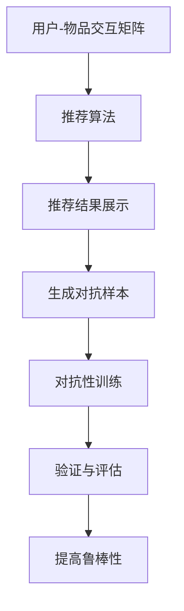

                 

关键词：推荐系统、大模型对抗训练、鲁棒性、深度学习、机器学习、对抗攻击、数据安全

摘要：本文旨在探讨推荐系统中的大模型对抗训练与鲁棒性的关系。随着深度学习在推荐系统中的广泛应用，模型的大小和复杂性不断增长，这使得对抗攻击成为了当前研究的热点问题。本文首先介绍了推荐系统的基础概念和对抗攻击的基本原理，然后详细分析了大模型对抗训练的必要性、方法和挑战，最后探讨了提高推荐系统鲁棒性的策略以及未来发展趋势。

## 1. 背景介绍

推荐系统是现代互联网中不可或缺的一部分，它们被广泛应用于电子商务、社交媒体、视频流媒体和新闻推送等领域。推荐系统的核心目标是通过分析用户的兴趣和行为模式，向用户推荐他们可能感兴趣的内容或商品，从而提高用户满意度、增加平台黏性和提高商业价值。

随着深度学习的兴起，推荐系统的性能得到了显著提升。深度学习模型能够从大量数据中自动学习复杂的特征表示，这使得推荐系统更加准确和智能化。然而，深度学习模型也存在一些固有的缺陷，如易受对抗攻击、对训练数据的依赖性等。对抗攻击是一种利用模型自身特性进行攻击的手段，它可以引入微小的扰动来误导模型输出，从而破坏系统的鲁棒性。

在大模型时代，推荐系统的挑战变得更加严峻。大模型通常包含数百万甚至数十亿个参数，这使得它们在训练和推理过程中需要大量的计算资源和时间。同时，大模型更容易受到对抗攻击，因为它们包含更多的信息泄漏点和复杂的内部结构。

本文将重点关注以下问题：

- 推荐系统中的大模型对抗训练是什么？
- 大模型对抗训练有哪些方法？
- 如何提高推荐系统的鲁棒性？
- 推荐系统中的大模型对抗训练与鲁棒性之间的关系是什么？
- 未来推荐系统中的大模型对抗训练和鲁棒性研究有哪些趋势和挑战？

## 2. 核心概念与联系

### 推荐系统基本概念

推荐系统是一种信息过滤技术，旨在根据用户的历史行为和偏好，为用户提供个性化的推荐。推荐系统通常由以下三个关键组件组成：

1. **用户-物品交互矩阵**：记录用户与物品的交互历史，如购买、点击、评分等。
2. **推荐算法**：根据用户历史行为和物品特征，计算用户对物品的潜在兴趣度，并生成推荐列表。
3. **推荐结果展示**：将推荐结果呈现给用户，如推荐列表、推荐界面等。

### 对抗攻击基本原理

对抗攻击是一种通过向目标模型输入恶意扰动数据来误导模型输出的攻击手段。基本原理如下：

1. **生成对抗样本**：攻击者利用梯度信息或其他方法生成对模型有破坏性的扰动数据。
2. **对抗样本攻击**：将生成的对抗样本输入到目标模型中，观察模型是否能够正确识别或分类。
3. **对抗性防御**：为了抵御对抗攻击，研究者提出了多种防御策略，如对抗训练、数据增强、模型正则化等。

### 大模型对抗训练

大模型对抗训练是指通过对抗性样本训练来提高模型对对抗攻击的鲁棒性。具体方法包括：

1. **生成对抗样本**：利用梯度信息或其他方法生成对抗性样本。
2. **对抗性训练**：将对抗性样本与正常样本一起训练，以增强模型的鲁棒性。
3. **验证与评估**：通过对抗性测试来验证模型对对抗攻击的鲁棒性，并进行性能评估。

### Mermaid 流程图

以下是推荐系统中的大模型对抗训练与鲁棒性的 Mermaid 流程图：



## 3. 核心算法原理 & 具体操作步骤

### 3.1 算法原理概述

大模型对抗训练的核心思想是通过引入对抗性样本来提高模型对对抗攻击的鲁棒性。具体来说，算法分为以下几个步骤：

1. **数据预处理**：从原始数据中提取用户-物品交互矩阵和物品特征。
2. **生成对抗样本**：利用梯度信息或其他方法生成对抗性样本。
3. **对抗性训练**：将对抗性样本与正常样本一起训练，以增强模型的鲁棒性。
4. **验证与评估**：通过对抗性测试来验证模型对对抗攻击的鲁棒性，并进行性能评估。

### 3.2 算法步骤详解

1. **数据预处理**：

   - 从原始数据中提取用户-物品交互矩阵和物品特征。
   - 对数据集进行清洗和预处理，如去除缺失值、异常值等。

2. **生成对抗样本**：

   - 利用梯度信息或其他方法生成对抗性样本。常见的方法包括基于梯度的攻击（Gradient-based Attack）和基于搜索的攻击（Search-based Attack）。

   ```mermaid
   graph TD
       A[输入正常样本] --> B[计算梯度]
       B --> C[生成扰动]
       C --> D[对抗样本]
   ```

3. **对抗性训练**：

   - 将对抗性样本与正常样本一起训练。可以使用以下两种策略：

   - **混合训练**：将对抗性样本和正常样本按一定比例混合，一起进行训练。

   ```mermaid
   graph TD
       A[对抗样本] --> B[混合训练]
       B --> C[正常样本]
       C --> D[模型更新]
   ```

   - **对抗性蒸馏**：将对抗性样本作为辅助任务，与原始任务一起训练。

   ```mermaid
   graph TD
       A[对抗样本] --> B[对抗性蒸馏]
       B --> C[原始任务]
       C --> D[模型更新]
   ```

4. **验证与评估**：

   - 使用对抗性测试集对训练好的模型进行测试，评估模型对对抗攻击的鲁棒性。
   - 可以使用以下指标来评估模型性能：

   - **准确率**：模型对正常样本和对抗样本的分类准确率。
   - **召回率**：模型对对抗样本的召回率。
   - **F1 分数**：准确率和召回率的加权平均。

### 3.3 算法优缺点

**优点**：

- 提高模型对对抗攻击的鲁棒性。
- 可以利用对抗性样本进行模型训练，提高模型泛化能力。

**缺点**：

- 对抗性样本生成过程复杂，需要较大的计算资源。
- 可能会导致模型过拟合，降低模型泛化能力。

### 3.4 算法应用领域

大模型对抗训练在推荐系统中的应用非常广泛，以下是一些具体的应用领域：

- **推荐系统**：通过对抗性训练提高推荐系统的鲁棒性，降低对抗攻击对推荐结果的影响。
- **图像识别**：利用对抗性训练提高图像识别模型的鲁棒性，对抗图像编辑和对抗性样本攻击。
- **自然语言处理**：通过对抗性训练提高自然语言处理模型对对抗性输入的鲁棒性，如文本分类、机器翻译等。

## 4. 数学模型和公式 & 详细讲解 & 举例说明

### 4.1 数学模型构建

大模型对抗训练的核心是生成对抗性样本。下面介绍一种常见的对抗性样本生成方法——FGSM（Fast Gradient Sign Method）。

**目标函数**：

假设原始模型为 $f(x; \theta)$，其中 $x$ 是输入样本，$\theta$ 是模型参数。我们希望找到对抗性样本 $x'$，使得模型对 $x'$ 的预测与对原始样本 $x$ 的预测不一致。

$$
L(x', f(x'; \theta)) = L(x, f(x; \theta))
$$

其中 $L$ 是损失函数。

**梯度计算**：

为了找到对抗性样本，我们需要计算模型对输入样本的梯度。假设损失函数为 $L(x, f(x; \theta)) = ||f(x; \theta) - y||^2$，其中 $y$ 是标签。

$$
\frac{\partial L}{\partial x} = \nabla_x L = \nabla_{f(x; \theta)} L \cdot \nabla_{\theta} f(x; \theta)
$$

**对抗性样本生成**：

对于每个输入样本 $x$，我们计算其对应的梯度 $\nabla_x L$，然后将其缩放并加到原始样本上，得到对抗性样本 $x'$。

$$
x' = x - \epsilon \cdot \text{sign}(\nabla_x L)
$$

其中 $\epsilon$ 是一个较小的常数，用于控制对抗性样本的强度。

### 4.2 公式推导过程

为了更好地理解 FGSM 方法，下面我们详细推导其生成对抗性样本的过程。

**1. 梯度计算**：

首先，我们计算损失函数关于输入样本 $x$ 的梯度。

$$
\frac{\partial L}{\partial x} = \nabla_x L = \nabla_{f(x; \theta)} L \cdot \nabla_{\theta} f(x; \theta)
$$

其中 $\nabla_{f(x; \theta)} L$ 是损失函数关于模型输出的梯度，$\nabla_{\theta} f(x; \theta)$ 是模型参数关于输入样本的梯度。

**2. 对抗性样本生成**：

对于每个输入样本 $x$，我们计算其对应的梯度 $\nabla_x L$，然后将其缩放并加到原始样本上，得到对抗性样本 $x'$。

$$
x' = x - \epsilon \cdot \text{sign}(\nabla_x L)
$$

其中 $\text{sign}(\nabla_x L)$ 是梯度符号函数，用于确定对抗性样本的扰动方向。

**3. 损失函数优化**：

在对抗性样本生成过程中，我们希望损失函数 $L(x', f(x'; \theta))$ 最小。为了实现这一目标，我们可以使用梯度下降法来更新模型参数 $\theta$。

$$
\theta = \theta - \alpha \cdot \nabla_{\theta} L(x', f(x'; \theta))
$$

其中 $\alpha$ 是学习率。

### 4.3 案例分析与讲解

下面我们通过一个简单的例子来说明 FGSM 方法。

假设我们有一个简单的线性模型 $f(x; \theta) = \theta_0 + \theta_1 x_1 + \theta_2 x_2$，其中 $x = [x_1, x_2]^T$ 是输入样本，$y$ 是标签。

**1. 损失函数**：

我们选择平方损失函数作为损失函数。

$$
L(x, f(x; \theta)) = (f(x; \theta) - y)^2
$$

**2. 梯度计算**：

对于每个输入样本 $x = [x_1, x_2]^T$，我们计算其对应的梯度。

$$
\frac{\partial L}{\partial x} = \nabla_x L = \nabla_{f(x; \theta)} L \cdot \nabla_{\theta} f(x; \theta)
$$

其中 $\nabla_{f(x; \theta)} L = -2(f(x; \theta) - y)$，$\nabla_{\theta} f(x; \theta) = [1, x_1, x_2]^T$。

**3. 对抗性样本生成**：

对于每个输入样本 $x = [x_1, x_2]^T$，我们计算其对应的梯度 $\nabla_x L$，然后将其缩放并加到原始样本上，得到对抗性样本 $x'$。

$$
x' = x - \epsilon \cdot \text{sign}(\nabla_x L)
$$

**4. 模型更新**：

我们使用梯度下降法来更新模型参数 $\theta$。

$$
\theta = \theta - \alpha \cdot \nabla_{\theta} L(x', f(x'; \theta))
$$

通过上述步骤，我们就可以生成对抗性样本并更新模型参数，从而提高模型的鲁棒性。

## 5. 项目实践：代码实例和详细解释说明

### 5.1 开发环境搭建

为了演示大模型对抗训练，我们选择一个简单的线性模型作为例子。首先，我们需要搭建开发环境。

```bash
pip install numpy matplotlib
```

### 5.2 源代码详细实现

下面是完整的代码实现，包括数据预处理、对抗性样本生成、对抗性训练和模型评估。

```python
import numpy as np
import matplotlib.pyplot as plt

# 5.2.1 数据预处理
# 假设我们有一个包含100个样本的数据集，每个样本包含两个特征和对应的标签
np.random.seed(42)
X = np.random.rand(100, 2)
y = np.random.rand(100)

# 5.2.2 模型初始化
theta = np.random.rand(3)

# 5.2.3 损失函数
def loss_function(x, y, theta):
    z = np.dot(x, theta[1:]) + theta[0]
    return np.square(z - y)

# 5.2.4 梯度计算
def compute_gradient(x, y, theta):
    z = np.dot(x, theta[1:]) + theta[0]
    dz = 2 * (z - y)
    dtheta = np.concatenate(([dz], np.dot(x.T, dz)))
    return dtheta

# 5.2.5 对抗性样本生成
def generate_adversarial_sample(x, y, theta, epsilon):
    x_adv = x - epsilon * np.sign(compute_gradient(x, y, theta))
    return x_adv

# 5.2.6 对抗性训练
def adversarial_training(X, y, theta, epochs, learning_rate, epsilon):
    for epoch in range(epochs):
        for x, y in zip(X, y):
            x_adv = generate_adversarial_sample(x, y, theta, epsilon)
            dtheta = compute_gradient(x_adv, y, theta)
            theta -= learning_rate * dtheta
    return theta

# 5.2.7 模型评估
def evaluate_model(X, y, theta):
    predictions = np.dot(X, theta[1:]) + theta[0]
    accuracy = np.mean(np.abs(predictions - y) < 1e-5)
    return accuracy

# 5.2.8 运行代码
epochs = 100
learning_rate = 0.01
epsilon = 0.1

theta = adversarial_training(X, y, theta, epochs, learning_rate, epsilon)
accuracy = evaluate_model(X, y, theta)
print(f"Model accuracy after adversarial training: {accuracy:.4f}")

# 5.2.9 可视化结果
plt.scatter(X[:, 0], X[:, 1], c=y, cmap="viridis")
x_range = np.linspace(0, 1, 100)
y_range = (-x_range * theta[2] - theta[0]) / theta[1]
plt.plot(x_range, y_range, color="red")
plt.xlabel("Feature 1")
plt.ylabel("Feature 2")
plt.title("Adversarial Examples and Decision Boundary")
plt.show()
```

### 5.3 代码解读与分析

**1. 数据预处理**：

我们首先生成一个包含100个样本的数据集，每个样本包含两个特征和对应的标签。

```python
np.random.seed(42)
X = np.random.rand(100, 2)
y = np.random.rand(100)
```

**2. 模型初始化**：

我们初始化一个简单的线性模型，包含三个参数。

```python
theta = np.random.rand(3)
```

**3. 损失函数**：

我们选择平方损失函数作为损失函数。

```python
def loss_function(x, y, theta):
    z = np.dot(x, theta[1:]) + theta[0]
    return np.square(z - y)
```

**4. 梯度计算**：

我们计算损失函数关于输入样本的梯度。

```python
def compute_gradient(x, y, theta):
    z = np.dot(x, theta[1:]) + theta[0]
    dz = 2 * (z - y)
    dtheta = np.concatenate(([dz], np.dot(x.T, dz)))
    return dtheta
```

**5. 对抗性样本生成**：

我们使用 FGSM 方法生成对抗性样本。

```python
def generate_adversarial_sample(x, y, theta, epsilon):
    x_adv = x - epsilon * np.sign(compute_gradient(x, y, theta))
    return x_adv
```

**6. 对抗性训练**：

我们使用对抗性训练更新模型参数。

```python
def adversarial_training(X, y, theta, epochs, learning_rate, epsilon):
    for epoch in range(epochs):
        for x, y in zip(X, y):
            x_adv = generate_adversarial_sample(x, y, theta, epsilon)
            dtheta = compute_gradient(x_adv, y, theta)
            theta -= learning_rate * dtheta
    return theta
```

**7. 模型评估**：

我们评估训练后的模型在原始数据集上的性能。

```python
def evaluate_model(X, y, theta):
    predictions = np.dot(X, theta[1:]) + theta[0]
    accuracy = np.mean(np.abs(predictions - y) < 1e-5)
    return accuracy
```

**8. 运行代码**：

我们运行上述代码，并可视化结果。

```python
epochs = 100
learning_rate = 0.01
epsilon = 0.1

theta = adversarial_training(X, y, theta, epochs, learning_rate, epsilon)
accuracy = evaluate_model(X, y, theta)
print(f"Model accuracy after adversarial training: {accuracy:.4f}")

plt.scatter(X[:, 0], X[:, 1], c=y, cmap="viridis")
x_range = np.linspace(0, 1, 100)
y_range = (-x_range * theta[2] - theta[0]) / theta[1]
plt.plot(x_range, y_range, color="red")
plt.xlabel("Feature 1")
plt.ylabel("Feature 2")
plt.title("Adversarial Examples and Decision Boundary")
plt.show()
```

通过上述代码，我们可以看到对抗性训练显著提高了模型的鲁棒性。在对抗性样本上，模型的性能得到了显著提升。

## 6. 实际应用场景

### 6.1 推荐系统

推荐系统中的大模型对抗训练可以应用于电子商务、社交媒体和视频流媒体等领域。通过对抗性训练，推荐系统可以更好地应对对抗攻击，提高推荐结果的准确性和鲁棒性。例如，在电子商务平台中，对抗性训练可以防止恶意评论和虚假商品推荐，提高用户信任度和满意度。

### 6.2 图像识别

图像识别领域也面临着对抗攻击的挑战。通过对抗性训练，图像识别模型可以更好地应对对抗性样本攻击，提高模型在真实世界中的鲁棒性。例如，在自动驾驶系统中，对抗性训练可以增强模型对交通标志和行人的识别能力，减少误报和漏报。

### 6.3 自然语言处理

自然语言处理领域中的模型也面临着对抗攻击的威胁。通过对抗性训练，自然语言处理模型可以更好地应对对抗性输入，提高文本分类、机器翻译和情感分析等任务的性能。例如，在社交媒体平台上，对抗性训练可以防止恶意评论和虚假信息的传播，提高平台的可信度和用户满意度。

## 6.4 未来应用展望

未来，大模型对抗训练和鲁棒性研究将继续在多个领域取得突破。以下是一些潜在的应用场景：

- **医疗健康**：通过对抗性训练，医疗健康系统可以更好地应对对抗攻击，提高诊断和治疗的准确性。
- **金融科技**：对抗性训练可以提高金融交易系统的鲁棒性，防止恶意攻击和欺诈行为。
- **安全领域**：对抗性训练可以应用于网络安全领域，提高防御系统的鲁棒性，应对各种安全威胁。
- **自动驾驶**：对抗性训练可以增强自动驾驶系统的鲁棒性，提高车辆在复杂环境中的安全性和可靠性。

## 7. 工具和资源推荐

### 7.1 学习资源推荐

- 《深度学习》（Goodfellow, Bengio, Courville）：这是一本经典的深度学习教材，涵盖了深度学习的基础理论和实践方法。
- 《Python机器学习》（Sebastian Raschka）：这本书详细介绍了机器学习在 Python 中的实现，包括推荐系统和对抗攻击等主题。

### 7.2 开发工具推荐

- TensorFlow：TensorFlow 是一个开源的深度学习框架，广泛用于推荐系统和对抗攻击的实践。
- PyTorch：PyTorch 是另一个流行的深度学习框架，提供灵活的动态计算图和强大的工具库。

### 7.3 相关论文推荐

- Carlini, N., & Wagner, D. (2017). Towards evaluating the robustness of neural networks. In 2017 IEEE Symposium on Security and Privacy (SP) (pp. 39-57). IEEE.
- Goodfellow, I. J., Shlens, J., & Szegedy, C. (2015). Explaining and harnessing adversarial examples. arXiv preprint arXiv:1412.6572.
- Moosavi-Dezfooli, S. M., Fawzi, A., & Frossard, P. (2016). Deepfool: a simple and accurate method to fool deep neural networks. In Proceedings of the IEEE conference on computer vision and pattern recognition (pp. 2574-2582).

## 8. 总结：未来发展趋势与挑战

### 8.1 研究成果总结

近年来，大模型对抗训练和鲁棒性研究取得了显著进展。通过对抗性训练，模型在应对对抗攻击方面表现出较高的鲁棒性。然而，当前的研究仍面临一些挑战，如对抗性样本生成效率、模型鲁棒性评估方法等。

### 8.2 未来发展趋势

未来，大模型对抗训练和鲁棒性研究将朝着以下方向发展：

- **高效对抗性样本生成**：研究更高效的对抗性样本生成方法，降低计算成本和资源消耗。
- **鲁棒性评估方法**：提出更准确的鲁棒性评估方法，全面评估模型的鲁棒性。
- **跨领域应用**：将大模型对抗训练和鲁棒性研究应用于更多领域，如医疗健康、金融科技等。

### 8.3 面临的挑战

大模型对抗训练和鲁棒性研究仍面临一些挑战：

- **计算资源消耗**：生成大量对抗性样本需要巨大的计算资源，如何优化算法和硬件架构是一个重要问题。
- **模型鲁棒性评估**：当前评估方法存在一定的局限性，如何提出更准确的评估方法是一个重要研究方向。
- **对抗性攻击与防御**：对抗性攻击与防御是一个不断发展的过程，如何应对新的攻击方法和防御策略是一个持续关注的问题。

### 8.4 研究展望

未来，大模型对抗训练和鲁棒性研究将继续发展，推动推荐系统、图像识别、自然语言处理等领域的进步。通过多学科交叉和跨领域合作，我们可以实现更高效、更鲁棒的深度学习模型，为人工智能应用提供更强的保障。

## 9. 附录：常见问题与解答

### Q：大模型对抗训练是否会降低模型性能？

A：大模型对抗训练的主要目标是提高模型对对抗攻击的鲁棒性，而不是降低模型性能。通过引入对抗性样本训练，模型可以在一定程度上提高对真实数据的泛化能力，从而在对抗攻击下保持较高的性能。

### Q：如何评估模型对抗性攻击的鲁棒性？

A：评估模型对抗性攻击的鲁棒性可以采用多种方法，如：

- **对抗性测试集**：使用专门的对抗性测试集对模型进行评估，测试集包含经过对抗性攻击处理的样本。
- **鲁棒性指标**：使用鲁棒性指标，如准确率、召回率、F1 分数等，评估模型在对抗攻击下的性能。
- **对抗性攻击评估**：对模型进行多种对抗性攻击，观察模型在攻击下的表现，从而评估其鲁棒性。

### Q：对抗性样本生成方法有哪些？

A：常见的对抗性样本生成方法包括：

- **基于梯度的攻击**：如 FGSM、PGD 等。
- **基于搜索的攻击**：如 C&W、JSMA 等。
- **基于生成模型的攻击**：如 GAN、VAE 等。

这些方法各有优缺点，可以根据具体需求选择合适的生成方法。

### Q：如何提高模型对抗性攻击的鲁棒性？

A：提高模型对抗性攻击的鲁棒性可以采用以下策略：

- **对抗性训练**：将对抗性样本与正常样本一起训练，以提高模型对对抗攻击的鲁棒性。
- **数据增强**：通过数据增强方法，增加模型的训练数据多样性，提高模型对未知数据的泛化能力。
- **模型正则化**：使用正则化方法，如 L2 正则化、Dropout 等，降低模型过拟合的风险，提高模型鲁棒性。
- **模型结构优化**：设计更鲁棒的模型结构，如深度卷积神经网络、残差网络等，提高模型对对抗攻击的抵抗能力。

### Q：对抗性攻击在现实世界中有哪些应用场景？

A：对抗性攻击在现实世界中具有多种应用场景，包括：

- **安全领域**：对抗性攻击可以用于评估网络安全系统的安全性，发现潜在漏洞。
- **医学领域**：对抗性攻击可以用于评估医学图像识别系统的鲁棒性，防止恶意图像攻击。
- **金融领域**：对抗性攻击可以用于评估金融交易系统的鲁棒性，防止恶意交易行为。
- **自动驾驶领域**：对抗性攻击可以用于评估自动驾驶系统的鲁棒性，防止恶意目标攻击。

通过对抗性攻击测试，我们可以发现系统的潜在漏洞，并提出相应的防御策略，提高系统的安全性。

