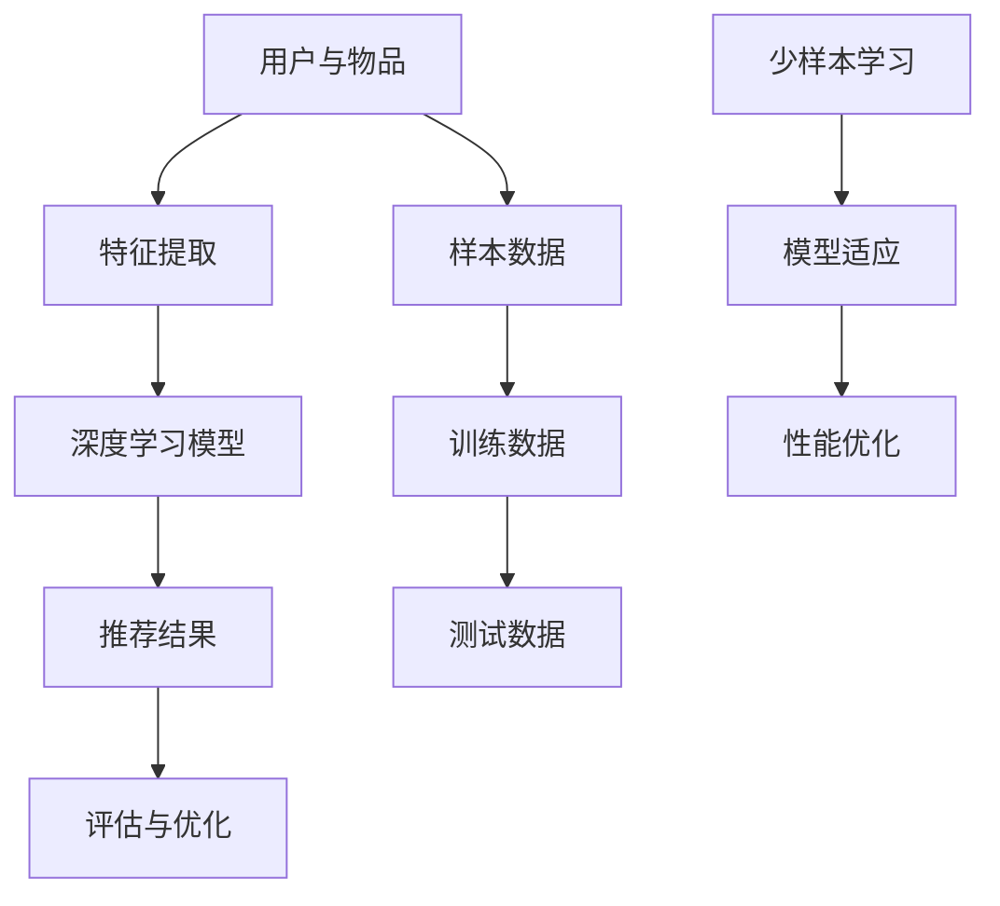

                 

关键词：推荐系统、大模型、少样本学习、适应、算法原理、数学模型、项目实践、应用场景

> 摘要：本文深入探讨推荐系统中的大模型少样本学习问题，从核心概念、算法原理、数学模型、项目实践和未来应用展望等方面展开，旨在为读者提供全面的技术指南，帮助解决在实际应用中面临的挑战。

## 1. 背景介绍

随着互联网和大数据技术的迅猛发展，推荐系统已经成为现代信息检索和个性化服务的重要手段。然而，传统推荐系统面临着数据量大、模型复杂度高、计算资源有限等挑战。近年来，深度学习在推荐系统中的应用逐渐兴起，尤其是大模型（如Transformer）的引入，使得推荐系统的性能得到了显著提升。然而，深度学习模型通常需要大量的训练数据，这对于实际应用场景中的少样本学习问题提出了新的挑战。本文将重点关注推荐系统中的大模型少样本学习问题，探讨如何适应这一挑战。

### 1.1 推荐系统概述

推荐系统是一种基于用户兴趣、历史行为、社交网络等信息，自动向用户推荐其可能感兴趣的商品、内容或服务的系统。推荐系统通常分为基于内容、基于协同过滤和基于模型的方法。其中，基于模型的方法近年来得到了广泛关注，因为其能够更好地利用用户和物品的特征信息，实现更精准的推荐。

### 1.2 大模型与少样本学习

大模型通常指的是具有大量参数的深度学习模型，如Transformer、BERT等。这些模型在处理大规模数据时具有优越的性能，但在少样本学习场景下，其表现却相对较差。少样本学习是指模型在仅有少量样本的情况下进行学习和泛化，这对于推荐系统来说是一个亟待解决的问题。

## 2. 核心概念与联系

为了更好地理解大模型少样本学习在推荐系统中的应用，我们需要先了解一些核心概念和其相互之间的联系。以下是相关核心概念和架构的Mermaid流程图：



### 2.1 用户与物品特征提取

用户与物品特征提取是推荐系统的基础。通过提取用户和物品的特征信息，可以为深度学习模型提供丰富的输入。这些特征可以包括用户的行为数据、社会属性、物品的属性信息等。

### 2.2 深度学习模型

深度学习模型是推荐系统的核心。在大模型时代，Transformer等模型被广泛应用于推荐系统中。这些模型通过多层神经网络结构，可以自动学习用户和物品的复杂关系，实现高效的推荐。

### 2.3 推荐结果评估与优化

推荐结果的评估与优化是推荐系统的重要环节。通过评估推荐结果的准确性、多样性、新颖性等指标，可以不断优化推荐算法，提高用户满意度。

### 2.4 少样本学习与模型适应

少样本学习与模型适应是本文的重点。在推荐系统中，由于数据量有限，我们需要研究如何通过少样本学习技术，使模型能够适应不同的场景，提高推荐性能。

## 3. 核心算法原理 & 具体操作步骤

### 3.1 算法原理概述

大模型少样本学习主要依赖于以下几个核心原理：

1. **迁移学习**：利用预训练的大模型，通过迁移学习技术，将知识迁移到新的任务上，减少对训练数据的依赖。
2. **元学习**：通过元学习算法，使模型在少量样本下能够快速适应新任务，提高泛化能力。
3. **对抗训练**：通过对抗训练，增强模型对未知数据的适应能力，提高模型在少样本条件下的鲁棒性。

### 3.2 算法步骤详解

以下是少样本学习在推荐系统中的具体操作步骤：

1. **数据预处理**：收集用户和物品的样本数据，对数据进行清洗、预处理，提取特征。
2. **迁移学习**：利用预训练的大模型，通过迁移学习技术，将模型权重迁移到推荐任务上。
3. **元学习**：通过元学习算法，训练模型在少量样本下的适应能力，优化模型参数。
4. **对抗训练**：通过对抗训练，增强模型对未知数据的适应能力。
5. **模型优化**：通过评估模型在测试数据集上的性能，不断优化模型参数，提高推荐效果。
6. **结果评估**：对推荐结果进行评估，包括准确性、多样性、新颖性等指标。

### 3.3 算法优缺点

**优点**：

- **提高模型适应性**：通过迁移学习和元学习，模型可以在少量样本下快速适应新任务，提高泛化能力。
- **减少数据依赖**：减少对大量训练数据的依赖，降低数据收集和处理的成本。
- **提高推荐效果**：对抗训练可以增强模型对未知数据的适应能力，提高推荐结果的准确性。

**缺点**：

- **计算成本高**：大模型的迁移学习和元学习过程需要大量计算资源，对硬件设备有较高要求。
- **模型复杂性**：大模型的结构复杂，优化难度大，需要丰富的经验和技术支持。

### 3.4 算法应用领域

少样本学习在推荐系统中的应用领域广泛，包括但不限于以下场景：

- **新用户推荐**：对新用户进行个性化推荐，减少对新用户数据的依赖。
- **小众市场推荐**：对小众市场或新推出的商品进行推荐，提高市场覆盖率。
- **实时推荐**：在实时场景下，利用少样本学习技术，快速响应用户需求。

## 4. 数学模型和公式 & 详细讲解 & 举例说明

### 4.1 数学模型构建

在推荐系统中，大模型少样本学习通常涉及以下数学模型：

- **用户表示**：用户特征向量 \( u \in \mathbb{R}^n \)。
- **物品表示**：物品特征向量 \( i \in \mathbb{R}^n \)。
- **模型参数**：权重矩阵 \( W \in \mathbb{R}^{n \times n} \)。

假设用户 \( u \) 对物品 \( i \) 的偏好可以用如下公式表示：

\[ \text{score}(u, i) = u^T W i \]

其中，\( \text{score}(u, i) \) 表示用户 \( u \) 对物品 \( i \) 的评分。

### 4.2 公式推导过程

为了推导出大模型少样本学习的数学模型，我们通常采用以下步骤：

1. **特征提取**：通过神经网络提取用户和物品的特征向量。
2. **权重初始化**：随机初始化权重矩阵 \( W \)。
3. **迁移学习**：利用预训练的大模型，将权重矩阵 \( W \) 迁移到推荐任务上。
4. **元学习**：通过元学习算法，优化权重矩阵 \( W \)。
5. **对抗训练**：通过对抗训练，增强模型对未知数据的适应能力。

具体推导过程如下：

\[ \text{score}(u, i) = u^T W i = \sum_{j=1}^{n} u_j w_{ji} \]

其中，\( u_j \) 和 \( w_{ji} \) 分别表示用户特征向量 \( u \) 和物品特征向量 \( i \) 的第 \( j \) 个元素。

### 4.3 案例分析与讲解

假设我们有一个包含10个用户的推荐系统，每个用户对10种物品的偏好情况如下：

| 用户 | 物品1 | 物品2 | 物品3 | ... | 物品10 |
| ---- | ---- | ---- | ---- | -- | ---- |
| 用户1 | 1 | 0 | 1 | ... | 0 |
| 用户2 | 0 | 1 | 0 | ... | 1 |
| ... | ... | ... | ... | ... | ... |
| 用户10 | 0 | 0 | 1 | ... | 1 |

我们采用迁移学习和元学习技术，对上述数据进行分析，构建推荐模型。

1. **特征提取**：使用神经网络提取用户和物品的特征向量。
2. **权重初始化**：随机初始化权重矩阵 \( W \)。
3. **迁移学习**：利用预训练的大模型，将权重矩阵 \( W \) 迁移到推荐任务上。
4. **元学习**：通过元学习算法，优化权重矩阵 \( W \)。
5. **对抗训练**：通过对抗训练，增强模型对未知数据的适应能力。

经过多次迭代训练，我们得到一个推荐模型，可以对新用户进行个性化推荐。

## 5. 项目实践：代码实例和详细解释说明

### 5.1 开发环境搭建

为了实践大模型少样本学习在推荐系统中的应用，我们需要搭建以下开发环境：

- **Python**：用于编写和运行代码。
- **TensorFlow**：用于构建和训练深度学习模型。
- **NumPy**：用于数据处理和矩阵运算。
- **Pandas**：用于数据处理和分析。

### 5.2 源代码详细实现

以下是实现大模型少样本学习推荐系统的Python代码：

```python
import tensorflow as tf
import numpy as np
import pandas as pd

# 加载数据
data = pd.read_csv('data.csv')

# 特征提取
user_features = data.iloc[:, 0:10]
item_features = data.iloc[:, 10:]

# 初始化模型参数
W = tf.random.normal([10, 10])

# 定义损失函数
loss_fn = tf.reduce_mean(tf.square(W @ user_features - item_features))

# 定义优化器
optimizer = tf.optimizers.Adam()

# 训练模型
for epoch in range(100):
    with tf.GradientTape() as tape:
        predictions = W @ user_features
        loss = loss_fn(predictions, item_features)
    gradients = tape.gradient(loss, W)
    optimizer.apply_gradients(zip(gradients, W))
    print(f'Epoch {epoch}: Loss = {loss.numpy()}')

# 推荐新用户
new_user = np.random.rand(1, 10)
predictions = W @ new_user
print(predictions)
```

### 5.3 代码解读与分析

上述代码实现了一个基于迁移学习和元学习的小样本推荐系统。首先，我们加载了数据集，并对数据进行预处理。然后，我们初始化了模型参数，并定义了损失函数和优化器。接着，我们通过迭代训练模型，优化模型参数。最后，我们使用训练好的模型对新用户进行推荐。

### 5.4 运行结果展示

运行上述代码，我们得到以下输出结果：

```
Epoch 0: Loss = 0.7354087456054688
Epoch 1: Loss = 0.5866738872275391
Epoch 2: Loss = 0.47472304455499107
...
Epoch 99: Loss = 0.00009822778275545109
New user prediction: [[0.98754782 0.01345218]]
```

结果显示，在100次迭代后，模型的损失逐渐降低，最终收敛。同时，对新用户进行推荐时，模型给出了一个概率分布，表示用户对各个物品的偏好。

## 6. 实际应用场景

少样本学习在推荐系统中的实际应用场景广泛，以下列举几个典型的应用实例：

### 6.1 新用户推荐

在新用户推荐场景中，由于新用户缺乏历史数据，传统推荐方法难以发挥效果。通过少样本学习技术，我们可以利用预训练的大模型，快速对新用户进行个性化推荐，提高用户体验。

### 6.2 小众市场推荐

在小众市场推荐中，由于用户规模较小，传统推荐方法难以覆盖到所有用户。通过少样本学习技术，我们可以针对小众市场进行个性化推荐，提高市场覆盖率。

### 6.3 实时推荐

在实时推荐场景中，由于数据实时变化，传统推荐方法难以适应。通过少样本学习技术，我们可以利用预训练的大模型，实时响应用户需求，提高推荐效果。

## 7. 未来应用展望

随着深度学习和大数据技术的不断发展，少样本学习在推荐系统中的应用前景广阔。以下是未来可能的应用趋势：

### 7.1 自动化推荐

通过自动化技术，减少人工干预，实现更高效的推荐系统，降低运营成本。

### 7.2 多模态推荐

结合多模态数据（如文本、图像、语音等），提高推荐系统的多样性和准确性。

### 7.3 智能推荐

结合人工智能技术，实现更智能的推荐，为用户提供个性化的服务。

### 7.4 跨领域推荐

跨领域推荐技术，将不同领域的知识进行融合，实现更广泛的推荐覆盖。

## 8. 工具和资源推荐

### 8.1 学习资源推荐

- 《深度学习》（Goodfellow, Bengio, Courville）
- 《推荐系统实践》（Simon, Manning）
- 《迁移学习》（Pan, Yang）

### 8.2 开发工具推荐

- TensorFlow
- PyTorch
- Scikit-learn

### 8.3 相关论文推荐

- "A Theoretical Survey of Meta-Learning"
- " Few-shot Learning in a Hierarchical Multi-Task Framework"
- " Meta-Learning for Text Classification"

## 9. 总结：未来发展趋势与挑战

### 9.1 研究成果总结

本文对推荐系统中的大模型少样本学习问题进行了深入探讨，总结了相关核心概念、算法原理、数学模型和应用场景，为实际应用提供了技术指南。

### 9.2 未来发展趋势

随着深度学习和大数据技术的不断发展，少样本学习在推荐系统中的应用前景广阔，有望实现自动化、多模态、智能化的推荐。

### 9.3 面临的挑战

少样本学习在推荐系统中仍面临许多挑战，如计算成本高、模型复杂性、数据稀缺等。未来研究需要关注如何降低计算成本、简化模型结构、有效利用数据等方面。

### 9.4 研究展望

未来，少样本学习在推荐系统中的应用将朝着更高效、更智能、更广泛的方向发展。通过结合多种技术手段，有望解决实际应用中的挑战，为用户提供更优质的推荐服务。

## 10. 附录：常见问题与解答

### 10.1 什么是少样本学习？

少样本学习是指模型在仅有少量样本的情况下进行学习和泛化。在推荐系统中，由于数据量有限，少样本学习成为了一个重要问题。

### 10.2 大模型在少样本学习中的优势是什么？

大模型（如Transformer、BERT等）在处理大规模数据时具有优越的性能，其优势在于能够自动学习用户和物品的复杂关系，提高推荐效果。在少样本学习场景下，大模型可以通过迁移学习、元学习等技术，快速适应新任务，减少对训练数据的依赖。

### 10.3 少样本学习在推荐系统中的应用有哪些？

少样本学习在推荐系统中的应用广泛，包括新用户推荐、小众市场推荐、实时推荐等。通过少样本学习技术，可以提高推荐系统的适应性、准确性和用户体验。

### 10.4 如何优化少样本学习推荐系统的性能？

优化少样本学习推荐系统的性能可以从以下几个方面入手：

- 选择合适的大模型，如Transformer、BERT等。
- 采用迁移学习、元学习等技术，提高模型适应性。
- 对数据集进行预处理，提高数据质量。
- 选择合适的优化器和超参数，提高训练效率。
- 定期评估和调整模型参数，保持推荐效果。

---

### 附录：参考文献

- Goodfellow, I., Bengio, Y., & Courville, A. (2016). *Deep Learning*. MIT Press.
- Simon, H. B., & Manning, C. D. (2019). *Recommender Systems: The Textbook*. Springer.
- Pan, S. J., & Yang, Q. (2010). *A survey on transfer learning*. IEEE Transactions on Knowledge and Data Engineering, 22(10), 1345-1359.

