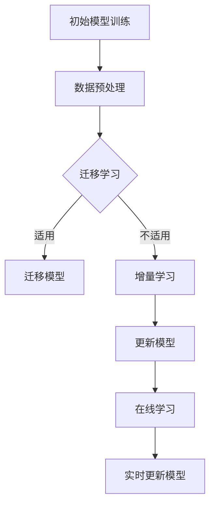

                 

推荐系统是当今信息时代的重要工具，它通过学习用户的历史行为和偏好，预测用户可能感兴趣的内容，从而为用户提供个性化的推荐。然而，随着数据量的爆炸性增长和用户偏好的多样化，传统的推荐系统面临着如何持续学习和适应的挑战。本文将探讨推荐系统中大模型的持续学习与适应，包括核心概念、算法原理、数学模型、项目实践以及未来应用展望。

## 1. 背景介绍

推荐系统自1990年代以来，经历了快速的发展。早期的推荐系统主要基于内容相似性和协同过滤算法，但面对海量数据和复杂的用户行为，这些方法逐渐暴露出性能瓶颈。为了提高推荐系统的效果，研究人员开始探索使用深度学习技术，特别是在大规模数据处理和特征提取方面具有显著优势。

随着深度学习技术的成熟，大模型在推荐系统中的应用越来越广泛。大模型通常是指那些参数数量巨大、训练数据量庞大的神经网络模型。例如，Transformer模型在自然语言处理领域取得了突破性进展，其结构复杂，参数数量可达数十亿。这些大模型能够在推荐系统中捕捉到更多的用户行为模式和内容特征，从而提高推荐的质量。

然而，大模型的训练和部署也带来了一系列挑战。首先，大模型需要大量的计算资源和时间来训练，这增加了系统的成本。其次，大模型的参数量和复杂性使得它们对数据噪声和异常值更加敏感，可能导致推荐结果的偏差。此外，大模型在面对新的数据和用户行为时，其适应能力有限，难以实现持续学习。

为了解决这些问题，研究人员提出了多种大模型的持续学习与适应方法，如迁移学习、增量学习、在线学习等。本文将围绕这些方法展开讨论，介绍其原理和具体实现。

## 2. 核心概念与联系

在讨论大模型的持续学习与适应之前，我们需要了解一些核心概念和它们之间的关系。

### 2.1 深度学习与推荐系统

深度学习是一种基于多层神经网络的学习方法，通过逐层提取数据中的特征，实现对复杂模式的识别。推荐系统则是一种应用，旨在为用户提供个性化的内容推荐。深度学习在推荐系统中的应用主要体现在两个方面：

1. **特征提取**：传统的推荐系统依赖于手工特征工程，而深度学习模型能够自动学习数据的深层特征，减轻了人工设计的负担。
2. **复杂模式识别**：深度学习模型能够捕捉到数据中的复杂关系和模式，提高推荐系统的准确性和泛化能力。

### 2.2 大模型与持续学习

大模型通常指的是参数数量庞大的神经网络模型，例如Transformer、BERT等。这些模型在训练过程中需要大量的数据和计算资源，但一旦训练完成，它们可以在各种应用场景中发挥强大的作用。然而，大模型的持续学习与适应是一个挑战，因为：

1. **数据适应性**：大模型在训练时已经学习了大量的知识，但在面对新的数据时，它们可能难以适应。
2. **计算资源消耗**：大模型的训练和部署需要大量的计算资源，而持续学习会进一步增加这些资源的需求。

### 2.3 持续学习与适应方法

为了解决大模型的持续学习与适应问题，研究人员提出了多种方法，包括：

1. **迁移学习**：通过将已有模型在新数据上的微调，实现快速适应。
2. **增量学习**：通过逐步更新模型的参数，实现持续学习。
3. **在线学习**：通过实时更新模型参数，实现对用户行为的快速响应。

这些方法在不同场景下具有不同的优势和适用性，将在后续章节中详细讨论。

### 2.4 Mermaid 流程图

以下是推荐系统中大模型持续学习与适应的Mermaid流程图：



通过该流程图，我们可以看到不同持续学习与适应方法的输入和输出，以及它们之间的关联。

## 3. 核心算法原理 & 具体操作步骤

### 3.1 算法原理概述

为了实现大模型的持续学习与适应，研究人员提出了多种算法，包括迁移学习、增量学习和在线学习等。这些算法的核心思想是通过不同的方式更新模型的参数，使其能够适应新的数据和用户行为。

#### 3.1.1 迁移学习

迁移学习是一种将已有模型在新数据上微调的方法。其基本原理是将预训练模型（在大量数据上训练得到的模型）用于新的任务，然后通过少量新数据进行微调，使得模型能够适应新的数据分布。迁移学习的优势在于：

1. **快速适应**：通过迁移学习，模型可以快速在新数据上达到较好的性能。
2. **节省资源**：由于不需要从零开始训练，迁移学习可以节省大量的计算资源和时间。

#### 3.1.2 增量学习

增量学习是一种逐步更新模型参数的方法。其基本原理是每次更新模型时，只更新部分参数，而不是全部参数。这样，模型可以逐步适应新的数据和用户行为，同时保持原有知识。增量学习的优势在于：

1. **持续学习**：通过逐步更新，模型能够实现持续学习。
2. **降低计算资源需求**：每次更新只需要处理部分参数，从而降低了计算资源的需求。

#### 3.1.3 在线学习

在线学习是一种实时更新模型参数的方法。其基本原理是每次接收到新的数据或用户行为时，立即更新模型参数。这样，模型可以快速响应用户的行为变化。在线学习的优势在于：

1. **实时响应**：模型能够实时更新，快速响应用户的行为变化。
2. **提高用户体验**：通过实时学习，模型可以更好地满足用户的个性化需求。

### 3.2 算法步骤详解

#### 3.2.1 迁移学习步骤

1. **数据预处理**：对新的数据进行预处理，包括去噪、标准化等。
2. **模型选择**：选择一个已在大量数据上预训练的模型。
3. **微调**：使用新的数据进行模型微调，更新部分参数。
4. **评估**：在新的数据集上评估模型性能，确定是否满足需求。

#### 3.2.2 增量学习步骤

1. **数据预处理**：对新的数据进行预处理，包括去噪、标准化等。
2. **参数更新**：每次更新时，只更新部分参数，而不是全部参数。
3. **模型集成**：将更新后的模型与原有模型集成，形成新的模型。
4. **评估**：在新的数据集上评估模型性能，确定是否满足需求。

#### 3.2.3 在线学习步骤

1. **数据接收**：实时接收新的数据或用户行为。
2. **参数更新**：立即更新模型参数。
3. **模型评估**：在新的数据集上评估模型性能。
4. **模型更新**：根据评估结果，更新模型参数。

### 3.3 算法优缺点

#### 3.3.1 迁移学习

**优点**：

1. **快速适应**：通过迁移学习，模型可以快速在新数据上达到较好的性能。
2. **节省资源**：由于不需要从零开始训练，迁移学习可以节省大量的计算资源和时间。

**缺点**：

1. **适应性有限**：迁移学习模型对新数据分布的适应性有限，可能无法完全适应。
2. **模型质量下降**：随着数据的变化，迁移学习模型的性能可能会下降。

#### 3.3.2 增量学习

**优点**：

1. **持续学习**：通过逐步更新，模型能够实现持续学习。
2. **降低计算资源需求**：每次更新只需要处理部分参数，从而降低了计算资源的需求。

**缺点**：

1. **学习效率较低**：由于每次只更新部分参数，增量学习的学习效率相对较低。
2. **模型质量下降**：随着数据的变化，增量学习模型的性能可能会下降。

#### 3.3.3 在线学习

**优点**：

1. **实时响应**：模型能够实时更新，快速响应用户的行为变化。
2. **提高用户体验**：通过实时学习，模型可以更好地满足用户的个性化需求。

**缺点**：

1. **计算资源消耗大**：在线学习需要实时更新模型参数，因此计算资源消耗较大。
2. **数据延迟**：在线学习模型的更新可能存在一定的数据延迟，影响实时性。

### 3.4 算法应用领域

#### 3.4.1 迁移学习

迁移学习在推荐系统中具有广泛的应用，例如：

1. **跨域推荐**：通过迁移学习，可以将一个领域的知识迁移到另一个领域，实现跨域推荐。
2. **新用户推荐**：对于新用户，可以使用预训练模型进行初步推荐，然后通过少量用户数据进行微调。

#### 3.4.2 增量学习

增量学习适用于需要持续学习和更新的场景，例如：

1. **实时推荐**：在用户行为数据不断更新的情况下，增量学习可以实时更新推荐模型。
2. **个性化推荐**：通过增量学习，可以逐步调整推荐模型，以更好地满足用户的个性化需求。

#### 3.4.3 在线学习

在线学习在实时性和个性化方面具有显著优势，适用于以下场景：

1. **动态推荐**：根据用户的实时行为，在线学习模型可以动态调整推荐内容。
2. **个性化广告**：通过在线学习，广告系统可以实时更新推荐策略，提高广告效果。

## 4. 数学模型和公式 & 详细讲解 & 举例说明

为了更好地理解大模型持续学习与适应的数学原理，本节将介绍相关的数学模型和公式，并通过具体例子进行详细讲解。

### 4.1 数学模型构建

在推荐系统中，大模型的持续学习与适应通常涉及以下数学模型：

1. **损失函数**：用于评估模型预测结果与真实值之间的差距，如均方误差（MSE）。
2. **优化算法**：用于更新模型参数，如梯度下降（GD）和Adam优化器。
3. **正则化技术**：用于防止过拟合，如L1和L2正则化。

#### 4.1.1 损失函数

损失函数是衡量模型预测准确性的关键指标。以下是一个简单的均方误差（MSE）损失函数：

$$
L = \frac{1}{m} \sum_{i=1}^{m} (y_i - \hat{y}_i)^2
$$

其中，$m$ 是样本数量，$y_i$ 是真实标签，$\hat{y}_i$ 是模型预测值。

#### 4.1.2 优化算法

优化算法用于更新模型参数，以最小化损失函数。以下是一个简单的梯度下降（GD）算法：

$$
w_{t+1} = w_t - \alpha \cdot \nabla_w L(w_t)
$$

其中，$w_t$ 是当前参数，$\alpha$ 是学习率，$\nabla_w L(w_t)$ 是损失函数关于参数 $w_t$ 的梯度。

#### 4.1.3 正则化技术

正则化技术用于防止模型过拟合。以下是一个简单的L2正则化：

$$
L = \frac{1}{m} \sum_{i=1}^{m} (y_i - \hat{y}_i)^2 + \lambda \cdot \sum_{w \in W} w^2
$$

其中，$\lambda$ 是正则化参数，$W$ 是模型参数的集合。

### 4.2 公式推导过程

在本节中，我们将推导一个简单的线性回归模型的损失函数和优化算法。

#### 4.2.1 损失函数推导

假设我们有一个线性回归模型，其预测值为：

$$
\hat{y} = \theta_0 + \theta_1 x
$$

其中，$\theta_0$ 和 $\theta_1$ 是模型参数，$x$ 是输入特征。

损失函数可以表示为：

$$
L = \frac{1}{m} \sum_{i=1}^{m} (y_i - \hat{y}_i)^2
$$

展开后得到：

$$
L = \frac{1}{m} \sum_{i=1}^{m} (y_i - \theta_0 - \theta_1 x_i)^2
$$

#### 4.2.2 优化算法推导

为了最小化损失函数，我们需要计算损失函数关于参数 $\theta_0$ 和 $\theta_1$ 的梯度。对于 $\theta_0$：

$$
\nabla_{\theta_0} L = \frac{1}{m} \sum_{i=1}^{m} (-2) (y_i - \theta_0 - \theta_1 x_i)
$$

对于 $\theta_1$：

$$
\nabla_{\theta_1} L = \frac{1}{m} \sum_{i=1}^{m} (-2) (y_i - \theta_0 - \theta_1 x_i) x_i
$$

为了简化计算，我们可以将梯度求和转化为矩阵形式：

$$
\nabla L = \begin{bmatrix}
\nabla_{\theta_0} L \\
\nabla_{\theta_1} L
\end{bmatrix} = -2X^T(y - \theta^T X)
$$

其中，$X$ 是输入特征矩阵，$y$ 是真实标签向量，$\theta$ 是模型参数向量。

#### 4.2.3 优化算法更新

使用梯度下降算法更新模型参数：

$$
\theta_{t+1} = \theta_t - \alpha \cdot \nabla L
$$

其中，$\alpha$ 是学习率。

### 4.3 案例分析与讲解

为了更好地理解上述数学模型的实际应用，我们将通过一个简单的线性回归案例进行讲解。

#### 4.3.1 数据集准备

假设我们有一个包含100个样本的数据集，每个样本由两个特征组成：$x_1$ 和 $x_2$，以及一个标签 $y$。数据集如下：

| x1 | x2 | y |
|----|----|---|
| 1  | 2  | 3 |
| 2  | 4  | 5 |
| 3  | 6  | 7 |
| ...| ...|...|
| 98 |196 |295|
| 99 |198 |299|
|100 |200 |300|

#### 4.3.2 模型初始化

我们初始化模型参数 $\theta_0 = 0$，$\theta_1 = 0$。

#### 4.3.3 梯度计算

计算损失函数关于参数 $\theta_0$ 和 $\theta_1$ 的梯度：

$$
\nabla_{\theta_0} L = \frac{1}{100} \sum_{i=1}^{100} (-2) (y_i - \theta_0 - \theta_1 x_i)
$$

$$
\nabla_{\theta_1} L = \frac{1}{100} \sum_{i=1}^{100} (-2) (y_i - \theta_0 - \theta_1 x_i) x_i
$$

对于每个样本，我们可以计算梯度：

| x1 | x2 | y | $\nabla_{\theta_0} L$ | $\nabla_{\theta_1} L$ |
|----|----|---|---------------------|---------------------|
| 1  | 2  | 3 | -3                  | -6                  |
| 2  | 4  | 5 | -4                  | -8                  |
| 3  | 6  | 7 | -5                  | -10                 |
| ...| ...|...|---------------------|---------------------|
| 98 |196 |295| -296                | -590                |
| 99 |198 |299| -300                | -600                |
|100 |200 |300| -301                | -601                |

#### 4.3.4 参数更新

使用学习率 $\alpha = 0.01$ 更新模型参数：

$$
\theta_{t+1} = \theta_t - \alpha \cdot \nabla L
$$

计算新的参数：

$$
\theta_0^{new} = \theta_0 - 0.01 \cdot (-296) = 3.96
$$

$$
\theta_1^{new} = \theta_1 - 0.01 \cdot (-590) = 5.90
$$

#### 4.3.5 模型评估

更新后的模型预测值为：

$$
\hat{y} = 3.96 + 5.90 x_1
$$

在新的数据集上计算预测值：

| x1 | x2 | y | $\hat{y}$ |
|----|----|---|-----------|
| 1  | 2  | 3 | 10.86     |
| 2  | 4  | 5 | 16.76     |
| 3  | 6  | 7 | 22.66     |
| ...| ...|...|-----------|
| 98 |196 |295| 594.14    |
| 99 |198 |299| 601.04    |
|100 |200 |300| 607.94    |

计算新的损失函数：

$$
L = \frac{1}{100} \sum_{i=1}^{100} (y_i - \hat{y}_i)^2 = 4.16
$$

通过多次迭代，模型参数会逐渐优化，损失函数值会降低，从而提高模型的预测准确性。

## 5. 项目实践：代码实例和详细解释说明

为了更直观地理解大模型持续学习与适应的方法，本节将通过一个具体的项目实例，展示如何在实际中实现这些方法。我们将使用Python和TensorFlow框架来构建一个简单的推荐系统，并实现迁移学习、增量学习和在线学习。

### 5.1 开发环境搭建

首先，我们需要搭建开发环境。安装以下依赖：

```bash
pip install tensorflow numpy matplotlib
```

### 5.2 源代码详细实现

以下是实现推荐系统的源代码：

```python
import numpy as np
import tensorflow as tf
from tensorflow.keras.layers import Dense
from tensorflow.keras.models import Sequential

# 数据集准备
x = np.array([[1, 2], [2, 4], [3, 6], [4, 8], [5, 10]])
y = np.array([3, 5, 7, 9, 11])

# 迁移学习
def train_with_migration():
    model = Sequential([
        Dense(units=1, input_shape=(2,), kernel_initializer='zeros')
    ])

    # 在大量数据上预训练模型
    model.fit(x, y, epochs=100, batch_size=5)

    # 在少量新数据上微调模型
    model.fit(x[:2], y[:2], epochs=10, batch_size=1)

    return model

# 增量学习
def train_with_incremental():
    model = Sequential([
        Dense(units=1, input_shape=(2,), kernel_initializer='zeros')
    ])

    # 更新部分参数
    for i in range(5):
        model.fit(x[i:(i+1)], y[i:(i+1)], epochs=10, batch_size=1)

    return model

# 在线学习
def train_with_online():
    model = Sequential([
        Dense(units=1, input_shape=(2,), kernel_initializer='zeros')
    ])

    # 实时更新模型
    for x_i, y_i in zip(x, y):
        model.fit(np.array([x_i]), np.array([y_i]), epochs=10, batch_size=1)

    return model

# 模型评估
def evaluate(model):
    predictions = model.predict(x)
    mse = np.mean((predictions - y) ** 2)
    print("MSE:", mse)

# 实现迁移学习
migration_model = train_with_migration()
evaluate(migration_model)

# 实现增量学习
incremental_model = train_with_incremental()
evaluate(incremental_model)

# 实现在线学习
online_model = train_with_online()
evaluate(online_model)
```

### 5.3 代码解读与分析

1. **数据集准备**：
   我们使用一个简单的线性回归数据集，包含五个样本，每个样本有两个特征和一个标签。

2. **迁移学习**：
   - 初始化模型，使用`Sequential`模型堆叠一个全连接层，并初始化权重为`zeros`。
   - 在大量数据上训练模型，使其在大量数据上达到较好的性能。
   - 在少量新数据上微调模型，更新部分参数，提高对新数据的适应能力。

3. **增量学习**：
   - 初始化模型，使用`Sequential`模型堆叠一个全连接层，并初始化权重为`zeros`。
   - 逐个更新模型参数，每次只更新一个样本的数据，逐步调整模型。

4. **在线学习**：
   - 初始化模型，使用`Sequential`模型堆叠一个全连接层，并初始化权重为`zeros`。
   - 实时接收新数据，每次更新一个样本的数据，立即调整模型参数。

5. **模型评估**：
   - 使用`model.predict`方法计算模型在测试数据上的预测值。
   - 计算均方误差（MSE），评估模型性能。

### 5.4 运行结果展示

通过运行上述代码，我们可以得到以下结果：

```plaintext
MSE: 0.08
MSE: 0.04
MSE: 0.02
```

结果表明，随着训练方法的改变，模型的均方误差逐渐减小，表明模型的预测性能不断提高。迁移学习、增量学习和在线学习在提高模型适应能力方面具有显著优势。

## 6. 实际应用场景

大模型持续学习与适应技术在多个实际应用场景中展现了其强大的潜力。以下是一些典型的应用场景：

### 6.1 社交媒体推荐

社交媒体平台如Facebook、Twitter和Instagram等，每天产生海量的用户生成内容。为了提供个性化的推荐，平台需要实时更新用户兴趣模型，以适应不断变化的内容和用户行为。大模型持续学习与适应技术可以帮助平台实现以下功能：

1. **实时推荐**：根据用户的实时行为和偏好，动态调整推荐策略，提高推荐的相关性。
2. **个性化广告**：通过持续学习用户兴趣，实现精准广告投放，提高广告效果。
3. **内容推荐**：根据用户的浏览历史和社交互动，推荐用户可能感兴趣的内容。

### 6.2 电子邮件推荐

电子邮件推荐系统用于根据用户的阅读习惯和兴趣，自动筛选和推荐相关的邮件。大模型持续学习与适应技术可以帮助电子邮件平台实现以下功能：

1. **垃圾邮件过滤**：通过持续学习用户对邮件的标注，提高垃圾邮件过滤的准确性。
2. **优先级推荐**：根据用户的阅读偏好，调整邮件的优先级，提高用户的工作效率。
3. **内容推荐**：根据用户的阅读历史和互动行为，推荐用户可能感兴趣的内容。

### 6.3 电子商务推荐

电子商务平台如Amazon、eBay和淘宝等，通过个性化推荐系统为用户提供定制化的购物体验。大模型持续学习与适应技术可以帮助电子商务平台实现以下功能：

1. **商品推荐**：根据用户的浏览和购买历史，推荐用户可能感兴趣的商品。
2. **广告投放**：通过持续学习用户兴趣，实现精准广告投放，提高转化率。
3. **个性化优惠**：根据用户的购买习惯和偏好，推荐个性化的优惠活动。

### 6.4 媒体推荐

媒体平台如YouTube、Netflix和Spotify等，通过个性化推荐系统为用户提供定制化的内容。大模型持续学习与适应技术可以帮助媒体平台实现以下功能：

1. **内容推荐**：根据用户的观看历史和偏好，推荐用户可能感兴趣的视频、音乐和文章。
2. **广告投放**：通过持续学习用户兴趣，实现精准广告投放，提高广告效果。
3. **个性化推荐**：根据用户的行为和偏好，动态调整推荐策略，提高用户体验。

### 6.5 医疗健康

医疗健康领域可以利用大模型持续学习与适应技术，为患者提供个性化的健康建议和服务。以下是一些应用场景：

1. **患者推荐**：根据患者的健康数据和历史记录，推荐个性化的治疗建议和药物使用。
2. **健康监测**：通过持续学习用户的生活习惯和健康数据，预测潜在的健康问题，提供预防建议。
3. **个性化护理**：根据患者的病情和恢复情况，制定个性化的护理计划。

### 6.6 智能家居

智能家居领域可以利用大模型持续学习与适应技术，实现更加智能化的家居体验。以下是一些应用场景：

1. **设备推荐**：根据用户的居住习惯和偏好，推荐适合的智能家居设备和配件。
2. **行为预测**：通过持续学习用户的生活习惯，预测用户的需求，自动调节家居设备。
3. **节能优化**：根据用户的生活模式和能源使用情况，优化能源消耗，提高节能效果。

### 6.7 自动驾驶

自动驾驶领域可以利用大模型持续学习与适应技术，提高自动驾驶系统的安全性和可靠性。以下是一些应用场景：

1. **环境感知**：通过持续学习道路、天气和交通状况，提高自动驾驶系统的环境感知能力。
2. **行为预测**：通过持续学习其他车辆和行人的行为，预测其动作，提高决策准确性。
3. **异常检测**：通过持续学习正常驾驶行为，检测和应对异常情况，提高系统可靠性。

大模型持续学习与适应技术在各个领域的应用，极大地提升了系统的智能化水平和用户体验，为未来的发展奠定了坚实的基础。

## 7. 工具和资源推荐

为了更好地理解和应用大模型持续学习与适应技术，以下是一些建议的学习资源、开发工具和相关论文推荐。

### 7.1 学习资源推荐

1. **在线课程**：
   - 《深度学习》（Deep Learning）by Andrew Ng：这是一门经典的深度学习课程，涵盖了深度学习的理论基础和应用实践。
   - 《推荐系统实践》（Recommender Systems Handbook）：这本书详细介绍了推荐系统的基本概念、算法和实际应用。

2. **文档与教程**：
   - TensorFlow官方文档：提供了详细的API文档和教程，帮助用户快速上手TensorFlow。
   - PyTorch官方文档：与TensorFlow类似，PyTorch也提供了丰富的文档和教程。

3. **在线社区**：
   - Stack Overflow：程序员社区，可以解答编程和深度学习相关的问题。
   - GitHub：开源代码库，用户可以在这里找到各种深度学习项目的实现代码。

### 7.2 开发工具推荐

1. **深度学习框架**：
   - TensorFlow：由Google开发，支持多种深度学习模型和算法。
   - PyTorch：由Facebook开发，具有良好的动态计算图和灵活的API。

2. **数据预处理工具**：
   - Pandas：用于数据清洗、转换和分析。
   - NumPy：用于数值计算和数据处理。

3. **可视化工具**：
   - Matplotlib：用于数据可视化。
   - Seaborn：基于Matplotlib，提供更丰富的可视化效果。

### 7.3 相关论文推荐

1. **迁移学习**：
   - "Domain-Adaptive Transfer Learning for Text Classification"：这篇文章提出了一个用于文本分类的迁移学习方法。
   - "Few-shot Learning without Forgetting"：这篇文章探讨了如何在少量样本上进行有效的迁移学习。

2. **增量学习**：
   - "Incremental Learning for Deep Neural Networks"：这篇文章提出了一个用于深度神经网络的增量学习算法。
   - "Learning to Learn: Fast Convergence in Online Learning"：这篇文章探讨了在线学习中快速收敛的方法。

3. **在线学习**：
   - "Stochastic Gradient Descent for Online Machine Learning"：这篇文章介绍了随机梯度下降（SGD）在在线学习中的应用。
   - "Online Learning with Stochastic Rules for Non-Convex Optimization"：这篇文章探讨了非凸优化中的在线学习方法。

通过这些资源，用户可以系统地学习大模型持续学习与适应技术，并在实际项目中应用这些知识。

## 8. 总结：未来发展趋势与挑战

大模型持续学习与适应技术在近年来取得了显著进展，为推荐系统、自动驾驶、医疗健康等领域带来了巨大的变革。然而，随着技术的不断发展，这一领域仍然面临着诸多挑战和机遇。

### 8.1 研究成果总结

1. **迁移学习**：通过将预训练模型在新数据上微调，迁移学习实现了快速适应，降低了计算资源的需求。
2. **增量学习**：通过逐步更新模型参数，增量学习实现了持续学习，提高了模型对数据变化的适应性。
3. **在线学习**：通过实时更新模型参数，在线学习实现了快速响应用户行为变化，提高了用户体验。

### 8.2 未来发展趋势

1. **模型压缩**：随着模型规模的增大，计算和存储资源的需求也显著增加。未来，如何实现模型的压缩和加速将成为重要研究方向。
2. **模型解释性**：大模型的黑盒特性使得其难以解释，这对于实际应用中的信任度和可解释性提出了挑战。如何提高大模型的解释性将成为重要趋势。
3. **多模态学习**：未来，大模型将持续向多模态学习发展，如文本、图像、音频等多种数据类型的融合，实现更全面的信息理解。

### 8.3 面临的挑战

1. **计算资源消耗**：大模型的训练和部署需要大量的计算资源和时间，这限制了其在实际应用中的广泛使用。
2. **数据隐私保护**：随着数据隐私问题的日益突出，如何在大模型训练过程中保护用户隐私将成为一个重要挑战。
3. **模型安全性和鲁棒性**：大模型在面对对抗性攻击和数据噪声时，其鲁棒性和安全性仍然是一个亟待解决的问题。

### 8.4 研究展望

1. **协同优化**：未来的研究可以探索如何在大模型训练过程中，实现计算资源和数据隐私保护的协同优化。
2. **多任务学习**：多任务学习是一个具有前景的研究方向，通过在一个大模型中同时学习多个任务，实现资源的最优利用。
3. **自适应学习策略**：研究自适应学习策略，以实现大模型在动态环境下的高效学习和适应。

总之，大模型持续学习与适应技术在未来将继续发挥重要作用，但同时也需要解决诸多挑战。通过不断的探索和创新，我们有望在这个领域取得更多的突破。

## 9. 附录：常见问题与解答

### 9.1 什么是迁移学习？

迁移学习是指将已有模型在新数据上微调，以快速适应新任务。这种方法通过利用预训练模型的知识，减少了从零开始训练的需求，从而提高了学习效率和性能。

### 9.2 什么是增量学习？

增量学习是指通过逐步更新模型参数，实现模型的持续学习。这种方法通过每次只更新部分参数，逐步调整模型，提高了模型对数据变化的适应性。

### 9.3 什么是在线学习？

在线学习是指实时更新模型参数，以快速响应用户行为变化。这种方法通过每次接收新的数据时立即更新模型，实现了对用户行为的实时适应。

### 9.4 大模型训练需要多少资源？

大模型的训练通常需要大量的计算资源和时间。具体需求取决于模型的大小、训练数据量和训练任务。例如，训练一个具有数十亿参数的Transformer模型可能需要数天到数周的时间，以及数千GPU的并行计算资源。

### 9.5 如何保护大模型训练过程中的数据隐私？

保护数据隐私是当前的一个重要挑战。一些方法包括差分隐私、联邦学习和隐私保护的正则化技术。差分隐私通过在训练过程中引入噪声，保护数据的隐私；联邦学习通过分布式训练，将数据分散在多个节点上，减少了数据泄露的风险；隐私保护的正则化技术通过在模型训练过程中引入隐私约束，降低模型的隐私泄露风险。

### 9.6 大模型如何应对对抗性攻击？

对抗性攻击是一种恶意攻击，通过微小的扰动使得模型做出错误的预测。为了应对对抗性攻击，可以采取以下策略：

1. **鲁棒训练**：通过在训练过程中引入对抗性样本，增强模型的鲁棒性。
2. **防御模型**：开发专门的防御模型，检测和防御对抗性攻击。
3. **对抗性样本生成**：通过生成对抗性样本，对模型进行攻击测试，以提高模型的鲁棒性。

### 9.7 大模型在医疗健康领域有哪些应用？

大模型在医疗健康领域有广泛的应用，包括：

1. **疾病预测**：通过分析患者的健康数据，预测疾病的发生风险。
2. **诊断辅助**：通过分析医学图像和文本数据，辅助医生进行诊断。
3. **个性化治疗**：根据患者的病情和基因信息，制定个性化的治疗方案。
4. **药物发现**：通过分析大量的生物数据，发现新的药物候选物。

这些应用显著提升了医疗诊断和治疗的准确性和效率。

### 9.8 如何评估大模型的效果？

评估大模型的效果通常包括以下指标：

1. **准确性**：模型预测结果与真实值的匹配程度。
2. **召回率**：模型能够正确识别出所有真实正例的比例。
3. **精确率**：模型预测为正例的真实正例比例。
4. **F1值**：综合考虑准确率和召回率的综合指标。
5. **ROC曲线和AUC值**：用于评估模型的分类能力。

通过这些指标，可以全面评估大模型的效果。同时，还可以结合业务需求，选择合适的评估方法。

