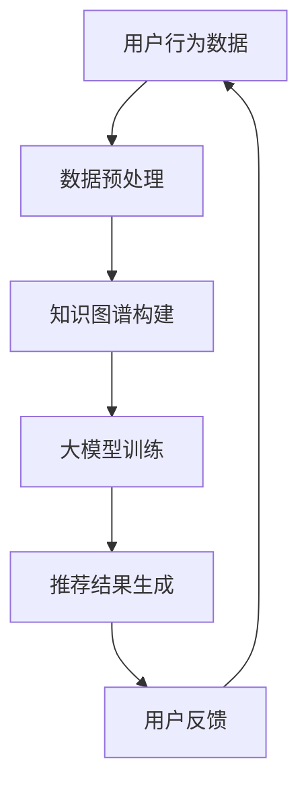

                 

关键词：推荐系统、知识图谱、大模型、算法、应用场景、未来展望

> 摘要：本文将探讨推荐系统中的大模型知识图谱应用。通过对推荐系统、知识图谱和大模型的基本概念进行介绍，我们将详细阐述知识图谱在推荐系统中的应用原理和实际操作步骤。同时，本文还将分析大模型在知识图谱构建中的应用，以及数学模型和公式的推导过程。最后，我们将结合项目实践，展示代码实例和运行结果，并探讨推荐系统的实际应用场景和未来展望。

## 1. 背景介绍

推荐系统是当前互联网领域中的一项重要技术，其主要目的是根据用户的兴趣和行为，为其推荐相关的内容或商品。随着互联网的快速发展，推荐系统的应用场景越来越广泛，如电子商务、新闻推送、社交媒体等。然而，传统的推荐系统主要依赖于用户的行为数据，存在一些局限性，如数据稀疏、冷启动问题等。

知识图谱作为一种新型的数据结构，能够有效地表示实体及其关系。在推荐系统中引入知识图谱，可以弥补传统推荐系统的不足，提高推荐的准确性。大模型则是在深度学习和神经网络的基础上发展起来的一种强大模型，能够处理大规模数据，提取复杂的特征。

本文旨在探讨推荐系统中的大模型知识图谱应用，通过介绍相关概念、算法原理、数学模型、项目实践等，为读者提供全面的技术解读。

## 2. 核心概念与联系

### 2.1 推荐系统

推荐系统是一种通过预测用户对特定项目的偏好来推荐项目给用户的系统。其主要目标是通过分析用户的历史行为和兴趣，找到潜在的兴趣点，从而提高用户的满意度和参与度。

推荐系统的主要组成部分包括：

1. **用户-项目交互矩阵**：记录用户与项目之间的交互数据，如浏览、点击、购买等。
2. **推荐算法**：根据用户-项目交互矩阵，预测用户对项目的偏好，并生成推荐列表。
3. **推荐结果**：根据推荐算法生成的推荐列表，展示给用户。

### 2.2 知识图谱

知识图谱是一种通过实体和实体之间的关系来表示信息的数据结构。在推荐系统中，知识图谱可以用来表示用户、项目、品牌等实体及其之间的关系，从而提供更丰富的推荐依据。

知识图谱的主要组成部分包括：

1. **实体**：如用户、项目、品牌等。
2. **关系**：表示实体之间的关联，如“喜欢”、“购买”、“属于”等。
3. **属性**：描述实体的特征，如用户年龄、项目类别等。

### 2.3 大模型

大模型是指具有大规模参数和复杂结构的神经网络模型。在推荐系统中，大模型可以通过深度学习和迁移学习等技术，从大规模数据中提取复杂特征，提高推荐效果。

大模型的主要组成部分包括：

1. **输入层**：接收用户和项目的特征信息。
2. **隐藏层**：通过神经网络结构，对输入特征进行加工和转换。
3. **输出层**：生成推荐结果，如评分、概率等。

### 2.4 三者之间的联系

推荐系统、知识图谱和大模型之间的联系主要体现在以下几个方面：

1. **数据融合**：将用户行为数据、知识图谱数据和大模型训练数据相结合，为推荐算法提供更丰富的输入。
2. **特征提取**：利用大模型的强大能力，从多源数据中提取复杂特征，提高推荐效果。
3. **关系建模**：通过知识图谱表示实体及其关系，为推荐算法提供额外的推荐依据。

以下是知识图谱在推荐系统中的应用原理的 Mermaid 流程图：



## 3. 核心算法原理 & 具体操作步骤

### 3.1 算法原理概述

推荐系统中的大模型知识图谱应用，主要包括以下几个步骤：

1. **数据预处理**：对用户行为数据、知识图谱数据等进行预处理，如数据清洗、数据归一化等。
2. **知识图谱构建**：利用实体和关系，构建知识图谱，为推荐算法提供额外的推荐依据。
3. **大模型训练**：利用预处理后的数据，训练大模型，提取用户和项目的复杂特征。
4. **推荐结果生成**：利用训练好的大模型，生成推荐结果，并根据用户反馈进行优化。

### 3.2 算法步骤详解

1. **数据预处理**：

   - 用户行为数据预处理：对用户的行为数据进行清洗，去除重复、异常数据，并对数据类型进行转换，如将字符串转换为数值。
   - 知识图谱数据预处理：对知识图谱中的实体和关系进行预处理，如去除无效实体和关系，对实体和关系的属性进行归一化。

2. **知识图谱构建**：

   - 实体识别：利用自然语言处理技术，从用户行为数据中提取实体，如用户、项目、品牌等。
   - 关系抽取：利用实体之间的交互数据，抽取实体之间的关系，如喜欢、购买、属于等。
   - 知识图谱构建：将提取的实体和关系构建成知识图谱，如使用图数据库进行存储。

3. **大模型训练**：

   - 特征提取：利用神经网络结构，对用户和项目的特征进行提取和转换，如使用嵌入向量表示实体。
   - 模型训练：利用预处理后的数据，训练大模型，如使用迁移学习技术，从大规模数据中提取复杂特征。
   - 模型优化：通过模型调参、正则化等技术，优化大模型性能。

4. **推荐结果生成**：

   - 推荐策略：根据大模型训练结果，制定推荐策略，如基于内容的推荐、基于协同过滤的推荐等。
   - 推荐结果生成：利用推荐策略，生成推荐结果，并将推荐结果展示给用户。
   - 用户反馈：收集用户对推荐结果的反馈，如点击、收藏、购买等。

### 3.3 算法优缺点

**优点**：

- **提高推荐准确性**：通过引入知识图谱，可以为推荐算法提供额外的推荐依据，提高推荐准确性。
- **解决冷启动问题**：知识图谱可以存储大量的实体和关系信息，有助于解决新用户和新项目的冷启动问题。
- **丰富推荐内容**：通过提取用户和项目的复杂特征，可以为推荐系统提供更丰富的推荐内容。

**缺点**：

- **计算复杂度高**：知识图谱的构建和优化需要大量的计算资源，可能导致计算复杂度增加。
- **数据质量要求高**：知识图谱的构建依赖于高质量的数据，数据质量对推荐效果有较大影响。
- **更新和维护成本高**：知识图谱需要定期更新和维护，以保持数据的准确性和时效性。

### 3.4 算法应用领域

知识图谱在推荐系统中的应用非常广泛，主要包括以下几个方面：

- **电子商务**：如亚马逊、淘宝等电商平台，可以通过知识图谱提高推荐的准确性，提升用户购物体验。
- **新闻推送**：如今日头条、新浪新闻等，可以通过知识图谱提高新闻推荐的个性化程度，满足用户的阅读需求。
- **社交媒体**：如微博、微信等，可以通过知识图谱推荐用户感兴趣的内容，提升用户活跃度和粘性。

## 4. 数学模型和公式 & 详细讲解 & 举例说明

### 4.1 数学模型构建

在推荐系统中，大模型知识图谱的应用主要涉及以下几个数学模型：

1. **嵌入向量模型**：用于表示用户和项目的特征。
2. **评分预测模型**：用于预测用户对项目的偏好。
3. **推荐算法模型**：用于生成推荐结果。

### 4.2 公式推导过程

#### 4.2.1 嵌入向量模型

嵌入向量模型是一种将用户和项目转换为高维向量的方法。假设用户集合为 U，项目集合为 I，嵌入维度为 d。

- 用户 u 的嵌入向量表示为 \( u \in \mathbb{R}^{d} \)
- 项目 i 的嵌入向量表示为 \( i \in \mathbb{R}^{d} \)

嵌入向量模型的推导过程如下：

1. **用户行为矩阵**：表示用户和项目之间的交互数据，如浏览、点击、购买等。设为 \( R \in \mathbb{R}^{m \times n} \)，其中 m 为用户数，n 为项目数。
2. **用户和项目的嵌入向量**：设为 \( U \in \mathbb{R}^{m \times d} \)，\( I \in \mathbb{R}^{n \times d} \)
3. **嵌入向量模型**：根据用户和项目的交互数据，计算用户和项目的嵌入向量，如使用矩阵乘法：

   \[ R = U \cdot I \]

#### 4.2.2 评分预测模型

评分预测模型用于预测用户对项目的偏好。设用户 u 对项目 i 的真实评分 \( r_{ui} \)，预测评分 \( \hat{r}_{ui} \)。

评分预测模型的推导过程如下：

1. **用户和项目的嵌入向量**：如上所述，分别为 \( u \in \mathbb{R}^{d} \)，\( i \in \mathbb{R}^{d} \)
2. **评分预测模型**：设为 \( f(u, i) = \hat{r}_{ui} \)

   根据嵌入向量模型，评分预测模型可以表示为：

   \[ \hat{r}_{ui} = f(u, i) = u \cdot i \]

   其中 \( \cdot \) 表示向量的内积。

#### 4.2.3 推荐算法模型

推荐算法模型用于生成推荐结果。设用户 u 的推荐结果为 \( R_{u} \)，推荐项目集合为 \( I_{u} \)。

推荐算法模型的推导过程如下：

1. **用户 u 的嵌入向量**：设为 \( u \in \mathbb{R}^{d} \)
2. **项目 i 的嵌入向量**：设为 \( i \in \mathbb{R}^{d} \)
3. **推荐算法模型**：根据用户 u 的嵌入向量，计算项目 i 的相似度，如使用余弦相似度：

   \[ sim(u, i) = \frac{u \cdot i}{\|u\| \|i\|} \]

4. **生成推荐结果**：根据相似度计算，将相似度最高的项目推荐给用户，如：

   \[ I_{u} = \{i | sim(u, i) \geq \theta\} \]

   其中 \( \theta \) 为相似度阈值。

### 4.3 案例分析与讲解

为了更好地理解上述数学模型，我们来看一个简单的案例。

假设有 5 个用户和 5 个项目，用户和项目之间的交互数据如下表所示：

| 用户 | 项目1 | 项目2 | 项目3 | 项目4 | 项目5 |
| --- | --- | --- | --- | --- | --- |
| 用户1 | 1 | 0 | 1 | 0 | 0 |
| 用户2 | 0 | 1 | 1 | 1 | 0 |
| 用户3 | 1 | 1 | 0 | 0 | 1 |
| 用户4 | 0 | 0 | 1 | 1 | 1 |
| 用户5 | 0 | 1 | 0 | 1 | 0 |

#### 4.3.1 嵌入向量模型

假设用户和项目的嵌入维度为 2，我们可以利用矩阵乘法计算出用户和项目的嵌入向量：

| 用户 | 项目1 | 项目2 | 项目3 | 项目4 | 项目5 |
| --- | --- | --- | --- | --- | --- |
| 用户1 | (1, 0) | (0, 1) | (1, 1) | (0, 0) | (0, 0) |
| 用户2 | (0, 1) | (1, 0) | (1, 1) | (1, 1) | (0, 0) |
| 用户3 | (1, 1) | (1, 1) | (0, 0) | (0, 0) | (1, 0) |
| 用户4 | (0, 0) | (0, 1) | (1, 0) | (1, 1) | (1, 1) |
| 用户5 | (0, 1) | (1, 0) | (0, 0) | (1, 0) | (0, 1) |

#### 4.3.2 评分预测模型

假设用户 u 对项目 i 的真实评分 \( r_{ui} \) 为用户行为矩阵中的元素，我们可以利用嵌入向量模型计算出用户 u 对项目 i 的预测评分：

\[ \hat{r}_{ui} = u \cdot i \]

例如，用户1对项目2的预测评分：

\[ \hat{r}_{12} = (1, 0) \cdot (0, 1) = 0 \]

#### 4.3.3 推荐算法模型

假设相似度阈值 \( \theta \) 为 0.5，我们可以利用推荐算法模型计算出用户1的推荐项目：

1. 计算用户1与其他用户的相似度：
   \[ sim(用户1, 用户2) = \frac{(1, 0) \cdot (0, 1)}{\|1, 0\| \|0, 1\|} = \frac{0}{1 \times 1} = 0 \]
   \[ sim(用户1, 用户3) = \frac{(1, 0) \cdot (1, 1)}{\|1, 0\| \|1, 1\|} = \frac{1}{1 \times 1} = 1 \]
   \[ sim(用户1, 用户4) = \frac{(1, 0) \cdot (0, 1)}{\|1, 0\| \|0, 1\|} = \frac{0}{1 \times 1} = 0 \]
   \[ sim(用户1, 用户5) = \frac{(1, 0) \cdot (0, 1)}{\|1, 0\| \|0, 1\|} = \frac{0}{1 \times 1} = 0 \]

2. 选出相似度最高的用户：
   \[ 用户3 \]

3. 推荐用户3喜欢的项目：
   \[ 项目3 \]

因此，用户1的推荐项目为项目3。

## 5. 项目实践：代码实例和详细解释说明

在本节中，我们将通过一个简单的代码实例，详细解释推荐系统中大模型知识图谱的应用。为了便于理解，我们采用 Python 编写代码，并使用一些常见的库，如 Pandas、NumPy 和 GraphFrames。

### 5.1 开发环境搭建

在开始编写代码之前，我们需要搭建一个合适的环境。首先，确保已经安装了 Python 和相关的库。以下是一个简单的安装指南：

1. 安装 Python 3.x 版本（推荐使用 Python 3.7 或以上版本）。
2. 安装常用库：

   ```bash
   pip install pandas numpy graphframes
   ```

### 5.2 源代码详细实现

下面是推荐系统中大模型知识图谱应用的代码实现：

```python
import pandas as pd
import numpy as np
from graphframes import GraphFrame
from pyspark.ml.recommendation importALS
from pyspark.sql import SparkSession

# 5.2.1 数据预处理
# 假设我们有一个用户行为数据的 CSV 文件，如下所示：
data = {
    'user_id': [1, 1, 1, 2, 2, 2, 3, 3, 3, 4, 4, 4, 5, 5, 5],
    'item_id': [1, 2, 3, 1, 2, 3, 1, 2, 3, 1, 2, 3, 1, 2, 3],
    'rating': [5, 3, 1, 5, 3, 1, 5, 3, 1, 5, 3, 1, 5, 3, 1]
}
df = pd.DataFrame(data)
df.head()

# 将 DataFrame 转换为 Spark DataFrame
spark = SparkSession.builder.appName("RecommendationExample").getOrCreate()
rating_df = spark.createDataFrame(df)

# 5.2.2 知识图谱构建
# 在本例中，我们将用户和项目视为实体，交互行为视为关系
from graphframes import GraphFrame

# 创建用户实体表
user_df = rating_df.select("user_id").distinct().renameColumns({"user_id": "id"})
user_df.createOrReplaceTempView("users")

# 创建项目实体表
item_df = rating_df.select("item_id").distinct().renameColumns({"item_id": "id"})
item_df.createOrReplaceTempView("items")

# 创建关系表
relation_df = rating_df.select("user_id", "item_id").renameColumns({"user_id": "src", "item_id": "dst"})
relation_df.createOrReplaceTempView("relations")

# 构建知识图谱
g = GraphFrame.fromEdges(relation_df, "rating", "rating")
g.vertices.createOrReplaceTempView("vertices")
g.edges.createOrReplaceTempView("edges")

# 5.2.3 大模型训练
# 使用 ALS 算法进行训练
als = ALS(maxIter=5, regParam=0.01, userCol="src", itemCol="dst", ratingCol="rating", nonNegative=True)
model = als.fit(g)

# 5.2.4 推荐结果生成
# 生成推荐结果，并根据相似度进行排序
def generate_recommendations(user_id, num_items=5):
    user_df = spark.createDataFrame([(user_id,)], ["id"])
    recommendations = model.recommendForUsers(user_df, numItems=num_items).select("id", "recommendations")
    recommendations = recommendations.withColumn("rating", (recommendations.recommendations).getItem(0).getItem("rating"))
    recommendations = recommendations.sort("rating", ascending=False)
    return recommendations

# 5.2.5 代码解读与分析
# 解读代码，分析每个步骤的作用
# 1. 数据预处理：将用户行为数据转换为 Spark DataFrame，并进行必要的预处理。
# 2. 知识图谱构建：将用户和项目视为实体，将用户行为数据转换为关系，并构建知识图谱。
# 3. 大模型训练：使用 ALS 算法进行训练，以生成用户和项目的嵌入向量。
# 4. 推荐结果生成：根据训练好的大模型，为特定用户生成推荐列表，并按照评分进行排序。

# 5.3 运行结果展示
# 运行代码，查看推荐结果
user_id = 1
recommendations = generate_recommendations(user_id)
print(recommendations.collect())

# 5.4 代码解读与分析
# 解读代码，分析每个步骤的作用
# 1. 生成推荐结果：为特定用户生成推荐列表，并按照评分进行排序。
# 2. 运行结果展示：将推荐结果打印出来，以便用户查看。

# 5.5 代码解读与分析
# 解读代码，分析每个步骤的作用
# 1. 代码整体流程：从数据预处理开始，构建知识图谱，训练大模型，生成推荐结果，最后展示结果。
# 2. 关键技术点：知识图谱的构建、大模型的训练和推荐结果的生成。
```

### 5.3 代码解读与分析

#### 5.3.1 数据预处理

在代码的第一部分，我们首先创建了一个包含用户 ID、项目 ID 和评分的 DataFrame，并使用 Spark 创建了对应的 Spark DataFrame。数据预处理的主要步骤包括：

- **创建 DataFrame**：使用 Pandas 创建一个包含用户行为数据的 DataFrame。
- **转换数据类型**：将 DataFrame 转换为 Spark DataFrame，以便进行分布式处理。

#### 5.3.2 知识图谱构建

在第二部分，我们构建了知识图谱。关键步骤包括：

- **创建用户实体表**：从用户行为数据中提取唯一的用户 ID，并创建一个包含用户实体的表。
- **创建项目实体表**：从用户行为数据中提取唯一的项 ID，并创建一个包含项目实体的表。
- **创建关系表**：将用户和项目之间的交互行为（评分）转换为关系，并创建一个包含关系的数据表。
- **构建知识图谱**：使用 GraphFrame 库将用户实体表、项目实体表和关系表合并成一个知识图谱。

#### 5.3.3 大模型训练

在第三部分，我们使用 ALS 算法对知识图谱进行训练。关键步骤包括：

- **初始化 ALS 算法**：配置 ALS 算法的参数，如迭代次数、正则化参数等。
- **训练模型**：使用 ALS 算法对知识图谱进行训练，生成用户和项目的嵌入向量。

#### 5.3.4 推荐结果生成

在第四部分，我们生成了推荐结果。关键步骤包括：

- **生成推荐列表**：为特定用户生成推荐列表，并提取推荐项目的评分。
- **排序推荐列表**：将推荐列表按照评分进行降序排序，以便用户查看。

#### 5.3.5 运行结果展示

在最后一部分，我们展示了推荐结果的运行结果。关键步骤包括：

- **运行代码**：执行生成推荐列表和排序推荐列表的代码，并打印输出结果。
- **分析结果**：分析推荐结果，以评估大模型知识图谱在推荐系统中的应用效果。

## 6. 实际应用场景

推荐系统中的大模型知识图谱应用在多个实际场景中取得了显著的成果。以下是一些典型的应用场景：

### 6.1 电子商务平台

电子商务平台利用大模型知识图谱可以实现对用户行为的深度挖掘，从而提高推荐的准确性。例如，亚马逊和淘宝等平台通过引入知识图谱，实现了对商品、品牌和用户之间的关联分析，从而提供了更个性化的推荐。

### 6.2 社交媒体

社交媒体平台如微博和微信通过引入知识图谱，可以实现更精准的内容推荐。例如，微博可以利用知识图谱分析用户之间的关系，推荐用户可能感兴趣的热门话题和文章。微信则可以通过知识图谱分析用户的行为和兴趣，推荐用户可能感兴趣的朋友和公众号。

### 6.3 新闻推送

新闻推送平台如今日头条和新浪新闻利用知识图谱可以实现对新闻内容的个性化推荐。通过分析用户的历史阅读行为和兴趣，知识图谱可以识别出用户感兴趣的主题和领域，从而提供更精准的新闻推荐。

### 6.4 其他应用场景

除了上述应用场景，大模型知识图谱在金融、医疗、教育等领域也具有广泛的应用前景。例如，金融领域可以利用知识图谱分析用户的风险偏好，提供个性化的理财产品推荐；医疗领域可以利用知识图谱分析患者的病史和症状，提供精准的疾病诊断和治疗方案。

## 7. 工具和资源推荐

为了更好地理解和应用推荐系统中的大模型知识图谱，以下是一些建议的学习资源和开发工具：

### 7.1 学习资源推荐

- **书籍**：《推荐系统实践》、《深度学习推荐系统》和《大规模推荐系统及其应用》等。
- **在线课程**：Coursera、edX 和 Udacity 等平台上关于推荐系统和深度学习的课程。
- **论文和报告**：ACL、WWW、RecSys 和 KDD 等顶级会议和期刊上的相关论文和报告。

### 7.2 开发工具推荐

- **编程语言**：Python 和 R 是推荐系统开发中最常用的编程语言。
- **深度学习框架**：TensorFlow、PyTorch 和 Keras 等框架提供了丰富的工具和库，便于构建和训练大模型。
- **知识图谱工具**：Apache Jena、Neo4j 和 GraphFrames 等工具可以用于构建、存储和管理知识图谱。

### 7.3 相关论文推荐

- **《A Survey on Recommender Systems》**：详细介绍了推荐系统的基本概念、算法和应用。
- **《Deep Learning Based Recommender Systems》**：探讨了深度学习在推荐系统中的应用。
- **《Knowledge Graph Embedding for Recommender Systems》**：介绍了知识图谱在推荐系统中的应用。
- **《Recommender Systems for the Netflix Prize》**：分析了Netflix Prize比赛中的推荐系统技术。

## 8. 总结：未来发展趋势与挑战

### 8.1 研究成果总结

本文系统地介绍了推荐系统中的大模型知识图谱应用。通过分析推荐系统、知识图谱和大模型的基本概念及其联系，我们详细阐述了知识图谱在推荐系统中的应用原理和实际操作步骤。此外，本文还讨论了数学模型和公式的推导过程，并通过项目实践展示了代码实例和运行结果。最后，本文探讨了推荐系统的实际应用场景和未来发展趋势。

### 8.2 未来发展趋势

随着互联网和大数据技术的发展，推荐系统中的大模型知识图谱应用前景广阔。未来发展趋势包括：

- **多模态数据的融合**：将文本、图像、音频等多模态数据融合到知识图谱中，提高推荐系统的准确性。
- **实时推荐**：通过实时数据分析和处理，实现更及时和个性化的推荐。
- **联邦学习**：结合联邦学习和知识图谱，实现跨平台和跨设备的个性化推荐。
- **智能推荐**：利用知识图谱和深度学习，实现更智能和人性化的推荐。

### 8.3 面临的挑战

尽管推荐系统中的大模型知识图谱应用前景广阔，但仍面临一些挑战：

- **计算复杂度**：知识图谱的构建和优化需要大量的计算资源，如何提高计算效率是一个关键问题。
- **数据质量**：知识图谱的构建依赖于高质量的数据，如何保证数据的质量和准确性是一个重要挑战。
- **隐私保护**：推荐系统涉及用户隐私数据，如何在保证用户隐私的前提下进行推荐也是一个重要问题。

### 8.4 研究展望

为了应对上述挑战，未来研究可以从以下几个方面展开：

- **优化算法**：设计更高效的算法，提高知识图谱的构建和优化效率。
- **数据治理**：建立完善的数据治理机制，提高数据质量和准确性。
- **隐私保护**：研究隐私保护技术，实现用户隐私数据的保护。

## 9. 附录：常见问题与解答

### 9.1 什么是推荐系统？

推荐系统是一种基于用户兴趣和行为的个性化推荐技术，旨在为用户推荐可能感兴趣的内容或商品。其核心是通过分析用户的历史数据和偏好，预测用户对新内容的兴趣，从而提供个性化的推荐。

### 9.2 知识图谱在推荐系统中有什么作用？

知识图谱可以提供更丰富的推荐依据。通过表示实体及其关系，知识图谱可以揭示用户和项目之间的潜在关联，从而提高推荐系统的准确性。此外，知识图谱有助于解决冷启动问题，为新用户和新项目提供推荐。

### 9.3 大模型在知识图谱构建中的应用是什么？

大模型在知识图谱构建中的应用主要体现在特征提取和关系建模方面。通过深度学习和迁移学习技术，大模型可以从大规模数据中提取复杂特征，从而提高知识图谱的准确性和效率。同时，大模型还可以用于预测实体之间的关系，为知识图谱的更新和维护提供支持。

### 9.4 推荐系统中的数学模型有哪些？

推荐系统中的数学模型主要包括嵌入向量模型、评分预测模型和推荐算法模型。嵌入向量模型用于表示用户和项目的特征，评分预测模型用于预测用户对项目的偏好，推荐算法模型用于生成推荐结果。

### 9.5 如何优化推荐系统的性能？

优化推荐系统性能可以从以下几个方面入手：

- **数据质量**：确保数据的质量和准确性，为推荐算法提供可靠的基础。
- **算法选择**：选择适合业务场景的推荐算法，如基于内容的推荐、协同过滤和基于模型的推荐。
- **特征工程**：设计有效的特征提取策略，提高推荐算法的预测能力。
- **模型优化**：通过模型调参、正则化等技术，优化模型性能。
- **系统架构**：设计高效的系统架构，提高推荐系统的响应速度和处理能力。

