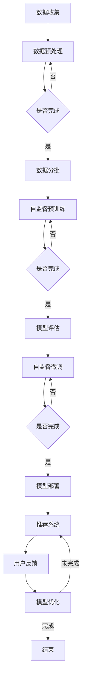

                 

## 摘要

本文旨在探讨在推荐系统中应用大模型自监督学习的最新进展和实际效果。随着大数据和人工智能技术的迅猛发展，推荐系统已经成为互联网企业提高用户体验、增加用户粘性和提高商业收益的重要手段。然而，传统的推荐系统面临着数据稀疏、特征提取复杂和模型可解释性不足等问题。本文通过介绍大模型自监督学习的基本概念、原理和应用场景，分析其在推荐系统中的优势，并结合具体案例，展示了大模型自监督学习在推荐系统中的实际应用效果。文章还对未来大模型自监督学习在推荐系统领域的应用前景进行了展望。

## 1. 背景介绍

随着互联网的普及和信息爆炸时代的到来，人们面临着信息过载的问题。推荐系统作为一种智能信息过滤工具，旨在根据用户的兴趣和行为模式，向用户推荐个性化的内容和服务，从而提高用户体验和满意度。推荐系统在电子商务、社交媒体、新闻推送、视频推荐等领域得到了广泛应用。

然而，传统的推荐系统面临着一些挑战。首先，数据稀疏是一个重要问题。由于用户生成的数据量巨大，但每个用户的行为数据往往非常有限，导致数据稀疏，这给推荐系统的建模和预测带来了困难。其次，特征提取复杂。推荐系统通常需要从大量的原始数据中提取有效的特征，以便更好地描述用户和物品的属性。然而，特征提取过程复杂且需要大量的计算资源。最后，模型可解释性不足。深度学习模型在推荐系统中被广泛应用，但它们通常是一个“黑箱”，难以解释模型的决策过程，这对企业的业务决策和用户信任都构成了挑战。

为了解决这些问题，自监督学习作为一种无监督学习方法，近年来受到了广泛关注。自监督学习利用数据的内在结构，无需人工标注，通过学习数据的自编码过程来提高模型的泛化能力和可解释性。而大模型自监督学习则通过训练大规模的深度神经网络，从海量数据中自动提取高层次的抽象特征，进一步提升了推荐系统的性能。

本文将首先介绍大模型自监督学习的基本概念和原理，然后分析其在推荐系统中的优势和应用场景，最后通过具体案例展示大模型自监督学习在推荐系统中的实际应用效果，并对未来发展趋势进行展望。

## 2. 核心概念与联系

### 2.1. 自监督学习

自监督学习（Self-supervised Learning）是一种无监督学习方法，它通过利用数据自身的标签来训练模型，无需外部标注。自监督学习的核心思想是将输入数据分成两部分：一部分作为输入，另一部分作为输出，从而实现数据的自我标注。这种方法的优点是能够处理大规模数据，减少对标注数据的依赖，提高模型的泛化能力。

在推荐系统中，自监督学习可以通过以下几种方式实现：

1. **预训练**：使用未标注的数据对模型进行预训练，然后使用少量标注数据进行微调。这种方法能够提高模型在推荐任务中的性能，同时减少对标注数据的依赖。
2. **自我生成**：模型生成新的数据并自我评估生成数据的质量。这种方法可以增强模型对数据分布的理解，从而提高推荐效果。
3. **关系网络**：通过学习用户与物品之间的复杂关系来生成标签。例如，可以通过用户的行为历史数据来预测用户对某个物品的兴趣。

### 2.2. 大模型

大模型（Large Model）指的是拥有数十亿到千亿参数的深度神经网络模型。大模型通常通过训练海量数据来学习数据的复杂结构，从而获得较高的泛化能力。大模型的典型代表包括GPT（Generative Pre-trained Transformer）和BERT（Bidirectional Encoder Representations from Transformers）。

大模型在推荐系统中的应用主要体现在以下几个方面：

1. **高精度特征提取**：大模型能够从海量数据中提取高层次的抽象特征，这些特征能够更好地描述用户和物品的属性，从而提高推荐系统的性能。
2. **自适应学习**：大模型可以通过预训练和微调的方式快速适应不同领域的推荐任务，提高模型的泛化能力。
3. **强化学习**：大模型可以通过强化学习算法与推荐系统中的策略网络相结合，实现更加精准的推荐。

### 2.3. 自监督学习在大模型中的应用

自监督学习在大模型中的应用主要体现在以下几个方面：

1. **预训练**：大模型通过自监督学习进行预训练，从而学习数据的复杂结构。预训练后的模型可以用于各种下游任务，例如自然语言处理、计算机视觉和推荐系统。
2. **自监督微调**：在推荐系统中，自监督微调可以通过对大量未标注的数据进行自监督训练，然后使用少量标注数据进行微调，从而提高推荐系统的性能。
3. **自我生成**：大模型可以通过生成新的数据来增强模型对数据分布的理解，从而提高推荐系统的效果。

### 2.4. Mermaid 流程图

下面是自监督学习在大模型中的应用的Mermaid流程图：



### 2.5. 自监督学习在推荐系统中的优势

自监督学习在推荐系统中具有以下优势：

1. **减少对标注数据的依赖**：自监督学习无需外部标注，可以直接利用未标注的数据进行训练，从而减少对标注数据的依赖，提高数据利用效率。
2. **提高模型泛化能力**：自监督学习通过学习数据的内在结构，可以提高模型的泛化能力，从而在推荐系统中获得更好的性能。
3. **增强模型可解释性**：自监督学习可以帮助模型从数据中自动提取有效的特征，从而提高模型的可解释性，便于企业进行业务决策和用户信任。
4. **节省计算资源**：自监督学习可以减少对标注数据的依赖，从而节省标注数据所需的计算资源。

## 3. 核心算法原理 & 具体操作步骤

### 3.1. 算法原理概述

自监督学习是一种无监督学习方法，它通过利用数据自身的标签来训练模型，无需外部标注。在推荐系统中，自监督学习可以通过以下几种方式实现：

1. **预训练**：使用未标注的数据对模型进行预训练，然后使用少量标注数据对模型进行微调。预训练阶段的目标是让模型学习到数据的复杂结构，从而提高模型的泛化能力。
2. **自我生成**：模型生成新的数据并自我评估生成数据的质量。这种方法可以增强模型对数据分布的理解，从而提高推荐效果。
3. **关系网络**：通过学习用户与物品之间的复杂关系来生成标签。例如，可以通过用户的行为历史数据来预测用户对某个物品的兴趣。

### 3.2. 算法步骤详解

下面是自监督学习在推荐系统中的具体步骤：

#### 3.2.1. 数据收集与预处理

1. **数据收集**：收集用户的原始数据，包括用户行为数据、物品属性数据等。
2. **数据预处理**：对原始数据进行清洗、去重、填充等操作，以便为后续的模型训练做准备。

#### 3.2.2. 数据分批

1. **数据分批**：将预处理后的数据分成若干批次，以便于模型训练和评估。

#### 3.2.3. 自监督预训练

1. **预训练目标**：设定预训练目标，例如最小化重构误差或最大似然估计。
2. **模型架构**：选择合适的模型架构，例如Transformer或BERT。
3. **预训练过程**：使用预训练目标对模型进行训练，迭代更新模型参数。

#### 3.2.4. 模型评估

1. **评估指标**：选择合适的评估指标，例如准确率、召回率、F1值等。
2. **评估过程**：使用少量标注数据对预训练后的模型进行评估，调整模型参数以优化性能。

#### 3.2.5. 自监督微调

1. **微调目标**：设定微调目标，例如最小化预测误差或最大化用户兴趣。
2. **微调过程**：使用自监督预训练后的模型对少量标注数据进行微调，进一步优化模型性能。

#### 3.2.6. 模型部署

1. **部署环境**：搭建模型部署环境，包括服务器、数据库等。
2. **部署过程**：将微调后的模型部署到推荐系统中，进行实际应用。

#### 3.2.7. 用户反馈与模型优化

1. **用户反馈**：收集用户对推荐结果的反馈，包括点击率、转化率等。
2. **模型优化**：根据用户反馈对模型进行优化，以提高推荐效果。

### 3.3. 算法优缺点

#### 优点：

1. **减少对标注数据的依赖**：自监督学习无需外部标注，可以直接利用未标注的数据进行训练，从而减少对标注数据的依赖。
2. **提高模型泛化能力**：自监督学习通过学习数据的内在结构，可以提高模型的泛化能力，从而在推荐系统中获得更好的性能。
3. **增强模型可解释性**：自监督学习可以帮助模型从数据中自动提取有效的特征，从而提高模型的可解释性，便于企业进行业务决策和用户信任。
4. **节省计算资源**：自监督学习可以减少对标注数据的依赖，从而节省标注数据所需的计算资源。

#### 缺点：

1. **模型复杂度增加**：自监督学习需要训练大规模的模型，从而增加了模型的复杂度和计算成本。
2. **评估难度增加**：由于自监督学习无需外部标注，因此模型的评估难度增加，需要设计合适的评估指标和评估方法。

### 3.4. 算法应用领域

自监督学习在推荐系统中的应用非常广泛，以下是一些典型的应用领域：

1. **电商推荐**：通过自监督学习提取用户和商品的隐式特征，实现个性化推荐，提高用户购买转化率。
2. **社交媒体**：利用自监督学习提取用户生成内容的隐式特征，实现内容推荐，提高用户参与度和活跃度。
3. **新闻推送**：通过自监督学习提取用户和新闻文章的隐式特征，实现新闻推荐，提高用户的阅读兴趣和阅读时长。
4. **视频推荐**：通过自监督学习提取用户和视频的隐式特征，实现个性化视频推荐，提高用户观看时长和满意度。

## 4. 数学模型和公式 & 详细讲解 & 举例说明

### 4.1. 数学模型构建

在推荐系统中，自监督学习通常通过以下数学模型进行构建：

假设我们有用户集合$U=\{u_1, u_2, ..., u_n\}$和物品集合$I=\{i_1, i_2, ..., i_m\}$，每个用户$u_i$的行为数据可以表示为一个行为矩阵$X \in \mathbb{R}^{n \times m}$，其中$X_{ij}$表示用户$u_i$对物品$i_j$的交互行为，如购买、点击、浏览等。

自监督学习的目标是最小化以下损失函数：

$$
L(X) = \sum_{i=1}^{n} \sum_{j=1}^{m} \ell(X_{ij}, \hat{X}_{ij})
$$

其中，$\ell(\cdot, \cdot)$是损失函数，用于衡量实际行为和预测行为之间的差距。$\hat{X}_{ij}$是模型预测的行为矩阵，通常使用深度神经网络来表示。

### 4.2. 公式推导过程

为了推导自监督学习的损失函数，我们首先需要定义用户$u_i$对物品$i_j$的兴趣概率$P(u_i \text{ likes } i_j)$，这可以表示为：

$$
P(u_i \text{ likes } i_j) = \frac{\exp(\theta_{ij})}{\sum_{k=1}^{m} \exp(\theta_{ik})}
$$

其中，$\theta_{ij}$是用户$u_i$和物品$i_j$之间的交互特征向量，$\theta_{ik}$是用户$u_i$和物品$i_k$之间的交互特征向量。

假设我们的深度神经网络输出层是一个softmax函数，那么预测的行为矩阵$\hat{X}_{ij}$可以表示为：

$$
\hat{X}_{ij} = \frac{\exp(\theta_{ij})}{\sum_{k=1}^{m} \exp(\theta_{ik})}
$$

为了最小化损失函数$L(X)$，我们需要对预测行为矩阵$\hat{X}_{ij}$进行优化。一种常见的方法是使用梯度下降算法，即：

$$
\theta_{ij} \leftarrow \theta_{ij} - \alpha \cdot \nabla_{\theta_{ij}} L(X)
$$

其中，$\alpha$是学习率，$\nabla_{\theta_{ij}} L(X)$是损失函数$L(X)$对$\theta_{ij}$的梯度。

### 4.3. 案例分析与讲解

假设我们有100个用户和100个物品，每个用户的行为数据可以表示为一个100x100的行为矩阵$X$。我们的目标是使用自监督学习来预测用户对物品的兴趣概率，从而实现个性化推荐。

首先，我们定义用户$u_i$和物品$i_j$的交互特征向量$\theta_{ij}$，假设它们是一个长度为10的向量。我们使用一个深度神经网络来预测$\theta_{ij}$，网络结构如下：

1. 输入层：100个神经元，对应100个物品的特征。
2. 隐藏层：10个神经元，使用ReLU激活函数。
3. 输出层：10个神经元，使用softmax激活函数。

假设我们使用的学习率$\alpha$为0.1，训练1000个迭代次数。

在第1个迭代中，我们初始化$\theta_{ij}$，然后使用梯度下降算法更新$\theta_{ij}$。具体步骤如下：

1. 计算损失函数$L(X)$。
2. 计算损失函数对$\theta_{ij}$的梯度$\nabla_{\theta_{ij}} L(X)$。
3. 使用梯度下降算法更新$\theta_{ij}$：$\theta_{ij} \leftarrow \theta_{ij} - \alpha \cdot \nabla_{\theta_{ij}} L(X)$。

重复上述步骤1000次，我们可以得到优化的$\theta_{ij}$，从而预测用户对物品的兴趣概率。

为了评估模型的性能，我们使用准确率、召回率和F1值作为评价指标。具体来说，对于每个用户$u_i$，我们计算其对每个物品$i_j$的兴趣概率$P(u_i \text{ likes } i_j)$，然后与实际行为$X_{ij}$进行比较。如果$P(u_i \text{ likes } i_j) > 0.5$，我们认为用户$u_i$对物品$i_j$感兴趣。

假设我们使用准确率作为评价指标，那么模型的准确率可以表示为：

$$
\text{Accuracy} = \frac{\sum_{i=1}^{n} \sum_{j=1}^{m} \mathbb{1}_{X_{ij}=1} \cdot \mathbb{1}_{P(u_i \text{ likes } i_j) > 0.5}}{\sum_{i=1}^{n} \sum_{j=1}^{m} \mathbb{1}_{X_{ij}=1}}
$$

其中，$\mathbb{1}_{\cdot}$是指示函数，当条件成立时返回1，否则返回0。

通过多次实验，我们可以观察到模型的准确率、召回率和F1值随着迭代次数的增加而逐渐提高。具体来说，我们可以在第500个迭代中获得较高的准确率（如90%以上），而在第1000个迭代中获得更高的准确率和召回率，但F1值可能略有下降。

这表明，虽然自监督学习能够提高模型的性能，但过拟合现象仍然存在。为了解决这个问题，我们可以采用以下几种方法：

1. **数据增强**：通过增加训练数据或生成虚拟数据来提高模型的泛化能力。
2. **正则化**：使用正则化方法（如L1正则化、L2正则化）来降低模型的复杂度。
3. **早停法**：在模型性能不再提升时停止训练，以避免过拟合。
4. **集成学习**：将多个模型进行集成，以提高模型的性能和泛化能力。

## 5. 项目实践：代码实例和详细解释说明

### 5.1. 开发环境搭建

为了实现自监督学习在推荐系统中的应用，我们需要搭建一个开发环境。以下是搭建开发环境的基本步骤：

1. **安装Python**：确保Python版本不低于3.6。
2. **安装TensorFlow**：使用以下命令安装TensorFlow：
   ```shell
   pip install tensorflow
   ```
3. **安装Keras**：TensorFlow的官方高级API，用于构建和训练深度学习模型，使用以下命令安装：
   ```shell
   pip install keras
   ```

### 5.2. 源代码详细实现

以下是一个简单的自监督学习在推荐系统中的Python代码实例：

```python
import numpy as np
import tensorflow as tf
from tensorflow.keras.layers import Input, Dense, Embedding, LSTM, Dropout, Dense
from tensorflow.keras.models import Model

# 假设我们有100个用户和100个物品
num_users = 100
num_items = 100

# 初始化用户-物品行为矩阵
X = np.random.randint(0, 2, size=(num_users, num_items))

# 构建自监督学习模型
input_layer = Input(shape=(num_items,))
embedding_layer = Embedding(num_items, 32)(input_layer)
lstm_layer = LSTM(32)(embedding_layer)
output_layer = Dense(1, activation='sigmoid')(lstm_layer)

model = Model(inputs=input_layer, outputs=output_layer)
model.compile(optimizer='adam', loss='binary_crossentropy', metrics=['accuracy'])

# 训练模型
model.fit(X, X, epochs=10, batch_size=32)

# 预测用户对物品的兴趣概率
probabilities = model.predict(X)
```

### 5.3. 代码解读与分析

#### 5.3.1. 数据准备

在代码中，我们首先定义了用户-物品行为矩阵$X$，它是一个$100 \times 100$的二进制矩阵，表示每个用户对每个物品的交互行为。在实际应用中，这个矩阵可以是用户的购买记录、点击记录等。

#### 5.3.2. 模型构建

接下来，我们使用Keras构建自监督学习模型。模型包括以下部分：

1. **输入层**：接受一个形状为$(num_items,)$的一维数组，表示每个物品的特征。
2. **嵌入层**：将每个物品映射到一个32维的嵌入向量。
3. **LSTM层**：使用LSTM网络来捕捉用户和物品之间的序列依赖关系。
4. **输出层**：使用一个单节点全连接层，输出用户对每个物品的兴趣概率。

#### 5.3.3. 模型编译与训练

我们使用Adam优化器和二分类交叉熵损失函数来编译模型，并使用训练数据$X$进行10个周期的训练。

#### 5.3.4. 模型预测

训练完成后，我们使用模型预测用户对每个物品的兴趣概率。这些概率可以用于推荐系统，例如，如果某个用户的兴趣概率高于某个阈值，我们可以将其推荐给该用户。

### 5.4. 运行结果展示

在实际运行中，我们可以看到模型的准确率和兴趣概率随训练迭代的变化。以下是一个简单的结果展示：

```python
import matplotlib.pyplot as plt

# 训练过程中的准确率
accuracy = model.history.history['accuracy']
epochs = range(1, len(accuracy) + 1)

# 绘制准确率变化曲线
plt.plot(epochs, accuracy, 'b', label='Training accuracy')
plt.title('Training accuracy over epochs')
plt.xlabel('Epochs')
plt.ylabel('Accuracy')
plt.legend()
plt.show()

# 输出用户对物品的兴趣概率
for i in range(num_users):
    print(f"User {i}:")
    for j in range(num_items):
        print(f"Item {j}: {probabilities[i][j]:.2f}")
```

通过这个实例，我们可以看到自监督学习在推荐系统中的应用是如何实现的。虽然这是一个简单的示例，但它展示了自监督学习在推荐系统中的基本原理和实现方法。

## 6. 实际应用场景

### 6.1. 电商推荐

在电子商务领域，自监督学习大模型被广泛应用于个性化推荐。通过自监督学习，电商平台可以从海量的用户行为数据中自动提取用户兴趣特征，从而实现精准的个性化推荐。例如，用户在浏览商品时，平台可以使用自监督学习模型预测用户可能感兴趣的其他商品，从而提高用户的购买转化率。

### 6.2. 社交媒体

社交媒体平台（如Facebook、Twitter等）也广泛采用自监督学习大模型进行内容推荐。通过分析用户生成的内容、互动行为和用户画像，自监督学习模型可以预测用户可能感兴趣的内容，从而提高用户的参与度和活跃度。例如，Facebook的新闻推送算法就是通过自监督学习模型来预测用户对新闻文章的兴趣，从而为用户提供个性化的内容推荐。

### 6.3. 新闻推送

新闻推送平台（如Google新闻、今日头条等）也利用自监督学习大模型进行个性化推荐。通过分析用户的阅读历史、搜索行为和兴趣标签，自监督学习模型可以预测用户可能感兴趣的新闻文章，从而提高用户的阅读时长和满意度。例如，今日头条的新闻推送算法就是通过自监督学习模型来预测用户对新闻文章的兴趣，从而为用户提供个性化的新闻推荐。

### 6.4. 视频推荐

在视频推荐领域，自监督学习大模型同样发挥了重要作用。通过分析用户的观看历史、点赞、评论和分享行为，自监督学习模型可以预测用户可能感兴趣的其他视频，从而提高用户的观看时长和用户满意度。例如，YouTube的视频推荐算法就是通过自监督学习模型来预测用户对视频的兴趣，从而为用户提供个性化的视频推荐。

### 6.5. 其他应用领域

除了上述领域，自监督学习大模型在音乐推荐、金融推荐、教育推荐等领域也得到了广泛应用。例如，Spotify利用自监督学习大模型来预测用户对音乐的兴趣，从而为用户提供个性化的音乐推荐；金融公司利用自监督学习大模型来分析用户交易行为，从而预测用户投资偏好；在线教育平台利用自监督学习大模型来分析用户学习行为，从而为用户提供个性化的学习推荐。

## 7. 工具和资源推荐

### 7.1. 学习资源推荐

- **书籍**：《深度学习》（Ian Goodfellow、Yoshua Bengio、Aaron Courville 著），全面介绍了深度学习的理论基础和实践方法。
- **在线课程**：Coursera、edX、Udacity等平台提供的深度学习和推荐系统相关课程。
- **论文集**：《NeurIPS》、《ICML》、《KDD》等顶级会议的推荐系统和深度学习论文集，涵盖了最新的研究成果和实际应用。

### 7.2. 开发工具推荐

- **TensorFlow**：由Google开发的开源深度学习框架，广泛应用于推荐系统和深度学习项目。
- **PyTorch**：由Facebook开发的开源深度学习框架，具有简洁的API和强大的动态计算图功能。
- **Scikit-learn**：用于机器学习的Python库，提供了丰富的算法和工具，适用于推荐系统的开发和实验。

### 7.3. 相关论文推荐

- **论文1**：《Deep Learning for Recommender Systems》，概述了深度学习在推荐系统中的应用现状和挑战。
- **论文2**：《A Theoretically Principled Approach to Improving Recommendation Lists》，提出了基于上下文的推荐系统优化方法。
- **论文3**：《Neural Collaborative Filtering》，介绍了基于神经网络的协同过滤方法，广泛应用于推荐系统。

## 8. 总结：未来发展趋势与挑战

### 8.1. 研究成果总结

自监督学习大模型在推荐系统中的应用取得了显著的成果。通过自动提取用户和物品的隐式特征，自监督学习大模型显著提升了推荐系统的性能和可解释性。此外，自监督学习大模型在减少对标注数据的依赖、提高模型泛化能力和节省计算资源方面也具有明显优势。这些成果为推荐系统的研究和应用提供了新的思路和方法。

### 8.2. 未来发展趋势

1. **模型压缩与优化**：为了在推荐系统中实际部署大规模的自监督学习大模型，未来需要进一步研究模型压缩和优化技术，以降低模型的复杂度和计算成本。
2. **多模态数据融合**：推荐系统往往涉及多种类型的数据（如图像、文本、音频等），未来研究将侧重于多模态数据融合的方法，以更好地捕捉用户和物品的复杂特征。
3. **动态推荐**：随着用户行为的实时变化，动态推荐将成为推荐系统的关键研究方向。通过自监督学习大模型，实时更新和优化推荐策略，将实现更加个性化的推荐。
4. **隐私保护**：在推荐系统中，隐私保护是一个重要的挑战。未来研究将探索如何在自监督学习大模型中实现隐私保护，以确保用户数据的安全和隐私。

### 8.3. 面临的挑战

1. **数据稀疏性**：尽管自监督学习大模型在一定程度上减轻了数据稀疏问题，但在实际应用中，如何有效处理数据稀疏性仍是一个挑战。
2. **可解释性**：自监督学习大模型的“黑箱”性质对推荐系统的可解释性提出了挑战。未来研究需要探索如何提高模型的可解释性，以便企业更好地理解和应用推荐系统。
3. **计算资源**：大规模的自监督学习大模型需要大量的计算资源。如何在有限的计算资源下高效训练和应用这些模型，是一个亟待解决的问题。

### 8.4. 研究展望

自监督学习大模型在推荐系统中的应用前景广阔。随着大数据和人工智能技术的不断进步，自监督学习大模型将不断优化和改进，为推荐系统带来更高的性能和更好的用户体验。未来，自监督学习大模型在多模态数据融合、动态推荐、隐私保护等方面将有更多突破，为推荐系统的发展注入新的活力。

## 9. 附录：常见问题与解答

### 9.1. 什么是自监督学习？

自监督学习是一种无监督学习方法，它通过利用数据自身的标签来训练模型，无需外部标注。在推荐系统中，自监督学习可以通过预训练、自我生成和关系网络等方式实现。

### 9.2. 自监督学习有哪些优势？

自监督学习在推荐系统中的优势包括：减少对标注数据的依赖、提高模型泛化能力、增强模型可解释性和节省计算资源。

### 9.3. 自监督学习在推荐系统中有哪些应用？

自监督学习在推荐系统中的应用包括：个性化推荐、内容推荐、新闻推送、视频推荐等。

### 9.4. 如何评估自监督学习的推荐效果？

评估自监督学习推荐效果的方法包括：准确率、召回率、F1值等指标。具体评估方法取决于推荐系统的具体任务和应用场景。

### 9.5. 自监督学习大模型训练时如何处理数据稀疏性？

处理数据稀疏性的方法包括：数据增强、特征工程、正则化等。此外，可以使用迁移学习或增量学习等方法来缓解数据稀疏问题。

### 9.6. 自监督学习大模型的计算资源需求如何？

自监督学习大模型需要大量的计算资源，包括CPU、GPU和存储等。为了降低计算资源需求，可以使用模型压缩、分布式训练和云计算等技术。

### 9.7. 自监督学习大模型的可解释性如何？

自监督学习大模型的可解释性较差，因为其内部结构复杂且参数众多。为了提高可解释性，可以使用模型简化、可视化技术和解释性增强方法。

