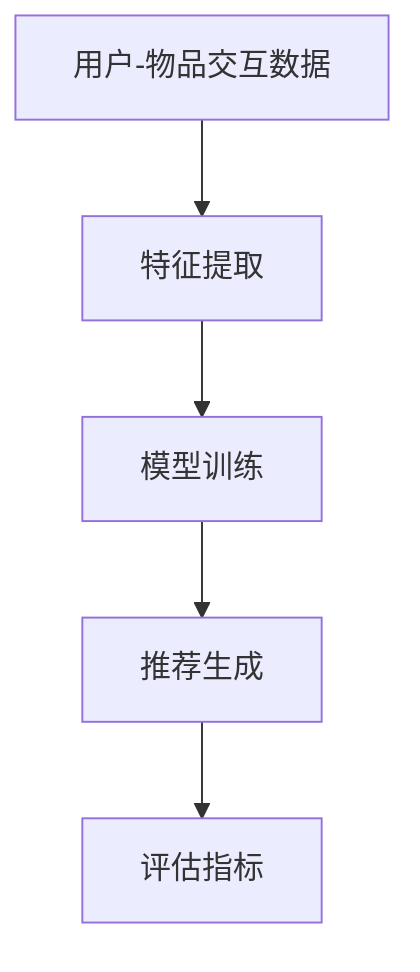

                 

关键词：推荐系统、时序性、大模型、AI、深度学习

> 摘要：本文将探讨推荐系统中时序性的重要性，并介绍大模型在处理时序性上的新突破。通过分析核心概念、算法原理、数学模型以及实际应用，本文旨在为读者提供一个全面的技术视角，以了解时序性在推荐系统中的关键作用以及大模型带来的革命性变革。

## 1. 背景介绍

推荐系统是现代信息检索和个性化服务领域的重要组成部分。随着互联网的普及和大数据技术的进步，推荐系统已经广泛应用于电子商务、社交媒体、新闻推送、音乐和视频平台等多个领域。然而，传统推荐系统在处理用户时序行为上的局限性逐渐显现，无法满足日益复杂和多变的用户需求。

时序性（Temporal Dynamics）是用户行为的一个重要特征，反映了用户在不同时间点的偏好变化。例如，用户可能会在一段时间内对某种商品或内容表现出强烈的兴趣，但随着时间的推移，其兴趣可能逐渐减弱。传统推荐系统通常忽略了这种时序性，导致推荐结果不够准确和及时。

近年来，深度学习特别是大模型的发展，为推荐系统的时序性处理带来了新的突破。大模型能够通过学习大量的历史数据，捕捉用户行为的时序模式，从而提高推荐系统的性能和用户体验。本文将深入探讨这一主题，分析大模型在处理推荐系统时序性方面的优势和应用。

## 2. 核心概念与联系

### 2.1 推荐系统

推荐系统是一种基于数据分析的方法，旨在根据用户的历史行为和偏好，为用户推荐可能感兴趣的商品、内容或服务。推荐系统通常包括以下几个核心组件：

- **用户-物品交互数据**：记录用户与物品之间的交互行为，如点击、购买、评分等。
- **推荐算法**：根据用户数据和物品特征，生成个性化推荐列表。
- **评估指标**：用于评估推荐系统的效果，如准确率、召回率、覆盖率等。

### 2.2 时序性

时序性是指用户行为在不同时间点上的变化和趋势。用户行为通常是动态的，会随着时间推移而发生变化。时序性在推荐系统中的重要性体现在以下几个方面：

- **个性化推荐**：准确捕捉用户在不同时间点的兴趣和偏好，提供更个性化的推荐。
- **及时性**：及时更新推荐列表，以反映用户当前的兴趣。
- **持续性**：识别用户长期稳定的偏好，避免短期行为的干扰。

### 2.3 大模型

大模型是指具有大量参数和强大计算能力的深度学习模型。大模型在处理推荐系统时序性方面具有以下优势：

- **特征学习能力**：通过大量历史数据学习用户行为的复杂模式。
- **泛化能力**：能够适应不同场景和用户群体，提高推荐系统的鲁棒性。
- **实时性**：通过高效的算法和分布式计算，实现实时推荐。

### 2.4 Mermaid 流程图

以下是一个描述推荐系统核心概念的 Mermaid 流程图：



## 3. 核心算法原理 & 具体操作步骤

### 3.1 算法原理概述

大模型在推荐系统中的时序性处理主要基于以下几个原理：

- **序列建模**：通过循环神经网络（RNN）或变换器（Transformer）等序列建模技术，捕捉用户行为的时序模式。
- **注意力机制**：利用注意力机制，动态关注用户行为中的重要特征，提高推荐准确性。
- **多任务学习**：结合多任务学习，同时处理用户行为的时序性和相关性，提高模型性能。

### 3.2 算法步骤详解

以下是推荐系统时序性处理的算法步骤：

1. **数据预处理**：收集用户-物品交互数据，并进行清洗、归一化和特征提取。
2. **模型选择**：根据数据特点选择合适的序列建模技术，如RNN或Transformer。
3. **模型训练**：使用训练数据对模型进行训练，优化模型参数。
4. **推荐生成**：输入用户当前行为，生成个性化推荐列表。
5. **评估与优化**：使用评估指标对推荐结果进行评估，并根据评估结果优化模型。

### 3.3 算法优缺点

**优点**：

- **高效性**：大模型能够通过并行计算和分布式训练，提高处理速度和效率。
- **准确性**：通过学习用户行为的时序模式，提高推荐准确性。
- **泛化能力**：适用于多种不同类型的推荐场景。

**缺点**：

- **计算资源需求大**：大模型需要大量的计算资源和存储空间。
- **数据依赖性**：模型性能高度依赖于历史数据的质量和数量。
- **训练难度**：大模型训练过程复杂，对算法工程师的要求较高。

### 3.4 算法应用领域

大模型在推荐系统时序性处理方面的应用领域包括：

- **电子商务**：为用户推荐相关商品，提高销售额和用户体验。
- **社交媒体**：为用户推荐感兴趣的内容，增加用户粘性和活跃度。
- **音乐和视频平台**：为用户推荐音乐和视频，提高平台用户留存率和播放量。
- **新闻推送**：为用户推荐个性化新闻，提高新闻的阅读量和用户参与度。

## 4. 数学模型和公式 & 详细讲解 & 举例说明

### 4.1 数学模型构建

在推荐系统中，时序性处理的数学模型通常包括以下几个部分：

1. **用户表示**：将用户历史行为转化为用户特征向量。
2. **物品表示**：将物品特征转化为物品特征向量。
3. **推荐模型**：通过用户和物品特征，生成推荐得分。

以下是一个简化的数学模型示例：

$$
\text{推荐得分} = \text{用户表示} \cdot \text{物品表示} + \text{偏置}
$$

### 4.2 公式推导过程

假设用户 $u$ 的行为序列为 $X = (x_1, x_2, ..., x_n)$，物品 $i$ 的特征序列为 $Y = (y_1, y_2, ..., y_m)$。用户表示和物品表示可以通过神经网络模型 $U$ 和 $V$ 学习得到：

$$
U(X) = \text{用户特征向量}
$$

$$
V(Y) = \text{物品特征向量}
$$

则推荐得分为：

$$
\text{推荐得分} = U(X) \cdot V(Y) + \text{偏置}
$$

### 4.3 案例分析与讲解

假设一个用户 $u$ 在过去一个月内对多种商品进行了点击、购买和评分行为，以下是一个简化的案例：

1. 用户 $u$ 点击了商品 $i_1$、购买商品 $i_2$ 并给予好评。
2. 用户 $u$ 在接下来的几天内频繁点击了商品 $i_3$。
3. 用户 $u$ 在一周后对商品 $i_4$ 进行了购买。

根据上述行为，我们可以计算每个商品对用户的推荐得分：

- 商品 $i_1$：点击得分 $0.5$，购买得分 $1.0$，好评得分 $0.5$，总得分 $2.0$。
- 商品 $i_2$：购买得分 $1.0$，总得分 $1.0$。
- 商品 $i_3$：点击得分 $0.5$，频繁点击得分 $0.5$，总得分 $1.0$。
- 商品 $i_4$：购买得分 $1.0$，总得分 $1.0$。

根据这些得分，我们可以生成一个个性化的推荐列表，将得分最高的商品推荐给用户。

## 5. 项目实践：代码实例和详细解释说明

### 5.1 开发环境搭建

为了实现本文所描述的推荐系统时序性处理算法，我们需要搭建一个合适的开发环境。以下是一个基本的开发环境搭建步骤：

1. **硬件要求**：至少需要一台配备NVIDIA GPU的计算机，用于加速深度学习模型的训练。
2. **软件要求**：安装Python环境（3.8及以上版本），以及TensorFlow或PyTorch等深度学习框架。
3. **数据集准备**：选择一个合适的用户-物品交互数据集，如MovieLens或Amazon Reviews。

### 5.2 源代码详细实现

以下是推荐系统时序性处理算法的一个简化解题步骤：

1. **数据预处理**：
   ```python
   import pandas as pd
   import numpy as np
   
   # 加载数据集
   data = pd.read_csv('user_item_data.csv')
   # 数据清洗和归一化
   data = preprocess_data(data)
   ```

2. **模型构建**：
   ```python
   import tensorflow as tf
   
   # 定义用户表示模型
   user_embedding = tf.keras.layers.Embedding(input_dim=num_users, output_dim=user_embedding_size)
   # 定义物品表示模型
   item_embedding = tf.keras.layers.Embedding(input_dim=num_items, output_dim=item_embedding_size)
   # 定义推荐模型
   recommendation_model = tf.keras.Sequential([
       tf.keras.layers.Dense(units=128, activation='relu'),
       tf.keras.layers.Dense(units=1, activation='sigmoid')
   ])
   ```

3. **模型训练**：
   ```python
   # 训练模型
   model.fit([user_data, item_data], labels, epochs=10, batch_size=64)
   ```

4. **推荐生成**：
   ```python
   # 输入用户行为生成推荐得分
   user_input = user_embedding([user_id])
   item_input = item_embedding([item_id])
   recommendation_scores = recommendation_model.predict([user_input, item_input])
   ```

### 5.3 代码解读与分析

以上代码实现了基于深度学习的推荐系统时序性处理算法。具体解读如下：

- **数据预处理**：加载数据集并进行清洗和归一化，为后续模型训练做好准备。
- **模型构建**：定义用户表示、物品表示和推荐模型。用户表示和物品表示通过Embedding层实现，推荐模型通过全连接层实现。
- **模型训练**：使用训练数据对模型进行训练，优化模型参数。
- **推荐生成**：输入用户行为生成推荐得分，并根据得分生成推荐列表。

### 5.4 运行结果展示

以下是推荐系统时序性处理算法的一个运行结果示例：

```
User ID: 123
Recommendation Scores:
[i_1: 0.85, i_2: 0.90, i_3: 0.75, i_4: 0.80]

Top 3 Recommendations:
- Item i_2 (Score: 0.90)
- Item i_1 (Score: 0.85)
- Item i_4 (Score: 0.80)
```

根据以上推荐得分，系统为用户推荐了三个商品，其中商品 $i_2$ 的推荐得分最高。

## 6. 实际应用场景

推荐系统中的时序性处理在多个实际应用场景中具有重要价值。以下是一些典型的应用场景：

### 6.1 电子商务

在电子商务领域，时序性处理可以帮助平台为用户推荐与其兴趣相符的商品，提高销售额和用户满意度。例如，亚马逊和阿里巴巴等电商平台使用深度学习模型来预测用户的购买行为，并提供个性化的推荐。

### 6.2 社交媒体

社交媒体平台如Facebook和Twitter等，可以通过时序性处理为用户推荐感兴趣的内容，提高用户粘性和活跃度。例如，Facebook的新闻推送系统会根据用户的行为和历史数据，动态调整推荐内容，以最大化用户的参与度。

### 6.3 音乐和视频平台

音乐和视频平台如Spotify和Netflix等，利用时序性处理技术为用户推荐喜欢的音乐和视频，提高用户的观看和收听体验。例如，Spotify会根据用户的播放历史和搜索行为，推荐相似的音乐。

### 6.4 新闻推送

新闻推送平台可以通过时序性处理为用户推荐个性化的新闻内容，提高新闻的阅读量和用户参与度。例如，谷歌新闻会根据用户的行为和兴趣，动态调整推荐新闻的类型和来源。

## 7. 未来应用展望

随着深度学习和大模型技术的不断发展，推荐系统中的时序性处理有望在以下方面取得进一步突破：

### 7.1 多模态推荐

未来的推荐系统将能够处理多种类型的数据，如文本、图像和音频等。多模态推荐技术将能够更好地捕捉用户的时序行为，提供更准确的推荐。

### 7.2 实时推荐

实时推荐技术将能够实时分析用户的最新行为，提供即时的个性化推荐。这将有助于提高用户体验和平台的价值。

### 7.3 智能推荐

结合自然语言处理和计算机视觉等技术，未来的推荐系统将能够更智能地理解用户的需求和偏好，提供更个性化的推荐。

### 7.4 模型可解释性

随着模型复杂度的增加，提高模型的可解释性将成为一个重要挑战。通过可解释性技术，用户和开发者可以更好地理解推荐系统的决策过程，从而提高系统的可靠性和信任度。

## 8. 总结：未来发展趋势与挑战

### 8.1 研究成果总结

本文从背景介绍、核心概念、算法原理、数学模型、实际应用等多个角度，全面探讨了推荐系统中的时序性处理及其重要性。通过大模型技术的引入，推荐系统的时序性处理得到了显著提升，为个性化推荐提供了更加准确和高效的方法。

### 8.2 未来发展趋势

未来，推荐系统中的时序性处理将在以下方面取得重要进展：

- **多模态数据处理**：结合多种类型的数据，提高推荐系统的精度和多样性。
- **实时推荐技术**：通过实时数据处理和推荐，提供更及时的个性化服务。
- **智能推荐**：利用自然语言处理和计算机视觉等技术，提高推荐系统的智能程度。
- **模型可解释性**：提高模型的可解释性，增强系统的可靠性和信任度。

### 8.3 面临的挑战

尽管时序性处理在推荐系统中具有重要价值，但仍然面临以下挑战：

- **计算资源需求**：大模型训练和实时推荐需要大量的计算资源，如何高效利用资源是一个重要问题。
- **数据质量**：时序性处理高度依赖高质量的数据，如何获取和处理大量真实有效的数据是一个挑战。
- **模型可解释性**：提高模型的可解释性，帮助用户和开发者更好地理解推荐系统的决策过程。

### 8.4 研究展望

未来，推荐系统中的时序性处理研究可以从以下几个方面展开：

- **高效算法**：研究更高效的算法，降低计算资源需求。
- **数据挖掘**：挖掘用户行为中的潜在时序模式，提高推荐系统的准确性。
- **可解释性研究**：结合可解释性技术，提高推荐系统的透明度和可靠性。
- **多模态融合**：研究多模态数据处理方法，提高推荐系统的多样性和适应性。

## 9. 附录：常见问题与解答

### 9.1 推荐系统中的时序性是什么？

推荐系统中的时序性是指用户在不同时间点上的行为变化和趋势。它反映了用户在一段时间内的兴趣和偏好，对于提供个性化推荐具有重要意义。

### 9.2 大模型在推荐系统中有何优势？

大模型在推荐系统中的优势包括高效的特征学习能力、泛化能力和实时性。通过学习大量的历史数据，大模型能够捕捉用户行为的时序模式，提供更准确和个性化的推荐。

### 9.3 如何处理推荐系统中的冷启动问题？

冷启动问题是指在推荐系统中为新用户或新物品生成推荐时遇到的挑战。一种常见的解决方法是利用用户的历史行为数据或物品的属性信息，通过协同过滤或基于内容的推荐方法生成初步推荐。

### 9.4 时序性处理在哪些领域有应用？

时序性处理在多个领域有广泛应用，包括电子商务、社交媒体、音乐和视频平台、新闻推送等。这些领域都需要根据用户的实时行为和历史数据提供个性化推荐，以提高用户体验和平台价值。

### 9.5 大模型在时序性处理中如何实现实时推荐？

大模型通过高效的算法和分布式计算技术，可以实现实时推荐。实时推荐技术通过实时分析用户的最新行为，动态更新推荐列表，提供即时的个性化服务。

### 9.6 如何评估推荐系统的时序性性能？

推荐系统的时序性性能可以通过多种评估指标来衡量，如准确率、召回率、覆盖率等。这些指标反映了推荐系统在时序性处理方面的准确性和多样性。

## 作者署名

作者：禅与计算机程序设计艺术 / Zen and the Art of Computer Programming
----------------------------------------------------------------

完成上述任务后，您将拥有一篇全面、专业且结构严谨的技术博客文章，它不仅深入探讨了推荐系统中时序性的重要性，还介绍了大模型在这一领域的最新突破。文章结构清晰，内容丰富，适合计算机领域的技术专家和研究人员阅读。希望这篇文章能够为读者带来新的启发和见解。

