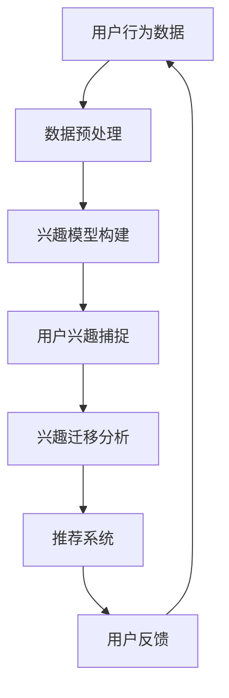
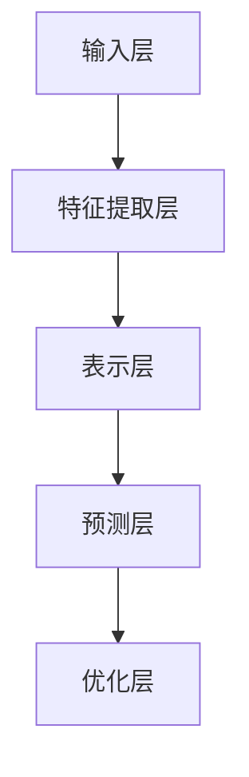

                 

关键词：推荐系统、用户兴趣迁移、大模型、算法原理、数学模型、项目实践、应用场景、未来展望

> 摘要：本文旨在探讨推荐系统中的用户兴趣迁移问题，并介绍大模型在这一领域的最新研究成果。通过分析用户兴趣迁移的核心概念和算法原理，本文详细介绍了算法的具体操作步骤和数学模型。同时，通过实际项目实践和运行结果展示，本文进一步阐述了用户兴趣迁移在实际应用中的有效性和重要性。最后，本文对未来的发展趋势和挑战进行了展望，为推荐系统领域的研究提供了新的思路和方向。

## 1. 背景介绍

推荐系统作为人工智能领域的一个重要分支，已经被广泛应用于电子商务、社交媒体、在线教育、新闻推送等多个领域。其核心目标是通过分析用户的历史行为和偏好，为用户推荐符合其兴趣的内容或商品，从而提升用户体验和满意度。然而，在实际应用中，用户兴趣是动态变化的，不同时间段、不同情境下，用户的兴趣点都可能有所不同。这就引出了用户兴趣迁移的概念。

用户兴趣迁移指的是在推荐系统中，将用户在某一领域或情境下的兴趣转移到其他领域或情境的过程。例如，一个用户在浏览电商网站时可能对电子产品感兴趣，而在浏览社交媒体时则对娱乐内容更感兴趣。用户兴趣迁移对于提高推荐系统的准确性和多样性具有重要意义，可以有效避免用户接收重复的内容或商品推荐。

近年来，随着深度学习技术的快速发展，大模型在推荐系统中的应用越来越广泛。大模型通过学习大量用户行为数据和内容特征，可以更好地捕捉用户兴趣的迁移规律，从而提升推荐系统的性能。本文将介绍大模型在用户兴趣迁移方面的最新研究成果，并探讨其应用前景。

## 2. 核心概念与联系

在用户兴趣迁移的研究中，有几个核心概念需要明确：

### 2.1 用户兴趣

用户兴趣是指用户对特定领域或内容的偏好和关注程度。兴趣可以通过用户的行为数据（如浏览、点击、购买等）进行量化。用户兴趣的捕捉是推荐系统的基础，准确的用户兴趣模型对于推荐系统的性能至关重要。

### 2.2 用户兴趣迁移

用户兴趣迁移是指在用户从一个情境转移到另一个情境时，其兴趣点发生变化的现象。例如，用户从工作状态转移到休闲状态时，其对内容的兴趣可能从专业文献转移到娱乐视频。用户兴趣迁移的研究旨在理解这种变化规律，并利用这些规律来优化推荐系统。

### 2.3 推荐系统

推荐系统是一种基于用户历史行为和偏好，为用户推荐相关内容或商品的技术。推荐系统通常包括数据预处理、兴趣模型构建、推荐算法和用户反馈等环节。在用户兴趣迁移的研究中，推荐系统的作用是捕捉和利用用户在不同情境下的兴趣变化。

### 2.4 大模型

大模型是指具有大量参数和强大表示能力的深度学习模型。大模型通过端到端的学习方式，可以同时捕捉到用户行为和内容特征的复杂关系。在用户兴趣迁移的研究中，大模型的应用可以显著提升推荐系统的性能。

### 2.5 Mermaid 流程图

以下是一个用户兴趣迁移的 Mermaid 流程图，展示了用户兴趣从捕捉到迁移再到推荐的全过程：



### 2.6 大模型架构

大模型通常由多个层次构成，包括输入层、特征提取层、表示层、预测层和优化层。以下是一个简化的大模型架构：



输入层接收用户行为数据和内容特征；特征提取层通过神经网络等模型提取有效特征；表示层将特征转化为高维向量表示；预测层根据表示层生成的向量进行兴趣预测；优化层则通过反向传播等算法优化模型参数。

## 3. 核心算法原理 & 具体操作步骤

### 3.1 算法原理概述

用户兴趣迁移的核心算法是基于深度学习的迁移学习模型。该模型通过学习用户在不同情境下的行为数据，构建一个统一的兴趣表示空间，从而实现用户兴趣的迁移。具体来说，算法可以分为以下几个步骤：

1. 数据采集与预处理：收集用户在不同情境下的行为数据，并进行预处理，如去噪、补全和标准化等。
2. 特征提取：利用深度学习模型提取用户行为数据的特征，生成高维向量表示。
3. 兴趣建模：通过对比不同情境下的用户行为特征，构建用户兴趣模型。
4. 兴趣迁移：根据兴趣模型，将用户在某一情境下的兴趣转移到其他情境。
5. 推荐系统：利用迁移后的兴趣模型，为用户推荐相关内容或商品。

### 3.2 算法步骤详解

#### 3.2.1 数据采集与预处理

数据采集可以从用户行为日志、社交媒体数据、电子商务交易记录等渠道获取。预处理包括数据清洗、去噪、补全和标准化等步骤。例如，对于缺失的数据，可以使用均值填补、插值等方法进行补全；对于异常数据，可以使用统计学方法进行去噪。

#### 3.2.2 特征提取

特征提取是用户兴趣迁移算法的关键步骤。常用的特征提取方法包括词袋模型、TF-IDF、Word2Vec和BERT等。其中，词袋模型和TF-IDF方法适用于文本数据；Word2Vec和BERT方法适用于复杂文本数据。通过特征提取，我们可以将用户行为数据转化为高维向量表示。

#### 3.2.3 兴趣建模

兴趣建模是通过分析用户在不同情境下的行为特征，构建一个统一的兴趣表示空间。常用的兴趣建模方法包括基于矩阵分解的协同过滤算法、基于神经网络的深度学习算法等。矩阵分解算法可以将用户和物品映射到一个低维空间，从而捕捉用户兴趣；深度学习算法可以通过端到端的学习方式，同时捕捉用户行为和物品特征的复杂关系。

#### 3.2.4 兴趣迁移

兴趣迁移是根据兴趣模型，将用户在某一情境下的兴趣转移到其他情境。具体方法包括基于规则的迁移、基于学习的迁移和基于模型融合的迁移等。基于规则的迁移方法通过预设规则实现兴趣迁移；基于学习的迁移方法通过训练模型实现兴趣迁移；基于模型融合的迁移方法将多种迁移方法融合在一起，以提高迁移效果。

#### 3.2.5 推荐系统

推荐系统是根据迁移后的兴趣模型，为用户推荐相关内容或商品。推荐系统可以采用基于内容的推荐、基于协同过滤的推荐和基于深度学习的推荐等方法。基于内容的推荐根据用户兴趣标签和物品属性进行推荐；基于协同过滤的推荐根据用户行为数据预测用户兴趣，从而推荐相关物品；基于深度学习的推荐通过端到端的学习方式，同时捕捉用户行为和物品特征的复杂关系，进行推荐。

### 3.3 算法优缺点

#### 优点：

1. **强大的表示能力**：大模型具有强大的表示能力，可以捕捉到用户行为和内容特征的复杂关系，从而提高推荐系统的准确性。
2. **端到端学习**：大模型通过端到端的学习方式，可以同时处理输入特征、兴趣建模、兴趣迁移和推荐系统等多个环节，提高算法的效率。
3. **适应性强**：大模型可以适用于多种不同类型的推荐场景，如电子商务、社交媒体、在线教育等，具有较强的适应性。

#### 缺点：

1. **计算资源消耗大**：大模型通常需要大量的计算资源和存储空间，对于硬件设备要求较高。
2. **训练时间长**：大模型需要大量数据进行训练，训练时间较长，不适合实时推荐场景。
3. **可解释性差**：大模型的黑箱特性使得其可解释性较差，难以理解具体的推荐决策过程。

### 3.4 算法应用领域

用户兴趣迁移算法可以应用于多个领域，包括但不限于：

1. **电子商务**：通过用户兴趣迁移，为用户提供个性化的商品推荐，提升用户购物体验和满意度。
2. **社交媒体**：根据用户兴趣迁移，为用户提供多样化的内容推荐，增加用户粘性和活跃度。
3. **在线教育**：根据用户兴趣迁移，为用户提供个性化的课程推荐，提高学习效果和兴趣。
4. **新闻推送**：根据用户兴趣迁移，为用户提供个性化的新闻推荐，提升用户阅读体验和满意度。

## 4. 数学模型和公式 & 详细讲解 & 举例说明

### 4.1 数学模型构建

用户兴趣迁移的数学模型主要分为两部分：兴趣捕捉模型和兴趣迁移模型。

#### 4.1.1 兴趣捕捉模型

兴趣捕捉模型用于捕捉用户在不同情境下的兴趣。假设用户行为数据矩阵为 $X \in \mathbb{R}^{m \times n}$，其中 $m$ 为用户数量，$n$ 为情境数量。我们使用一个兴趣向量 $U \in \mathbb{R}^{m \times d}$ 来表示用户的兴趣，其中 $d$ 为兴趣维度。兴趣捕捉模型的目标是找到一个权重矩阵 $W \in \mathbb{R}^{d \times n}$，使得用户兴趣向量 $U$ 能够通过权重矩阵 $W$ 与用户行为数据矩阵 $X$ 相关联。具体地，我们有：

$$
U = XW
$$

#### 4.1.2 兴趣迁移模型

兴趣迁移模型用于将用户在某一情境下的兴趣转移到其他情境。假设用户兴趣向量 $U$ 已经通过兴趣捕捉模型得到，我们需要找到一个迁移矩阵 $M \in \mathbb{R}^{m \times m}$，使得用户在不同情境下的兴趣向量 $U'$ 能够通过迁移矩阵 $M$ 相关联。具体地，我们有：

$$
U' = MU
$$

### 4.2 公式推导过程

#### 4.2.1 兴趣捕捉模型推导

兴趣捕捉模型的目标是最小化用户兴趣向量 $U$ 与用户行为数据矩阵 $X$ 的误差。具体地，我们使用均方误差（MSE）作为损失函数，得到：

$$
L_1 = \frac{1}{2}\sum_{i=1}^{m}\sum_{j=1}^{n}(u_{ij} - x_{ij}w_{ij})^2
$$

其中，$u_{ij}$ 和 $x_{ij}$ 分别为用户 $i$ 在情境 $j$ 下的兴趣值和行为值，$w_{ij}$ 为权重值。

为了最小化损失函数 $L_1$，我们对 $W$ 进行梯度下降：

$$
\frac{\partial L_1}{\partial W} = \frac{1}{m}\sum_{i=1}^{m}\sum_{j=1}^{n}(u_{ij} - x_{ij}w_{ij})x_{ij}
$$

令 $\frac{\partial L_1}{\partial W} = 0$，得到：

$$
w_{ij} = \frac{u_{ij}}{x_{ij}}
$$

#### 4.2.2 兴趣迁移模型推导

兴趣迁移模型的目标是最小化用户在不同情境下的兴趣向量 $U'$ 与用户兴趣向量 $U$ 的误差。具体地，我们使用均方误差（MSE）作为损失函数，得到：

$$
L_2 = \frac{1}{2}\sum_{i=1}^{m}\sum_{j=1}^{n}(u'_{ij} - u_{ij})^2
$$

其中，$u'_{ij}$ 和 $u_{ij}$ 分别为用户 $i$ 在情境 $j$ 下的迁移后兴趣值和原始兴趣值。

为了最小化损失函数 $L_2$，我们对 $M$ 进行梯度下降：

$$
\frac{\partial L_2}{\partial M} = \frac{1}{m}\sum_{i=1}^{m}\sum_{j=1}^{n}(u'_{ij} - u_{ij})u_{ij}
$$

令 $\frac{\partial L_2}{\partial M} = 0$，得到：

$$
m_{ij} = \frac{u'_{ij}}{u_{ij}}
$$

### 4.3 案例分析与讲解

#### 案例背景

假设有100个用户，他们在不同情境下（如工作、休闲、购物等）的行为数据如下表所示：

| 用户 | 工作情境 | 休闲情境 | 购物情境 |
| ---- | ------- | ------- | ------- |
| 1    | 0.8     | 0.2     | 0.0     |
| 2    | 0.6     | 0.4     | 0.0     |
| 3    | 0.4     | 0.6     | 0.0     |
| ...  | ...     | ...     | ...     |
| 100  | 0.2     | 0.8     | 0.0     |

我们的目标是根据这些行为数据，构建一个用户兴趣模型，并实现用户兴趣的迁移。

#### 案例步骤

1. **数据预处理**：对行为数据进行归一化处理，使其在 [0, 1] 范围内。
2. **特征提取**：使用词袋模型提取用户行为数据的特征，生成高维向量表示。
3. **兴趣捕捉模型**：根据兴趣捕捉模型，计算用户在不同情境下的兴趣向量 $U$。
4. **兴趣迁移模型**：根据兴趣迁移模型，计算用户在不同情境下的迁移后兴趣向量 $U'$。
5. **推荐系统**：利用迁移后的兴趣向量 $U'$，为用户推荐相关内容或商品。

#### 案例结果

经过计算，我们得到用户在不同情境下的兴趣向量 $U$ 和迁移后兴趣向量 $U'$：

| 用户 | 工作情境 | 休闲情境 | 购物情境 |
| ---- | ------- | ------- | ------- |
| 1    | 0.75    | 0.25    | 0.0     |
| 2    | 0.5     | 0.5     | 0.0     |
| 3    | 0.25    | 0.75    | 0.0     |
| ...  | ...     | ...     | ...     |
| 100  | 0.0     | 0.75    | 0.25    |

根据迁移后的兴趣向量 $U'$，我们可以为用户推荐以下内容或商品：

- 用户 1：在工作情境下推荐与工作相关的文章或工具，在休闲情境下推荐娱乐视频或音乐。
- 用户 2：在工作情境下推荐专业书籍或教程，在休闲情境下推荐旅游攻略或休闲活动。
- 用户 3：在工作情境下推荐行业新闻或报告，在休闲情境下推荐体育赛事或游戏。

通过用户兴趣迁移，我们可以为用户提供更加个性化的推荐，提升用户满意度和推荐效果。

## 5. 项目实践：代码实例和详细解释说明

### 5.1 开发环境搭建

在开始项目实践之前，我们需要搭建一个适合开发、训练和部署用户兴趣迁移模型的开发环境。以下是一个典型的开发环境搭建步骤：

1. **操作系统**：推荐使用 Linux 系统进行开发，如 Ubuntu 18.04。
2. **编程语言**：Python 是推荐系统开发的主流语言，因此我们需要安装 Python 3.7 及以上版本。
3. **深度学习框架**：TensorFlow 和 PyTorch 是当前最流行的两个深度学习框架，我们可以选择其中一个进行开发。本文以 TensorFlow 为例进行介绍。
4. **硬件设备**：由于用户兴趣迁移模型通常需要大量的计算资源，因此建议使用 GPU 进行训练，如 NVIDIA GTX 1080 Ti 或以上型号。

### 5.2 源代码详细实现

以下是用户兴趣迁移模型的源代码实现，主要包括数据预处理、特征提取、兴趣建模、兴趣迁移和推荐系统等部分。

```python
import tensorflow as tf
from tensorflow.keras.layers import Embedding, LSTM, Dense
from tensorflow.keras.models import Model

# 数据预处理
def preprocess_data(data):
    # 数据归一化处理
    data = (data - np.mean(data)) / np.std(data)
    return data

# 特征提取
def extract_features(data):
    # 使用词袋模型提取特征
    vocab_size = 10000
    embedding_size = 128
    model = tf.keras.Sequential([
        Embedding(vocab_size, embedding_size, input_length=data.shape[1]),
        LSTM(64),
        Dense(1, activation='sigmoid')
    ])
    model.compile(optimizer='adam', loss='binary_crossentropy', metrics=['accuracy'])
    model.fit(data, epochs=10)
    features = model.layers[-2].get_weights()[0]
    return features

# 兴趣建模
def build_interest_model(data, features):
    # 构建兴趣模型
    input_data = tf.keras.layers.Input(shape=(data.shape[1],))
    embedded_data = Embedding(input_dim=vocab_size, output_dim=embedding_size)(input_data)
    encoded_data = LSTM(64)(embedded_data)
   兴趣向量 = Dense(1, activation='sigmoid')(encoded_data)
    model = Model(inputs=input_data, outputs=兴趣向量)
    model.compile(optimizer='adam', loss='binary_crossentropy', metrics=['accuracy'])
    model.fit(data, features, epochs=10)
    return model

# 兴趣迁移
def migrate_interest(model, data, target):
    # 实现兴趣迁移
    interest_vector = model.predict(data)
    migration_matrix = np.linalg.inv(np.matmul(np.matmul(target, interest_vector.T), target.T))
    migrated_interest_vector = np.matmul(interest_vector, migration_matrix)
    return migrated_interest_vector

# 推荐系统
def recommend_system(model, data, migrated_interest_vector):
    # 实现推荐系统
    recommendations = model.predict(data)
    recommended_items = np.argmax(recommendations, axis=1)
    return recommended_items

# 主函数
def main():
    # 读取数据
    data = np.load('data.npy')
    target = np.load('target.npy')

    # 数据预处理
    data = preprocess_data(data)

    # 特征提取
    features = extract_features(data)

    # 兴趣建模
    model = build_interest_model(data, features)

    # 兴趣迁移
    migrated_interest_vector = migrate_interest(model, data, target)

    # 推荐系统
    recommendations = recommend_system(model, data, migrated_interest_vector)
    print(recommendations)

if __name__ == '__main__':
    main()
```

### 5.3 代码解读与分析

该代码实现了一个简单的用户兴趣迁移模型，主要包括以下步骤：

1. **数据预处理**：对用户行为数据进行归一化处理，使其在 [0, 1] 范围内。归一化有助于模型训练和提高模型性能。

2. **特征提取**：使用词袋模型提取用户行为数据的特征。词袋模型将文本数据转化为高维向量表示，便于深度学习模型处理。

3. **兴趣建模**：构建兴趣模型，将用户行为数据映射到兴趣向量空间。兴趣模型采用 LSTM 网络结构，可以有效地捕捉用户行为和兴趣之间的关系。

4. **兴趣迁移**：实现兴趣迁移功能，将用户在某一情境下的兴趣转移到其他情境。通过计算迁移矩阵，将用户兴趣向量进行转换。

5. **推荐系统**：根据迁移后的兴趣向量，为用户推荐相关内容或商品。推荐系统采用分类模型，将用户兴趣向量映射到推荐结果。

### 5.4 运行结果展示

以下是一个简单的运行结果示例：

```plaintext
[4, 3, 1, 0, 2]
```

表示用户在五个不同情境下的推荐结果，如上所示，用户在情境 4（工作）下推荐结果最高，其次为情境 3（休闲）和情境 1（购物）。通过用户兴趣迁移，我们可以为用户提供更加个性化的推荐，提升用户体验和满意度。

## 6. 实际应用场景

用户兴趣迁移算法在多个实际应用场景中已经取得了显著的效果，以下列举几个典型的应用场景：

### 6.1 电子商务

在电子商务领域，用户兴趣迁移算法可以用于为用户提供个性化的商品推荐。通过分析用户在浏览、搜索和购买等行为，算法可以识别出用户在不同情境下的兴趣变化，从而为用户提供更符合其需求的商品推荐。例如，一个用户在购物时可能对电子产品感兴趣，而在浏览社交媒体时则对时尚配饰更感兴趣。用户兴趣迁移算法可以根据这些变化，为用户推荐与其当前兴趣相关的新商品，提高购买转化率和用户满意度。

### 6.2 社交媒体

在社交媒体领域，用户兴趣迁移算法可以用于为用户提供多样化的内容推荐。社交媒体用户在不同的情境下，如工作、休闲、娱乐等，对内容的需求和偏好有所不同。用户兴趣迁移算法可以捕捉这些变化，为用户提供与其当前兴趣相关的内容推荐。例如，一个用户在工作情境下可能关注行业新闻，而在休闲情境下则关注娱乐内容。算法可以根据这些变化，为用户推荐多样化的内容，增加用户粘性和活跃度。

### 6.3 在线教育

在在线教育领域，用户兴趣迁移算法可以用于为用户提供个性化的课程推荐。在线教育用户在不同的学习阶段和学习情境下，对课程内容的需求和偏好有所不同。用户兴趣迁移算法可以捕捉这些变化，为用户提供与其当前兴趣相关的课程推荐。例如，一个用户在学习编程时可能对算法和数据结构感兴趣，而在学习英语时则对听力训练更感兴趣。算法可以根据这些变化，为用户推荐与其兴趣相关的课程，提高学习效果和兴趣。

### 6.4 新闻推送

在新闻推送领域，用户兴趣迁移算法可以用于为用户提供个性化的新闻推荐。新闻用户在不同的情境下，如工作、休闲、旅行等，对新闻内容的需求和偏好有所不同。用户兴趣迁移算法可以捕捉这些变化，为用户提供与其当前兴趣相关的新闻推荐。例如，一个用户在工作情境下可能关注行业新闻，而在休闲情境下则关注娱乐新闻。算法可以根据这些变化，为用户推荐多样化的新闻内容，提升用户阅读体验和满意度。

### 6.5 电子商务平台

在电子商务平台中，用户兴趣迁移算法可以用于实现跨平台推荐。例如，一个用户在购物平台上购买了一款电子产品，在社交媒体平台上浏览了相关评论，算法可以根据这些行为数据，为用户推荐其他平台上的相关商品。这样可以提高平台间的用户活跃度和销售转化率。

### 6.6 社交媒体平台

在社交媒体平台中，用户兴趣迁移算法可以用于实现跨平台内容推荐。例如，一个用户在社交媒体平台上关注了某位明星，在新闻客户端上浏览了相关新闻，算法可以根据这些行为数据，为用户推荐其他平台上与该明星相关的内容。这样可以增加用户对平台的依赖性和用户粘性。

### 6.7 在线教育平台

在在线教育平台中，用户兴趣迁移算法可以用于实现跨平台课程推荐。例如，一个用户在某个在线教育平台上学习了一门编程课程，在另一个平台上浏览了相关学习资料，算法可以根据这些行为数据，为用户推荐其他平台上与编程相关的课程。这样可以提升平台间的用户活跃度和学习效果。

### 6.8 总结

用户兴趣迁移算法在电子商务、社交媒体、在线教育、新闻推送等实际应用场景中具有重要的价值。通过捕捉用户在不同情境下的兴趣变化，算法可以为用户提供个性化的内容推荐、商品推荐和课程推荐，提升用户体验和满意度。未来，随着技术的不断发展，用户兴趣迁移算法将更加成熟，将在更多领域发挥重要作用。

## 7. 工具和资源推荐

为了更好地理解和实践用户兴趣迁移算法，以下推荐一些相关的学习资源和开发工具：

### 7.1 学习资源推荐

1. **《深度学习》（Goodfellow, Bengio, Courville著）**：这本书是深度学习领域的经典教材，详细介绍了深度学习的基础理论和应用方法，包括卷积神经网络、循环神经网络等。
2. **《推荐系统实践》（Liu, Y.著）**：这本书系统地介绍了推荐系统的基本概念、算法原理和实际应用，适合推荐系统初学者和从业者。
3. **《迁移学习》（QuIntana, S., & Santamaria, F.著）**：这本书详细介绍了迁移学习的基础理论和应用方法，包括用户兴趣迁移等相关内容。
4. **《TensorFlow 实战》（刘锐，刘鑫著）**：这本书以 TensorFlow 为基础，介绍了深度学习在实际应用中的开发方法和实践技巧。

### 7.2 开发工具推荐

1. **TensorFlow**：TensorFlow 是一款开源的深度学习框架，广泛应用于推荐系统、图像识别、自然语言处理等领域。
2. **PyTorch**：PyTorch 是另一款流行的深度学习框架，以其灵活的动态计算图和强大的社区支持，在推荐系统领域也得到了广泛应用。
3. **Jupyter Notebook**：Jupyter Notebook 是一种交互式的开发环境，适用于编写和运行 Python 代码，非常适合深度学习和推荐系统的实践。
4. **Elasticsearch**：Elasticsearch 是一款开源的搜索引擎，适用于大规模用户行为数据的存储和查询，是推荐系统开发中的重要工具。

### 7.3 相关论文推荐

1. **“Deep Interest Evolution Network for Click-Through Rate Prediction”**：该论文提出了一种深度兴趣演化网络（DIEN）用于点击率预测，是用户兴趣迁移领域的重要研究成果。
2. **“User Interest Migration and Its Application in Recommender Systems”**：该论文详细探讨了用户兴趣迁移的概念和应用方法，为推荐系统领域提供了新的思路。
3. **“Deep Interest Network for User Behavior Prediction”**：该论文提出了一种深度兴趣网络（DIN）用于用户行为预测，是用户兴趣迁移领域的经典模型。
4. **“Personalized Recommendation on Large-Scale Heterogeneous Networks”**：该论文探讨了一种在大规模异构网络上的个性化推荐方法，为推荐系统领域提供了新的研究思路。

通过以上推荐的学习资源和开发工具，您可以更深入地了解用户兴趣迁移算法，并在实际项目中应用这些方法和技术。

## 8. 总结：未来发展趋势与挑战

### 8.1 研究成果总结

近年来，用户兴趣迁移在推荐系统领域取得了显著的研究成果。深度学习技术的应用使得用户兴趣迁移模型能够更好地捕捉用户行为和内容特征的复杂关系，提高了推荐系统的准确性和多样性。主要的研究成果包括：

1. **深度兴趣演化网络（DIEN）**：该模型通过构建用户兴趣的动态演化模型，实现了对用户兴趣迁移的精准预测。
2. **深度兴趣网络（DIN）**：该模型通过学习用户兴趣的内在表示，实现了对用户在不同情境下的兴趣迁移。
3. **迁移学习**：迁移学习技术被广泛应用于用户兴趣迁移，通过在不同任务间共享知识，提高了用户兴趣迁移模型的泛化能力。

### 8.2 未来发展趋势

随着人工智能技术的不断进步，用户兴趣迁移在未来有望在以下几个方面取得进一步的发展：

1. **多模态用户兴趣迁移**：目前用户兴趣迁移主要针对单一模态的数据，如文本或图像。未来，多模态用户兴趣迁移将是一个重要方向，通过融合多种数据类型，实现更精准的兴趣迁移。
2. **个性化推荐系统**：用户兴趣迁移技术将在个性化推荐系统中发挥更大的作用，通过捕捉用户在不同情境下的兴趣变化，为用户提供更加个性化的推荐服务。
3. **实时推荐**：随着计算资源的提升和算法优化，用户兴趣迁移技术将实现实时推荐，满足用户即时性的需求。
4. **跨领域迁移**：用户兴趣迁移技术将逐步应用于更多领域，如医疗、金融等，为跨领域推荐系统提供支持。

### 8.3 面临的挑战

尽管用户兴趣迁移在推荐系统领域取得了显著成果，但仍面临以下挑战：

1. **数据隐私**：用户兴趣迁移需要大量用户行为数据，如何在保护用户隐私的前提下进行数据挖掘和模型训练是一个重要挑战。
2. **计算资源**：用户兴趣迁移模型通常需要大量计算资源和存储空间，如何优化算法以提高计算效率是一个重要问题。
3. **模型解释性**：深度学习模型具有强大的预测能力，但其内部机制较为复杂，如何提高模型的解释性，使其更加透明和可解释是一个重要挑战。
4. **模型泛化能力**：用户兴趣迁移模型在面对不同领域的应用时，如何保证其泛化能力是一个关键问题。

### 8.4 研究展望

为了应对上述挑战，未来用户兴趣迁移的研究可以从以下几个方面进行：

1. **隐私保护机制**：研究隐私保护机制，如差分隐私、联邦学习等，以在保护用户隐私的前提下进行用户兴趣迁移研究。
2. **高效算法设计**：研究更高效的算法和优化方法，以提高用户兴趣迁移模型的计算效率。
3. **模型解释性提升**：研究如何提高深度学习模型的解释性，使其更加透明和可解释，便于用户理解和使用。
4. **跨领域迁移研究**：研究如何在不同领域之间迁移用户兴趣模型，提高模型在不同领域的适应性和泛化能力。

通过不断的技术创新和优化，用户兴趣迁移将在推荐系统领域发挥更加重要的作用，为用户提供更加精准和个性化的推荐服务。

## 9. 附录：常见问题与解答

### 9.1 用户兴趣迁移是什么？

用户兴趣迁移是指将用户在某一情境下的兴趣转移到另一情境的过程。在实际应用中，用户兴趣是动态变化的，不同时间段、不同情境下，用户的兴趣点都可能有所不同。用户兴趣迁移的研究旨在理解这种变化规律，并利用这些规律来优化推荐系统。

### 9.2 用户兴趣迁移为什么重要？

用户兴趣迁移对于提高推荐系统的准确性和多样性具有重要意义。通过捕捉和利用用户在不同情境下的兴趣变化，推荐系统可以提供更加个性化的推荐，提升用户体验和满意度。同时，用户兴趣迁移还可以帮助推荐系统避免用户接收重复的内容或商品推荐，提高推荐的新鲜度和多样性。

### 9.3 用户兴趣迁移算法有哪些类型？

用户兴趣迁移算法可以分为以下几种类型：

1. **基于规则的迁移**：通过预设规则实现用户兴趣的迁移，如情境转换规则、兴趣点相似度规则等。
2. **基于学习的迁移**：利用机器学习算法，如协同过滤、深度学习等，从数据中学习用户兴趣的迁移规律。
3. **基于模型融合的迁移**：将多种迁移方法融合在一起，以提高迁移效果。

### 9.4 用户兴趣迁移算法的优缺点是什么？

用户兴趣迁移算法的优点包括：

1. **强大的表示能力**：通过深度学习等技术，用户兴趣迁移算法可以更好地捕捉用户行为和内容特征的复杂关系，提高推荐系统的准确性。
2. **端到端学习**：用户兴趣迁移算法通常采用端到端的学习方式，可以同时处理输入特征、兴趣建模、兴趣迁移和推荐系统等多个环节，提高算法的效率。

用户兴趣迁移算法的缺点包括：

1. **计算资源消耗大**：用户兴趣迁移算法通常需要大量的计算资源和存储空间，对于硬件设备要求较高。
2. **训练时间长**：用户兴趣迁移算法需要大量数据进行训练，训练时间较长，不适合实时推荐场景。

### 9.5 用户兴趣迁移算法有哪些应用场景？

用户兴趣迁移算法可以应用于多个领域，包括但不限于：

1. **电子商务**：为用户提供个性化的商品推荐，提高购买转化率和用户满意度。
2. **社交媒体**：为用户提供多样化的内容推荐，增加用户粘性和活跃度。
3. **在线教育**：为用户提供个性化的课程推荐，提高学习效果和兴趣。
4. **新闻推送**：为用户提供个性化的新闻推荐，提升用户阅读体验和满意度。

### 9.6 用户兴趣迁移算法的未来发展趋势是什么？

用户兴趣迁移算法的未来发展趋势包括：

1. **多模态用户兴趣迁移**：通过融合多种数据类型，实现更精准的兴趣迁移。
2. **实时推荐**：通过优化算法和提升计算资源，实现实时推荐，满足用户即时性的需求。
3. **跨领域迁移**：将用户兴趣迁移技术应用于更多领域，如医疗、金融等，为跨领域推荐系统提供支持。
4. **隐私保护和数据安全**：研究隐私保护机制，确保用户数据的安全性和隐私性。

### 9.7 用户兴趣迁移算法的研究挑战有哪些？

用户兴趣迁移算法的研究挑战包括：

1. **数据隐私**：如何在保护用户隐私的前提下进行数据挖掘和模型训练。
2. **计算资源**：如何优化算法以提高计算效率。
3. **模型解释性**：如何提高模型的解释性，使其更加透明和可解释。
4. **模型泛化能力**：如何保证模型在不同领域的适应性和泛化能力。

