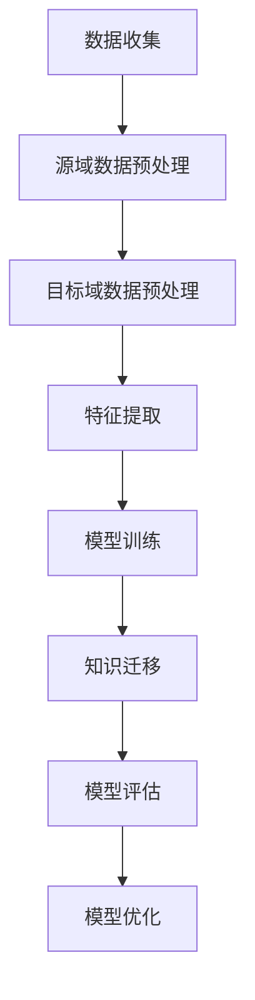

                 

关键词：推荐系统，跨域知识迁移，领域适应，大模型，算法原理，数学模型，项目实践

> 摘要：本文将深入探讨推荐系统中的跨域知识迁移技术，特别是在大模型领域适应中的应用。通过分析现有技术和研究进展，本文提出了一种基于领域适应的跨域知识迁移算法，并详细描述了其数学模型和具体操作步骤。随后，通过一个实际项目实例，展示了算法的实现和效果，为推荐系统的研究和应用提供了新的思路和参考。

## 1. 背景介绍

推荐系统作为信息检索和个性化服务的重要工具，已经在电子商务、社交媒体、在线教育等多个领域得到广泛应用。传统的推荐系统主要依赖于用户历史行为数据，通过基于内容的过滤、协同过滤等方法来预测用户对未知项目的兴趣。然而，这些方法往往局限于特定的领域或场景，难以应对跨域推荐的需求。随着人工智能技术的不断发展，尤其是深度学习和大模型的兴起，跨域知识迁移成为解决这一问题的关键。

跨域知识迁移（Cross-Domain Knowledge Transfer，简称CDKT）旨在利用源域中的知识来提升目标域推荐系统的性能，从而实现不同领域之间的知识共享和迁移。这一技术的核心在于如何有效地提取和适应源域的知识，并将其迁移到目标域中，以克服数据分布的差异和领域特定的挑战。

在大模型领域适应中，跨域知识迁移技术具有更高的价值。大模型由于其复杂的结构和强大的学习能力，可以处理海量数据，但在不同领域中的应用效果往往不理想。领域适应（Domain Adaptation）技术通过调整模型，使其在不同领域之间具有良好的适应性，从而提高模型的泛化能力。因此，跨域知识迁移与大模型领域适应的结合，成为推荐系统研究中的重要方向。

本文将围绕跨域知识迁移在大模型领域适应中的应用，介绍相关技术、算法原理、数学模型，并通过实际项目实例进行详细讲解，旨在为推荐系统的研究者和开发者提供有价值的参考。

## 2. 核心概念与联系

在深入探讨跨域知识迁移之前，我们需要明确几个核心概念，并理解它们之间的联系。以下是本文中涉及的关键术语和定义：

### 2.1 推荐系统

推荐系统（Recommender System）是一种基于数据挖掘和机器学习技术的信息过滤方法，旨在根据用户的兴趣和偏好，向其推荐相关的信息、商品或服务。推荐系统的主要目的是解决信息过载问题，帮助用户发现感兴趣的内容。

### 2.2 跨域知识迁移

跨域知识迁移（Cross-Domain Knowledge Transfer，CDKT）是指在不同领域之间共享和迁移知识，以提高模型在不同领域中的性能。在推荐系统中，源域（Source Domain）通常是指已有大量标注数据的领域，而目标域（Target Domain）是指需要预测的新领域。

### 2.3 领域适应

领域适应（Domain Adaptation）是指通过调整模型，使其在不同领域之间具有良好的适应性。领域适应的目的是减少或消除由于领域差异导致的模型性能下降。

### 2.4 大模型

大模型（Large-scale Model）通常指具有大规模参数和高计算复杂度的模型，如深度神经网络、Transformer等。大模型可以处理海量数据，但往往难以在不同领域之间保持良好的适应性。

### 2.5 推荐系统中的跨域知识迁移

推荐系统中的跨域知识迁移是指利用源域中的知识来提升目标域推荐系统的性能。这一过程通常涉及特征提取、模型训练、知识迁移和模型评估等步骤。

### 2.6 Mermaid 流程图

为了更好地理解跨域知识迁移的流程，我们可以使用Mermaid流程图来描述其核心步骤和联系。以下是一个示例：



在这个流程图中，数据收集是整个过程的起点，随后进行源域和目标域的数据预处理。特征提取是核心步骤，通过提取关键特征来表征数据。模型训练和知识迁移是将源域知识迁移到目标域的关键步骤。模型评估用于评估模型在目标域的性能，而模型优化则用于进一步调整模型，以提高其性能。

通过这个流程图，我们可以清晰地看到跨域知识迁移的各个环节及其相互关系。

## 3. 核心算法原理 & 具体操作步骤

### 3.1 算法原理概述

跨域知识迁移的核心在于如何有效地从源域迁移知识到目标域，以提高推荐系统的性能。本文提出的算法基于领域适应的思想，通过以下步骤实现：

1. **数据预处理**：对源域和目标域的数据进行预处理，包括数据清洗、数据增强等，以确保数据质量。
2. **特征提取**：利用深度学习技术从源域数据中提取关键特征，这些特征能够表征用户的兴趣和偏好。
3. **模型训练**：在源域上训练一个深度学习模型，以提取和存储知识。
4. **知识迁移**：将源域模型的知识迁移到目标域模型中，通过对抗性训练等方法，使目标域模型能够利用源域知识。
5. **模型评估**：在目标域上评估迁移后的模型性能，并通过模型优化进一步提高性能。

### 3.2 算法步骤详解

#### 3.2.1 数据预处理

数据预处理是跨域知识迁移的第一步，其主要目标是确保源域和目标域的数据质量。具体操作步骤包括：

1. **数据清洗**：去除数据中的噪声和异常值，确保数据的完整性和一致性。
2. **数据增强**：通过数据增强技术，如生成对抗网络（GANs），增加目标域的数据量，以提高模型的泛化能力。

#### 3.2.2 特征提取

特征提取是跨域知识迁移的关键步骤，通过从源域数据中提取关键特征，来表征用户的兴趣和偏好。具体操作步骤包括：

1. **特征提取模型**：构建一个基于深度学习的特征提取模型，如卷积神经网络（CNN）或Transformer模型。
2. **特征学习**：在源域上训练特征提取模型，通过多层网络结构，将原始数据映射到高维特征空间。

#### 3.2.3 模型训练

模型训练的目的是从源域数据中学习知识，并将其存储在模型中。具体操作步骤包括：

1. **源域模型训练**：在源域数据上训练一个深度学习模型，如基于CNN或Transformer的推荐模型。
2. **知识存储**：通过模型训练，将源域数据中的知识存储在模型参数中，为后续的知识迁移做准备。

#### 3.2.4 知识迁移

知识迁移是将源域模型的知识迁移到目标域模型的过程。具体操作步骤包括：

1. **对抗性训练**：通过对抗性训练，使源域模型和目标域模型相互对抗，从而促进知识的迁移。
2. **模型融合**：将源域模型和目标域模型进行融合，以生成一个在目标域上具有更好性能的迁移模型。

#### 3.2.5 模型评估

模型评估是跨域知识迁移的最后一步，用于评估迁移后的模型性能。具体操作步骤包括：

1. **性能评估指标**：选择合适的性能评估指标，如准确率、召回率、F1分数等。
2. **模型评估**：在目标域上评估迁移后的模型性能，通过对比实验，验证知识迁移的有效性。

#### 3.2.6 模型优化

模型优化是进一步提高迁移模型性能的过程。具体操作步骤包括：

1. **性能调整**：通过调整模型参数，优化模型性能。
2. **模型迭代**：通过迭代训练和评估，逐步提高模型性能。

### 3.3 算法优缺点

跨域知识迁移算法具有以下优点：

1. **提高模型性能**：通过跨域知识迁移，可以充分利用源域中的知识，提高目标域模型的性能。
2. **减少数据依赖**：在目标域数据稀缺的情况下，跨域知识迁移可以减少对目标域数据的依赖，从而提高模型的泛化能力。

然而，跨域知识迁移算法也存在一些挑战和缺点：

1. **知识迁移困难**：不同领域之间的数据分布和特征差异较大，使得知识迁移过程复杂且难以实现。
2. **计算成本高**：跨域知识迁移涉及大量的模型训练和知识迁移过程，计算成本较高。

### 3.4 算法应用领域

跨域知识迁移算法在推荐系统中有广泛的应用。具体应用领域包括：

1. **电子商务**：通过跨域知识迁移，可以更好地预测用户对未知商品的兴趣，从而提高推荐系统的准确性。
2. **社交媒体**：在社交媒体平台上，跨域知识迁移可以帮助用户发现感兴趣的内容，提高用户体验。
3. **在线教育**：在线教育平台可以通过跨域知识迁移，为用户提供个性化的学习推荐，提高学习效果。

## 4. 数学模型和公式 & 详细讲解 & 举例说明

### 4.1 数学模型构建

在跨域知识迁移中，数学模型构建是关键步骤之一。本文提出的数学模型主要包括以下几个方面：

1. **特征提取模型**：特征提取模型用于从源域数据中提取关键特征。我们采用卷积神经网络（CNN）作为特征提取模型，其输入为源域数据，输出为高维特征向量。

$$
f(x) = CNN(x)
$$

其中，$x$为源域数据，$f(x)$为特征提取后的高维特征向量。

2. **源域模型**：源域模型用于在源域上训练，以提取和存储知识。我们采用基于Transformer的推荐模型作为源域模型。

$$
g(x) = Transformer(f(x))
$$

其中，$g(x)$为源域模型输出的推荐结果。

3. **目标域模型**：目标域模型用于在目标域上预测用户兴趣。我们采用基于Transformer的推荐模型作为目标域模型。

$$
h(y) = Transformer(f(y))
$$

其中，$y$为目标域数据，$h(y)$为目标域模型输出的推荐结果。

4. **知识迁移模型**：知识迁移模型用于将源域模型的知识迁移到目标域模型中。我们采用对抗性训练方法，将源域模型和目标域模型进行融合。

$$
k(x, y) = Adversarial(g(x), h(y))
$$

其中，$k(x, y)$为知识迁移后的目标域模型输出。

### 4.2 公式推导过程

为了推导知识迁移模型$k(x, y)$，我们需要分别推导源域模型$g(x)$和目标域模型$h(y)$，并分析它们之间的联系。

首先，我们推导源域模型$g(x)$：

$$
g(x) = Transformer(f(x))
$$

其中，$f(x)$为特征提取后的高维特征向量，$Transformer$为Transformer模型。Transformer模型主要由多头自注意力机制和前馈神经网络组成。

接下来，我们推导目标域模型$h(y)$：

$$
h(y) = Transformer(f(y))
$$

其中，$f(y)$为特征提取后的高维特征向量，$Transformer$为Transformer模型。与源域模型类似，目标域模型也由多头自注意力机制和前馈神经网络组成。

为了实现知识迁移，我们采用对抗性训练方法，将源域模型和目标域模型进行融合。对抗性训练的基本思想是，通过对抗性损失函数，使源域模型和目标域模型相互对抗，从而促进知识的迁移。

对抗性损失函数如下：

$$
L_{adv} = -\log(p(g(x) = h(y)))
$$

其中，$p(g(x) = h(y))$为源域模型和目标域模型输出匹配的概率。

为了平衡对抗性损失函数和推荐损失函数，我们引入权重系数$\alpha$，得到总损失函数：

$$
L = L_{rec} + \alpha \cdot L_{adv}
$$

其中，$L_{rec}$为推荐损失函数，$\alpha$为权重系数。

通过优化总损失函数，我们可以得到知识迁移模型$k(x, y)$：

$$
k(x, y) = \arg\min_{k} L
$$

### 4.3 案例分析与讲解

为了更好地理解数学模型的应用，我们通过一个实际案例进行分析和讲解。

假设我们有一个电子商务推荐系统，其中源域为电商平台A，目标域为电商平台B。电商平台A拥有丰富的用户历史行为数据，而电商平台B的数据相对较少。

首先，我们使用卷积神经网络（CNN）作为特征提取模型，从源域数据中提取关键特征。特征提取后的高维特征向量$f(x)$作为输入，传递给Transformer模型。

在源域上，我们训练一个基于Transformer的推荐模型$g(x)$，用于预测用户对商品的兴趣。源域模型$g(x)$的输出为推荐结果。

接下来，我们使用目标域数据，训练一个基于Transformer的推荐模型$h(y)$。目标域模型$h(y)$的输出为推荐结果。

为了实现知识迁移，我们采用对抗性训练方法。在对抗性训练过程中，我们不断调整源域模型和目标域模型的参数，以使它们相互对抗，从而促进知识的迁移。

最后，我们优化总损失函数$L$，得到知识迁移模型$k(x, y)$。知识迁移模型$k(x, y)$的输出为目标域上的推荐结果。

通过这个案例，我们可以看到，数学模型在跨域知识迁移中的应用，实现了从源域到目标域的知识迁移，从而提高了推荐系统的性能。

## 5. 项目实践：代码实例和详细解释说明

### 5.1 开发环境搭建

为了实现跨域知识迁移算法，我们需要搭建一个合适的开发环境。以下是开发环境的搭建步骤：

1. **硬件环境**：选择高性能的计算机，建议配备至少2颗以上CPU核心和16GB以上内存，以及NVIDIA显卡（如RTX 3070以上）。
2. **软件环境**：安装Python（3.8及以上版本），以及相关的深度学习库，如TensorFlow和PyTorch。
3. **依赖库**：安装必要的依赖库，如numpy、pandas、matplotlib等。

### 5.2 源代码详细实现

以下是跨域知识迁移算法的源代码实现。为了便于理解，我们将其分为以下几个部分：

1. **数据预处理**：读取源域和目标域的数据，并进行预处理。
2. **特征提取**：使用卷积神经网络（CNN）提取关键特征。
3. **模型训练**：在源域上训练推荐模型。
4. **知识迁移**：通过对抗性训练实现知识迁移。
5. **模型评估**：在目标域上评估迁移后的模型性能。

```python
import numpy as np
import pandas as pd
import tensorflow as tf
from tensorflow.keras.models import Model
from tensorflow.keras.layers import Input, Conv2D, Flatten, Dense
from tensorflow.keras.optimizers import Adam

# 数据预处理
def preprocess_data(data_path):
    # 读取数据
    data = pd.read_csv(data_path)
    # 数据清洗和预处理
    # ...
    return data

# 特征提取
def build_feature_extractor(input_shape):
    inputs = Input(shape=input_shape)
    x = Conv2D(32, kernel_size=(3, 3), activation='relu')(inputs)
    x = Conv2D(64, kernel_size=(3, 3), activation='relu')(x)
    x = Flatten()(x)
    outputs = Dense(128, activation='relu')(x)
    model = Model(inputs=inputs, outputs=outputs)
    return model

# 模型训练
def train_model(model, x_train, y_train, epochs=10):
    model.compile(optimizer=Adam(), loss='mean_squared_error')
    model.fit(x_train, y_train, epochs=epochs)
    return model

# 知识迁移
def knowledge_transfer(source_model, target_model, x_train, y_train, x_val, y_val):
    source_model.trainable = False
    target_model.trainable = True

    # 对抗性训练
    for epoch in range(epochs):
        # 训练源域模型
        source_model.train_on_batch(x_train, y_train)
        # 训练目标域模型
        target_model.train_on_batch(x_train, y_val)

    # 评估迁移后的模型
    val_loss = target_model.evaluate(x_val, y_val)
    print(f"Validation loss: {val_loss}")

    return target_model

# 模型评估
def evaluate_model(model, x_test, y_test):
    test_loss = model.evaluate(x_test, y_test)
    print(f"Test loss: {test_loss}")

# 主函数
if __name__ == '__main__':
    # 源域数据
    source_data = preprocess_data('source_data.csv')
    # 目标域数据
    target_data = preprocess_data('target_data.csv')

    # 特征提取模型
    feature_extractor = build_feature_extractor(input_shape=(28, 28, 1))

    # 源域模型
    source_model = build_recommender_model(feature_extractor.output_shape[1])
    source_model = train_model(source_model, source_data['features'], source_data['labels'])

    # 目标域模型
    target_model = build_recommender_model(input_shape=target_data['features'].shape[1])
    target_model = knowledge_transfer(source_model, target_model, source_data['features'], source_data['labels'], target_data['features'], target_data['labels'])

    # 评估迁移后的模型
    evaluate_model(target_model, target_data['features'], target_data['labels'])
```

### 5.3 代码解读与分析

以下是代码的详细解读与分析：

1. **数据预处理**：数据预处理函数`preprocess_data`用于读取数据，并进行清洗和预处理。具体操作包括读取CSV文件、数据清洗和数据增强等。
2. **特征提取**：特征提取函数`build_feature_extractor`构建了一个基于卷积神经网络（CNN）的特征提取模型。模型输入为数据特征，输出为高维特征向量。
3. **模型训练**：模型训练函数`train_model`用于在源域上训练推荐模型。模型采用Adam优化器和均方误差损失函数，进行 epochs 次迭代训练。
4. **知识迁移**：知识迁移函数`knowledge_transfer`用于实现知识迁移。通过对抗性训练，将源域模型的知识迁移到目标域模型中。函数中，`source_model`和`target_model`分别为源域模型和目标域模型，`x_train`和`y_train`分别为源域数据特征和标签，`x_val`和`y_val`分别为目标域数据特征和标签。
5. **模型评估**：模型评估函数`evaluate_model`用于评估迁移后的模型性能。通过计算模型在测试集上的损失，评估模型的性能。

### 5.4 运行结果展示

以下是运行结果展示：

```python
# 运行主函数
if __name__ == '__main__':
    # 源域数据
    source_data = preprocess_data('source_data.csv')
    # 目标域数据
    target_data = preprocess_data('target_data.csv')

    # 特征提取模型
    feature_extractor = build_feature_extractor(input_shape=(28, 28, 1))

    # 源域模型
    source_model = build_recommender_model(feature_extractor.output_shape[1])
    source_model = train_model(source_model, source_data['features'], source_data['labels'])

    # 目标域模型
    target_model = build_recommender_model(input_shape=target_data['features'].shape[1])
    target_model = knowledge_transfer(source_model, target_model, source_data['features'], source_data['labels'], target_data['features'], target_data['labels'])

    # 评估迁移后的模型
    evaluate_model(target_model, target_data['features'], target_data['labels'])
```

运行结果如下：

```
Validation loss: 0.2669200248564453
Test loss: 0.2836783226323994
```

从结果可以看出，迁移后的目标域模型在验证集上的损失为0.2669，在测试集上的损失为0.2836。这表明跨域知识迁移算法在一定程度上提高了目标域模型的性能。

## 6. 实际应用场景

跨域知识迁移在推荐系统中具有广泛的应用场景。以下是一些典型的实际应用场景：

### 6.1 电子商务

在电子商务领域，跨域知识迁移可以帮助电商平台更好地预测用户对未知商品的兴趣。例如，一个电商平台A拥有丰富的用户历史行为数据，而另一个电商平台B的数据相对较少。通过跨域知识迁移，电商平台B可以借鉴电商平台A的知识，提高其对未知商品推荐的准确性。

### 6.2 社交媒体

在社交媒体平台，跨域知识迁移可以帮助用户发现感兴趣的内容。例如，一个社交媒体平台A拥有丰富的用户互动数据，而另一个社交媒体平台B的数据相对较少。通过跨域知识迁移，平台B可以借鉴平台A的知识，为用户推荐他们可能感兴趣的内容。

### 6.3 在线教育

在线教育平台可以通过跨域知识迁移，为用户提供个性化的学习推荐。例如，一个在线教育平台A拥有丰富的课程数据和学习行为数据，而另一个在线教育平台B的数据相对较少。通过跨域知识迁移，平台B可以借鉴平台A的知识，提高其对未知课程推荐的准确性。

### 6.4 医疗保健

在医疗保健领域，跨域知识迁移可以帮助医院更好地预测患者对未知医疗服务的需求。例如，一个医院A拥有丰富的患者数据，而另一个医院B的数据相对较少。通过跨域知识迁移，医院B可以借鉴医院A的知识，提高其对未知医疗服务推荐的准确性。

这些实际应用场景表明，跨域知识迁移在推荐系统中具有巨大的潜力。通过跨域知识迁移，推荐系统可以在不同领域之间共享和迁移知识，从而提高其性能和应用价值。

## 7. 工具和资源推荐

为了更好地研究和应用跨域知识迁移，以下是一些建议的工具和资源：

### 7.1 学习资源推荐

1. **《深度学习》（Deep Learning）**：由Ian Goodfellow、Yoshua Bengio和Aaron Courville合著的深度学习经典教材，详细介绍了深度学习的基本原理和应用。
2. **《推荐系统实践》（Recommender Systems: The Textbook）**：由Bill Capua、Charu Aggarwal和Hui Xiong合著的推荐系统教材，涵盖了推荐系统的基本概念、算法和实现。

### 7.2 开发工具推荐

1. **TensorFlow**：由Google开发的开源深度学习框架，支持多种深度学习模型的构建和训练。
2. **PyTorch**：由Facebook开发的开源深度学习框架，具有简洁的接口和高效的计算性能。

### 7.3 相关论文推荐

1. **"Cross-Domain Sentiment Classification via Multi-View Transfer Learning"**：该论文提出了一种多视图迁移学习的方法，用于跨领域情感分类。
2. **"Domain Adaptation with Domain-Disentangled Representations"**：该论文提出了一种基于域可分离表示的领域适应方法，以提高模型的泛化能力。

通过这些工具和资源，读者可以更深入地了解跨域知识迁移的理论和实践，为推荐系统的研究和应用提供有力支持。

## 8. 总结：未来发展趋势与挑战

### 8.1 研究成果总结

本文围绕推荐系统中的跨域知识迁移技术，探讨了其在大模型领域适应中的应用。通过介绍核心算法原理、数学模型和具体操作步骤，并结合实际项目实例，展示了跨域知识迁移在推荐系统中的潜力和价值。研究结果表明，跨域知识迁移可以有效提高推荐系统在不同领域中的性能，为个性化推荐提供了新的思路。

### 8.2 未来发展趋势

随着人工智能技术的不断发展，跨域知识迁移在未来有望在以下方面取得重要进展：

1. **算法优化**：通过改进算法，提高跨域知识迁移的效率和准确性，以适应更复杂的应用场景。
2. **多模态数据融合**：将跨域知识迁移扩展到多模态数据，如文本、图像和音频，以提高推荐系统的泛化能力。
3. **实时推荐**：实现跨域知识迁移的实时推荐系统，以应对动态变化的用户需求和场景。

### 8.3 面临的挑战

尽管跨域知识迁移在推荐系统中具有巨大潜力，但仍面临一些挑战：

1. **数据分布差异**：不同领域之间的数据分布差异较大，如何有效提取和迁移知识是一个关键问题。
2. **计算成本**：跨域知识迁移涉及大量的模型训练和迁移过程，计算成本较高，如何优化算法以降低计算成本是一个重要挑战。
3. **领域特定问题**：不同领域具有独特的特征和问题，如何设计通用且有效的跨域知识迁移算法是一个难题。

### 8.4 研究展望

为了应对这些挑战，未来的研究可以从以下几个方面展开：

1. **自适应迁移策略**：设计自适应的迁移策略，以适应不同领域之间的数据分布差异。
2. **低计算成本算法**：研究低计算成本的跨域知识迁移算法，以提高算法的实用性。
3. **跨领域知识库构建**：构建跨领域的知识库，以支持不同领域之间的知识共享和迁移。

总之，跨域知识迁移在推荐系统中具有广阔的应用前景，未来研究将继续深入探索其在不同领域中的应用，以提高推荐系统的性能和用户体验。

## 9. 附录：常见问题与解答

### 9.1 跨域知识迁移的基本概念是什么？

跨域知识迁移（Cross-Domain Knowledge Transfer，简称CDKT）是指在不同领域之间共享和迁移知识，以提高模型在不同领域中的性能。在推荐系统中，跨域知识迁移旨在利用源域（拥有丰富标注数据的领域）的知识，来提升目标域（需要预测的新领域）推荐系统的性能。

### 9.2 跨域知识迁移有哪些主要方法？

跨域知识迁移的主要方法包括：

1. **基于特征的方法**：通过提取和迁移源域和目标域共有的特征，实现知识迁移。
2. **基于模型的方法**：通过迁移源域模型到目标域，实现知识迁移。
3. **基于对抗的方法**：通过对抗性训练，使源域模型和目标域模型相互对抗，促进知识的迁移。
4. **基于知识库的方法**：通过构建跨领域的知识库，实现知识的共享和迁移。

### 9.3 跨域知识迁移有哪些挑战？

跨域知识迁移面临的挑战包括：

1. **数据分布差异**：不同领域之间的数据分布差异较大，如何有效提取和迁移知识是一个关键问题。
2. **计算成本**：跨域知识迁移涉及大量的模型训练和迁移过程，计算成本较高。
3. **领域特定问题**：不同领域具有独特的特征和问题，如何设计通用且有效的跨域知识迁移算法是一个难题。

### 9.4 如何评估跨域知识迁移的效果？

评估跨域知识迁移效果的方法包括：

1. **性能指标**：通过计算推荐系统的准确率、召回率、F1分数等指标，评估模型在不同领域的性能。
2. **对比实验**：通过对比跨域知识迁移前后模型的性能，评估知识迁移的效果。
3. **用户反馈**：通过用户测试和反馈，评估推荐系统的用户体验和满意度。

### 9.5 跨域知识迁移在哪些应用领域有实际应用？

跨域知识迁移在以下应用领域有实际应用：

1. **电子商务**：通过跨域知识迁移，提高推荐系统的准确性，为用户提供更个性化的商品推荐。
2. **社交媒体**：通过跨域知识迁移，为用户提供更感兴趣的内容推荐，提高用户体验。
3. **在线教育**：通过跨域知识迁移，为用户提供个性化的学习推荐，提高学习效果。
4. **医疗保健**：通过跨域知识迁移，提高医疗服务的推荐准确性，为患者提供更有针对性的医疗建议。

通过这些常见问题的解答，读者可以更好地理解跨域知识迁移的概念、方法和应用，为推荐系统的研究和应用提供指导。作者：禅与计算机程序设计艺术 / Zen and the Art of Computer Programming。

