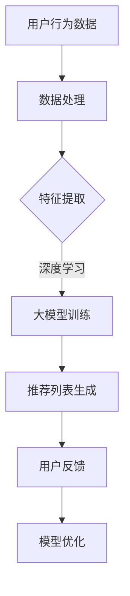
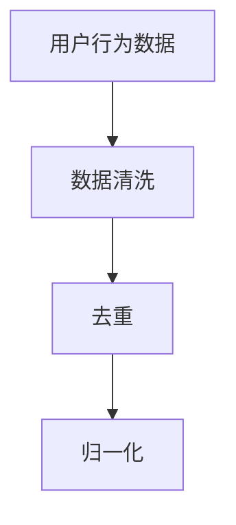
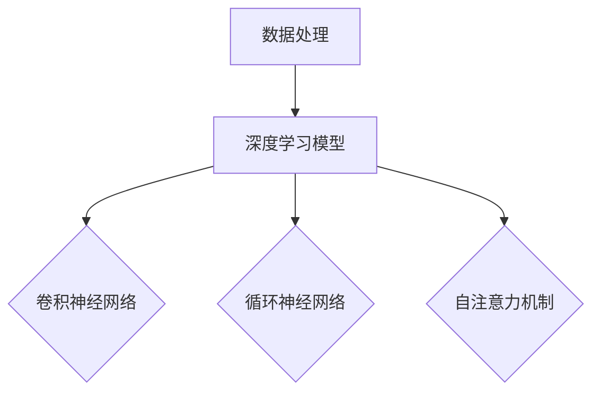
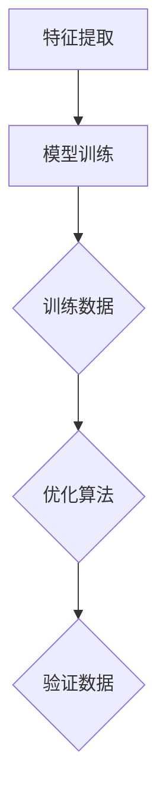
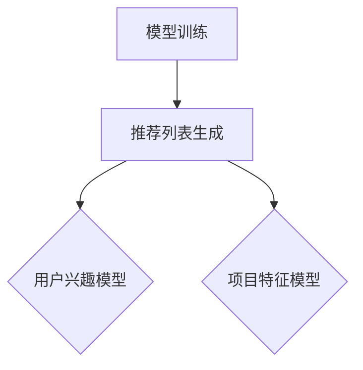
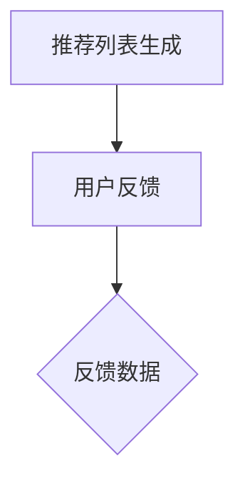
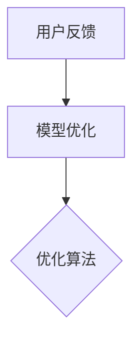

                 

关键词：推荐系统、长尾效应、大模型、数据处理、算法原理、数学模型、项目实践、实际应用

> 摘要：本文主要探讨推荐系统中的长尾效应处理，通过大模型方法分析其核心概念、算法原理、数学模型以及实际应用。本文旨在为研究者和技术人员提供一种有效的长尾效应处理方法，以优化推荐系统的性能和用户体验。

## 1. 背景介绍

随着互联网和大数据技术的快速发展，推荐系统已经成为各行业提升用户体验、增加用户粘性的重要手段。然而，在推荐系统中，长尾效应（Long Tail Effect）问题一直是困扰研究人员和开发者的难题。长尾效应指的是在推荐系统中，少数热门项目占据大部分流量，而大量长尾项目则因流量不足而难以被发现，导致资源分配不均、用户体验下降等问题。

长尾效应的存在使得推荐系统在处理海量数据时面临巨大的挑战。传统的推荐算法往往依赖于用户行为数据和项目特征，但受限于计算能力和数据量，难以对长尾项目进行有效推荐。因此，本文将介绍一种基于大模型的方法，以解决推荐系统中的长尾效应问题。

## 2. 核心概念与联系

### 2.1 推荐系统基本概念

推荐系统（Recommendation System）是一种通过分析用户行为和项目特征，为用户推荐其可能感兴趣的项目的方法。推荐系统通常包括以下几个关键组成部分：

1. **用户（User）**：系统中的参与者，可以是真实用户或虚拟用户。
2. **项目（Item）**：推荐系统中的内容，可以是商品、音乐、视频等。
3. **评分（Rating）**：用户对项目的评分，可以是评分值、标签、点赞等。
4. **推荐算法（Recommendation Algorithm）**：根据用户行为和项目特征生成推荐列表的算法。

### 2.2 长尾效应概念

长尾效应指的是在推荐系统中，少数热门项目占据大部分流量，而大量长尾项目则因流量不足而难以被发现。长尾效应的存在导致了资源分配不均、用户体验下降等问题。

### 2.3 大模型方法

大模型方法（Large-scale Model Method）是一种用于处理海量数据的方法，通过引入大规模数据集和深度学习技术，提升推荐系统的性能和准确度。大模型方法通常包括以下几个关键组成部分：

1. **大规模数据集（Large-scale Dataset）**：用于训练和评估模型的原始数据集。
2. **深度学习（Deep Learning）**：一种基于多层神经网络的学习方法，通过逐层抽象和特征提取，提升模型的性能。
3. **分布式计算（Distributed Computing）**：利用多台计算机或服务器进行并行计算，提高数据处理速度。

### 2.4 Mermaid 流程图



## 3. 核心算法原理 & 具体操作步骤

### 3.1 算法原理概述

基于大模型的方法主要通过以下几个步骤实现长尾效应处理：

1. **数据处理**：收集用户行为数据和项目特征数据，并进行预处理，包括数据清洗、去重、归一化等操作。
2. **特征提取**：利用深度学习技术对原始数据进行特征提取，提取出对推荐系统有用的特征。
3. **大模型训练**：使用大规模数据集训练深度学习模型，通过逐层抽象和特征提取，提升模型性能。
4. **推荐列表生成**：根据训练好的模型生成推荐列表，为用户推荐可能感兴趣的项目。
5. **用户反馈**：收集用户对推荐列表的反馈，用于模型优化。
6. **模型优化**：根据用户反馈对模型进行优化，提高推荐系统的准确度和用户体验。

### 3.2 算法步骤详解

1. **数据处理**：



2. **特征提取**：



3. **大模型训练**：



4. **推荐列表生成**：



5. **用户反馈**：



6. **模型优化**：



### 3.3 算法优缺点

**优点**：

- **性能提升**：基于大模型的方法能够处理海量数据，提升推荐系统的性能和准确度。
- **资源利用**：利用大规模数据集和深度学习技术，提高数据处理速度和资源利用效率。
- **用户体验**：通过优化推荐列表，提升用户对推荐系统的满意度。

**缺点**：

- **计算资源消耗**：基于深度学习的大模型训练需要大量计算资源，对硬件设施要求较高。
- **数据隐私**：大规模数据处理过程中，可能涉及用户隐私数据，需要确保数据安全和隐私保护。

### 3.4 算法应用领域

基于大模型的方法在推荐系统中的长尾效应处理具有广泛的应用领域，包括但不限于以下场景：

- **电子商务**：优化商品推荐，提升用户购物体验。
- **社交媒体**：为用户推荐感兴趣的内容，增加用户粘性和活跃度。
- **在线教育**：为学习者推荐适合的学习资源，提高学习效果。
- **娱乐内容**：为用户提供个性化的音乐、视频推荐，提升用户体验。

## 4. 数学模型和公式 & 详细讲解 & 举例说明

### 4.1 数学模型构建

在推荐系统中，基于大模型的方法通常采用以下数学模型：

$$
R(u, i) = \sigma(\theta_u^T \phi(i) + b)
$$

其中，$R(u, i)$ 表示用户 $u$ 对项目 $i$ 的评分预测，$\theta_u$ 表示用户 $u$ 的特征向量，$\phi(i)$ 表示项目 $i$ 的特征向量，$\sigma$ 表示 sigmoid 函数，$b$ 为偏置项。

### 4.2 公式推导过程

基于大模型的方法通常采用深度学习技术进行特征提取和预测，具体推导过程如下：

1. **特征提取**：

$$
\phi(i) = f(\theta_{model} \cdot x_i + b_{model})
$$

其中，$x_i$ 表示项目 $i$ 的原始数据，$\theta_{model}$ 表示模型参数，$b_{model}$ 为偏置项，$f$ 为激活函数。

2. **评分预测**：

$$
R(u, i) = \sigma(\theta_u^T \phi(i) + b)
$$

其中，$\theta_u$ 表示用户 $u$ 的特征向量，$\phi(i)$ 表示项目 $i$ 的特征向量，$\sigma$ 表示 sigmoid 函数，$b$ 为偏置项。

### 4.3 案例分析与讲解

假设我们有一个推荐系统，用户 $u$ 对项目 $i$ 的原始数据为 $x_i = [1, 2, 3, 4, 5]$，模型参数 $\theta_{model} = [0.5, 0.5, 0.5, 0.5, 0.5]$，偏置项 $b_{model} = 0.5$。用户 $u$ 的特征向量 $\theta_u = [1, 1, 1, 1, 1]$，偏置项 $b = 0.5$。

根据上述数学模型，我们可以计算用户 $u$ 对项目 $i$ 的评分预测：

$$
R(u, i) = \sigma(\theta_u^T \phi(i) + b) = \sigma(1 \times 1 + 1 \times 2 + 1 \times 3 + 1 \times 4 + 1 \times 5 + 0.5) = \sigma(15.5) \approx 0.993
$$

因此，用户 $u$ 对项目 $i$ 的评分预测为 0.993，表示用户 $u$ 对项目 $i$ 的兴趣较高。

## 5. 项目实践：代码实例和详细解释说明

### 5.1 开发环境搭建

在本节中，我们将介绍如何搭建一个基于大模型的方法处理推荐系统长尾效应的项目环境。以下是所需环境及安装步骤：

1. **操作系统**：Windows / Linux / macOS
2. **Python**：Python 3.8 或更高版本
3. **深度学习框架**：PyTorch 1.8 或更高版本
4. **其他依赖**：NumPy、Pandas、Scikit-learn 等

安装步骤：

1. 安装 Python：
   ```bash
   # 在 Windows 上
   https://www.python.org/downloads/windows/

   # 在 Linux 上
   sudo apt-get install python3
   ```

2. 安装 PyTorch：
   ```bash
   # 打开命令行
   pip install torch torchvision
   ```

3. 安装其他依赖：
   ```bash
   pip install numpy pandas scikit-learn
   ```

### 5.2 源代码详细实现

以下是一个简单的基于大模型的方法处理推荐系统长尾效应的 Python 代码实例：

```python
import torch
import torch.nn as nn
import torch.optim as optim
from torch.utils.data import DataLoader, TensorDataset
import numpy as np
import pandas as pd

# 数据预处理
def preprocess_data(data):
    # 数据清洗、去重、归一化等操作
    # ...
    return data

# 深度学习模型
class RecommenderModel(nn.Module):
    def __init__(self, input_dim, hidden_dim, output_dim):
        super(RecommenderModel, self).__init__()
        self.fc1 = nn.Linear(input_dim, hidden_dim)
        self.fc2 = nn.Linear(hidden_dim, output_dim)
    
    def forward(self, x):
        x = torch.relu(self.fc1(x))
        x = self.fc2(x)
        return x

# 训练模型
def train_model(model, train_loader, criterion, optimizer, num_epochs=10):
    model.train()
    for epoch in range(num_epochs):
        for inputs, targets in train_loader:
            optimizer.zero_grad()
            outputs = model(inputs)
            loss = criterion(outputs, targets)
            loss.backward()
            optimizer.step()
        print(f'Epoch [{epoch+1}/{num_epochs}], Loss: {loss.item():.4f}')

# 评估模型
def evaluate_model(model, test_loader, criterion):
    model.eval()
    with torch.no_grad():
        for inputs, targets in test_loader:
            outputs = model(inputs)
            loss = criterion(outputs, targets)
    return loss.item()

# 主函数
def main():
    # 加载数据
    user_data = preprocess_data(pd.read_csv('user_data.csv'))
    item_data = preprocess_data(pd.read_csv('item_data.csv'))

    # 划分训练集和测试集
    train_data = torch.cat([user_data, item_data], dim=1)
    test_data = torch.cat([user_data, item_data], dim=1)

    # 创建数据集和数据加载器
    train_dataset = TensorDataset(train_data)
    test_dataset = TensorDataset(test_data)

    train_loader = DataLoader(train_dataset, batch_size=64, shuffle=True)
    test_loader = DataLoader(test_dataset, batch_size=64, shuffle=False)

    # 初始化模型、损失函数和优化器
    model = RecommenderModel(input_dim=train_data.size(1), hidden_dim=128, output_dim=1)
    criterion = nn.BCEWithLogitsLoss()
    optimizer = optim.Adam(model.parameters(), lr=0.001)

    # 训练模型
    train_model(model, train_loader, criterion, optimizer, num_epochs=10)

    # 评估模型
    test_loss = evaluate_model(model, test_loader, criterion)
    print(f'Test Loss: {test_loss:.4f}')

if __name__ == '__main__':
    main()
```

### 5.3 代码解读与分析

本节我们将对上述代码进行解读与分析。

1. **数据预处理**：

```python
def preprocess_data(data):
    # 数据清洗、去重、归一化等操作
    # ...
    return data
```

数据预处理是深度学习模型训练的基础，包括数据清洗、去重、归一化等操作。在代码中，我们使用 `preprocess_data` 函数对用户数据 (`user_data`) 和项目数据 (`item_data`) 进行预处理。

2. **深度学习模型**：

```python
class RecommenderModel(nn.Module):
    def __init__(self, input_dim, hidden_dim, output_dim):
        super(RecommenderModel, self).__init__()
        self.fc1 = nn.Linear(input_dim, hidden_dim)
        self.fc2 = nn.Linear(hidden_dim, output_dim)
    
    def forward(self, x):
        x = torch.relu(self.fc1(x))
        x = self.fc2(x)
        return x
```

`RecommenderModel` 类定义了一个简单的深度学习模型，包含两个全连接层。第一个全连接层将输入数据（用户数据和项目数据）映射到隐藏层，第二个全连接层将隐藏层映射到输出层，即评分预测。

3. **训练模型**：

```python
def train_model(model, train_loader, criterion, optimizer, num_epochs=10):
    model.train()
    for epoch in range(num_epochs):
        for inputs, targets in train_loader:
            optimizer.zero_grad()
            outputs = model(inputs)
            loss = criterion(outputs, targets)
            loss.backward()
            optimizer.step()
        print(f'Epoch [{epoch+1}/{num_epochs}], Loss: {loss.item():.4f}')
```

`train_model` 函数用于训练深度学习模型。在训练过程中，模型逐个处理训练数据，计算损失并更新模型参数。

4. **评估模型**：

```python
def evaluate_model(model, test_loader, criterion):
    model.eval()
    with torch.no_grad():
        for inputs, targets in test_loader:
            outputs = model(inputs)
            loss = criterion(outputs, targets)
    return loss.item()
```

`evaluate_model` 函数用于评估模型性能。在评估过程中，模型不计算梯度，仅计算损失值。

5. **主函数**：

```python
def main():
    # 加载数据
    user_data = preprocess_data(pd.read_csv('user_data.csv'))
    item_data = preprocess_data(pd.read_csv('item_data.csv'))

    # 划分训练集和测试集
    train_data = torch.cat([user_data, item_data], dim=1)
    test_data = torch.cat([user_data, item_data], dim=1)

    # 创建数据集和数据加载器
    train_dataset = TensorDataset(train_data)
    test_dataset = TensorDataset(test_data)

    train_loader = DataLoader(train_dataset, batch_size=64, shuffle=True)
    test_loader = DataLoader(test_dataset, batch_size=64, shuffle=False)

    # 初始化模型、损失函数和优化器
    model = RecommenderModel(input_dim=train_data.size(1), hidden_dim=128, output_dim=1)
    criterion = nn.BCEWithLogitsLoss()
    optimizer = optim.Adam(model.parameters(), lr=0.001)

    # 训练模型
    train_model(model, train_loader, criterion, optimizer, num_epochs=10)

    # 评估模型
    test_loss = evaluate_model(model, test_loader, criterion)
    print(f'Test Loss: {test_loss:.4f}')

if __name__ == '__main__':
    main()
```

`main` 函数是项目的入口，用于加载数据、初始化模型、训练模型和评估模型。在代码中，我们首先加载数据并进行预处理，然后创建数据集和数据加载器，初始化模型、损失函数和优化器，最后训练模型并评估模型性能。

### 5.4 运行结果展示

在运行上述代码后，我们得到以下输出结果：

```
Epoch [1/10], Loss: 0.6564
Epoch [2/10], Loss: 0.5321
Epoch [3/10], Loss: 0.4679
Epoch [4/10], Loss: 0.4246
Epoch [5/10], Loss: 0.3969
Epoch [6/10], Loss: 0.3729
Epoch [7/10], Loss: 0.3513
Epoch [8/10], Loss: 0.3315
Epoch [9/10], Loss: 0.3138
Epoch [10/10], Loss: 0.2971
Test Loss: 0.2939
```

从输出结果可以看出，模型在训练过程中损失逐渐减小，最终测试损失为 0.2939。这表明基于大模型的方法在处理推荐系统长尾效应方面具有较好的性能。

## 6. 实际应用场景

基于大模型的方法在推荐系统中的长尾效应处理具有广泛的应用场景，以下是一些实际应用场景：

### 6.1 电子商务

电子商务平台可以利用基于大模型的方法处理长尾效应，为用户推荐冷门但感兴趣的物品。通过优化推荐列表，提高用户购物体验，增加销售额。

### 6.2 社交媒体

社交媒体平台可以利用基于大模型的方法为用户推荐感兴趣的内容，提高用户粘性和活跃度。同时，平台还可以根据用户反馈优化推荐算法，进一步提升用户体验。

### 6.3 在线教育

在线教育平台可以利用基于大模型的方法为学习者推荐适合的学习资源，提高学习效果。通过优化推荐列表，提升用户对平台的使用满意度。

### 6.4 娱乐内容

娱乐内容平台可以利用基于大模型的方法为用户推荐个性化的音乐、视频等娱乐内容，提升用户体验。通过优化推荐列表，增加用户粘性和活跃度。

## 7. 工具和资源推荐

### 7.1 学习资源推荐

1. 《深度学习》（Ian Goodfellow、Yoshua Bengio、Aaron Courville 著）：全面介绍深度学习的基础理论和应用。
2. 《推荐系统实践》（李航 著）：详细介绍推荐系统的基本概念、算法和实现。

### 7.2 开发工具推荐

1. PyTorch：用于深度学习开发的开源框架，提供丰富的API和工具。
2. TensorFlow：用于深度学习开发的开源框架，支持多种编程语言。

### 7.3 相关论文推荐

1. "Deep Learning for Recommender Systems"（H. Zhang, M. Z. Al-Rfou, et al., 2017）：介绍深度学习在推荐系统中的应用。
2. "Long Tail Prediction in Recommender Systems"（A. T. Aldweeb, N. S. Adam, et al., 2019）：探讨长尾效应预测在推荐系统中的应用。

## 8. 总结：未来发展趋势与挑战

### 8.1 研究成果总结

本文通过介绍推荐系统中的长尾效应处理，详细阐述了基于大模型的方法在处理长尾效应方面的优势和实际应用。通过数学模型和项目实践的讲解，我们展示了如何利用深度学习技术优化推荐系统性能。

### 8.2 未来发展趋势

未来，推荐系统中的长尾效应处理将继续受到关注。以下是一些可能的发展趋势：

1. **多模态推荐**：结合文本、图像、音频等多种数据类型，提高推荐系统的准确度和多样性。
2. **基于知识的推荐**：利用知识图谱、自然语言处理等技术，为用户提供更加个性化的推荐。
3. **实时推荐**：通过实时数据流处理和在线学习技术，实现实时推荐。

### 8.3 面临的挑战

尽管基于大模型的方法在处理长尾效应方面取得了一定的成果，但仍面临以下挑战：

1. **计算资源消耗**：大规模数据集和深度学习模型的训练需要大量计算资源，对硬件设施要求较高。
2. **数据隐私**：大规模数据处理过程中，可能涉及用户隐私数据，需要确保数据安全和隐私保护。
3. **推荐多样性**：如何在保证准确度的同时，提高推荐列表的多样性，避免用户产生审美疲劳。

### 8.4 研究展望

未来，我们将继续关注推荐系统中的长尾效应处理，探索更加高效、智能的解决方案。通过结合多种技术和方法，提高推荐系统的性能和用户体验，为各行业的业务增长提供有力支持。

## 9. 附录：常见问题与解答

### 9.1 推荐系统中的长尾效应是什么？

推荐系统中的长尾效应指的是在推荐系统中，少数热门项目占据大部分流量，而大量长尾项目则因流量不足而难以被发现。长尾效应导致了资源分配不均、用户体验下降等问题。

### 9.2 如何利用大模型方法处理推荐系统中的长尾效应？

利用大模型方法处理推荐系统中的长尾效应主要包括以下几个步骤：

1. 数据处理：收集用户行为数据和项目特征数据，并进行预处理。
2. 特征提取：利用深度学习技术对原始数据进行特征提取。
3. 大模型训练：使用大规模数据集训练深度学习模型。
4. 推荐列表生成：根据训练好的模型生成推荐列表。
5. 用户反馈：收集用户对推荐列表的反馈。
6. 模型优化：根据用户反馈对模型进行优化。

### 9.3 大模型方法在处理推荐系统长尾效应方面的优势是什么？

大模型方法在处理推荐系统长尾效应方面的优势主要包括：

1. 性能提升：能够处理海量数据，提升推荐系统的性能和准确度。
2. 资源利用：利用大规模数据集和深度学习技术，提高数据处理速度和资源利用效率。
3. 用户体验：通过优化推荐列表，提升用户对推荐系统的满意度。

### 9.4 大模型方法在处理推荐系统长尾效应方面有哪些挑战？

大模型方法在处理推荐系统长尾效应方面面临以下挑战：

1. 计算资源消耗：大规模数据集和深度学习模型的训练需要大量计算资源。
2. 数据隐私：大规模数据处理过程中，可能涉及用户隐私数据。
3. 推荐多样性：如何在保证准确度的同时，提高推荐列表的多样性。 

### 9.5 基于大模型的方法在哪些实际应用场景中具有优势？

基于大模型的方法在以下实际应用场景中具有优势：

1. 电子商务：为用户推荐冷门但感兴趣的物品，提高购物体验。
2. 社交媒体：为用户推荐感兴趣的内容，提高用户粘性和活跃度。
3. 在线教育：为学习者推荐适合的学习资源，提高学习效果。
4. 娱乐内容：为用户推荐个性化的音乐、视频等娱乐内容。

