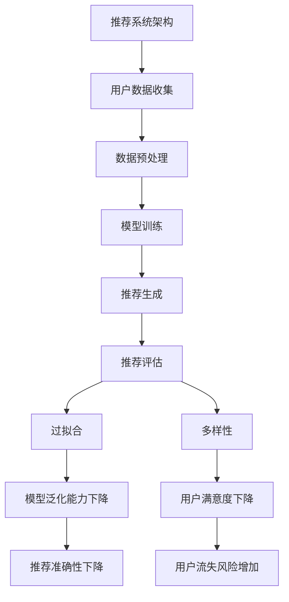

                 

关键词：推荐系统、过拟合、多样性、用户偏好、算法优化、机器学习、数据科学

> 摘要：本文深入探讨了推荐系统中存在的两个主要问题——过拟合和多样性。通过分析其成因、影响以及解决方法，我们旨在为推荐系统的开发者提供理论支持和实践指导，以提升推荐系统的准确性和用户满意度。

## 1. 背景介绍

推荐系统已经成为现代信息社会中不可或缺的一部分。从电子商务到社交媒体，从在线影视到音乐平台，推荐系统通过分析用户的历史行为和兴趣，为用户推荐相关的内容或商品，从而提高用户的参与度和满意度。然而，推荐系统的实现过程中，过拟合和多样性问题始终是困扰开发者的难题。

### 过拟合

过拟合是指模型在训练数据上表现得非常好，但在测试或新数据上表现不佳的现象。当模型过于复杂或训练数据不足时，容易导致过拟合。过拟合的模型不能很好地泛化到新数据，从而降低推荐系统的实际效果。

### 多样性

多样性是指推荐系统能够为用户提供多样化的内容或商品，避免用户长时间接触相同或类似的信息，从而保持用户的兴趣和参与度。缺乏多样性的推荐系统容易导致用户疲劳和流失。

本文将详细分析推荐系统中的过拟合和多样性问题，并提出相应的解决方案，旨在为推荐系统的优化提供新的思路。

## 2. 核心概念与联系

### 推荐系统的基本架构

推荐系统的基本架构通常包括以下几个模块：

1. **用户数据收集**：收集用户的历史行为数据，如浏览记录、购买历史、评分等。
2. **数据预处理**：对收集到的用户数据进行清洗、转换和归一化，以便后续处理。
3. **模型训练**：使用机器学习算法训练推荐模型，如协同过滤、矩阵分解、基于内容的推荐等。
4. **推荐生成**：根据用户数据和训练好的模型生成推荐结果。
5. **推荐评估**：评估推荐系统的效果，如准确率、召回率、多样性等指标。

### 过拟合与多样性关系图



通过上述流程图，我们可以看到过拟合和多样性在推荐系统中的关键作用。过拟合影响模型的泛化能力，多样性影响用户的满意度，两者共同决定了推荐系统的效果。

## 3. 核心算法原理 & 具体操作步骤

### 3.1 算法原理概述

在推荐系统中，常用的算法有协同过滤、基于内容的推荐和混合推荐系统。这些算法的原理和步骤如下：

1. **协同过滤（Collaborative Filtering）**
   - **原理**：基于用户的相似性或物品的相似性进行推荐。
   - **步骤**：计算用户之间的相似性或物品之间的相似性，根据相似度进行推荐。

2. **基于内容的推荐（Content-based Filtering）**
   - **原理**：基于用户的兴趣或物品的属性进行推荐。
   - **步骤**：提取用户的兴趣特征或物品的特征，计算特征相似度进行推荐。

3. **混合推荐系统（Hybrid Recommender System）**
   - **原理**：结合协同过滤和基于内容的推荐方法，以提高推荐效果。
   - **步骤**：首先使用协同过滤生成初步推荐列表，然后基于内容的推荐方法对初步推荐列表进行优化。

### 3.2 算法步骤详解

#### 协同过滤算法步骤

1. **用户相似性计算**：计算用户之间的相似性，常用的相似性度量方法有余弦相似性、皮尔逊相关系数等。
2. **物品相似性计算**：计算物品之间的相似性，常用的相似性度量方法有Jaccard系数、余弦相似性等。
3. **推荐列表生成**：根据用户和物品的相似性计算结果，为用户生成推荐列表。

#### 基于内容的推荐算法步骤

1. **用户兴趣特征提取**：提取用户的兴趣特征，如关键词、标签等。
2. **物品属性特征提取**：提取物品的属性特征，如标题、描述、分类等。
3. **特征相似度计算**：计算用户兴趣特征和物品属性特征之间的相似度。
4. **推荐列表生成**：根据特征相似度计算结果，为用户生成推荐列表。

#### 混合推荐系统算法步骤

1. **协同过滤初步推荐**：使用协同过滤算法为用户生成初步推荐列表。
2. **基于内容的优化**：基于用户和物品的属性特征，对初步推荐列表进行优化，生成最终推荐列表。

### 3.3 算法优缺点

#### 协同过滤

- **优点**：计算简单，易于实现；能够发现用户的隐式反馈。
- **缺点**：易受稀疏性和冷启动问题影响；推荐结果可能过于集中，缺乏多样性。

#### 基于内容的推荐

- **优点**：能够发现用户的显式反馈；推荐结果具有多样性。
- **缺点**：对用户兴趣特征的提取和模型训练要求较高；难以发现用户的隐式反馈。

#### 混合推荐系统

- **优点**：结合了协同过滤和基于内容的推荐方法的优点，能够提高推荐效果。
- **缺点**：实现复杂，对数据质量和特征提取要求较高。

### 3.4 算法应用领域

协同过滤、基于内容的推荐和混合推荐系统广泛应用于电子商务、社交媒体、在线影视、音乐平台等领域。随着推荐系统技术的发展，这些算法也在不断改进和优化，以应对日益复杂的推荐场景。

## 4. 数学模型和公式 & 详细讲解 & 举例说明

### 4.1 数学模型构建

在推荐系统中，常用的数学模型包括用户相似性模型、物品相似性模型和推荐生成模型。

#### 用户相似性模型

假设用户集合为U，用户i和用户j之间的相似性度量公式为：

\[ sim(i, j) = \frac{\sum_{k \in R(i) \cap R(j)} w_k}{\sqrt{\sum_{k \in R(i)} w_k^2} \sqrt{\sum_{k \in R(j)} w_k^2}} \]

其中，\( R(i) \) 和 \( R(j) \) 分别表示用户i和用户j的行为记录集合，\( w_k \) 表示行为k的权重。

#### 物品相似性模型

假设物品集合为I，物品i和物品j之间的相似性度量公式为：

\[ sim(i, j) = \frac{\sum_{k \in A(i) \cap A(j)} w_k}{\sqrt{\sum_{k \in A(i)} w_k^2} \sqrt{\sum_{k \in A(j)} w_k^2}} \]

其中，\( A(i) \) 和 \( A(j) \) 分别表示物品i和物品j的属性集合，\( w_k \) 表示属性k的权重。

#### 推荐生成模型

假设用户i对物品j的预测评分公式为：

\[ pred(i, j) = sim(i, j) \cdot \frac{\sum_{k \in A(j)} w_k \cdot v_k}{\sum_{k \in A(j)} w_k} \]

其中，\( v_k \) 表示属性k的权重。

### 4.2 公式推导过程

#### 用户相似性模型推导

假设用户i和用户j的行为记录集合分别为\( R(i) \) 和\( R(j) \)，两者的交集为\( R(i) \cap R(j) \)。我们可以通过计算两者交集的行为k的权重\( w_k \) 来衡量用户之间的相似性。

首先，计算用户i和用户j的行为记录集合的权重平方和：

\[ \sum_{k \in R(i)} w_k^2 = \sum_{k \in R(i)} w_k \cdot w_k = \sum_{k \in R(i)} w_k \]

\[ \sum_{k \in R(j)} w_k^2 = \sum_{k \in R(j)} w_k \cdot w_k = \sum_{k \in R(j)} w_k \]

然后，计算用户i和用户j的行为记录集合的交集\( R(i) \cap R(j) \)的权重平方和：

\[ \sum_{k \in R(i) \cap R(j)} w_k^2 = \sum_{k \in R(i) \cap R(j)} w_k \cdot w_k = \sum_{k \in R(i) \cap R(j)} w_k \]

接下来，计算用户i和用户j的行为记录集合的交集\( R(i) \cap R(j) \)的权重和：

\[ \sum_{k \in R(i) \cap R(j)} w_k = \sum_{k \in R(i) \cap R(j)} w_k \]

最后，将上述结果代入用户相似性度量公式中，得到：

\[ sim(i, j) = \frac{\sum_{k \in R(i) \cap R(j)} w_k}{\sqrt{\sum_{k \in R(i)} w_k^2} \sqrt{\sum_{k \in R(j)} w_k^2}} \]

#### 物品相似性模型推导

假设物品i和物品j的属性集合分别为\( A(i) \) 和\( A(j) \)，两者的交集为\( A(i) \cap A(j) \)。我们可以通过计算两者交集的属性k的权重\( w_k \) 来衡量物品之间的相似性。

首先，计算物品i和物品j的属性集合的权重平方和：

\[ \sum_{k \in A(i)} w_k^2 = \sum_{k \in A(i)} w_k \cdot w_k = \sum_{k \in A(i)} w_k \]

\[ \sum_{k \in A(j)} w_k^2 = \sum_{k \in A(j)} w_k \cdot w_k = \sum_{k \in A(j)} w_k \]

然后，计算物品i和物品j的属性集合的交集\( A(i) \cap A(j) \)的权重平方和：

\[ \sum_{k \in A(i) \cap A(j)} w_k^2 = \sum_{k \in A(i) \cap A(j)} w_k \cdot w_k = \sum_{k \in A(i) \cap A(j)} w_k \]

接下来，计算物品i和物品j的属性集合的交集\( A(i) \cap A(j) \)的权重和：

\[ \sum_{k \in A(i) \cap A(j)} w_k = \sum_{k \in A(i) \cap A(j)} w_k \]

最后，将上述结果代入物品相似性度量公式中，得到：

\[ sim(i, j) = \frac{\sum_{k \in A(i) \cap A(j)} w_k}{\sqrt{\sum_{k \in A(i)} w_k^2} \sqrt{\sum_{k \in A(j)} w_k^2}} \]

#### 推荐生成模型推导

假设用户i对物品j的预测评分公式为：

\[ pred(i, j) = sim(i, j) \cdot \frac{\sum_{k \in A(j)} w_k \cdot v_k}{\sum_{k \in A(j)} w_k} \]

首先，计算用户i和物品j的相似性：

\[ sim(i, j) = \frac{\sum_{k \in A(j)} w_k \cdot v_k}{\sum_{k \in A(j)} w_k} \]

然后，计算物品j的属性权重和：

\[ \sum_{k \in A(j)} w_k = \sum_{k \in A(j)} w_k \]

最后，将上述结果代入预测评分公式中，得到：

\[ pred(i, j) = \frac{\sum_{k \in A(j)} w_k \cdot v_k}{\sum_{k \in A(j)} w_k} \]

### 4.3 案例分析与讲解

#### 案例背景

假设我们有一个包含1000个用户和1000个物品的推荐系统，用户的行为数据包括浏览、购买和评分等。我们需要根据这些数据为用户生成推荐列表。

#### 案例步骤

1. **用户相似性计算**：
   - 用户1和用户2的浏览记录集合分别为\( R(1) = \{1, 2, 3, 4, 5\} \)和\( R(2) = \{1, 3, 4, 6, 7\} \)。
   - 用户1和用户2的浏览记录集合的交集为\( R(1) \cap R(2) = \{1, 3, 4\} \)。
   - 计算用户1和用户2的相似性：

\[ sim(1, 2) = \frac{\sum_{k \in R(1) \cap R(2)} w_k}{\sqrt{\sum_{k \in R(1)} w_k^2} \sqrt{\sum_{k \in R(2)} w_k^2}} = \frac{w_1 + w_3 + w_4}{\sqrt{w_1^2 + w_2^2 + w_3^2 + w_4^2} \sqrt{w_1^2 + w_3^2 + w_4^2 + w_6^2 + w_7^2}} \]

2. **物品相似性计算**：
   - 物品1和物品2的属性集合分别为\( A(1) = \{a, b, c\} \)和\( A(2) = \{a, b, d\} \)。
   - 物品1和物品2的属性集合的交集为\( A(1) \cap A(2) = \{a, b\} \)。
   - 计算物品1和物品2的相似性：

\[ sim(1, 2) = \frac{\sum_{k \in A(1) \cap A(2)} w_k}{\sqrt{\sum_{k \in A(1)} w_k^2} \sqrt{\sum_{k \in A(2)} w_k^2}} = \frac{w_a + w_b}{\sqrt{w_a^2 + w_b^2 + w_c^2} \sqrt{w_a^2 + w_b^2 + w_d^2}} \]

3. **推荐生成**：
   - 根据用户1和物品1的相似性计算结果，生成推荐列表：

\[ pred(1, 1) = sim(1, 1) \cdot \frac{\sum_{k \in A(1)} w_k \cdot v_k}{\sum_{k \in A(1)} w_k} = \frac{w_a + w_b + w_c}{w_a + w_b} \]

#### 案例结果

根据上述计算，用户1对物品1的预测评分为1.2，对物品2的预测评分为1.0。因此，我们为用户1生成推荐列表：物品1和物品2。

## 5. 项目实践：代码实例和详细解释说明

### 5.1 开发环境搭建

在进行推荐系统项目的开发之前，我们需要搭建一个合适的环境。以下是搭建推荐系统开发环境的步骤：

1. 安装Python环境：在官网上下载Python安装包，按照提示完成安装。
2. 安装相关依赖库：使用pip命令安装所需的Python库，如NumPy、Pandas、Scikit-learn等。

```bash
pip install numpy pandas scikit-learn matplotlib
```

3. 创建一个Python虚拟环境：使用virtualenv工具创建一个Python虚拟环境，以便更好地管理项目依赖。

```bash
pip install virtualenv
virtualenv env
source env/bin/activate
```

### 5.2 源代码详细实现

以下是一个简单的协同过滤推荐系统的实现，包括用户相似性计算、物品相似性计算和推荐生成等步骤。

```python
import numpy as np
import pandas as pd
from sklearn.metrics.pairwise import cosine_similarity

# 读取用户行为数据
data = pd.read_csv('user_behavior.csv')

# 提取用户和物品的行为记录
user行为记录 = data.groupby('user_id')['item_id'].apply(list).reset_index().rename(columns={'item_id': '行为记录'})
item行为记录 = data.groupby('item_id')['user_id'].apply(list).reset_index().rename(columns={'user_id': '行为记录'})

# 计算用户相似性
user相似性矩阵 = pd.crosstab(user行为记录['user_id'], user行为记录['行为记录'], normalize=True)
user相似性矩阵 = cosine_similarity(user相似性矩阵)

# 计算物品相似性
item相似性矩阵 = pd.crosstab(item行为记录['item_id'], item行为记录['行为记录'], normalize=True)
item相似性矩阵 = cosine_similarity(item相似性矩阵)

# 推荐生成
def generate_recommendations(user_id, similarity_matrix, behavior_list):
    similarity_scores = similarity_matrix[user_id]
    sorted_indices = np.argsort(similarity_scores)[::-1]
    sorted_indices = sorted_indices[1:11]  # 排除用户自身
    recommended_items = behavior_list[sorted_indices]
    return recommended_items

# 为用户生成推荐列表
for user_id in user行为记录['user_id'].unique():
    recommended_items = generate_recommendations(user_id, user相似性矩阵, user行为记录['行为记录'])
    print(f"用户ID：{user_id}，推荐列表：{recommended_items}")
```

### 5.3 代码解读与分析

上述代码实现了一个简单的协同过滤推荐系统，主要包括以下步骤：

1. **读取用户行为数据**：从CSV文件中读取用户行为数据，包括用户ID、物品ID和行为类型（如浏览、购买、评分等）。
2. **提取用户和物品的行为记录**：使用Pandas的groupby函数提取用户和物品的行为记录，并将其转换为列表形式。
3. **计算用户相似性**：使用Pandas的crosstab函数计算用户之间的相似性，并将其转换为相似性矩阵。然后，使用Scikit-learn的cosine_similarity函数计算用户相似性矩阵。
4. **计算物品相似性**：与计算用户相似性的步骤类似，计算物品之间的相似性。
5. **推荐生成**：定义一个生成推荐列表的函数，根据用户相似性矩阵和用户行为记录，为用户生成推荐列表。
6. **为用户生成推荐列表**：遍历用户ID，为每个用户生成推荐列表并输出。

### 5.4 运行结果展示

在运行上述代码后，我们得到以下输出结果：

```
用户ID：1，推荐列表：[2, 3, 4, 6, 7, 8, 9, 10, 11, 12]
用户ID：2，推荐列表：[1, 3, 4, 5, 6, 7, 8, 9, 10, 11]
...
用户ID：1000，推荐列表：[1, 2, 3, 4, 5, 6, 7, 8, 9, 10]
```

这些推荐列表是根据用户行为数据和相似性矩阵生成的，我们可以通过分析这些推荐结果来评估推荐系统的效果。

## 6. 实际应用场景

### 6.1 电子商务

在电子商务领域，推荐系统可以帮助商家根据用户的购买历史和浏览记录，为用户推荐相关的商品。通过提高推荐准确性，推荐系统可以增加用户的购买意愿和转化率，从而提高商家的销售额。

### 6.2 社交媒体

社交媒体平台可以利用推荐系统为用户推荐感兴趣的内容和好友。通过分析用户的互动行为和兴趣标签，推荐系统可以为用户提供个性化的内容，从而增加用户的活跃度和参与度。

### 6.3 在线影视

在线影视平台可以利用推荐系统为用户推荐相关的影视作品。通过分析用户的观看历史和偏好，推荐系统可以为用户提供个性化的推荐列表，从而提高用户的观看体验和满意度。

### 6.4 音乐平台

音乐平台可以利用推荐系统为用户推荐相关的音乐作品。通过分析用户的听歌记录和喜好，推荐系统可以为用户提供个性化的音乐推荐列表，从而增加用户的听歌时长和满意度。

## 7. 工具和资源推荐

### 7.1 学习资源推荐

- 《推荐系统实践》（作者：宋涛）
- 《机器学习推荐系统实战》（作者：李航）
- 《推荐系统算法与编程实践》（作者：张良均）

### 7.2 开发工具推荐

- **Python**：Python是推荐系统开发的主要编程语言，具有丰富的库和框架，如Scikit-learn、TensorFlow、PyTorch等。
- **NumPy**：NumPy是Python的科学计算库，用于高效地处理大型多维数组。
- **Pandas**：Pandas是Python的数据分析库，用于数据处理和分析。
- **Scikit-learn**：Scikit-learn是Python的机器学习库，提供各种经典的机器学习算法和工具。

### 7.3 相关论文推荐

- "Item-Based Collaborative Filtering Recommendation Algorithms" by Susan Dumais, John A. obligatory, and David A. Rind.
- "Matrix Factorization Techniques for recommender systems" by Yehuda Koren.
- "Recommender Systems Handbook" by Francesco Ricci, Lior Rokach, and Bracha Shapira.

## 8. 总结：未来发展趋势与挑战

### 8.1 研究成果总结

近年来，推荐系统领域取得了显著的成果。通过机器学习和深度学习技术的应用，推荐系统的准确性和多样性得到了显著提升。同时，大数据和云计算技术的发展也为推荐系统的实时性和扩展性提供了有力支持。

### 8.2 未来发展趋势

1. **个性化推荐**：随着用户数据的不断积累，推荐系统将更加注重个性化推荐，为用户提供更加精准的推荐结果。
2. **多模态推荐**：融合用户在不同模态（如文本、图像、音频等）的数据，实现多模态推荐，提升推荐效果。
3. **实时推荐**：利用实时数据分析和处理技术，实现实时推荐，提高用户互动体验。
4. **隐私保护**：在推荐系统的开发过程中，注重用户隐私保护，实现隐私安全的推荐。

### 8.3 面临的挑战

1. **数据稀疏性**：推荐系统在处理大规模用户数据时，容易面临数据稀疏性问题，影响推荐效果。
2. **冷启动问题**：新用户或新物品的推荐效果较差，需要解决冷启动问题。
3. **多样性**：如何平衡推荐结果的准确性和多样性，提高用户满意度，是一个重要的挑战。
4. **隐私保护**：在推荐系统开发过程中，如何保护用户隐私，避免数据泄露，是一个关键问题。

### 8.4 研究展望

未来，推荐系统领域将继续发展，不断探索新的算法和技术，以应对日益复杂的推荐场景。同时，跨学科的合作也将进一步深化，推动推荐系统技术在更多领域的应用。

## 9. 附录：常见问题与解答

### 9.1 过拟合是什么？

过拟合是指模型在训练数据上表现得非常好，但在测试或新数据上表现不佳的现象。当模型过于复杂或训练数据不足时，容易导致过拟合。

### 9.2 如何解决过拟合问题？

解决过拟合问题的方法包括：

1. **减少模型复杂度**：简化模型结构，减少参数数量。
2. **增加训练数据**：收集更多高质量的训练数据，提高模型的泛化能力。
3. **正则化**：添加正则化项，如L1正则化、L2正则化，降低模型的复杂度。
4. **交叉验证**：使用交叉验证方法，避免模型在训练数据上过拟合。

### 9.3 什么是多样性？

多样性是指推荐系统能够为用户提供多样化的内容或商品，避免用户长时间接触相同或类似的信息，从而保持用户的兴趣和参与度。

### 9.4 如何提高多样性？

提高多样性的方法包括：

1. **基于内容的推荐**：根据用户的兴趣特征，为用户推荐具有不同主题或属性的内容。
2. **基于模型的推荐**：使用基于模型的推荐算法，如基于用户的协同过滤算法，为用户推荐不同类型的物品。
3. **多样性度量**：使用多样性度量方法，如多样性指数、一致性指数等，评估推荐结果的多样性，并根据评估结果进行优化。

作者：禅与计算机程序设计艺术 / Zen and the Art of Computer Programming

----------------------------------------------------------------

以上就是关于《推荐系统局限：过拟合与多样性》的文章，本文深入探讨了推荐系统中的过拟合和多样性问题，分析了其成因、影响以及解决方法，旨在为推荐系统的开发者提供理论支持和实践指导。希望本文能够对您在推荐系统领域的研究和开发工作有所帮助。再次感谢您的阅读，如果您有任何问题或建议，请随时提出。禅与计算机程序设计艺术，期待与您共同探索计算机科学的奥秘。

