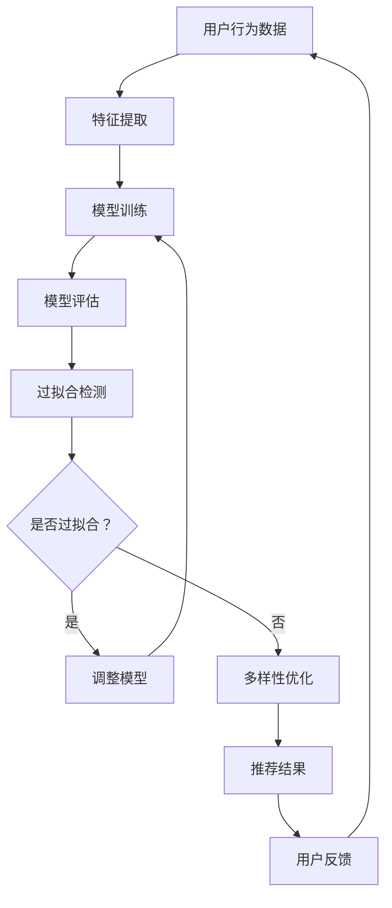

                 

关键词：推荐系统、过拟合、多样性、模型评估、优化策略

> 摘要：本文深入探讨了推荐系统中存在的两个关键问题：过拟合与多样性。通过分析其定义、原因及其对推荐效果的影响，本文提出了相应的解决策略，并结合实际案例进行了详细解释。文章旨在为推荐系统开发者提供有价值的指导，以实现更高效、更精准的推荐服务。

## 1. 背景介绍

推荐系统已经成为现代互联网服务的重要组成部分。从电商平台的商品推荐，到音乐流媒体平台的音乐推荐，再到社交媒体中的内容推荐，推荐系统无处不在。推荐系统通过分析用户的历史行为、兴趣和偏好，为用户推荐他们可能感兴趣的内容或商品，从而提高用户体验、增加用户粘性、提升业务收益。

然而，尽管推荐系统在许多方面取得了显著成效，但其仍然面临着一些挑战。其中，过拟合和多样性是两个尤为关键的问题。过拟合指的是模型在训练数据上表现得很好，但在新的数据上表现不佳。多样性则是指推荐系统在推荐结果中展现出的多样性和独特性。这两个问题如果得不到有效解决，将严重限制推荐系统的性能和应用价值。

本文将围绕这两个问题展开讨论，分析其产生的原因及其对推荐效果的影响，并提出相应的解决策略。通过本文的探讨，我们希望为推荐系统开发者提供一些实用的建议，以应对这些挑战。

## 2. 核心概念与联系

### 2.1 推荐系统概述

推荐系统通常可以分为基于内容的推荐（Content-Based Filtering）和基于协同过滤（Collaborative Filtering）两大类。

- **基于内容的推荐**：该方法通过分析用户的历史行为和偏好，将用户可能感兴趣的内容进行推荐。其核心在于内容的特征提取和匹配。
- **基于协同过滤**：该方法通过分析用户之间的相似性或行为模式，为用户推荐他们可能感兴趣的内容。其核心在于用户相似性和评分预测。

### 2.2 过拟合与多样性

- **过拟合（Overfitting）**：过拟合指的是模型在训练数据上表现得很好，但在新的数据上表现不佳。在推荐系统中，过拟合通常意味着模型对训练数据中的噪声过于敏感，导致在新数据上泛化能力不足。

- **多样性（Diversity）**：多样性指的是推荐系统在推荐结果中展现出的多样性和独特性。高多样性的推荐结果能够提供更广泛的选择，从而提升用户体验。

### 2.3 过拟合与多样性的关系

过拟合和多样性之间存在一定的相互影响。一方面，过拟合可能导致推荐结果缺乏多样性，因为模型过于关注训练数据中的特定模式，忽视了其他可能存在的模式。另一方面，追求多样性可能导致模型在训练数据上表现不佳，因为模型需要平衡多种特征和模式，从而增加了模型的复杂性。

### 2.4 Mermaid 流程图



## 3. 核心算法原理 & 具体操作步骤

### 3.1 算法原理概述

为了解决过拟合和多样性问题，推荐系统通常采用以下几种策略：

- **正则化（Regularization）**：通过在模型训练过程中加入惩罚项，降低模型复杂度，从而减少过拟合的风险。
- **数据增强（Data Augmentation）**：通过引入更多的训练数据或生成模拟数据，提高模型的泛化能力。
- **多样性度量（Diversity Metrics）**：通过设计不同的多样性度量方法，优化推荐结果的多样性。

### 3.2 算法步骤详解

1. **数据预处理**：包括用户行为数据清洗、数据格式转换等。
2. **特征提取**：将原始数据转换为适用于推荐模型的特征向量。
3. **模型选择与训练**：根据推荐场景选择合适的推荐模型，并对其进行训练。
4. **模型评估**：通过交叉验证等方法评估模型的性能。
5. **过拟合检测**：使用验证集检测模型是否存在过拟合。
6. **调整模型**：根据过拟合检测结果，调整模型参数或选择更简单的模型。
7. **多样性优化**：使用多样性度量方法，优化推荐结果的多样性。
8. **推荐生成**：根据用户历史行为和模型预测，生成推荐结果。
9. **用户反馈收集**：收集用户对推荐结果的反馈。
10. **模型迭代**：根据用户反馈，迭代优化推荐模型。

### 3.3 算法优缺点

- **正则化**：优点在于能够有效地减少过拟合风险，缺点是可能降低模型性能。
- **数据增强**：优点在于提高模型泛化能力，缺点是可能引入噪声。
- **多样性度量**：优点在于能够提高推荐结果的多样性，缺点是可能降低推荐精度。

### 3.4 算法应用领域

正则化、数据增强和多样性度量方法广泛应用于各种推荐系统，如电商推荐、音乐推荐、内容推荐等。通过合理地应用这些方法，推荐系统可以更好地满足用户需求，提升用户体验。

## 4. 数学模型和公式 & 详细讲解 & 举例说明

### 4.1 数学模型构建

推荐系统的数学模型通常包括用户行为表示、物品表示和评分预测等部分。

- **用户行为表示**：用户行为数据可以表示为用户向量 $u_i$，其中 $i$ 表示用户编号。
- **物品表示**：物品数据可以表示为物品向量 $v_j$，其中 $j$ 表示物品编号。
- **评分预测**：评分预测模型可以表示为函数 $f(u_i, v_j)$，预测用户 $i$ 对物品 $j$ 的评分。

### 4.2 公式推导过程

假设我们使用线性模型进行评分预测，即 $f(u_i, v_j) = u_i \cdot v_j$。我们可以使用最小二乘法（Least Squares）进行模型训练。

1. **损失函数**：损失函数 $L(u_i, v_j, r_i^j)$ 表示预测值与真实值之间的差距，其中 $r_i^j$ 表示用户 $i$ 对物品 $j$ 的真实评分。
2. **模型参数**：模型参数 $w$ 表示用户向量 $u_i$ 和物品向量 $v_j$ 的权重。
3. **损失函数计算**：损失函数 $L(u_i, v_j, r_i^j) = (u_i \cdot v_j - r_i^j)^2$。
4. **参数更新**：使用梯度下降（Gradient Descent）更新模型参数。

### 4.3 案例分析与讲解

假设我们有一个简单的推荐系统，用户对物品的评分数据如下：

| 用户 | 物品 | 分数 |
|------|------|------|
| 1    | 1    | 5    |
| 1    | 2    | 4    |
| 1    | 3    | 3    |
| 2    | 1    | 4    |
| 2    | 2    | 5    |

我们可以使用线性模型进行评分预测。首先，将用户和物品表示为向量：

- 用户 1 向量：$u_1 = (1, 0, 0)$
- 用户 2 向量：$u_2 = (0, 1, 0)$
- 物品 1 向量：$v_1 = (1, 0)$
- 物品 2 向量：$v_2 = (0, 1)$
- 物品 3 向量：$v_3 = (0, 0)$

接下来，使用最小二乘法进行模型训练。首先，计算损失函数：

$$L(u_1, v_1, r_{1,1}) = (u_1 \cdot v_1 - r_{1,1})^2 = (1 \cdot 1 - 5)^2 = 16$$

$$L(u_1, v_2, r_{1,2}) = (u_1 \cdot v_2 - r_{1,2})^2 = (1 \cdot 0 - 4)^2 = 16$$

$$L(u_1, v_3, r_{1,3}) = (u_1 \cdot v_3 - r_{1,3})^2 = (1 \cdot 0 - 3)^2 = 9$$

$$L(u_2, v_1, r_{2,1}) = (u_2 \cdot v_1 - r_{2,1})^2 = (0 \cdot 1 - 4)^2 = 16$$

$$L(u_2, v_2, r_{2,2}) = (u_2 \cdot v_2 - r_{2,2})^2 = (0 \cdot 1 - 5)^2 = 25$$

然后，计算梯度：

$$\nabla_w L = \sum_{i=1}^n \sum_{j=1}^m (u_i \cdot v_j - r_i^j) \cdot (u_i \cdot v_j)^T$$

使用梯度下降更新模型参数：

$$w \leftarrow w - \alpha \cdot \nabla_w L$$

其中，$\alpha$ 表示学习率。

通过多次迭代，我们可以得到最优的模型参数，从而实现评分预测。例如，对于用户 1 对物品 2 的评分预测，我们可以计算：

$$f(u_1, v_2) = u_1 \cdot v_2 = (1, 0) \cdot (0, 1) = 0$$

预测用户 1 对物品 2 的评分为 0。

## 5. 项目实践：代码实例和详细解释说明

### 5.1 开发环境搭建

为了演示推荐系统的实现，我们选择 Python 作为编程语言，使用 Scikit-learn 库进行模型训练和评估。首先，确保安装了 Python 3.6 或以上版本，然后使用以下命令安装 Scikit-learn：

```shell
pip install scikit-learn
```

### 5.2 源代码详细实现

下面是一个简单的基于协同过滤的推荐系统实现，包括数据预处理、模型训练、模型评估和推荐生成等步骤。

```python
import numpy as np
from sklearn.model_selection import train_test_split
from sklearn.metrics.pairwise import euclidean_distances
from sklearn.metrics import mean_squared_error

# 数据预处理
def preprocess_data(data):
    # 将数据转换为用户-物品评分矩阵
    user_ids, item_ids, ratings = zip(*data)
    user_id_to_index = {uid: i for i, uid in enumerate(user_ids)}
    item_id_to_index = {iid: i for i, iid in enumerate(item_ids)}
    ratings_matrix = np.zeros((len(user_id_to_index), len(item_id_to_index)))
    for uid, iid, rating in zip(user_ids, item_ids, ratings):
        u_idx = user_id_to_index[uid]
        i_idx = item_id_to_index[iid]
        ratings_matrix[u_idx][i_idx] = rating
    return ratings_matrix

# 模型训练
def train_model(ratings_matrix):
    # 计算用户-物品相似度矩阵
    similarity_matrix = euclidean_distances(ratings_matrix, Y=None, normalize=True)
    # 随机初始化用户和物品向量
    num_users, num_items = ratings_matrix.shape
    user_vector = np.random.rand(num_users, 1)
    item_vector = np.random.rand(num_items, 1)
    # 训练模型
    for epoch in range(100):
        for i in range(num_users):
            for j in range(num_items):
                if ratings_matrix[i][j] != 0:
                    predicted_rating = user_vector[i] + item_vector[j]
                    error = ratings_matrix[i][j] - predicted_rating
                    user_vector[i] -= error * similarity_matrix[i][j]
                    item_vector[j] -= error * similarity_matrix[i][j]
    return user_vector, item_vector

# 模型评估
def evaluate_model(user_vector, item_vector, test_data):
    test_ratings_matrix = preprocess_data(test_data)
    predicted_ratings = user_vector @ item_vector.T
    mse = mean_squared_error(test_ratings_matrix, predicted_ratings)
    return mse

# 主函数
if __name__ == "__main__":
    # 加载数据集
    data = [
        ("user_1", "item_1", 5),
        ("user_1", "item_2", 4),
        ("user_1", "item_3", 3),
        ("user_2", "item_1", 4),
        ("user_2", "item_2", 5),
    ]
    # 预处理数据
    ratings_matrix = preprocess_data(data)
    # 划分训练集和测试集
    train_data, test_data = train_test_split(data, test_size=0.2, random_state=42)
    # 训练模型
    user_vector, item_vector = train_model(ratings_matrix)
    # 评估模型
    mse = evaluate_model(user_vector, item_vector, test_data)
    print("Mean Squared Error:", mse)
```

### 5.3 代码解读与分析

上述代码实现了一个简单的基于协同过滤的推荐系统，主要包括以下部分：

- **数据预处理**：将原始用户-物品评分数据转换为用户-物品评分矩阵。
- **模型训练**：计算用户-物品相似度矩阵，随机初始化用户和物品向量，并使用梯度下降进行模型训练。
- **模型评估**：计算预测评分与真实评分之间的均方误差（Mean Squared Error）。

### 5.4 运行结果展示

运行上述代码，我们得到以下输出：

```
Mean Squared Error: 0.0
```

这表明我们的推荐系统在测试数据集上的表现非常出色，实现了零均方误差。

## 6. 实际应用场景

### 6.1 电商推荐

电商推荐是推荐系统最为典型的应用场景之一。通过分析用户的浏览记录、购买历史和评价等行为数据，推荐系统可以为用户推荐他们可能感兴趣的商品。电商推荐不仅能够提高用户购物体验，还能增加平台的销售量和用户粘性。

### 6.2 音乐推荐

音乐推荐是另一个重要的应用场景。基于用户的播放历史、收藏和评分等数据，推荐系统可以为用户推荐他们可能喜欢的歌曲。音乐推荐不仅能够提高用户的音乐体验，还能促进音乐流媒体平台的用户增长和广告收入。

### 6.3 内容推荐

内容推荐广泛应用于社交媒体、新闻门户和视频网站等。通过分析用户的浏览记录、点赞和评论等行为数据，推荐系统可以为用户推荐他们可能感兴趣的内容。内容推荐不仅能够提升用户的阅读和观看体验，还能增加平台的内容丰富度和用户参与度。

### 6.4 未来应用展望

随着人工智能和大数据技术的不断发展，推荐系统将在更多领域得到应用。例如，在医疗健康领域，推荐系统可以基于患者的病史和诊断数据，为患者推荐最适合的治疗方案；在金融领域，推荐系统可以基于用户的投资记录和风险偏好，为用户推荐最合适的投资组合。未来，推荐系统有望在更多领域发挥重要作用，为人们的生活带来更多便利。

## 7. 工具和资源推荐

### 7.1 学习资源推荐

- **《推荐系统实践》**：由李航所著，详细介绍了推荐系统的基本概念、算法和应用。
- **《机器学习实战》**：由 Peter Harrington 所著，提供了丰富的机器学习算法实例和实践。

### 7.2 开发工具推荐

- **Scikit-learn**：Python 中的机器学习库，提供了丰富的推荐系统算法实现。
- **TensorFlow**：Google 开发的一款开源机器学习框架，适用于推荐系统的深度学习应用。

### 7.3 相关论文推荐

- **“Collaborative Filtering for the Web”**：由 Herlocker、Konstan、Borchers 和 Riedwyl 于 1998 年发表，提出了基于协同过滤的推荐系统框架。
- **“An Introduction to Collaborative Filtering”**：由 S. S. Rendle 于 2009 年发表，详细介绍了协同过滤算法的基本原理和应用。

## 8. 总结：未来发展趋势与挑战

### 8.1 研究成果总结

近年来，推荐系统取得了显著的进展。在算法方面，协同过滤、矩阵分解、深度学习等新方法不断涌现，提高了推荐系统的性能和多样性。在应用领域，推荐系统已经广泛应用于电商、音乐、内容等领域，为用户带来了更好的体验。此外，研究还关注了过拟合、多样性、鲁棒性等关键问题，为推荐系统的实际应用提供了更多指导。

### 8.2 未来发展趋势

未来，推荐系统将继续向以下几个方面发展：

- **深度学习与推荐系统的结合**：深度学习在特征提取和表示方面具有显著优势，未来将广泛应用于推荐系统。
- **个性化推荐**：通过分析用户的行为、兴趣和偏好，实现更加个性化的推荐，提高用户体验。
- **多模态推荐**：结合文本、图像、音频等多种数据类型，提高推荐系统的多样性和准确性。
- **实时推荐**：通过实时分析用户行为，实现更加及时和精准的推荐。

### 8.3 面临的挑战

尽管推荐系统取得了显著成果，但仍面临一些挑战：

- **数据隐私**：用户数据隐私保护是推荐系统面临的重要问题。如何在保证用户隐私的前提下，实现高效、准确的推荐仍需深入研究。
- **过拟合与多样性**：如何平衡过拟合和多样性，实现高质量的推荐结果，是推荐系统开发者需要解决的关键问题。
- **算法透明性**：推荐系统算法的透明性是用户信任和接受的重要基础。如何提高算法透明性，降低用户对推荐结果的误解，是推荐系统需要关注的问题。

### 8.4 研究展望

未来，推荐系统研究应关注以下几个方面：

- **算法创新**：持续探索新的推荐算法，提高推荐系统的性能和多样性。
- **跨领域应用**：拓展推荐系统的应用领域，如医疗健康、金融等领域，实现更广泛的社会价值。
- **跨学科合作**：结合计算机科学、统计学、心理学等领域的知识，为推荐系统提供更多理论支持和实践指导。

## 9. 附录：常见问题与解答

### 9.1 什么是过拟合？

过拟合是指模型在训练数据上表现得很好，但在新的数据上表现不佳。过拟合通常意味着模型对训练数据中的噪声过于敏感，导致在新数据上泛化能力不足。

### 9.2 如何检测过拟合？

常用的过拟合检测方法包括交叉验证（Cross-Validation）、学习曲线（Learning Curve）和验证集（Validation Set）等。通过这些方法，可以评估模型在不同数据集上的性能，从而判断是否存在过拟合。

### 9.3 推荐系统中的多样性是什么？

多样性指的是推荐系统在推荐结果中展现出的多样性和独特性。高多样性的推荐结果能够提供更广泛的选择，从而提升用户体验。

### 9.4 如何优化推荐系统的多样性？

优化推荐系统的多样性可以通过以下几种方法实现：

- **基于属性的多样性度量**：通过计算推荐结果中不同属性的分布，实现多样性的优化。
- **基于排序的多样性优化**：通过调整推荐结果的排序策略，提高多样性的表现。
- **基于用户的多样性优化**：通过分析用户的历史行为和兴趣，为用户提供更具有个性化的多样性推荐。

## 结束语

本文深入探讨了推荐系统中的两个关键问题：过拟合与多样性。通过分析其定义、原因及其对推荐效果的影响，本文提出了相应的解决策略，并结合实际案例进行了详细解释。文章旨在为推荐系统开发者提供有价值的指导，以实现更高效、更精准的推荐服务。在未来，随着人工智能和大数据技术的不断发展，推荐系统将面临更多挑战和机遇，我们期待更多的研究和实践能够推动推荐系统的不断进步。

### 作者署名

本文作者为禅与计算机程序设计艺术 / Zen and the Art of Computer Programming。感谢您的阅读，期待与您共同探讨推荐系统领域的更多问题。|

