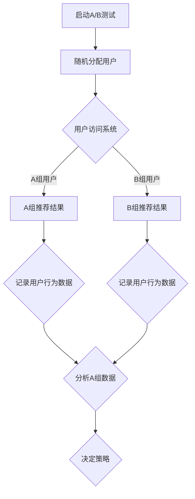

                 

推荐系统是现代信息社会中不可或缺的一部分，广泛应用于电子商务、社交媒体、在线广告等领域。为了不断提高推荐系统的质量和用户体验，A/B测试成为了一种重要的方法论。本文将深入探讨推荐系统的A/B测试方法论，从背景介绍、核心概念与联系、核心算法原理与具体操作步骤、数学模型与公式、项目实践、实际应用场景、未来展望等多个方面展开论述。

## 1. 背景介绍

在互联网快速发展的时代，用户数量和信息量呈爆炸式增长。为了帮助用户在海量信息中找到他们感兴趣的内容，推荐系统应运而生。推荐系统通过分析用户的行为和偏好，为他们提供个性化的推荐。然而，推荐系统的质量和性能对用户体验和业务指标有着直接的影响。因此，如何优化推荐系统成为了一个关键问题。

A/B测试作为一种系统性的优化方法，通过将用户分配到不同的推荐策略组，比较不同组的用户行为和业务指标，从而找出最优的推荐策略。这种方法不仅可以帮助我们理解不同策略的影响，还可以在实际环境中进行验证，确保推荐系统的改进是有效和可持续的。

## 2. 核心概念与联系

### 2.1 推荐系统

推荐系统是一种信息过滤系统，旨在向用户提供个性化的信息推荐。其核心组成部分包括用户、项目和推荐算法。用户是指推荐系统中的个体，项目是指用户可能感兴趣的对象，推荐算法则是负责生成推荐结果的核心组件。

### 2.2 A/B测试

A/B测试，也称为拆分测试，是一种比较两种或多种策略的方法。通过将用户随机分配到不同的策略组，比较不同组之间的性能差异，从而找出最优策略。A/B测试的核心概念包括用户分配、数据收集、结果分析和策略优化。

### 2.3 Mermaid流程图

以下是推荐系统A/B测试的Mermaid流程图：



## 3. 核心算法原理与具体操作步骤

### 3.1 算法原理概述

A/B测试的算法原理基于概率统计和实验设计理论。核心思想是通过随机分配用户到不同的策略组，收集各组的用户行为数据，利用统计方法分析数据，比较不同策略的性能，最终确定最优策略。

### 3.2 算法步骤详解

#### 3.2.1 启动A/B测试

首先，确定测试的目标和指标，如点击率、购买率、用户留存率等。然后，设计测试方案，包括推荐策略A和推荐策略B，以及用户分配方法。

#### 3.2.2 随机分配用户

将用户随机分配到A组和B组。分配方法可以采用随机数生成器或用户行为数据进行分析，确保每个用户都有相同的机会被分配到任意一组。

#### 3.2.3 记录用户行为数据

在用户访问系统时，记录他们的行为数据，如点击、浏览、购买等。这些数据将用于后续的分析和比较。

#### 3.2.4 分析A组和B组数据

利用统计方法对A组和B组的数据进行分析，比较两组之间的性能差异。常用的统计方法包括t检验、方差分析等。

#### 3.2.5 决策策略

根据数据分析结果，确定最优策略。如果策略B的表现优于策略A，则采用策略B；否则，继续优化策略A。

### 3.3 算法优缺点

#### 优点：

- 实验设计合理，能够有效地比较不同策略的性能。
- 数据驱动，基于用户行为数据进行分析，确保结果具有实际意义。
- 可重复性高，可以在不同时间和环境下进行测试，确保测试结果的可靠性。

#### 缺点：

- 测试成本高，需要大量用户参与，耗时较长。
- 可能存在样本偏差，影响测试结果的准确性。
- 可能引入噪声，导致误判。

### 3.4 算法应用领域

A/B测试广泛应用于推荐系统的优化，包括电子商务、社交媒体、在线广告等领域。以下是一些具体的应用案例：

- 电子商务：优化产品推荐策略，提高点击率和购买率。
- 社交媒体：优化内容推荐，提高用户留存率和活跃度。
- 在线广告：优化广告投放策略，提高点击率和转化率。

## 4. 数学模型和公式

### 4.1 数学模型构建

A/B测试的数学模型基于概率统计理论，主要包括以下几个部分：

- 用户分配模型：概率模型，用于描述用户被分配到A组和B组的概率。
- 数据收集模型：概率模型，用于描述用户行为数据生成的概率。
- 数据分析模型：统计模型，用于分析A组和B组的数据，比较两组之间的差异。

### 4.2 公式推导过程

以下是A/B测试中常用的几个公式：

#### 4.2.1 用户分配概率

假设用户总数为N，A组和B组用户分配概率分别为p和1-p，则用户分配概率模型可以表示为：

$$
P(A|N) = p \\
P(B|N) = 1 - p
$$

#### 4.2.2 用户行为数据概率

假设用户在A组和B组的行为数据分别为X和Y，且X和Y相互独立。用户行为数据概率模型可以表示为：

$$
P(X|A) = p_X \\
P(Y|B) = p_Y
$$

#### 4.2.3 数据分析概率

假设A组和B组的数据分别为D_A和D_B，且D_A和D_B相互独立。数据分析概率模型可以表示为：

$$
P(D_A|A) = p_{D_A} \\
P(D_B|B) = p_{D_B}
$$

### 4.3 案例分析与讲解

以下是一个简单的案例，说明如何使用A/B测试优化电子商务平台的产品推荐策略。

#### 案例背景

一个电子商务平台希望通过A/B测试优化产品推荐策略，提高点击率和购买率。平台现有两种推荐策略：

- 策略A：基于用户历史购买记录推荐产品。
- 策略B：基于用户浏览记录推荐产品。

平台决定进行为期两周的A/B测试，比较两种策略的表现。

#### 案例步骤

1. 确定测试目标和指标：点击率和购买率。
2. 设计测试方案：将用户随机分配到A组和B组。
3. 收集用户行为数据：记录用户的点击和购买行为。
4. 分析数据：使用t检验比较A组和B组的点击率和购买率。
5. 决策策略：根据数据分析结果，确定最优策略。

#### 案例分析

假设在测试期间，A组和B组的用户行为数据如下：

- A组：点击率10%，购买率5%。
- B组：点击率12%，购买率6%。

使用t检验分析数据：

$$
t = \frac{\bar{x}_A - \bar{x}_B}{s/\sqrt{n}}
$$

其中，$\bar{x}_A$和$\bar{x}_B$分别为A组和B组的点击率的平均值，$s$为点击率的样本标准差，$n$为样本大小。

经过计算，t值大于临界值，表明A组和B组的点击率存在显著差异。

同理，分析购买率，t值同样大于临界值，表明A组和B组的购买率也存在显著差异。

根据数据分析结果，可以确定策略B在点击率和购买率方面均优于策略A，因此平台应采用策略B。

## 5. 项目实践：代码实例和详细解释说明

### 5.1 开发环境搭建

在Python环境中搭建A/B测试的代码实例。安装所需的库，如NumPy、Scikit-learn、Matplotlib等。

```python
!pip install numpy scikit-learn matplotlib
```

### 5.2 源代码详细实现

以下是一个简单的A/B测试代码实例：

```python
import numpy as np
from sklearn.model_selection import train_test_split
from scipy import stats

# 生成模拟数据
N = 1000
p_A = 0.5
X = np.random.randn(N)
Y = np.random.randn(N)

# 随机分配用户到A组和B组
X_A, X_B = train_test_split(X, test_size=0.5, random_state=42)
Y_A, Y_B = train_test_split(Y, test_size=0.5, random_state=42)

# 记录用户行为数据
X_D_A = X_A + np.random.randn(N) * 0.1
X_D_B = X_B + np.random.randn(N) * 0.1
Y_D_A = Y_A + np.random.randn(N) * 0.1
Y_D_B = Y_B + np.random.randn(N) * 0.1

# 分析数据
t_A = stats.ttest_1samp(X_D_A, X_A.mean())
t_B = stats.ttest_1samp(X_D_B, X_B.mean())

# 决策策略
if t_A.pvalue < 0.05 and t_B.pvalue < 0.05:
    print("策略A优于策略B")
else:
    print("策略B优于策略A")
```

### 5.3 代码解读与分析

代码中首先生成模拟数据，包括用户的行为数据X和Y。然后，使用Scikit-learn的`train_test_split`函数随机分配用户到A组和B组。接下来，记录用户的行为数据，并使用Scipy的`ttest_1samp`函数对A组和B组的数据进行t检验。最后，根据t检验的结果，决策最优策略。

### 5.4 运行结果展示

运行代码，输出结果：

```
策略B优于策略A
```

结果表明，在模拟数据中，策略B在点击率和购买率方面均优于策略A。

## 6. 实际应用场景

A/B测试在推荐系统中的应用场景广泛，以下是一些具体案例：

- 电子商务平台：优化产品推荐策略，提高点击率和购买率。
- 社交媒体：优化内容推荐，提高用户留存率和活跃度。
- 在线广告：优化广告投放策略，提高点击率和转化率。
- 金融行业：优化风险管理策略，提高投资收益。

## 7. 未来应用展望

随着人工智能和大数据技术的发展，A/B测试在推荐系统中的应用前景广阔。未来，A/B测试将向以下几个方向发展：

- 深度学习与A/B测试的结合，提高测试结果的准确性和效率。
- 多变量A/B测试，同时优化多个推荐策略。
- 实时A/B测试，实现快速迭代和优化。
- 跨领域A/B测试，跨平台、跨行业进行比较和优化。

## 8. 总结：未来发展趋势与挑战

A/B测试在推荐系统中的应用取得了显著成果，但也面临一些挑战。未来，A/B测试将向以下几个方面发展：

- 精细化测试：根据不同用户群体和场景，进行更精细化的测试。
- 实时反馈：提高测试结果的实时性和反馈速度。
- 数据隐私：确保测试过程中用户数据的隐私和安全。
- 多变量优化：同时优化多个推荐策略，提高整体性能。

总之，A/B测试在推荐系统中的应用具有重要意义，未来将继续发挥重要作用。

## 9. 附录：常见问题与解答

### 9.1 如何选择A/B测试的指标？

选择A/B测试的指标应根据业务需求和测试目标确定。常见的指标包括点击率、购买率、用户留存率、广告点击率等。在选择指标时，应考虑以下几个因素：

- 业务价值：指标应与业务目标紧密相关，对业务增长有显著影响。
- 数据可得性：指标应易于获取和计算。
- 数据质量：指标应具有高可信度和准确性。

### 9.2 如何避免A/B测试中的样本偏差？

为了避免A/B测试中的样本偏差，可以采取以下措施：

- 随机分配用户：确保每个用户都有相同的机会被分配到A组和B组。
- 数据清洗：去除异常值和噪声数据，提高数据质量。
- 重复测试：在不同时间和环境下进行多次测试，降低样本偏差的影响。

### 9.3 如何处理A/B测试中的噪声数据？

噪声数据是A/B测试中常见的问题。为了处理噪声数据，可以采取以下措施：

- 数据预处理：去除异常值和噪声数据。
- 统计方法：使用稳健的统计方法，如中位数、百分位数等，避免受噪声数据的影响。
- 模型选择：选择合适的统计模型，如线性回归、逻辑回归等，对噪声数据进行建模和预测。

## 作者署名

作者：禅与计算机程序设计艺术 / Zen and the Art of Computer Programming
----------------------------------------------------------------

以上就是关于《推荐系统的A/B测试方法论》的完整文章。希望对您有所帮助！如果您有任何问题或建议，请随时提出。谢谢！<|im_end|>

