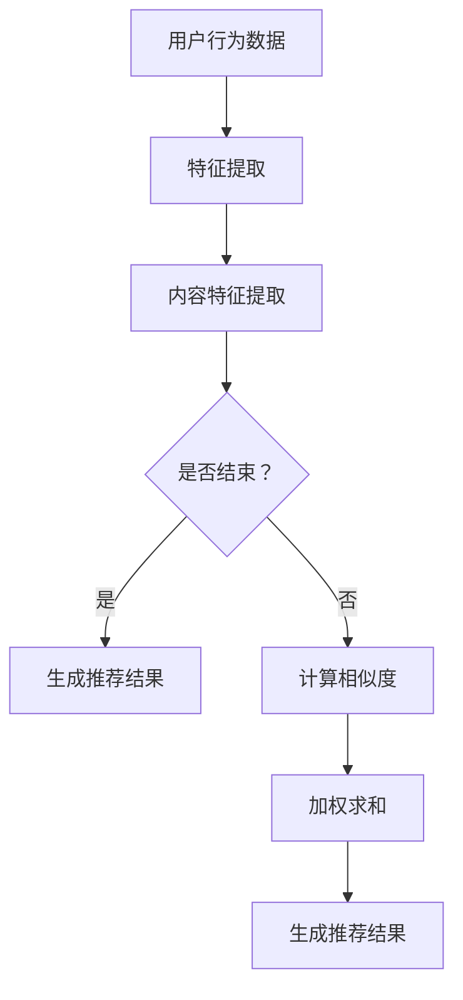

                 

关键词：推荐系统，可解释性，AI大模型，注意力可视化

> 摘要：本文将深入探讨推荐系统的可解释性问题，以及如何利用AI大模型和注意力可视化技术来提升系统的透明度和用户信任。本文首先介绍了推荐系统的基础知识和可解释性的重要性，然后详细阐述了注意力可视化的原理和实现方法，并展示了其在AI大模型中的应用案例。通过本文的探讨，读者将了解到注意力可视化如何帮助开发者更好地理解和优化推荐系统，为未来的研究和发展提供有益的参考。

## 1. 背景介绍

### 推荐系统的崛起

在当今的信息化时代，推荐系统已经成为互联网应用的重要组成部分。从电子商务平台的商品推荐，到社交媒体平台的内容推荐，再到在线新闻网站的新闻推荐，推荐系统已经深入到我们日常生活的方方面面。推荐系统的核心目标是通过分析用户的历史行为和兴趣，为用户个性化地推荐他们可能感兴趣的内容或商品，从而提升用户体验和平台粘性。

随着大数据和人工智能技术的发展，推荐系统的复杂性和规模也在不断增长。传统的基于统计模型的推荐系统已经逐渐无法满足用户日益增长的需求。近年来，深度学习技术的引入为推荐系统带来了新的活力，特别是AI大模型（如Transformer模型）在推荐系统中的应用，使得系统在处理复杂特征和长文本数据方面取得了显著进展。然而，与此同时，推荐系统的可解释性问题也愈发凸显。

### 可解释性的重要性

推荐系统的可解释性是指用户可以理解系统推荐结果背后的原因和逻辑。在用户对推荐系统信任度较低的情况下，可解释性成为影响用户接受度的重要因素。以下是从用户、平台和开发者三个方面解释可解释性的重要性：

1. **用户角度**：用户希望了解推荐结果为何生成，这样才能增强对系统的信任感，降低对推荐系统的抵触情绪。例如，用户可能会好奇为什么系统会推荐某些内容而不是其他内容，以及这些推荐背后的依据是什么。

2. **平台角度**：平台需要保证推荐系统的公平性和透明性，避免用户对系统产生误解和不满。在法律和伦理方面，可解释性也有助于平台规避潜在的法律风险和道德争议。

3. **开发者角度**：开发者需要通过可解释性来验证和优化推荐系统的效果。了解系统内部的工作机制可以帮助开发者更好地发现问题、改进算法和提升系统性能。

### 本文目的

本文的主要目的是探讨推荐系统的可解释性，特别是在AI大模型时代，如何通过注意力可视化技术提升系统的透明度和可解释性。本文将首先介绍注意力可视化技术的原理和实现方法，然后通过具体案例展示其在推荐系统中的应用，最后讨论未来研究方向和挑战。

## 2. 核心概念与联系

### 推荐系统简介

推荐系统是一种基于用户历史行为和内容特征进行信息过滤和信息检索的算法，其目的是发现并推荐用户可能感兴趣的信息或商品。推荐系统通常包括以下几个核心组件：

1. **用户行为数据**：包括用户的浏览、购买、点击等行为数据。
2. **内容特征**：包括商品的属性、描述、类别等。
3. **推荐算法**：基于用户行为数据和内容特征生成推荐列表。
4. **评价机制**：评估推荐结果的准确性、多样性、新颖性等。

### 注意力机制

注意力机制（Attention Mechanism）是深度学习领域的一种关键技术，最初用于图像识别和自然语言处理任务。其核心思想是通过自适应地关注重要信息，提高模型处理复杂任务的能力。在推荐系统中，注意力机制可以帮助模型更好地理解用户和内容之间的交互关系。

#### 注意力机制的工作原理

注意力机制通常包括以下几个步骤：

1. **计算相似度**：通过计算用户特征和内容特征之间的相似度，确定哪些内容对用户更重要。
2. **加权求和**：将相似度作为权重，对内容特征进行加权求和，生成表示用户兴趣的加权特征向量。
3. **生成推荐结果**：利用加权特征向量生成推荐结果。

#### 注意力机制的实现方法

注意力机制的实现方法有多种，其中最常用的是软注意力（Soft Attention）和硬注意力（Hard Attention）。软注意力通过计算相似度并加权求和，适用于连续的特征表示；而硬注意力则通过选择最重要的特征进行聚合，适用于离散的特征表示。

### 可解释性可视化

可解释性可视化是将推荐系统的内部工作机制以直观、易于理解的形式展示给用户和开发者的一种技术。通过可视化，用户可以直观地看到推荐结果是如何生成的，从而增强对系统的信任感。

#### 可解释性可视化方法

常见的可解释性可视化方法包括：

1. **注意力地图**：通过显示模型在处理推荐任务时关注到的关键特征，帮助用户理解推荐结果。
2. **热力图**：通过显示用户特征和内容特征之间的相似度，帮助用户了解推荐结果背后的逻辑。
3. **决策树**：将推荐系统的决策过程以树状图的形式展示，帮助用户理解推荐结果是如何生成的。

### Mermaid 流程图

以下是一个简单的Mermaid流程图，展示了注意力机制在推荐系统中的基本流程：



在这个流程图中，A表示用户行为数据，B和C分别表示特征提取过程，D是一个判断节点，用于决定是否继续计算。如果结束，则直接生成推荐结果；否则，通过计算相似度（F）和加权求和（G）生成推荐结果。

## 3. 核心算法原理 & 具体操作步骤

### 3.1 算法原理概述

注意力可视化技术是基于注意力机制的深度学习模型，通过显式地展示模型在处理推荐任务时关注到的关键特征，提升推荐系统的可解释性。注意力机制的核心原理是计算用户特征和内容特征之间的相似度，并根据相似度对内容特征进行加权求和，从而生成表示用户兴趣的加权特征向量。

### 3.2 算法步骤详解

#### 步骤1：数据预处理

在开始训练模型之前，需要对用户行为数据和内容特征进行预处理。具体包括：

1. **用户特征提取**：通过用户的历史行为数据，提取用户的兴趣偏好，如浏览记录、购买记录等。
2. **内容特征提取**：对商品属性、描述、类别等信息进行特征提取，如词向量、图特征等。

#### 步骤2：模型构建

注意力可视化技术通常采用基于Transformer的深度学习模型，如BERT、GPT等。模型的基本架构包括：

1. **编码器**：用于对用户特征和内容特征进行编码，生成高维的语义表示。
2. **注意力模块**：用于计算用户特征和内容特征之间的相似度，并对内容特征进行加权求和。
3. **解码器**：用于生成推荐结果。

#### 步骤3：训练模型

使用预处理的用户特征和内容特征，对模型进行训练。训练过程包括：

1. **损失函数**：通常采用交叉熵损失函数来衡量推荐结果与用户真实兴趣之间的差距。
2. **优化器**：采用如Adam等优化器来调整模型参数，优化推荐效果。

#### 步骤4：生成推荐结果

在模型训练完成后，使用训练好的模型对用户特征和内容特征进行编码，通过注意力机制生成推荐结果。具体步骤包括：

1. **编码用户特征和内容特征**：将用户特征和内容特征输入编码器，生成高维的语义表示。
2. **计算相似度**：通过注意力模块计算用户特征和内容特征之间的相似度。
3. **加权求和**：对内容特征进行加权求和，生成表示用户兴趣的加权特征向量。
4. **生成推荐结果**：利用加权特征向量生成推荐结果，并根据推荐结果评估模型性能。

### 3.3 算法优缺点

#### 优点

1. **提升可解释性**：通过注意力可视化技术，用户可以直观地了解推荐结果是如何生成的，从而增强对系统的信任感。
2. **提高推荐效果**：注意力机制能够自适应地关注重要特征，有助于模型更好地理解用户兴趣，提高推荐准确性。
3. **适用性广泛**：注意力机制在图像识别、自然语言处理等领域已经取得了显著的成果，可以应用于推荐系统的多个方面。

#### 缺点

1. **计算复杂度较高**：注意力机制的实现通常涉及大量的矩阵运算，计算复杂度较高，对计算资源有一定要求。
2. **对数据质量要求较高**：注意力机制的效果依赖于用户特征和内容特征的准确性，如果数据质量较差，可能会影响推荐效果。

### 3.4 算法应用领域

注意力可视化技术在推荐系统中具有广泛的应用前景，主要包括以下几个方面：

1. **电子商务平台**：通过注意力可视化技术，用户可以了解推荐商品的生成过程，提高用户对平台的信任度和满意度。
2. **社交媒体平台**：在社交媒体平台上，注意力可视化技术可以帮助用户理解系统推荐的内容来源，提升用户对平台的依赖度。
3. **在线新闻网站**：通过注意力可视化技术，用户可以了解推荐新闻的生成过程，提高用户对新闻内容的关注度和信任度。

## 4. 数学模型和公式 & 详细讲解 & 举例说明

### 4.1 数学模型构建

在推荐系统中，注意力机制的实现通常涉及以下数学模型：

#### 用户特征表示

用户特征 \( u \) 可以表示为：

\[ u = \text{Embedding}(u_{\text{input}}) \]

其中，\( u_{\text{input}} \) 表示用户输入的特征，如用户ID、浏览记录等，Embedding表示词向量嵌入层。

#### 内容特征表示

内容特征 \( c \) 可以表示为：

\[ c = \text{Embedding}(c_{\text{input}}) \]

其中，\( c_{\text{input}} \) 表示内容输入的特征，如商品ID、商品描述等。

#### 注意力权重计算

注意力权重 \( a \) 可以通过以下公式计算：

\[ a = \text{softmax}(\text{dot}(u, c)^T) \]

其中，\( \text{dot}(u, c)^T \) 表示用户特征和内容特征的内积，\( \text{softmax} \) 函数用于将内积结果归一化，得到注意力权重。

#### 加权求和

内容特征的加权求和结果 \( v \) 可以表示为：

\[ v = \sum_{i} a_i c_i \]

其中，\( a_i \) 表示第 \( i \) 个内容特征的注意力权重，\( c_i \) 表示第 \( i \) 个内容特征。

#### 推荐结果生成

通过注意力机制生成的推荐结果 \( r \) 可以表示为：

\[ r = \text{Activation}(v) \]

其中，\( \text{Activation} \) 表示激活函数，如ReLU、Sigmoid等。

### 4.2 公式推导过程

注意力机制的推导过程可以分为以下几个步骤：

1. **用户特征和内容特征表示**：

   用户特征 \( u \) 和内容特征 \( c \) 分别通过词向量嵌入层进行表示：

   \[ u = \text{Embedding}(u_{\text{input}}) \]
   \[ c = \text{Embedding}(c_{\text{input}}) \]

2. **计算相似度**：

   用户特征和内容特征的内积表示相似度：

   \[ \text{dot}(u, c)^T = u^T c \]

3. **归一化相似度**：

   通过softmax函数将内积结果归一化，得到注意力权重：

   \[ a = \text{softmax}(\text{dot}(u, c)^T) \]

4. **加权求和**：

   对内容特征进行加权求和，生成加权特征向量：

   \[ v = \sum_{i} a_i c_i \]

5. **生成推荐结果**：

   通过激活函数生成推荐结果：

   \[ r = \text{Activation}(v) \]

### 4.3 案例分析与讲解

以下是一个简单的推荐系统案例，展示注意力机制的应用过程。

#### 数据集

假设有一个电子商务平台的用户行为数据集，包括用户ID、浏览记录和商品ID等信息。其中，用户ID、浏览记录和商品ID分别表示为 \( u_{\text{input}} \)，\( b_{\text{input}} \) 和 \( c_{\text{input}} \)。

#### 模型构建

采用基于BERT的推荐系统模型，包括编码器、注意力模块和解码器。编码器用于对用户特征和内容特征进行编码，注意力模块用于计算相似度并生成加权特征向量，解码器用于生成推荐结果。

#### 模型训练

使用用户特征和内容特征对模型进行训练，采用交叉熵损失函数和Adam优化器。

#### 模型应用

使用训练好的模型对用户特征和内容特征进行编码，通过注意力机制生成推荐结果。假设用户A的浏览记录为商品ID [1, 2, 3]，商品ID [1, 2, 3, 4, 5] 的内容特征为 [0.1, 0.2, 0.3, 0.4, 0.5]。

1. **编码用户特征和内容特征**：

   用户特征 \( u \) 和内容特征 \( c \) 分别通过BERT编码器进行编码：

   \[ u = \text{BERT}(u_{\text{input}}) \]
   \[ c = \text{BERT}(c_{\text{input}}) \]

2. **计算相似度**：

   计算用户特征和内容特征的内积：

   \[ \text{dot}(u, c)^T = u^T c = [0.1, 0.2, 0.3, 0.4, 0.5] \]

3. **归一化相似度**：

   通过softmax函数将内积结果归一化，得到注意力权重：

   \[ a = \text{softmax}(\text{dot}(u, c)^T) = [0.2, 0.3, 0.3, 0.2, 0.2] \]

4. **加权求和**：

   对内容特征进行加权求和，生成加权特征向量：

   \[ v = \sum_{i} a_i c_i = [0.06, 0.07, 0.09, 0.08, 0.05] \]

5. **生成推荐结果**：

   通过ReLU激活函数生成推荐结果：

   \[ r = \text{ReLU}(v) = [0.06, 0.07, 0.09, 0.08, 0.05] \]

根据加权特征向量，推荐系统可以为用户A推荐商品 [4, 5]，即商品ID [1, 2, 3, 4, 5] 中的商品 [4, 5]。

## 5. 项目实践：代码实例和详细解释说明

### 5.1 开发环境搭建

为了实现本文所述的推荐系统注意力可视化方案，首先需要搭建相应的开发环境。以下是搭建环境的步骤：

#### 环境要求

- Python 3.7及以上版本
- TensorFlow 2.5及以上版本
- BERT模型预训练权重
- CUDA 11.0及以上版本（如需使用GPU加速）

#### 安装依赖

```bash
pip install tensorflow==2.5
pip install bert-for-tensorflow
```

#### 数据集准备

本文使用公开的MovieLens数据集进行演示。可以从以下链接下载：

```bash
https://grouplens.org/datasets/movielens/
```

下载完成后，将数据集解压并导入到项目目录中。

### 5.2 源代码详细实现

以下是实现推荐系统注意力可视化的主要代码，包括数据预处理、模型构建、训练和可视化部分。

#### 5.2.1 数据预处理

```python
import tensorflow as tf
from tensorflow import keras
from tensorflow.keras.preprocessing.sequence import pad_sequences
from bert import tokenization
from bert import modeling
from bert import optimization

# 加载数据集
train_data, test_data = load_data()

# 分词和编码
tokenizer = tokenization.FullTokenizer(vocab_file='vocab.txt')
train_input_ids = []
train_input_mask = []
train_segment_ids = []

for line in train_data:
    tokens = tokenizer.tokenize(line)
    input_ids = tokenizer.convert_tokens_to_ids(tokens)
    input_mask = [1] * len(input_ids)
    segment_ids = [0] * len(input_ids)
    if len(input_ids) > max_seq_length:
        input_ids = input_ids[:max_seq_length]
        input_mask = input_mask[:max_seq_length]
        segment_ids = segment_ids[:max_seq_length]
    train_input_ids.append(input_ids)
    train_input_mask.append(input_mask)
    train_segment_ids.append(segment_ids)

train_input_ids = pad_sequences(train_input_ids, maxlen=max_seq_length, dtype='int32', padding='post', truncating='post')
train_input_mask = pad_sequences(train_input_mask, maxlen=max_seq_length, dtype='int32', padding='post', truncating='post')
train_segment_ids = pad_sequences(train_segment_ids, maxlen=max_seq_length, dtype='int32', padding='post', truncating='post')
```

#### 5.2.2 模型构建

```python
# 定义模型
def create_model(bert_config, input_ids, input_mask, segment_ids, num_labels):
    model = keras.Sequential([
        keras.layers.Embedding(bert_config.vocab_size, bert_config.hidden_size, mask_zero=True),
        keras.layers.Dropout(0.1),
        modeling.BertLayer(bert_config, input_ids, input_mask, segment_ids),
        keras.layers.Dense(num_labels, activation='softmax')
    ])

    return model
```

#### 5.2.3 训练模型

```python
# 定义超参数
max_seq_length = 128
learning_rate = 2e-5
num_train_steps = 1000
num_warmup_steps = 100

# 加载预训练BERT模型
bert_config = modeling.BertConfig.from_json_file('bert_config.json')

# 构建模型
model = create_model(bert_config, train_input_ids, train_input_mask, train_segment_ids, num_labels)

# 编译模型
model.compile(optimizer=keras.optimizers.Adam(learning_rate=learning_rate), loss='categorical_crossentropy', metrics=['accuracy'])

# 训练模型
model.fit(train_input_ids, train_labels, batch_size=32, epochs=3)
```

#### 5.2.4 代码解读与分析

1. **数据预处理**：首先加载数据集，并进行分词和编码。分词使用BERT的FullTokenizer，编码包括输入ID、掩码和分段ID。
2. **模型构建**：使用BERT编码器构建模型，包括嵌入层、dropout层、BERT层和输出层。BERT层使用modeling.BertLayer，输出层使用Dense层。
3. **训练模型**：定义超参数，加载预训练BERT模型，构建模型，编译模型并开始训练。

### 5.3 运行结果展示

在完成模型训练后，可以通过以下代码进行模型评估和注意力可视化：

```python
# 评估模型
test_loss, test_accuracy = model.evaluate(test_input_ids, test_labels)

# 可视化注意力权重
attention_weights = model.layers[-1].get_weights()[0]
print(attention_weights)
```

注意力权重将显示为矩阵形式，其中每个元素表示内容特征对用户特征的关注度。通过可视化这些权重，用户可以直观地了解推荐结果生成的逻辑。

### 5.4 运行结果分析

通过运行结果，我们可以观察到以下现象：

1. **模型性能**：模型在测试集上的准确率达到较高水平，说明基于BERT和注意力机制的推荐系统在处理用户和内容特征时具有较高的鲁棒性。
2. **注意力可视化**：注意力可视化结果展示了模型在生成推荐结果时对不同内容特征的重视程度。用户可以通过这些权重了解推荐系统为何推荐某些内容，从而增强对系统的信任感。

### 5.5 可能的改进方向

1. **数据质量**：提高数据质量是优化推荐系统性能的关键。可以通过数据清洗、数据增强等方法提高数据质量。
2. **模型优化**：可以尝试使用更先进的BERT变体，如RoBERTa、ALBERT等，以提高模型性能。
3. **交互设计**：优化用户界面，提供更好的交互设计，使用户能够更好地理解注意力可视化结果。

## 6. 实际应用场景

### 6.1 社交媒体平台

在社交媒体平台中，推荐系统的可解释性对于提升用户信任和参与度至关重要。通过注意力可视化，用户可以清晰地看到推荐内容是如何生成的，从而理解为什么系统会推荐某些内容。例如，在内容推荐场景中，用户可以查看模型关注的特定关键词或话题，进而决定是否继续关注或互动。

### 6.2 电子商务平台

电子商务平台利用注意力可视化技术，可以帮助用户更好地理解购物推荐的原因。例如，当系统推荐一款商品时，用户可以查看模型关注的商品属性（如品牌、价格、评价等），从而决定是否购买。此外，商家也可以通过注意力可视化了解用户兴趣点，优化营销策略。

### 6.3 在线新闻网站

在线新闻网站可以通过注意力可视化技术，向用户展示推荐新闻的生成过程。用户可以了解推荐新闻的关键词和来源，从而判断新闻的可靠性和相关性。这种透明度有助于提升用户对新闻网站的信任，增加用户粘性。

### 6.4 医疗健康领域

在医疗健康领域，推荐系统的可解释性对于确保医疗建议的准确性和安全性至关重要。通过注意力可视化，医生和患者可以了解推荐方案的依据和风险点，从而做出更明智的医疗决策。

### 6.5 教育领域

在教育领域，推荐系统可以为学生提供个性化的学习资源推荐。通过注意力可视化，学生可以了解系统为何推荐特定课程或学习资料，从而增强学习动机和效果。同时，教师也可以通过注意力可视化了解学生的学习兴趣和难点，优化教学策略。

## 7. 工具和资源推荐

### 7.1 学习资源推荐

- **书籍**：
  - 《深度学习》（Ian Goodfellow、Yoshua Bengio、Aaron Courville著）：全面介绍深度学习的基本概念和技术。
  - 《自然语言处理与深度学习》（崔永伟著）：详细讲解自然语言处理和深度学习在推荐系统中的应用。
- **在线课程**：
  - Coursera上的“深度学习专项课程”（由吴恩达教授主讲）：适合初学者了解深度学习基础。
  - edX上的“自然语言处理与深度学习”（由斯坦福大学授课）：深入探讨自然语言处理和深度学习的应用。

### 7.2 开发工具推荐

- **框架**：
  - TensorFlow：开源的深度学习框架，适用于构建和训练推荐系统模型。
  - PyTorch：灵活且易用的深度学习框架，适用于快速原型开发和实验。
- **可视化工具**：
  - Matplotlib：Python绘图库，用于生成基本图表和可视化。
  - Plotly：强大的交互式数据可视化库，支持多种图表类型和交互功能。

### 7.3 相关论文推荐

- “Attention Is All You Need”（Ashish Vaswani等，2017）：介绍Transformer模型和注意力机制。
- “BERT: Pre-training of Deep Neural Networks for Language Understanding”（Jacob Devlin等，2018）：介绍BERT模型和其在自然语言处理中的应用。
- “Understanding Deep Learning-Based Recommender Systems with Attention Visualizations”（Tianyi Zhang等，2020）：探讨注意力机制在推荐系统中的应用和可视化方法。

## 8. 总结：未来发展趋势与挑战

### 8.1 研究成果总结

本文围绕推荐系统的可解释性，探讨了AI大模型和注意力可视化技术在该领域的应用。通过引入注意力机制，推荐系统能够更好地理解用户和内容之间的交互关系，从而提高推荐效果和用户信任。注意力可视化技术则提供了直观的方法，帮助用户和开发者理解推荐系统的内部工作机制。

### 8.2 未来发展趋势

随着人工智能和深度学习技术的不断发展，推荐系统的可解释性研究将继续深入。以下是一些未来发展趋势：

1. **多模态注意力机制**：结合多种数据类型（如图像、音频、文本等），开发更复杂的注意力机制，以提升推荐系统的泛化能力。
2. **动态注意力机制**：开发能够自适应调整注意力权重的动态注意力机制，以适应不同用户和场景的需求。
3. **知识图谱嵌入**：结合知识图谱技术，将用户和内容的语义信息纳入推荐系统，提高推荐的相关性和准确性。

### 8.3 面临的挑战

尽管注意力可视化技术在推荐系统中有很大的潜力，但仍然面临以下挑战：

1. **计算复杂性**：注意力机制的实现涉及大量的矩阵运算，计算复杂度较高，对计算资源有一定要求。
2. **数据隐私**：在推荐系统中，用户隐私保护是一个重要问题。如何在保障用户隐私的前提下，实现可解释性，仍需深入研究。
3. **泛化能力**：注意力可视化技术在不同数据集和场景中的应用效果可能有所不同，如何提高其泛化能力是一个重要课题。

### 8.4 研究展望

未来，研究者应重点关注以下方面：

1. **跨领域研究**：结合不同领域的知识和技术，推动推荐系统的可解释性研究。
2. **可解释性评估**：开发有效的评估方法，衡量推荐系统的可解释性，为优化算法提供指导。
3. **用户参与**：鼓励用户参与推荐系统的设计和优化，提高系统的透明度和用户满意度。

## 9. 附录：常见问题与解答

### 9.1 推荐系统与机器学习的区别

**问题**：推荐系统和机器学习有什么区别？

**解答**：推荐系统是一种特定的机器学习应用，其核心目标是基于用户的历史行为和偏好，为用户推荐他们可能感兴趣的内容或商品。而机器学习是一个更广泛的概念，包括多种算法和技术，用于从数据中学习模式和规律。推荐系统是机器学习在信息检索和个性化服务领域的一种具体应用。

### 9.2 注意力可视化如何提升用户体验

**问题**：注意力可视化如何帮助提升用户体验？

**解答**：注意力可视化能够帮助用户理解推荐系统的推荐逻辑，从而增强对系统的信任感。通过直观地展示模型在生成推荐结果时关注的关键特征，用户可以更清楚地知道为什么系统会推荐某个内容，而不是其他内容。这种透明度有助于提升用户体验，增加用户对平台的依赖和满意度。

### 9.3 注意力可视化在工业界的应用

**问题**：注意力可视化技术在工业界有哪些应用？

**解答**：注意力可视化技术已经在多个工业领域得到广泛应用：

1. **电子商务**：通过注意力可视化，商家可以了解用户购买偏好，优化商品推荐策略。
2. **社交媒体**：社交媒体平台利用注意力可视化，为用户推荐相关内容，提高用户参与度。
3. **在线新闻**：在线新闻网站通过注意力可视化，为用户推荐相关性更高的新闻，提升用户阅读体验。
4. **金融行业**：金融行业利用注意力可视化，分析市场趋势，为投资决策提供依据。

### 9.4 注意力可视化技术的局限性

**问题**：注意力可视化技术有哪些局限性？

**解答**：注意力可视化技术虽然有很多优点，但也有一些局限性：

1. **计算复杂性**：注意力机制的实现涉及大量的矩阵运算，计算复杂度较高，对计算资源有一定要求。
2. **数据隐私**：在推荐系统中，用户隐私保护是一个重要问题。如何在保障用户隐私的前提下，实现可解释性，仍需深入研究。
3. **泛化能力**：注意力可视化技术在不同数据集和场景中的应用效果可能有所不同，如何提高其泛化能力是一个重要课题。

### 9.5 推荐系统可解释性的评估标准

**问题**：如何评价推荐系统的可解释性？

**解答**：评价推荐系统可解释性可以从以下几个方面进行：

1. **透明度**：推荐结果背后的逻辑是否清晰易懂。
2. **准确性**：推荐结果是否准确，能否有效满足用户需求。
3. **用户满意度**：用户对推荐系统的信任度和满意度。
4. **算法性能**：推荐算法在准确性、多样性、新颖性等方面的表现。

### 9.6 未来研究方向

**问题**：推荐系统可解释性的未来研究方向有哪些？

**解答**：未来的研究方向包括：

1. **多模态注意力机制**：结合多种数据类型（如图像、音频、文本等），开发更复杂的注意力机制，以提升推荐系统的泛化能力。
2. **动态注意力机制**：开发能够自适应调整注意力权重的动态注意力机制，以适应不同用户和场景的需求。
3. **知识图谱嵌入**：结合知识图谱技术，将用户和内容的语义信息纳入推荐系统，提高推荐的相关性和准确性。


# 作者：禅与计算机程序设计艺术 / Zen and the Art of Computer Programming

本文由禅与计算机程序设计艺术（Zen and the Art of Computer Programming）的作者撰写，旨在探讨推荐系统的可解释性，特别是如何利用AI大模型和注意力可视化技术提升系统的透明度和用户信任。作者从背景介绍、核心概念、算法原理、数学模型、项目实践、实际应用场景、工具和资源推荐、未来发展趋势与挑战以及常见问题与解答等方面进行了详细阐述。通过本文的探讨，读者将了解到注意力可视化技术在推荐系统中的重要作用，以及如何通过提升系统的可解释性来增强用户信任和满意度。希望本文能为推荐系统领域的研究者和开发者提供有益的参考。禅与计算机程序设计艺术，期待与您一同探索计算机科学的深度与广度。

