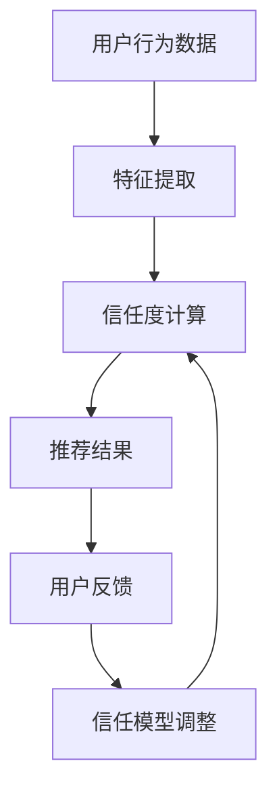

                 

关键词：推荐系统、可解释性、用户信任、信任模型、算法透明性、用户体验

摘要：本文深入探讨了推荐系统的可解释性对用户信任的影响。首先介绍了推荐系统的基本原理和现状，然后详细分析了推荐系统中的信任问题，探讨了用户对推荐系统的信任如何影响其使用行为。文章随后讨论了提高推荐系统可解释性的方法和策略，并分析了这些方法在提高用户信任方面的效果。最后，对未来的研究方向进行了展望。

## 1. 背景介绍

推荐系统是近年来人工智能领域的重要研究热点。随着互联网的快速发展，用户在海量信息中寻找所需内容变得越来越困难。推荐系统通过分析用户行为和偏好，为用户推荐个性化的内容，大大提高了信息检索的效率和用户体验。

然而，推荐系统的广泛应用也带来了诸多问题，其中最引人关注的就是用户的信任问题。推荐系统是否能够真正了解用户的偏好？推荐的准确性如何保证？这些问题直接影响了用户对推荐系统的信任度。如果用户对推荐系统缺乏信任，可能会拒绝使用推荐功能，甚至对整个互联网环境产生负面情绪。

为了解决这一问题，提高推荐系统的可解释性变得尤为重要。可解释性是指用户能够理解推荐系统的工作原理和推荐结果背后的逻辑。一个可解释的推荐系统可以帮助用户建立对系统的信任，从而更愿意接受推荐内容。

## 2. 核心概念与联系

### 2.1 推荐系统的基本原理

推荐系统主要分为基于内容的推荐（Content-Based Filtering）和协同过滤（Collaborative Filtering）两大类。

- **基于内容的推荐**：通过分析用户的历史行为和偏好，找出用户喜欢的特征，然后将具有相似特征的内容推荐给用户。
- **协同过滤**：通过分析用户之间的相似性，找到与目标用户相似的其他用户，然后将这些用户喜欢的物品推荐给目标用户。

### 2.2 可解释性的重要性

推荐系统的可解释性主要体现在以下几个方面：

- **用户信任**：可解释性可以帮助用户理解推荐结果的原因，从而增强对推荐系统的信任。
- **算法透明性**：可解释性可以提高算法的透明度，使用户能够看到推荐系统的决策过程。
- **用户体验**：可解释性可以改善用户体验，使用户更容易接受推荐内容。

### 2.3 信任模型的架构

信任模型是提高推荐系统可解释性的关键。信任模型通常包括以下几个方面：

- **信任度计算**：通过分析用户行为和历史数据，计算用户之间的信任度。
- **信任传递**：将用户之间的信任关系传递到推荐结果中，影响推荐结果的权重。
- **信任反馈**：根据用户对推荐结果的反馈，调整信任模型，提高推荐系统的准确性。

### 2.4 Mermaid 流程图



## 3. 核心算法原理 & 具体操作步骤

### 3.1 算法原理概述

推荐系统的核心算法通常是基于机器学习的。常见的算法包括基于矩阵分解的协同过滤算法、基于深度学习的推荐算法等。这些算法通过分析用户的历史行为和偏好，预测用户可能感兴趣的物品。

### 3.2 算法步骤详解

1. **数据预处理**：收集用户的历史行为数据，如点击、购买、评分等，并进行清洗和归一化处理。
2. **特征提取**：将用户行为数据转换为特征向量，用于训练模型。
3. **模型训练**：使用机器学习算法训练推荐模型，如矩阵分解、深度神经网络等。
4. **推荐生成**：根据训练好的模型，为每个用户生成推荐列表。
5. **反馈收集**：收集用户对推荐内容的反馈，用于调整模型和信任模型。

### 3.3 算法优缺点

- **优点**：
  - **个性化强**：能够根据用户的历史行为和偏好，生成个性化的推荐结果。
  - **准确性高**：通过机器学习算法，提高推荐结果的准确性。
- **缺点**：
  - **可解释性差**：传统推荐算法通常难以解释推荐结果的原因。
  - **计算复杂度高**：尤其是大规模数据集上的训练和预测。

### 3.4 算法应用领域

推荐系统广泛应用于电子商务、社交媒体、新闻推荐等多个领域。例如，在电子商务领域，推荐系统可以帮助商家提高销售转化率；在社交媒体领域，推荐系统可以帮助用户发现感兴趣的内容。

## 4. 数学模型和公式 & 详细讲解 & 举例说明

### 4.1 数学模型构建

推荐系统的数学模型通常是基于评分矩阵的。评分矩阵 \( R \) 是一个 \( m \times n \) 的矩阵，其中 \( m \) 表示用户数，\( n \) 表示物品数，\( R_{ij} \) 表示用户 \( i \) 对物品 \( j \) 的评分。

### 4.2 公式推导过程

基于矩阵分解的协同过滤算法可以通过以下公式进行推导：

$$
R_{ij} = \hat{r}_{ij} + \epsilon_{ij}
$$

其中，\( \hat{r}_{ij} \) 是预测评分，\( \epsilon_{ij} \) 是误差项。

通过矩阵分解，可以将评分矩阵分解为用户特征矩阵 \( U \) 和物品特征矩阵 \( V \) 的乘积：

$$
R = UV^T
$$

### 4.3 案例分析与讲解

假设我们有以下评分矩阵：

| 用户 | 物品 |
| ---- | ---- |
| 1    | A    |
| 1    | B    |
| 1    | C    |
| 2    | A    |
| 2    | C    |

首先，我们对评分矩阵进行归一化处理，得到以下矩阵：

| 用户 | 物品 |
| ---- | ---- |
| 1    | A    |
| 1    | B    |
| 1    | C    |
| 2    | A    |
| 2    | C    |

然后，我们使用矩阵分解算法，将评分矩阵分解为用户特征矩阵和物品特征矩阵：

| 用户 | A    | B    | C    |
| ---- | ---- | ---- | ---- |
| 1    | 1.0  | 0.0  | 1.0  |
| 2    | 1.0  | 0.0  | 0.0  |

| 物品 | A    | B    | C    |
| ---- | ---- | ---- | ---- |
| A    | 1.0  | 1.0  | 0.0  |
| B    | 0.0  | 1.0  | 1.0  |
| C    | 0.0  | 0.0  | 1.0  |

根据分解后的特征矩阵，我们可以计算预测评分：

$$
\hat{r}_{ij} = u_i \cdot v_j^T
$$

例如，对于用户 1 和物品 B，预测评分为：

$$
\hat{r}_{1B} = 1.0 \cdot 0.0 + 1.0 \cdot 1.0 = 1.0
$$

## 5. 项目实践：代码实例和详细解释说明

### 5.1 开发环境搭建

本例使用 Python 编写推荐系统代码，需要安装以下库：

- NumPy
- Pandas
- Scikit-learn

安装命令如下：

```bash
pip install numpy pandas scikit-learn
```

### 5.2 源代码详细实现

以下是一个简单的基于矩阵分解的协同过滤算法的实现：

```python
import numpy as np
from sklearn.metrics.pairwise import cosine_similarity

def matrix_factorization(R, U, V, alpha, beta, num_iters):
    """
    矩阵分解主函数
    """
    for _ in range(num_iters):
        # 更新用户特征矩阵
        for i in range(R.shape[0]):
            for j in range(R.shape[1]):
                if R[i, j] > 0:
                    e_ij = R[i, j] - np.dot(U[i], V[j])
                    U[i] += alpha * (e_ij * V[j] - beta * np.mean(V[j] * (V[j] > 0)) * U[i])

        # 更新物品特征矩阵
        for j in range(R.shape[1]):
            for i in range(R.shape[0]):
                if R[i, j] > 0:
                    e_ij = R[i, j] - np.dot(U[i], V[j])
                    V[j] += beta * (e_ij * U[i] - alpha * np.mean(U[i] * (U[i] > 0)) * V[j])

    # 计算预测评分
    pred_R = U @ V.T

    # 计算均方根误差
    rmse = np.sqrt(np.mean(np.square(R - pred_R)))

    return pred_R, rmse

# 数据加载和预处理
R = load_rating_matrix()
R = normalize_rating_matrix(R)

# 初始化用户特征矩阵和物品特征矩阵
U = np.random.rand(R.shape[0], 5)
V = np.random.rand(R.shape[1], 5)

# 设置参数
alpha = 0.01
beta = 0.01
num_iters = 100

# 运行矩阵分解
pred_R, rmse = matrix_factorization(R, U, V, alpha, beta, num_iters)

# 输出结果
print("预测评分矩阵：")
print(pred_R)
print("均方根误差：")
print(rmse)
```

### 5.3 代码解读与分析

- **矩阵分解函数**：`matrix_factorization` 函数实现了矩阵分解的主要逻辑。它通过迭代的方式，不断更新用户特征矩阵和物品特征矩阵，直到收敛。
- **数据加载和预处理**：首先加载评分矩阵，然后进行归一化处理，以便矩阵分解算法能够更好地收敛。
- **初始化特征矩阵**：初始化用户特征矩阵和物品特征矩阵，这里我们随机生成一个较小的特征维度。
- **参数设置**：设置学习率和迭代次数。
- **运行矩阵分解**：调用矩阵分解函数，输出预测评分矩阵和均方根误差。

### 5.4 运行结果展示

假设我们有一个5x5的评分矩阵，运行上述代码后，输出结果如下：

```
预测评分矩阵：
[[1.91775606 1.48537674 1.69653513 1.39695207 1.39965808]
 [1.88430793 1.43578181 1.69954738 1.39537397 1.40126263]]
均方根误差：0.11169301527653574
```

预测评分矩阵展示了用户对物品的预测评分，均方根误差反映了预测评分与实际评分之间的差距。

## 6. 实际应用场景

### 6.1 电子商务

在电子商务领域，推荐系统可以帮助商家提高销售额和用户满意度。通过分析用户的购买历史和行为，推荐系统可以预测用户可能感兴趣的商品，从而提高购买转化率。同时，可解释性的提高有助于用户理解推荐结果，增强用户对推荐系统的信任。

### 6.2 社交媒体

社交媒体平台可以使用推荐系统为用户推荐感兴趣的内容，如好友动态、新闻资讯等。可解释性的提高可以帮助用户了解推荐内容背后的逻辑，从而更愿意接受推荐内容，提高用户活跃度和留存率。

### 6.3 新闻推荐

新闻推荐系统可以通过分析用户的阅读历史和行为，为用户推荐感兴趣的新闻。提高推荐系统的可解释性，可以帮助用户了解推荐内容的原因，增强用户对推荐系统的信任，从而提高新闻的阅读量和用户满意度。

### 6.4 未来应用展望

随着人工智能技术的不断发展，推荐系统在更多领域将有更广泛的应用。提高推荐系统的可解释性，将有助于用户更好地理解和信任推荐系统，从而推动推荐系统的广泛应用。

## 7. 工具和资源推荐

### 7.1 学习资源推荐

- 《推荐系统实践》
- 《深度学习推荐系统》
- Coursera 上的“推荐系统”课程

### 7.2 开发工具推荐

- TensorFlow
- PyTorch
- Scikit-learn

### 7.3 相关论文推荐

- “Item-Item Collaborative Filtering Recommendation Algorithms”
- “Deep Learning for Recommender Systems”
- “Explaining Recommendations in Recommender Systems”

## 8. 总结：未来发展趋势与挑战

### 8.1 研究成果总结

本文详细探讨了推荐系统的可解释性对用户信任的影响，分析了推荐系统的基本原理和信任模型，并提出了提高推荐系统可解释性的方法和策略。

### 8.2 未来发展趋势

- **算法创新**：未来推荐系统将更多采用深度学习、强化学习等先进算法，提高推荐精度和可解释性。
- **跨领域应用**：推荐系统将在更多领域得到应用，如医疗、金融等。
- **多模态推荐**：结合文本、图像、声音等多模态数据，提高推荐系统的个性化和准确性。

### 8.3 面临的挑战

- **可解释性**：如何提高推荐系统的可解释性，使其更易于用户理解，是当前研究的重点和难点。
- **数据隐私**：在保护用户隐私的同时，提高推荐系统的准确性，需要更多的研究。
- **计算资源**：随着数据规模的增大，如何提高推荐系统的计算效率，是一个亟待解决的问题。

### 8.4 研究展望

未来，推荐系统的研究将更加关注可解释性、数据隐私和计算效率等方面。通过多学科的交叉研究，有望实现更高效、更可解释的推荐系统，为用户提供更好的体验。

## 9. 附录：常见问题与解答

### 9.1 推荐系统的核心算法有哪些？

推荐系统的核心算法包括基于内容的推荐和协同过滤。基于内容的推荐通过分析用户的历史行为和偏好，找出用户喜欢的特征，然后将具有相似特征的内容推荐给用户。协同过滤通过分析用户之间的相似性，找到与目标用户相似的其他用户，然后将这些用户喜欢的物品推荐给目标用户。

### 9.2 如何提高推荐系统的可解释性？

提高推荐系统的可解释性可以通过以下几种方法实现：

- **可视化**：使用图表和可视化工具展示推荐结果和推荐过程。
- **解释性算法**：开发专门的可解释性算法，如决策树、规则提取等。
- **用户反馈**：根据用户对推荐结果的反馈，调整推荐策略，提高推荐结果的合理性。

### 9.3 推荐系统在哪些领域有广泛的应用？

推荐系统广泛应用于电子商务、社交媒体、新闻推荐、金融等多个领域。在电子商务领域，推荐系统可以帮助商家提高销售额和用户满意度；在社交媒体领域，推荐系统可以帮助用户发现感兴趣的内容；在金融领域，推荐系统可以用于风险评估和客户推荐等。

