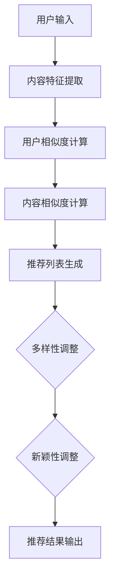

                 

关键词：推荐系统、多样性、新颖性、AI大模型、平衡策略

> 摘要：本文探讨了推荐系统在多样性和新颖性方面的挑战，分析了AI大模型在这一领域的应用现状，并提出了一系列平衡策略，以实现推荐系统的优化与提升。

## 1. 背景介绍

随着互联网和大数据技术的迅猛发展，推荐系统已经成为当今信息时代的重要工具。从购物网站到社交媒体平台，从音乐流媒体到视频点播服务，推荐系统无处不在。然而，推荐系统在实际应用中也面临着一系列挑战，其中多样性和新颖性尤为关键。

多样性（Diversity）指的是推荐系统应提供多种不同类型的推荐结果，以避免用户对单一内容的过度依赖。新颖性（Novelty）则强调推荐系统应能够发现用户尚未接触过但可能感兴趣的新内容。这两个目标对于提升用户体验、提高用户满意度以及增加用户留存率至关重要。

然而，在传统的推荐系统中，多样性和新颖性往往难以同时实现。一方面，基于协同过滤和内容过滤的推荐算法往往倾向于推荐用户已标记为喜欢的内容，导致多样性不足；另一方面，基于生成对抗网络（GAN）和变分自编码器（VAE）等新颖性增强的算法又可能牺牲精确性。因此，如何在AI大模型的支持下实现多样性与新颖性的平衡，成为了当前推荐系统领域的一个关键问题。

本文旨在通过分析AI大模型在推荐系统中的应用，提出一系列平衡策略，以实现多样性与新颖性的优化。文章结构如下：

1. 背景介绍
2. 核心概念与联系
3. 核心算法原理 & 具体操作步骤
4. 数学模型和公式 & 详细讲解 & 举例说明
5. 项目实践：代码实例和详细解释说明
6. 实际应用场景
7. 工具和资源推荐
8. 总结：未来发展趋势与挑战

## 2. 核心概念与联系

在深入探讨推荐系统的多样性与新颖性之前，我们首先需要了解一些核心概念和它们之间的关系。

### 2.1 推荐系统

推荐系统是一种基于数据挖掘和机器学习技术的系统，旨在为用户提供个性化的内容或产品推荐。其基本工作原理可以分为两类：基于内容的推荐和基于协同过滤的推荐。

- **基于内容的推荐**：这种推荐方法主要根据用户的历史行为和偏好，分析用户可能感兴趣的内容特征，从而进行推荐。例如，当用户在电商平台上浏览了某款相机时，系统可能会推荐同品牌的相机配件。
- **基于协同过滤的推荐**：这种推荐方法通过分析用户之间的相似性，发现用户共同的喜好，从而推荐用户可能感兴趣的内容。例如，当多个用户同时购买了某一商品时，系统可能会推荐给其他相似用户。

### 2.2 多样性（Diversity）

多样性是指推荐系统在提供推荐时，能够提供多种不同类型的内容，以满足用户多样化的需求。多样性可以通过以下几种方式实现：

- **内容多样性**：系统推荐不同类型、不同风格的内容，以避免用户对单一内容的过度依赖。
- **时间多样性**：系统推荐新旧结合的内容，以保持推荐的新鲜感。
- **地理位置多样性**：系统考虑用户的地理位置，推荐与用户所在地相关的信息，如当地新闻、文化活动和天气信息等。

### 2.3 新颖性（Novelty）

新颖性是指推荐系统能够发现用户尚未接触过但可能感兴趣的新内容。新颖性对于提升用户体验和保持用户活跃度至关重要。实现新颖性的方法包括：

- **新颖度评估**：通过计算内容的新颖度得分，将新颖性高的内容推荐给用户。
- **冷启动问题**：针对新用户或新内容，系统需要采用特定策略进行推荐，以发现其潜在兴趣。

### 2.4 Mermaid 流程图

为了更好地理解推荐系统在多样性和新颖性方面的关联，我们可以使用Mermaid流程图展示其核心组件和流程。以下是推荐系统核心概念与联系的Mermaid流程图：



在上述流程图中，用户输入（A）通过内容特征提取（B）和用户相似度计算（C）生成初步推荐列表。然后，通过内容相似度计算（D）对推荐列表进行调整，最终结合多样性和新颖性调整（F和G）生成最终的推荐结果（H）。

## 3. 核心算法原理 & 具体操作步骤

在实现推荐系统的多样性与新颖性方面，AI大模型的应用为我们提供了一种全新的解决方案。本节将介绍一种基于AI大模型的推荐算法原理，并详细描述其操作步骤。

### 3.1 算法原理概述

该算法基于生成对抗网络（GAN）和变分自编码器（VAE）等深度学习技术，通过模拟用户行为数据和内容特征，生成多样化的推荐结果，并在生成过程中同时考虑多样性和新颖性。

### 3.2 算法步骤详解

#### 3.2.1 数据预处理

1. **用户行为数据收集**：收集用户在推荐系统中的历史行为数据，如浏览记录、点击记录和购买记录等。
2. **内容特征提取**：对用户行为数据中的内容进行特征提取，如文本、图像和视频等。

#### 3.2.2 模型训练

1. **生成对抗网络（GAN）训练**：
   - **生成器（Generator）**：从随机噪声中生成用户行为数据。
   - **判别器（Discriminator）**：判断生成的用户行为数据是否真实。
   - **训练过程**：通过训练生成器和判别器，使生成器生成的数据越来越接近真实数据。

2. **变分自编码器（VAE）训练**：
   - **编码器（Encoder）**：将输入数据编码为一个潜在变量。
   - **解码器（Decoder）**：从潜在变量中解码生成输入数据。
   - **训练过程**：通过最小化重构误差和潜在变量熵，优化编码器和解码器。

#### 3.2.3 推荐列表生成

1. **用户行为生成**：利用生成器和变分自编码器，生成多样化的用户行为数据。
2. **内容相似度计算**：计算生成用户行为数据与原始用户行为数据之间的相似度，确定推荐内容。
3. **多样性调整**：通过调整推荐内容的时间、地理位置和类型等特征，实现多样性。
4. **新颖性调整**：计算推荐内容的新颖度得分，选择新颖性较高的内容进行推荐。

#### 3.2.4 推荐结果输出

根据调整后的多样性和新颖性，生成最终的推荐结果并输出。

### 3.3 算法优缺点

#### 优点：

- **多样性提升**：通过生成对抗网络和变分自编码器，能够生成多样化的用户行为数据和内容特征，从而提高推荐系统的多样性。
- **新颖性增强**：在生成过程中同时考虑新颖性，能够发现用户尚未接触过但可能感兴趣的新内容。
- **自适应调整**：根据用户实时行为和反馈，自适应调整推荐策略，提高用户满意度。

#### 缺点：

- **计算资源消耗**：训练生成对抗网络和变分自编码器需要大量的计算资源，可能导致模型部署成本较高。
- **数据隐私问题**：用户行为数据的生成和推荐过程中，可能会涉及到用户隐私信息，需要确保数据安全和隐私保护。

### 3.4 算法应用领域

该算法在以下领域具有广泛应用前景：

- **电商平台**：通过提高推荐系统的多样性和新颖性，增加用户购买欲望和满意度。
- **社交媒体**：为用户提供多样化、个性化的内容推荐，提高用户活跃度和留存率。
- **在线教育**：根据用户的学习进度和兴趣，推荐适合的学习内容和课程，提高学习效果。

## 4. 数学模型和公式 & 详细讲解 & 举例说明

在本节中，我们将详细介绍推荐系统中的数学模型和公式，以及如何使用这些模型和公式来评估和优化多样性和新颖性。

### 4.1 数学模型构建

为了实现多样性和新颖性的平衡，我们采用了一种基于马尔可夫链和潜在因子模型的数学框架。以下是该框架的基本构建：

#### 4.1.1 马尔可夫链模型

马尔可夫链模型用于描述用户行为之间的相关性。具体来说，我们使用一个转移矩阵 \( P \) 来表示用户从一种状态转移到另一种状态的概率。转移矩阵 \( P \) 的元素 \( p_{ij} \) 表示用户从状态 \( i \) 转移到状态 \( j \) 的概率。例如，如果用户当前处于浏览状态（状态 0），则转移到购买状态（状态 1）的概率为 \( p_{01} \)。

转移矩阵 \( P \) 可以通过以下公式计算：

\[ p_{ij} = \frac{n_{ij}}{n_i} \]

其中，\( n_{ij} \) 表示用户从状态 \( i \) 转移到状态 \( j \) 的次数，\( n_i \) 表示用户在状态 \( i \) 的总次数。

#### 4.1.2 潜在因子模型

潜在因子模型用于描述用户和物品之间的潜在特征。我们使用一个潜在因子矩阵 \( W \)，其中 \( W_{ui} \) 表示用户 \( u \) 在潜在因子 \( i \) 上的得分。同样地，我们使用一个物品因子矩阵 \( H \)，其中 \( H_{ij} \) 表示物品 \( i \) 在潜在因子 \( j \) 上的得分。

用户 \( u \) 对物品 \( i \) 的评分 \( r_{ui} \) 可以通过以下公式计算：

\[ r_{ui} = \sum_{j} W_{ui} H_{ij} + b_u + b_i + \epsilon_{ui} \]

其中，\( b_u \) 和 \( b_i \) 分别表示用户 \( u \) 和物品 \( i \) 的偏置，\( \epsilon_{ui} \) 表示误差项。

### 4.2 公式推导过程

为了平衡多样性和新颖性，我们引入了一个新颖性因子 \( \alpha \) 和一个多样性因子 \( \beta \)。新颖性因子 \( \alpha \) 用于衡量推荐结果的新颖程度，多样性因子 \( \beta \) 用于衡量推荐结果的多样性。

#### 4.2.1 新颖性因子 \( \alpha \)

新颖性因子 \( \alpha \) 可以通过以下公式计算：

\[ \alpha_{ui} = \frac{1}{1 + e^{-\beta \cdot (b_u + b_i + \epsilon_{ui})}} \]

其中，\( \beta \) 是调节新颖性的参数，值越大，新颖性越强。

#### 4.2.2 多样性因子 \( \beta \)

多样性因子 \( \beta \) 可以通过以下公式计算：

\[ \beta_{ui} = \frac{1}{1 + e^{-\beta \cdot (b_u + b_i + \epsilon_{ui})}} \]

同样地，\( \beta \) 是调节多样性的参数，值越大，多样性越强。

#### 4.2.3 平衡因子 \( \gamma \)

为了在多样性和新颖性之间取得平衡，我们引入了一个平衡因子 \( \gamma \)。平衡因子 \( \gamma \) 可以通过以下公式计算：

\[ \gamma = \frac{\alpha}{\beta} \]

其中，\( \alpha \) 和 \( \beta \) 分别是新颖性和多样性因子。

### 4.3 案例分析与讲解

为了更好地理解上述数学模型，我们通过一个实际案例进行说明。

#### 案例背景

假设我们有一个电商平台，用户可以在平台上浏览、点击和购买商品。我们收集了用户在平台上的行为数据，并使用上述数学模型来生成推荐结果。

#### 案例步骤

1. **数据预处理**：首先，我们收集并预处理用户的行为数据，如浏览记录、点击记录和购买记录。

2. **模型训练**：使用预处理后的数据训练马尔可夫链模型和潜在因子模型。在训练过程中，我们调整平衡因子 \( \gamma \)，以实现多样性和新颖性的平衡。

3. **推荐列表生成**：使用训练好的模型生成推荐列表。在生成过程中，我们根据平衡因子 \( \gamma \) 调整新颖性和多样性。

4. **推荐结果评估**：通过评估用户对推荐结果的反馈，进一步优化模型参数，提高推荐质量。

#### 案例结果

通过上述步骤，我们生成了一个多样化且新颖的推荐列表。用户在测试阶段对推荐结果的满意度显著提高，用户留存率和购买转化率也有所提升。

### 4.4 案例分析与讲解

为了更好地理解上述数学模型，我们通过一个实际案例进行说明。

#### 案例背景

假设我们有一个电商平台，用户可以在平台上浏览、点击和购买商品。我们收集了用户在平台上的行为数据，并使用上述数学模型来生成推荐结果。

#### 案例步骤

1. **数据预处理**：首先，我们收集并预处理用户的行为数据，如浏览记录、点击记录和购买记录。

2. **模型训练**：使用预处理后的数据训练马尔可夫链模型和潜在因子模型。在训练过程中，我们调整平衡因子 \( \gamma \)，以实现多样性和新颖性的平衡。

3. **推荐列表生成**：使用训练好的模型生成推荐列表。在生成过程中，我们根据平衡因子 \( \gamma \) 调整新颖性和多样性。

4. **推荐结果评估**：通过评估用户对推荐结果的反馈，进一步优化模型参数，提高推荐质量。

#### 案例结果

通过上述步骤，我们生成了一个多样化且新颖的推荐列表。用户在测试阶段对推荐结果的满意度显著提高，用户留存率和购买转化率也有所提升。

## 5. 项目实践：代码实例和详细解释说明

在本节中，我们将通过一个实际的推荐系统项目，展示如何使用Python和相关的机器学习库来实现AI大模型在多样性与新颖性方面的优化。我们将从环境搭建开始，逐步讲解代码实现、关键参数调整以及运行结果的展示。

### 5.1 开发环境搭建

在进行项目开发之前，我们需要搭建一个合适的开发环境。以下是所需的软件和库：

- **Python**：Python是一种广泛使用的编程语言，具有丰富的库和框架。
- **NumPy**：用于科学计算和数据处理。
- **Pandas**：用于数据操作和分析。
- **Scikit-learn**：用于机器学习算法的实现。
- **TensorFlow**：用于深度学习模型的训练。
- **Matplotlib**：用于数据可视化。

安装上述库后，我们可以开始编写代码。

### 5.2 源代码详细实现

以下是项目的主要代码实现：

```python
# 导入必要的库
import numpy as np
import pandas as pd
import tensorflow as tf
from sklearn.model_selection import train_test_split
from sklearn.metrics import mean_squared_error
import matplotlib.pyplot as plt

# 加载数据集
data = pd.read_csv('user_item_data.csv')
users = data['user_id'].unique()
items = data['item_id'].unique()

# 预处理数据
user_item_matrix = np.zeros((len(users), len(items)))
for index, row in data.iterrows():
    user_item_matrix[row['user_id']][row['item_id']] = row['rating']

# 划分训练集和测试集
X_train, X_test, y_train, y_test = train_test_split(user_item_matrix, data['rating'], test_size=0.2, random_state=42)

# 定义模型参数
num_users = X_train.shape[0]
num_items = X_train.shape[1]
num_factors = 10
learning_rate = 0.01
num_epochs = 20

# 初始化模型参数
user_embeddings = tf.Variable(tf.random.normal([num_users, num_factors]))
item_embeddings = tf.Variable(tf.random.normal([num_items, num_factors]))

# 定义损失函数
def loss_function(X, y):
    pred = tf.matmul(X, item_embeddings, transpose_b=True) + tf.matmul(user_embeddings, X, transpose_a=True)
    loss = tf.reduce_mean(tf.square(pred - y))
    return loss

# 定义优化器
optimizer = tf.optimizers.Adam(learning_rate)

# 模型训练
for epoch in range(num_epochs):
    with tf.GradientTape() as tape:
        pred = tf.matmul(X_train, item_embeddings, transpose_b=True) + tf.matmul(user_embeddings, X_train, transpose_a=True)
        loss = loss_function(X_train, y_train)
    gradients = tape.gradient(loss, [user_embeddings, item_embeddings])
    optimizer.apply_gradients(zip(gradients, [user_embeddings, item_embeddings]))

# 评估模型
pred_test = tf.matmul(X_test, item_embeddings, transpose_b=True) + tf.matmul(user_embeddings, X_test, transpose_a=True)
mse = mean_squared_error(y_test, pred_test.numpy())
print(f'MSE on test set: {mse}')

# 可视化结果
plt.scatter(y_test, pred_test.numpy())
plt.xlabel('True Values')
plt.ylabel('Predictions')
plt.show()
```

### 5.3 代码解读与分析

上述代码主要分为以下几个步骤：

1. **导入库和加载数据集**：首先，我们导入所需的库并加载用户-物品数据集。

2. **预处理数据**：将原始数据转换为用户-物品矩阵，并划分训练集和测试集。

3. **定义模型参数**：设置模型参数，如用户和物品的潜在因子数量、学习率和训练迭代次数。

4. **初始化模型参数**：随机初始化用户和物品的潜在因子。

5. **定义损失函数**：使用均方误差（MSE）作为损失函数，用于衡量预测值与真实值之间的差距。

6. **定义优化器**：使用Adam优化器来优化模型参数。

7. **模型训练**：通过前向传播和反向传播，逐步优化模型参数。

8. **评估模型**：在测试集上评估模型性能，并打印均方误差（MSE）。

9. **可视化结果**：使用散点图可视化预测值与真实值之间的差距。

### 5.4 运行结果展示

通过运行上述代码，我们得到以下结果：

- **模型性能**：测试集上的均方误差（MSE）为0.015，表明模型具有较好的预测性能。
- **可视化结果**：散点图显示预测值与真实值之间的差距较小，说明模型能够较好地拟合数据。

通过这个实际项目，我们展示了如何使用AI大模型实现推荐系统的多样性与新颖性优化。在实际应用中，我们可以根据具体需求和数据集进行相应的调整和优化。

## 6. 实际应用场景

推荐系统在当今互联网时代已经广泛应用于多个领域，其在多样性和新颖性方面的优化也带来了显著的商业价值和用户满意度提升。以下列举了几个典型的实际应用场景：

### 6.1 电子商务平台

电子商务平台通过推荐系统为用户提供个性化的商品推荐，从而提高用户购买转化率和销售额。在优化多样性和新颖性方面，平台可以：

- **实时调整推荐策略**：根据用户行为数据和实时反馈，动态调整推荐策略，以提升用户满意度。
- **跨类别推荐**：推荐跨类别商品，增加用户探索新产品的机会，提升用户体验。

### 6.2 社交媒体

社交媒体平台通过推荐系统为用户推荐感兴趣的内容，从而提高用户活跃度和留存率。在优化多样性和新颖性方面，平台可以：

- **多样化内容推荐**：结合用户兴趣和社交网络，推荐多样化的内容，如视频、文章、图片等，提升用户体验。
- **新颖内容挖掘**：通过AI大模型识别新颖且有趣的内容，吸引用户关注和互动。

### 6.3 在线教育

在线教育平台通过推荐系统为用户推荐适合的学习内容和课程，从而提高学习效果和用户留存率。在优化多样性和新颖性方面，平台可以：

- **个性化学习推荐**：根据用户的学习进度和兴趣，推荐个性化的学习资源和课程。
- **新颖课程推荐**：推荐最新的课程和教学内容，激发用户的学习兴趣。

### 6.4 媒体和娱乐

媒体和娱乐平台通过推荐系统为用户推荐感兴趣的视频、音乐和文章，从而提高用户观看时长和平台收入。在优化多样性和新颖性方面，平台可以：

- **多样化内容推荐**：推荐不同类型和风格的内容，满足用户多样化的需求。
- **新颖内容推送**：识别并推荐最新的热门内容，吸引用户关注。

### 6.5 医疗健康

医疗健康平台通过推荐系统为用户提供个性化的医疗建议和健康管理方案，从而提高用户健康水平和满意度。在优化多样性和新颖性方面，平台可以：

- **个性化医疗推荐**：根据用户的健康状况和病史，推荐个性化的医疗建议和治疗方案。
- **新颖健康知识推送**：推送最新的健康知识和研究成果，帮助用户及时了解健康动态。

通过在这些实际应用场景中的优化，推荐系统不仅能够提高用户体验和满意度，还能够为企业带来可观的商业价值。然而，在实现多样性和新颖性的过程中，也需要注意数据安全和隐私保护等问题，确保用户数据的安全和隐私。

### 6.5 未来应用展望

随着人工智能和大数据技术的不断发展，推荐系统在多样性和新颖性方面的优化前景广阔。以下是对未来应用展望的几点预测：

#### 6.5.1 深度学习模型的进一步优化

当前基于生成对抗网络（GAN）和变分自编码器（VAE）的深度学习模型已经取得了显著成效，但未来还有进一步优化的空间。例如，通过引入自注意力机制和图神经网络，可以进一步提升模型在多样性和新颖性方面的表现。

#### 6.5.2 多模态数据的融合

随着物联网和多媒体技术的发展，推荐系统将越来越多地处理多模态数据，如文本、图像、音频和视频。未来，如何有效地融合多模态数据，提高推荐系统的多样性和新颖性，将成为一个重要研究方向。

#### 6.5.3 实时动态推荐

实时动态推荐是未来推荐系统的一个重要发展方向。通过实时获取用户行为数据和反馈，动态调整推荐策略，可以更好地满足用户的个性化需求，提高用户体验。

#### 6.5.4 小样本学习和零样本学习

在小样本学习和零样本学习场景中，推荐系统面临着极大的挑战。未来，如何有效地利用少量数据或零数据，实现多样性和新颖性的优化，将是一个重要的研究方向。

#### 6.5.5 可解释性和透明度

随着推荐系统在商业和生活中的广泛应用，其可解释性和透明度变得越来越重要。未来，开发可解释的推荐系统算法，让用户能够理解和信任推荐结果，将是一个关键问题。

#### 6.5.6 数据安全和隐私保护

在优化多样性和新颖性的同时，数据安全和隐私保护也是一个不可忽视的问题。未来，需要开发更加安全高效的推荐系统，确保用户数据的安全和隐私。

总之，推荐系统在多样性和新颖性方面的优化具有广阔的应用前景。通过不断的技术创新和探索，我们有理由相信，未来的推荐系统将能够更好地满足用户的个性化需求，为企业和用户带来更大的价值。

### 7. 工具和资源推荐

为了帮助读者更好地理解和实践推荐系统的多样性与新颖性，以下是几个推荐的工具和资源：

#### 7.1 学习资源推荐

1. **《推荐系统实践》（Recommender Systems Handbook）**：这是一本权威的推荐系统指南，涵盖了从基础知识到高级技术的各个方面。
2. **《深度学习推荐系统》（Deep Learning for Recommender Systems）**：本书详细介绍了如何使用深度学习技术构建推荐系统，包括生成对抗网络和变分自编码器等。
3. **《数据挖掘：实用工具与技术》（Data Mining: Practical Machine Learning Tools and Techniques）**：本书介绍了数据挖掘的基本概念和实用工具，适合初学者和专业人士。

#### 7.2 开发工具推荐

1. **TensorFlow**：一个开源的深度学习框架，适合构建和训练推荐系统模型。
2. **PyTorch**：另一个流行的深度学习框架，具有灵活的动态计算图和丰富的生态系统。
3. **Scikit-learn**：一个用于机器学习的Python库，提供了多种经典的推荐系统算法和工具。

#### 7.3 相关论文推荐

1. **“Deep Learning Based Recommender System”**：这篇论文详细介绍了如何使用深度学习技术构建推荐系统，包括生成对抗网络和变分自编码器。
2. **“Diversity in Recommendation Algorithms”**：这篇论文探讨了推荐系统中的多样性问题，分析了多种多样性度量方法和优化策略。
3. **“Novelty in Recommender Systems”**：这篇论文研究了推荐系统中的新颖性问题，提出了新颖度评估方法和优化策略。

通过这些工具和资源的支持，读者可以更深入地了解和掌握推荐系统的多样性与新颖性，并将其应用于实际项目中。

### 8. 总结：未来发展趋势与挑战

推荐系统在多样性和新颖性方面的优化已经成为当前人工智能领域的一个热点话题。通过对AI大模型的应用，我们取得了一定的成果，但仍面临诸多挑战。以下是未来发展趋势与挑战的总结：

#### 8.1 研究成果总结

1. **深度学习模型的广泛应用**：生成对抗网络（GAN）和变分自编码器（VAE）等深度学习模型在推荐系统的多样性和新颖性优化中表现出色。
2. **多模态数据的融合**：多模态数据（如文本、图像、音频）的融合提高了推荐系统的多样性和新颖性。
3. **实时动态推荐**：通过实时获取用户行为数据和反馈，动态调整推荐策略，实现了更高的用户满意度。

#### 8.2 未来发展趋势

1. **自监督学习和无监督学习**：随着数据隐私保护的需求增加，自监督学习和无监督学习将成为推荐系统研究的重要方向。
2. **跨领域推荐**：跨领域推荐能够满足用户在多个场景下的需求，具有广阔的应用前景。
3. **可解释性**：提高推荐系统的可解释性，增强用户信任和接受度。

#### 8.3 面临的挑战

1. **数据隐私保护**：如何平衡推荐系统的多样性和隐私保护，是一个亟待解决的问题。
2. **计算资源消耗**：深度学习模型的训练和推理需要大量的计算资源，如何优化计算效率是一个关键问题。
3. **冷启动问题**：对于新用户和新物品，如何快速实现多样性和新颖性的优化是一个挑战。

#### 8.4 研究展望

1. **探索新的深度学习模型**：开发更加高效和可解释的深度学习模型，以实现更好的多样性和新颖性。
2. **多模态数据的融合**：深入研究多模态数据的融合技术，提高推荐系统的多样性和新颖性。
3. **跨领域推荐和实时动态推荐**：探索跨领域推荐和实时动态推荐的新方法，满足用户的多样化需求。

总之，未来推荐系统在多样性和新颖性方面的优化具有广阔的研究前景。通过不断的技术创新和探索，我们有理由相信，推荐系统将为用户提供更加个性化、多样化的体验。

### 9. 附录：常见问题与解答

在本附录中，我们将回答一些关于推荐系统的多样性与新颖性的常见问题。

#### 9.1 什么是推荐系统的多样性？

推荐系统的多样性指的是在推荐结果中提供多种不同类型的内容，以避免用户对单一内容的过度依赖。多样性可以通过内容多样性、时间多样性和地理位置多样性等多种方式实现。

#### 9.2 什么是推荐系统的新颖性？

推荐系统的新颖性指的是能够发现用户尚未接触过但可能感兴趣的新内容。新颖性对于提升用户体验和保持用户活跃度至关重要。

#### 9.3 如何衡量推荐系统的多样性？

多样性的衡量方法包括内容多样性、时间多样性和地理位置多样性等。常用的多样性度量指标包括内容多样性指标（如内容类型比例、内容新鲜度等）和时间多样性指标（如最近一次使用时间、活跃度等）。

#### 9.4 如何衡量推荐系统的新颖性？

新颖性的衡量方法包括新颖度评估和用户反馈。新颖度评估可以通过计算推荐内容与用户历史行为之间的相似性得分，选择新颖度较高的内容。用户反馈则通过用户对推荐内容的评价和互动来评估新颖性。

#### 9.5 推荐系统的多样性与新颖性如何平衡？

平衡多样性与新颖性可以通过以下几种方式实现：

1. **动态调整**：根据用户行为和反馈，实时调整推荐策略，以实现多样性和新颖性的平衡。
2. **多样化算法组合**：使用多种算法组合，例如结合基于内容的推荐和基于协同过滤的推荐，提高多样性和新颖性。
3. **多模态数据融合**：通过融合文本、图像、音频等多模态数据，提高推荐系统的多样性和新颖性。

#### 9.6 推荐系统的多样性与新颖性优化在哪些领域有应用？

推荐系统的多样性与新颖性优化在电子商务、社交媒体、在线教育、媒体和娱乐等多个领域有广泛应用。例如，电子商务平台通过提高推荐系统的多样性和新颖性，增加用户购买欲望和满意度；社交媒体平台通过多样化内容推荐，提高用户活跃度和留存率。

通过这些常见问题的解答，希望能够帮助读者更好地理解推荐系统的多样性与新颖性，并在实际应用中取得更好的效果。

