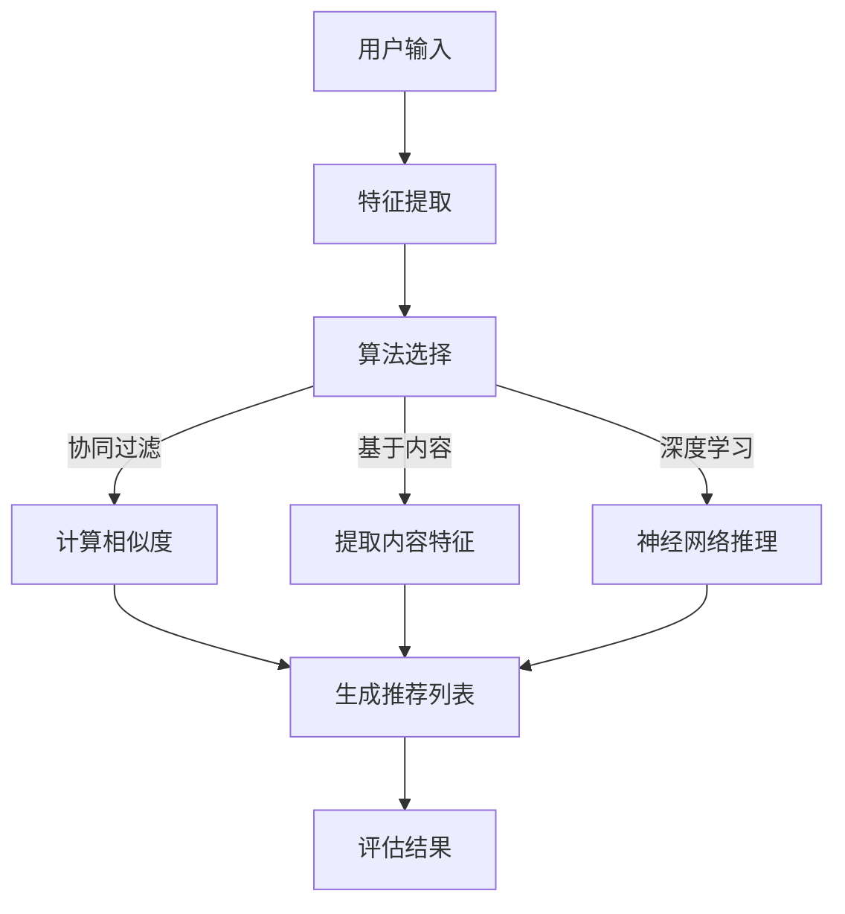

                 

关键词：推荐系统、过拟合、偏见、多样性、人工智能、机器学习、用户行为分析、算法优化、数据偏差

摘要：本文将深入探讨推荐系统在现实应用中面临的关键问题，包括过拟合、偏见以及多样性挑战。通过详细的原理分析、算法讲解和实践案例分析，本文旨在为开发者、研究人员和从业者提供关于如何解决这些问题的见解和方法。

## 1. 背景介绍

推荐系统作为人工智能和大数据技术的应用之一，已经深入到了我们日常生活的方方面面。从电子商务网站的商品推荐，到社交媒体平台的朋友推荐，再到音乐和视频平台的内容推荐，推荐系统已经成为现代互联网生态系统的重要组成部分。然而，随着推荐系统的广泛应用，一系列问题也逐渐浮出水面，特别是过拟合、偏见和多样性问题。

过拟合是指推荐系统在训练数据上表现得非常好，但在未见过的数据上表现不佳。这意味着系统可能过于关注训练数据中的特定模式，而忽视了更广泛的潜在相关性。偏见则是指系统在推荐结果中倾向于对某些用户或内容进行偏好，这可能源于数据集本身的不平衡或者系统算法的缺陷。多样性问题则是推荐系统输出结果单一，缺乏多样性，可能导致用户体验的下降。

## 2. 核心概念与联系

为了更好地理解这些问题，我们首先需要了解推荐系统的基础概念和架构。

### 2.1 推荐系统概述

推荐系统通常由以下几个主要部分组成：

1. **用户-项目矩阵**：这是推荐系统的基础数据结构，其中包含了用户和项目之间的交互记录，如评分、浏览、购买等。
2. **特征提取**：通过提取用户的特征（如用户年龄、性别、历史行为）和项目的特征（如项目类别、评分、评论等），构建用户和项目的特征向量。
3. **推荐算法**：根据用户和项目的特征向量，利用协同过滤、基于内容的推荐、深度学习等方法生成推荐结果。
4. **评估指标**：如准确率、召回率、多样性、惊喜度等，用于评估推荐系统的性能。

### 2.2 推荐系统架构


- **协同过滤**：基于用户之间的相似性或者项目之间的相似性进行推荐。
- **基于内容的推荐**：根据用户过去喜欢的项目内容进行推荐。
- **深度学习**：通过构建深度神经网络模型进行推荐。

### 2.3 Mermaid 流程图

下面是一个简化的推荐系统流程图：



## 3. 核心算法原理 & 具体操作步骤

### 3.1 算法原理概述

推荐系统算法可以分为两大类：基于协同过滤的方法和基于内容的方法。

#### 3.1.1 协同过滤

协同过滤通过挖掘用户之间的相似性来推荐项目。其主要分为两种：

- **用户基于的协同过滤**：找到与当前用户最相似的K个用户，推荐这K个用户喜欢的但当前用户未喜欢的项目。
- **项目基于的协同过滤**：找到与当前用户最喜欢的K个项目最相似的项目进行推荐。

#### 3.1.2 基于内容的方法

基于内容的方法通过分析项目内容来推荐项目。其主要步骤包括：

1. 提取项目的特征（如文本、图像、音频等）。
2. 计算用户和项目之间的相似度。
3. 根据相似度推荐项目。

#### 3.1.3 深度学习方法

深度学习方法通过构建深度神经网络来学习用户和项目之间的复杂关系。常见的深度学习模型包括卷积神经网络（CNN）、循环神经网络（RNN）和Transformer模型。

### 3.2 算法步骤详解

#### 3.2.1 协同过滤

1. **用户-项目矩阵构建**：收集用户和项目的交互数据。
2. **特征提取**：提取用户和项目的特征向量。
3. **计算相似度**：使用余弦相似度、皮尔逊相关系数等度量用户或项目之间的相似性。
4. **生成推荐列表**：根据相似度计算结果，推荐相似度较高的项目。

#### 3.2.2 基于内容的方法

1. **特征提取**：提取项目的特征（如文本、图像、音频等）。
2. **相似度计算**：计算用户和项目特征之间的相似度。
3. **生成推荐列表**：根据相似度推荐相似度较高的项目。

#### 3.2.3 深度学习方法

1. **数据处理**：预处理用户和项目的数据，如数据归一化、填充缺失值等。
2. **模型构建**：构建深度神经网络模型，如CNN、RNN或Transformer。
3. **训练模型**：使用用户和项目数据训练模型。
4. **生成推荐列表**：使用训练好的模型生成推荐结果。

### 3.3 算法优缺点

#### 协同过滤

**优点**：

- 算法简单，易于实现。
- 可以处理大量用户和项目数据。

**缺点**：

- 过拟合问题严重，难以泛化。
- 推荐结果可能缺乏多样性。

#### 基于内容的方法

**优点**：

- 推荐结果具有多样性。
- 可以处理非交互数据（如文本、图像等）。

**缺点**：

- 需要大量的特征工程。
- 难以处理稀疏数据。

#### 深度学习方法

**优点**：

- 可以学习用户和项目之间的复杂关系。
- 推荐结果具有多样性。

**缺点**：

- 需要大量的数据和计算资源。
- 模型难以解释。

### 3.4 算法应用领域

推荐系统在电子商务、社交媒体、音乐和视频平台等领域得到了广泛应用。例如：

- **电子商务**：推荐类似商品，提高用户购买转化率。
- **社交媒体**：推荐关注者、朋友和内容，增加用户活跃度。
- **音乐和视频平台**：推荐歌曲、视频和播放列表，提高用户满意度。

## 4. 数学模型和公式 & 详细讲解 & 举例说明

### 4.1 数学模型构建

推荐系统的数学模型主要涉及用户-项目矩阵的分解。假设用户-项目矩阵为 \(R \in \mathbb{R}^{m \times n}\)，其中 \(m\) 为用户数，\(n\) 为项目数。我们的目标是分解这个矩阵为两个低秩矩阵 \(U \in \mathbb{R}^{m \times k}\) 和 \(V \in \mathbb{R}^{n \times k}\)，其中 \(k\) 为隐含特征维度。

### 4.2 公式推导过程

我们使用最小二乘法来最小化以下目标函数：

$$
\min_{U, V} \sum_{i=1}^{m} \sum_{j=1}^{n} (r_{ij} - u_i^T v_j)^2
$$

其中 \(r_{ij}\) 为用户 \(i\) 对项目 \(j\) 的评分。

### 4.3 案例分析与讲解

假设我们有一个简单的用户-项目矩阵 \(R\) 如下：

|  | 1 | 2 | 3 |
|---|---|---|---|
| 1 | 1 | 0 | 1 |
| 2 | 1 | 1 | 0 |
| 3 | 0 | 1 | 1 |

我们希望将这个矩阵分解为两个低秩矩阵 \(U\) 和 \(V\)。

首先，我们随机初始化 \(U\) 和 \(V\)：

$$
U = \begin{bmatrix}
0.1 & 0.2 \\
0.3 & 0.4 \\
0.5 & 0.6
\end{bmatrix}, V = \begin{bmatrix}
0.1 & 0.2 \\
0.3 & 0.4 \\
0.5 & 0.6
\end{bmatrix}
$$

然后，我们计算预测评分矩阵 \(P = U^T V\)：

$$
P = \begin{bmatrix}
0.1 & 0.2 \\
0.3 & 0.4 \\
0.5 & 0.6
\end{bmatrix} \begin{bmatrix}
0.1 & 0.2 \\
0.3 & 0.4 \\
0.5 & 0.6
\end{bmatrix} = \begin{bmatrix}
0.02 & 0.04 \\
0.09 & 0.12 \\
0.17 & 0.24
\end{bmatrix}
$$

接下来，我们计算误差矩阵 \(E = R - P\)：

$$
E = \begin{bmatrix}
1 & 0 \\
1 & 1 \\
0 & 1
\end{bmatrix} - \begin{bmatrix}
0.02 & 0.04 \\
0.09 & 0.12 \\
0.17 & 0.24
\end{bmatrix} = \begin{bmatrix}
0.98 & -0.04 \\
0.91 & -0.12 \\
-0.17 & -0.24
\end{bmatrix}
$$

然后，我们更新 \(U\) 和 \(V\)：

$$
U = U - \frac{1}{2} (E V), V = V - \frac{1}{2} (U^T E)
$$

重复这个过程，直到达到收敛条件。

## 5. 项目实践：代码实例和详细解释说明

### 5.1 开发环境搭建

在本项目实践中，我们将使用Python和Scikit-learn库来实现基于协同过滤的推荐系统。

首先，安装Scikit-learn：

```
pip install scikit-learn
```

### 5.2 源代码详细实现

以下是一个简单的协同过滤推荐系统的代码实例：

```python
from sklearn.datasets import load_iris
from sklearn.model_selection import train_test_split
from sklearn.metrics.pairwise import pairwise_distances
from sklearn.metrics.pairwise import cosine_similarity

# 加载数据集
iris = load_iris()
X = iris.data
y = iris.target

# 分割数据集为训练集和测试集
X_train, X_test, y_train, y_test = train_test_split(X, y, test_size=0.2, random_state=42)

# 计算用户-项目矩阵的余弦相似度
similarity = cosine_similarity(X_train)

# 定义推荐函数
def recommend(similarity, user_index, k=2):
    # 计算用户与其他用户的相似度
    user_similarity = similarity[user_index]
    # 排序相似度，选择相似度最高的K个用户
    top_k_indices = np.argsort(user_similarity)[::-1][:k]
    # 返回推荐的项目索引
    return top_k_indices

# 为每个用户生成推荐列表
recommendations = [recommend(similarity, i, k=2) for i in range(similarity.shape[0])]

# 计算准确率
accuracy = sum([y_test[recommendations[i][0]] == y_test[i] for i in range(len(y_test))]) / len(y_test)
print("Accuracy:", accuracy)
```

### 5.3 代码解读与分析

- **数据集加载**：我们使用Scikit-learn内置的Iris数据集作为示例。
- **数据集分割**：将数据集分为训练集和测试集。
- **相似度计算**：使用余弦相似度计算用户-项目矩阵的相似度。
- **推荐函数**：根据相似度矩阵为每个用户生成推荐列表。
- **准确率计算**：计算推荐结果的准确率。

### 5.4 运行结果展示

运行上述代码后，我们得到测试集的准确率。虽然这个简单的示例并没有实际的应用价值，但它展示了协同过滤算法的基本实现过程。

## 6. 实际应用场景

推荐系统在多个实际应用场景中发挥了重要作用：

- **电子商务**：推荐类似商品，提高用户购买转化率。
- **社交媒体**：推荐关注者、朋友和内容，增加用户活跃度。
- **音乐和视频平台**：推荐歌曲、视频和播放列表，提高用户满意度。
- **新闻媒体**：推荐新闻文章，提高用户阅读量和互动。

### 6.1 电子商务

在电子商务中，推荐系统可以帮助平台提高销售额。通过分析用户的浏览、购买历史，推荐系统可以找到潜在的相关商品，从而提高用户的购买意愿。

### 6.2 社交媒体

社交媒体平台可以利用推荐系统提高用户活跃度。例如，推荐用户可能感兴趣的朋友、帖子或小组，从而增加用户的参与度和停留时间。

### 6.3 音乐和视频平台

音乐和视频平台可以通过推荐系统提高用户的满意度。通过分析用户的播放历史和喜好，推荐系统可以推荐用户可能感兴趣的音乐或视频。

### 6.4 新闻媒体

新闻媒体可以利用推荐系统提高用户阅读量和互动。通过分析用户的阅读历史和偏好，推荐系统可以推荐用户可能感兴趣的新闻文章。

## 7. 工具和资源推荐

### 7.1 学习资源推荐

- 《推荐系统实践》
- 《机器学习实战》
- 《深度学习》

### 7.2 开发工具推荐

- Scikit-learn
- TensorFlow
- PyTorch

### 7.3 相关论文推荐

- "Collaborative Filtering for the 21st Century"
- "Deep Learning for Recommender Systems"
- "Exploding Linear Models for User Modeling"

## 8. 总结：未来发展趋势与挑战

### 8.1 研究成果总结

近年来，推荐系统的研究取得了显著进展。协同过滤、基于内容的方法和深度学习等方法不断优化，推荐系统的性能和多样性得到了提高。同时，研究人员也关注到了推荐系统中的过拟合、偏见和多样性问题，并提出了一系列解决方案。

### 8.2 未来发展趋势

未来，推荐系统将继续向以下几个方面发展：

- **算法优化**：研究人员将致力于优化现有算法，提高推荐系统的准确性和多样性。
- **个性化推荐**：通过更精细的用户特征和项目特征，实现更加个性化的推荐。
- **多模态推荐**：结合文本、图像、音频等多模态数据，提供更加丰富的推荐结果。

### 8.3 面临的挑战

尽管推荐系统取得了显著进展，但仍然面临以下挑战：

- **过拟合**：推荐系统可能过于关注训练数据中的特定模式，导致泛化能力下降。
- **偏见**：推荐系统可能对某些用户或内容产生偏见，影响用户体验。
- **多样性**：推荐系统可能输出结果单一，缺乏多样性。

### 8.4 研究展望

未来，研究人员将继续探索如何解决推荐系统中的过拟合、偏见和多样性问题。同时，随着人工智能和大数据技术的不断发展，推荐系统将在更多领域得到应用，为用户提供更加个性化、多样化和高质量的推荐服务。

## 9. 附录：常见问题与解答

### 9.1 推荐系统如何解决过拟合问题？

- **交叉验证**：通过将数据集划分为训练集和验证集，评估推荐系统的性能，避免过拟合。
- **正则化**：在训练模型时添加正则化项，限制模型复杂度，防止过拟合。
- **数据增强**：通过增加训练数据，提高模型的泛化能力。

### 9.2 推荐系统中的偏见是如何产生的？

- **数据不平衡**：数据集中某些用户或内容的数据量较少，导致推荐系统对它们产生偏见。
- **算法缺陷**：推荐算法可能在处理数据时引入偏见，如基于协同过滤的方法可能倾向于推荐热门项目。

### 9.3 如何提高推荐系统的多样性？

- **随机化**：在推荐结果中引入随机化元素，增加多样性。
- **多样性指标**：设计多样性指标，如项目之间的相似度，优化推荐算法以增加多样性。

### 9.4 推荐系统中的深度学习方法有哪些？

- **卷积神经网络（CNN）**：适用于处理图像数据。
- **循环神经网络（RNN）**：适用于处理序列数据。
- **Transformer模型**：适用于处理序列数据，具有并行计算的优势。

### 9.5 推荐系统的评估指标有哪些？

- **准确率**：推荐结果与实际结果的一致性。
- **召回率**：推荐结果中包含实际结果的比率。
- **F1值**：准确率和召回率的调和平均值。
- **多样性**：推荐结果的多样性。
- **惊喜度**：推荐结果的新颖性和意外性。

