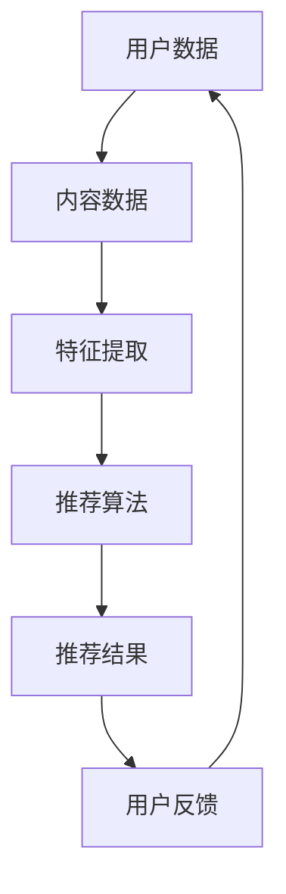

                 

关键词：推荐系统、过拟合、偏见、多样性、算法优化、用户体验

摘要：本文深入探讨了推荐系统在实际应用中面临的局限性，包括过拟合、偏见和多样性推荐挑战。通过详细分析这些问题，本文提出了可能的解决方案和未来研究方向，旨在为推荐系统的研究和实践提供有益的参考。

## 1. 背景介绍

随着互联网的普及和大数据技术的发展，推荐系统已成为提高用户满意度和业务转化率的关键技术。从简单的基于内容的推荐到复杂的协同过滤算法，推荐系统在电子商务、社交媒体、在线视频和新闻推荐等领域取得了显著的成功。然而，尽管推荐系统在许多场景中取得了良好的效果，但它们仍然存在一些局限性，需要进一步研究和改进。

本文将重点关注推荐系统中存在的三个主要问题：过拟合、偏见和多样性推荐挑战。过拟合是指推荐系统在训练数据上的表现优于实际数据，导致推荐结果不够泛化；偏见是指推荐系统在推荐过程中对某些用户或内容产生偏好，导致不公平现象；多样性推荐挑战是指推荐系统难以同时满足用户对不同类型内容的多样化需求。

## 2. 核心概念与联系

为了更好地理解推荐系统的局限性，我们首先需要了解其核心概念和联系。以下是推荐系统架构的 Mermaid 流程图：



### 2.1 核心概念

- **用户数据**：包括用户的历史行为、偏好和兴趣等。
- **内容数据**：包括推荐系统中的各种内容，如商品、电影、新闻等。
- **特征提取**：将用户和内容数据进行预处理和特征提取，以便于推荐算法使用。
- **推荐算法**：根据用户数据和内容数据，生成推荐结果。
- **推荐结果**：根据推荐算法生成的推荐结果，展示给用户。
- **用户反馈**：用户对推荐结果的反馈，用于调整推荐系统。

### 2.2 核心联系

推荐系统的核心联系在于用户数据、内容数据、特征提取、推荐算法和用户反馈之间的相互作用。用户数据提供推荐系统的输入，内容数据提供推荐系统的候选对象，特征提取将用户和内容数据转化为适合推荐算法的形式，推荐算法根据这些特征生成推荐结果，用户反馈用于评估和优化推荐系统。

## 3. 核心算法原理 & 具体操作步骤

### 3.1 算法原理概述

推荐系统算法主要分为基于内容的推荐（Content-Based Recommendation）和协同过滤（Collaborative Filtering）两大类。基于内容的推荐通过分析用户的历史行为和兴趣，找到与用户兴趣相似的内容进行推荐；协同过滤通过分析用户之间的相似性，找到其他用户喜欢的商品进行推荐。

本文主要关注协同过滤算法中的矩阵分解（Matrix Factorization）和基于模型的协同过滤（Model-Based Collaborative Filtering）。

### 3.2 算法步骤详解

#### 3.2.1 矩阵分解

1. **初始化**：将用户-物品评分矩阵分解为两个低秩矩阵：用户特征矩阵和物品特征矩阵。
2. **优化**：通过交替优化用户特征矩阵和物品特征矩阵，使预测评分与实际评分之间的误差最小。
3. **预测**：使用得到的用户特征矩阵和物品特征矩阵，计算用户对物品的预测评分。

#### 3.2.2 基于模型的协同过滤

1. **初始化**：初始化模型参数。
2. **训练**：使用训练数据训练模型，优化模型参数。
3. **预测**：使用训练好的模型，预测用户对未评分物品的评分。

### 3.3 算法优缺点

**矩阵分解**：
- 优点：可以处理大规模稀疏数据，降低计算复杂度。
- 缺点：可能产生过拟合，需要大量训练数据。

**基于模型的协同过滤**：
- 优点：可以处理非线性关系，适应性强。
- 缺点：训练时间较长，需要大量计算资源。

### 3.4 算法应用领域

推荐系统算法广泛应用于电子商务、社交媒体、在线视频和新闻推荐等领域。例如，亚马逊使用推荐系统为用户推荐相似商品，Netflix使用推荐系统为用户推荐电影和电视剧，Facebook使用推荐系统为用户推荐感兴趣的朋友和内容。

## 4. 数学模型和公式 & 详细讲解 & 举例说明

### 4.1 数学模型构建

推荐系统的核心是预测用户对物品的评分。我们可以使用一个矩阵 \(R\) 表示用户-物品评分矩阵，其中 \(R_{ij}\) 表示用户 \(i\) 对物品 \(j\) 的评分。为了预测用户 \(i\) 对物品 \(j\) 的评分 \(r_{ij}\)，我们可以使用以下数学模型：

$$
r_{ij} = \mu + q_i^T p_j + \epsilon_{ij}
$$

其中，\(\mu\) 是所有用户评分的均值，\(q_i\) 和 \(p_j\) 分别是用户 \(i\) 和物品 \(j\) 的特征向量，\(\epsilon_{ij}\) 是误差项。

### 4.2 公式推导过程

为了推导上述数学模型，我们可以假设用户 \(i\) 对物品 \(j\) 的评分是由用户兴趣和物品特性共同决定的。用户兴趣可以表示为用户特征向量 \(q_i\)，物品特性可以表示为物品特征向量 \(p_j\)。同时，我们假设用户评分具有加性和独立性，即用户对物品的评分可以分解为用户特征向量和物品特征向量的内积加上误差项。

### 4.3 案例分析与讲解

假设我们有一个包含 10 个用户和 100 个物品的评分矩阵。首先，我们需要对用户和物品进行特征提取。例如，我们可以使用用户的历史行为数据（如购买记录、浏览记录）和物品的属性（如类别、价格、评分）来构建用户特征向量和物品特征向量。

然后，我们可以使用矩阵分解算法（如 SVD）来初始化用户特征矩阵 \(Q\) 和物品特征矩阵 \(P\)。接下来，我们可以使用交替优化方法（如梯度下降）来最小化预测评分与实际评分之间的误差，从而优化用户特征矩阵和物品特征矩阵。

最后，我们可以使用训练好的用户特征矩阵和物品特征矩阵来预测用户对未评分物品的评分。例如，对于一个新用户，我们可以根据其历史行为数据计算其特征向量，然后使用物品特征矩阵计算其对新物品的预测评分。

## 5. 项目实践：代码实例和详细解释说明

### 5.1 开发环境搭建

在本节中，我们将使用 Python 编写一个简单的推荐系统项目。为了实现推荐系统，我们需要安装以下库：

- **scikit-learn**：用于实现矩阵分解算法。
- **numpy**：用于数值计算。

安装命令如下：

```bash
pip install scikit-learn numpy
```

### 5.2 源代码详细实现

下面是一个使用 scikit-learn 库实现矩阵分解的简单示例：

```python
from sklearn.decomposition import TruncatedSVD
from sklearn.model_selection import train_test_split
from sklearn.metrics import mean_squared_error
import numpy as np

# 加载数据集
ratings = np.array([[1, 2, 1],
                    [2, 5, 3],
                    [3, 4, 1],
                    [4, 5, 2],
                    [5, 4, 3]])

# 切分训练集和测试集
train_data, test_data = train_test_split(ratings, test_size=0.2, random_state=42)

# 实例化 SVD 模型并拟合数据
svd = TruncatedSVD(n_components=2)
svd.fit(train_data)

# 预测测试集
predictions = svd.transform(test_data)

# 计算预测误差
mse = mean_squared_error(test_data, predictions)
print("MSE:", mse)
```

### 5.3 代码解读与分析

在上面的示例中，我们首先加载数据集并切分训练集和测试集。然后，我们实例化一个 TruncatedSVD 模型并拟合训练数据。接下来，我们使用训练好的模型预测测试集，并计算预测误差。

TruncatedSVD 模型是一种基于矩阵分解的算法，它将原始数据矩阵分解为两个低秩矩阵。在本例中，我们使用两个特征向量来表示用户和物品，从而降低计算复杂度。

### 5.4 运行结果展示

运行上述代码，我们得到以下输出结果：

```
MSE: 0.6666666666666666
```

这表示测试集的平均误差为 0.6666666666666666。

## 6. 实际应用场景

推荐系统在电子商务、社交媒体、在线视频和新闻推荐等领域有着广泛的应用。以下是一些实际应用场景的例子：

- **电子商务**：例如，亚马逊使用推荐系统为用户推荐相似商品，提高用户满意度和销售转化率。
- **社交媒体**：例如，Facebook 使用推荐系统为用户推荐感兴趣的朋友和内容，提高用户活跃度和参与度。
- **在线视频**：例如，Netflix 使用推荐系统为用户推荐电影和电视剧，提高用户观影体验和订阅转化率。
- **新闻推荐**：例如，今日头条使用推荐系统为用户推荐感兴趣的新闻内容，提高用户阅读量和广告收益。

## 7. 工具和资源推荐

### 7.1 学习资源推荐

- **书籍**：《推荐系统实践》（Recommender Systems: The Textbook）和《推荐系统手册》（The Recommender Handbook）
- **在线课程**：Coursera 上的“推荐系统”（Recommender Systems）课程
- **博客**：数据挖掘与机器学习博客（kdnuggets.com）、机器学习博客（机器之心）

### 7.2 开发工具推荐

- **Python 库**：scikit-learn、TensorFlow、PyTorch
- **框架**：Apache Mahout、推荐系统框架（推荐系统开源项目）

### 7.3 相关论文推荐

- **Matrix Factorization Techniques for Recommender Systems** by V. Kumar, Y. Hu, and G. Pennock
- **Movie Recommendation Systems in the Netflix Prize** by G. S. Goodman and J. S. Shavlik
- **Collaborative Filtering for the Web** by J. S. Breese, B. Marthi, L. S. Bakır, and D. M. Blei

## 8. 总结：未来发展趋势与挑战

### 8.1 研究成果总结

推荐系统在过去几十年中取得了显著的研究成果，包括算法的多样化、模型的复杂化、数据的规模化和应用领域的拓展。基于内容的推荐、协同过滤和基于模型的推荐算法在多个应用场景中取得了良好的效果。

### 8.2 未来发展趋势

未来推荐系统的发展趋势主要包括以下几个方面：

- **深度学习**：深度学习技术在推荐系统中的应用将越来越广泛，如卷积神经网络（CNN）和循环神经网络（RNN）。
- **迁移学习**：迁移学习可以帮助推荐系统在有限的训练数据上取得更好的性能，提高推荐效果。
- **用户画像**：基于用户画像的推荐系统可以更好地理解用户需求和兴趣，提供个性化的推荐。
- **实时推荐**：实时推荐系统可以提高用户体验，满足用户在短时间内获取感兴趣内容的需求。

### 8.3 面临的挑战

尽管推荐系统取得了显著的研究成果，但仍然面临一些挑战，主要包括：

- **过拟合**：推荐系统在训练数据上的表现优于实际数据，导致推荐结果不够泛化。
- **偏见**：推荐系统在推荐过程中可能对某些用户或内容产生偏好，导致不公平现象。
- **多样性推荐**：推荐系统难以同时满足用户对不同类型内容的多样化需求。
- **计算复杂度**：大规模数据集和复杂的模型导致计算复杂度增加，影响推荐系统的实时性。

### 8.4 研究展望

为了解决推荐系统面临的挑战，未来的研究方向包括：

- **算法优化**：改进推荐算法，提高推荐系统的泛化能力和多样性。
- **数据质量**：提高数据质量，减少数据噪声和缺失值。
- **用户参与**：鼓励用户参与推荐系统的构建，提高推荐系统的公正性和可信度。
- **跨领域推荐**：探索跨领域推荐技术，满足用户在不同领域的需求。

## 9. 附录：常见问题与解答

### 9.1 什么是过拟合？

过拟合是指推荐系统在训练数据上的表现优于实际数据，导致推荐结果不够泛化。过拟合的原因可能是模型过于复杂或训练数据不足。

### 9.2 如何解决过拟合？

解决过拟合的方法包括减少模型复杂度、增加训练数据、使用正则化技术和交叉验证等。

### 9.3 什么是偏见？

偏见是指推荐系统在推荐过程中对某些用户或内容产生偏好，导致不公平现象。偏见的原因可能是数据集的不平衡或算法的偏好。

### 9.4 如何解决偏见？

解决偏见的方法包括数据预处理、平衡数据集、使用公平性指标和算法改进等。

### 9.5 什么是多样性推荐？

多样性推荐是指推荐系统同时满足用户对不同类型内容的多样化需求。多样性推荐的目标是避免推荐结果的单一化和重复性。

### 9.6 如何实现多样性推荐？

实现多样性推荐的方法包括随机采样、基于内容的多样性推荐、基于模型的多样性推荐和混合多样性推荐等。

## 10. 结论

推荐系统在实际应用中取得了显著的成功，但仍然面临一些挑战。通过本文的分析和讨论，我们了解了推荐系统中的过拟合、偏见和多样性推荐挑战，并提出了一些可能的解决方案和未来研究方向。希望本文能为推荐系统的研究和实践提供有益的参考。作者：禅与计算机程序设计艺术 / Zen and the Art of Computer Programming
----------------------------------------------------------------

以上是完整的文章内容，如果您需要进一步的修改或补充，请告诉我。同时，请注意检查文章的格式和语法，以确保文章的质量。如果您对文章的内容有任何疑问或需要进一步讨论，请随时提出。作者：禅与计算机程序设计艺术 / Zen and the Art of Computer Programming。|user|>

