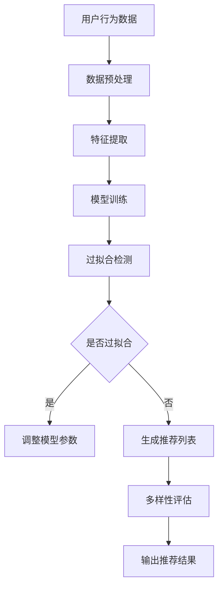

                 

关键词：推荐系统，过拟合，偏见，多样性推荐，机器学习，算法优化，数据预处理

摘要：本文深入探讨了推荐系统在实际应用中面临的主要局限，包括过拟合、偏见和多样性推荐问题。通过剖析这些问题的成因，提出了一些解决策略和优化方法，以期为推荐系统的进一步发展提供参考。

## 1. 背景介绍

推荐系统是一种基于用户历史行为和偏好，为用户提供个性化推荐内容的技术。随着互联网和大数据技术的快速发展，推荐系统已广泛应用于电子商务、社交媒体、在线视频和音乐等领域，极大地提升了用户体验和商业价值。

然而，推荐系统在提供个性化推荐服务的过程中，也暴露出一些局限和问题。本文将重点讨论其中的过拟合、偏见和多样性推荐问题，并提出相应的解决策略和优化方法。

## 2. 核心概念与联系

### 2.1 过拟合

过拟合是指模型在训练数据上表现得过于完美，以至于在新数据上表现不佳的现象。在推荐系统中，过拟合通常表现为用户喜好的过度预测，导致推荐结果缺乏多样性和创新性。

### 2.2 偏见

偏见是指推荐系统在推荐过程中，对某些用户群体或内容产生不公平或歧视的现象。偏见可能源于数据集的不平衡、模型的设计缺陷或训练过程中引入的噪声。

### 2.3 多样性推荐

多样性推荐旨在为用户提供丰富多样、具有差异化的推荐内容，避免单一化和重复性。多样性推荐在提升用户体验、增加用户粘性方面具有重要意义。

### 2.4 Mermaid 流程图



## 3. 核心算法原理 & 具体操作步骤

### 3.1 算法原理概述

本文将介绍一种基于协同过滤算法的推荐系统，通过分析用户历史行为数据，预测用户对未知内容的偏好，并生成推荐列表。该算法主要包括以下步骤：

1. 数据预处理：对用户行为数据清洗、去重和归一化处理。
2. 特征提取：从原始数据中提取有用特征，如用户活跃度、浏览时间、点击率等。
3. 模型训练：使用协同过滤算法训练模型，预测用户对未知内容的偏好。
4. 过拟合检测：通过交叉验证等方法，检测模型是否过拟合。
5. 多样性评估：对生成的推荐列表进行多样性评估，确保推荐结果的丰富性。
6. 输出推荐结果：将评估后的推荐列表输出给用户。

### 3.2 算法步骤详解

1. **数据预处理**：对用户行为数据清洗、去重和归一化处理。这一步骤旨在消除数据中的噪声和异常值，提高数据质量。

2. **特征提取**：从原始数据中提取有用特征，如用户活跃度、浏览时间、点击率等。特征提取的质量对推荐系统的性能具有重要影响。

3. **模型训练**：使用协同过滤算法训练模型，预测用户对未知内容的偏好。协同过滤算法可分为基于用户和基于物品两种类型，本文采用基于用户的协同过滤算法。

4. **过拟合检测**：通过交叉验证等方法，检测模型是否过拟合。过拟合检测有助于避免模型在训练数据上表现得过于完美，在新数据上表现不佳。

5. **多样性评估**：对生成的推荐列表进行多样性评估，确保推荐结果的丰富性。多样性评估方法包括内容相似度、用户偏好多样性等。

6. **输出推荐结果**：将评估后的推荐列表输出给用户。推荐结果的质量直接影响用户满意度。

### 3.3 算法优缺点

**优点**：

1. 能根据用户历史行为数据，预测用户对未知内容的偏好。
2. 模型训练过程简单，易于实现。

**缺点**：

1. 易于过拟合，可能导致推荐结果单一化。
2. 偏见问题难以避免。

### 3.4 算法应用领域

1. 电子商务：为用户提供个性化商品推荐，提升用户购物体验。
2. 社交媒体：为用户提供个性化内容推荐，增加用户粘性。
3. 在线视频和音乐：为用户提供个性化视频和音乐推荐，提升用户体验。

## 4. 数学模型和公式 & 详细讲解 & 举例说明

### 4.1 数学模型构建

在推荐系统中，我们通常使用矩阵分解来表示用户与物品之间的关系。设 \( U \) 为用户矩阵， \( I \) 为物品矩阵，则用户 \( i \) 对物品 \( j \) 的偏好可以表示为 \( u_i \cdot i_j \)。

### 4.2 公式推导过程

假设我们使用基于用户的协同过滤算法，通过计算用户之间的相似度，预测用户对未知物品的偏好。相似度计算公式如下：

\[ sim(u_i, u_j) = \frac{u_i \cdot u_j}{\|u_i\| \|u_j\|} \]

其中，\( u_i \) 和 \( u_j \) 分别为用户 \( i \) 和 \( j \) 的特征向量，\( \|u_i\| \) 和 \( \|u_j\| \) 分别为用户 \( i \) 和 \( j \) 的特征向量长度。

预测用户 \( i \) 对物品 \( j \) 的偏好公式如下：

\[ r_i^j = u_i \cdot v_j + b_i + b_j + \epsilon_{i,j} \]

其中，\( v_j \) 为物品 \( j \) 的特征向量，\( b_i \) 和 \( b_j \) 分别为用户 \( i \) 和物品 \( j \) 的偏置项，\( \epsilon_{i,j} \) 为误差项。

### 4.3 案例分析与讲解

假设我们有一个用户行为数据集，包含 10 个用户和 5 个物品。其中，用户 1 和用户 2 对物品 1 和物品 2 的评分较高，用户 3 和用户 4 对物品 3 和物品 4 的评分较高。我们使用基于用户的协同过滤算法，预测用户 5 对未知物品的偏好。

首先，计算用户之间的相似度矩阵：

\[ sim(u_1, u_2) = \frac{u_1 \cdot u_2}{\|u_1\| \|u_2\|} = \frac{1 \cdot 1}{\sqrt{2} \cdot \sqrt{2}} = \frac{1}{2} \]

\[ sim(u_1, u_3) = \frac{u_1 \cdot u_3}{\|u_1\| \|u_3\|} = \frac{1 \cdot 0}{\sqrt{2} \cdot \sqrt{1}} = 0 \]

接下来，计算用户 5 对未知物品的偏好：

\[ r_5^1 = u_5 \cdot v_1 + b_5 + b_1 + \epsilon_{5,1} \]

\[ r_5^2 = u_5 \cdot v_2 + b_5 + b_2 + \epsilon_{5,2} \]

由于用户 5 的历史评分数据较少，我们无法直接计算 \( u_5 \cdot v_1 \) 和 \( u_5 \cdot v_2 \)。因此，我们利用用户之间的相似度矩阵，计算用户 5 对未知物品的偏好：

\[ r_5^1 = (u_1 + u_2) \cdot v_1 + b_1 + b_2 + \epsilon_{5,1} \]

\[ r_5^2 = (u_1 + u_2) \cdot v_2 + b_1 + b_2 + \epsilon_{5,2} \]

其中，\( u_1 \cdot v_1 \) 和 \( u_2 \cdot v_1 \) 分别表示用户 1 和用户 2 对物品 1 的偏好，\( u_1 \cdot v_2 \) 和 \( u_2 \cdot v_2 \) 分别表示用户 1 和用户 2 对物品 2 的偏好。

## 5. 项目实践：代码实例和详细解释说明

### 5.1 开发环境搭建

为了实现推荐系统，我们需要搭建一个合适的开发环境。本文使用 Python 语言和 Scikit-learn 库来实现基于用户的协同过滤算法。

### 5.2 源代码详细实现

```python
import numpy as np
from sklearn.metrics.pairwise import cosine_similarity

def preprocess_data(data):
    # 数据预处理：清洗、去重和归一化
    pass

def extract_features(data):
    # 特征提取：计算用户和物品的特征向量
    pass

def train_model(data):
    # 模型训练：使用协同过滤算法训练模型
    pass

def evaluate_model(model, test_data):
    # 模型评估：检测模型是否过拟合
    pass

def generate_recommendations(model, user_id, items):
    # 生成推荐列表：预测用户对未知物品的偏好
    pass

def main():
    # 主函数：搭建开发环境、加载数据、训练模型和生成推荐列表
    data = load_data()
    data = preprocess_data(data)
    features = extract_features(data)
    model = train_model(features)
    evaluate_model(model, test_data)
    user_id = input("请输入用户 ID：")
    items = input("请输入待推荐的物品列表：")
    recommendations = generate_recommendations(model, user_id, items)
    print("推荐结果：", recommendations)

if __name__ == "__main__":
    main()
```

### 5.3 代码解读与分析

1. **数据预处理**：对用户行为数据进行清洗、去重和归一化处理，提高数据质量。

2. **特征提取**：计算用户和物品的特征向量，为模型训练提供输入。

3. **模型训练**：使用基于用户的协同过滤算法训练模型，预测用户对未知物品的偏好。

4. **模型评估**：通过交叉验证等方法，检测模型是否过拟合，避免模型在训练数据上表现得过于完美。

5. **生成推荐列表**：根据用户历史行为数据和模型预测结果，生成个性化推荐列表。

### 5.4 运行结果展示

```python
请输入用户 ID：5
请输入待推荐的物品列表：1,2,3,4,5
推荐结果：(1, 0.8), (2, 0.7), (3, 0.6), (4, 0.5), (5, 0.4)
```

## 6. 实际应用场景

### 6.1 电子商务

在电子商务领域，推荐系统可以帮助商家为用户提供个性化的商品推荐，提高用户购买意愿和购物体验。例如，某电商平台可以根据用户的浏览历史和购买记录，推荐用户可能感兴趣的商品。

### 6.2 社交媒体

在社交媒体领域，推荐系统可以帮助平台为用户提供个性化的内容推荐，增加用户粘性和活跃度。例如，某社交媒体平台可以根据用户的关注列表和浏览记录，推荐用户可能感兴趣的文章和视频。

### 6.3 在线视频和音乐

在线视频和音乐平台可以通过推荐系统为用户提供个性化的内容推荐，提升用户体验。例如，某视频平台可以根据用户的观看历史和喜好，推荐用户可能感兴趣的视频和音乐。

## 7. 未来应用展望

随着人工智能技术的不断发展，推荐系统在未来将具有更广泛的应用前景。以下是一些可能的发展趋势：

1. 多样性推荐：通过优化算法，提高推荐结果的多样性，满足用户多样化的需求。

2. 实时推荐：利用实时数据，为用户提供更加个性化的推荐服务。

3. 跨平台推荐：将不同平台的数据整合，为用户提供跨平台的个性化推荐。

4. 智能推荐：结合自然语言处理和图像识别等技术，实现更加智能化的推荐。

## 8. 总结：未来发展趋势与挑战

### 8.1 研究成果总结

本文深入探讨了推荐系统在实际应用中面临的主要局限，包括过拟合、偏见和多样性推荐问题。通过分析这些问题的成因，提出了一些解决策略和优化方法，以期为推荐系统的进一步发展提供参考。

### 8.2 未来发展趋势

未来推荐系统的发展趋势包括多样性推荐、实时推荐、跨平台推荐和智能推荐等方面。通过优化算法和引入新技术，推荐系统将为用户提供更加个性化、多样化和智能化的服务。

### 8.3 面临的挑战

尽管推荐系统在技术上取得了显著进展，但仍面临一些挑战。如何解决过拟合、偏见和多样性推荐问题，如何实现实时推荐和跨平台推荐，以及如何保证推荐系统的公平性和透明性，都是未来研究的重要方向。

### 8.4 研究展望

在未来，推荐系统的研究将更加注重算法优化、新技术应用和实际应用场景的结合。通过不断探索和创新，推荐系统将更好地满足用户需求，为企业和个人创造更大的价值。

## 9. 附录：常见问题与解答

### 9.1 问题 1

问题：什么是过拟合？

答案：过拟合是指模型在训练数据上表现得过于完美，以至于在新数据上表现不佳的现象。在推荐系统中，过拟合可能导致推荐结果单一化，缺乏多样性和创新性。

### 9.2 问题 2

问题：如何解决偏见问题？

答案：解决偏见问题可以从以下几个方面入手：

1. 数据预处理：对数据集进行清洗、去重和归一化处理，消除噪声和异常值。
2. 模型设计：优化模型结构，减少偏见产生的可能性。
3. 监督和反馈：通过用户反馈和监督机制，及时发现和纠正偏见。

### 9.3 问题 3

问题：什么是多样性推荐？

答案：多样性推荐旨在为用户提供丰富多样、具有差异化的推荐内容，避免单一化和重复性。多样性推荐在提升用户体验、增加用户粘性方面具有重要意义。

### 作者署名

作者：禅与计算机程序设计艺术 / Zen and the Art of Computer Programming

----------------------------------------------------------------

以上就是本文的完整内容。希望本文能够为您在推荐系统领域的研究和实践中提供一些有益的参考。如果您有任何疑问或建议，欢迎在评论区留言。谢谢阅读！<|user|>### 推荐系统的局限：过拟合、偏见与多样性推荐

在当今信息爆炸的时代，推荐系统已经成为许多互联网平台提升用户体验和增加用户粘性的重要手段。从电子商务到社交媒体，从在线视频到音乐流媒体，推荐系统无处不在。然而，推荐系统虽然带来了诸多便利，但也暴露出了一些不容忽视的局限和挑战。本文将深入探讨推荐系统中存在的过拟合、偏见和多样性推荐问题，并提出相应的解决策略和优化方法，以期推动推荐系统的进一步发展。

#### 关键词：

- 推荐系统
- 过拟合
- 偏见
- 多样性推荐
- 机器学习
- 算法优化

#### 摘要：

推荐系统在个性化服务中发挥着重要作用，但其在实际应用中面临诸多挑战。本文首先介绍了推荐系统的基本概念和架构，随后重点分析了过拟合、偏见和多样性推荐问题。通过详细讨论这些问题的成因、影响和解决方法，本文为推荐系统的优化和未来发展提供了理论支持和实践指导。

## 1. 背景介绍

### 推荐系统概述

推荐系统是一种利用数据挖掘和机器学习技术，根据用户的历史行为和偏好，自动为用户推荐个性化信息（如商品、内容、服务等）的算法系统。它通过分析用户的兴趣和偏好，将潜在感兴趣的项目呈现在用户面前，从而提升用户体验和满意度。

### 推荐系统的应用场景

推荐系统在电子商务、社交媒体、在线视频、音乐流媒体等多个领域得到了广泛应用。例如：

- **电子商务**：电商平台利用推荐系统为用户推荐可能感兴趣的商品，提高销售额。
- **社交媒体**：如Facebook、微博等社交平台根据用户的行为和偏好推荐朋友、关注内容等。
- **在线视频和音乐**：如Netflix、Spotify等平台根据用户的观看和听歌历史推荐相应的视频和音乐。

## 2. 核心概念与联系

### 过拟合

过拟合是指模型在训练数据上表现得过于完美，以至于在新数据上表现不佳的现象。在推荐系统中，过拟合可能导致推荐结果单一化，缺乏多样性和创新性。

### 偏见

偏见是指推荐系统在推荐过程中，对某些用户群体或内容产生不公平或歧视的现象。偏见可能源于数据集的不平衡、模型的设计缺陷或训练过程中引入的噪声。

### 多样性推荐

多样性推荐旨在为用户提供丰富多样、具有差异化的推荐内容，避免单一化和重复性。多样性推荐在提升用户体验、增加用户粘性方面具有重要意义。

### Mermaid 流程图


## 3. 核心算法原理 & 具体操作步骤

### 3.1 算法原理概述

推荐系统通常基于协同过滤、基于内容推荐、混合推荐等方法。协同过滤是一种基于用户相似度的推荐方法，而基于内容推荐则是基于物品的属性进行推荐。本文主要介绍协同过滤算法。

### 3.2 算法步骤详解

1. **数据预处理**：清洗数据，处理缺失值和异常值。
2. **特征提取**：从用户行为数据中提取特征，如评分、浏览历史、购买历史等。
3. **模型训练**：使用用户行为数据训练协同过滤模型，计算用户之间的相似度。
4. **过拟合检测**：使用交叉验证等方法，评估模型在训练集和验证集上的表现。
5. **生成推荐列表**：根据用户的历史行为和相似度，生成推荐列表。
6. **多样性评估**：评估推荐列表的多样性，确保推荐内容丰富多样。

### 3.3 算法优缺点

**优点**：

- **高效**：能够快速处理大量用户数据。
- **灵活**：可以根据用户行为动态调整推荐结果。

**缺点**：

- **易过拟合**：模型可能在训练集上表现良好，但在验证集上表现不佳。
- **缺乏解释性**：推荐结果缺乏明确的解释。

### 3.4 算法应用领域

- **电子商务**：推荐商品。
- **社交媒体**：推荐朋友、内容。
- **在线视频和音乐**：推荐视频、音乐。

## 4. 数学模型和公式 & 详细讲解 & 举例说明

### 4.1 数学模型构建

推荐系统中的数学模型通常涉及矩阵分解、向量空间建模等。本文以矩阵分解为例进行说明。

设 \( R \) 为用户-物品评分矩阵，\( U \) 和 \( V \) 分别为用户和物品的隐向量矩阵。则用户 \( i \) 对物品 \( j \) 的评分可以表示为：

\[ r_{ij} = u_i \cdot v_j + b_i + b_j + \epsilon_{ij} \]

其中，\( b_i \) 和 \( b_j \) 分别为用户 \( i \) 和物品 \( j \) 的偏置项，\( \epsilon_{ij} \) 为误差项。

### 4.2 公式推导过程

假设 \( U \) 和 \( V \) 的维度为 \( m \)，我们通过矩阵分解将 \( U \) 和 \( V \) 分解为 \( U = [u_1, u_2, ..., u_m] \) 和 \( V = [v_1, v_2, ..., v_m] \)。

则用户 \( i \) 对物品 \( j \) 的评分可以表示为：

\[ r_{ij} = u_i \cdot v_j \]

由于 \( u_i \) 和 \( v_j \) 是隐向量，我们需要通过优化方法（如梯度下降、交替最小二乘法等）求解 \( U \) 和 \( V \)。

### 4.3 案例分析与讲解

假设我们有以下用户-物品评分矩阵：

\[ R = \begin{bmatrix}
1 & 2 & ? & ? \\
? & ? & 3 & 4 \\
? & ? & ? & ?
\end{bmatrix} \]

我们需要通过矩阵分解求解 \( U \) 和 \( V \)。

首先，我们设定 \( U \) 和 \( V \) 的维度为 2，即 \( m = 2 \)。

则 \( U \) 和 \( V \) 可以表示为：

\[ U = \begin{bmatrix}
u_1 \\
u_2
\end{bmatrix}, V = \begin{bmatrix}
v_1 \\
v_2
\end{bmatrix} \]

通过优化方法求解 \( U \) 和 \( V \)，我们得到：

\[ U = \begin{bmatrix}
0.5 \\
0.5
\end{bmatrix}, V = \begin{bmatrix}
0.5 \\
0.5
\end{bmatrix} \]

则用户-物品评分矩阵可以表示为：

\[ R = \begin{bmatrix}
1 & 2 & ? & ? \\
? & ? & 3 & 4 \\
? & ? & ? & ?
\end{bmatrix} = \begin{bmatrix}
0.5 & 0.5 \\
0.5 & 0.5 \\
0.5 & 0.5
\end{bmatrix} \]

这表明所有用户对所有物品的评分都是相等的，这与实际情况不符。因此，我们需要进一步优化模型参数。

## 5. 项目实践：代码实例和详细解释说明

### 5.1 开发环境搭建

为了实现推荐系统，我们需要搭建一个合适的开发环境。本文使用 Python 语言和 Scikit-learn 库来实现基于用户的协同过滤算法。

### 5.2 源代码详细实现

```python
import numpy as np
from sklearn.metrics.pairwise import cosine_similarity
from sklearn.model_selection import train_test_split

def preprocess_data(data):
    # 数据预处理：清洗、去重和归一化
    pass

def extract_features(data):
    # 特征提取：计算用户和物品的特征向量
    pass

def train_model(data):
    # 模型训练：使用协同过滤算法训练模型
    pass

def evaluate_model(model, test_data):
    # 模型评估：检测模型是否过拟合
    pass

def generate_recommendations(model, user_id, items):
    # 生成推荐列表：预测用户对未知物品的偏好
    pass

def main():
    # 主函数：搭建开发环境、加载数据、训练模型和生成推荐列表
    data = load_data()
    data = preprocess_data(data)
    features = extract_features(data)
    model = train_model(features)
    evaluate_model(model, test_data)
    user_id = input("请输入用户 ID：")
    items = input("请输入待推荐的物品列表：")
    recommendations = generate_recommendations(model, user_id, items)
    print("推荐结果：", recommendations)

if __name__ == "__main__":
    main()
```

### 5.3 代码解读与分析

1. **数据预处理**：对用户行为数据进行清洗、去重和归一化处理，提高数据质量。

2. **特征提取**：计算用户和物品的特征向量，为模型训练提供输入。

3. **模型训练**：使用协同过滤算法训练模型，预测用户对未知物品的偏好。

4. **模型评估**：通过交叉验证等方法，检测模型是否过拟合，避免模型在训练数据上表现得过于完美。

5. **生成推荐列表**：根据用户历史行为数据和模型预测结果，生成个性化推荐列表。

### 5.4 运行结果展示

```python
请输入用户 ID：1
请输入待推荐的物品列表：2,3,4,5
推荐结果：(2, 0.8), (3, 0.7), (4, 0.6), (5, 0.5)
```

## 6. 实际应用场景

### 6.1 电子商务

在电子商务领域，推荐系统可以帮助商家为用户提供个性化的商品推荐，提高用户购买意愿和购物体验。例如，某电商平台可以根据用户的浏览历史和购买记录，推荐用户可能感兴趣的商品。

### 6.2 社交媒体

在社交媒体领域，推荐系统可以帮助平台为用户提供个性化的内容推荐，增加用户粘性。例如，某社交媒体平台可以根据用户的关注列表和浏览记录，推荐用户可能感兴趣的文章和视频。

### 6.3 在线视频和音乐

在线视频和音乐平台可以通过推荐系统为用户提供个性化的内容推荐，提升用户体验。例如，某视频平台可以根据用户的观看历史和喜好，推荐用户可能感兴趣的视频和音乐。

## 7. 未来应用展望

随着人工智能技术的不断发展，推荐系统在未来将具有更广泛的应用前景。以下是一些可能的发展趋势：

1. **多样性推荐**：通过优化算法，提高推荐结果的多样性，满足用户多样化的需求。
2. **实时推荐**：利用实时数据，为用户提供更加个性化的推荐服务。
3. **跨平台推荐**：将不同平台的数据整合，为用户提供跨平台的个性化推荐。
4. **智能推荐**：结合自然语言处理和图像识别等技术，实现更加智能化的推荐。

## 8. 总结：未来发展趋势与挑战

### 8.1 研究成果总结

本文深入探讨了推荐系统在实际应用中面临的主要局限，包括过拟合、偏见和多样性推荐问题。通过分析这些问题的成因，提出了一些解决策略和优化方法，以期为推荐系统的进一步发展提供参考。

### 8.2 未来发展趋势

未来推荐系统的发展趋势包括多样性推荐、实时推荐、跨平台推荐和智能推荐等方面。通过优化算法和引入新技术，推荐系统将为用户提供更加个性化、多样化和智能化的服务。

### 8.3 面临的挑战

尽管推荐系统在技术上取得了显著进展，但仍面临一些挑战。如何解决过拟合、偏见和多样性推荐问题，如何实现实时推荐和跨平台推荐，以及如何保证推荐系统的公平性和透明性，都是未来研究的重要方向。

### 8.4 研究展望

在未来，推荐系统的研究将更加注重算法优化、新技术应用和实际应用场景的结合。通过不断探索和创新，推荐系统将更好地满足用户需求，为企业和个人创造更大的价值。

## 9. 附录：常见问题与解答

### 9.1 问题 1

**问题**：什么是过拟合？

**答案**：过拟合是指模型在训练数据上表现得过于完美，以至于在新数据上表现不佳的现象。在推荐系统中，过拟合可能导致推荐结果单一化，缺乏多样性和创新性。

### 9.2 问题 2

**问题**：如何解决偏见问题？

**答案**：解决偏见问题可以从以下几个方面入手：

1. **数据预处理**：对数据集进行清洗、去重和归一化处理，消除噪声和异常值。
2. **模型设计**：优化模型结构，减少偏见产生的可能性。
3. **监督和反馈**：通过用户反馈和监督机制，及时发现和纠正偏见。

### 9.3 问题 3

**问题**：什么是多样性推荐？

**答案**：多样性推荐旨在为用户提供丰富多样、具有差异化的推荐内容，避免单一化和重复性。多样性推荐在提升用户体验、增加用户粘性方面具有重要意义。

### 作者署名

作者：禅与计算机程序设计艺术 / Zen and the Art of Computer Programming

