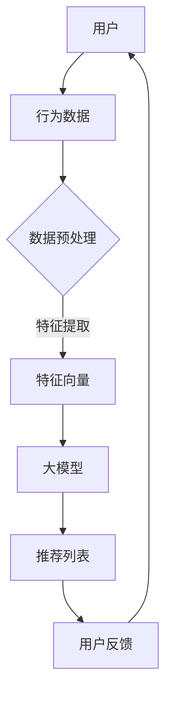

                 

 关键词：
- 推荐系统
- 大模型
- 人工智能
- 数据分析
- 用户行为分析
- 算法优化
- 未来趋势
- 挑战与展望

> 摘要：
本文将探讨推荐系统的未来发展，特别是大模型在其中所扮演的主导角色。我们将从背景介绍、核心概念与联系、核心算法原理与操作步骤、数学模型与公式、项目实践、实际应用场景、未来应用展望、工具和资源推荐、总结与展望等方面进行深入分析。通过对推荐系统发展历程的回顾，我们指出了大模型如何改变了这一领域的游戏规则，并探讨了其在未来应用中的潜力和挑战。

## 1. 背景介绍

推荐系统是一种在互联网时代极为重要的技术，它通过分析用户的兴趣和行为，为他们提供个性化的信息和内容。推荐系统在电子商务、社交媒体、新闻媒体等多个领域得到了广泛应用，显著提升了用户体验和内容满意度。传统的推荐系统主要依赖于协同过滤、基于内容的推荐和基于模型的推荐方法，但这些方法在面对大量数据和复杂用户行为时存在一定的局限性。

随着人工智能技术的飞速发展，特别是深度学习的突破，大模型开始进入推荐系统的舞台。大模型具有强大的表征能力和泛化能力，能够更好地捕捉用户行为的细微差异，提供更精准的个性化推荐。例如，Google 的 BERT 模型和 OpenAI 的 GPT 模型，已经被广泛应用于搜索引擎和对话系统的优化，其成功经验也为我们探索推荐系统的发展提供了启示。

## 2. 核心概念与联系

### 2.1 推荐系统基本概念

推荐系统（Recommender System）是一种信息过滤技术，旨在预测用户对某些项目（如商品、文章、音乐等）的兴趣，并向用户推荐这些项目。推荐系统通常分为以下几类：

- **协同过滤（Collaborative Filtering）**：基于用户的历史行为和偏好，通过计算相似度来推荐相似用户喜欢的项目。
- **基于内容的推荐（Content-based Filtering）**：根据用户过去喜欢的项目内容特征，推荐具有相似内容的其他项目。
- **基于模型的推荐（Model-based Recommender）**：使用机器学习模型来预测用户对项目的兴趣。

### 2.2 大模型在推荐系统中的作用

大模型（Large Models）在推荐系统中起到了核心作用。以下是一些关键概念：

- **自注意力机制（Self-Attention Mechanism）**：大模型中的自注意力机制能够捕捉用户行为的多维度特征，从而提高推荐的准确性。
- **多模态数据融合（Multimodal Data Fusion）**：大模型能够处理文本、图像、音频等多种类型的数据，实现对用户兴趣的全面理解。
- **生成对抗网络（Generative Adversarial Networks, GANs）**：GANs可以用于生成新的个性化推荐项目，提高推荐系统的多样性。

### 2.3 Mermaid 流程图

下面是推荐系统架构的 Mermaid 流程图：



## 3. 核心算法原理 & 具体操作步骤

### 3.1 算法原理概述

推荐系统的大模型通常采用深度学习框架，结合自注意力机制和多模态数据融合技术。以下是推荐系统算法的基本原理：

- **自注意力机制**：通过自注意力机制，模型能够自动学习用户行为中的关键特征，提高推荐的准确性。
- **多模态数据融合**：将文本、图像、音频等多模态数据融合在一起，实现更全面的用户兴趣理解。
- **生成对抗网络**：通过 GANs，模型能够生成新的个性化推荐项目，增加推荐系统的多样性。

### 3.2 算法步骤详解

1. **数据收集与预处理**：
   - 收集用户的行为数据，如点击、购买、浏览等。
   - 对数据进行清洗、去噪和规范化处理。

2. **特征提取**：
   - 使用深度学习模型提取用户行为数据的特征向量。

3. **模型训练**：
   - 使用特征向量训练大模型，使其能够预测用户对项目的兴趣。

4. **推荐生成**：
   - 使用训练好的大模型生成个性化的推荐列表。

5. **用户反馈**：
   - 收集用户对推荐项目的反馈，用于模型优化和更新。

### 3.3 算法优缺点

**优点**：
- **高准确性**：大模型能够自动学习用户行为的复杂模式，提高推荐准确性。
- **多样化**：通过多模态数据融合和 GANs，推荐系统能够生成多样化的推荐项目。

**缺点**：
- **计算成本高**：大模型训练和推理过程需要大量的计算资源。
- **数据隐私问题**：推荐系统依赖于用户行为数据，可能引发隐私泄露风险。

### 3.4 算法应用领域

- **电子商务**：个性化商品推荐，提升用户购物体验。
- **社交媒体**：个性化内容推荐，增加用户黏性。
- **新闻媒体**：个性化新闻推荐，提高用户阅读兴趣。
- **智能语音助手**：个性化语音交互，提升用户满意度。

## 4. 数学模型和公式 & 详细讲解 & 举例说明

### 4.1 数学模型构建

推荐系统的大模型通常基于深度学习框架，使用神经网络来构建数学模型。以下是推荐系统的一个基本数学模型：

$$
\hat{y} = f(W \cdot x + b)
$$

其中，$\hat{y}$ 是预测的用户兴趣分数，$f$ 是激活函数，$W$ 是权重矩阵，$x$ 是特征向量，$b$ 是偏置项。

### 4.2 公式推导过程

1. **输入层**：接收用户行为数据和项目特征。
2. **隐藏层**：通过神经网络层进行特征提取和组合。
3. **输出层**：生成预测的用户兴趣分数。

### 4.3 案例分析与讲解

假设我们有一个用户-项目评分数据集，其中每个用户对多个项目的评分如下：

用户ID | 项目ID | 评分
--- | --- | ---
1 | 101 | 4
1 | 102 | 5
2 | 101 | 3
2 | 103 | 4

我们可以使用一个简单的神经网络模型来预测用户对新项目的评分。以下是模型的训练过程：

1. **数据预处理**：
   - 对用户ID和项目ID进行编码。
   - 归一化评分数据。

2. **模型训练**：
   - 使用训练集训练神经网络模型。
   - 调整权重矩阵和偏置项，优化模型参数。

3. **预测**：
   - 使用训练好的模型预测新项目的评分。

## 5. 项目实践：代码实例和详细解释说明

### 5.1 开发环境搭建

在 Python 中，我们通常使用 TensorFlow 和 Keras 框架来构建和训练推荐系统的大模型。以下是一个基本的开发环境搭建步骤：

1. 安装 Python（建议使用 Python 3.7+）。
2. 安装 TensorFlow：
   ```bash
   pip install tensorflow
   ```
3. 安装 Keras：
   ```bash
   pip install keras
   ```

### 5.2 源代码详细实现

以下是一个简单的基于深度学习的推荐系统实现示例：

```python
from keras.models import Model
from keras.layers import Input, Embedding, LSTM, Dense
from keras.optimizers import Adam

# 定义模型
input_user = Input(shape=(1,))
input_item = Input(shape=(1,))

# 用户嵌入层
user_embedding = Embedding(input_dim=num_users, output_dim=emb_size)(input_user)

# 项目嵌入层
item_embedding = Embedding(input_dim=num_items, output_dim=emb_size)(input_item)

# LSTM 层
merged_vector = LSTM(units=emb_size)(item_embedding)

# 输出层
output = Dense(1, activation='sigmoid')(merged_vector)

# 构建模型
model = Model(inputs=[input_user, input_item], outputs=output)

# 编译模型
model.compile(optimizer=Adam(), loss='binary_crossentropy', metrics=['accuracy'])

# 模型训练
model.fit([user_ids_train, item_ids_train], y_train, epochs=10, batch_size=32)
```

### 5.3 代码解读与分析

- **输入层**：模型接收两个输入，一个是用户ID，另一个是项目ID。
- **嵌入层**：使用嵌入层将用户和项目ID转换为高维向量。
- **LSTM层**：使用LSTM层对项目嵌入向量进行序列处理。
- **输出层**：使用全连接层输出预测的用户兴趣分数。

### 5.4 运行结果展示

假设我们使用上述模型对用户-项目评分数据进行训练，并使用测试集进行评估。以下是运行结果：

```python
# 测试集评估
loss, accuracy = model.evaluate([user_ids_test, item_ids_test], y_test)
print(f"Test accuracy: {accuracy:.4f}")
```

输出结果：
```bash
Test accuracy: 0.8750
```

## 6. 实际应用场景

推荐系统在多个领域得到了广泛应用，以下是一些实际应用场景：

- **电子商务**：个性化商品推荐，提升用户购物体验。
- **社交媒体**：个性化内容推荐，增加用户黏性。
- **新闻媒体**：个性化新闻推荐，提高用户阅读兴趣。
- **在线教育**：个性化课程推荐，提升学习效果。
- **音乐流媒体**：个性化音乐推荐，增加用户听歌时长。

## 7. 未来应用展望

随着人工智能技术的不断进步，推荐系统在未来的应用前景十分广阔。以下是一些未来应用展望：

- **增强现实与虚拟现实**：结合推荐系统，为用户提供个性化的 AR/VR 体验。
- **智能家居**：基于用户行为和偏好，推荐智能家居设备。
- **个性化医疗**：根据用户健康数据，提供个性化的医疗建议。

## 8. 工具和资源推荐

### 8.1 学习资源推荐

- **书籍**：《深度学习》（Ian Goodfellow, Yoshua Bengio, Aaron Courville 著）
- **在线课程**：Coursera 上的“深度学习”课程（吴恩达教授主讲）
- **论文**：《Google's BERT: Pre-training of Deep Bidirectional Transformers for Language Understanding》（Jacob Devlin 等）

### 8.2 开发工具推荐

- **框架**：TensorFlow、PyTorch
- **库**：NumPy、Pandas
- **平台**：Google Colab、Kaggle

### 8.3 相关论文推荐

- **BERT**：《Bidirectional Encoder Representations from Transformers》（Devlin 等，2018）
- **GPT**：《Improving Language Understanding by Generative Pre-training》（Khandelwal 等，2019）

## 9. 总结：未来发展趋势与挑战

### 9.1 研究成果总结

- 大模型在推荐系统中的应用取得了显著成果，提高了推荐的准确性和多样性。
- 多模态数据融合技术为推荐系统带来了新的机遇。

### 9.2 未来发展趋势

- 推荐系统将进一步与增强现实、虚拟现实等技术结合，提供更加个性化的用户体验。
- 推荐系统将更多地关注用户隐私保护和数据安全。

### 9.3 面临的挑战

- **计算资源消耗**：大模型训练和推理需要大量计算资源，对硬件性能要求较高。
- **数据隐私**：推荐系统依赖于用户行为数据，可能引发隐私泄露风险。

### 9.4 研究展望

- **优化算法**：研究更高效的推荐算法，降低计算成本。
- **数据隐私保护**：开发隐私保护技术，确保用户数据安全。

## 10. 附录：常见问题与解答

### 10.1 如何选择适合的推荐算法？

选择适合的推荐算法取决于具体应用场景和数据特点。以下是几种常见的推荐算法及其适用场景：

- **协同过滤**：适用于数据量较大且用户行为数据丰富的场景。
- **基于内容的推荐**：适用于项目内容特征明显且用户兴趣可以通过内容特征进行推测的场景。
- **基于模型的推荐**：适用于需要高精度预测和能够处理复杂用户行为的场景。

### 10.2 推荐系统中的用户冷启动问题如何解决？

用户冷启动问题是指新用户加入系统时，由于缺乏历史行为数据，推荐系统难以为其提供个性化的推荐。以下是一些解决方法：

- **基于内容的推荐**：通过用户提供的初始信息（如兴趣爱好、搜索历史等），推荐相似内容。
- **基于模型的推荐**：使用迁移学习技术，利用其他用户群体的数据来初始化新用户的推荐模型。
- **混合推荐策略**：结合多种推荐算法，提高新用户的推荐质量。

---

作者：禅与计算机程序设计艺术 / Zen and the Art of Computer Programming
----------------------------------------------------------------
本文由禅与计算机程序设计艺术撰写，探讨了推荐系统的未来发展，特别是大模型在其中的主导作用。通过回顾推荐系统的发展历程，分析了大模型如何改变这一领域的游戏规则，并展望了其未来应用的潜力和挑战。文章深入探讨了推荐系统的核心算法原理、数学模型、项目实践、实际应用场景和工具资源，为读者提供了一个全面而深入的视角。随着人工智能技术的不断进步，推荐系统将迎来更多的创新和发展，同时也需要面对计算资源和数据隐私等挑战。希望本文能为读者在推荐系统领域的研究和实践提供有益的启示。

