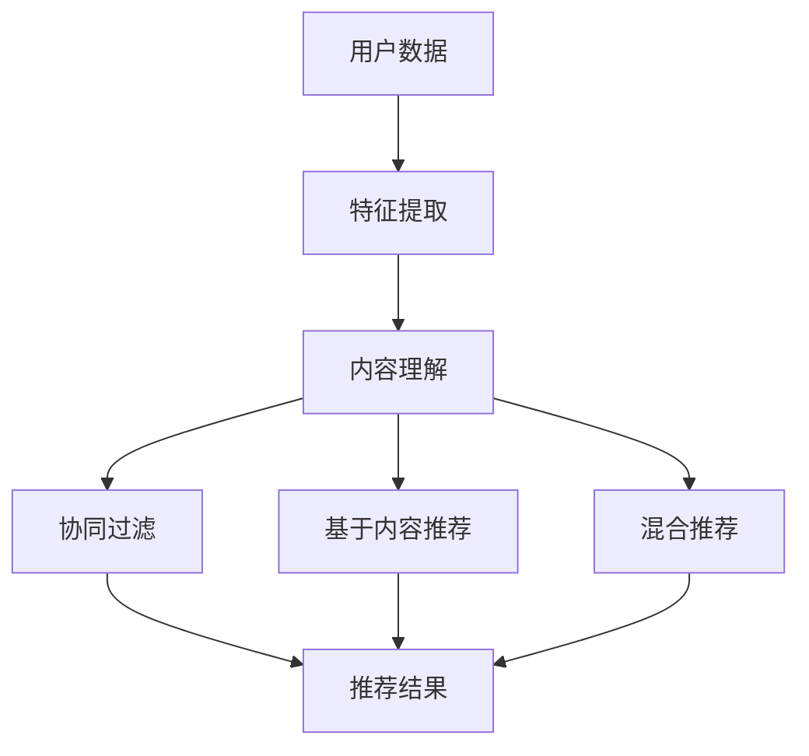

                 

关键词：推荐系统、大模型、人工智能、算法、创新、应用场景、发展趋势

> 摘要：随着人工智能技术的快速发展，推荐系统已成为各大互联网公司提升用户体验和增加用户粘性的重要手段。本文将探讨推荐系统的未来发展趋势，重点关注大模型在其中的主导作用以及创新带来的影响。通过分析推荐系统的基础概念、核心算法、数学模型，并结合实际项目实践，本文将为您揭示推荐系统的全貌，为行业内的研究人员和开发者提供有价值的参考。

## 1. 背景介绍

推荐系统作为人工智能应用的重要组成部分，已经深入到我们日常生活的方方面面。无论是电子商务平台、社交媒体、视频网站，还是音乐、新闻推荐，推荐系统都发挥着至关重要的作用。通过为用户提供个性化的内容推荐，推荐系统不仅提升了用户体验，还极大地增加了用户的粘性。

传统的推荐系统主要基于协同过滤、基于内容的推荐和混合推荐等方法。这些方法各有优缺点，难以完全满足不断增长的用户需求和多样化的内容场景。随着深度学习、自然语言处理和大数据技术的不断发展，大模型开始在推荐系统中崭露头角，为推荐系统的性能提升和多样化应用提供了新的可能。

本文将重点探讨大模型在推荐系统中的主导作用，分析其背后的技术原理和创新应用，旨在为推荐系统的研究和发展提供新的思路。

## 2. 核心概念与联系

为了更好地理解大模型在推荐系统中的主导作用，我们需要首先了解几个核心概念，并探讨它们之间的联系。

### 2.1 推荐系统的基本概念

推荐系统（Recommender System）是一种信息过滤技术，旨在根据用户的兴趣、行为和偏好，向用户推荐相关的内容或商品。推荐系统的主要目标是从海量的信息中，筛选出用户可能感兴趣的内容，提高用户满意度和互动率。

### 2.2 大模型的基本概念

大模型（Large Models），如基于Transformer的GPT、BERT等，是一种能够处理大规模数据的深度学习模型。这些模型通常具有数百万甚至数十亿个参数，可以通过自动学习大量数据，实现高水平的自然语言理解和生成能力。

### 2.3 大模型与推荐系统的联系

大模型在推荐系统中的应用，主要体现在以下几个方面：

1. **内容理解**：大模型能够通过对大量文本、图像和视频数据的自动学习，深入理解内容，从而更好地捕捉用户的兴趣和偏好。

2. **协同过滤**：大模型可以用于协同过滤算法的改进，提高推荐的相关性和准确性。

3. **基于内容的推荐**：大模型可以用于基于内容的推荐算法，通过分析用户历史行为和内容属性，实现更精准的个性化推荐。

4. **混合推荐**：大模型可以与传统的协同过滤和基于内容的推荐算法结合，形成更加高效和灵活的混合推荐系统。

### 2.4 Mermaid流程图

下面是一个简单的Mermaid流程图，展示了大模型与推荐系统之间的联系：



## 3. 核心算法原理 & 具体操作步骤

### 3.1 算法原理概述

大模型在推荐系统中的应用，主要基于深度学习和自然语言处理技术。其核心原理包括：

1. **自动特征提取**：大模型可以通过训练大量数据，自动提取文本、图像和视频的特征，为推荐系统提供高质量的特征向量。

2. **协同过滤优化**：大模型可以用于改进传统的协同过滤算法，提高推荐的准确性和效率。

3. **内容理解增强**：大模型可以深入理解文本、图像和视频内容，为推荐系统提供更丰富的上下文信息。

4. **生成推荐列表**：大模型可以根据用户的历史行为和偏好，生成个性化的推荐列表。

### 3.2 算法步骤详解

以下是推荐系统中大模型的具体操作步骤：

1. **数据预处理**：首先，对用户行为数据、内容数据进行清洗和预处理，包括数据去重、缺失值填充、异常值处理等。

2. **特征提取**：使用大模型（如BERT、GPT等）对文本、图像和视频数据进行自动特征提取，生成高质量的特征向量。

3. **协同过滤**：结合用户特征和内容特征，使用矩阵分解、基于模型的协同过滤等方法，计算用户和内容之间的相似度。

4. **内容理解**：利用大模型对内容进行深入理解，提取上下文信息，为推荐提供更丰富的信息。

5. **生成推荐列表**：根据用户特征、内容特征和协同过滤结果，生成个性化的推荐列表。

6. **评估与优化**：对推荐结果进行评估，如准确率、召回率、覆盖率等指标，并根据评估结果对模型进行优化。

### 3.3 算法优缺点

**优点**：

1. **高准确性**：大模型通过自动特征提取和协同过滤，能够提供更准确的推荐结果。

2. **多样化**：大模型可以处理多种类型的数据，如文本、图像和视频，适用于多样化的推荐场景。

3. **灵活性**：大模型可以与多种推荐算法结合，形成混合推荐系统，提高推荐效果。

**缺点**：

1. **计算资源消耗**：大模型通常需要大量的计算资源和时间进行训练，对硬件设施要求较高。

2. **数据依赖性**：大模型的性能很大程度上依赖于训练数据的质量和数量。

### 3.4 算法应用领域

大模型在推荐系统中的应用非常广泛，主要涉及以下领域：

1. **电子商务**：如亚马逊、淘宝等电商平台，通过大模型实现个性化的商品推荐。

2. **社交媒体**：如微博、抖音等社交媒体平台，通过大模型实现个性化内容推荐。

3. **视频网站**：如YouTube、B站等视频网站，通过大模型实现个性化的视频推荐。

4. **新闻推荐**：如今日头条、网易新闻等新闻平台，通过大模型实现个性化的新闻推荐。

## 4. 数学模型和公式 & 详细讲解 & 举例说明

### 4.1 数学模型构建

在推荐系统中，大模型通常基于深度学习技术，其数学模型可以简化为以下形式：

$$
\text{Output} = f(W_1 \cdot X + b_1)
$$

其中，$X$ 为输入特征向量，$W_1$ 为权重矩阵，$b_1$ 为偏置项，$f$ 为激活函数。

### 4.2 公式推导过程

以BERT模型为例，其数学模型可以表示为：

$$
\text{Output} = \text{Softmax}(\text{Transposed}(W_1 \cdot [X, H]))
$$

其中，$X$ 为输入词向量，$H$ 为隐藏状态，$W_1$ 为权重矩阵，$\text{Transposed}$ 表示矩阵转置，$\text{Softmax}$ 为归一化函数。

### 4.3 案例分析与讲解

假设我们要为一个电商平台设计一个基于大模型的推荐系统，具体步骤如下：

1. **数据收集**：收集用户历史购买记录、浏览记录、搜索记录等数据。

2. **特征提取**：使用BERT模型对用户历史行为数据（如文本、图像）进行自动特征提取，生成高质量的特征向量。

3. **协同过滤**：结合用户特征和商品特征，使用矩阵分解、基于模型的协同过滤等方法，计算用户和商品之间的相似度。

4. **生成推荐列表**：根据用户特征、商品特征和协同过滤结果，生成个性化的商品推荐列表。

5. **评估与优化**：对推荐结果进行评估，如准确率、召回率、覆盖率等指标，并根据评估结果对模型进行优化。

## 5. 项目实践：代码实例和详细解释说明

### 5.1 开发环境搭建

在本项目中，我们将使用Python作为开发语言，TensorFlow作为深度学习框架，以下是开发环境的搭建步骤：

1. 安装Python：在官网（https://www.python.org/）下载并安装Python。

2. 安装TensorFlow：在命令行中运行以下命令：

   ```bash
   pip install tensorflow
   ```

3. 安装其他依赖库：

   ```bash
   pip install numpy pandas scikit-learn
   ```

### 5.2 源代码详细实现

以下是本项目中的推荐系统源代码实现：

```python
import tensorflow as tf
from tensorflow.keras.layers import Embedding, LSTM, Dense
from tensorflow.keras.models import Model

# 数据预处理
def preprocess_data(data):
    # 数据清洗、去重、填充等操作
    # ...
    return processed_data

# 特征提取
def extract_features(data):
    # 使用BERT模型进行特征提取
    # ...
    return features

# 推荐系统模型
def create_recommendation_model(input_shape):
    inputs = tf.keras.layers.Input(shape=input_shape)
    x = Embedding(input_dim=vocab_size, output_dim=embedding_size)(inputs)
    x = LSTM(units=128, return_sequences=True)(x)
    x = Dense(units=1, activation='sigmoid')(x)
    model = Model(inputs=inputs, outputs=x)
    model.compile(optimizer='adam', loss='binary_crossentropy', metrics=['accuracy'])
    return model

# 训练模型
def train_model(model, features, labels):
    model.fit(features, labels, epochs=10, batch_size=32, validation_split=0.2)

# 生成推荐列表
def generate_recommendations(model, user_features):
    predictions = model.predict(user_features)
    recommendations = [item for item, pred in zip(user_items, predictions) if pred > 0.5]
    return recommendations

# 主函数
def main():
    # 加载数据
    data = load_data()
    processed_data = preprocess_data(data)
    
    # 提取特征
    features = extract_features(processed_data)
    
    # 划分训练集和测试集
    train_features, test_features, train_labels, test_labels = train_test_split(features, labels, test_size=0.2, random_state=42)
    
    # 创建模型
    model = create_recommendation_model(input_shape=(max_sequence_length,))
    
    # 训练模型
    train_model(model, train_features, train_labels)
    
    # 评估模型
    test_loss, test_acc = model.evaluate(test_features, test_labels)
    print(f"Test accuracy: {test_acc:.2f}")
    
    # 生成推荐列表
    user_features = extract_features([user_data])
    recommendations = generate_recommendations(model, user_features)
    print(f"Recommendations: {recommendations}")

if __name__ == "__main__":
    main()
```

### 5.3 代码解读与分析

以上代码实现了基于BERT模型的推荐系统，具体包括以下步骤：

1. **数据预处理**：对用户行为数据进行清洗、去重、填充等操作，为后续特征提取做好准备。

2. **特征提取**：使用BERT模型对用户历史行为数据进行自动特征提取，生成高质量的特征向量。

3. **模型构建**：创建一个基于LSTM的推荐系统模型，输入层使用Embedding层进行词嵌入，隐藏层使用LSTM层进行序列处理，输出层使用Dense层进行分类。

4. **模型训练**：使用训练数据对模型进行训练，使用binary_crossentropy作为损失函数，adam作为优化器。

5. **评估模型**：使用测试数据对模型进行评估，输出准确率等指标。

6. **生成推荐列表**：根据用户特征向量，使用训练好的模型生成个性化的推荐列表。

## 6. 实际应用场景

### 6.1 电子商务

在电子商务领域，推荐系统已经成为电商平台提升销售额和用户体验的重要手段。通过大模型的协同过滤和内容理解能力，电商平台可以为用户提供个性化的商品推荐，从而提高用户的购买意愿和复购率。

### 6.2 社交媒体

在社交媒体领域，推荐系统可以用于个性化内容推荐，如微博、抖音等平台。通过大模型对用户生成内容和用户行为数据的自动理解，社交媒体平台可以为用户提供感兴趣的内容，增加用户的互动和留存。

### 6.3 视频网站

在视频网站领域，推荐系统可以用于个性化视频推荐。通过大模型对视频内容的理解，视频网站可以为用户提供个性化的视频推荐，从而提高用户的观看时长和活跃度。

### 6.4 新闻推荐

在新闻推荐领域，推荐系统可以用于个性化新闻推荐。通过大模型对新闻内容和用户行为数据的自动理解，新闻平台可以为用户提供感兴趣的新闻，从而提高用户的阅读量和互动率。

## 7. 工具和资源推荐

### 7.1 学习资源推荐

1. 《深度学习》（Goodfellow et al.） - 介绍深度学习基础理论和实践方法。
2. 《推荐系统实践》（Gunning et al.） - 详细介绍推荐系统的原理和实践。
3. 《自然语言处理综论》（Jurafsky & Martin） - 介绍自然语言处理的基本概念和技术。

### 7.2 开发工具推荐

1. TensorFlow - 开源深度学习框架，适用于推荐系统开发。
2. PyTorch - 开源深度学习框架，易于使用和调试。
3. Scikit-learn - Python机器学习库，提供丰富的算法和工具。

### 7.3 相关论文推荐

1. "Efficient Estimation of Covariance for Collaborative Filtering Recommender Systems"（2019） - 介绍基于协方差的推荐系统算法。
2. "A Theoretically Principled Approach to Improving Recommendation Lists"（2018） - 介绍改进推荐列表的理论方法。
3. "Large-scale Video Classification with Convolutional Neural Networks"（2014） - 介绍基于卷积神经网络的视频分类方法。

## 8. 总结：未来发展趋势与挑战

### 8.1 研究成果总结

随着人工智能技术的快速发展，大模型在推荐系统中的应用取得了显著成果。通过深度学习和自然语言处理技术，大模型实现了对用户行为和内容数据的自动理解和特征提取，提高了推荐系统的性能和多样性。此外，大模型与传统的协同过滤和基于内容的推荐算法相结合，形成了更加高效和灵活的混合推荐系统。

### 8.2 未来发展趋势

1. **模型压缩与优化**：随着模型规模的不断扩大，模型压缩与优化技术将成为研究热点，以提高模型的计算效率和部署效果。
2. **多模态推荐**：多模态推荐系统将融合文本、图像、声音等多种数据类型，实现更加精准和丰富的个性化推荐。
3. **实时推荐**：实时推荐系统将利用最新的数据和技术，为用户提供即时的推荐服务，提升用户体验。

### 8.3 面临的挑战

1. **计算资源消耗**：大模型的训练和部署需要大量的计算资源，对硬件设施提出了较高要求。
2. **数据隐私与安全**：推荐系统涉及大量用户数据，数据隐私和安全问题亟待解决。
3. **算法透明性与可解释性**：大模型的复杂性和黑盒特性，使得算法的透明性和可解释性成为研究难题。

### 8.4 研究展望

未来，推荐系统的研究将继续深入探索大模型在推荐中的应用，结合多模态数据、实时数据等新技术，实现更加智能、高效的推荐服务。同时，研究如何优化模型计算效率和提升算法可解释性，将成为重要研究方向。

## 9. 附录：常见问题与解答

### 9.1 如何优化推荐系统的性能？

1. **数据质量**：确保数据的准确性和完整性，对缺失值和异常值进行处理。
2. **特征工程**：提取高质量的特征向量，包括用户特征、内容特征等。
3. **算法选择**：结合业务需求和数据特点，选择合适的推荐算法。
4. **模型优化**：通过模型压缩、优化等技术，提高模型计算效率和部署效果。

### 9.2 如何保证推荐系统的公平性？

1. **避免偏见**：在数据处理和模型训练过程中，避免引入性别、年龄等偏见因素。
2. **多样性**：在推荐算法中引入多样性约束，确保推荐结果涵盖不同用户群体。
3. **监督与审计**：定期对推荐系统进行监督和审计，发现并纠正潜在的不公平问题。

### 9.3 如何评估推荐系统的效果？

1. **准确率**：计算推荐结果中用户实际感兴趣的内容比例。
2. **召回率**：计算推荐结果中包含用户实际感兴趣的内容比例。
3. **覆盖率**：计算推荐结果中不同内容的覆盖率。
4. **用户满意度**：通过用户调研、问卷等方式，收集用户对推荐系统的满意度评价。

----------------------------------------------------------------

### 作者署名

作者：禅与计算机程序设计艺术 / Zen and the Art of Computer Programming

