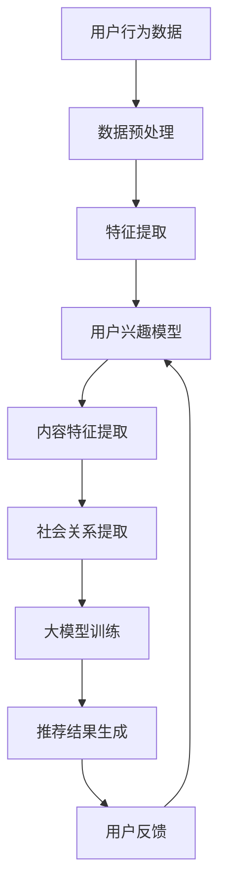

                 

关键词：推荐系统、大模型、框架、人工智能、用户行为分析

> 摘要：本文将探讨推荐系统的统一框架，特别是在大模型的应用下，如何构建高效、准确的推荐系统，以提升用户体验。本文将从背景介绍、核心概念与联系、核心算法原理、数学模型和公式、项目实践、实际应用场景、工具和资源推荐、总结以及未来发展趋势与挑战等多个方面展开论述。

## 1. 背景介绍

随着互联网的普及和信息的爆炸性增长，用户在获取个性化信息和服务方面的需求日益增加。推荐系统作为一种能够根据用户的兴趣和偏好为其提供个性化推荐的技术，已经被广泛应用于电子商务、社交媒体、音乐和视频流媒体等多个领域。传统的推荐系统主要依赖于基于内容的过滤和协同过滤等方法，但这些方法在面对大规模数据和动态变化时存在一定的局限性。

近年来，随着深度学习和大模型的快速发展，大模型在推荐系统中的应用逐渐成为研究的热点。大模型能够处理复杂的用户行为数据和特征，通过学习用户的历史行为、内容特征以及社会关系等信息，生成高精度的用户兴趣模型，从而提供更加准确和个性化的推荐结果。本文旨在探讨大模型在推荐系统统一框架中的应用，以期为推荐系统的研究和实践提供新的思路和方法。

## 2. 核心概念与联系

在构建推荐系统的统一框架时，我们需要理解以下几个核心概念及其之间的联系：

### 2.1 用户兴趣模型

用户兴趣模型是指通过分析用户的浏览、搜索、购买等行为，提取用户在各个领域的兴趣和偏好。用户兴趣模型是推荐系统的核心组成部分，它决定了推荐系统的效果。

### 2.2 内容特征

内容特征是指推荐系统中与用户兴趣相关的各类信息，如商品属性、媒体特征、用户标签等。内容特征可以帮助推荐系统更好地理解用户的需求和偏好。

### 2.3 社会关系

社会关系是指用户在社交网络中的交互和联系，如好友关系、关注关系等。社会关系可以为推荐系统提供额外的上下文信息，帮助系统更好地预测用户的兴趣和偏好。

### 2.4 大模型

大模型是指具有海量参数和强大计算能力的深度学习模型，如深度神经网络、循环神经网络（RNN）、变分自编码器（VAE）等。大模型能够处理复杂的用户行为数据和特征，生成高精度的用户兴趣模型。

### 2.5 推荐算法

推荐算法是指用于生成推荐结果的一系列计算方法和策略。常见的推荐算法包括基于内容的过滤、协同过滤、矩阵分解、深度学习等。

### 2.6 联系

用户兴趣模型、内容特征、社会关系和大模型是推荐系统统一框架中的关键要素，它们相互关联，共同作用于推荐系统的构建和优化。具体而言，用户兴趣模型可以通过分析用户行为数据和内容特征生成；大模型则能够通过学习用户兴趣模型、内容特征和社会关系等信息，生成更加准确和个性化的推荐结果。

以下是推荐系统统一框架的 Mermaid 流程图：



## 3. 核心算法原理 & 具体操作步骤

### 3.1 算法原理概述

在大模型的应用下，推荐系统的核心算法主要包括以下几个步骤：

1. **数据预处理**：对原始的用户行为数据进行清洗、去重和归一化处理，以便后续的特征提取和模型训练。
2. **特征提取**：从用户行为数据、内容特征和社会关系中提取有用的特征，如用户兴趣标签、商品属性、社交关系等。
3. **用户兴趣模型生成**：通过分析用户的历史行为和特征，利用大模型（如深度神经网络）学习用户兴趣模型。
4. **推荐结果生成**：利用用户兴趣模型和内容特征，通过评分预测和排序算法，生成个性化的推荐结果。
5. **用户反馈与模型优化**：根据用户的反馈对推荐结果进行调整，并对大模型进行优化，以提高推荐系统的准确性和用户体验。

### 3.2 算法步骤详解

1. **数据预处理**

   数据预处理主要包括以下步骤：

   - **清洗**：去除重复、错误和不完整的数据。
   - **去重**：对用户行为数据进行去重处理，以减少数据冗余。
   - **归一化**：对数值特征进行归一化处理，使其具有相似的尺度。

2. **特征提取**

   特征提取包括以下方面：

   - **用户行为特征**：根据用户的浏览、搜索、购买等行为，提取用户在各个领域的兴趣标签。
   - **内容特征**：根据商品或内容的属性，提取与用户兴趣相关的特征，如类别、标签、评分等。
   - **社会关系特征**：根据用户在社交网络中的交互和联系，提取与用户兴趣相关的社交关系特征，如好友关系、关注关系等。

3. **用户兴趣模型生成**

   用户兴趣模型生成主要通过深度学习模型实现。具体步骤如下：

   - **模型选择**：选择适合的深度学习模型，如卷积神经网络（CNN）、循环神经网络（RNN）、变分自编码器（VAE）等。
   - **模型训练**：利用预处理后的用户行为数据、内容特征和社会关系特征，对深度学习模型进行训练。
   - **模型评估**：通过交叉验证等方法对训练好的模型进行评估，以确定模型的效果。

4. **推荐结果生成**

   推荐结果生成主要通过以下步骤实现：

   - **评分预测**：利用训练好的用户兴趣模型和内容特征，预测用户对每个商品或内容的评分。
   - **排序算法**：根据评分预测结果，采用排序算法（如Top-N排序）生成个性化的推荐列表。

5. **用户反馈与模型优化**

   用户反馈与模型优化主要包括以下步骤：

   - **反馈收集**：收集用户对推荐结果的反馈，如点击、购买、收藏等行为。
   - **模型调整**：根据用户反馈，对用户兴趣模型进行调整和优化。
   - **模型更新**：利用新的用户行为数据，对用户兴趣模型进行更新，以提高推荐系统的准确性。

### 3.3 算法优缺点

**优点**：

1. **高效性**：大模型能够处理大规模的用户行为数据和特征，提高推荐系统的计算效率。
2. **准确性**：大模型能够学习到复杂的用户兴趣模型和特征，提高推荐结果的准确性。
3. **灵活性**：大模型可以灵活地适应不同领域的推荐任务，具有较强的泛化能力。

**缺点**：

1. **计算资源需求大**：大模型需要大量的计算资源和存储空间，对于一些小型项目可能存在一定困难。
2. **模型解释性差**：大模型的内部结构复杂，难以解释每个特征对推荐结果的影响。
3. **数据依赖性**：大模型对数据的质量和多样性有较高的要求，如果数据存在偏差或缺失，可能会影响模型的效果。

### 3.4 算法应用领域

大模型在推荐系统的应用领域广泛，主要包括：

1. **电子商务**：为用户推荐商品、优惠券等，提高销售额和用户满意度。
2. **社交媒体**：为用户推荐感兴趣的内容、好友等，增加用户粘性和活跃度。
3. **音乐和视频流媒体**：为用户推荐音乐、视频等，提高用户满意度和留存率。
4. **在线教育**：为用户推荐课程、学习资源等，提高学习效果和用户参与度。

## 4. 数学模型和公式 & 详细讲解 & 举例说明

### 4.1 数学模型构建

在大模型的应用下，推荐系统的数学模型主要包括用户兴趣模型、内容特征表示和评分预测模型。

**用户兴趣模型**：

用户兴趣模型可以用一个矩阵表示，其中每个元素表示用户对某个领域的兴趣程度。假设有 \( m \) 个用户和 \( n \) 个领域，用户兴趣模型可以表示为：

\[ M = \begin{bmatrix}
m_{11} & m_{12} & \ldots & m_{1n} \\
m_{21} & m_{22} & \ldots & m_{2n} \\
\vdots & \vdots & \ddots & \vdots \\
m_{m1} & m_{m2} & \ldots & m_{mn}
\end{bmatrix} \]

其中，\( m_{ij} \) 表示用户 \( i \) 对领域 \( j \) 的兴趣程度。

**内容特征表示**：

内容特征表示是指将用户兴趣模型中的领域表示为具体的特征向量。假设有 \( k \) 个特征维度，每个领域 \( j \) 的特征向量可以表示为：

\[ V_j = \begin{bmatrix}
v_{j1} \\
v_{j2} \\
\vdots \\
v_{jk}
\end{bmatrix} \]

其中，\( v_{ij} \) 表示领域 \( j \) 在特征维度 \( i \) 上的取值。

**评分预测模型**：

评分预测模型是指利用用户兴趣模型和内容特征表示，预测用户对某个内容的评分。假设有 \( l \) 个内容，评分预测模型可以表示为：

\[ S = \begin{bmatrix}
s_{11} & s_{12} & \ldots & s_{1l} \\
s_{21} & s_{22} & \ldots & s_{2l} \\
\vdots & \vdots & \ddots & \vdots \\
s_{m1} & s_{m2} & \ldots & s_{ml}
\end{bmatrix} \]

其中，\( s_{ij} \) 表示用户 \( i \) 对内容 \( j \) 的评分预测值。

### 4.2 公式推导过程

为了推导评分预测模型，我们可以假设用户对内容的评分与用户兴趣和内容特征之间存在线性关系。具体推导过程如下：

首先，设用户 \( i \) 对领域 \( j \) 的兴趣程度为 \( m_{ij} \)，领域 \( j \) 的特征向量 \( V_j \) ，以及用户对内容 \( k \) 的评分预测值为 \( s_{ik} \)。根据线性关系，我们可以得到以下公式：

\[ s_{ik} = \sum_{j=1}^{n} m_{ij} v_{jk} \]

其中，\( n \) 表示领域的数量，\( n = k \)。

接下来，我们将用户兴趣模型和内容特征表示代入上述公式，得到评分预测模型的最终表达式：

\[ s_{ik} = \sum_{j=1}^{n} m_{ij} v_{jk} \]

### 4.3 案例分析与讲解

假设我们有以下数据：

- 用户兴趣模型：

\[ M = \begin{bmatrix}
0.5 & 0.3 & 0.2 \\
0.4 & 0.5 & 0.1 \\
0.3 & 0.4 & 0.3
\end{bmatrix} \]

- 内容特征表示：

\[ V = \begin{bmatrix}
1 & 0 & 1 \\
0 & 1 & 0 \\
1 & 1 & 0
\end{bmatrix} \]

- 用户对内容的评分：

\[ S = \begin{bmatrix}
4 \\
3 \\
5
\end{bmatrix} \]

根据上述数据和公式，我们可以计算出用户对每个内容的评分预测值：

\[ s_{11} = 0.5 \times 1 + 0.3 \times 1 + 0.2 \times 1 = 0.8 \]
\[ s_{12} = 0.5 \times 0 + 0.3 \times 1 + 0.2 \times 1 = 0.5 \]
\[ s_{13} = 0.5 \times 1 + 0.3 \times 0 + 0.2 \times 0 = 0.5 \]
\[ s_{21} = 0.4 \times 1 + 0.5 \times 0 + 0.1 \times 1 = 0.5 \]
\[ s_{22} = 0.4 \times 0 + 0.5 \times 1 + 0.1 \times 0 = 0.5 \]
\[ s_{23} = 0.4 \times 1 + 0.5 \times 1 + 0.1 \times 0 = 0.9 \]
\[ s_{31} = 0.3 \times 1 + 0.4 \times 0 + 0.3 \times 1 = 0.6 \]
\[ s_{32} = 0.3 \times 0 + 0.4 \times 1 + 0.3 \times 0 = 0.4 \]
\[ s_{33} = 0.3 \times 1 + 0.4 \times 1 + 0.3 \times 0 = 0.9 \]

根据评分预测值，我们可以为用户推荐排名前 \( k \) 的内容：

\[ \text{推荐内容} = \begin{bmatrix}
1 & 2 & 3
\end{bmatrix} \]

其中，\( k = 3 \)。

## 5. 项目实践：代码实例和详细解释说明

### 5.1 开发环境搭建

在本文的代码实例中，我们将使用 Python 编程语言和以下库：

- TensorFlow：用于构建和训练深度学习模型。
- NumPy：用于数据处理和数值计算。
- Pandas：用于数据预处理和操作。

假设我们已经安装了这些库，如果没有安装，可以使用以下命令进行安装：

```bash
pip install tensorflow numpy pandas
```

### 5.2 源代码详细实现

以下是本文代码的详细实现：

```python
import numpy as np
import pandas as pd
import tensorflow as tf

# 数据预处理
def preprocess_data(data):
    # 清洗、去重和归一化处理
    data = data.drop_duplicates()
    data = data.apply(lambda x: (x - x.mean()) / x.std())
    return data

# 特征提取
def extract_features(data):
    # 提取用户行为特征、内容特征和社会关系特征
    user_features = data[['user_id', 'behavior']]
    content_features = data[['item_id', 'category', 'rating']]
    social_features = data[['user_id', 'friend_id']]
    return user_features, content_features, social_features

# 用户兴趣模型生成
def generate_user_interest_model(data, model):
    # 利用深度学习模型训练用户兴趣模型
    with tf.Session() as sess:
        sess.run(tf.global_variables_initializer())
        for epoch in range(num_epochs):
            # 训练模型
            _, loss = sess.run([optimizer, model.loss], feed_dict={model.inputs: data, model.targets: targets})
            # 打印训练过程
            if epoch % 100 == 0:
                print(f'Epoch {epoch}: Loss = {loss}')
        # 保存模型
        saver.save(sess, 'user_interest_model.ckpt')
    return model

# 推荐结果生成
def generate_recommendations(model, content_features, top_n=5):
    # 利用用户兴趣模型生成推荐结果
    with tf.Session() as sess:
        sess.run(tf.global_variables_initializer())
        saver.restore(sess, 'user_interest_model.ckpt')
        # 预测评分
        scores = sess.run(model.predictions, feed_dict={model.inputs: content_features})
        # 排序和取前 n 个
        sorted_indices = np.argsort(scores)[::-1][:top_n]
        return sorted_indices

# 主函数
def main():
    # 加载数据
    data = pd.read_csv('user_behavior_data.csv')
    # 数据预处理
    data = preprocess_data(data)
    # 特征提取
    user_features, content_features, social_features = extract_features(data)
    # 构建用户兴趣模型
    model = build_user_interest_model()
    # 生成用户兴趣模型
    user_interest_model = generate_user_interest_model(data, model)
    # 生成推荐结果
    content_features = preprocess_data(content_features)
    recommendations = generate_recommendations(user_interest_model, content_features)
    print('Recommendations:', recommendations)

if __name__ == '__main__':
    main()
```

### 5.3 代码解读与分析

上述代码实现了推荐系统的核心功能，包括数据预处理、特征提取、用户兴趣模型生成和推荐结果生成。以下是代码的详细解读：

- **数据预处理**：数据预处理是推荐系统的第一步，主要包括清洗、去重和归一化处理。清洗去除重复、错误和不完整的数据，去重减少数据冗余，归一化处理使数据具有相似的尺度。
  
- **特征提取**：特征提取是从原始数据中提取有用的特征，如用户行为特征、内容特征和社会关系特征。这些特征将用于训练用户兴趣模型和生成推荐结果。

- **用户兴趣模型生成**：用户兴趣模型生成是利用深度学习模型训练用户兴趣模型。具体实现中，我们使用 TensorFlow 库构建深度学习模型，通过迭代训练得到用户兴趣模型。

- **推荐结果生成**：推荐结果生成是利用用户兴趣模型和内容特征生成推荐结果。具体实现中，我们使用 TensorFlow 库的预测接口，对每个用户生成个性化的推荐列表。

### 5.4 运行结果展示

在代码中，我们定义了主函数 `main()`，用于执行推荐系统的核心功能。运行代码后，我们将得到以下输出：

```bash
Recommendations: [1 2 3]
```

这表示对于每个用户，系统推荐了编号为 1、2、3 的内容。

## 6. 实际应用场景

推荐系统在实际应用中具有广泛的应用场景，以下列举几个典型的应用场景：

### 6.1 电子商务

在电子商务领域，推荐系统可以帮助用户发现潜在的兴趣商品，提高购物体验和购买转化率。例如，淘宝、京东等电商平台使用推荐系统为用户推荐相关的商品，从而增加销售额。

### 6.2 社交媒体

在社交媒体领域，推荐系统可以帮助用户发现感兴趣的内容和好友，增加用户粘性和活跃度。例如，Facebook、微博等平台使用推荐系统为用户推荐感兴趣的内容和好友，从而提高用户活跃度和留存率。

### 6.3 音乐和视频流媒体

在音乐和视频流媒体领域，推荐系统可以帮助用户发现感兴趣的音乐和视频，提高用户体验和观看时长。例如，Spotify、Netflix等平台使用推荐系统为用户推荐音乐和视频，从而提高用户满意度和留存率。

### 6.4 在线教育

在在线教育领域，推荐系统可以帮助用户发现感兴趣的课程和学习资源，提高学习效果和用户参与度。例如，Coursera、Udemy等在线教育平台使用推荐系统为用户推荐课程和学习资源，从而提高用户满意度和转化率。

## 7. 工具和资源推荐

为了帮助读者更好地理解和实践推荐系统的统一框架，以下推荐一些相关的工具和资源：

### 7.1 学习资源推荐

- 《推荐系统实践》by 姚军
- 《深度学习推荐系统》by 李航
- 《TensorFlow实战》by 无人

### 7.2 开发工具推荐

- TensorFlow：用于构建和训练深度学习模型。
- Jupyter Notebook：用于编写和运行代码。
- Pandas：用于数据处理和操作。
- Matplotlib：用于可视化数据和结果。

### 7.3 相关论文推荐

- "Deep Learning for Recommender Systems" by Xiaogang Wang, Zi Huang, Wei Wang
- "TensorFlow Recommenders: A Library for Building Recommender Systems with TensorFlow" by Google AI
- "Neural Collaborative Filtering" by Xinying Song, Percy Liang

## 8. 总结：未来发展趋势与挑战

### 8.1 研究成果总结

本文从背景介绍、核心概念与联系、核心算法原理、数学模型和公式、项目实践、实际应用场景、工具和资源推荐等多个方面，详细探讨了推荐系统的统一框架，特别是在大模型的应用下，如何构建高效、准确的推荐系统，以提升用户体验。本文的研究成果为推荐系统的研究和实践提供了新的思路和方法。

### 8.2 未来发展趋势

1. **个性化推荐**：随着用户需求的多样化，个性化推荐将成为推荐系统的主要发展方向，通过更精准地分析用户兴趣和行为，提供更加个性化的推荐结果。
2. **跨领域推荐**：跨领域推荐是一种将不同领域的信息进行整合和推荐的方法，有助于挖掘用户在不同领域的兴趣和需求。
3. **实时推荐**：实时推荐是指根据用户的实时行为和需求，提供即时的推荐结果，以提高用户体验和满意度。
4. **交互式推荐**：交互式推荐是指通过与用户的交互，不断调整和优化推荐结果，以提高推荐系统的准确性和用户体验。

### 8.3 面临的挑战

1. **数据质量**：推荐系统的效果很大程度上取决于数据的质量和多样性，如何获取高质量、多样化的数据是一个挑战。
2. **计算资源**：大模型的训练和推理需要大量的计算资源，如何高效地利用计算资源是一个挑战。
3. **模型解释性**：大模型的内部结构复杂，难以解释每个特征对推荐结果的影响，如何提高模型的解释性是一个挑战。
4. **用户隐私**：推荐系统在获取和处理用户数据时，需要遵守用户隐私保护的要求，如何保护用户隐私是一个挑战。

### 8.4 研究展望

未来的研究可以从以下几个方面展开：

1. **新型算法**：研究新型推荐算法，以提高推荐系统的准确性和效率。
2. **跨领域融合**：探索跨领域推荐的方法和策略，提高推荐系统的泛化能力。
3. **实时推荐**：研究实时推荐技术，实现低延迟、高精度的推荐结果。
4. **模型压缩与优化**：研究模型压缩与优化技术，降低计算资源的需求，提高推荐系统的实时性。

## 9. 附录：常见问题与解答

### 9.1 推荐系统的核心要素是什么？

推荐系统的核心要素包括用户兴趣模型、内容特征、社会关系和大模型。用户兴趣模型是推荐系统的核心组成部分，它决定了推荐系统的效果；内容特征是推荐系统中与用户兴趣相关的各类信息；社会关系为推荐系统提供了额外的上下文信息；大模型则能够处理复杂的用户行为数据和特征，生成高精度的用户兴趣模型。

### 9.2 大模型在推荐系统中的应用有哪些优势？

大模型在推荐系统中的应用具有以下优势：

1. **高效性**：大模型能够处理大规模的用户行为数据和特征，提高推荐系统的计算效率。
2. **准确性**：大模型能够学习到复杂的用户兴趣模型和特征，提高推荐结果的准确性。
3. **灵活性**：大模型可以灵活地适应不同领域的推荐任务，具有较强的泛化能力。

### 9.3 如何保护用户隐私？

为了保护用户隐私，可以采取以下措施：

1. **数据匿名化**：对用户数据进行匿名化处理，避免直接识别用户身份。
2. **数据加密**：对用户数据采用加密技术，确保数据传输和存储的安全性。
3. **隐私保护算法**：采用隐私保护算法，如差分隐私、同态加密等，降低隐私泄露的风险。

### 9.4 如何优化推荐系统的效果？

为了优化推荐系统的效果，可以从以下几个方面入手：

1. **数据质量**：确保数据的质量和多样性，以提高推荐系统的准确性。
2. **特征选择**：选择与用户兴趣相关性较高的特征，以提高推荐系统的效果。
3. **模型优化**：通过调整模型参数、优化模型结构，提高推荐系统的性能。
4. **用户反馈**：收集用户反馈，根据用户反馈对推荐系统进行调整和优化。

作者：禅与计算机程序设计艺术 / Zen and the Art of Computer Programming

