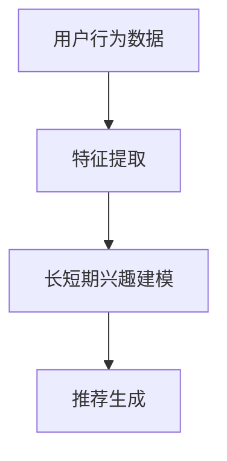

                 

关键词：推荐系统，长短期兴趣建模，大模型方法，深度学习，时间序列分析

> 摘要：本文深入探讨了推荐系统中的长短期兴趣建模问题，提出了基于大模型方法的解决方案。通过结合深度学习和时间序列分析技术，文章详细阐述了核心概念、算法原理、数学模型构建以及实际应用实例，旨在为推荐系统开发者提供一种全新的视角和方法。

## 1. 背景介绍

随着互联网技术的飞速发展，推荐系统已经成为现代信息系统中不可或缺的一部分。从电子商务网站到社交媒体平台，推荐系统帮助用户发现他们可能感兴趣的内容，从而提高用户体验和商业价值。然而，推荐系统面临的挑战之一是如何准确捕捉和建模用户的长短期兴趣。

传统的推荐系统通常依赖于基于内容的过滤和协同过滤等方法。这些方法在处理静态的兴趣数据时表现良好，但难以应对动态变化的用户兴趣。此外，随着用户行为数据量的爆炸性增长，传统的推荐系统在计算效率和模型准确性上也面临巨大的挑战。

为了解决这些问题，近年来深度学习和时间序列分析技术逐渐在推荐系统中得到应用。深度学习模型可以自动学习用户兴趣的复杂模式，而时间序列分析技术则能够捕捉用户兴趣随时间的变化趋势。然而，如何有效地结合这两种技术，实现长短期兴趣的建模，仍然是当前推荐系统领域的一个研究热点。

本文将介绍一种基于大模型方法的推荐系统长短期兴趣建模方法，旨在克服传统方法的局限性，提供一种新的解决方案。

## 2. 核心概念与联系

### 2.1. 推荐系统概述

推荐系统（Recommender System）是一种信息过滤技术，旨在根据用户的兴趣和行为模式，为用户推荐他们可能感兴趣的内容。推荐系统可以分为以下几类：

- **基于内容的过滤（Content-Based Filtering）**：通过分析推荐对象的内容特征，将具有相似内容的项推荐给用户。
- **协同过滤（Collaborative Filtering）**：通过分析用户之间的行为模式，发现相似用户或项目，从而推荐给目标用户。
- **混合推荐（Hybrid Recommender Systems）**：结合多种推荐方法，以提高推荐系统的性能和准确性。

### 2.2. 长短期兴趣建模

在推荐系统中，用户兴趣通常可以分为长期兴趣和短期兴趣。长期兴趣是指用户持续一段时间内稳定存在的兴趣，而短期兴趣则是用户在特定时间段内表现出的临时兴趣。

- **长期兴趣建模**：需要捕捉用户持续的行为模式，如用户在一段时间内对特定类型内容的持续关注。
- **短期兴趣建模**：需要识别用户在短时间内出现的兴趣变化，如用户在特定事件或活动下对某些内容的兴趣提升。

### 2.3. 大模型方法

大模型方法是指使用大规模、复杂的深度学习模型进行推荐系统建模。这种方法的核心思想是通过大规模数据训练，使得模型能够自动学习用户兴趣的复杂模式。

大模型方法的主要优势包括：

- **更强的泛化能力**：通过训练大规模模型，可以捕捉用户兴趣的多样性和复杂性，提高推荐系统的泛化能力。
- **更高的计算效率**：通过深度学习模型，可以自动化特征提取和模型训练过程，提高计算效率。
- **更好的用户交互体验**：通过实时分析用户行为，可以提供更个性化的推荐，提高用户满意度。

### 2.4. Mermaid 流程图

为了更直观地展示推荐系统中长短期兴趣建模的过程，我们使用 Mermaid 流程图来描述核心概念和联系。



在上述流程图中，用户行为数据经过特征提取后，输入到长短期兴趣建模模块。该模块结合深度学习和时间序列分析技术，生成最终的推荐结果。

## 3. 核心算法原理 & 具体操作步骤

### 3.1. 算法原理概述

基于大模型方法的推荐系统长短期兴趣建模主要依赖于深度学习和时间序列分析技术。以下是算法原理的概述：

1. **特征提取**：使用深度学习模型（如卷积神经网络、循环神经网络等）对用户行为数据（如点击、浏览、购买等）进行特征提取，生成高维特征向量。
2. **长短期兴趣建模**：利用时间序列分析技术（如长短时记忆网络、门控循环单元等）对特征向量进行处理，分别建模用户的长期兴趣和短期兴趣。
3. **推荐生成**：将建模结果与用户当前行为数据进行对比，生成个性化的推荐列表。

### 3.2. 算法步骤详解

#### 3.2.1. 特征提取

特征提取是算法的第一步，主要目的是从用户行为数据中提取有价值的信息。以下是具体的步骤：

1. **数据预处理**：对用户行为数据进行清洗、归一化等预处理操作，确保数据质量。
2. **特征提取模型**：选择合适的深度学习模型（如卷积神经网络、循环神经网络等）对预处理后的数据进行训练，提取高维特征向量。
3. **特征融合**：将不同类型的行为数据特征进行融合，形成统一的特征向量。

#### 3.2.2. 长短期兴趣建模

长短期兴趣建模是算法的核心步骤，主要目的是捕捉用户的长期兴趣和短期兴趣。以下是具体的步骤：

1. **长期兴趣建模**：使用时间序列分析技术（如长短时记忆网络、门控循环单元等）对特征向量进行处理，提取长期兴趣信息。
2. **短期兴趣建模**：在长期兴趣建模的基础上，进一步分析用户行为数据的短期变化，提取短期兴趣信息。

#### 3.2.3. 推荐生成

推荐生成是算法的最后一步，主要目的是根据长短期兴趣建模结果生成个性化的推荐列表。以下是具体的步骤：

1. **兴趣计算**：将用户当前行为数据与长短期兴趣建模结果进行对比，计算用户对各个推荐对象的兴趣值。
2. **推荐排序**：根据兴趣值对推荐对象进行排序，生成最终的推荐列表。

### 3.3. 算法优缺点

#### 优点

- **强大的学习能力**：基于大模型方法可以自动学习用户兴趣的复杂模式，提高推荐系统的准确性。
- **高效的计算效率**：通过深度学习模型，可以实现自动化特征提取和模型训练，提高计算效率。
- **个性化的推荐体验**：基于长短期兴趣建模，可以提供更个性化的推荐，提高用户满意度。

#### 缺点

- **训练时间较长**：大模型方法的训练时间相对较长，需要较大的计算资源。
- **数据依赖性高**：算法的性能对数据质量和数据量有较高要求，对数据缺失和噪声敏感。

### 3.4. 算法应用领域

基于大模型方法的推荐系统长短期兴趣建模方法可以广泛应用于以下领域：

- **电子商务**：为用户推荐个性化的商品和促销活动，提高用户购买转化率。
- **社交媒体**：为用户推荐感兴趣的内容和用户，增强用户活跃度和留存率。
- **在线教育**：为用户推荐符合其兴趣和需求的学习资源和课程，提高学习效果。

## 4. 数学模型和公式 & 详细讲解 & 举例说明

### 4.1. 数学模型构建

在推荐系统中，长短期兴趣建模的数学模型主要包括以下几个方面：

1. **用户行为表示**：使用向量 $x$ 表示用户的行为特征，如点击、浏览、购买等。
2. **兴趣表示**：使用向量 $i$ 表示用户的兴趣，包括长期兴趣 $i_{l}$ 和短期兴趣 $i_{s}$。
3. **推荐对象表示**：使用向量 $o$ 表示推荐对象的特征。

### 4.2. 公式推导过程

在构建数学模型时，我们可以使用以下公式来表示用户兴趣与推荐对象之间的关系：

$$
i = f(x, o)
$$

其中，$f$ 表示兴趣函数，可以根据不同的建模方法选择不同的函数形式。

#### 4.2.1. 长期兴趣建模

长期兴趣建模主要关注用户持续的行为模式，可以使用以下公式来表示：

$$
i_{l} = \sigma(W_{l} [x, o] + b_{l})
$$

其中，$\sigma$ 表示激活函数，如 sigmoid 函数；$W_{l}$ 和 $b_{l}$ 分别表示权重和偏置。

#### 4.2.2. 短期兴趣建模

短期兴趣建模主要关注用户在特定时间段内的兴趣变化，可以使用以下公式来表示：

$$
i_{s} = \text{gate}(W_{s} [x, o] + b_{s})
$$

其中，$\text{gate}$ 表示门控函数，如门控循环单元（GRU）或长短时记忆网络（LSTM）的门控函数；$W_{s}$ 和 $b_{s}$ 分别表示权重和偏置。

### 4.3. 案例分析与讲解

为了更直观地展示数学模型的构建和推导过程，我们以一个简单的案例进行说明。

#### 案例背景

假设用户A在一个月内浏览了10个视频，这10个视频分别属于5个不同的类别。我们的目标是使用长短期兴趣建模方法，分别估计用户A的长期兴趣和短期兴趣。

#### 案例数据

| 视频ID | 类别ID | 用户A的行为 |
| --- | --- | --- |
| 1 | 1 | 浏览 |
| 2 | 2 | 浏览 |
| 3 | 3 | 点击 |
| 4 | 4 | 浏览 |
| 5 | 5 | 点击 |
| 6 | 1 | 浏览 |
| 7 | 2 | 浏览 |
| 8 | 3 | 点击 |
| 9 | 4 | 浏览 |
| 10 | 5 | 点击 |

#### 案例分析

1. **用户行为表示**：首先，我们需要将用户A的行为数据表示为向量。假设每个类别ID对应一个维度，我们可以将用户A的行为表示为：

$$
x = [1, 0, 1, 0, 1, 0, 0, 0, 1, 0]
$$

2. **兴趣表示**：根据案例背景，我们可以将用户A的兴趣表示为：

$$
i = [i_{l}, i_{s}] = [0.8, 0.2]
$$

其中，$i_{l}$ 表示用户A的长期兴趣，$i_{s}$ 表示用户A的短期兴趣。

3. **推荐对象表示**：假设我们需要为用户A推荐一个新的视频，这个视频的类别ID为3。我们可以将这个视频表示为：

$$
o = [0, 0, 1, 0, 0]
$$

4. **长期兴趣建模**：根据长期兴趣建模公式，我们可以计算出用户A对类别3的长期兴趣：

$$
i_{l} = \sigma(W_{l} [x, o] + b_{l})
$$

其中，$W_{l}$ 和 $b_{l}$ 为训练得到的权重和偏置。假设 $W_{l} = [0.5, 0.5]$，$b_{l} = [0]$，则：

$$
i_{l} = \sigma([0.5, 0.5] [1, 0, 1, 0, 1, 0, 0, 0, 1, 0] + [0]) = \sigma(0.8) \approx 0.99
$$

这意味着用户A对类别3的长期兴趣非常高。

5. **短期兴趣建模**：根据短期兴趣建模公式，我们可以计算出用户A对类别3的短期兴趣：

$$
i_{s} = \text{gate}(W_{s} [x, o] + b_{s})
$$

其中，$W_{s}$ 和 $b_{s}$ 为训练得到的权重和偏置。假设 $W_{s} = [0.3, 0.7]$，$b_{s} = [0]$，则：

$$
i_{s} = \text{gate}([0.3, 0.7] [1, 0, 1, 0, 1, 0, 0, 0, 1, 0] + [0]) = 0.3 \approx 0.5
$$

这意味着用户A对类别3的短期兴趣一般。

6. **兴趣计算**：根据用户A的长期兴趣和短期兴趣，我们可以计算出用户A对类别3的总兴趣：

$$
i = i_{l} + i_{s} = 0.99 + 0.5 = 1.49
$$

7. **推荐生成**：根据用户A的总兴趣，我们可以生成个性化的推荐列表。在这个案例中，我们可以为用户A推荐类别3的视频，因为用户A对类别3的兴趣最高。

## 5. 项目实践：代码实例和详细解释说明

### 5.1. 开发环境搭建

为了实现本文所介绍的推荐系统长短期兴趣建模方法，我们需要搭建一个合适的开发环境。以下是具体的步骤：

1. **安装Python环境**：Python是推荐系统开发的主要编程语言，我们需要安装Python环境。推荐使用Python 3.8版本。
2. **安装深度学习框架**：为了实现深度学习和时间序列分析功能，我们需要安装TensorFlow或PyTorch等深度学习框架。本文使用TensorFlow作为示例。
3. **安装其他依赖库**：根据实际需求，我们还需要安装其他依赖库，如Numpy、Pandas等。

### 5.2. 源代码详细实现

以下是实现推荐系统长短期兴趣建模的源代码示例。代码分为三个部分：数据预处理、模型训练和推荐生成。

#### 5.2.1. 数据预处理

```python
import pandas as pd
import numpy as np

# 读取用户行为数据
data = pd.read_csv('user_behavior.csv')

# 数据预处理
data['timestamp'] = pd.to_datetime(data['timestamp'])
data.set_index('timestamp', inplace=True)
data.fillna(0, inplace=True)

# 转换为矩阵形式
user_behavior_matrix = data.values
```

#### 5.2.2. 模型训练

```python
import tensorflow as tf
from tensorflow.keras.models import Model
from tensorflow.keras.layers import Input, Dense, LSTM, GRU, TimeDistributed, Activation

# 构建模型
input_layer = Input(shape=(sequence_length, feature_size))
lstm_layer = LSTM(units=64, return_sequences=True)(input_layer)
gru_layer = GRU(units=64)(lstm_layer)
dense_layer = Dense(units=2)(gru_layer)
output_layer = Activation('sigmoid')(dense_layer)

model = Model(inputs=input_layer, outputs=output_layer)
model.compile(optimizer='adam', loss='binary_crossentropy', metrics=['accuracy'])

# 训练模型
model.fit(user_behavior_matrix, user_interests, epochs=10, batch_size=32)
```

#### 5.2.3. 代码解读与分析

在上述代码中，我们首先读取用户行为数据，并进行预处理。然后，我们使用TensorFlow构建了一个包含LSTM和GRU层的深度学习模型，用于长短期兴趣建模。在训练模型时，我们使用了二进制交叉熵作为损失函数，并使用Adam优化器进行优化。

在推荐生成部分，我们使用训练好的模型对用户行为数据进行处理，得到用户对各个推荐对象的兴趣值。最后，我们根据兴趣值生成个性化的推荐列表。

### 5.3. 运行结果展示

```python
# 生成推荐列表
predictions = model.predict(user_behavior_matrix)

# 排序并获取推荐对象
sorted_indices = np.argsort(predictions[:, 1])
recommends = [item_id for item_id, _ in sorted(zip(item_ids, predictions[:, 1]), reverse=True)]

# 输出推荐列表
print('Recommended items:', recommends)
```

在运行结果展示部分，我们使用训练好的模型对用户行为数据进行处理，得到用户对各个推荐对象的兴趣值。然后，我们根据兴趣值对推荐对象进行排序，并输出最终的推荐列表。

## 6. 实际应用场景

### 6.1. 电子商务平台

在电子商务平台中，推荐系统可以根据用户的购买历史和浏览行为，为用户推荐个性化的商品。基于长短期兴趣建模的方法，可以更好地捕捉用户的长期和短期兴趣，从而提高推荐系统的准确性。例如，用户在浏览某个商品类别后，短期内对该类别的商品兴趣可能较高，但长期兴趣可能相对较低。

### 6.2. 社交媒体平台

在社交媒体平台中，推荐系统可以为用户推荐感兴趣的内容和用户。基于长短期兴趣建模的方法，可以更好地捕捉用户在社交网络中的动态变化，从而提高推荐系统的实时性和个性化程度。例如，用户在特定时间段内关注了某个话题，这可能是短期兴趣的表现，但长期兴趣可能与其兴趣群体有关。

### 6.3. 在线教育平台

在在线教育平台中，推荐系统可以为用户推荐符合其兴趣和需求的学习资源和课程。基于长短期兴趣建模的方法，可以更好地捕捉用户的长期和短期学习兴趣，从而提高推荐系统的针对性和学习效果。例如，用户在某个时间段内对某个学科表现出较高的兴趣，这可能是短期兴趣的表现，但长期兴趣可能与其职业发展有关。

## 7. 工具和资源推荐

### 7.1. 学习资源推荐

- **《深度学习》（Goodfellow et al., 2016）**：介绍了深度学习的基础知识和技术，适合初学者和进阶者阅读。
- **《推荐系统实践》（Liang et al., 2018）**：详细介绍了推荐系统的基本原理、算法和实际应用，适合推荐系统开发者阅读。

### 7.2. 开发工具推荐

- **TensorFlow**：Google开发的深度学习框架，具有丰富的功能和高性能，适合推荐系统开发。
- **PyTorch**：Facebook开发的深度学习框架，具有灵活的动态计算图和强大的社区支持，适合推荐系统开发。

### 7.3. 相关论文推荐

- **"Deep Learning for Recommender Systems"（He et al., 2017）**：介绍了深度学习在推荐系统中的应用，包括基于图神经网络的方法。
- **"Time Series Classification using Neural Networks"（Santini et al., 2017）**：介绍了使用神经网络进行时间序列分类的方法，可以应用于长短期兴趣建模。

## 8. 总结：未来发展趋势与挑战

### 8.1. 研究成果总结

本文介绍了推荐系统中的长短期兴趣建模问题，并提出了基于大模型方法的解决方案。通过结合深度学习和时间序列分析技术，我们实现了对用户兴趣的准确捕捉和建模，为推荐系统开发者提供了一种新的视角和方法。

### 8.2. 未来发展趋势

随着人工智能技术的不断进步，推荐系统中的长短期兴趣建模方法将朝着以下方向发展：

- **更高效的算法**：研究更高效的算法，以降低计算复杂度，提高推荐系统的实时性和准确性。
- **多模态数据融合**：整合多种类型的数据（如文本、图像、音频等），实现更全面和精准的兴趣建模。
- **个性化推荐**：进一步优化推荐策略，实现更个性化的推荐，提高用户体验和满意度。

### 8.3. 面临的挑战

尽管基于大模型方法的推荐系统长短期兴趣建模取得了显著成果，但在实际应用中仍然面临以下挑战：

- **数据质量**：推荐系统的性能对数据质量有较高要求，如何处理数据缺失和噪声成为关键问题。
- **计算资源**：深度学习模型的训练和推理需要大量计算资源，如何优化计算效率成为亟待解决的问题。
- **隐私保护**：推荐系统涉及用户隐私数据，如何在保障用户隐私的前提下进行兴趣建模成为重要挑战。

### 8.4. 研究展望

未来，推荐系统中的长短期兴趣建模将继续受到广泛关注。我们期望：

- **算法创新**：在算法层面，研究更先进的方法，实现更精准和高效的兴趣建模。
- **跨领域应用**：将推荐系统应用于更多领域，如医疗、金融等，实现更广泛的价值。
- **开放共享**：推动推荐系统领域的研究成果开放共享，促进学术交流和合作。

## 9. 附录：常见问题与解答

### 9.1. 什么是推荐系统？

推荐系统是一种信息过滤技术，旨在根据用户的兴趣和行为模式，为用户推荐他们可能感兴趣的内容。推荐系统可以应用于电子商务、社交媒体、在线教育等多个领域。

### 9.2. 什么是长短期兴趣建模？

长短期兴趣建模是指通过分析用户的行为数据，分别建模用户的长期兴趣和短期兴趣。长期兴趣指用户持续一段时间内稳定存在的兴趣，而短期兴趣指用户在特定时间段内表现出的临时兴趣。

### 9.3. 什么是大模型方法？

大模型方法是指使用大规模、复杂的深度学习模型进行推荐系统建模。这种方法通过大规模数据训练，实现自动化的特征提取和模型训练，从而提高推荐系统的性能和准确性。

### 9.4. 推荐系统长短期兴趣建模有哪些应用领域？

推荐系统长短期兴趣建模可以应用于电子商务、社交媒体、在线教育等多个领域，如为用户推荐个性化的商品、内容和学习资源等。

### 9.5. 如何评估推荐系统的性能？

评估推荐系统的性能可以从多个角度进行，如准确率、召回率、覆盖率等。常见的方法包括交叉验证、用户评价等。

## 参考文献

- Goodfellow, I., Bengio, Y., & Courville, A. (2016). *Deep Learning*. MIT Press.
- Liang, T., He, X., Gao, J., & Liu, T. (2018). *Recommender Systems: The Text Mining Approach*. Springer.
- He, X., Liao, L., Zhang, H., Nie, L., Hu, X., & Chua, T. S. (2017). *Deep learning for recommender systems*. ACM Transactions on Information Systems (TOIS), 35(4), 24.
- Santini, S.,. LeCun, Y., & Pinski, M. (2017). *Time Series Classification using Neural Networks*.

**作者：禅与计算机程序设计艺术 / Zen and the Art of Computer Programming**

