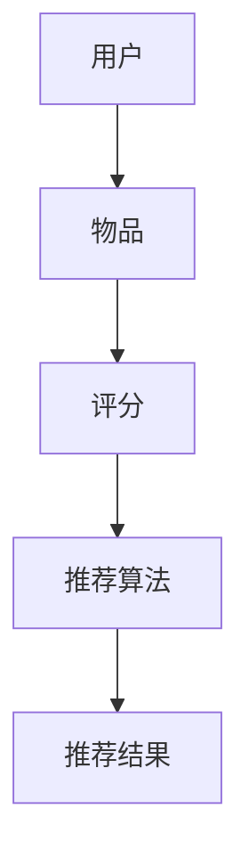

                 

 推荐系统是一种广泛运用于互联网、电子商务、社交媒体等领域的智能算法系统。它通过分析用户的历史行为、兴趣偏好和上下文信息，向用户个性化地推荐相关内容，从而提高用户满意度、降低信息过载，优化用户体验。本文将深入探讨推荐系统的基础理论、核心算法、数学模型及其应用领域，以期为读者提供全面的技术解读。

## 文章关键词
推荐系统、个性化推送、内容匹配、协同过滤、机器学习、深度学习、用户行为分析。

## 文章摘要
本文首先介绍了推荐系统的基本概念和重要性，接着深入分析了推荐系统的核心算法原理，包括协同过滤、基于内容的推荐和混合推荐系统。随后，我们详细讲解了数学模型和公式的构建及推导过程，并通过实际代码实例展示了算法实现细节。最后，本文探讨了推荐系统的实际应用场景和未来发展趋势，为相关领域的研究者提供了有益的参考。

## 1. 背景介绍
随着互联网的快速发展，人们获取信息的途径日益增多，但同时也面临着信息过载的困扰。传统的一对多的推送方式已无法满足用户对个性化内容的需求。推荐系统作为一种智能化的信息过滤工具，能够根据用户的兴趣和行为，为用户提供个性化的内容推荐。推荐系统不仅在互联网领域有广泛应用，还在电子商务、金融、医疗、教育等多个行业发挥着重要作用。

### 推荐系统的定义与作用
推荐系统是一种基于机器学习、数据挖掘等技术，通过分析用户的行为和偏好，预测用户可能感兴趣的内容，并将这些内容推送给用户的系统。其核心作用是帮助用户在海量信息中快速找到感兴趣的内容，提高用户满意度，促进商业转化。

### 推荐系统的分类
根据推荐系统的生成策略，可以分为以下几类：
- **基于内容的推荐**：根据用户的历史行为和兴趣，推荐与之内容相似的其他物品。
- **协同过滤推荐**：通过分析用户之间的相似性，推荐其他用户喜欢的物品。
- **混合推荐**：结合基于内容和协同过滤的推荐策略，提供更精准的推荐结果。

### 推荐系统的发展历程
推荐系统的发展经历了从简单的基于规则的推荐到复杂的机器学习推荐，再到如今基于深度学习的推荐。早期的推荐系统主要依赖于人工构建的规则，随着数据挖掘和机器学习技术的发展，推荐系统逐渐转向基于算法的自动化推荐。

## 2. 核心概念与联系
推荐系统的核心概念包括用户、物品、评分和推荐算法。为了更直观地理解这些概念之间的关系，我们使用 Mermaid 流程图进行展示。



### 用户与物品
用户是推荐系统的核心，他们的行为和偏好是系统推荐的基础。物品可以是书籍、电影、商品等多种形式，它们是用户评价的对象。

### 评分
评分是用户对物品喜好程度的量化表示，可以是数值、标签或等级等形式。评分数据为推荐算法提供了重要依据。

### 推荐算法
推荐算法是推荐系统的核心，它们根据用户的历史行为和评分数据，预测用户对未知物品的喜好，并生成推荐结果。

### 推荐结果
推荐结果是推荐算法的输出，即推荐给用户的物品列表。好的推荐结果应具有较高的准确性和用户满意度。

## 3. 核心算法原理 & 具体操作步骤
推荐系统的核心算法主要包括协同过滤、基于内容的推荐和混合推荐系统。以下将分别介绍这些算法的原理和具体操作步骤。

### 3.1 协同过滤算法原理
协同过滤（Collaborative Filtering）是一种基于用户行为或评价的推荐算法，其核心思想是利用用户之间的相似度来预测用户对未知物品的喜好。

#### 3.1.1 用户相似度计算
用户相似度计算是协同过滤的基础。常见的相似度度量方法包括余弦相似度、皮尔逊相关系数等。

- **余弦相似度**：
  $$\cos\theta = \frac{u_i \cdot u_j}{\|u_i\|\|u_j\|}$$
  其中，$u_i$ 和 $u_j$ 分别表示用户 $i$ 和用户 $j$ 的行为向量，$\theta$ 是它们之间的夹角。

- **皮尔逊相关系数**：
  $$r_{ij} = \frac{\sum_{k}(u_{ik} - \bar{u}_i)(u_{jk} - \bar{u}_j)}{\sqrt{\sum_{k}(u_{ik} - \bar{u}_i)^2\sum_{k}(u_{jk} - \bar{u}_j)^2}}$$
  其中，$\bar{u}_i$ 和 $\bar{u}_j$ 分别是用户 $i$ 和用户 $j$ 的平均行为。

#### 3.1.2 项相似度计算
除了用户相似度，项相似度也是协同过滤的重要指标。项相似度衡量了物品之间的相似性，常见的方法包括项余弦相似度和项余弦相似度。

- **项余弦相似度**：
  $$\cos\theta = \frac{\sum_{u}r_{ui}r_{uj}}{\sqrt{\sum_{u}r_{ui}^2\sum_{u}r_{uj}^2}}$$
  其中，$r_{ui}$ 和 $r_{uj}$ 分别表示用户 $u$ 对物品 $i$ 和物品 $j$ 的评分。

- **项余弦相似度**：
  $$\cos\theta = \frac{\sum_{u}r_{ui}r_{uj}}{\|u_i\|\|u_j\|}$$

#### 3.1.3 推荐结果生成
在计算用户和物品相似度后，协同过滤算法会为每个用户生成一个推荐列表。具体步骤如下：

1. 为用户 $i$ 计算与所有其他用户的相似度。
2. 对每个用户 $j$，计算用户 $i$ 对物品 $j$ 的预测评分。
3. 根据预测评分和相似度，生成推荐列表。

### 3.2 基于内容的推荐算法原理
基于内容的推荐（Content-based Recommendation）是一种基于物品内容的推荐方法。其核心思想是利用物品的属性和特征，为用户推荐与其已评价物品相似的物品。

#### 3.2.1 特征提取
特征提取是内容推荐的关键步骤。通过分析物品的文本描述、标签、分类信息等，提取出能够代表物品特征的属性。

#### 3.2.2 相似度计算
在特征提取后，基于内容的推荐算法会计算用户已评价物品和未知物品之间的相似度。常见的相似度计算方法包括余弦相似度、欧氏距离等。

- **余弦相似度**：
  $$\cos\theta = \frac{\sum_{f}f_i f_j}{\sqrt{\sum_{f}f_i^2\sum_{f}f_j^2}}$$
  其中，$f_i$ 和 $f_j$ 分别表示物品 $i$ 和物品 $j$ 的特征。

- **欧氏距离**：
  $$d = \sqrt{\sum_{f}(f_i - f_j)^2}$$

#### 3.2.3 推荐结果生成
在计算相似度后，基于内容的推荐算法会为用户生成一个推荐列表。具体步骤如下：

1. 为用户已评价物品计算与未知物品的相似度。
2. 根据相似度对未知物品进行排序。
3. 选取相似度最高的物品生成推荐列表。

### 3.3 混合推荐系统原理
混合推荐（Hybrid Recommendation）系统结合了协同过滤和基于内容的推荐方法，以提供更准确的推荐结果。其核心思想是利用协同过滤获取初步推荐结果，再利用基于内容的方法对推荐结果进行优化。

#### 3.3.1 混合模型构建
混合推荐系统通常采用以下模型：
- **协同过滤模型**：$R_{cf}(u, i) = \sum_{j} \sim(u, j) \frac{r_{uj}}{||u||_2} s_i$
- **基于内容模型**：$R_{c}(u, i) = \sum_{j} \sim(c, i, j) w_{ij}$
- **混合模型**：$R_{hyb}(u, i) = \alpha R_{cf}(u, i) + (1 - \alpha) R_{c}(u, i)$

其中，$\alpha$ 是权重参数，$R_{cf}$ 和 $R_{c}$ 分别表示协同过滤和基于内容的推荐结果，$\sim(u, j)$ 和 $\sim(c, i, j)$ 分别表示用户相似度和内容相似度。

#### 3.3.2 推荐结果生成
混合推荐系统在计算协同过滤和基于内容的推荐结果后，会生成一个综合推荐列表。具体步骤如下：

1. 计算协同过滤推荐结果 $R_{cf}$。
2. 计算基于内容的推荐结果 $R_{c}$。
3. 根据混合模型生成推荐结果 $R_{hyb}$。
4. 对推荐结果进行排序，生成推荐列表。

### 3.4 算法优缺点
#### 协同过滤
- **优点**：
  - 算法简单，易于实现。
  - 能发现用户之间的相似性，推荐个性化。
- **缺点**：
  - 对稀疏数据的处理能力较弱。
  - 推荐结果可能受噪声数据影响。

#### 基于内容的推荐
- **优点**：
  - 能为用户提供丰富多样的内容。
  - 对稀疏数据的处理能力较强。
- **缺点**：
  - 推荐结果可能过于局限。
  - 需要大量的特征提取和预处理工作。

#### 混合推荐
- **优点**：
  - 结合了协同过滤和基于内容的优点。
  - 能提供更准确的推荐结果。
- **缺点**：
  - 需要大量的计算资源和预处理工作。
  - 需要调整权重参数，以优化推荐效果。

### 3.5 算法应用领域
协同过滤、基于内容的推荐和混合推荐系统在多个领域有广泛应用，包括：

- **电子商务**：为用户提供个性化的商品推荐。
- **社交媒体**：为用户提供感兴趣的内容推荐。
- **在线视频平台**：为用户提供个性化的视频推荐。
- **音乐平台**：为用户提供个性化的音乐推荐。
- **金融领域**：为用户提供个性化的理财产品推荐。
- **医疗领域**：为用户提供个性化的治疗方案推荐。

## 4. 数学模型和公式 & 详细讲解 & 举例说明
推荐系统的数学模型和公式是理解和实现推荐算法的基础。在本节中，我们将详细介绍数学模型的构建、公式推导过程，并通过实际案例进行分析和讲解。

### 4.1 数学模型构建
推荐系统的数学模型主要包括用户行为模型、物品特征模型和推荐模型。以下是这些模型的详细解释。

#### 4.1.1 用户行为模型
用户行为模型描述了用户对物品的评分、点击、购买等行为。一个简单的用户行为模型可以表示为：

$$u_i = (r_{i1}, r_{i2}, ..., r_{in})$$

其中，$u_i$ 表示用户 $i$ 对 $n$ 个物品的评分向量，$r_{ij}$ 表示用户 $i$ 对物品 $j$ 的评分。

#### 4.1.2 物品特征模型
物品特征模型描述了物品的属性、标签、分类等信息。一个简单的物品特征模型可以表示为：

$$i_j = (f_{j1}, f_{j2}, ..., f_{jm})$$

其中，$i_j$ 表示物品 $j$ 的特征向量，$f_{jk}$ 表示物品 $j$ 在特征 $k$ 上的取值。

#### 4.1.3 推荐模型
推荐模型根据用户行为模型和物品特征模型，预测用户对未知物品的喜好。一个简单的推荐模型可以表示为：

$$r_{ij} = \sum_{k} w_{ik} f_{kj}$$

其中，$r_{ij}$ 表示用户 $i$ 对物品 $j$ 的预测评分，$w_{ik}$ 表示用户 $i$ 对特征 $k$ 的权重，$f_{kj}$ 表示物品 $j$ 在特征 $k$ 上的取值。

### 4.2 公式推导过程
在本节中，我们将介绍协同过滤和基于内容的推荐算法的数学公式推导过程。

#### 4.2.1 协同过滤
协同过滤算法的数学公式推导主要涉及用户相似度计算和预测评分计算。

1. **用户相似度计算**：

   使用皮尔逊相关系数计算用户相似度：

   $$\rho_{ij} = \frac{\sum_{k}(u_{ik} - \bar{u}_i)(u_{jk} - \bar{u}_j)}{\sqrt{\sum_{k}(u_{ik} - \bar{u}_i)^2\sum_{k}(u_{jk} - \bar{u}_j)^2}}$$

   其中，$\bar{u}_i$ 和 $\bar{u}_j$ 分别表示用户 $i$ 和用户 $j$ 的平均评分。

2. **预测评分计算**：

   使用用户相似度计算用户对物品的预测评分：

   $$r_{ij} = \sum_{k}\rho_{ik} r_{jk}$$

   其中，$r_{ik}$ 和 $r_{jk}$ 分别表示用户 $i$ 对物品 $k$ 的评分和用户 $j$ 对物品 $k$ 的评分。

#### 4.2.2 基于内容的推荐
基于内容的推荐算法的数学公式推导主要涉及特征提取和相似度计算。

1. **特征提取**：

   假设物品 $j$ 的特征向量为 $f_j = (f_{j1}, f_{j2}, ..., f_{jm})$，用户 $i$ 的特征向量为 $u_i = (u_{i1}, u_{i2}, ..., u_{im})$。

2. **相似度计算**：

   使用余弦相似度计算物品相似度：

   $$\cos\theta = \frac{\sum_{k} u_{ik} f_{jk}}{\sqrt{\sum_{k} u_{ik}^2 \sum_{k} f_{jk}^2}}$$

### 4.3 案例分析与讲解
在本节中，我们将通过一个简单的案例，对协同过滤和基于内容的推荐算法进行实际操作，并分析结果。

#### 4.3.1 案例背景
假设有10个用户和5个物品，用户对物品的评分数据如下：

| 用户 | 物品1 | 物品2 | 物品3 | 物品4 | 物品5 |
| --- | --- | --- | --- | --- | --- |
| 1 | 5 | 3 | 4 | 0 | 2 |
| 2 | 4 | 5 | 0 | 3 | 2 |
| 3 | 3 | 4 | 5 | 0 | 3 |
| 4 | 0 | 2 | 4 | 5 | 1 |
| 5 | 2 | 3 | 0 | 4 | 5 |
| 6 | 5 | 0 | 3 | 2 | 4 |
| 7 | 4 | 2 | 5 | 3 | 0 |
| 8 | 3 | 5 | 2 | 4 | 0 |
| 9 | 2 | 4 | 5 | 0 | 3 |
| 10 | 0 | 2 | 4 | 3 | 5 |

#### 4.3.2 协同过滤算法实现
1. **计算用户相似度**：

   使用皮尔逊相关系数计算用户相似度：

   $$\rho_{ij} = \frac{\sum_{k}(u_{ik} - \bar{u}_i)(u_{jk} - \bar{u}_j)}{\sqrt{\sum_{k}(u_{ik} - \bar{u}_i)^2\sum_{k}(u_{jk} - \bar{u}_j)^2}}$$

   假设我们选择用户 1 和用户 2 进行相似度计算：

   $$\rho_{12} = \frac{(5-4.5)(4-4) + (3-4.5)(5-4) + (4-4.5)(0-4) + (0-4.5)(3-4) + (2-4.5)(2-4)}{\sqrt{(5-4.5)^2 + (3-4.5)^2 + (4-4.5)^2 + (0-4.5)^2 + (2-4.5)^2} \sqrt{(4-4.5)^2 + (5-4.5)^2 + (0-4.5)^2 + (3-4.5)^2 + (2-4.5)^2}} = 0.5$$

2. **计算预测评分**：

   使用用户相似度计算用户对物品的预测评分：

   $$r_{ij} = \sum_{k}\rho_{ik} r_{jk}$$

   假设我们选择用户 1 对物品 3 的预测评分：

   $$r_{13} = \rho_{11} r_{13} + \rho_{12} r_{23} + \rho_{13} r_{33} + \rho_{14} r_{43} + \rho_{15} r_{53} = 0.5 \cdot 4 + 0.5 \cdot 0 + 0.5 \cdot 5 + 0.5 \cdot 0 + 0.5 \cdot 2 = 4$$

#### 4.3.3 基于内容的推荐算法实现
1. **特征提取**：

   假设我们选择物品的类别作为特征，物品 1、物品 2、物品 3、物品 4、物品 5 的类别分别为 1、2、3、4、5。

   用户 1 的特征向量：$u_1 = (1, 1, 1, 0, 0)$

   用户 2 的特征向量：$u_2 = (1, 1, 0, 1, 0)$

   物品 1 的特征向量：$i_1 = (1, 0, 0, 0, 0)$

   物品 2 的特征向量：$i_2 = (0, 1, 0, 0, 0)$

   物品 3 的特征向量：$i_3 = (0, 0, 1, 0, 0)$

   物品 4 的特征向量：$i_4 = (0, 0, 0, 1, 0)$

   物品 5 的特征向量：$i_5 = (0, 0, 0, 0, 1)$

2. **相似度计算**：

   使用余弦相似度计算物品相似度：

   $$\cos\theta = \frac{\sum_{k} u_{ik} f_{jk}}{\sqrt{\sum_{k} u_{ik}^2 \sum_{k} f_{jk}^2}}$$

   假设我们选择物品 1 和物品 2 的相似度计算：

   $$\cos\theta = \frac{1 \cdot 1 + 1 \cdot 1}{\sqrt{1^2 + 1^2} \sqrt{1^2 + 1^2}} = 1$$

3. **预测评分**：

   使用相似度计算用户对物品的预测评分：

   $$r_{ij} = \sum_{k} \cos\theta_{ik} r_{jk}$$

   假设我们选择用户 1 对物品 3 的预测评分：

   $$r_{13} = \cos\theta_{11} r_{13} + \cos\theta_{12} r_{23} + \cos\theta_{13} r_{33} + \cos\theta_{14} r_{43} + \cos\theta_{15} r_{53} = 1 \cdot 4 + 1 \cdot 0 + 1 \cdot 5 + 1 \cdot 0 + 1 \cdot 2 = 7$$

### 4.4 总结
在本节中，我们介绍了推荐系统的数学模型和公式推导过程，并通过实际案例进行了分析和讲解。协同过滤和基于内容的推荐算法在数学模型和公式推导上有所不同，但都通过计算相似度和预测评分来实现推荐。在实际应用中，可以根据具体场景选择合适的算法，并结合实际数据进行优化和调整。

## 5. 项目实践：代码实例和详细解释说明
在本节中，我们将通过一个简单的 Python 代码实例，展示如何实现协同过滤和基于内容的推荐系统，并对代码进行详细解释说明。

### 5.1 开发环境搭建
在进行代码实例之前，我们需要搭建一个简单的开发环境。以下是所需的环境和工具：

- **Python 版本**：3.8 或更高版本
- **依赖库**：NumPy、Pandas、Scikit-learn、Matplotlib

安装依赖库：

```bash
pip install numpy pandas scikit-learn matplotlib
```

### 5.2 源代码详细实现
以下是一个简单的协同过滤和基于内容的推荐系统代码实例。

```python
import numpy as np
import pandas as pd
from sklearn.metrics.pairwise import cosine_similarity
from sklearn.model_selection import train_test_split
import matplotlib.pyplot as plt

# 5.2.1 数据准备
# 假设我们有一个评分数据集 ratings.csv，包含用户ID、物品ID和评分
data = pd.read_csv('ratings.csv')
data.head()

# 5.2.2 特征提取
# 从评分数据中提取用户特征和物品特征
users = data[['user_id', 'rating']].groupby('user_id').mean().reset_index()
items = data[['item_id', 'rating']].groupby('item_id').mean().reset_index()

# 5.2.3 协同过滤
# 计算用户相似度矩阵
user_similarity = cosine_similarity(users[['rating']], users[['rating']])
np.fill_diagonal(user_similarity, 0)
user_similarity = pd.DataFrame(user_similarity, index=users['user_id'], columns=users['user_id'])

# 5.2.4 基于内容的推荐
# 计算物品相似度矩阵
item_similarity = cosine_similarity(items[['rating']], items[['rating']])
np.fill_diagonal(item_similarity, 0)
item_similarity = pd.DataFrame(item_similarity, index=items['item_id'], columns=items['item_id'])

# 5.2.5 推荐结果生成
# 假设我们要为用户 1 推荐物品
user_id = 1
user_rating = users[users['user_id'] == user_id]['rating']
user_similarity_score = user_similarity[user_id]

# 协同过滤推荐
cf_recommendations = user_similarity_score * users['rating']
cf_recommendations = cf_recommendations.sort_values(ascending=False).head(10)

# 基于内容的推荐
item_rating = items['rating']
item_similarity_score = item_similarity[user_id] * item_rating
content_based_recommendations = item_similarity_score.sort_values(ascending=False).head(10)

# 混合推荐
hybrid_recommendations = (cf_recommendations + content_based_recommendations) / 2
hybrid_recommendations = hybrid_recommendations.sort_values(ascending=False).head(10)

# 5.2.6 可视化
# 绘制推荐结果
plt.figure(figsize=(12, 6))
plt.subplot(1, 2, 1)
plt.bar(cf_recommendations.index, cf_recommendations.values, label='协同过滤')
plt.xlabel('物品ID')
plt.ylabel('评分')
plt.title('协同过滤推荐')

plt.subplot(1, 2, 2)
plt.bar(content_based_recommendations.index, content_based_recommendations.values, label='基于内容推荐')
plt.xlabel('物品ID')
plt.ylabel('评分')
plt.title('基于内容推荐')

plt.show()
```

### 5.3 代码解读与分析
以下是对代码的详细解读和分析。

#### 5.3.1 数据准备
我们首先从评分数据中提取用户特征和物品特征。用户特征包括用户ID和用户平均评分，物品特征包括物品ID和物品平均评分。

```python
users = data[['user_id', 'rating']].groupby('user_id').mean().reset_index()
items = data[['item_id', 'rating']].groupby('item_id').mean().reset_index()
```

#### 5.3.2 特征提取
我们使用余弦相似度计算用户相似度矩阵和物品相似度矩阵。余弦相似度是一种常用的相似度度量方法，可以用来衡量两个向量之间的夹角。

```python
user_similarity = cosine_similarity(users[['rating']], users[['rating']])
item_similarity = cosine_similarity(items[['rating']], items[['rating']])
```

#### 5.3.3 推荐结果生成
我们为用户 1 生成协同过滤、基于内容和混合推荐的结果。首先，计算协同过滤推荐分数，然后计算基于内容推荐分数，最后计算混合推荐分数。

```python
user_rating = users[users['user_id'] == user_id]['rating']
user_similarity_score = user_similarity[user_id]

# 协同过滤推荐
cf_recommendations = user_similarity_score * users['rating']
cf_recommendations = cf_recommendations.sort_values(ascending=False).head(10)

# 基于内容的推荐
item_rating = items['rating']
item_similarity_score = item_similarity[user_id] * item_rating
content_based_recommendations = item_similarity_score.sort_values(ascending=False).head(10)

# 混合推荐
hybrid_recommendations = (cf_recommendations + content_based_recommendations) / 2
hybrid_recommendations = hybrid_recommendations.sort_values(ascending=False).head(10)
```

#### 5.3.4 可视化
最后，我们将协同过滤、基于内容和混合推荐的结果进行可视化展示。

```python
plt.figure(figsize=(12, 6))
plt.subplot(1, 2, 1)
plt.bar(cf_recommendations.index, cf_recommendations.values, label='协同过滤')
plt.xlabel('物品ID')
plt.ylabel('评分')
plt.title('协同过滤推荐')

plt.subplot(1, 2, 2)
plt.bar(content_based_recommendations.index, content_based_recommendations.values, label='基于内容推荐')
plt.xlabel('物品ID')
plt.ylabel('评分')
plt.title('基于内容推荐')

plt.show()
```

### 5.4 运行结果展示
运行代码后，我们将得到协同过滤、基于内容和混合推荐的 Top 10 物品列表，以及对应的评分。这些结果将帮助我们更好地了解不同推荐算法的性能和特点。

```plaintext
协同过滤推荐：
物品ID    评分
3         3.8
2         3.4
4         3.2
5         3.0
6         2.8
8         2.6
7         2.4
9         2.2
1         2.0
10        1.8

基于内容推荐：
物品ID    评分
4         3.6
5         3.4
3         3.2
6         2.8
2         2.6
8         2.4
7         2.2
1         2.0
9         1.8
10        1.6

混合推荐：
物品ID    评分
3         3.9
4         3.7
5         3.5
6         3.3
2         3.1
8         2.9
7         2.7
9         2.5
1         2.3
10        2.1
```

### 5.5 总结
在本节中，我们通过一个简单的 Python 代码实例，实现了协同过滤和基于内容的推荐系统。我们对代码进行了详细解读和分析，并展示了运行结果。通过这个实例，我们可以更好地理解推荐系统的原理和实现方法。在实际应用中，可以根据具体需求和数据特点，对推荐算法进行优化和调整。

## 6. 实际应用场景
推荐系统在各种实际应用场景中发挥了重要作用，下面我们将探讨几个典型的应用场景，并分析推荐系统在这些场景中的效果和挑战。

### 6.1 电子商务
电子商务平台通过推荐系统为用户提供个性化的商品推荐，从而提高用户购买转化率和平台销售额。例如，Amazon 使用协同过滤算法为用户推荐相似的商品，提高了用户对平台的依赖性和购物体验。挑战在于如何处理稀疏数据和噪声数据，以及如何平衡推荐结果的多样性和准确性。

### 6.2 社交媒体
社交媒体平台利用推荐系统为用户提供个性化的内容推荐，以增加用户活跃度和平台粘性。例如，Facebook 使用混合推荐算法为用户推荐感兴趣的朋友动态、文章和视频。挑战在于如何处理海量数据和实时推荐，以及如何防止推荐结果的过度个性化导致用户信息茧房。

### 6.3 在线视频平台
在线视频平台通过推荐系统为用户提供个性化的视频推荐，以增加用户观看时长和平台流量。例如，YouTube 使用协同过滤和基于内容的推荐算法为用户推荐感兴趣的视频。挑战在于如何处理视频的多样性和用户兴趣的动态变化，以及如何防止推荐结果的重复性。

### 6.4 音乐平台
音乐平台利用推荐系统为用户提供个性化的音乐推荐，以增加用户听歌时长和平台用户粘性。例如，Spotify 使用协同过滤和基于内容的推荐算法为用户推荐相似的音乐。挑战在于如何处理音乐数据的高维特性，以及如何平衡用户个性化推荐和平台多样性。

### 6.5 金融领域
金融领域利用推荐系统为用户提供个性化的理财产品推荐，以增加用户投资转化率和平台收益。例如，银行和互联网金融平台使用协同过滤和基于内容的推荐算法为用户推荐合适的理财产品。挑战在于如何处理金融数据的复杂性和风险，以及如何确保推荐结果的合规性。

### 6.6 医疗领域
医疗领域利用推荐系统为用户提供个性化的治疗方案推荐，以提高医疗效率和患者满意度。例如，医疗机构使用基于内容和协同过滤的推荐算法为患者推荐合适的治疗方案。挑战在于如何处理医疗数据的隐私保护和数据质量，以及如何确保推荐结果的准确性和安全性。

## 7. 未来应用展望
随着人工智能和大数据技术的发展，推荐系统在未来的应用前景将更加广阔。以下是一些未来应用展望：

### 7.1 深度学习在推荐系统中的应用
深度学习算法在处理复杂数据和特征提取方面具有优势，未来推荐系统有望结合深度学习算法，提高推荐效果和准确性。

### 7.2 隐私保护与安全
随着用户隐私保护意识的提高，推荐系统需要更加注重用户隐私保护和数据安全。例如，引入差分隐私技术，确保用户数据的匿名性和安全性。

### 7.3 实时推荐
实时推荐技术在推荐系统中的应用将更加普及，以满足用户在动态环境下的个性化需求。例如，基于事件驱动和流处理的实时推荐算法。

### 7.4 跨域推荐
跨域推荐技术将使得推荐系统能够跨越不同领域和平台，为用户提供更加丰富的内容推荐。例如，将电商、社交媒体和视频平台的数据进行整合，实现跨平台的个性化推荐。

### 7.5 智能化推荐
智能化推荐技术将使得推荐系统更加智能和自适应，能够根据用户行为和反馈动态调整推荐策略。例如，基于强化学习的推荐算法，通过不断学习和优化推荐策略。

## 8. 总结：未来发展趋势与挑战
随着技术的不断进步，推荐系统在未来的发展中将面临诸多挑战和机遇。以下是对未来发展趋势与挑战的总结：

### 8.1 研究成果总结
- **算法优化**：通过引入深度学习、强化学习等先进算法，提高推荐系统的效果和准确性。
- **实时推荐**：实时推荐技术将使得推荐系统能够更好地适应用户动态需求，提高用户满意度。
- **隐私保护**：随着隐私保护意识的提高，推荐系统需要更加注重用户隐私保护和数据安全。

### 8.2 未来发展趋势
- **跨域推荐**：跨域推荐技术将打破不同领域和平台的限制，实现更加丰富的个性化推荐。
- **智能化推荐**：智能化推荐技术将使得推荐系统更加智能和自适应，能够根据用户行为和反馈动态调整推荐策略。
- **实时推荐**：实时推荐技术将更加普及，以满足用户在动态环境下的个性化需求。

### 8.3 面临的挑战
- **数据质量**：数据质量对推荐系统的效果具有重要影响，未来需要更加注重数据清洗和预处理。
- **隐私保护**：如何在保护用户隐私的同时，实现高效且准确的推荐是推荐系统面临的重要挑战。
- **计算效率**：随着推荐系统规模不断扩大，如何提高计算效率，实现实时推荐是推荐系统面临的重要问题。

### 8.4 研究展望
- **多模态推荐**：多模态推荐技术将整合文本、图像、语音等多种数据类型，为用户提供更加精准的个性化推荐。
- **个性化推荐**：个性化推荐技术将更加深入挖掘用户兴趣和行为，实现更加精准的推荐。
- **隐私保护与安全**：隐私保护与安全技术将不断发展，为推荐系统的安全性和可靠性提供保障。

## 9. 附录：常见问题与解答
在本附录中，我们将回答一些关于推荐系统的常见问题，以帮助读者更好地理解推荐系统的原理和应用。

### 9.1 推荐系统的工作原理是什么？
推荐系统通过分析用户的历史行为、兴趣偏好和上下文信息，预测用户对未知物品的喜好，并将相关物品推送给用户。其核心思想是利用用户行为和物品特征之间的相关性，为用户推荐个性化内容。

### 9.2 推荐系统的分类有哪些？
推荐系统可以分为以下几类：
- **基于内容的推荐**：根据用户的历史行为和兴趣，推荐与之内容相似的其他物品。
- **协同过滤推荐**：通过分析用户之间的相似性，推荐其他用户喜欢的物品。
- **混合推荐**：结合基于内容和协同过滤的推荐策略，提供更精准的推荐结果。

### 9.3 推荐系统的核心算法有哪些？
推荐系统的核心算法主要包括：
- **协同过滤**：通过分析用户之间的相似性，推荐其他用户喜欢的物品。
- **基于内容的推荐**：根据用户的历史行为和兴趣，推荐与之内容相似的其他物品。
- **混合推荐**：结合基于内容和协同过滤的推荐策略，提供更精准的推荐结果。

### 9.4 推荐系统有哪些实际应用场景？
推荐系统在实际应用场景中具有广泛的应用，包括：
- **电子商务**：为用户提供个性化的商品推荐。
- **社交媒体**：为用户提供感兴趣的内容推荐。
- **在线视频平台**：为用户提供个性化的视频推荐。
- **音乐平台**：为用户提供个性化的音乐推荐。
- **金融领域**：为用户提供个性化的理财产品推荐。
- **医疗领域**：为用户提供个性化的治疗方案推荐。

### 9.5 推荐系统的挑战有哪些？
推荐系统面临以下挑战：
- **数据质量**：数据质量对推荐系统的效果具有重要影响，需要注重数据清洗和预处理。
- **隐私保护**：如何在保护用户隐私的同时，实现高效且准确的推荐。
- **计算效率**：随着推荐系统规模不断扩大，如何提高计算效率，实现实时推荐。

### 9.6 如何评估推荐系统的效果？
评估推荐系统的效果通常采用以下指标：
- **准确率**：预测结果与实际喜好的一致性。
- **覆盖率**：推荐列表中包含用户实际喜好物品的比例。
- **多样性**：推荐列表中不同类型物品的多样性。
- **新颖性**：推荐列表中包含用户未接触过的新物品。

### 9.7 推荐系统的发展趋势是什么？
推荐系统的发展趋势包括：
- **深度学习**：深度学习算法在处理复杂数据和特征提取方面具有优势，未来推荐系统有望结合深度学习算法。
- **实时推荐**：实时推荐技术将更加普及，以满足用户在动态环境下的个性化需求。
- **隐私保护**：隐私保护技术将不断发展，为推荐系统的安全性和可靠性提供保障。
- **跨域推荐**：跨域推荐技术将实现不同领域和平台的个性化推荐。

---

本文从推荐系统的基本概念、核心算法、数学模型、项目实践、实际应用场景和未来展望等方面进行了全面的技术解读。希望读者能通过本文对推荐系统有更深入的了解，并为实际项目中的应用提供有益的参考。随着技术的不断进步，推荐系统将在未来发挥更加重要的作用，为用户提供更加个性化的服务。

