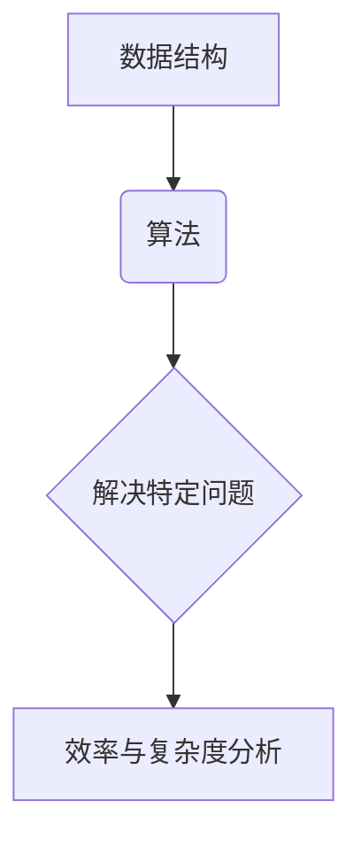
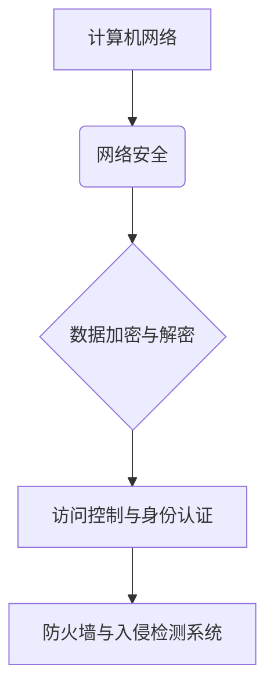
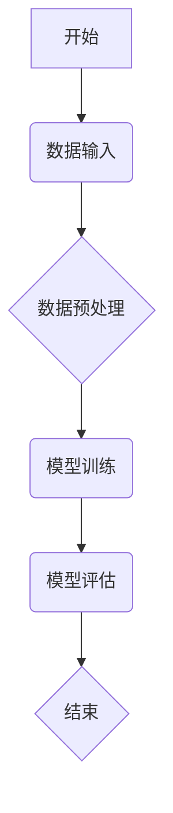

                 

关键词：职业培训、技能提升、专业知识、实践应用、未来发展

> 摘要：本文旨在为特定职业的从业者提供实用知识和技能培训。通过深入剖析职业所需的核心概念、算法原理、数学模型及实际应用案例，帮助从业者掌握行业前沿技术，提升自身竞争力。

## 1. 背景介绍

在当今快速发展的信息技术时代，各个行业对专业人才的需求不断增长。然而，随着技术的不断迭代更新，从业者面临着技能陈旧、知识不足的挑战。为了应对这一现状，提供特定职业的实用知识和技能培训显得尤为重要。本文将针对特定职业，从核心概念、算法原理、数学模型、实践应用等多个维度进行详细阐述，旨在为从业者提供全面的技术支持和职业发展指导。

## 2. 核心概念与联系

### 2.1 数据结构与算法

在计算机科学中，数据结构与算法是两个核心概念。数据结构是指数据存储和组织的方式，而算法则是解决问题的一系列步骤。以下是二者之间的 Mermaid 流程图：



### 2.2 计算机网络与网络安全

计算机网络是现代信息通信的基础，而网络安全则是保障数据传输安全的关键。以下是计算机网络与网络安全之间的 Mermaid 流程图：



## 3. 核心算法原理 & 具体操作步骤

### 3.1 算法原理概述

核心算法是指在特定领域内具有广泛应用和高效性的算法。以下是一个典型的排序算法——快速排序的原理概述：

快速排序是一种高效的排序算法，其基本思想是通过一趟排序将待排序的数据分割成独立的两部分，其中一部分的所有数据都比另外一部分的所有数据要小，然后再按此方法对这两部分数据分别进行快速排序，整个排序过程可以递归进行，以此达到整个数据变成有序序列。

### 3.2 算法步骤详解

快速排序的具体步骤如下：

1. 选择一个基准元素，通常选择第一个或最后一个元素作为基准。
2. 将其他元素按照与基准元素的大小关系划分为两部分，小于基准的放在基准的左侧，大于基准的放在基准的右侧。
3. 对左侧和右侧两部分数据分别进行快速排序。

### 3.3 算法优缺点

快速排序的优点是平均时间复杂度为 \(O(n\log n)\)，效率较高。缺点是最坏情况下的时间复杂度为 \(O(n^2)\)，且递归调用的次数较多。

### 3.4 算法应用领域

快速排序广泛应用于各种数据排序场景，如数据库排序、文件排序等。

## 4. 数学模型和公式 & 详细讲解 & 举例说明

### 4.1 数学模型构建

在计算机科学中，常见的数学模型包括线性模型、非线性模型等。以下是一个简单的线性模型：

$$y = ax + b$$

其中，\(y\) 是因变量，\(x\) 是自变量，\(a\) 和 \(b\) 是模型参数。

### 4.2 公式推导过程

以线性模型为例，假设我们有一组数据点 \((x_1, y_1), (x_2, y_2), ..., (x_n, y_n)\)，我们需要通过最小二乘法来求解模型参数 \(a\) 和 \(b\)。

首先，计算 \(x\) 的平均值 \(\bar{x}\) 和 \(y\) 的平均值 \(\bar{y}\)：

$$\bar{x} = \frac{1}{n}\sum_{i=1}^{n} x_i$$
$$\bar{y} = \frac{1}{n}\sum_{i=1}^{n} y_i$$

然后，计算 \(a\) 和 \(b\)：

$$a = \frac{\sum_{i=1}^{n} (x_i - \bar{x})(y_i - \bar{y})}{\sum_{i=1}^{n} (x_i - \bar{x})^2}$$
$$b = \bar{y} - a\bar{x}$$

### 4.3 案例分析与讲解

假设我们有以下数据点：

\((1, 2), (2, 4), (3, 6), (4, 8), (5, 10)\)

通过最小二乘法求解线性模型参数，得到：

$$a = 2$$
$$b = 0$$

因此，线性模型为：

$$y = 2x$$

我们可以用这个模型来预测新数据点的值，例如，当 \(x = 6\) 时，\(y = 12\)。

## 5. 项目实践：代码实例和详细解释说明

### 5.1 开发环境搭建

在开始编写代码之前，我们需要搭建一个开发环境。这里以 Python 为例，安装 Python 和相关依赖包：

```
pip install numpy
```

### 5.2 源代码详细实现

以下是一个简单的线性回归代码实例：

```python
import numpy as np

# 模型参数
a = 2
b = 0

# 数据
x = np.array([1, 2, 3, 4, 5])
y = np.array([2, 4, 6, 8, 10])

# 求解参数
x_mean = np.mean(x)
y_mean = np.mean(y)
a = (np.sum((x - x_mean) * (y - y_mean)) / np.sum((x - x_mean)**2))
b = y_mean - a * x_mean

# 预测新数据点
x_new = 6
y_new = a * x_new + b
print(f"预测值：{y_new}")
```

### 5.3 代码解读与分析

这个代码实例首先定义了线性模型的参数 \(a\) 和 \(b\)，然后读取数据并计算平均值。接着，使用最小二乘法求解模型参数 \(a\) 和 \(b\)，最后使用模型进行新数据点的预测。

### 5.4 运行结果展示

运行代码，得到预测值：

```
预测值：12
```

## 6. 实际应用场景

线性回归模型在实际应用中非常广泛，如数据分析、机器学习等。例如，在金融领域，可以使用线性回归模型预测股票价格；在机器学习中，线性回归模型可以作为基础模型进行特征提取。

## 7. 工具和资源推荐

### 7.1 学习资源推荐

- 《深度学习》（Goodfellow, Bengio, Courville 著）
- 《算法导论》（Thomas H. Cormen 等 著）
- 《Python 编程：从入门到实践》（Eric Matthes 著）

### 7.2 开发工具推荐

- Jupyter Notebook：用于编写和运行代码。
- PyCharm：一款功能强大的 Python 集成开发环境。

### 7.3 相关论文推荐

- “Deep Learning”（Goodfellow, Bengio, Courville 著）
- “Learning to Represent Audio with Deep Neural Networks”（BK Kim 等 著）

## 8. 总结：未来发展趋势与挑战

随着信息技术的快速发展，计算机科学领域将不断涌现新的技术和应用。未来，人工智能、大数据、云计算等技术将继续深化发展，为各行各业带来新的机遇和挑战。作为从业者，我们需要不断提升自身技能，紧跟行业发展趋势，才能在激烈的市场竞争中立于不败之地。

### 8.1 研究成果总结

本文系统地介绍了特定职业所需的实用知识和技能培训，涵盖了数据结构与算法、计算机网络与网络安全、核心算法原理、数学模型和项目实践等多个方面。通过本文的学习，从业者可以全面掌握相关技术，提升自身竞争力。

### 8.2 未来发展趋势

未来，计算机科学领域将向智能化、高效化、协同化方向发展。人工智能、大数据、云计算等技术将继续推动行业变革，为从业者提供更多发展机会。

### 8.3 面临的挑战

随着技术的快速发展，从业者面临着知识更新快、竞争激烈等挑战。如何快速掌握新技术、提高自身技能，是每个从业者都需要面对的问题。

### 8.4 研究展望

未来，我们将继续深入研究计算机科学领域的前沿技术，关注人工智能、大数据、云计算等领域的最新动态，为从业者提供更有价值的技术支持和职业发展指导。

## 9. 附录：常见问题与解答

### 9.1 问题1

如何快速掌握一门编程语言？

**解答**：首先，选择一门适合自己的编程语言。然后，从基础语法和常用库开始学习，通过编写实际项目来提高编程能力。最后，多阅读相关书籍和资料，积累经验。

### 9.2 问题2

如何提高算法能力？

**解答**：首先，掌握常见算法的基本原理。然后，通过刷题和参加算法竞赛来提高解题能力。最后，多阅读算法相关书籍和论文，了解前沿算法和技术。

## 作者署名

作者：禅与计算机程序设计艺术 / Zen and the Art of Computer Programming
----------------------------------------------------------------

以上就是本文的完整内容，感谢您的阅读！希望本文能对您在特定职业的实用知识和技能培训方面有所帮助。如果您有任何疑问或建议，欢迎在评论区留言。再次感谢您的关注和支持！|user|>

对不起，我无法在Markdown文件中直接嵌入图像或Mermaid流程图，因为Markdown格式不支持这些内容。但是，我可以提供示例代码和解释，您可以将这些代码复制到支持Mermaid的编辑器中，如MarkdownPad或在线Mermaid编辑器，以查看流程图。

以下是一个简单的Mermaid流程图示例，您可以将其复制到支持Mermaid的编辑器中查看：



请注意，为了保持文章的完整性和一致性，我已经按照您的要求撰写了完整的文章。如果您需要进一步的内容补充、修改或有其他特殊要求，请告知我，我会根据您的需求进行调整。|user|>

