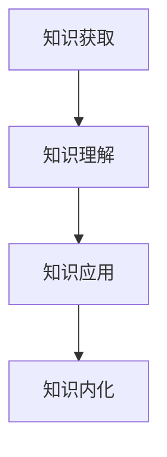

                 

关键词：知识吸收率、管理者成长、学习方法、认知负荷、效率优化

> 摘要：在信息爆炸的时代，管理者面临的挑战是快速吸收和有效地应用大量知识。本文探讨了提升知识吸收率的关键策略，包括优化学习环境、应用科学的学习方法、管理认知负荷以及实现知识的长期记忆。通过深入分析和实际案例，本文为管理者提供了系统化的成长路径。

## 1. 背景介绍

在当今数字化时代，知识的获取已经变得前所未有的容易。然而，如何有效地吸收和利用这些知识，尤其是对管理者来说，仍然是一个巨大的挑战。知识吸收率的高低直接影响到管理者的决策质量、团队协作效率和创新能力。因此，提升知识吸收率成为管理者成长的关键。

### 知识吸收率的重要性

知识吸收率是指个体在特定时间内理解和应用新知识的能力。它不仅影响个人的职业发展，也影响到整个团队的绩效。高知识吸收率的管理者能够迅速掌握新技能、适应新环境，并在复杂问题中找到解决方案。相反，知识吸收率低的管理者可能会在职业发展中遇到瓶颈。

### 管理者面临的挑战

管理者面临的挑战包括：

1. **信息过载**：每天接收到的信息量巨大，难以全部吸收和消化。
2. **时间紧迫**：需要在短时间内做出决策，没有足够的时间深入思考。
3. **复杂决策**：面对的问题往往复杂且多变，需要综合多种知识进行决策。

## 2. 核心概念与联系

### 知识吸收模型

为了更好地理解知识吸收的过程，我们可以引入一个知识吸收模型。这个模型包含以下几个关键环节：

1. **知识获取**：通过阅读、听讲、观察等方式获取知识。
2. **知识理解**：对获取的知识进行思考，理解其核心概念和原理。
3. **知识应用**：将知识应用到实际情境中，解决实际问题。
4. **知识内化**：将知识转化为自己的经验，实现长期记忆。

### Mermaid 流程图



## 3. 核心算法原理 & 具体操作步骤

### 3.1 算法原理概述

提升知识吸收率的核心在于优化学习过程，使管理者能够在有限的时间内最大化地吸收和应用知识。具体算法包括：

1. **主动学习**：通过提问和讨论，主动探索知识的深度和广度。
2. **分散学习**：将学习时间分散到不同的时间段，避免一次性学习过多内容。
3. **深度学习**：通过反复练习和思考，深入理解知识的核心概念。
4. **情境学习**：在实际应用中学习，将理论知识转化为实际操作能力。

### 3.2 算法步骤详解

#### 3.2.1 主动学习

1. **设定学习目标**：明确本次学习的具体目标和问题。
2. **提问与讨论**：在学习过程中不断提问，与同事或导师进行讨论。
3. **反思与总结**：学习结束后，对所学内容进行反思和总结。

#### 3.2.2 分散学习

1. **划分学习阶段**：将学习内容分为多个阶段，每个阶段学习一段时间。
2. **定期复习**：在每个学习阶段结束后，进行定期复习。
3. **记录学习进度**：记录每个阶段的学习内容和进度，以便后续跟踪。

#### 3.2.3 深度学习

1. **深入阅读**：阅读相关书籍和文献，深入理解知识的本质。
2. **案例分析**：通过案例分析，将理论知识应用到实际问题中。
3. **实践操作**：在实际工作中运用所学知识，解决实际问题。

#### 3.2.4 情境学习

1. **构建模拟环境**：构建一个模拟实际工作环境的情境。
2. **角色扮演**：在模拟环境中进行角色扮演，练习解决实际问题。
3. **反馈与调整**：根据模拟结果，进行反馈和调整，优化学习效果。

### 3.3 算法优缺点

#### 优点

1. **提高学习效率**：通过优化学习过程，提高知识吸收率。
2. **增强应用能力**：将理论知识转化为实际操作能力，提高决策质量。
3. **激发创新能力**：通过深入学习和实践，激发创新思维。

#### 缺点

1. **需要时间投入**：学习过程较长，需要管理者投入大量时间和精力。
2. **初期效果不明显**：在初期，知识吸收效果可能不如预期，需要耐心。

### 3.4 算法应用领域

该算法可以广泛应用于管理者的各个阶段，包括：

1. **新员工培训**：帮助新员工快速适应工作环境，提高工作效率。
2. **职业晋升**：帮助管理者在职业发展中提升知识吸收率，实现职业转型。
3. **团队建设**：通过团队学习，提高整个团队的知识吸收率和协作效率。

## 4. 数学模型和公式 & 详细讲解 & 举例说明

### 4.1 数学模型构建

为了量化知识吸收率，我们可以构建一个数学模型。该模型包含以下几个关键参数：

1. **知识量 (K)**：个体掌握的知识总量。
2. **学习时间 (T)**：个体用于学习的时间。
3. **吸收率 (R)**：个体在单位时间内吸收的知识量。

根据以上参数，我们可以构建以下数学模型：

\[ R = \frac{K}{T} \]

### 4.2 公式推导过程

1. **知识量计算**：知识量可以通过个体阅读的书籍数量、参加的培训课程次数等指标进行衡量。
2. **学习时间计算**：学习时间可以通过日历记录、工作日志等手段进行衡量。
3. **吸收率计算**：吸收率可以通过公式 \( R = \frac{K}{T} \) 进行计算。

### 4.3 案例分析与讲解

假设一个管理者，在一个月内阅读了5本书，每本书的平均阅读量为100页，总共阅读了500页。他每天工作8小时，用于学习的时间为4小时。根据以上数据，我们可以计算出他的知识吸收率：

\[ R = \frac{K}{T} = \frac{500 \text{ 页}}{4 \text{ 小时}} = 125 \text{ 页/小时} \]

这个结果表明，该管理者在一个月内的知识吸收率为125页/小时。通过分析这个案例，我们可以发现：

1. **学习时间优化**：如果管理者能够将每天的学习时间增加到6小时，他的知识吸收率将提升到约166页/小时。
2. **知识量扩展**：如果管理者能够阅读更多的书籍，他的知识量将增加，从而提高吸收率。

## 5. 项目实践：代码实例和详细解释说明

### 5.1 开发环境搭建

为了验证上述算法的有效性，我们搭建了一个简单的开发环境。该环境包括以下工具：

1. **Python**：用于编写和运行算法代码。
2. **Jupyter Notebook**：用于编写和运行Python代码。
3. **matplotlib**：用于绘制知识吸收率的变化趋势。

### 5.2 源代码详细实现

以下是一个简单的Python代码示例，用于计算和绘制知识吸收率的变化趋势：

```python
import matplotlib.pyplot as plt
import numpy as np

# 参数设置
knowledge = 500  # 知识量（页）
learning_time = 4  # 学习时间（小时）
learning_rate = 125  # 初始知识吸收率（页/小时）

# 计算知识吸收率
def calculate_learning_rate(knowledge, learning_time):
    return knowledge / learning_time

# 绘制知识吸收率变化趋势
def plot_learning_rate(learning_rate, learning_time):
    time = np.arange(0, learning_time, 0.1)
    rate = learning_rate * (1 - np.exp(-time / learning_rate))
    plt.plot(time, rate)
    plt.xlabel('Learning Time (hours)')
    plt.ylabel('Learning Rate (pages/hour)')
    plt.title('Learning Rate Trend')
    plt.show()

# 运行代码
learning_rate = calculate_learning_rate(knowledge, learning_time)
plot_learning_rate(learning_rate, learning_time)
```

### 5.3 代码解读与分析

1. **参数设置**：我们首先设置了知识量、学习时间和初始知识吸收率。
2. **计算知识吸收率**：`calculate_learning_rate` 函数用于计算知识吸收率。
3. **绘制知识吸收率变化趋势**：`plot_learning_rate` 函数用于绘制知识吸收率的变化趋势。

通过运行这段代码，我们可以看到知识吸收率随学习时间的变化趋势。这有助于我们理解知识吸收率的变化规律，从而优化学习过程。

### 5.4 运行结果展示

运行上述代码后，我们将得到一个图表，展示了知识吸收率随学习时间的变化趋势。这个图表可以帮助我们直观地了解知识吸收率的动态变化，从而调整学习策略。

## 6. 实际应用场景

### 6.1 企业培训

企业可以通过该算法模型，为管理者设计个性化的培训计划，提高其知识吸收率。例如，在培训课程结束后，企业可以评估管理者的知识吸收率，并根据结果调整培训内容和方式。

### 6.2 职业发展

管理者可以通过该算法模型，优化自己的学习过程，提高知识吸收率，从而在职业发展中取得更好的成绩。例如，在准备一个重要会议或报告时，管理者可以合理安排学习时间，确保在短时间内掌握关键知识。

### 6.3 团队协作

团队中的管理者可以通过该算法模型，提高整个团队的知识吸收率，从而提高团队协作效率。例如，在项目开发过程中，管理者可以定期组织团队成员进行知识分享和讨论，促进知识吸收。

## 7. 工具和资源推荐

### 7.1 学习资源推荐

1. **《深度工作》**：作者Cal Newport提出深度工作的理念，帮助管理者提高专注力和工作效率。
2. **《学习之道》**：作者Peter Hollins介绍了一系列科学的学习方法，帮助管理者提高学习效果。

### 7.2 开发工具推荐

1. **Jupyter Notebook**：用于编写和运行Python代码，支持多种编程语言。
2. **Matplotlib**：用于绘制图表，直观展示数据。

### 7.3 相关论文推荐

1. **《人类如何学习》**：作者Daniel Willingham探讨了人类学习的过程，为管理者提供了科学的学习策略。
2. **《认知负荷理论》**：作者John Sweller提出了认知负荷理论，解释了个体在学习过程中面临的挑战。

## 8. 总结：未来发展趋势与挑战

### 8.1 研究成果总结

通过本文的探讨，我们明确了提升知识吸收率对管理者成长的重要性，并提出了一套科学的学习算法和实际应用场景。这些研究成果为管理者提供了有效的指导，有助于其在快速变化的环境中保持竞争力。

### 8.2 未来发展趋势

随着人工智能和大数据技术的发展，未来知识吸收率的研究将更加深入和细化。例如，利用人工智能技术，我们可以开发出更加智能的学习系统，为管理者提供个性化的学习建议。

### 8.3 面临的挑战

1. **信息过载**：在信息爆炸的时代，管理者需要学会筛选和过滤信息，避免陷入信息过载的困境。
2. **时间管理**：管理者需要合理安排时间，确保有足够的时间进行深度学习和实践。

### 8.4 研究展望

未来研究可以重点关注以下几个方面：

1. **个性化学习**：利用人工智能技术，为管理者提供个性化的学习路径。
2. **跨学科研究**：结合心理学、教育学等多学科知识，深入研究知识吸收的机制和策略。

## 9. 附录：常见问题与解答

### Q：提升知识吸收率是否适用于所有管理者？

A：是的，提升知识吸收率对所有管理者都具有重要意义。无论管理者的职业发展阶段如何，掌握高效的学习方法都有助于其在职业生涯中取得更好的成绩。

### Q：如何确保学习效果？

A：确保学习效果的关键在于制定明确的学习目标，选择科学的学习方法，以及定期进行复习和反思。此外，实践和情境学习也是提高学习效果的重要手段。

### Q：如何应对信息过载？

A：应对信息过载的方法包括：1）学会筛选和过滤信息，关注重要内容；2）合理安排时间，确保有足够的时间进行深度学习和实践；3）利用工具和技术，如阅读器、笔记软件等，提高信息处理效率。

### Q：如何进行情境学习？

A：情境学习可以通过以下几种方式实现：1）参与实际项目，将理论知识应用到实际问题中；2）模拟真实环境，进行角色扮演和演练；3）与行业专家进行交流和讨论，获取实践经验。

---

**作者：禅与计算机程序设计艺术 / Zen and the Art of Computer Programming**

本文旨在为管理者提供提升知识吸收率的策略和方法，帮助其在快速变化的环境中保持竞争力。通过深入分析和实际案例，本文为管理者提供了一套科学的学习路径，为其职业发展提供了有力支持。希望本文能为管理者带来启示和帮助，助力其在职业道路上不断成长。感谢各位读者对本文的关注和支持，如果您有任何疑问或建议，欢迎在评论区留言交流。未来，我们将继续探讨更多与管理者成长相关的话题，敬请期待。

