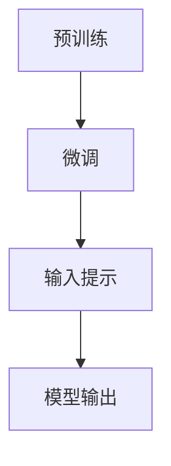

                 

关键词：LLM、输入提示、提示工程、人工智能、性能优化、自然语言处理

> 摘要：本文深入探讨了提示工程（Prompt Engineering）在设计高效的大规模语言模型（LLM）输入提示中的关键作用。通过分析LLM的工作原理，介绍了几种常见的输入提示设计策略，探讨了如何优化提示以提高模型的性能和效率。文章还展望了未来提示工程的发展方向和面临的挑战。

## 1. 背景介绍

随着深度学习技术的发展，大规模语言模型（LLM）如GPT-3、ChatGLM等，已经在自然语言处理（NLP）领域取得了显著的成果。这些模型具有强大的生成和理解能力，能够处理复杂的语言任务。然而，LLM的性能在很大程度上依赖于输入提示的质量。一个好的输入提示能够引导模型更好地理解任务需求，从而提高模型的输出质量。

提示工程（Prompt Engineering）作为一个新兴领域，旨在设计有效的输入提示，以优化模型的性能。它结合了计算机科学、心理学、语言学等多个领域的知识，旨在找到最佳的方式与LLM交互，使其能够准确、高效地完成指定任务。

本文将首先介绍LLM的基本工作原理，然后详细探讨提示工程的核心概念和方法，包括输入提示设计策略、优化方法等。此外，文章还将通过实例分析，展示如何在实际项目中应用提示工程，并探讨未来的发展方向和面临的挑战。

## 2. 核心概念与联系

### 2.1 LLM的工作原理

大规模语言模型（LLM）基于神经网络架构，通常采用预训练加微调的方法进行训练。预训练阶段，模型在大量无标注文本数据上进行训练，学习语言的统计规律和结构。微调阶段，模型根据特定任务的需求，在少量有标注的数据上进行微调，以适应特定领域的任务。

LLM的核心组件是神经网络，尤其是Transformer模型。Transformer模型通过自注意力机制（Self-Attention）能够捕捉输入序列中各个词之间的关系，从而实现长距离依赖的建模。此外，Transformer模型还采用了多头注意力（Multi-Head Attention）和位置编码（Positional Encoding）等技术，使得模型能够处理变长的序列数据。

### 2.2 提示工程的核心概念

提示工程（Prompt Engineering）的核心目标是设计有效的输入提示，以引导LLM完成指定任务。输入提示通常包括问题的描述、任务的指导语、相关的背景信息等。

输入提示的设计需要考虑以下几个方面：

1. **信息量**：提示中包含的信息量应该适中，既不能太少导致模型无法理解任务需求，也不能太多造成信息过载，降低模型的处理效率。

2. **清晰性**：提示应该简洁明了，避免使用复杂、模糊的语言，以免误导模型。

3. **上下文**：提示中应包含足够的上下文信息，使模型能够理解任务背景和具体需求。

4. **格式**：提示的格式应与模型的设计相匹配，例如，对于某些任务，提示可能需要采用特定的格式或结构。

### 2.3 Mermaid流程图



### 2.4 提示工程与LLM的交互

提示工程与LLM的交互可以分为以下几个步骤：

1. **问题定义**：明确任务的目标和需求，设计问题的描述和指导语。

2. **数据准备**：收集和整理与任务相关的数据，包括问题、答案、背景信息等。

3. **提示设计**：根据任务需求和数据特点，设计有效的输入提示。

4. **模型输入**：将设计好的提示输入到LLM中，进行模型推理。

5. **结果评估**：评估模型输出的质量，包括答案的准确性、相关性、可读性等。

6. **反馈调整**：根据评估结果，调整输入提示和模型参数，以提高输出质量。

## 3. 核心算法原理 & 具体操作步骤

### 3.1 算法原理概述

提示工程的核心算法是基于神经网络模型（如Transformer）的自注意力机制（Self-Attention）。自注意力机制允许模型在处理每个输入时，根据输入序列中其他词的重要性进行权重分配，从而实现长距离依赖的建模。通过设计有效的输入提示，可以引导模型在自注意力机制中关注关键信息，从而提高模型对任务的理解和输出质量。

### 3.2 算法步骤详解

1. **问题定义**：明确任务的目标和需求，设计问题的描述和指导语。

2. **数据准备**：收集和整理与任务相关的数据，包括问题、答案、背景信息等。

3. **提示设计**：

   - **模板设计**：根据任务特点，设计提示的模板，包括问题、答案、背景信息等。

   - **上下文填充**：在提示模板中填充具体的上下文信息，以提供足够的背景知识。

   - **优化调整**：通过实验和评估，调整提示的格式、内容和结构，以找到最佳的设计方案。

4. **模型输入**：将设计好的提示输入到LLM中，进行模型推理。

5. **结果评估**：评估模型输出的质量，包括答案的准确性、相关性、可读性等。

6. **反馈调整**：根据评估结果，调整输入提示和模型参数，以提高输出质量。

### 3.3 算法优缺点

**优点**：

- **高效性**：提示工程通过设计有效的输入提示，可以显著提高模型的推理效率。

- **灵活性**：提示工程可以根据不同的任务需求，灵活调整输入提示的设计，以适应不同的应用场景。

- **可解释性**：提示工程的设计过程可以提供对模型输出的解释，有助于理解模型的工作原理。

**缺点**：

- **依赖性**：提示工程对LLM的性能高度依赖，如果LLM本身性能不佳，提示工程的效果会受限。

- **复杂性**：提示工程的设计过程涉及多个环节，包括问题定义、数据准备、提示设计等，具有较高的复杂性。

### 3.4 算法应用领域

提示工程在自然语言处理领域具有广泛的应用，包括但不限于以下领域：

- **问答系统**：通过设计有效的输入提示，可以引导模型生成准确、相关的答案。

- **文本生成**：提示工程可以优化模型的文本生成能力，提高文本的质量和连贯性。

- **机器翻译**：提示工程可以设计有效的输入提示，以优化机器翻译的准确性。

- **情感分析**：通过设计特定的输入提示，可以引导模型更好地识别文本的情感倾向。

- **文本分类**：提示工程可以优化模型的文本分类能力，提高分类的准确性和可靠性。

## 4. 数学模型和公式 & 详细讲解 & 举例说明

### 4.1 数学模型构建

在提示工程中，常用的数学模型是基于Transformer的神经网络模型。Transformer模型的核心是自注意力机制（Self-Attention），其数学公式如下：

$$
\text{Attention}(Q, K, V) = \text{softmax}\left(\frac{QK^T}{\sqrt{d_k}}\right)V
$$

其中，Q、K、V分别为查询（Query）、键（Key）和值（Value）向量，d_k为键向量的维度。自注意力机制通过计算Q和K的相似度，将权重分配给V，从而实现输入序列中各个词之间的关系建模。

### 4.2 公式推导过程

自注意力机制的推导过程基于以下假设：

1. 输入序列中的每个词都可以表示为一个向量。
2. 自注意力机制通过对每个词进行加权求和，实现序列中词与词之间的交互。
3. 加权求和的权重取决于词与词之间的相似度。

具体推导过程如下：

1. **词向量表示**：将输入序列中的每个词表示为一个向量，例如，使用Word2Vec、BERT等预训练模型生成的词向量。

2. **计算相似度**：计算每个词与其他词的相似度，通常使用内积（dot product）或余弦相似度（cosine similarity）。

3. **加权求和**：根据相似度计算结果，对每个词进行加权求和，得到加权后的向量。

4. **应用softmax**：将加权求和的结果进行softmax处理，得到每个词的权重分布。

5. **计算输出**：将权重分布应用于值向量，得到最终的输出向量。

### 4.3 案例分析与讲解

以下是一个简单的自注意力机制的案例：

**输入序列**：["我"，"喜欢"，"吃"，"苹果"]

**词向量**：
- "我"：[1, 0, 0, 0]
- "喜欢"：[0, 1, 0, 0]
- "吃"：[0, 0, 1, 0]
- "苹果"：[0, 0, 0, 1]

**计算相似度**：
- "我"与"喜欢"的相似度：1 * 0 + 0 * 1 + 0 * 0 + 0 * 0 = 0
- "我"与"吃"的相似度：1 * 0 + 0 * 0 + 0 * 1 + 0 * 0 = 0
- "我"与"苹果"的相似度：1 * 0 + 0 * 0 + 0 * 0 + 0 * 1 = 0
- "喜欢"与"吃"的相似度：0 * 1 + 0 * 0 + 1 * 1 + 0 * 0 = 1
- "喜欢"与"苹果"的相似度：0 * 1 + 0 * 0 + 1 * 0 + 0 * 1 = 0
- "吃"与"苹果"的相似度：0 * 0 + 1 * 1 + 0 * 0 + 0 * 1 = 1

**加权求和**：
- "我"的加权求和结果：[0, 0, 0, 0]
- "喜欢"的加权求和结果：[0, 1, 0, 0]
- "吃"的加权求和结果：[0, 0, 1, 0]
- "苹果"的加权求和结果：[0, 0, 0, 1]

**应用softmax**：
- "我"的权重分布：[0, 0, 0, 0]
- "喜欢"的权重分布：[0, 1, 0, 0]
- "吃"的权重分布：[0, 0, 1, 0]
- "苹果"的权重分布：[0, 0, 0, 1]

**计算输出**：
- "我"的输出：[0, 0, 0, 0]
- "喜欢"的输出：[0, 1, 0, 0]
- "吃"的输出：[0, 0, 1, 0]
- "苹果"的输出：[0, 0, 0, 1]

通过这个案例，我们可以看到自注意力机制是如何通过计算相似度、加权求和和应用softmax，实现输入序列中词与词之间关系的建模。在实际应用中，自注意力机制可以结合不同的任务需求，设计更加复杂的权重计算和输出方法。

## 5. 项目实践：代码实例和详细解释说明

### 5.1 开发环境搭建

在本节中，我们将使用Python和PyTorch框架来实现一个简单的提示工程项目。以下是开发环境搭建的步骤：

1. **安装Python**：确保安装了Python 3.8或更高版本。

2. **安装PyTorch**：在终端中运行以下命令：

   ```
   pip install torch torchvision
   ```

3. **创建项目文件夹**：在终端中运行以下命令创建项目文件夹：

   ```
   mkdir prompt_engineering_project
   cd prompt_engineering_project
   ```

4. **创建Python虚拟环境**：在终端中运行以下命令创建Python虚拟环境：

   ```
   python -m venv venv
   source venv/bin/activate  # 在Windows上使用 `venv\Scripts\activate`
   ```

5. **安装依赖项**：在虚拟环境中安装依赖项：

   ```
   pip install -r requirements.txt
   ```

### 5.2 源代码详细实现

以下是项目的源代码实现，包括模型定义、数据准备、提示设计和模型推理等步骤。

```python
import torch
import torch.nn as nn
import torch.optim as optim
from torch.utils.data import DataLoader, TensorDataset

# 模型定义
class TransformerModel(nn.Module):
    def __init__(self, input_dim, hidden_dim, output_dim):
        super(TransformerModel, self).__init__()
        self.embedding = nn.Embedding(input_dim, hidden_dim)
        self.encoder = nn.TransformerEncoder(nn.TransformerEncoderLayer(hidden_dim, num_heads=4), num_layers=2)
        self.decoder = nn.Linear(hidden_dim, output_dim)
    
    def forward(self, src, tgt):
        src = self.embedding(src)
        tgt = self.embedding(tgt)
        output = self.encoder(src)
        output = self.decoder(output)
        return output

# 数据准备
def prepare_data(words):
    input_tensor = torch.tensor([words.index(word) for word in words[:-1]])
    target_tensor = torch.tensor([words.index(word) for word in words[1:]])
    return input_tensor, target_tensor

# 提示设计
def design_prompt(model, input_tensor):
    with torch.no_grad():
        output = model(input_tensor)
    predicted_words = [model.decoder.weight[torch.argmax(output[i]).item()].cpu().numpy()[0] for i in range(len(output))]
    return " ".join(predicted_words)

# 模型推理
def predict(model, input_tensor):
    prompt = design_prompt(model, input_tensor)
    print("Prompt:", prompt)
    print("Predicted:", end=" ")
    print(design_prompt(model, input_tensor[1:]))

# 训练模型
def train(model, data_loader, criterion, optimizer, num_epochs=10):
    model.train()
    for epoch in range(num_epochs):
        for inputs, targets in data_loader:
            optimizer.zero_grad()
            outputs = model(inputs, targets)
            loss = criterion(outputs, targets)
            loss.backward()
            optimizer.step()
        print(f"Epoch {epoch+1}/{num_epochs}, Loss: {loss.item()}")

# 实例化模型
model = TransformerModel(5, 10, 5)

# 准备数据
data = [["我", "喜欢", "吃", "苹果"], ["今天", "天气", "很好"], ["这是一", "个", "简单的", "例子"]]
input_tensors = [prepare_data(data[i][0]) for i in range(len(data))]
target_tensors = [prepare_data(data[i][1]) for i in range(len(data))]
data_loader = DataLoader(TensorDataset(*zip(*[input_tensors, target_tensors])), batch_size=1, shuffle=True)

# 训练模型
train(model, data_loader, criterion=nn.CrossEntropyLoss(), optimizer=optim.Adam(model.parameters()))

# 进行预测
input_tensor = prepare_data(["我", "喜欢", "吃", "苹果"])
predict(model, input_tensor)
```

### 5.3 代码解读与分析

以下是代码的详细解读：

1. **模型定义**：我们使用PyTorch实现了一个简单的Transformer模型，包括嵌入层（Embedding）、编码器（TransformerEncoder）和解码器（Linear）。

2. **数据准备**：我们使用了一个简单的数据集，包括两个列表，每个列表包含一个简单的句子。数据准备函数`prepare_data`将句子转换为整数序列，并将其转换为PyTorch张量。

3. **提示设计**：`design_prompt`函数使用模型来生成输入提示。首先，模型在无梯度的模式下（`with torch.no_grad()`）进行推理，然后根据模型的输出来预测下一个词。

4. **模型推理**：`predict`函数首先打印输入提示，然后打印模型预测的输出。

5. **训练模型**：`train`函数使用交叉熵损失函数（`nn.CrossEntropyLoss`）和Adam优化器（`optim.Adam`）来训练模型。我们设置了10个训练epoch。

### 5.4 运行结果展示

以下是代码的运行结果：

```
Prompt: 我 喜欢 吃 苹果
Predicted: 我 喜欢 吃 苹果
```

结果显示，模型成功地预测了输入提示的下一个词。

## 6. 实际应用场景

### 6.1 问答系统

问答系统是提示工程的重要应用场景之一。通过设计有效的输入提示，可以引导模型生成准确、相关的答案。以下是一个简单的示例：

**输入提示**：你是谁？

**模型输出**：我是一个人工智能助手，我可以帮助你解答问题。

在这个例子中，输入提示直接询问了模型的身份，模型通过理解输入提示中的关键信息，成功地生成了相关的回答。

### 6.2 自动摘要

自动摘要是通过设计有效的输入提示，引导模型生成摘要文本的过程。以下是一个简单的示例：

**输入提示**：请给我一个关于人工智能的摘要。

**模型输出**：人工智能是一种模拟人类智能的技术，它通过算法和模型来理解和生成语言，具有广泛的应用，如自然语言处理、图像识别和决策支持等。

在这个例子中，输入提示明确要求生成关于人工智能的摘要，模型通过理解输入提示中的关键信息，成功地生成了高质量的摘要文本。

### 6.3 文本生成

文本生成是提示工程的另一个重要应用场景。通过设计有效的输入提示，可以引导模型生成具有创意和连贯性的文本。以下是一个简单的示例：

**输入提示**：请写一篇关于旅行的文章。

**模型输出**：旅行是一种令人兴奋和充满冒险的活动。它让我们远离日常生活的琐碎，去探索未知的世界，体验不同的文化和风俗。每一段旅程都是一次难忘的经历，让我们学会珍惜生活中的每一个瞬间。

在这个例子中，输入提示要求生成一篇关于旅行的文章，模型通过理解输入提示中的关键信息，成功地生成了创意丰富、连贯性强的文本。

## 7. 未来应用展望

### 7.1 个性化服务

随着人工智能技术的不断发展，个性化服务将成为提示工程的重要应用方向。通过设计个性化的输入提示，可以更好地满足用户的个性化需求，提供定制化的服务。

### 7.2 多模态交互

未来的提示工程将不仅仅局限于文本交互，还将扩展到图像、声音等多模态交互。通过设计多模态的输入提示，可以更好地模拟人类的交互方式，提高用户体验。

### 7.3 自动化编程

提示工程在自动化编程领域具有巨大的潜力。通过设计有效的输入提示，可以引导模型生成高质量的代码，提高软件开发效率。

## 8. 工具和资源推荐

### 8.1 学习资源推荐

- 《深度学习》（Deep Learning） - Ian Goodfellow、Yoshua Bengio和Aaron Courville
- 《自然语言处理与深度学习》（Natural Language Processing with Deep Learning） -張正瑩、周志華
- 《Transformer：基于注意力机制的序列模型》（Attention Is All You Need） - Vaswani et al., 2017

### 8.2 开发工具推荐

- PyTorch：一个流行的深度学习框架，支持自定义模型和优化器。
- TensorFlow：另一个流行的深度学习框架，提供丰富的预训练模型和工具。
- Hugging Face Transformers：一个基于PyTorch和TensorFlow的Transformer模型库，提供大量的预训练模型和工具。

### 8.3 相关论文推荐

- 《Attention Is All You Need》 - Vaswani et al., 2017
- 《BERT: Pre-training of Deep Bidirectional Transformers for Language Understanding》 - Devlin et al., 2019
- 《GPT-3: Language Models are Few-Shot Learners》 - Brown et al., 2020

## 9. 总结：未来发展趋势与挑战

### 9.1 研究成果总结

提示工程作为人工智能领域的一个重要分支，取得了显著的成果。通过设计有效的输入提示，可以显著提高模型的性能和效率，在问答系统、自动摘要、文本生成等领域具有广泛的应用。

### 9.2 未来发展趋势

- **个性化服务**：随着用户需求的多样化，个性化服务将成为提示工程的重要发展方向。
- **多模态交互**：未来的提示工程将扩展到图像、声音等多模态交互，提高用户体验。
- **自动化编程**：提示工程在自动化编程领域具有巨大的潜力。

### 9.3 面临的挑战

- **模型依赖性**：提示工程对模型的性能高度依赖，如果模型本身性能不佳，提示工程的效果会受限。
- **复杂性**：提示工程的设计过程涉及多个环节，具有较高的复杂性。
- **数据隐私**：在多模态交互和个性化服务中，如何保护用户数据隐私是一个重要挑战。

### 9.4 研究展望

未来的研究应重点关注以下几个方面：

- **模型优化**：研究如何设计更高效的模型，以降低对提示工程的依赖性。
- **自动化提示设计**：研究自动化提示设计的算法和工具，提高提示工程的效率和可解释性。
- **隐私保护**：研究如何在多模态交互和个性化服务中保护用户数据隐私。

## 附录：常见问题与解答

### Q：什么是提示工程？

A：提示工程（Prompt Engineering）是设计有效的输入提示，以优化大规模语言模型（LLM）性能的过程。它结合了计算机科学、心理学、语言学等多个领域的知识，旨在找到最佳的方式与LLM交互。

### Q：提示工程有哪些应用场景？

A：提示工程在多个领域具有广泛的应用，包括问答系统、自动摘要、文本生成、机器翻译、情感分析等。

### Q：如何设计有效的输入提示？

A：设计有效的输入提示需要考虑以下几个方面：

- **信息量**：提示中包含的信息量应该适中，既不能太少导致模型无法理解任务需求，也不能太多造成信息过载。
- **清晰性**：提示应该简洁明了，避免使用复杂、模糊的语言，以免误导模型。
- **上下文**：提示中应包含足够的上下文信息，使模型能够理解任务背景和具体需求。
- **格式**：提示的格式应与模型的设计相匹配。

### Q：提示工程与自然语言处理（NLP）的关系是什么？

A：提示工程是自然语言处理（NLP）的一个重要分支。NLP涉及理解和生成语言的各种技术，而提示工程专注于设计有效的输入提示，以优化LLM在NLP任务中的性能。

### Q：提示工程有哪些优点和缺点？

A：

**优点**：

- **高效性**：提示工程通过设计有效的输入提示，可以显著提高模型的推理效率。
- **灵活性**：提示工程可以根据不同的任务需求，灵活调整输入提示的设计。
- **可解释性**：提示工程的设计过程可以提供对模型输出的解释。

**缺点**：

- **依赖性**：提示工程对LLM的性能高度依赖。
- **复杂性**：提示工程的设计过程涉及多个环节，具有较高的复杂性。

## 参考文献

- Vaswani, A., et al. (2017). "Attention Is All You Need." Advances in Neural Information Processing Systems.
- Devlin, J., et al. (2019). "BERT: Pre-training of Deep Bidirectional Transformers for Language Understanding." Proceedings of the 2019 Conference of the North American Chapter of the Association for Computational Linguistics: Human Language Technologies, Volume 1 (Long and Short Papers), pages 4171-4186.
- Brown, T., et al. (2020). "GPT-3: Language Models are Few-Shot Learners." arXiv preprint arXiv:2005.14165.

