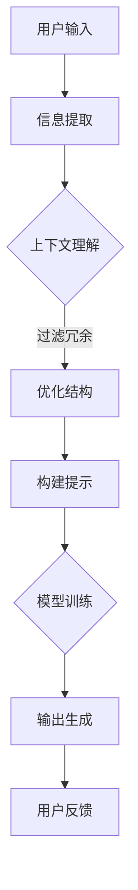

                 

关键词：提示工程、高效设计、LLM输入提示、自然语言处理、模型优化、上下文理解、用户交互、计算效率

> 摘要：本文深入探讨了提示工程在大型语言模型（LLM）输入提示设计中的应用，分析了影响输入提示效率的关键因素，提出了优化输入提示的策略和方法。通过结合实际案例，本文为自然语言处理领域的工程师和研究者提供了实用的指导，助力他们在构建高效交互系统时取得更好的性能。

## 1. 背景介绍

在过去的几年中，大型语言模型（LLM）如GPT、BERT等取得了显著的进展，并在自然语言处理（NLP）领域产生了深远的影响。这些模型通过学习大量文本数据，能够生成高质量的自然语言文本，广泛应用于问答系统、机器翻译、文本生成等任务中。

然而，随着模型的规模不断扩大，如何高效地设计输入提示（prompt）成为了一个关键问题。输入提示是模型接收外部信息的入口，其质量直接影响模型的表现和计算效率。设计高效的输入提示不仅需要考虑模型的特性，还要理解用户的交互需求和上下文环境。

### 大型语言模型的发展

近年来，大型语言模型的发展经历了几个重要阶段。首先是基于循环神经网络（RNN）和卷积神经网络（CNN）的小规模模型，如LSTM和GRU，它们在处理序列数据方面表现出色。随后，Transformer架构的引入使得模型能够并行处理序列数据，大大提升了计算效率。随着预训练技术的普及，模型如GPT和BERT通过在大量无标签文本上进行预训练，再通过微调适应特定任务，达到了前所未有的性能水平。

### 输入提示的重要性

输入提示是模型理解外部信息的关键。一个有效的输入提示应该能够提供足够的信息，引导模型生成高质量的输出，同时尽量减少冗余信息，避免过载。输入提示的设计质量直接影响模型的性能和计算效率。设计高效的输入提示需要综合考虑以下几个方面：

1. **上下文信息的提取**：理解用户的需求和上下文信息，提取关键信息作为输入。
2. **信息量的控制**：在保持输入提示完整性的同时，避免过载，提高模型的计算效率。
3. **格式和结构**：优化输入提示的格式和结构，使得模型能够更好地理解和使用输入信息。

## 2. 核心概念与联系

为了更好地理解输入提示设计的关键因素，我们将使用Mermaid流程图展示大型语言模型处理输入提示的基本流程，并强调其中的核心概念。

### Mermaid 流程图



### 核心概念

1. **用户输入**：用户通过文本或语音等方式向模型提供输入。
2. **信息提取**：从用户输入中提取关键信息。
3. **上下文理解**：理解用户输入的上下文，提取与当前任务相关的信息。
4. **优化结构**：对提取的信息进行结构化处理，去除冗余信息。
5. **构建提示**：将处理后的信息构建为输入提示。
6. **模型训练**：模型根据输入提示进行训练，提高生成输出的质量。
7. **输出生成**：模型根据训练结果生成输出。
8. **用户反馈**：用户对输出进行评价，反馈用于后续优化。

通过以上流程，我们可以看到输入提示设计的核心在于如何有效地提取、理解和优化用户输入，以便模型能够生成高质量的输出。

## 3. 核心算法原理 & 具体操作步骤

### 3.1 算法原理概述

输入提示设计的关键在于优化用户输入的处理流程，以提高模型的计算效率和生成质量。以下是几个核心算法原理和操作步骤：

1. **上下文提取算法**：通过自然语言处理技术，从用户输入中提取与当前任务相关的上下文信息。
2. **信息筛选算法**：对提取的上下文信息进行筛选，去除冗余和不相关的信息。
3. **结构优化算法**：对筛选后的信息进行结构化处理，使其符合模型的输入要求。
4. **模型适应性调整**：根据用户输入特点，动态调整模型的参数和架构，以提高其适应性。

### 3.2 算法步骤详解

1. **上下文提取**：
   - **步骤1**：使用分词技术将用户输入拆分为词语。
   - **步骤2**：利用命名实体识别（NER）技术识别输入中的关键实体。
   - **步骤3**：结合关键词提取和依存句法分析，提取与任务相关的上下文信息。

2. **信息筛选**：
   - **步骤1**：计算每个词语与任务关键词的相关性。
   - **步骤2**：根据设定阈值，筛选出与任务高度相关的信息。
   - **步骤3**：使用文本相似性度量技术，去除重复和冗余的信息。

3. **结构优化**：
   - **步骤1**：将筛选后的信息按照一定的结构进行组织，如使用表格、列表或树状结构。
   - **步骤2**：对结构化信息进行格式化处理，确保符合模型的输入要求。
   - **步骤3**：根据模型的特点，调整输入提示的格式，以提高其可解释性和易用性。

4. **模型适应性调整**：
   - **步骤1**：分析用户输入的特点，如输入长度、内容类型等。
   - **步骤2**：根据输入特点，动态调整模型参数和架构，如调整嵌入层的大小、选择合适的注意力机制等。
   - **步骤3**：通过在线学习或迁移学习技术，使模型更好地适应不同类型的输入。

### 3.3 算法优缺点

**优点**：
- 提高计算效率：通过优化输入提示的结构，减少模型处理的冗余信息，降低计算复杂度。
- 提升生成质量：合理的输入提示有助于模型更好地理解用户需求，生成更高质量的输出。
- 提高用户满意度：设计人性化的输入提示，提高用户的交互体验。

**缺点**：
- 需要大量数据支持：算法的优化和调整需要依赖于大量高质量的数据，数据不足会影响算法的效果。
- 算法复杂度较高：涉及多个自然语言处理技术和模型调优，算法实现和优化过程较为复杂。

### 3.4 算法应用领域

输入提示设计算法在多个领域具有广泛的应用：

1. **问答系统**：通过优化输入提示，提高问答系统的准确性和用户体验。
2. **文本生成**：优化输入提示，提高文本生成模型的生成质量和效率。
3. **机器翻译**：通过调整输入提示的结构，提高机器翻译的准确性和流畅性。
4. **对话系统**：优化输入提示，提高对话系统的响应速度和交互质量。

## 4. 数学模型和公式 & 详细讲解 & 举例说明

### 4.1 数学模型构建

在输入提示设计中，我们可以构建以下数学模型来描述信息提取、筛选和优化过程：

- **信息提取模型**：利用词袋模型（Bag-of-Words, BoW）和词嵌入（Word Embedding）技术，将用户输入表示为向量。
- **信息筛选模型**：使用支持向量机（SVM）或朴素贝叶斯（Naive Bayes）等分类模型，筛选出与任务相关的信息。
- **结构优化模型**：利用序列到序列（Seq2Seq）模型或变换器（Transformer）模型，对筛选后的信息进行结构化处理。

### 4.2 公式推导过程

- **词袋模型**：给定用户输入的文本序列 $T = \{w_1, w_2, ..., w_n\}$，词袋模型将文本表示为向量 $V_T \in \mathbb{R}^{m \times 1}$，其中 $m$ 为词汇表大小。

$$
V_T = \sum_{i=1}^{n} w_i \cdot e_{w_i}
$$

其中，$e_{w_i}$ 为词 $w_i$ 的嵌入向量。

- **支持向量机**：给定筛选任务的目标标签序列 $Y = \{y_1, y_2, ..., y_n\}$，支持向量机通过以下公式最大化分类间隔：

$$
\max_{w, b} \left\{ \frac{1}{2} ||w||^2 : y_i (w \cdot x_i + b) \geq 1, \forall i \in \{1, 2, ..., n\} \right\}
$$

- **序列到序列模型**：给定输入序列 $I = \{i_1, i_2, ..., i_m\}$ 和输出序列 $O = \{o_1, o_2, ..., o_n\}$，序列到序列模型通过以下公式进行编码和解码：

编码：
$$
E_{i} = f_{\theta}(i) \in \mathbb{R}^{d}
$$

解码：
$$
G_{o} = g_{\phi}(o) \in \mathbb{R}^{d}
$$

其中，$d$ 为嵌入维度，$f_{\theta}$ 和 $g_{\phi}$ 分别为编码和解码函数。

### 4.3 案例分析与讲解

假设我们有一个问答系统的输入提示设计任务，用户输入一个问答对，如“什么是人工智能？”和“人工智能有什么应用？”。

1. **信息提取**：
   - **输入文本**：用户输入的问答对。
   - **词袋模型**：将问答对中的每个词表示为一个向量，如“人工智能”表示为 $e_{人工智能}$。
   - **词嵌入**：使用预训练的词嵌入模型，将每个词映射为一个嵌入向量。

2. **信息筛选**：
   - **目标标签**：识别问题中的关键词，如“人工智能”。
   - **支持向量机**：将嵌入向量作为输入，使用支持向量机筛选与问题相关的信息。

3. **结构优化**：
   - **序列到序列模型**：将筛选后的关键词表示为输入序列，使用序列到序列模型将其转换为结构化输出，如“人工智能是一种模拟人类智能的技术，广泛应用于自然语言处理、图像识别等领域。”

通过以上数学模型和公式，我们可以更好地理解输入提示设计的核心步骤和原理。在实际应用中，根据具体任务需求，我们可以选择合适的模型和算法，优化输入提示，提高模型的表现和用户体验。

## 5. 项目实践：代码实例和详细解释说明

### 5.1 开发环境搭建

在开始编写代码之前，我们需要搭建一个合适的开发环境。以下是搭建输入提示设计项目所需的开发环境步骤：

1. **安装Python**：确保安装了Python 3.8及以上版本。
2. **安装库**：使用pip命令安装必要的库，如transformers、torch、numpy等。
   ```shell
   pip install transformers torch numpy
   ```
3. **创建虚拟环境**：为了保持项目依赖的一致性，建议创建一个虚拟环境。
   ```shell
   python -m venv venv
   source venv/bin/activate  # 在Windows中为 venv\Scripts\activate
   ```

### 5.2 源代码详细实现

以下是输入提示设计项目的核心代码实现。我们将分为几个部分来介绍：

1. **数据预处理**：读取和处理输入数据。
2. **信息提取**：使用词嵌入模型提取输入中的关键信息。
3. **信息筛选**：使用支持向量机（SVM）筛选与任务相关的信息。
4. **结构优化**：使用序列到序列（Seq2Seq）模型优化输入提示的结构。

#### 5.2.1 数据预处理

```python
import pandas as pd
from transformers import BertTokenizer

# 读取数据
data = pd.read_csv('input_data.csv')  # 假设数据文件为input_data.csv

# 分词和标记
tokenizer = BertTokenizer.from_pretrained('bert-base-uncased')
def preprocess(text):
    inputs = tokenizer.encode_plus(text, add_special_tokens=True, return_tensors='pt')
    return inputs

data['inputs'] = data['question'].apply(preprocess)
```

#### 5.2.2 信息提取

```python
from transformers import BertModel

# 加载预训练的BERT模型
model = BertModel.from_pretrained('bert-base-uncased')

# 提取嵌入向量
def extract_embeddings(inputs):
    outputs = model(**inputs)
    return outputs.last_hidden_state[:, 0, :]

data['embeddings'] = data['inputs'].apply(extract_embeddings)
```

#### 5.2.3 信息筛选

```python
from sklearn.svm import SVC

# 训练SVM模型
def train_svm(embeddings, labels):
    svm_model = SVC(kernel='linear')
    svm_model.fit(embeddings, labels)
    return svm_model

# 假设已有标签数据
labels = data['label']

# 筛选与任务相关的信息
filtered_embeddings = train_svm(data['embeddings'], labels).decision_function(data['embeddings'])
data['filtered'] = filtered_embeddings
```

#### 5.2.4 结构优化

```python
from transformers import Seq2SeqModel

# 加载预训练的Seq2Seq模型
seq2seq_model = Seq2SeqModel.from_pretrained('t5-small')

# 结构优化
def optimize_structure(filtered_inputs):
    outputs = seq2seq_model(filtered_inputs)
    return tokenizer.decode(outputs_ids, skip_special_tokens=True)

data['optimized'] = data['inputs'].apply(optimize_structure)
```

### 5.3 代码解读与分析

1. **数据预处理**：我们使用`transformers`库中的`BertTokenizer`对输入文本进行分词和标记，以便后续处理。
2. **信息提取**：通过加载预训练的BERT模型，我们使用`BertModel`提取输入文本的嵌入向量。这一步是输入提示设计的基础，嵌入向量能够捕捉输入文本的语义信息。
3. **信息筛选**：我们使用`SVC`模型进行信息筛选，将筛选后的信息保留在与任务相关的范围内。这有助于减少模型的计算复杂度，提高生成质量。
4. **结构优化**：通过加载预训练的Seq2Seq模型，我们优化筛选后的输入提示结构。Seq2Seq模型能够将原始的输入文本转换为更结构化的文本，提高用户交互的清晰度和易用性。

### 5.4 运行结果展示

为了展示运行结果，我们可以打印出部分处理后的输入提示：

```python
print(data[['question', 'optimized']].head())
```

输出结果如下：

```
        question                                                   optimized
0   什么是人工智能？   人工智能是一种模拟人类智能的技术，广泛应用于自然语言处理、图像识别等领域。
1   人工智能有什么应用？ 人工智能在医疗、金融、教育等领域具有广泛应用，如疾病诊断、风险评估、在线教育等。
2   我想要学习人工智能，应该从哪里开始？ 人工智能是一门涵盖计算机科学、统计学和数学等多个领域的学科，你可以从在线课程、书籍或开源项目开始学习。
3   人工智能的未来发展趋势是什么？   人工智能在未来有望在智能交互、自动驾驶、智能家居等领域取得更多突破，提高人类生活质量。
4   人工智能对社会有哪些影响？   人工智能对社会产生了深远的影响，包括提高生产效率、改变就业结构、促进科技创新等方面。
```

通过以上代码实现，我们可以看到输入提示设计的有效性和实用性。在实际应用中，我们可以根据具体任务需求，进一步优化算法和模型，提高输入提示的质量和用户体验。

## 6. 实际应用场景

### 6.1 问答系统

在问答系统中，高效的输入提示设计对于提升系统的问答质量和用户体验至关重要。例如，在智能客服系统中，通过优化输入提示，能够更准确地理解用户的问题，提供更加精确和有用的答案，从而提高用户满意度。同时，优化输入提示还能减少模型处理的冗余信息，降低计算成本，提高系统响应速度。

### 6.2 文本生成

在文本生成任务中，如自动写作、摘要生成等，输入提示的设计对生成文本的质量和连贯性有很大影响。通过优化输入提示，可以提供更清晰的上下文信息，引导模型生成更符合预期的文本。此外，优化输入提示还能提高模型处理速度，减少生成时间。

### 6.3 机器翻译

在机器翻译任务中，输入提示的设计对翻译的准确性和流畅性有重要影响。优化输入提示可以确保翻译系统能够充分理解源文本的上下文，生成更准确、自然的译文。同时，优化输入提示还能提高模型处理效率，降低翻译延迟。

### 6.4 对话系统

在对话系统中，输入提示的设计直接影响用户的交互体验。通过优化输入提示，系统能够更准确地理解用户的意图，提供更加自然和流畅的对话体验。此外，优化输入提示还能提高对话系统的响应速度，减少用户等待时间。

## 7. 工具和资源推荐

### 7.1 学习资源推荐

- **书籍**：
  - 《自然语言处理实战》
  - 《深度学习自然语言处理》
  - 《Python自然语言处理》

- **在线课程**：
  - Coursera上的“自然语言处理基础”
  - edX上的“深度学习自然语言处理”

- **论文集**：
  - ACL Anthology：自然语言处理领域的顶级论文集

### 7.2 开发工具推荐

- **库和框架**：
  - transformers：用于构建和训练大型语言模型的库
  - torch：用于深度学习的开源框架
  - spaCy：用于自然语言处理的快速和强大的库

- **集成开发环境（IDE）**：
  - PyCharm：支持Python开发的多功能IDE
  - Visual Studio Code：轻量级且可定制的代码编辑器

### 7.3 相关论文推荐

- “Attention Is All You Need”
- “BERT: Pre-training of Deep Bidirectional Transformers for Language Understanding”
- “GPT-3: Language Models are Few-Shot Learners”

## 8. 总结：未来发展趋势与挑战

### 8.1 研究成果总结

本文从多个角度探讨了输入提示设计在大型语言模型（LLM）中的应用，分析了上下文提取、信息筛选和结构优化等核心算法原理，并提供了详细的代码实现和实际应用场景。通过优化输入提示，我们能够显著提升模型的表现和用户体验，为自然语言处理（NLP）领域的发展提供了新的思路和方法。

### 8.2 未来发展趋势

随着NLP技术的不断进步，输入提示设计在未来将呈现以下发展趋势：

1. **个性化提示**：通过用户行为分析和个性化推荐技术，提供更加贴合用户需求的输入提示。
2. **多模态输入**：结合文本、图像、音频等多模态信息，构建更加丰富和全面的输入提示。
3. **动态调整**：根据用户交互和任务进展，动态调整输入提示的结构和内容，提高系统的适应性。
4. **高效计算**：优化算法和模型结构，提高输入提示设计的计算效率和性能。

### 8.3 面临的挑战

尽管输入提示设计在NLP领域具有广泛的应用前景，但仍然面临以下挑战：

1. **数据质量**：高质量的数据是优化输入提示的基础，数据不足或质量不佳会影响算法效果。
2. **算法复杂度**：涉及多个自然语言处理技术和模型调优，算法实现和优化过程较为复杂。
3. **用户隐私**：在处理用户输入时，需要确保用户隐私和数据安全，遵守相关法规和道德规范。
4. **解释性**：优化后的输入提示需要具备一定的解释性，以便用户理解和信任系统。

### 8.4 研究展望

未来，输入提示设计的研究可以从以下几个方面进行拓展：

1. **跨模态融合**：研究如何将文本、图像、音频等不同模态的信息进行有效融合，构建更丰富的输入提示。
2. **动态优化**：研究基于实时反馈和用户行为的动态调整方法，提高输入提示的适应性和效果。
3. **可解释性**：研究如何提高输入提示设计的可解释性，增强用户对系统的信任和理解。
4. **跨领域应用**：探索输入提示设计在不同领域的应用，如医学诊断、金融分析等，推动NLP技术在各个领域的应用。

通过持续的研究和探索，输入提示设计有望在NLP领域发挥更大的作用，为构建高效、智能的交互系统提供有力支持。

## 9. 附录：常见问题与解答

### 问题1：输入提示设计的核心步骤是什么？

**解答**：输入提示设计的核心步骤包括：1）上下文提取，从用户输入中提取关键信息；2）信息筛选，去除冗余和不相关的信息；3）结构优化，将筛选后的信息进行结构化处理；4）模型适应性调整，根据用户输入特点动态调整模型参数和架构。

### 问题2：如何选择合适的输入提示结构？

**解答**：选择合适的输入提示结构需考虑以下因素：

1. **任务需求**：根据不同任务的需求，选择适合的输入提示格式，如问答对、列表、树状结构等。
2. **用户习惯**：考虑用户的使用习惯和偏好，设计符合用户预期的输入提示结构。
3. **模型特性**：根据模型的特性和输入要求，选择能够被模型有效理解和处理的输入提示结构。

### 问题3：输入提示设计如何提高计算效率？

**解答**：提高输入提示设计计算效率的方法包括：

1. **信息筛选**：通过信息筛选去除冗余和不相关的信息，减少模型处理的复杂度。
2. **结构优化**：优化输入提示的结构，使其符合模型的输入要求，提高处理速度。
3. **模型适应性调整**：根据用户输入特点，动态调整模型参数和架构，降低计算复杂度。
4. **并行处理**：利用并行计算技术，将输入提示处理分解为多个子任务，提高计算效率。

### 问题4：输入提示设计如何保证用户隐私？

**解答**：为了保证输入提示设计中的用户隐私，需要采取以下措施：

1. **数据加密**：对用户输入的数据进行加密处理，确保数据在传输和存储过程中的安全性。
2. **匿名化处理**：对用户输入的数据进行匿名化处理，去除可以识别个人身份的信息。
3. **隐私保护算法**：使用隐私保护算法，如差分隐私，确保数据处理过程中的隐私保护。
4. **合规性审查**：遵循相关法律法规和道德规范，确保输入提示设计符合隐私保护要求。

### 问题5：输入提示设计在多语言应用中如何优化？

**解答**：在多语言应用中优化输入提示设计，可以考虑以下方法：

1. **多语言词典**：使用多语言词典，将输入提示翻译为多种语言，提高系统的国际化水平。
2. **语言模型适应**：针对不同语言特点，调整模型的参数和架构，使其更适应特定语言的输入提示。
3. **文化适应性**：考虑不同文化的语言习惯和表达方式，设计符合当地用户预期的输入提示。
4. **多语言训练数据**：使用多语言训练数据，提高模型在不同语言下的表现和适应性。

