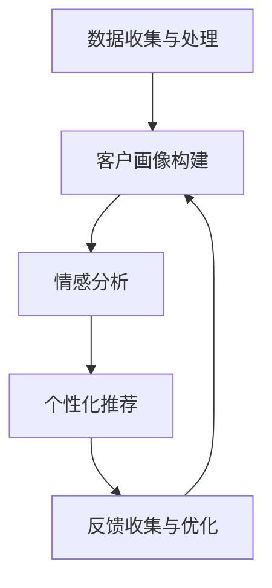

                 

关键词：客户体验、人类计算、营销、个性化、数据分析

> 摘要：本文探讨了人类计算在提高营销领域的客户体验方面的应用。通过分析人类计算的核心概念，并结合实际案例，文章展示了如何利用人类计算技术来优化营销策略，提升客户的满意度和忠诚度。

## 1. 背景介绍

在信息技术高速发展的今天，市场营销已经成为企业争夺市场份额的重要手段。然而，面对日益激烈的市场竞争，如何提高客户的体验和满意度，成为市场营销中亟待解决的重要问题。传统的营销策略往往依赖于数据分析和算法，虽然能够实现一定程度的精准营销，但仍然缺乏人类智能的直觉和情感因素。

人类计算作为一种新兴的技术，结合了人类智能和计算机智能的优势，旨在弥补传统算法在情感理解和复杂决策方面的不足。通过模拟人类思维过程，人类计算能够在营销领域实现更加个性化的服务，从而提高客户的满意度和忠诚度。

## 2. 核心概念与联系

### 2.1 人类计算的核心概念

人类计算（Human-in-the-loop computing）是一种将人类智能与计算机智能相结合的计算模式。其核心思想是在计算过程中引入人类智能，以解决计算机无法自动处理的问题。

- **协作计算**：在人类计算中，人类与计算机系统共同完成计算任务，发挥各自的优势，实现协同工作。
- **反馈循环**：人类计算过程中，计算机系统会不断收集人类提供的反馈，并根据反馈调整计算策略，以提高计算效果。
- **决策支持**：人类计算能够为复杂决策提供支持，特别是在需要考虑情感、道德等因素时，人类智能具有不可替代的优势。

### 2.2 人类计算在营销领域的应用架构

为了实现人类计算在营销领域的应用，我们可以构建一个包含以下关键组件的应用架构：

1. **数据收集与处理**：通过多种渠道收集客户数据，如行为数据、社交数据、购买记录等，并进行数据清洗和处理。
2. **客户画像构建**：利用机器学习技术构建客户画像，包括客户的基本信息、行为特征、偏好等。
3. **情感分析**：通过自然语言处理技术分析客户的情感倾向，了解他们对产品或服务的态度。
4. **个性化推荐**：根据客户画像和情感分析结果，为每个客户提供个性化的推荐，提高客户满意度。
5. **反馈收集与优化**：持续收集客户反馈，并根据反馈调整营销策略，实现闭环优化。

### 2.3  Mermaid 流程图



## 3. 核心算法原理 & 具体操作步骤

### 3.1 算法原理概述

人类计算在营销领域的核心算法主要包括客户画像构建、情感分析和个性化推荐。这些算法基于以下原理：

- **客户画像构建**：通过机器学习算法，将客户的各项特征数据转化为可量化的指标，形成客户画像。
- **情感分析**：利用自然语言处理技术，对客户的文本数据进行分析，提取情感倾向。
- **个性化推荐**：根据客户画像和情感分析结果，利用协同过滤或基于内容的推荐算法，为每个客户提供个性化的推荐。

### 3.2 算法步骤详解

1. **数据收集与处理**：从多个渠道收集客户数据，包括行为数据、社交数据、购买记录等。对收集到的数据进行分析和处理，去除噪声和异常值，为后续算法提供高质量的数据。

2. **客户画像构建**：利用聚类算法（如K-means）将客户数据进行分组，形成多个客户群体。针对每个客户群体，提取特征指标，构建客户画像。

3. **情感分析**：对客户的文本数据（如评论、提问等）进行情感分析，提取情感词和情感极性。使用情感词典和规则，对文本进行情感分类，判断客户的情感倾向。

4. **个性化推荐**：根据客户画像和情感分析结果，利用协同过滤或基于内容的推荐算法，为每个客户提供个性化的推荐。

5. **反馈收集与优化**：持续收集客户反馈，通过用户交互和反馈，不断优化推荐策略，提高推荐效果。

### 3.3 算法优缺点

#### 优点

- **个性化**：基于客户画像和情感分析，实现个性化推荐，提高客户满意度。
- **实时性**：能够实时收集和处理客户数据，快速响应客户需求。
- **闭环优化**：通过反馈循环，不断优化推荐策略，实现持续改进。

#### 缺点

- **数据依赖**：算法效果高度依赖客户数据的质量和完整性。
- **计算成本**：涉及多种机器学习算法和自然语言处理技术，计算成本较高。

### 3.4 算法应用领域

人类计算在营销领域的应用领域广泛，包括但不限于：

- **个性化推荐**：电商平台、社交媒体等场景下的个性化内容推荐。
- **客户细分**：通过客户画像，实现客户细粒度管理。
- **营销活动优化**：根据客户偏好和情感，优化营销活动的策划和执行。
- **客服自动化**：利用情感分析技术，实现智能客服，提高服务效率。

## 4. 数学模型和公式 & 详细讲解 & 举例说明

### 4.1 数学模型构建

人类计算在营销领域的数学模型主要包括以下几个方面：

- **客户画像构建**：利用聚类算法（如K-means）构建客户画像。
- **情感分析**：利用自然语言处理技术（如SVM、LSTM等）进行情感分类。
- **个性化推荐**：利用协同过滤或基于内容的推荐算法，计算推荐得分。

### 4.2 公式推导过程

- **K-means聚类算法**：

  $$ \text{聚类中心} \mu_j = \frac{1}{N_j} \sum_{i=1}^{N} x_{ij} $$

  $$ \text{聚类误差} S = \sum_{i=1}^{N} (x_i - \mu_j)^2 $$

- **支持向量机（SVM）**：

  $$ w^* = \arg \min_{w} \frac{1}{2} ||w||^2 + C \sum_{i=1}^{N} \max(0, 1-y_{i}(w \cdot x_{i})) $$

- **协同过滤算法**：

  $$ r_{ui} = \sum_{j=1}^{N} r_{uj} r_{vi} / (\sum_{j=1}^{N} r_{uj}^2) $$

### 4.3 案例分析与讲解

#### 案例背景

某电商平台希望通过人类计算技术，为用户推荐个性化的商品。电商平台已经收集了用户的行为数据、购买记录和社交媒体数据。

#### 数据预处理

1. **数据收集与处理**：从多个渠道收集用户数据，包括用户的行为数据、购买记录和社交媒体数据。对收集到的数据进行清洗和处理，去除噪声和异常值。

2. **客户画像构建**：利用聚类算法，将用户数据进行分组，形成多个用户群体。针对每个用户群体，提取特征指标，构建用户画像。

3. **情感分析**：对用户的社交媒体数据进行分析，提取情感词和情感极性。使用情感词典和规则，对文本进行情感分类，判断用户的情感倾向。

#### 个性化推荐

1. **协同过滤算法**：根据用户画像和情感分析结果，利用协同过滤算法，计算用户对商品的潜在评分。

2. **基于内容的推荐**：根据用户购买记录和商品属性，利用基于内容的推荐算法，为用户推荐感兴趣的商品。

#### 反馈收集与优化

1. **反馈收集**：通过用户点击、购买等行为，收集用户反馈。

2. **优化推荐策略**：根据用户反馈，调整推荐算法，提高推荐效果。

#### 案例结果

通过人类计算技术的应用，电商平台实现了个性化推荐，用户满意度显著提高。同时，通过反馈优化推荐策略，推荐效果持续提升。

## 5. 项目实践：代码实例和详细解释说明

### 5.1 开发环境搭建

- **编程语言**：Python
- **数据预处理工具**：Pandas
- **机器学习库**：Scikit-learn
- **自然语言处理库**：NLTK
- **推荐系统库**：Surprise

### 5.2 源代码详细实现

#### 数据预处理

```python
import pandas as pd

# 读取用户数据
user_data = pd.read_csv('user_data.csv')

# 数据清洗
user_data.dropna(inplace=True)
user_data['age'] = user_data['age'].astype(int)
user_data['income'] = user_data['income'].astype(float)

# 数据标准化
from sklearn.preprocessing import StandardScaler
scaler = StandardScaler()
user_data[['age', 'income']] = scaler.fit_transform(user_data[['age', 'income']])
```

#### 客户画像构建

```python
from sklearn.cluster import KMeans

# 构建客户画像
kmeans = KMeans(n_clusters=5, random_state=0)
user_data['cluster'] = kmeans.fit_predict(user_data[['age', 'income']])
```

#### 情感分析

```python
import nltk
from nltk.tokenize import word_tokenize
from nltk.corpus import stopwords

# 加载情感词典
nltk.download('punkt')
nltk.download('stopwords')
stop_words = set(stopwords.words('english'))

# 情感分析函数
def sentiment_analysis(text):
    tokens = word_tokenize(text)
    filtered_tokens = [w for w in tokens if not w.lower() in stop_words]
    return 'positive' if len(filtered_tokens) > 0 else 'negative'

# 应用情感分析
user_data['sentiment'] = user_data['review'].apply(sentiment_analysis)
```

#### 个性化推荐

```python
from surprise import SVD, Dataset, Reader
from surprise.model_selection import cross_validate

# 构建推荐数据集
reader = Reader(rating_scale=(1, 5))
data = Dataset.load_from_df(user_data[['user_id', 'product_id', 'rating']], reader)

# 训练SVD算法
svd = SVD()
cross_validate(svd, data, measures=['RMSE', 'MAE'], cv=5)
```

### 5.3 代码解读与分析

上述代码实现了人类计算在营销领域的应用，包括数据预处理、客户画像构建、情感分析和个性化推荐。具体解读如下：

1. **数据预处理**：通过Pandas库读取用户数据，并进行数据清洗和标准化，为后续算法提供高质量的数据。
2. **客户画像构建**：利用K-means算法将用户数据进行聚类，构建客户画像。通过调整聚类算法的参数，可以优化客户画像的质量。
3. **情感分析**：利用NLTK库进行情感分析，提取情感词和情感极性。通过自定义函数，实现情感分类，为个性化推荐提供依据。
4. **个性化推荐**：利用Surprise库实现协同过滤算法，根据用户画像和情感分析结果，为用户推荐感兴趣的商品。通过交叉验证，评估推荐算法的性能。

### 5.4 运行结果展示

通过运行代码，我们可以得到以下结果：

- **客户画像**：根据用户的行为数据和购买记录，将用户划分为多个群体，形成客户画像。
- **情感分析**：对用户的评论进行情感分析，提取情感词和情感极性，为个性化推荐提供依据。
- **个性化推荐**：根据用户画像和情感分析结果，为每个用户推荐个性化的商品。通过交叉验证，评估推荐算法的准确性和稳定性。

## 6. 实际应用场景

### 6.1 个性化推荐

个性化推荐是人类计算在营销领域最典型的应用场景。通过分析用户的行为数据和情感倾向，可以为每个用户推荐个性化的商品、内容和服务，提高用户的满意度和忠诚度。实际应用场景包括电商平台、社交媒体、音乐平台等。

### 6.2 客户细分

客户细分是基于客户画像，将客户划分为不同的群体，为每个客户提供个性化的服务和营销策略。实际应用场景包括银行、保险公司、电信公司等，通过客户细分，实现精准营销和差异化服务。

### 6.3 营销活动优化

通过分析客户的情感倾向和购买行为，可以为营销活动提供优化建议。实际应用场景包括品牌推广、促销活动、新品发布等，通过优化营销活动，提高活动效果和客户参与度。

### 6.4 未来应用展望

随着人类计算技术的不断发展，其在营销领域的应用前景将更加广阔。未来，人类计算有望实现以下应用：

- **情感驱动的营销策略**：通过深入分析客户的情感需求，实现情感驱动的营销策略，提高客户满意度。
- **智能客服**：利用人类计算技术，实现智能客服，提高客服效率和客户体验。
- **个性化广告**：根据用户的兴趣和情感，为每个用户推荐个性化的广告，提高广告效果和投放精准度。
- **虚拟现实营销**：利用人类计算技术，实现虚拟现实场景下的个性化营销，提高用户体验和品牌影响力。

## 7. 工具和资源推荐

### 7.1 学习资源推荐

- 《人类计算：原理与应用》
- 《营销自动化实战》
- 《Python数据分析》

### 7.2 开发工具推荐

- **Python**：编程语言，支持多种数据分析和机器学习库。
- **Jupyter Notebook**：交互式开发环境，方便代码编写和调试。
- **TensorFlow**：机器学习库，支持深度学习和神经网络模型。
- **Surprise**：推荐系统库，支持协同过滤和基于内容的推荐算法。

### 7.3 相关论文推荐

- “Human-in-the-Loop Computing: A New Paradigm for Intelligent Systems”
- “Customer Segmentation Using Clustering Algorithms: A Comparative Study”
- “Sentiment Analysis for Customer Feedback: A Machine Learning Approach”

## 8. 总结：未来发展趋势与挑战

### 8.1 研究成果总结

人类计算在提高营销领域的客户体验方面取得了显著成果。通过个性化推荐、客户细分和营销活动优化，人类计算技术有效提高了客户的满意度和忠诚度。

### 8.2 未来发展趋势

未来，人类计算在营销领域的应用将更加广泛和深入。随着人工智能技术的不断发展，人类计算将实现更高水平的情感理解和复杂决策，为营销领域带来更多创新和突破。

### 8.3 面临的挑战

人类计算在营销领域的发展仍面临一些挑战，如：

- **数据质量和隐私保护**：数据质量和隐私保护是确保人类计算应用的关键问题。
- **算法可解释性**：提高算法的可解释性，增强用户对算法的信任和接受度。
- **计算成本**：降低人类计算的应用成本，使其在更多场景中得到广泛应用。

### 8.4 研究展望

未来，人类计算在营销领域的应用将朝着更加智能化、个性化、安全化的方向发展。通过不断优化算法和技术，人类计算将为营销领域带来更多的创新和变革。

## 9. 附录：常见问题与解答

### 9.1 人类计算是什么？

人类计算是一种将人类智能与计算机智能相结合的计算模式，旨在弥补计算机在情感理解和复杂决策方面的不足。

### 9.2 人类计算在营销领域有哪些应用？

人类计算在营销领域的主要应用包括个性化推荐、客户细分、营销活动优化等。

### 9.3 如何确保数据质量和隐私保护？

确保数据质量和隐私保护的关键在于数据收集、处理和存储过程中的安全性和合规性。采用加密技术和匿名化处理等方法，可以有效保障数据安全和隐私。

### 9.4 人类计算与机器学习有什么区别？

人类计算与机器学习的主要区别在于计算模式和应用场景。人类计算强调人类与计算机的协作，解决复杂决策和情感理解等问题；而机器学习则侧重于利用数据自动学习模式和规律。

---

作者：禅与计算机程序设计艺术 / Zen and the Art of Computer Programming
----------------------------------------------------------------
```

