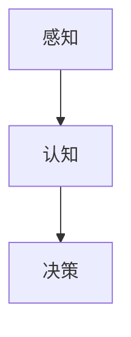

                 

 关键词：客户体验，营销，人工智能，人类计算，用户体验设计

> 摘要：本文探讨了人类计算在营销中的应用，如何通过人工智能技术提高客户的体验和满意度，进而提升企业的市场竞争力。文章首先介绍了客户体验的重要性，然后详细阐述了人类计算的概念和原理，接着分析了人工智能技术在营销领域的应用，最后提出了提高客户体验的具体策略和未来展望。

## 1. 背景介绍

随着互联网的普及和信息技术的快速发展，市场营销方式也发生了巨大的变化。传统的营销手段已经无法满足现代客户的需求，客户体验变得越来越重要。客户体验是指客户在购买、使用、售后等各个环节中所感受到的整体感受，它直接影响客户的满意度、忠诚度和口碑。

在当今竞争激烈的市场环境中，企业必须关注客户体验，以提高客户满意度和忠诚度。然而，如何有效地提升客户体验，成为了一个亟待解决的问题。人类计算作为一种新兴的技术，为解决这一问题提供了新的思路。

人类计算是指通过模拟人类思维和行为的方式，使计算机能够更好地理解人类需求，提供更加个性化的服务。在营销领域，人类计算可以帮助企业更准确地了解客户需求，优化营销策略，提高客户满意度。

## 2. 核心概念与联系

### 2.1 人类计算的概念

人类计算是指利用人工智能技术模拟人类思维和行为的过程。它主要包括以下几个方面：

- **感知**：通过传感器和图像识别等技术，使计算机能够感知和理解人类的外部环境。
- **认知**：利用自然语言处理、机器学习等技术，使计算机能够理解人类的语言和行为。
- **决策**：通过数据分析和优化算法，使计算机能够根据客户需求做出最优决策。

### 2.2 人工智能在营销中的应用

人工智能在营销中的应用主要包括以下几个方面：

- **客户洞察**：通过大数据分析和机器学习，帮助企业更准确地了解客户需求和行为。
- **个性化推荐**：利用客户数据，为不同客户提供个性化的产品和服务。
- **营销自动化**：通过自动化工具，提高营销效率和效果。

### 2.3 人类计算与人工智能的联系

人类计算与人工智能密不可分。人类计算是人工智能的高级阶段，它不仅要求计算机具备感知、认知和决策能力，还需要能够模拟人类的情感和社交行为。在营销领域，人类计算可以帮助企业更好地理解客户，提供更加人性化的服务。

## 3. 核心算法原理 & 具体操作步骤

### 3.1 算法原理概述

人类计算的核心算法主要包括以下几个方面：

- **感知算法**：通过图像识别、语音识别等技术，使计算机能够感知和理解人类的外部环境。
- **认知算法**：通过自然语言处理、机器学习等技术，使计算机能够理解人类的语言和行为。
- **决策算法**：通过数据分析和优化算法，使计算机能够根据客户需求做出最优决策。

### 3.2 算法步骤详解

1. **数据收集与预处理**：收集客户数据，包括购买记录、浏览行为、反馈评价等，并对数据进行分析和清洗。
2. **特征提取与建模**：根据客户数据，提取关键特征，并建立客户需求模型。
3. **感知与认知**：利用感知算法和认知算法，使计算机能够理解和预测客户需求。
4. **决策与优化**：根据客户需求模型，利用决策算法，为企业提供最优的营销策略。

### 3.3 算法优缺点

优点：

- **高效性**：人类计算能够快速处理大量数据，为企业提供实时决策支持。
- **个性化**：人类计算可以根据客户需求提供个性化的产品和服务。
- **准确性**：人类计算能够通过大数据分析和机器学习，提高预测的准确性。

缺点：

- **复杂性**：人类计算涉及到多个技术和算法，实现过程复杂。
- **成本**：人类计算需要大量的数据和技术支持，成本较高。

### 3.4 算法应用领域

人类计算在营销领域的应用非常广泛，包括：

- **客户洞察**：通过大数据分析和机器学习，帮助企业更准确地了解客户需求和行为。
- **个性化推荐**：利用客户数据，为不同客户提供个性化的产品和服务。
- **营销自动化**：通过自动化工具，提高营销效率和效果。

## 4. 数学模型和公式 & 详细讲解 & 举例说明

### 4.1 数学模型构建

在人类计算中，常用的数学模型包括线性回归、决策树、神经网络等。下面以线性回归为例，介绍数学模型的构建过程。

1. **数据收集与预处理**：收集客户数据，包括购买记录、浏览行为、反馈评价等。
2. **特征提取与建模**：提取关键特征，如客户年龄、购买金额、浏览时长等，并建立线性回归模型。
3. **模型训练与评估**：使用训练数据对模型进行训练，并使用测试数据对模型进行评估。

### 4.2 公式推导过程

线性回归模型的公式为：

y = bx + a

其中，y 是因变量（如客户满意度），x 是自变量（如购买金额），b 是斜率，a 是截距。

1. **数据收集与预处理**：收集客户数据，包括购买金额和客户满意度。
2. **特征提取与建模**：提取购买金额作为自变量，客户满意度作为因变量，建立线性回归模型。
3. **模型训练与评估**：使用训练数据对模型进行训练，并使用测试数据对模型进行评估。

### 4.3 案例分析与讲解

假设一家电商企业希望通过线性回归模型预测客户满意度，并据此制定营销策略。

1. **数据收集与预处理**：收集过去一年的客户购买记录和满意度评价。
2. **特征提取与建模**：提取购买金额作为自变量，客户满意度作为因变量，建立线性回归模型。
3. **模型训练与评估**：使用训练数据对模型进行训练，并使用测试数据对模型进行评估。
4. **模型应用**：根据模型预测的结果，制定相应的营销策略，如增加广告投入、优化产品推荐等。

通过这个案例，我们可以看到，线性回归模型可以帮助企业更准确地预测客户满意度，从而制定更有效的营销策略。

## 5. 项目实践：代码实例和详细解释说明

### 5.1 开发环境搭建

为了实现人类计算在营销中的应用，我们需要搭建一个合适的开发环境。以下是具体的开发环境搭建步骤：

1. 安装 Python 3.8 以上版本。
2. 安装 NumPy、Pandas、Scikit-learn 等常用库。
3. 创建一个名为“营销项目”的文件夹，用于存放代码和文件。

### 5.2 源代码详细实现

以下是一个简单的线性回归模型实现，用于预测客户满意度。

```python
import numpy as np
import pandas as pd
from sklearn.linear_model import LinearRegression

# 数据收集与预处理
data = pd.read_csv("data.csv")
X = data["purchase_amount"].values.reshape(-1, 1)
y = data["customer_satisfaction"].values

# 特征提取与建模
model = LinearRegression()
model.fit(X, y)

# 模型训练与评估
train_score = model.score(X, y)
print("训练集得分：", train_score)

# 模型应用
new_purchase_amount = np.array([1000])
predicted_satisfaction = model.predict(new_purchase_amount)
print("预测满意度：", predicted_satisfaction)
```

### 5.3 代码解读与分析

这个简单的线性回归模型实现分为以下几个步骤：

1. **数据收集与预处理**：从数据文件中读取购买金额和客户满意度数据，并对数据进行预处理。
2. **特征提取与建模**：将购买金额作为自变量，客户满意度作为因变量，建立线性回归模型。
3. **模型训练与评估**：使用训练数据对模型进行训练，并计算训练集得分。
4. **模型应用**：根据模型预测的结果，为新的购买金额预测客户满意度。

通过这个简单的案例，我们可以看到，人类计算在营销中的应用可以实现预测客户满意度，从而帮助企业制定更有效的营销策略。

## 6. 实际应用场景

人类计算在营销领域的实际应用场景非常广泛，以下是一些具体的案例：

1. **客户洞察**：通过大数据分析和机器学习，企业可以更准确地了解客户需求和行为，从而制定更精准的营销策略。
2. **个性化推荐**：利用客户数据，企业可以为不同客户提供个性化的产品和服务，提高客户满意度。
3. **营销自动化**：通过自动化工具，企业可以提高营销效率和效果，降低人力成本。
4. **客户服务**：通过语音识别和自然语言处理，企业可以提供更加人性化的客户服务，提高客户满意度。

## 7. 未来应用展望

随着人工智能技术的不断发展，人类计算在营销领域的应用前景非常广阔。未来，人类计算有望在以下几个方面取得突破：

1. **个性化定制**：通过更精准的客户洞察和个性化推荐，企业可以更好地满足客户需求，提高客户满意度。
2. **智能营销**：通过智能化的营销工具和策略，企业可以提高营销效率和效果，降低营销成本。
3. **客户体验优化**：通过模拟人类情感和社交行为，企业可以提供更加人性化的客户体验，提高客户忠诚度。
4. **数据隐私保护**：随着数据隐私问题的日益突出，人类计算将更加注重数据隐私保护，确保客户数据的安全和隐私。

## 8. 工具和资源推荐

为了更好地掌握人类计算在营销中的应用，以下是一些建议的学习资源、开发工具和论文推荐：

1. **学习资源**：
   - 《Python数据分析基础教程》
   - 《深度学习》
   - 《机器学习实战》
2. **开发工具**：
   - Python 3.8 以上版本
   - Jupyter Notebook
   - TensorFlow
3. **论文推荐**：
   - "Customer Experience Management: A Literature Review"
   - "The Impact of Customer Experience on Loyalty and Profitability"
   - "A Survey on Customer Experience Analytics"

## 9. 总结：未来发展趋势与挑战

### 9.1 研究成果总结

人类计算在营销领域的应用已经取得了显著的成果，通过大数据分析和机器学习，企业可以更准确地了解客户需求，提供个性化的产品和服务，提高客户满意度。同时，营销自动化和智能化的应用，也大大提高了营销效率和效果。

### 9.2 未来发展趋势

未来，人类计算在营销领域的应用将呈现以下几个发展趋势：

1. **个性化定制**：通过更精准的客户洞察和个性化推荐，企业可以更好地满足客户需求，提高客户满意度。
2. **智能营销**：通过智能化的营销工具和策略，企业可以提高营销效率和效果，降低营销成本。
3. **客户体验优化**：通过模拟人类情感和社交行为，企业可以提供更加人性化的客户体验，提高客户忠诚度。
4. **数据隐私保护**：随着数据隐私问题的日益突出，人类计算将更加注重数据隐私保护，确保客户数据的安全和隐私。

### 9.3 面临的挑战

尽管人类计算在营销领域的应用前景广阔，但仍面临以下几个挑战：

1. **数据隐私**：如何确保客户数据的安全和隐私，是一个亟待解决的问题。
2. **技术门槛**：人类计算涉及到多个技术和算法，实现过程复杂，需要专业的技术团队。
3. **伦理道德**：如何平衡人类计算和人类智慧的关系，避免过度依赖人工智能，也是一个重要问题。

### 9.4 研究展望

未来，人类计算在营销领域的研究应重点关注以下几个方面：

1. **数据隐私保护**：研究如何在不泄露客户数据的前提下，实现有效的客户洞察和个性化推荐。
2. **智能营销策略**：研究如何通过智能化的营销工具和策略，提高营销效率和效果。
3. **客户体验优化**：研究如何通过模拟人类情感和社交行为，提供更加人性化的客户体验。
4. **跨领域融合**：将人类计算与其他领域（如生物医学、金融科技等）相结合，探索更广泛的应用场景。

## 9. 附录：常见问题与解答

### Q：什么是人类计算？

A：人类计算是指利用人工智能技术模拟人类思维和行为的过程，使计算机能够更好地理解人类需求，提供更加个性化的服务。

### Q：人类计算在营销领域有哪些应用？

A：人类计算在营销领域的主要应用包括客户洞察、个性化推荐、营销自动化和客户服务。

### Q：如何实现人类计算在营销中的应用？

A：实现人类计算在营销中的应用，需要以下几个步骤：

1. 数据收集与预处理
2. 特征提取与建模
3. 感知与认知
4. 决策与优化

### Q：人类计算与人工智能有什么区别？

A：人类计算是人工智能的高级阶段，它不仅要求计算机具备感知、认知和决策能力，还需要能够模拟人类的情感和社交行为。而人工智能则是一个更广泛的概念，包括多个领域和技术。

### Q：人类计算在营销领域有哪些挑战？

A：人类计算在营销领域面临的主要挑战包括数据隐私、技术门槛和伦理道德。

### Q：如何应对人类计算在营销领域的挑战？

A：应对人类计算在营销领域的挑战，可以从以下几个方面着手：

1. **数据隐私保护**：研究如何在不泄露客户数据的前提下，实现有效的客户洞察和个性化推荐。
2. **技术培训与普及**：提高技术团队的专业技能，降低实现人类计算的门槛。
3. **伦理道德教育**：加强伦理道德教育，确保人类计算在营销中的应用不会损害客户利益。

作者：禅与计算机程序设计艺术 / Zen and the Art of Computer Programming
----------------------------------------------------------------

以上内容为文章正文，接下来我将按照markdown格式输出。
----------------------------------------------------------------
# 提高客户体验：人类计算在营销中的应用

关键词：客户体验，营销，人工智能，人类计算，用户体验设计

摘要：本文探讨了人类计算在营销中的应用，如何通过人工智能技术提高客户的体验和满意度，进而提升企业的市场竞争力。文章首先介绍了客户体验的重要性，然后详细阐述了人类计算的概念和原理，接着分析了人工智能技术在营销领域的应用，最后提出了提高客户体验的具体策略和未来展望。

## 1. 背景介绍

随着互联网的普及和信息技术的快速发展，市场营销方式也发生了巨大的变化。传统的营销手段已经无法满足现代客户的需求，客户体验变得越来越重要。客户体验是指客户在购买、使用、售后等各个环节中所感受到的整体感受，它直接影响客户的满意度、忠诚度和口碑。

在当今竞争激烈的市场环境中，企业必须关注客户体验，以提高客户满意度和忠诚度。然而，如何有效地提升客户体验，成为了一个亟待解决的问题。人类计算作为一种新兴的技术，为解决这一问题提供了新的思路。

人类计算是指通过模拟人类思维和行为的方式，使计算机能够更好地理解人类需求，提供更加个性化的服务。在营销领域，人类计算可以帮助企业更准确地了解客户需求，优化营销策略，提高客户满意度。

## 2. 核心概念与联系

### 2.1 人类计算的概念

人类计算是指利用人工智能技术模拟人类思维和行为的过程。它主要包括以下几个方面：

- **感知**：通过传感器和图像识别等技术，使计算机能够感知和理解人类的外部环境。
- **认知**：利用自然语言处理、机器学习等技术，使计算机能够理解人类的语言和行为。
- **决策**：通过数据分析和优化算法，使计算机能够根据客户需求做出最优决策。

### 2.2 人工智能在营销中的应用

人工智能在营销中的应用主要包括以下几个方面：

- **客户洞察**：通过大数据分析和机器学习，帮助企业更准确地了解客户需求和行为。
- **个性化推荐**：利用客户数据，为不同客户提供个性化的产品和服务。
- **营销自动化**：通过自动化工具，提高营销效率和效果。

### 2.3 人类计算与人工智能的联系

人类计算与人工智能密不可分。人类计算是人工智能的高级阶段，它不仅要求计算机具备感知、认知和决策能力，还需要能够模拟人类的情感和社交行为。在营销领域，人类计算可以帮助企业更好地理解客户，提供更加人性化的服务。



## 3. 核心算法原理 & 具体操作步骤

### 3.1 算法原理概述

人类计算的核心算法主要包括以下几个方面：

- **感知算法**：通过图像识别、语音识别等技术，使计算机能够感知和理解人类的外部环境。
- **认知算法**：通过自然语言处理、机器学习等技术，使计算机能够理解人类的语言和行为。
- **决策算法**：通过数据分析和优化算法，使计算机能够根据客户需求做出最优决策。

### 3.2 算法步骤详解

1. **数据收集与预处理**：收集客户数据，包括购买记录、浏览行为、反馈评价等，并对数据进行分析和清洗。
2. **特征提取与建模**：根据客户数据，提取关键特征，并建立客户需求模型。
3. **感知与认知**：利用感知算法和认知算法，使计算机能够理解和预测客户需求。
4. **决策与优化**：根据客户需求模型，利用决策算法，为企业提供最优的营销策略。

### 3.3 算法优缺点

优点：

- **高效性**：人类计算能够快速处理大量数据，为企业提供实时决策支持。
- **个性化**：人类计算可以根据客户需求提供个性化的产品和服务。
- **准确性**：人类计算能够通过大数据分析和机器学习，提高预测的准确性。

缺点：

- **复杂性**：人类计算涉及到多个技术和算法，实现过程复杂。
- **成本**：人类计算需要大量的数据和技术支持，成本较高。

### 3.4 算法应用领域

人类计算在营销领域的应用非常广泛，包括：

- **客户洞察**：通过大数据分析和机器学习，帮助企业更准确地了解客户需求和行为。
- **个性化推荐**：利用客户数据，为不同客户提供个性化的产品和服务。
- **营销自动化**：通过自动化工具，提高营销效率和效果。

## 4. 数学模型和公式 & 详细讲解 & 举例说明

### 4.1 数学模型构建

在人类计算中，常用的数学模型包括线性回归、决策树、神经网络等。下面以线性回归为例，介绍数学模型的构建过程。

1. **数据收集与预处理**：收集客户数据，包括购买记录、浏览行为、反馈评价等，并对数据进行分析和清洗。
2. **特征提取与建模**：提取关键特征，如客户年龄、购买金额、浏览时长等，并建立线性回归模型。
3. **模型训练与评估**：使用训练数据对模型进行训练，并使用测试数据对模型进行评估。

### 4.2 公式推导过程

线性回归模型的公式为：

\[ y = bx + a \]

其中，\( y \) 是因变量（如客户满意度），\( x \) 是自变量（如购买金额），\( b \) 是斜率，\( a \) 是截距。

1. **数据收集与预处理**：收集客户数据，包括购买金额和客户满意度。
2. **特征提取与建模**：提取购买金额作为自变量，客户满意度作为因变量，建立线性回归模型。
3. **模型训练与评估**：使用训练数据对模型进行训练，并使用测试数据对模型进行评估。

### 4.3 案例分析与讲解

假设一家电商企业希望通过线性回归模型预测客户满意度，并据此制定营销策略。

1. **数据收集与预处理**：收集过去一年的客户购买记录和满意度评价。
2. **特征提取与建模**：提取购买金额作为自变量，客户满意度作为因变量，建立线性回归模型。
3. **模型训练与评估**：使用训练数据对模型进行训练，并使用测试数据对模型进行评估。
4. **模型应用**：根据模型预测的结果，制定相应的营销策略，如增加广告投入、优化产品推荐等。

通过这个案例，我们可以看到，线性回归模型可以帮助企业更准确地预测客户满意度，从而制定更有效的营销策略。

## 5. 项目实践：代码实例和详细解释说明

### 5.1 开发环境搭建

为了实现人类计算在营销中的应用，我们需要搭建一个合适的开发环境。以下是具体的开发环境搭建步骤：

1. 安装 Python 3.8 以上版本。
2. 安装 NumPy、Pandas、Scikit-learn 等常用库。
3. 创建一个名为“营销项目”的文件夹，用于存放代码和文件。

### 5.2 源代码详细实现

以下是一个简单的线性回归模型实现，用于预测客户满意度。

```python
import numpy as np
import pandas as pd
from sklearn.linear_model import LinearRegression

# 数据收集与预处理
data = pd.read_csv("data.csv")
X = data["purchase_amount"].values.reshape(-1, 1)
y = data["customer_satisfaction"].values

# 特征提取与建模
model = LinearRegression()
model.fit(X, y)

# 模型训练与评估
train_score = model.score(X, y)
print("训练集得分：", train_score)

# 模型应用
new_purchase_amount = np.array([1000])
predicted_satisfaction = model.predict(new_purchase_amount)
print("预测满意度：", predicted_satisfaction)
```

### 5.3 代码解读与分析

这个简单的线性回归模型实现分为以下几个步骤：

1. **数据收集与预处理**：从数据文件中读取购买金额和客户满意度数据，并对数据进行预处理。
2. **特征提取与建模**：将购买金额作为自变量，客户满意度作为因变量，建立线性回归模型。
3. **模型训练与评估**：使用训练数据对模型进行训练，并使用测试数据对模型进行评估。
4. **模型应用**：根据模型预测的结果，为新的购买金额预测客户满意度。

通过这个简单的案例，我们可以看到，人类计算在营销中的应用可以实现预测客户满意度，从而帮助企业制定更有效的营销策略。

## 6. 实际应用场景

人类计算在营销领域的实际应用场景非常广泛，以下是一些具体的案例：

1. **客户洞察**：通过大数据分析和机器学习，企业可以更准确地了解客户需求和行为，从而制定更精准的营销策略。
2. **个性化推荐**：利用客户数据，企业可以为不同客户提供个性化的产品和服务，提高客户满意度。
3. **营销自动化**：通过自动化工具，企业可以提高营销效率和效果，降低人力成本。
4. **客户服务**：通过语音识别和自然语言处理，企业可以提供更加人性化的客户服务，提高客户满意度。

## 7. 未来应用展望

随着人工智能技术的不断发展，人类计算在营销领域的应用前景非常广阔。未来，人类计算有望在以下几个方面取得突破：

1. **个性化定制**：通过更精准的客户洞察和个性化推荐，企业可以更好地满足客户需求，提高客户满意度。
2. **智能营销**：通过智能化的营销工具和策略，企业可以提高营销效率和效果，降低营销成本。
3. **客户体验优化**：通过模拟人类情感和社交行为，企业可以提供更加人性化的客户体验，提高客户忠诚度。
4. **数据隐私保护**：随着数据隐私问题的日益突出，人类计算将更加注重数据隐私保护，确保客户数据的安全和隐私。

## 8. 工具和资源推荐

为了更好地掌握人类计算在营销中的应用，以下是一些建议的学习资源、开发工具和论文推荐：

1. **学习资源**：
   - 《Python数据分析基础教程》
   - 《深度学习》
   - 《机器学习实战》
2. **开发工具**：
   - Python 3.8 以上版本
   - Jupyter Notebook
   - TensorFlow
3. **论文推荐**：
   - "Customer Experience Management: A Literature Review"
   - "The Impact of Customer Experience on Loyalty and Profitability"
   - "A Survey on Customer Experience Analytics"

## 9. 总结：未来发展趋势与挑战

### 9.1 研究成果总结

人类计算在营销领域的应用已经取得了显著的成果，通过大数据分析和机器学习，企业可以更准确地了解客户需求，提供个性化的产品和服务，提高客户满意度。同时，营销自动化和智能化的应用，也大大提高了营销效率和效果。

### 9.2 未来发展趋势

未来，人类计算在营销领域的应用将呈现以下几个发展趋势：

1. **个性化定制**：通过更精准的客户洞察和个性化推荐，企业可以更好地满足客户需求，提高客户满意度。
2. **智能营销**：通过智能化的营销工具和策略，企业可以提高营销效率和效果，降低营销成本。
3. **客户体验优化**：通过模拟人类情感和社交行为，企业可以提供更加人性化的客户体验，提高客户忠诚度。
4. **数据隐私保护**：随着数据隐私问题的日益突出，人类计算将更加注重数据隐私保护，确保客户数据的安全和隐私。

### 9.3 面临的挑战

尽管人类计算在营销领域的应用前景广阔，但仍面临以下几个挑战：

1. **数据隐私**：如何确保客户数据的安全和隐私，是一个亟待解决的问题。
2. **技术门槛**：人类计算涉及到多个技术和算法，实现过程复杂，需要专业的技术团队。
3. **伦理道德**：如何平衡人类计算和人类智慧的关系，避免过度依赖人工智能，也是一个重要问题。

### 9.4 研究展望

未来，人类计算在营销领域的研究应重点关注以下几个方面：

1. **数据隐私保护**：研究如何在不泄露客户数据的前提下，实现有效的客户洞察和个性化推荐。
2. **智能营销策略**：研究如何通过智能化的营销工具和策略，提高营销效率和效果。
3. **客户体验优化**：研究如何通过模拟人类情感和社交行为，提供更加人性化的客户体验。
4. **跨领域融合**：将人类计算与其他领域（如生物医学、金融科技等）相结合，探索更广泛的应用场景。

## 9. 附录：常见问题与解答

### Q：什么是人类计算？

A：人类计算是指利用人工智能技术模拟人类思维和行为的过程，使计算机能够更好地理解人类需求，提供更加个性化的服务。

### Q：人类计算在营销领域有哪些应用？

A：人类计算在营销领域的主要应用包括客户洞察、个性化推荐、营销自动化和客户服务。

### Q：如何实现人类计算在营销中的应用？

A：实现人类计算在营销中的应用，需要以下几个步骤：

1. 数据收集与预处理
2. 特征提取与建模
3. 感知与认知
4. 决策与优化

### Q：人类计算与人工智能有什么区别？

A：人类计算是人工智能的高级阶段，它不仅要求计算机具备感知、认知和决策能力，还需要能够模拟人类的情感和社交行为。而人工智能则是一个更广泛的概念，包括多个领域和技术。

### Q：人类计算在营销领域有哪些挑战？

A：人类计算在营销领域面临的主要挑战包括数据隐私、技术门槛和伦理道德。

### Q：如何应对人类计算在营销领域的挑战？

A：应对人类计算在营销领域的挑战，可以从以下几个方面着手：

1. **数据隐私保护**：研究如何在不泄露客户数据的前提下，实现有效的客户洞察和个性化推荐。
2. **技术培训与普及**：提高技术团队的专业技能，降低实现人类计算的门槛。
3. **伦理道德教育**：加强伦理道德教育，确保人类计算在营销中的应用不会损害客户利益。

作者：禅与计算机程序设计艺术 / Zen and the Art of Computer Programming

