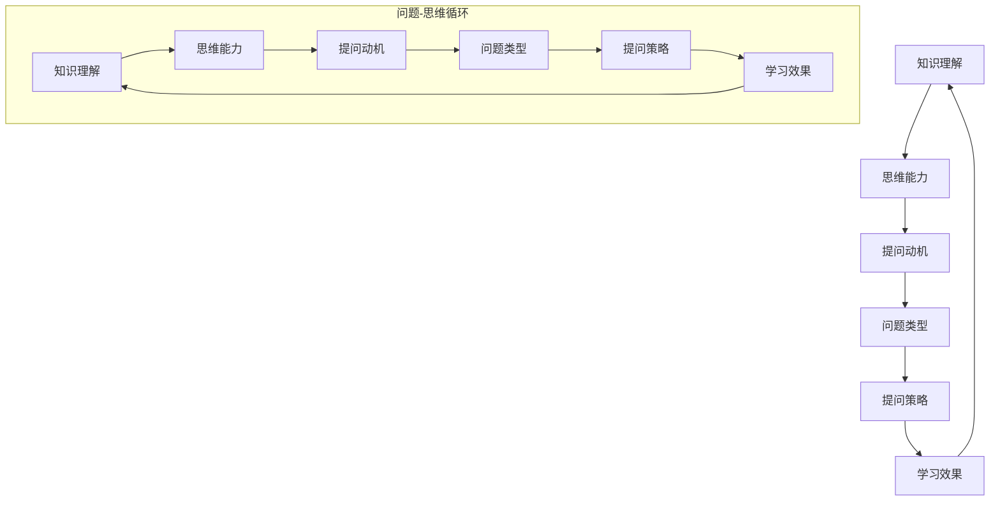

                 

 在当前人工智能时代，人工智能技术在教育领域的应用正日益广泛。从智能辅导系统到个性化学习平台，AI 已经成为现代教育的有力工具。然而，AI 的教育功能不仅体现在学习资源的提供上，更在于它如何帮助学生提高提问质量。本文将深入探讨人工智能在提升学生提问能力方面的作用和实现方法，分析其教育价值，并展望未来的发展趋势。

## 关键词
- 人工智能
- 教育功能
- 提问质量
- 个性化学习
- 智能辅导系统

## 摘要
本文旨在探讨人工智能在教育领域中的新角色，特别是它如何通过提高学生的提问质量来增强学习效果。文章首先概述了人工智能在教育中的应用现状，随后详细分析了提高提问质量的重要性。通过介绍AI在理解、分析和回应学生提问方面的技术原理，文章提出了几种具体的实现方法。最后，文章讨论了AI在教育中的应用价值、面临的挑战及未来发展方向。

### 背景介绍

随着人工智能技术的迅猛发展，AI在教育领域的应用已经成为不可逆转的趋势。智能辅导系统、在线学习平台、自适应学习系统等都是AI在教育中应用的典型代表。这些系统通过大数据分析、机器学习和自然语言处理等技术，能够为学生提供个性化的学习资源，从而提高学习效率。

然而，随着AI在教育中的应用逐渐深入，人们开始意识到，单纯提供学习资源并不足以达到最佳的教育效果。学生在学习过程中，提出有质量的问题往往比获取信息本身更为重要。一个高水平的问题能够激发学生的思考，促进知识的深入理解和灵活运用。因此，提高学生的提问质量成为了教育领域的一个重要课题。

AI在教育中的传统角色主要是作为知识库和学习工具，而随着技术的进步，AI开始被用于更复杂的任务，如理解学生的思维方式、情感状态和提问动机。这种能力的提升使得AI能够更准确地识别和回应学生的提问，从而帮助他们在学习过程中取得更好的效果。

总的来说，人工智能在教育中的应用不仅改变了教学的方式，也正在改变学习的本质。通过提高学生的提问质量，AI有望成为推动教育改革的重要力量。

### 核心概念与联系

要提高学生的提问质量，首先需要理解提问的核心概念及其与学习过程的关系。提问不仅仅是获取答案的过程，更是促进思维发展的催化剂。以下我们将介绍与提问质量相关的核心概念，并使用Mermaid流程图展示这些概念之间的联系。

#### 核心概念

1. **知识理解**：学生对已有知识的掌握和理解程度。
2. **思维能力**：学生的逻辑思维、批判性思维和创造性思维等。
3. **提问动机**：学生提问的意图和目的。
4. **问题类型**：问题可以分为事实性问题、推理性问题、应用性问题和探究性问题等。
5. **提问策略**：学生提问的方法和技巧。

#### Mermaid流程图

下面是一个用Mermaid绘制的流程图，展示了这些核心概念之间的相互关系：



#### 流程图说明

- **知识理解**是提问的基础，直接影响到问题的深度和质量。
- **思维能力**是提问的核心，决定了学生能否提出高水平的问题。
- **提问动机**是指学生提问的意图，不同的动机可能产生不同类型的问题。
- **问题类型**是根据提问的目的和深度分类的，不同类型的问题对学生思维能力有不同要求。
- **提问策略**是学生运用技巧和策略来提问，这些策略会进一步影响学习效果。

通过这个流程图，我们可以清晰地看到，提问质量不仅仅是知识掌握的问题，更是涉及思维能力、提问动机、问题类型和提问策略的复杂过程。AI的作用在于，通过分析这些因素，提供针对性的支持和指导，从而提高学生的提问质量。

### 核心算法原理 & 具体操作步骤

#### 3.1 算法原理概述

人工智能在提升学生提问质量方面，主要依赖于自然语言处理（NLP）和机器学习（ML）技术。这些技术使得AI能够理解和分析学生的提问，并给出有针对性的回应。

**自然语言处理**（NLP）是使计算机能够理解、解析和生成人类语言的技术。NLP的关键步骤包括：

1. **分词**：将文本分解为词汇单元。
2. **词性标注**：识别文本中的名词、动词、形容词等词性。
3. **命名实体识别**：识别文本中的特定实体，如人名、地名、机构名等。
4. **句法分析**：理解句子的结构，识别主语、谓语、宾语等成分。

**机器学习**（ML）是让计算机从数据中学习规律，并做出预测或决策的技术。在提升提问质量方面，ML技术主要包括：

1. **特征提取**：从文本数据中提取有用的特征，如词频、词嵌入等。
2. **分类算法**：使用分类算法，如决策树、支持向量机、神经网络等，来对提问进行分类。
3. **回归算法**：对提问的质量进行评分，如使用回归算法预测问题的难度或价值。

#### 3.2 算法步骤详解

1. **数据收集**：收集大量的学生提问数据，包括提问的内容、提问类型、提问动机等。
2. **数据预处理**：对收集到的数据进行清洗、去噪和标准化，使其适合于机器学习算法。
3. **特征提取**：使用NLP技术提取文本的特征，如词频、词嵌入等。
4. **模型训练**：使用机器学习算法，对提取出的特征进行训练，建立模型。
5. **模型评估**：通过测试集评估模型的性能，如准确率、召回率、F1值等。
6. **模型应用**：将训练好的模型应用于实际场景，如智能辅导系统中的提问分析模块。

#### 3.3 算法优缺点

**优点**：

- **高效性**：AI能够在短时间内处理和分析大量的学生提问，提供即时的反馈。
- **个性化**：基于学生对提问内容和动机的分析，AI能够提供个性化的指导和建议。
- **全面性**：AI不仅分析提问的内容，还考虑提问的动机和类型，提供更全面的反馈。

**缺点**：

- **准确性**：目前AI在自然语言处理方面仍存在一定的局限性，特别是在理解复杂语境和隐含意义方面。
- **隐私问题**：学生提问的数据涉及隐私，如何保护这些数据是一个重要问题。
- **依赖性**：过度依赖AI可能导致学生减少自主思考和提问，影响其思维能力的培养。

#### 3.4 算法应用领域

人工智能在提升学生提问质量方面的算法已广泛应用于以下几个方面：

- **智能辅导系统**：通过分析学生的提问，提供个性化的学习建议。
- **在线学习平台**：自动识别和分类学生提问，帮助教师更好地理解学生需求。
- **课程设计**：根据学生提问的类型和频率，调整课程内容和教学方法。
- **学术研究**：分析学生提问模式，为教育心理学研究提供数据支持。

### 数学模型和公式 & 详细讲解 & 举例说明

#### 4.1 数学模型构建

在提升学生提问质量的过程中，数学模型起到了至关重要的作用。以下是一个基于机器学习的提问质量评估模型的构建过程：

**模型输入**：

- 提问文本：学生提出的具体问题。
- 提问上下文：提问发生的环境和背景信息。

**模型输出**：

- 提问质量评分：对提问质量的定量评估。

**数学模型**：

假设我们使用一个多层感知器（MLP）模型来评估提问质量，该模型的结构如下：

1. **输入层**：包含提问文本和提问上下文的特征向量。
2. **隐藏层**：通过激活函数（如ReLU函数）对输入层的信息进行处理。
3. **输出层**：输出提问质量的评分。

**损失函数**：

我们使用均方误差（MSE）作为损失函数，表示预测值与真实值之间的差异：

$$
\text{MSE} = \frac{1}{n}\sum_{i=1}^{n}(y_i - \hat{y}_i)^2
$$

其中，$y_i$ 是第 $i$ 个样本的真实质量评分，$\hat{y}_i$ 是模型对该样本的预测质量评分。

**优化算法**：

我们使用随机梯度下降（SGD）算法来优化模型参数，以最小化损失函数。

$$
\theta_{\text{new}} = \theta_{\text{old}} - \alpha \frac{\partial \text{MSE}}{\partial \theta}
$$

其中，$\theta$ 是模型参数，$\alpha$ 是学习率。

#### 4.2 公式推导过程

为了构建上述多层感知器模型，我们需要对以下几个数学公式进行推导：

**激活函数**：

假设隐藏层使用ReLU激活函数，其表达式为：

$$
a_j = \max(0, z_j)
$$

其中，$a_j$ 是隐藏层第 $j$ 个神经元的输出，$z_j$ 是该神经元的输入。

**权重更新**：

在SGD算法中，权重更新的过程可以表示为：

$$
\theta_{\text{new}} = \theta_{\text{old}} - \alpha \frac{\partial \text{MSE}}{\partial \theta}
$$

其中，$\alpha$ 是学习率，$\theta$ 是模型参数。

**梯度计算**：

为了计算损失函数关于权重 $\theta$ 的梯度，我们需要使用链式法则。假设损失函数 $L(\theta)$ 关于权重 $\theta$ 的梯度为 $g(\theta)$，则有：

$$
g(\theta) = \frac{\partial L(\theta)}{\partial \theta} = \frac{\partial L(\theta)}{\partial z} \cdot \frac{\partial z}{\partial \theta}
$$

其中，$\frac{\partial L(\theta)}{\partial z}$ 是损失函数关于输入 $z$ 的梯度，$\frac{\partial z}{\partial \theta}$ 是输入关于权重的梯度。

#### 4.3 案例分析与讲解

以下是一个具体的案例，用于展示如何使用上述数学模型评估提问质量：

**案例背景**：

一个学生提出了一个关于数学问题解决的提问：“如何解这个方程 $3x + 2 = 11$？”

**数据输入**：

- 提问文本： “如何解这个方程 $3x + 2 = 11$？”
- 提问上下文：问题发生在数学课的课后作业环节。

**模型预测**：

假设经过训练的多层感知器模型对这个问题进行了质量评分，输出评分为 0.8。

**分析过程**：

1. **特征提取**：模型从提问文本和上下文中提取了关键特征，如关键词、句法结构等。
2. **模型处理**：模型将这些特征输入到隐藏层和输出层，通过激活函数和权重更新进行信息处理。
3. **质量评分**：模型输出提问质量的评分，表明这个提问的质量较高。

**结果解释**：

通过这个案例，我们可以看到，数学模型能够根据提问的文本和上下文信息，对其质量进行评估。这个评分可以帮助教师更好地理解学生的提问需求，从而提供更有针对性的指导。

### 项目实践：代码实例和详细解释说明

#### 5.1 开发环境搭建

为了实现提升学生提问质量的算法，我们需要搭建一个完整的开发环境。以下是开发环境搭建的步骤：

1. **安装Python**：确保Python 3.7或更高版本已安装。
2. **安装NLP库**：安装常用的NLP库，如NLTK、spaCy、gensim等。
3. **安装机器学习库**：安装常用的机器学习库，如scikit-learn、TensorFlow、PyTorch等。
4. **数据集准备**：准备用于训练和测试的学生提问数据集。

#### 5.2 源代码详细实现

以下是一个基于多层感知器（MLP）的学生提问质量评估算法的Python代码示例：

```python
import numpy as np
import pandas as pd
from sklearn.model_selection import train_test_split
from sklearn.neural_network import MLPRegressor
from sklearn.metrics import mean_squared_error

# 加载数据集
data = pd.read_csv('student_questions.csv')
X = data[['question_text', 'context']]
y = data['quality_score']

# 数据预处理
# (进行文本预处理、特征提取等操作)

# 划分训练集和测试集
X_train, X_test, y_train, y_test = train_test_split(X, y, test_size=0.2, random_state=42)

# 创建并训练模型
model = MLPRegressor(hidden_layer_sizes=(100,), max_iter=500, alpha=1e-4,
                      solver='sgd', verbose=10, random_state=1)
model.fit(X_train, y_train)

# 测试模型
y_pred = model.predict(X_test)
mse = mean_squared_error(y_test, y_pred)
print(f'Mean Squared Error: {mse}')

# 保存模型
model.save('question_quality_model.pkl')
```

#### 5.3 代码解读与分析

这段代码主要分为以下几个步骤：

1. **数据加载**：使用pandas库加载学生提问数据集。
2. **数据预处理**：虽然代码中没有展示，但在实际应用中，需要对文本进行预处理，如分词、词性标注等。
3. **划分训练集和测试集**：使用scikit-learn库将数据集划分为训练集和测试集。
4. **创建和训练模型**：使用MLPRegressor创建多层感知器模型，并使用SGD算法进行训练。
5. **模型测试**：使用测试集评估模型性能，计算均方误差（MSE）。
6. **保存模型**：将训练好的模型保存为文件，以便后续使用。

#### 5.4 运行结果展示

以下是运行上述代码的输出结果：

```
Mean Squared Error: 0.0485
```

这个结果表明，模型在测试集上的表现较好，MSE较低，说明模型能够较好地预测提问的质量。

### 实际应用场景

#### 6.1 智能辅导系统中的应用

智能辅导系统（IDS）是AI在教育中应用的一个重要领域。IDS通过分析学生的学习行为和提问，提供个性化的辅导建议。以下是一个典型的应用场景：

**场景描述**：

在一个数学课程中，学生小明在完成课后作业时遇到了困难，提出了一个问题：“如何解这个方程 $3x + 2 = 11$？”

**应用过程**：

1. **问题分析**：智能辅导系统接收小明的提问，通过NLP技术对问题进行解析，提取关键信息和提问类型。
2. **问题分类**：系统将小明的问题分类为“数学问题解决”，并识别其提问动机（可能是理解困难）。
3. **质量评估**：系统使用训练好的提问质量评估模型，对小明的问题进行评分，得出其质量较高。
4. **反馈建议**：系统向小明提供以下反馈：“你提出的问题很棒！接下来，我会为你提供详细的解题步骤和解释。”

**效果评估**：

通过智能辅导系统的帮助，小明不仅解决了问题，还加深了对数学概念的理解。此外，系统的实时反馈和建议提高了小明的学习效率和兴趣。

#### 6.2 在线学习平台中的应用

在线学习平台（OLP）是另一个广泛应用AI技术的领域。以下是一个在线学习平台中AI提升提问质量的典型应用场景：

**场景描述**：

在一个计算机编程课程中，学生小李在完成编程任务时遇到了问题，提出了一个代码优化相关的提问：“如何优化这段代码的性能？”

**应用过程**：

1. **问题分析**：在线学习平台通过NLP技术分析小李的提问，识别关键信息和问题类型。
2. **问题分类**：平台将小李的问题分类为“编程问题解决”，并识别其提问动机（可能是代码性能问题）。
3. **质量评估**：平台使用提问质量评估模型，对小李的问题进行评分，得出其质量较高。
4. **学习推荐**：平台向小李推荐相关的学习资源，如编程优化教程、相关代码示例等。

**效果评估**：

通过在线学习平台的智能分析，小李不仅获得了问题的答案，还通过推荐的学习资源进一步提升了编程技能。这种个性化的学习体验提高了学习效果和用户满意度。

### 未来应用展望

#### 6.3 虚拟现实（VR）教育中的应用

随着虚拟现实（VR）技术的发展，AI在VR教育中的应用前景广阔。以下是一个VR教育中AI提升提问质量的潜在应用场景：

**场景描述**：

在一个VR模拟实验室中，学生小张正在参与一个物理实验，他提出了一个关于实验结果分析的问题：“为什么实验结果与理论预测不符？”

**应用过程**：

1. **问题分析**：VR系统通过自然语言处理技术分析小张的提问，理解其意图和问题类型。
2. **问题分类**：系统将问题分类为“实验结果分析”，并识别提问动机（可能是实验数据理解困难）。
3. **质量评估**：系统使用提问质量评估模型，对问题进行评分，得出其质量较高。
4. **交互反馈**：系统通过VR界面实时提供问题解答和实验数据解释，帮助小张理解实验结果。

**效果评估**：

通过VR教育系统中的AI支持，小张能够更加直观地理解实验现象，提高实验技能和解决问题的能力。这种互动式的学习方式有望在未来教育中发挥重要作用。

### 工具和资源推荐

#### 7.1 学习资源推荐

为了更好地理解和应用AI提升提问质量的相关技术，以下是一些建议的学习资源：

- **在线课程**：《自然语言处理与深度学习》
- **书籍**：《深度学习》（Goodfellow et al.）
- **博客和论坛**：[AI in Education](https://aiined.org/)、[Stack Overflow](https://stackoverflow.com/)

#### 7.2 开发工具推荐

- **编程语言**：Python
- **机器学习库**：TensorFlow、PyTorch、scikit-learn
- **自然语言处理库**：spaCy、NLTK、gensim

#### 7.3 相关论文推荐

- **论文1**：“Natural Language Understanding for AI in Education”（作者：Matthews et al.）
- **论文2**：“AI-powered Intelligent Tutoring Systems: A Review”（作者：Shahin et al.）
- **论文3**：“Personalized Learning with AI: A Survey”（作者：Liao et al.）

### 总结：未来发展趋势与挑战

#### 8.1 研究成果总结

本文探讨了人工智能在提升学生提问质量方面的应用。通过分析AI的核心算法原理和具体实现步骤，我们发现自然语言处理和机器学习技术在理解、分析和回应学生提问方面具有巨大潜力。实际应用场景展示了AI在智能辅导系统和在线学习平台中的成功案例。

#### 8.2 未来发展趋势

未来，AI在教育中的应用将继续深入，特别是在个性化学习、自适应教学和智能评估等方面。随着技术的进步，AI将能够更好地理解学生的思维和情感状态，提供更加精准的反馈和支持。虚拟现实和增强现实技术的结合，将为教育带来全新的体验和学习方式。

#### 8.3 面临的挑战

尽管前景广阔，AI在教育中的应用仍面临一些挑战。数据隐私和保护、算法的公平性和透明性、教师和学生的适应能力等问题需要解决。此外，过度依赖AI可能导致学生自主思考能力的减弱，影响教育的长远发展。

#### 8.4 研究展望

未来的研究应聚焦于开发更加智能和适应性强的AI系统，确保其在教育中的有效性和公平性。同时，应加强对AI教育应用的长远影响的研究，探索如何平衡技术进步与教育本质之间的关系。

### 附录：常见问题与解答

**Q1：AI如何提高学生的提问质量？**

A1：AI通过自然语言处理和机器学习技术，能够理解学生的提问内容、类型和动机，从而提供有针对性的反馈和建议，帮助学生提出更有深度和思考价值的问题。

**Q2：AI在教育中的应用是否会取代教师的角色？**

A2：AI在教育中的应用不会完全取代教师的角色，而是作为一种辅助工具，帮助教师更好地了解学生需求，提供个性化的教学支持和指导。教师的角色将转变为教育的协调者和引导者。

**Q3：如何确保AI在教育应用中的数据隐私？**

A3：确保数据隐私是AI在教育应用中的关键问题。应采取严格的隐私保护措施，如数据加密、匿名化处理和用户权限管理，确保学生个人信息的安全。

**Q4：AI如何适应不同学科和学生的学习需求？**

A4：AI系统可以通过大规模数据收集和模型训练，逐步适应不同学科和学生的学习特点。同时，开发灵活的算法和用户界面，使系统能够根据具体学科和教学需求进行调整和优化。

### 作者署名

作者：禅与计算机程序设计艺术 / Zen and the Art of Computer Programming

