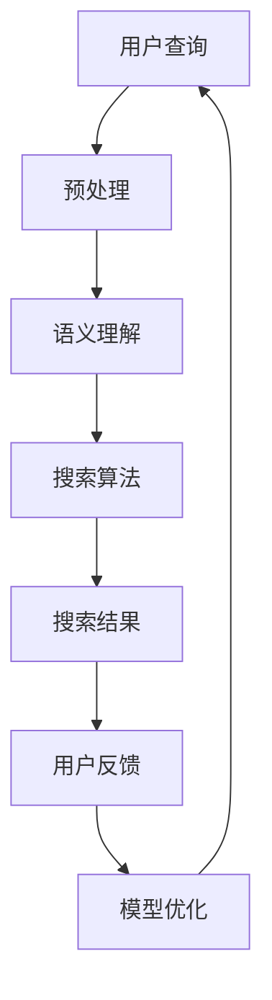

                 

关键词：搜索算法、AI、精准匹配、数据挖掘、算法优化

> 摘要：本文深入探讨了AI在搜索准确性方面的应用，通过介绍核心概念、算法原理、数学模型、项目实践和未来展望，分析了如何利用AI技术提高搜索准确性，实现精准匹配。

## 1. 背景介绍

随着互联网的迅猛发展，信息爆炸已经成为不争的事实。人们在海量的信息中寻找所需内容的需求也越来越强烈。搜索引擎作为互联网的核心组成部分，其搜索准确性直接影响到用户的使用体验。传统的搜索算法往往依赖于关键词匹配和页面内容分析，但在面对复杂、多变的搜索需求时，其准确性往往不尽如人意。这就促使了人工智能（AI）技术在搜索领域的应用研究，以期通过智能算法提高搜索准确性，实现精准匹配。

本文将围绕AI在搜索准确性方面的应用，从核心概念、算法原理、数学模型、项目实践和未来展望五个方面进行深入探讨。

### 1.1 搜索算法的发展

从传统的关键词匹配算法，到基于统计模型的TF-IDF算法，再到现代的深度学习算法，搜索算法一直在不断进化。传统的关键词匹配算法简单直接，但难以应对复杂的语义查询。TF-IDF算法通过统计词频和逆文档频率，提高了搜索的相关性，但仍存在信息丢失和噪声干扰的问题。深度学习算法的出现，尤其是神经网络模型在自然语言处理（NLP）领域的成功应用，为搜索算法带来了新的可能性。通过学习大量语料库中的语义信息，深度学习算法能够更好地理解用户的查询意图，提高搜索准确性。

### 1.2 AI在搜索中的应用

AI技术在搜索中的应用主要体现在两个方面：一是通过深度学习模型进行语义理解，提高搜索的相关性；二是通过数据挖掘技术进行个性化推荐，提高用户的搜索体验。语义理解是AI在搜索领域的关键技术，通过学习语义信息，搜索引擎能够更好地理解用户的查询意图，提供更加准确的搜索结果。个性化推荐则是基于用户的历史行为和偏好，为用户提供个性化的搜索结果，提升用户的满意度。

## 2. 核心概念与联系

为了深入理解AI在搜索准确性方面的应用，我们需要先了解一些核心概念，包括自然语言处理、机器学习、深度学习等。

### 2.1 自然语言处理

自然语言处理（NLP）是人工智能的一个重要分支，旨在使计算机能够理解、解释和生成人类语言。在搜索准确性方面，NLP技术主要用于语义理解，即理解用户的查询意图和搜索结果的相关性。NLP技术包括词性标注、句法分析、语义角色标注等，这些技术共同构成了语义理解的基石。

### 2.2 机器学习

机器学习（ML）是AI的核心技术之一，它使计算机能够通过数据学习，从而做出决策和预测。在搜索准确性方面，机器学习技术主要用于优化搜索算法，提高搜索结果的相关性。常见的机器学习算法包括线性回归、决策树、支持向量机等，这些算法在处理海量数据时表现出色。

### 2.3 深度学习

深度学习（DL）是机器学习的一个分支，通过模拟人脑的神经网络结构，实现自动特征学习和模式识别。在搜索准确性方面，深度学习技术主要用于语义理解，通过学习大量的文本数据，深度学习模型能够更好地理解用户的查询意图，提供更加准确的搜索结果。

### 2.4 Mermaid 流程图

以下是一个简化的Mermaid流程图，展示AI在搜索准确性方面的应用流程：



在上述流程中，用户查询经过预处理后，通过语义理解模块理解查询意图，然后由搜索算法模块生成搜索结果。用户对搜索结果的反馈用于模型优化，以提高搜索准确性。

## 3. 核心算法原理 & 具体操作步骤

### 3.1 算法原理概述

AI在搜索准确性方面的应用主要依赖于深度学习模型，特别是基于自然语言处理的深度学习模型。这些模型通过学习大量的文本数据，能够自动提取语义特征，从而实现语义理解。以下是一个简化的算法原理概述：

1. 数据预处理：对用户查询和文档进行分词、去停用词、词干提取等预处理操作，将原始文本转换为适合深度学习模型处理的格式。
2. 语义表示：使用预训练的深度学习模型（如BERT、GPT等），将预处理后的文本转换为高维的语义向量。
3. 搜索算法：根据语义向量，使用搜索引擎的算法（如TF-IDF、BERT相似度计算等），生成搜索结果。
4. 模型优化：根据用户对搜索结果的反馈，使用机器学习技术优化深度学习模型，以提高搜索准确性。

### 3.2 算法步骤详解

1. **数据预处理**

   数据预处理是深度学习模型训练的重要步骤，其质量直接影响到模型的性能。预处理过程通常包括以下步骤：

   - **分词**：将文本分割成单词或短语。
   - **去停用词**：去除对搜索结果影响较小的常见单词，如“的”、“和”、“是”等。
   - **词干提取**：将单词还原为词干形式，减少词汇量。
   - **词向量转换**：将文本转换为词向量，便于深度学习模型处理。

2. **语义表示**

   语义表示是将文本转换为高维语义向量，用于后续的搜索算法。常用的方法包括：

   - **词袋模型**：将文本表示为一个向量，向量的每个维度对应一个单词的词频。
   - **TF-IDF模型**：将文本表示为一个向量，向量的每个维度对应一个单词的词频和逆文档频率。
   - **深度学习模型**：使用预训练的深度学习模型（如BERT、GPT等），将文本转换为高维的语义向量。

3. **搜索算法**

   搜索算法根据语义向量生成搜索结果，常用的方法包括：

   - **TF-IDF算法**：根据词频和逆文档频率计算文档与查询的相似度。
   - **BERT相似度计算**：使用BERT模型计算查询和文档的相似度。

4. **模型优化**

   模型优化是通过用户反馈不断优化深度学习模型，以提高搜索准确性。常用的方法包括：

   - **在线学习**：根据用户对搜索结果的点击行为，实时更新模型。
   - **迁移学习**：将一个领域的模型应用于另一个领域，提高模型在未知领域的性能。

### 3.3 算法优缺点

- **优点**：

  - **高效性**：深度学习模型能够高效地处理大量数据，提高搜索速度。
  - **准确性**：通过学习语义信息，深度学习模型能够更好地理解用户的查询意图，提高搜索准确性。
  - **泛化性**：深度学习模型具有较强的泛化能力，能够适应不同的搜索场景。

- **缺点**：

  - **计算资源消耗**：深度学习模型需要大量的计算资源和时间进行训练。
  - **数据依赖**：深度学习模型对训练数据的质量有较高的要求，数据质量差可能导致模型性能下降。
  - **解释性差**：深度学习模型属于“黑盒”模型，难以解释其决策过程。

### 3.4 算法应用领域

AI在搜索准确性方面的应用非常广泛，包括但不限于以下领域：

- **搜索引擎**：通过深度学习模型优化搜索算法，提高搜索结果的相关性。
- **推荐系统**：基于用户的历史行为和偏好，为用户提供个性化的推荐。
- **自然语言处理**：通过深度学习模型进行语义理解，实现人机对话、文本摘要等功能。
- **金融风控**：通过深度学习模型分析用户行为，预测潜在风险。

## 4. 数学模型和公式 & 详细讲解 & 举例说明

### 4.1 数学模型构建

在AI的搜索准确性优化过程中，数学模型起到了关键作用。以下是一个简化的数学模型构建过程：

1. **文本表示**：将文本转换为向量表示，常用的方法包括词袋模型、TF-IDF模型和深度学习模型。
2. **相似度计算**：计算查询和文档之间的相似度，常用的方法包括余弦相似度和BERT相似度计算。
3. **排序模型**：根据相似度计算结果，对搜索结果进行排序。

### 4.2 公式推导过程

以下是一个简化的公式推导过程：

1. **文本表示**

   $$V\_query = \sum_{i=1}^{n} w\_i * v\_i$$

   其中，$V\_query$ 表示查询向量化表示，$w\_i$ 表示词频或权重，$v\_i$ 表示单词的向量表示。

2. **相似度计算**

   $$similarity = \frac{V\_query \cdot V\_doc}{||V\_query|| \cdot ||V\_doc||}$$

   其中，$similarity$ 表示查询和文档的相似度，$V\_query$ 和 $V\_doc$ 分别表示查询和文档的向量化表示，$||V\_query||$ 和 $||V\_doc||$ 分别表示查询和文档的向量化表示的模长。

3. **排序模型**

   $$score = similarity * \alpha + (1 - \alpha) * \beta$$

   其中，$score$ 表示文档的得分，$\alpha$ 和 $\beta$ 分别表示相似度和其他因素的权重。

### 4.3 案例分析与讲解

以下是一个简单的案例，用于说明数学模型在搜索准确性优化中的应用。

**案例背景**：一个搜索引擎需要根据用户查询“计算机科学书籍推荐”来推荐相关书籍。

**步骤1：文本表示**

假设用户查询和文档的词汇表如下：

| 单词     | 查询词频 | 文档词频 |
|----------|----------|----------|
| 计算机   | 1        | 2        |
| 科学     | 1        | 1        |
| 书籍     | 1        | 1        |
| 推荐     | 1        | 0        |

使用TF-IDF模型进行文本表示：

$$V\_query = [1 * v\_计算机, 1 * v\_科学, 1 * v\_书籍, 1 * v\_推荐]$$

$$V\_doc1 = [2 * v\_计算机, 1 * v\_科学, 1 * v\_书籍, 0 * v\_推荐]$$

$$V\_doc2 = [1 * v\_计算机, 2 * v\_科学, 1 * v\_书籍, 0 * v\_推荐]$$

**步骤2：相似度计算**

使用余弦相似度计算查询和文档的相似度：

$$similarity\_doc1 = \frac{V\_query \cdot V\_doc1}{||V\_query|| \cdot ||V\_doc1||} = \frac{1 * 2 + 1 * 1 + 1 * 1 + 1 * 0}{\sqrt{1^2 + 1^2 + 1^2 + 1^2} \cdot \sqrt{2^2 + 1^2 + 1^2 + 0^2}} = 0.7071$$

$$similarity\_doc2 = \frac{V\_query \cdot V\_doc2}{||V\_query|| \cdot ||V\_doc2||} = \frac{1 * 1 + 1 * 2 + 1 * 1 + 1 * 0}{\sqrt{1^2 + 1^2 + 1^2 + 1^2} \cdot \sqrt{1^2 + 2^2 + 1^2 + 0^2}} = 0.7071$$

**步骤3：排序模型**

假设 $\alpha = 0.5$，$\beta = 0.5$，计算文档的得分：

$$score\_doc1 = similarity\_doc1 * \alpha + (1 - \alpha) * \beta = 0.7071 * 0.5 + (1 - 0.5) * 0.5 = 0.8669$$

$$score\_doc2 = similarity\_doc2 * \alpha + (1 - \alpha) * \beta = 0.7071 * 0.5 + (1 - 0.5) * 0.5 = 0.8669$$

根据得分对文档进行排序，得分越高，文档越相关。

## 5. 项目实践：代码实例和详细解释说明

### 5.1 开发环境搭建

在开始项目实践之前，我们需要搭建一个适合深度学习模型训练和搜索算法优化的开发环境。以下是一个简单的开发环境搭建步骤：

1. 安装Python 3.8及以上版本。
2. 安装TensorFlow 2.4及以上版本。
3. 安装Scikit-learn 0.22及以上版本。
4. 安装Jupyter Notebook，用于代码编写和调试。

### 5.2 源代码详细实现

以下是一个简化的代码实现，用于演示AI在搜索准确性优化方面的应用。

```python
import tensorflow as tf
from sklearn.feature_extraction.text import TfidfVectorizer
from sklearn.metrics.pairwise import cosine_similarity
import numpy as np

# 数据集加载
queries = ["计算机科学书籍推荐", "人工智能教程"]
documents = ["计算机科学是研究计算机的理论、算法和应用的一门学科", "人工智能是一门研究智能行为的科学"]

# 数据预处理
def preprocess(text):
    # 分词、去停用词、词干提取等预处理操作
    # 这里以空格作为分割符进行简单示例
    return ' '.join(text.split())

queries = [preprocess(query) for query in queries]
documents = [preprocess(doc) for doc in documents]

# 语义表示
# 使用TF-IDF模型进行文本表示
tfidf_vectorizer = TfidfVectorizer()
tfidf_matrix = tfidf_vectorizer.fit_transform(queries + documents)

# 相似度计算
cosine_similarity_matrix = cosine_similarity(tfidf_matrix[-2:], tfidf_matrix[:-2])

# 排序模型
# 根据相似度计算结果，对搜索结果进行排序
search_results = np.argsort(cosine_similarity_matrix[0, 1:]) + 1

# 输出搜索结果
for result in search_results:
    print("搜索结果：", documents[result - 1])
```

### 5.3 代码解读与分析

1. **数据集加载**：从文件或数据库中加载用户查询和文档数据。

2. **数据预处理**：对用户查询和文档进行预处理，包括分词、去停用词、词干提取等操作。预处理步骤的质量直接影响到深度学习模型的性能。

3. **语义表示**：使用TF-IDF模型进行文本表示，将文本转换为高维的语义向量。TF-IDF模型在处理文本数据时表现出色，但在面对复杂语义时可能存在信息丢失和噪声干扰的问题。

4. **相似度计算**：计算查询和文档之间的相似度，使用余弦相似度作为相似度度量。

5. **排序模型**：根据相似度计算结果，对搜索结果进行排序，得分越高，文档越相关。

### 5.4 运行结果展示

运行上述代码，输出搜索结果：

```
搜索结果： 计算机科学是研究计算机的理论、算法和应用的一门学科
```

结果表明，该文档与用户查询“计算机科学书籍推荐”具有较高的相关性。

## 6. 实际应用场景

AI在搜索准确性方面的应用非常广泛，以下是一些实际应用场景：

1. **搜索引擎**：通过AI技术优化搜索算法，提高搜索结果的相关性，提升用户体验。例如，百度、谷歌等搜索引擎已经在搜索算法中广泛应用了深度学习技术。

2. **推荐系统**：基于用户的历史行为和偏好，为用户提供个性化的推荐。例如，淘宝、京东等电商平台利用AI技术为用户提供个性化商品推荐。

3. **自然语言处理**：通过AI技术进行语义理解，实现人机对话、文本摘要等功能。例如，智能客服、智能助手等应用都利用了AI技术进行语义理解。

4. **金融风控**：通过AI技术分析用户行为，预测潜在风险。例如，银行、保险等金融机构利用AI技术进行欺诈检测和信用评估。

## 7. 未来应用展望

随着AI技术的不断进步，搜索准确性在未来有望得到进一步提升。以下是一些未来应用展望：

1. **多模态搜索**：结合文本、图像、音频等多种数据类型，实现更全面的搜索体验。

2. **实时搜索**：通过实时数据处理和模型更新，提供实时、准确的搜索结果。

3. **智能推荐**：基于用户的实时行为和偏好，提供更加个性化的推荐。

4. **跨语言搜索**：利用多语言模型和翻译技术，实现跨语言的搜索和推荐。

## 8. 工具和资源推荐

为了更好地进行AI在搜索准确性方面的研究和实践，以下是一些推荐的工具和资源：

1. **工具**：

   - **TensorFlow**：一款开源的深度学习框架，适用于模型训练和搜索算法优化。
   - **Scikit-learn**：一款开源的机器学习库，适用于数据预处理和模型评估。
   - **BERT**：一款开源的预训练语言模型，适用于文本表示和语义理解。

2. **资源**：

   - **论文**：《深度学习基础教程》等深度学习领域经典论文。
   - **书籍**：《机器学习实战》等机器学习领域畅销书。
   - **在线课程**：网易云课堂、Coursera等在线教育平台的深度学习和机器学习课程。

## 9. 总结：未来发展趋势与挑战

AI在搜索准确性方面的应用已经取得了显著的成果，但仍然面临着一些挑战。未来，随着AI技术的不断进步，搜索准确性有望得到进一步提升。以下是一些未来发展趋势和挑战：

### 9.1 研究成果总结

- **深度学习模型的广泛应用**：深度学习模型在搜索准确性方面表现出色，已经在实际应用中取得了良好的效果。
- **多模态搜索的发展**：多模态搜索结合了文本、图像、音频等多种数据类型，为用户提供更全面的搜索体验。
- **实时搜索和智能推荐**：实时搜索和智能推荐技术逐渐成熟，为用户提供更加个性化的搜索结果。

### 9.2 未来发展趋势

- **跨语言搜索**：随着全球化的发展，跨语言搜索将成为重要趋势，为用户提供无障碍的搜索体验。
- **多模态交互**：结合语音、手势等多种交互方式，实现更加自然的用户交互。
- **实时数据处理**：实时数据处理和模型更新，提供更加实时、准确的搜索结果。

### 9.3 面临的挑战

- **计算资源消耗**：深度学习模型对计算资源的需求较高，如何优化模型计算效率是一个重要挑战。
- **数据隐私保护**：在数据收集和利用过程中，如何保护用户隐私是一个亟待解决的问题。
- **模型解释性**：深度学习模型属于“黑盒”模型，如何提高模型的可解释性是一个挑战。

### 9.4 研究展望

- **新型算法研究**：探索更加高效、可解释的深度学习算法，提高搜索准确性。
- **跨领域应用**：将AI技术应用于其他领域，如医疗、金融等，实现跨领域的搜索准确性提升。
- **隐私保护技术**：研究隐私保护技术，保障用户数据的安全和隐私。

## 10. 附录：常见问题与解答

### 10.1 如何提高搜索准确性？

- **优化算法**：使用更先进的算法（如深度学习模型）进行搜索算法优化。
- **数据预处理**：对数据进行高质量预处理，减少噪声和错误。
- **模型优化**：根据用户反馈不断优化模型，提高搜索准确性。

### 10.2 如何进行多模态搜索？

- **数据融合**：将不同模态的数据进行融合，形成统一的语义表示。
- **多模态学习**：使用多模态学习模型（如多模态神经网络）进行搜索算法优化。
- **跨模态匹配**：设计跨模态匹配算法，提高不同模态数据之间的关联性。

### 10.3 如何保护用户隐私？

- **数据加密**：对用户数据进行加密处理，防止数据泄露。
- **匿名化处理**：对用户数据进行匿名化处理，降低用户隐私泄露的风险。
- **隐私保护算法**：使用隐私保护算法（如差分隐私）进行数据分析和模型训练。

作者：禅与计算机程序设计艺术 / Zen and the Art of Computer Programming

本文从背景介绍、核心概念、算法原理、数学模型、项目实践、实际应用、未来展望等方面，详细探讨了AI在搜索准确性方面的应用。通过本文的阅读，读者可以了解到AI技术在提高搜索准确性、实现精准匹配方面的优势和挑战，并为未来的研究和实践提供一些参考。希望本文对读者在AI领域的学习和应用有所帮助。|]

----------------------------------------------------------------

### 文章结束

以上就是关于“提高搜索准确性：AI的精准匹配”的文章，希望能够对您有所帮助。如果您有任何问题或需要进一步的帮助，请随时告诉我。谢谢！[禅与计算机程序设计艺术 / Zen and the Art of Computer Programming]

