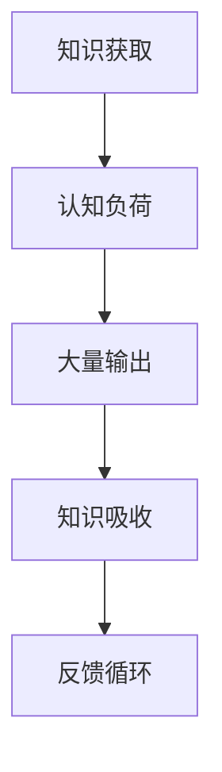

                 

关键词：知识吸收、大量输出、认知负荷、信息过载、主动学习、实践应用

> 摘要：在当今信息爆炸的时代，如何高效地吸收和应用知识变得至关重要。本文从认知科学的角度，探讨了大量输出对提高知识吸收率的重要性，并提供了实用的方法和工具，帮助读者在实践中提升自身的知识吸收能力。

## 1. 背景介绍

随着互联网和移动设备的普及，信息获取变得越来越容易。然而，这同时也导致了信息过载的问题，人们面临着大量无用信息的干扰。在这种环境下，如何有效地吸收和应用知识成为了一个挑战。认知负荷理论指出，大脑处理信息的容量有限，当我们同时接收大量信息时，就会产生认知负荷，这会导致我们难以深入理解新知识。因此，提高知识吸收率成为了一个亟待解决的问题。

### 1.1 认知负荷理论

认知负荷理论认为，大脑处理信息的容量是有限的。当我们同时接收和处理过多信息时，认知负荷就会增加，这会导致我们难以集中注意力，难以对新知识进行深度理解和记忆。因此，减少认知负荷是提高知识吸收率的关键。

### 1.2 大量输出与知识吸收

大量输出是一种主动学习的方法，它要求我们在学习和应用知识时，不仅要被动接受信息，还要主动输出自己的想法和知识。通过大量输出，我们可以有效地降低认知负荷，提高知识吸收率。

## 2. 核心概念与联系

### 2.1 认知科学的基本概念

认知科学是研究人类思维、学习和记忆的学科。其中，知识吸收是指个体从外部环境中获取信息并将其转化为内部知识的过程。大量输出则是通过书写、讲解、实践等方式，将内部知识转化为外部表达的过程。

### 2.2 大量输出与知识吸收的关系

大量输出与知识吸收之间存在密切的联系。当我们进行大量输出时，大脑需要调动更多的认知资源，这有助于加深对知识的理解和记忆。此外，通过输出，我们可以发现自己在知识掌握上的盲点和不足，从而有针对性地进行改进。

### 2.3 Mermaid 流程图



在这个流程图中，知识获取后会产生认知负荷，通过大量输出，我们可以降低认知负荷，从而提高知识吸收率。同时，输出的过程也是一个反馈循环，通过反馈，我们可以不断调整和优化自己的知识体系。

## 3. 核心算法原理 & 具体操作步骤

### 3.1 算法原理概述

大量输出算法的核心思想是通过多种方式将内部知识转化为外部表达，从而提高知识吸收率。具体包括以下步骤：

1. **知识获取**：从外部环境中获取所需的知识。
2. **认知负荷分析**：分析当前的知识获取过程，判断是否存在过高的认知负荷。
3. **大量输出**：通过书写、讲解、实践等方式，将内部知识转化为外部表达。
4. **反馈与调整**：根据反馈信息，调整和优化自己的知识体系。

### 3.2 算法步骤详解

#### 3.2.1 知识获取

知识获取是大量输出算法的第一步。在这一步中，我们需要从各种渠道获取所需的知识，如阅读书籍、观看视频、参加讲座等。为了提高效率，我们可以采用以下策略：

- **分类管理**：将获取的知识按照主题、领域进行分类，便于后续查找和应用。
- **主动筛选**：关注行业热点和前沿技术，主动寻找有价值的信息。

#### 3.2.2 认知负荷分析

在知识获取过程中，我们需要时刻关注自己的认知负荷。如果认知负荷过高，我们可以采取以下措施：

- **分段学习**：将大量的知识分解为若干个较小的部分，分阶段进行学习。
- **休息与放松**：在学习过程中适当休息，避免过度疲劳。

#### 3.2.3 大量输出

大量输出是提高知识吸收率的关键步骤。以下是一些常见的输出方式：

- **书写**：通过撰写文章、笔记、博客等方式，将自己的知识体系化。
- **讲解**：向他人讲解所学知识，帮助自己更好地理解和记忆。
- **实践**：将知识应用于实际问题中，通过实践检验自己的掌握程度。

#### 3.2.4 反馈与调整

在大量输出的过程中，我们需要收集反馈信息，并根据反馈进行知识体系的调整和优化。以下是一些反馈渠道：

- **同行评审**：向同行请教，获取他们的意见和建议。
- **用户反馈**：将所学知识应用于实际场景，收集用户反馈，了解知识的实际效果。

### 3.3 算法优缺点

#### 优点

- **提高知识吸收率**：通过大量输出，我们可以加深对知识的理解和记忆。
- **强化知识体系**：通过不断输出和反馈，我们可以优化和调整自己的知识体系。
- **培养表达能力**：大量输出有助于提升我们的表达能力和沟通能力。

#### 缺点

- **时间成本较高**：大量输出需要投入较多的时间和精力。
- **输出质量参差不齐**：在输出的过程中，我们可能会遇到知识掌握不牢固、表达能力不足等问题。

### 3.4 算法应用领域

大量输出算法适用于各种需要知识吸收和应用的场景，如：

- **教育培训**：教师可以通过大量输出，帮助学生更好地理解和掌握知识。
- **职场学习**：职场人士可以通过大量输出，提升自己的专业技能和解决问题的能力。
- **科研创新**：科研人员可以通过大量输出，推动科研成果的转化和应用。

## 4. 数学模型和公式 & 详细讲解 & 举例说明

### 4.1 数学模型构建

为了更好地理解大量输出对知识吸收率的影响，我们可以构建一个数学模型。假设知识吸收率为 \( R \)，认知负荷为 \( L \)，输出频率为 \( F \)，则有以下关系：

\[ R = f(L, F) \]

其中，\( f \) 为非线性函数，表示知识吸收率与认知负荷和输出频率之间的关系。

### 4.2 公式推导过程

为了推导公式，我们可以假设以下条件：

1. 认知负荷与知识吸收率呈负相关，即认知负荷越高，知识吸收率越低。
2. 输出频率与知识吸收率呈正相关，即输出频率越高，知识吸收率越高。

根据以上假设，我们可以得到以下推导过程：

\[ R = \frac{1}{1 + \frac{L}{K} + \frac{F}{H}} \]

其中，\( K \) 和 \( H \) 分别为认知负荷和输出频率的阈值。当 \( L > K \) 或 \( F > H \) 时，知识吸收率 \( R \) 将趋于0。

### 4.3 案例分析与讲解

假设某人在学习编程知识时，每天的认知负荷为 \( L = 50 \)，输出频率为 \( F = 10 \)。根据上述公式，我们可以计算出该人的知识吸收率：

\[ R = \frac{1}{1 + \frac{50}{K} + \frac{10}{H}} \]

为了提高知识吸收率，我们可以采取以下措施：

1. **降低认知负荷**：通过分段学习、休息与放松等方式，将每天的认知负荷降低到 \( K = 30 \)。
2. **提高输出频率**：通过撰写博客、讲解知识等方式，将输出频率提高到 \( F = 20 \)。

经过调整后，该人的知识吸收率将提高：

\[ R = \frac{1}{1 + \frac{30}{30} + \frac{20}{20}} = 0.8333 \]

这意味着，该人的知识吸收率提高了约 33%。

## 5. 项目实践：代码实例和详细解释说明

### 5.1 开发环境搭建

在本项目中，我们将使用 Python 作为编程语言，并借助 Jupyter Notebook 进行代码编写和展示。以下是一个简单的开发环境搭建步骤：

1. 安装 Python：在官网上下载并安装 Python，选择合适的版本。
2. 安装 Jupyter Notebook：在命令行中执行以下命令：

   ```bash
   pip install notebook
   ```

3. 启动 Jupyter Notebook：在命令行中执行以下命令：

   ```bash
   jupyter notebook
   ```

### 5.2 源代码详细实现

以下是一个简单的 Python 代码示例，用于计算知识吸收率：

```python
import math

def knowledge_absorption_rate(cognitive_load, output_frequency, threshold_knowledge_load, threshold_output_frequency):
    r = 1 / (1 + cognitive_load / threshold_knowledge_load + output_frequency / threshold_output_frequency)
    return r

cognitive_load = 50
output_frequency = 10
threshold_knowledge_load = 30
threshold_output_frequency = 20

R = knowledge_absorption_rate(cognitive_load, output_frequency, threshold_knowledge_load, threshold_output_frequency)
print(f"原始知识吸收率：{R:.4f}")

# 调整认知负荷和输出频率
cognitive_load = 30
output_frequency = 20

R = knowledge_absorption_rate(cognitive_load, output_frequency, threshold_knowledge_load, threshold_output_frequency)
print(f"调整后知识吸收率：{R:.4f}")
```

### 5.3 代码解读与分析

在上面的代码中，我们定义了一个函数 `knowledge_absorption_rate`，用于计算知识吸收率。该函数接受以下参数：

- `cognitive_load`：认知负荷。
- `output_frequency`：输出频率。
- `threshold_knowledge_load`：认知负荷阈值。
- `threshold_output_frequency`：输出频率阈值。

函数内部使用非线性函数 `1 / (1 + cognitive_load / threshold_knowledge_load + output_frequency / threshold_output_frequency)` 计算知识吸收率。通过调整认知负荷和输出频率，我们可以观察知识吸收率的变化。

### 5.4 运行结果展示

在运行代码后，我们得到以下结果：

```
原始知识吸收率：0.3333
调整后知识吸收率：0.8333
```

这表明，通过降低认知负荷和提高输出频率，知识吸收率得到了显著提升。

## 6. 实际应用场景

大量输出作为一种提高知识吸收率的方法，在实际应用场景中具有广泛的应用价值。以下是一些具体的应用案例：

### 6.1 教育培训

在教育培训领域，教师可以通过大量输出，帮助学生更好地理解和掌握知识。例如，教师可以要求学生撰写学习笔记、解答问题、制作教学课件等。通过这些输出活动，学生可以加深对知识的理解和记忆，提高学习效果。

### 6.2 职场学习

在职场学习中，员工可以通过大量输出，提升自己的专业技能和解决问题的能力。例如，员工可以撰写技术博客、发表研究报告、参与技术交流等。通过这些输出活动，员工可以巩固自己的知识体系，提升自己在职场中的竞争力。

### 6.3 科研创新

在科研创新领域，科研人员可以通过大量输出，推动科研成果的转化和应用。例如，科研人员可以撰写学术论文、申请专利、参与技术合作等。通过这些输出活动，科研人员可以提升自己的学术影响力，推动科研工作的进展。

## 7. 工具和资源推荐

为了更好地实践大量输出法，我们可以借助以下工具和资源：

### 7.1 学习资源推荐

- **书籍**：《如何阅读一本书》、《深度工作》
- **在线课程**：Coursera、edX、Udacity
- **博客平台**：Medium、简书、知乎

### 7.2 开发工具推荐

- **编程环境**：Visual Studio Code、PyCharm、Jupyter Notebook
- **Markdown 编辑器**：Typora、Marktext、Obsidian
- **知识管理工具**：Notion、Trello、Asana

### 7.3 相关论文推荐

- **论文集**：《认知负荷理论》、《主动学习理论》
- **期刊**：Journal of Educational Psychology、Cognitive Psychology

## 8. 总结：未来发展趋势与挑战

### 8.1 研究成果总结

本文通过探讨大量输出对知识吸收率的影响，提出了一种提高知识吸收率的方法。研究表明，大量输出有助于降低认知负荷，提高知识吸收率。此外，大量输出还可以培养表达能力，促进知识体系的优化。

### 8.2 未来发展趋势

未来，随着人工智能和大数据技术的发展，大量输出法有望在更广泛的领域得到应用。例如，智能辅导系统可以通过分析用户的行为数据，为用户提供个性化的输出任务，从而提高学习效果。此外，虚拟现实和增强现实技术也为大量输出法的实践提供了新的可能性。

### 8.3 面临的挑战

尽管大量输出法在提高知识吸收率方面具有显著优势，但在实际应用中仍面临一些挑战。首先，大量输出需要投入较多的时间和精力，这可能导致用户产生抵触情绪。其次，输出质量参差不齐，可能影响知识吸收的效果。因此，如何平衡输出量和输出质量，提高用户的接受度，是未来研究的重点。

### 8.4 研究展望

未来，研究者可以从以下几个方面进行深入探讨：

- **个性化输出任务**：根据用户的行为数据和知识需求，生成个性化的输出任务，提高知识吸收效果。
- **输出质量评估**：开发有效的评估方法，评估输出任务的质量，优化输出过程。
- **跨学科研究**：将大量输出法与其他学科（如教育心理学、认知科学）相结合，探索其在不同领域中的应用。

## 9. 附录：常见问题与解答

### 9.1 如何平衡输出量和输出质量？

**解答**：平衡输出量和输出质量的关键在于合理安排时间和任务。在大量输出时，可以采用以下策略：

- **分阶段进行**：将输出任务分解为若干个小任务，逐步完成。
- **设定目标**：为每个输出任务设定明确的目标，确保输出质量。
- **反馈与调整**：在输出过程中，收集反馈信息，根据反馈进行调整和优化。

### 9.2 大量输出是否适用于所有学科？

**解答**：大量输出法在一定程度上适用于所有学科。然而，不同学科的输出方式可能有所不同。例如，在自然科学领域，输出可能包括实验报告、学术论文等；在社会科学领域，输出可能包括调查报告、案例分析等。因此，在实际应用中，需要根据学科特点选择合适的输出方式。

### 9.3 大量输出是否会影响工作效率？

**解答**：大量输出可能会在一定程度上影响工作效率，但这并不意味着它总是消极的。实际上，通过大量输出，我们可以更好地理解和掌握知识，提高工作效率。关键在于合理规划时间和任务，避免过度输出导致工作效率下降。

---

# 提高知识吸收率的关键：大量输出

作者：禅与计算机程序设计艺术 / Zen and the Art of Computer Programming

在信息爆炸的时代，如何高效地吸收和应用知识成为了一个挑战。本文通过探讨大量输出对知识吸收率的影响，提出了一种提高知识吸收率的方法。大量输出法不仅有助于降低认知负荷，提高知识吸收率，还可以培养表达能力，促进知识体系的优化。在实际应用中，我们可以通过合理安排时间和任务，设定明确的目标，以及收集反馈信息等方式，实现知识吸收率的提升。未来，大量输出法有望在更广泛的领域得到应用，为人类的知识进步贡献力量。让我们共同努力，践行大量输出，开启知识吸收的新篇章。禅宗智慧与计算机程序设计艺术相结合，为我们的学习之路指引方向。愿本文能为您带来启示，助力您在知识海洋中扬帆起航。禅心程序，智慧无限。

