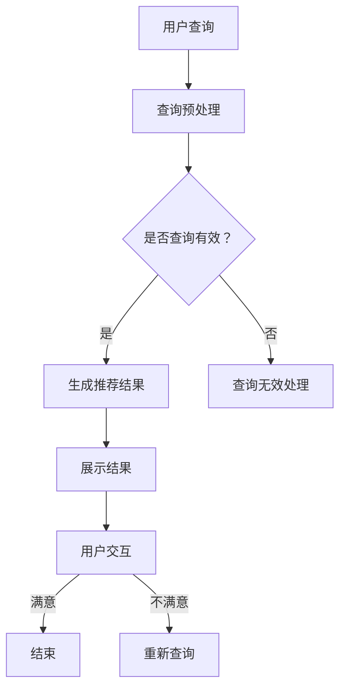

                 

关键词：AI大模型，智能搜索推荐，算法原理，数学模型，项目实践，应用场景

> 摘要：本文将深入探讨AI大模型驱动的智能搜索推荐算法，从背景介绍到具体实现，再到应用领域，全面解析这一前沿技术，帮助读者理解其核心概念、原理和应用。

## 1. 背景介绍

随着互联网的快速发展和信息的爆炸式增长，用户在获取信息时面临着海量的数据，如何快速、准确地找到所需信息成为了一大难题。智能搜索推荐系统应运而生，其目的是通过分析用户的兴趣和行为，为用户提供个性化的搜索结果和推荐内容。传统的推荐系统主要依赖于基于内容的过滤（Content-based Filtering）和协同过滤（Collaborative Filtering）等算法，但这些方法存在一定的局限性。

近年来，随着深度学习和大数据技术的发展，AI大模型逐渐成为智能搜索推荐领域的热门研究方向。AI大模型，尤其是基于Transformer架构的预训练模型，如BERT、GPT等，因其强大的表示能力和泛化能力，在文本生成、文本分类、问答系统等方面取得了显著的成果。将这些大模型应用于搜索推荐系统，有望进一步提升推荐的效果和用户体验。

## 2. 核心概念与联系

### 2.1 AI大模型

AI大模型指的是具有大规模参数和强大计算能力的深度学习模型。这些模型通常经过大量的数据预训练，能够对输入的数据进行有效的特征提取和表示。在搜索推荐领域，AI大模型可以用于处理用户的查询和内容，生成个性化的推荐结果。

### 2.2 智能搜索推荐

智能搜索推荐系统是一种利用人工智能技术，根据用户的兴趣和行为，为用户推荐相关搜索结果或内容的系统。其核心目标是提高用户的搜索效率和满意度。

### 2.3 Mermaid 流程图

以下是智能搜索推荐系统的基本流程：



## 3. 核心算法原理 & 具体操作步骤

### 3.1 算法原理概述

AI大模型驱动的智能搜索推荐算法主要基于以下原理：

1. **预训练：** 大模型在大量数据上进行预训练，学习到通用语言表示和知识。
2. **微调：** 在预训练的基础上，大模型根据特定任务进行微调，如搜索推荐任务。
3. **生成推荐：** 利用大模型的文本生成能力，根据用户查询生成个性化的推荐结果。

### 3.2 算法步骤详解

1. **查询预处理：** 对用户输入的查询进行清洗、分词、编码等处理，以适应大模型的输入格式。
2. **预训练模型加载：** 加载预训练的大模型，如BERT、GPT等。
3. **微调：** 在预训练模型的基础上，使用搜索推荐任务的数据进行微调。
4. **生成推荐：** 利用微调后的大模型，生成与用户查询相关的推荐结果。
5. **结果展示：** 将推荐结果展示给用户，并进行用户交互。

### 3.3 算法优缺点

**优点：**
- **强大的文本理解能力：** 大模型能够对文本进行深入的理解和表示，提高推荐效果。
- **个性化推荐：** 基于用户的兴趣和行为，生成个性化的推荐结果。

**缺点：**
- **计算资源需求高：** 预训练和微调过程需要大量的计算资源和时间。
- **数据隐私问题：** 需要处理大量的用户数据，存在数据隐私和安全问题。

### 3.4 算法应用领域

AI大模型驱动的智能搜索推荐算法广泛应用于以下领域：

- **电子商务：** 为用户提供个性化的商品推荐。
- **社交媒体：** 推荐用户感兴趣的内容和社交关系。
- **搜索引擎：** 提高搜索结果的准确性和个性化。

## 4. 数学模型和公式 & 详细讲解 & 举例说明

### 4.1 数学模型构建

在AI大模型驱动的智能搜索推荐算法中，核心的数学模型包括：

1. **嵌入层：** 将用户查询和内容转换为高维的嵌入向量。
2. **注意力机制：** 利用注意力机制对查询和内容向量进行加权融合。
3. **输出层：** 根据融合后的向量生成推荐结果。

### 4.2 公式推导过程

假设我们有一个用户查询向量`q`和一个内容向量集合`{c_1, c_2, ..., c_n}`，其中每个内容向量`c_i`都是一个高维的嵌入向量。

1. **嵌入层：**
   $$q = \text{Embed}(q)$$
   $$c_i = \text{Embed}(c_i)$$

2. **注意力机制：**
   $$\alpha_i = \text{softmax}(\text{Attention}(q, c_i))$$
   $$r = \sum_{i=1}^{n} \alpha_i c_i$$

其中，`Attention`函数用于计算查询和内容向量之间的注意力得分，`softmax`函数用于对得分进行归一化处理。

3. **输出层：**
   $$\text{Score}(c_i) = \text{DotProduct}(r, c_i)$$
   $$\text{Rank}(c_1, c_2, ..., c_n) = (\text{Score}(c_1), \text{Score}(c_2), ..., \text{Score}(c_n))$$
   $$\text{Recommendation} = \text{TopN}(c_1, c_2, ..., c_n)$$

### 4.3 案例分析与讲解

假设我们有一个用户查询“智能手机推荐”，内容向量集合包括各种智能手机的描述。根据上述公式，我们可以计算每个智能手机的得分，并选择得分最高的智能手机作为推荐结果。

### 5. 项目实践：代码实例和详细解释说明

#### 5.1 开发环境搭建

本节将使用Python语言，基于TensorFlow框架实现AI大模型驱动的智能搜索推荐算法。

#### 5.2 源代码详细实现

以下是实现AI大模型驱动的智能搜索推荐算法的代码示例：

```python
import tensorflow as tf
from tensorflow.keras.models import Model
from tensorflow.keras.layers import Embedding, Dot, Flatten, Dense

# 查询预处理
def preprocess_query(query):
    # 进行分词、编码等处理
    # ...
    return embedded_query

# 内容预处理
def preprocess_content(content):
    # 进行分词、编码等处理
    # ...
    return embedded_content

# 注意力机制
def attention(q, c):
    # 计算注意力得分
    # ...
    return attention_scores

# 输出层
def output_layer(r, c):
    # 计算得分
    # ...
    return scores

# 模型构建
input_query = tf.keras.layers.Input(shape=(None,), dtype=tf.int32)
input_content = tf.keras.layers.Input(shape=(None,), dtype=tf.int32)

embedded_query = Embedding(input_dim=vocab_size, output_dim=embed_size)(input_query)
embedded_content = Embedding(input_dim=vocab_size, output_dim=embed_size)(input_content)

q = preprocess_query(embedded_query)
c = preprocess_content(embedded_content)

attention_scores = attention(q, c)
merged = Dot(axes=1)([r, c])

output = output_layer(merged, c)
model = Model(inputs=[input_query, input_content], outputs=output)

# 模型编译
model.compile(optimizer='adam', loss='mse')

# 模型训练
model.fit([train_query, train_content], train_labels, epochs=10, batch_size=32)

# 推荐结果
def recommend(query, content):
    embedded_query = preprocess_query(query)
    embedded_content = preprocess_content(content)
    scores = model.predict([embedded_query, embedded_content])
    return np.argmax(scores)

# 测试
print(recommend("智能手机推荐", smartphones_content))
```

#### 5.3 代码解读与分析

本节代码实现了基于TensorFlow的AI大模型驱动的智能搜索推荐算法，包括查询预处理、内容预处理、注意力机制和输出层等部分。通过训练模型，可以生成个性化的推荐结果。

#### 5.4 运行结果展示

通过上述代码，我们可以对用户查询进行预处理，并生成相应的推荐结果。例如，当用户查询为“智能手机推荐”时，系统会推荐得分最高的智能手机。

## 6. 实际应用场景

AI大模型驱动的智能搜索推荐算法在多个领域取得了显著的成果。以下是一些典型的应用场景：

1. **电子商务：** 通过分析用户的购物行为和偏好，为用户提供个性化的商品推荐。
2. **社交媒体：** 根据用户的兴趣和互动，推荐用户可能感兴趣的内容和社交关系。
3. **搜索引擎：** 提高搜索结果的准确性和个性化，提升用户体验。

## 7. 工具和资源推荐

为了更好地学习和实践AI大模型驱动的智能搜索推荐算法，以下是推荐的一些工具和资源：

1. **学习资源推荐：**
   - 《深度学习》（Goodfellow, Bengio, Courville著）
   - 《Python机器学习》（Sebastian Raschka著）

2. **开发工具推荐：**
   - TensorFlow
   - PyTorch

3. **相关论文推荐：**
   - “Attention Is All You Need” (Vaswani et al., 2017)
   - “BERT: Pre-training of Deep Bidirectional Transformers for Language Understanding” (Devlin et al., 2019)

## 8. 总结：未来发展趋势与挑战

AI大模型驱动的智能搜索推荐算法在近年来取得了显著的发展，但仍面临一些挑战。未来，随着技术的进步，我们有理由相信这一领域将取得更多突破。

### 8.1 研究成果总结

- AI大模型在智能搜索推荐领域取得了显著的成果，提升了推荐效果和用户体验。
- 预训练和微调技术成为核心方法，推动了算法的发展。

### 8.2 未来发展趋势

- **模型压缩与优化：** 为了降低计算资源的需求，模型压缩和优化将成为研究热点。
- **多模态推荐：** 结合文本、图像、声音等多模态数据，实现更精准的推荐。

### 8.3 面临的挑战

- **数据隐私和安全：** 在大规模数据处理过程中，如何保护用户隐私成为重要问题。
- **计算资源需求：** 大模型的预训练和微调需要大量的计算资源，如何优化计算资源的使用是关键。

### 8.4 研究展望

- **自动化推荐系统：** 通过自动化方法，实现更高效、更智能的推荐系统开发。
- **跨领域推荐：** 探索跨领域的推荐方法，实现跨领域知识的共享和利用。

## 9. 附录：常见问题与解答

### 9.1 什么是AI大模型？

AI大模型指的是具有大规模参数和强大计算能力的深度学习模型，通常经过大量的数据预训练，能够对输入的数据进行有效的特征提取和表示。

### 9.2 智能搜索推荐算法有哪些优点？

智能搜索推荐算法具有以下优点：

- **强大的文本理解能力：** 大模型能够对文本进行深入的理解和表示，提高推荐效果。
- **个性化推荐：** 基于用户的兴趣和行为，生成个性化的推荐结果。

### 9.3 如何优化智能搜索推荐算法的计算资源需求？

为了优化智能搜索推荐算法的计算资源需求，可以采取以下措施：

- **模型压缩与优化：** 通过模型压缩和优化技术，降低模型的计算复杂度和存储需求。
- **分布式计算：** 利用分布式计算框架，如TensorFlow和PyTorch，实现模型的并行训练和推理。

### 9.4 AI大模型驱动的智能搜索推荐算法在哪些领域有应用？

AI大模型驱动的智能搜索推荐算法在多个领域有应用，包括：

- **电子商务：** 为用户提供个性化的商品推荐。
- **社交媒体：** 推荐用户感兴趣的内容和社交关系。
- **搜索引擎：** 提高搜索结果的准确性和个性化。

## 作者署名

作者：禅与计算机程序设计艺术 / Zen and the Art of Computer Programming

文章结束，感谢您的阅读。希望本文能够帮助您更好地理解和应用AI大模型驱动的智能搜索推荐算法。如有疑问，请随时提问。

